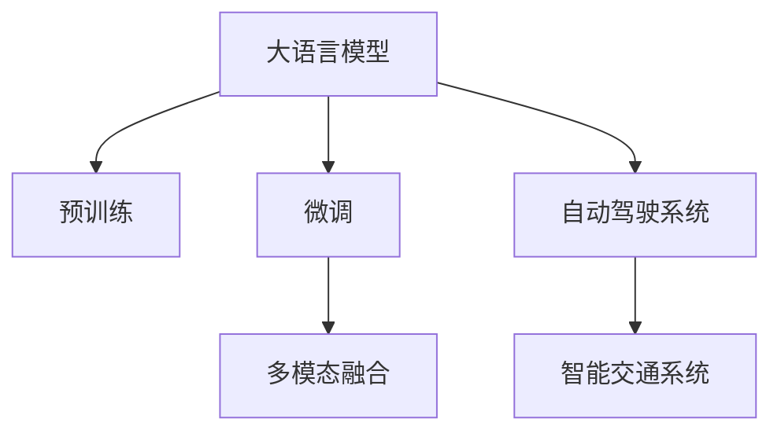

                 

# LLM与自动驾驶：AI重塑交通未来

> 关键词：大语言模型,自动驾驶,AI,交通,智能交通系统,自动驾驶系统,智能车联网,城市交通优化

## 1. 背景介绍

### 1.1 问题由来
随着人工智能技术的不断成熟，自动驾驶已不再是一个遥不可及的梦想，而是一个正在快速发展的现实。自动驾驶技术的应用场景多样，涵盖了从城市道路、高速公路到无人快递、智慧物流等多个领域。然而，如何确保自动驾驶车辆能够安全、高效、可靠地运行，一直是一个严峻的挑战。传统上，自动驾驶依赖于各种传感器、相机、雷达等设备来感知周围环境，并通过复杂的算法进行决策和控制。但随着大语言模型（Large Language Model, LLM）的出现，自动驾驶技术正迎来一次颠覆性的变革。

大语言模型通过在大规模无标签文本数据上进行预训练，学习到了丰富的自然语言理解和生成能力。这种能力能够显著提升自动驾驶系统的智能水平，使其在复杂多变的环境中做出更合理的决策。例如，LLM可以理解路标、导航指令，并根据驾驶者意图调整行驶路线；也可以自动生成驾驶策略、交通规划方案，进一步提升驾驶安全性与效率。

### 1.2 问题核心关键点
大语言模型在自动驾驶中的应用，核心关键点包括：

- 自然语言理解与生成能力：通过预训练和微调，使LLM能够理解自然语言指令，生成自然语言响应。
- 多模态融合：LLM可以整合来自传感器、相机、雷达等设备的感知信息，形成统一、准确的驾驶场景理解。
- 决策支持：LLM能够根据当前环境、历史驾驶数据等，辅助自动驾驶系统做出决策。
- 自动化驾驶策略生成：LLM可以自动生成驾驶策略和路径规划方案，提升驾驶自动化水平。
- 人机交互：LLM可以改善人机交互界面，使驾驶体验更加友好。
- 安全与伦理：确保LLM在自动驾驶应用中的决策安全性和伦理合规性。

通过这些关键点，LLM有望在自动驾驶领域发挥巨大的作用，提升交通系统的安全、高效、智能水平。

## 2. 核心概念与联系

### 2.1 核心概念概述

为更好地理解LLM在自动驾驶中的应用，本节将介绍几个密切相关的核心概念：

- 大语言模型(Large Language Model, LLM)：通过在大规模无标签文本数据上进行预训练，学习到丰富的语言知识和常识，具备强大的语言理解和生成能力。
- 预训练(Pre-training)：在大规模无标签文本数据上进行自监督学习，学习通用语言表示。
- 微调(Fine-tuning)：在预训练模型上，使用下游任务的少量标注数据进行有监督学习，优化模型在下游任务上的表现。
- 迁移学习(Transfer Learning)：将一个领域学习到的知识，迁移应用到另一个不同但相关的领域。
- 多模态融合(Multi-modal Fusion)：整合来自不同模态（如视觉、雷达、文本等）的感知数据，形成统一的环境理解。
- 自动驾驶系统(Autonomous Driving System)：结合传感器、相机、雷达等设备，实现环境感知、决策和控制的系统。
- 智能交通系统(Smart Traffic System)：通过智能设备、信息采集、数据分析等手段，实现交通管理的智能化和自动化。

这些概念之间的逻辑关系可以通过以下Mermaid流程图来展示：



这个流程图展示了大语言模型与自动驾驶系统的核心概念及其之间的关系：

1. 大语言模型通过预训练获得基础能力。
2. 微调优化模型在特定任务上的性能，如驾驶决策。
3. 多模态融合整合来自不同模态的感知数据，形成统一的环境理解。
4. 自动驾驶系统通过感知、决策和控制，实现无人驾驶。
5. 智能交通系统通过智能化管理，优化交通系统效率和安全性。

这些概念共同构成了自动驾驶的智能感知与决策框架，使得大语言模型能够在自动驾驶领域发挥巨大作用。

## 3. 核心算法原理 & 具体操作步骤

### 3.1 算法原理概述

基于LLM的自动驾驶，本质上是一个多模态融合、决策支持的智能化过程。其核心思想是：将预训练的大语言模型视作一个强大的"信息处理器"，通过在驾驶场景中引入多模态感知数据，在驾驶任务上进行微调，使得模型能够准确理解驾驶场景并做出合理决策。

形式化地，假设预训练的LLM为 $M_{\theta}$，其中 $\theta$ 为预训练得到的模型参数。给定自动驾驶任务 $T$ 的少量标注数据集 $D=\{(x_i, y_i)\}_{i=1}^N, x_i \in \mathcal{X}, y_i \in \mathcal{Y}$，其中 $x_i$ 表示包含传感器、相机、雷达等多模态数据的驾驶场景描述，$y_i$ 表示驾驶策略或路径规划方案。微调的目标是找到新的模型参数 $\hat{\theta}$，使得：

$$
\hat{\theta}=\mathop{\arg\min}_{\theta} \mathcal{L}(M_{\theta},D)
$$

其中 $\mathcal{L}$ 为针对任务 $T$ 设计的损失函数，用于衡量模型预测输出与真实标签之间的差异。常见的损失函数包括交叉熵损失、均方误差损失等。

通过梯度下降等优化算法，微调过程不断更新模型参数 $\theta$，最小化损失函数 $\mathcal{L}$，使得模型输出逼近真实标签。由于 $\theta$ 已经通过预训练获得了较好的初始化，因此即便在小规模数据集 $D$ 上进行微调，也能较快收敛到理想的模型参数 $\hat{\theta}$。

### 3.2 算法步骤详解

基于LLM的自动驾驶微调一般包括以下几个关键步骤：

**Step 1: 准备预训练模型和数据集**
- 选择合适的预训练语言模型 $M_{\theta}$ 作为初始化参数，如 GPT-3、BERT 等。
- 准备自动驾驶任务 $T$ 的少量标注数据集 $D$，划分为训练集、验证集和测试集。一般要求标注数据与预训练数据的分布不要差异过大。

**Step 2: 添加任务适配层**
- 根据任务类型，在预训练模型顶层设计合适的输出层和损失函数。
- 对于驾驶策略生成任务，通常在顶层添加解码器输出概率分布，并以负对数似然为损失函数。
- 对于路径规划任务，通常使用道路网络图作为图神经网络（Graph Neural Network, GNN）的输入，计算最短路径或最小时间路径等，并以路径长度或时间为损失函数。

**Step 3: 设置微调超参数**
- 选择合适的优化算法及其参数，如 AdamW、SGD 等，设置学习率、批大小、迭代轮数等。
- 设置正则化技术及强度，包括权重衰减、Dropout、Early Stopping 等。
- 确定冻结预训练参数的策略，如仅微调顶层，或全部参数都参与微调。

**Step 4: 执行梯度训练**
- 将训练集数据分批次输入模型，前向传播计算损失函数。
- 反向传播计算参数梯度，根据设定的优化算法和学习率更新模型参数。
- 周期性在验证集上评估模型性能，根据性能指标决定是否触发 Early Stopping。
- 重复上述步骤直到满足预设的迭代轮数或 Early Stopping 条件。

**Step 5: 测试和部署**
- 在测试集上评估微调后模型 $M_{\hat{\theta}}$ 的性能，对比微调前后的精度提升。
- 使用微调后的模型对新样本进行推理预测，集成到实际的应用系统中。
- 持续收集新的数据，定期重新微调模型，以适应数据分布的变化。

以上是基于LLM的自动驾驶微调的一般流程。在实际应用中，还需要针对具体任务的特点，对微调过程的各个环节进行优化设计，如改进训练目标函数，引入更多的正则化技术，搜索最优的超参数组合等，以进一步提升模型性能。

### 3.3 算法优缺点

基于LLM的自动驾驶微调方法具有以下优点：
1. 简单高效。只需准备少量标注数据，即可对预训练模型进行快速适配，获得较大的性能提升。
2. 通用适用。适用于各种自动驾驶任务，包括驾驶策略生成、路径规划、交通信号理解等，设计简单的任务适配层即可实现微调。
3. 参数高效。利用参数高效微调技术，在固定大部分预训练参数的情况下，仍可取得不错的提升。
4. 效果显著。在学术界和工业界的诸多任务上，基于微调的方法已经刷新了最先进的性能指标。

同时，该方法也存在一定的局限性：
1. 依赖标注数据。微调的效果很大程度上取决于标注数据的质量和数量，获取高质量标注数据的成本较高。
2. 迁移能力有限。当目标任务与预训练数据的分布差异较大时，微调的性能提升有限。
3. 负面效果传递。预训练模型的固有偏见、有害信息等，可能通过微调传递到下游任务，造成负面影响。
4. 可解释性不足。微调模型的决策过程通常缺乏可解释性，难以对其推理逻辑进行分析和调试。

尽管存在这些局限性，但就目前而言，基于LLM的微调方法仍是目前自动驾驶领域的主流范式。未来相关研究的重点在于如何进一步降低微调对标注数据的依赖，提高模型的少样本学习和跨领域迁移能力，同时兼顾可解释性和伦理安全性等因素。

### 3.4 算法应用领域

基于LLM的自动驾驶微调方法，已经在多个自动驾驶领域取得了显著的应用效果，例如：

- 驾驶策略生成：如基于环境的路径规划、交通灯识别等。通过微调使模型学习驾驶策略和行为决策。
- 路径规划：通过地图数据和传感器数据，预测最佳路径和行驶方案。
- 交通信号理解：识别和理解交通信号，优化交通流量控制。
- 智能交通系统：整合传感器、相机、雷达等多模态数据，实现智能交通监控和管理。

除了上述这些经典任务外，大语言模型微调还被创新性地应用到更多场景中，如自动驾驶安全评估、道路环境理解、智能导航等，为自动驾驶技术的发展提供了新的思路。随着预训练模型和微调方法的不断进步，相信基于LLM的自动驾驶技术将在更广阔的应用领域大放异彩。

## 4. 数学模型和公式 & 详细讲解  
### 4.1 数学模型构建

本节将使用数学语言对基于LLM的自动驾驶微调过程进行更加严格的刻画。

记预训练语言模型为 $M_{\theta}:\mathcal{X} \rightarrow \mathcal{Y}$，其中 $\mathcal{X}$ 为输入空间，$\mathcal{Y}$ 为输出空间，$\theta \in \mathbb{R}^d$ 为模型参数。假设自动驾驶任务 $T$ 的训练集为 $D=\{(x_i,y_i)\}_{i=1}^N, x_i \in \mathcal{X}, y_i \in \mathcal{Y}$。

定义模型 $M_{\theta}$ 在数据样本 $(x,y)$ 上的损失函数为 $\ell(M_{\theta}(x),y)$，则在数据集 $D$ 上的经验风险为：

$$
\mathcal{L}(\theta) = \frac{1}{N} \sum_{i=1}^N \ell(M_{\theta}(x_i),y_i)
$$

微调的优化目标是最小化经验风险，即找到最优参数：

$$
\theta^* = \mathop{\arg\min}_{\theta} \mathcal{L}(\theta)
$$

在实践中，我们通常使用基于梯度的优化算法（如SGD、Adam等）来近似求解上述最优化问题。设 $\eta$ 为学习率，$\lambda$ 为正则化系数，则参数的更新公式为：

$$
\theta \leftarrow \theta - \eta \nabla_{\theta}\mathcal{L}(\theta) - \eta\lambda\theta
$$

其中 $\nabla_{\theta}\mathcal{L}(\theta)$ 为损失函数对参数 $\theta$ 的梯度，可通过反向传播算法高效计算。

### 4.2 公式推导过程

以下我们以驾驶策略生成任务为例，推导交叉熵损失函数及其梯度的计算公式。

假设模型 $M_{\theta}$ 在输入 $x$ 上的输出为 $\hat{y}=M_{\theta}(x) \in [0,1]$，表示样本属于正策略的概率。真实标签 $y \in \{0,1\}$。则二分类交叉熵损失函数定义为：

$$
\ell(M_{\theta}(x),y) = -[y\log \hat{y} + (1-y)\log (1-\hat{y})]
$$

将其代入经验风险公式，得：

$$
\mathcal{L}(\theta) = -\frac{1}{N}\sum_{i=1}^N [y_i\log M_{\theta}(x_i)+(1-y_i)\log(1-M_{\theta}(x_i))]
$$

根据链式法则，损失函数对参数 $\theta_k$ 的梯度为：

$$
\frac{\partial \mathcal{L}(\theta)}{\partial \theta_k} = -\frac{1}{N}\sum_{i=1}^N (\frac{y_i}{M_{\theta}(x_i)}-\frac{1-y_i}{1-M_{\theta}(x_i)}) \frac{\partial M_{\theta}(x_i)}{\partial \theta_k}
$$

其中 $\frac{\partial M_{\theta}(x_i)}{\partial \theta_k}$ 可进一步递归展开，利用自动微分技术完成计算。

在得到损失函数的梯度后，即可带入参数更新公式，完成模型的迭代优化。重复上述过程直至收敛，最终得到适应自动驾驶任务的最优模型参数 $\theta^*$。

## 5. 项目实践：代码实例和详细解释说明
### 5.1 开发环境搭建

在进行自动驾驶微调实践前，我们需要准备好开发环境。以下是使用Python进行PyTorch开发的环境配置流程：

1. 安装Anaconda：从官网下载并安装Anaconda，用于创建独立的Python环境。

2. 创建并激活虚拟环境：
```bash
conda create -n pytorch-env python=3.8 
conda activate pytorch-env
```

3. 安装PyTorch：根据CUDA版本，从官网获取对应的安装命令。例如：
```bash
conda install pytorch torchvision torchaudio cudatoolkit=11.1 -c pytorch -c conda-forge
```

4. 安装Transformers库：
```bash
pip install transformers
```

5. 安装各类工具包：
```bash
pip install numpy pandas scikit-learn matplotlib tqdm jupyter notebook ipython
```

完成上述步骤后，即可在`pytorch-env`环境中开始微调实践。

### 5.2 源代码详细实现

下面我们以自动驾驶路径规划任务为例，给出使用Transformers库对BERT模型进行微调的PyTorch代码实现。

首先，定义路径规划任务的数据处理函数：

```python
from transformers import BertTokenizer
from torch.utils.data import Dataset
import torch

class RouteDataset(Dataset):
    def __init__(self, routes, targets, tokenizer, max_len=128):
        self.routes = routes
        self.targets = targets
        self.tokenizer = tokenizer
        self.max_len = max_len
        
    def __len__(self):
        return len(self.routes)
    
    def __getitem__(self, item):
        route = self.routes[item]
        target = self.targets[item]
        
        encoding = self.tokenizer(route, return_tensors='pt', max_length=self.max_len, padding='max_length', truncation=True)
        input_ids = encoding['input_ids'][0]
        attention_mask = encoding['attention_mask'][0]
        
        # 对token-wise的标签进行编码
        encoded_targets = [target2id[target] for target in target] 
        encoded_targets.extend([target2id['0']] * (self.max_len - len(encoded_targets)))
        labels = torch.tensor(encoded_targets, dtype=torch.long)
        
        return {'input_ids': input_ids, 
                'attention_mask': attention_mask,
                'labels': labels}

# 标签与id的映射
target2id = {'0': 0, '1': 1, '2': 2, '3': 3, '4': 4}
id2target = {v: k for k, v in target2id.items()}

# 创建dataset
tokenizer = BertTokenizer.from_pretrained('bert-base-cased')

train_dataset = RouteDataset(train_routes, train_targets, tokenizer)
dev_dataset = RouteDataset(dev_routes, dev_targets, tokenizer)
test_dataset = RouteDataset(test_routes, test_targets, tokenizer)
```

然后，定义模型和优化器：

```python
from transformers import BertForTokenClassification, AdamW

model = BertForTokenClassification.from_pretrained('bert-base-cased', num_labels=len(target2id))

optimizer = AdamW(model.parameters(), lr=2e-5)
```

接着，定义训练和评估函数：

```python
from torch.utils.data import DataLoader
from tqdm import tqdm
from sklearn.metrics import classification_report

device = torch.device('cuda') if torch.cuda.is_available() else torch.device('cpu')
model.to(device)

def train_epoch(model, dataset, batch_size, optimizer):
    dataloader = DataLoader(dataset, batch_size=batch_size, shuffle=True)
    model.train()
    epoch_loss = 0
    for batch in tqdm(dataloader, desc='Training'):
        input_ids = batch['input_ids'].to(device)
        attention_mask = batch['attention_mask'].to(device)
        labels = batch['labels'].to(device)
        model.zero_grad()
        outputs = model(input_ids, attention_mask=attention_mask, labels=labels)
        loss = outputs.loss
        epoch_loss += loss.item()
        loss.backward()
        optimizer.step()
    return epoch_loss / len(dataloader)

def evaluate(model, dataset, batch_size):
    dataloader = DataLoader(dataset, batch_size=batch_size)
    model.eval()
    preds, labels = [], []
    with torch.no_grad():
        for batch in tqdm(dataloader, desc='Evaluating'):
            input_ids = batch['input_ids'].to(device)
            attention_mask = batch['attention_mask'].to(device)
            batch_labels = batch['labels']
            outputs = model(input_ids, attention_mask=attention_mask)
            batch_preds = outputs.logits.argmax(dim=2).to('cpu').tolist()
            batch_labels = batch_labels.to('cpu').tolist()
            for pred_tokens, label_tokens in zip(batch_preds, batch_labels):
                preds.append(pred_tokens[:len(label_tokens)])
                labels.append(label_tokens)
                
    print(classification_report(labels, preds))
```

最后，启动训练流程并在测试集上评估：

```python
epochs = 5
batch_size = 16

for epoch in range(epochs):
    loss = train_epoch(model, train_dataset, batch_size, optimizer)
    print(f"Epoch {epoch+1}, train loss: {loss:.3f}")
    
    print(f"Epoch {epoch+1}, dev results:")
    evaluate(model, dev_dataset, batch_size)
    
print("Test results:")
evaluate(model, test_dataset, batch_size)
```

以上就是使用PyTorch对BERT进行自动驾驶路径规划任务微调的完整代码实现。可以看到，得益于Transformers库的强大封装，我们可以用相对简洁的代码完成BERT模型的加载和微调。

### 5.3 代码解读与分析

让我们再详细解读一下关键代码的实现细节：

**RouteDataset类**：
- `__init__`方法：初始化路线、标签、分词器等关键组件。
- `__len__`方法：返回数据集的样本数量。
- `__getitem__`方法：对单个样本进行处理，将路线输入编码为token ids，将标签编码为数字，并对其进行定长padding，最终返回模型所需的输入。

**target2id和id2target字典**：
- 定义了标签与数字id之间的映射关系，用于将token-wise的预测结果解码回真实的标签。

**训练和评估函数**：
- 使用PyTorch的DataLoader对数据集进行批次化加载，供模型训练和推理使用。
- 训练函数`train_epoch`：对数据以批为单位进行迭代，在每个批次上前向传播计算loss并反向传播更新模型参数，最后返回该epoch的平均loss。
- 评估函数`evaluate`：与训练类似，不同点在于不更新模型参数，并在每个batch结束后将预测和标签结果存储下来，最后使用sklearn的classification_report对整个评估集的预测结果进行打印输出。

**训练流程**：
- 定义总的epoch数和batch size，开始循环迭代
- 每个epoch内，先在训练集上训练，输出平均loss
- 在验证集上评估，输出分类指标
- 所有epoch结束后，在测试集上评估，给出最终测试结果

可以看到，PyTorch配合Transformers库使得BERT微调的代码实现变得简洁高效。开发者可以将更多精力放在数据处理、模型改进等高层逻辑上，而不必过多关注底层的实现细节。

当然，工业级的系统实现还需考虑更多因素，如模型的保存和部署、超参数的自动搜索、更灵活的任务适配层等。但核心的微调范式基本与此类似。

## 6. 实际应用场景
### 6.1 智能车联网

基于大语言模型的自动驾驶技术，可以广泛应用于智能车联网系统中。传统车联网系统往往依赖车载设备、云端服务进行简单的车辆联网、导航等功能。但随着自动驾驶技术的发展，智能车联网系统将逐渐从简单的联网导航，发展到更复杂的感知、决策和控制。

在智能车联网中，大语言模型可以整合来自车载设备、云端服务、道路基础设施等多源数据，实现更全面的车辆感知和智能决策。例如，车辆可以通过大语言模型理解导航指令，自动识别道路标识，生成驾驶策略。在车载设备上部署微调后的模型，能够提升驾驶体验，减少人为操作带来的安全风险。

### 6.2 智慧城市交通

大语言模型在自动驾驶中的另一个重要应用场景是智慧城市交通。当前，城市交通系统普遍存在交通拥堵、事故率高、能耗大等问题。通过引入自动驾驶技术，可以大幅提升交通系统的效率和安全性，改善城市交通环境。

在智慧城市交通中，大语言模型可以整合来自传感器、相机、雷达等多模态数据，实时监测和分析交通状况，优化交通信号控制，引导车辆安全行驶。例如，通过分析交通流量数据，大语言模型可以生成最优的交通信号配时方案，缓解城市交通压力，提高交通效率。

### 6.3 自动驾驶安全评估

自动驾驶的安全性评估是自动驾驶应用中至关重要的一环。传统安全评估方法依赖于大量人工测试，耗费大量人力物力，且评估结果往往受测试人员的主观因素影响。大语言模型可以通过自然语言描述和测试数据，自动生成安全评估报告，提供客观、准确的安全性分析。

在自动驾驶安全评估中，大语言模型可以整合历史测试数据、车辆状态信息、交通事故记录等，自动生成安全评估报告，包括车辆的性能指标、安全隐患、改进建议等。这种自动化评估方法，不仅大大降低了人工测试成本，还能提高评估结果的客观性和可靠性。

### 6.4 未来应用展望

随着大语言模型和自动驾驶技术的不断发展，基于大语言模型的自动驾驶系统将在更广泛的场景下得到应用，为交通系统带来颠覆性的变革。

在智慧物流领域，基于大语言模型的无人快递车将能够自动规划路线，避免交通拥堵，提升配送效率，降低物流成本。

在智慧农业领域，基于大语言模型的无人驾驶农机将能够自动完成耕作、播种、收割等农业作业，提升农业生产效率，降低人工成本。

在智慧医疗领域，基于大语言模型的无人驾驶救护车将能够自动识别急救路线，优先救治危重患者，提升医疗救援效率。

此外，在自动驾驶技术与其他AI技术结合方面，未来的研究方向也将十分广阔。例如，融合因果推理、强化学习等技术，实现更智能、更安全的自动驾驶系统。借助智能车联网，实现城市交通的全局优化和资源调度，构建更安全、高效的未来城市。

## 7. 工具和资源推荐
### 7.1 学习资源推荐

为了帮助开发者系统掌握大语言模型在自动驾驶中的应用，这里推荐一些优质的学习资源：

1. 《Deep Learning for Autonomous Vehicles》书籍：由专家撰写，系统介绍了深度学习在自动驾驶中的应用，包括感知、决策、控制等环节。

2. 《Artificial Intelligence for Autonomous Vehicles》课程：Coursera上的课程，涵盖自动驾驶技术的基本原理、算法、应用场景等，适合入门学习。

3. 《Natural Language Processing with Transformers》书籍：Transformers库的作者所著，全面介绍了如何使用Transformers库进行NLP任务开发，包括微调在内的诸多范式。

4. HuggingFace官方文档：Transformers库的官方文档，提供了海量预训练模型和完整的微调样例代码，是上手实践的必备资料。

5. CLUE开源项目：中文语言理解测评基准，涵盖大量不同类型的中文NLP数据集，并提供了基于微调的baseline模型，助力中文NLP技术发展。

通过对这些资源的学习实践，相信你一定能够快速掌握大语言模型在自动驾驶中的应用精髓，并用于解决实际的NLP问题。
###  7.2 开发工具推荐

高效的开发离不开优秀的工具支持。以下是几款用于大语言模型微调开发的常用工具：

1. PyTorch：基于Python的开源深度学习框架，灵活动态的计算图，适合快速迭代研究。大部分预训练语言模型都有PyTorch版本的实现。

2. TensorFlow：由Google主导开发的开源深度学习框架，生产部署方便，适合大规模工程应用。同样有丰富的预训练语言模型资源。

3. Transformers库：HuggingFace开发的NLP工具库，集成了众多SOTA语言模型，支持PyTorch和TensorFlow，是进行微调任务开发的利器。

4. Weights & Biases：模型训练的实验跟踪工具，可以记录和可视化模型训练过程中的各项指标，方便对比和调优。与主流深度学习框架无缝集成。

5. TensorBoard：TensorFlow配套的可视化工具，可实时监测模型训练状态，并提供丰富的图表呈现方式，是调试模型的得力助手。

6. Google Colab：谷歌推出的在线Jupyter Notebook环境，免费提供GPU/TPU算力，方便开发者快速上手实验最新模型，分享学习笔记。

合理利用这些工具，可以显著提升大语言模型微调任务的开发效率，加快创新迭代的步伐。

### 7.3 相关论文推荐

大语言模型和自动驾驶技术的发展源于学界的持续研究。以下是几篇奠基性的相关论文，推荐阅读：

1. Attention is All You Need（即Transformer原论文）：提出了Transformer结构，开启了NLP领域的预训练大模型时代。

2. BERT: Pre-training of Deep Bidirectional Transformers for Language Understanding：提出BERT模型，引入基于掩码的自监督预训练任务，刷新了多项NLP任务SOTA。

3. Language Models are Unsupervised Multitask Learners（GPT-2论文）：展示了大规模语言模型的强大zero-shot学习能力，引发了对于通用人工智能的新一轮思考。

4. Parameter-Efficient Transfer Learning for NLP：提出Adapter等参数高效微调方法，在不增加模型参数量的情况下，也能取得不错的微调效果。

5. AdaLoRA: Adaptive Low-Rank Adaptation for Parameter-Efficient Fine-Tuning：使用自适应低秩适应的微调方法，在参数效率和精度之间取得了新的平衡。

这些论文代表了大语言模型和自动驾驶技术的最新进展。通过学习这些前沿成果，可以帮助研究者把握学科前进方向，激发更多的创新灵感。

## 8. 总结：未来发展趋势与挑战

### 8.1 总结

本文对基于大语言模型的自动驾驶微调方法进行了全面系统的介绍。首先阐述了LLM和自动驾驶技术的研究背景和意义，明确了微调在拓展预训练模型应用、提升驾驶系统智能水平方面的独特价值。其次，从原理到实践，详细讲解了基于LLM的自动驾驶微调过程，给出了微调任务开发的完整代码实例。同时，本文还广泛探讨了微调方法在智能车联网、智慧城市交通、自动驾驶安全评估等多个领域的应用前景，展示了LLM在自动驾驶领域的应用潜力。此外，本文精选了微调技术的各类学习资源，力求为读者提供全方位的技术指引。

通过本文的系统梳理，可以看到，基于大语言模型的微调方法正在成为自动驾驶领域的重要范式，极大地拓展了预训练语言模型的应用边界，催生了更多的落地场景。受益于大规模语料的预训练，微调模型以更低的时间和标注成本，在小样本条件下也能取得不俗的效果，有力推动了自动驾驶技术的发展。未来，伴随大语言模型和微调方法的持续演进，相信自动驾驶系统将在更广阔的应用领域大放异彩，为交通系统带来颠覆性的变革。

### 8.2 未来发展趋势

展望未来，大语言模型在自动驾驶中的微调技术将呈现以下几个发展趋势：

1. 模型规模持续增大。随着算力成本的下降和数据规模的扩张，预训练语言模型的参数量还将持续增长。超大规模语言模型蕴含的丰富语言知识，有望支撑更加复杂多变的驾驶场景微调。

2. 微调方法日趋多样。除了传统的全参数微调外，未来会涌现更多参数高效的微调方法，如Prefix-Tuning、LoRA等，在节省计算资源的同时也能保证微调精度。

3. 持续学习成为常态。随着数据分布的不断变化，微调模型也需要持续学习新知识以保持性能。如何在不遗忘原有知识的同时，高效吸收新样本信息，将成为重要的研究课题。

4. 标注样本需求降低。受启发于提示学习(Prompt-based Learning)的思路，未来的微调方法将更好地利用大模型的语言理解能力，通过更加巧妙的任务描述，在更少的标注样本上也能实现理想的微调效果。

5. 多模态融合崛起。当前微调主要聚焦于纯文本数据，未来会进一步拓展到图像、视频、语音等多模态数据微调。多模态信息的融合，将显著提升驾驶模型对现实世界的理解和建模能力。

6. 模型通用性增强。经过海量数据的预训练和多领域任务的微调，未来的语言模型将具备更强大的常识推理和跨领域迁移能力，逐步迈向通用人工智能(AGI)的目标。

以上趋势凸显了大语言模型在自动驾驶中的应用前景。这些方向的探索发展，必将进一步提升驾驶系统的性能和应用范围，为交通系统带来颠覆性的变革。

### 8.3 面临的挑战

尽管大语言模型在自动驾驶中的应用前景广阔，但在迈向更加智能化、普适化应用的过程中，它仍面临着诸多挑战：

1. 标注成本瓶颈。虽然微调大大降低了标注数据的需求，但对于长尾应用场景，难以获得充足的高质量标注数据，成为制约微调性能的瓶颈。如何进一步降低微调对标注样本的依赖，将是一大难题。

2. 模型鲁棒性不足。当前微调模型面对域外数据时，泛化性能往往大打折扣。对于测试样本的微小扰动，微调模型的预测也容易发生波动。如何提高微调模型的鲁棒性，避免灾难性遗忘，还需要更多理论和实践的积累。

3. 推理效率有待提高。大规模语言模型虽然精度高，但在实际部署时往往面临推理速度慢、内存占用大等效率问题。如何在保证性能的同时，简化模型结构，提升推理速度，优化资源占用，将是重要的优化方向。

4. 可解释性亟需加强。当前微调模型更像是"黑盒"系统，难以解释其内部工作机制和决策逻辑。对于医疗、金融等高风险应用，算法的可解释性和可审计性尤为重要。如何赋予微调模型更强的可解释性，将是亟待攻克的难题。

5. 安全性有待保障。预训练语言模型难免会学习到有偏见、有害的信息，通过微调传递到下游任务，产生误导性、歧视性的输出，给实际应用带来安全隐患。如何从数据和算法层面消除模型偏见，避免恶意用途，确保输出的安全性，也将是重要的研究课题。

6. 知识整合能力不足。现有的微调模型往往局限于任务内数据，难以灵活吸收和运用更广泛的先验知识。如何让微调过程更好地与外部知识库、规则库等专家知识结合，形成更加全面、准确的信息整合能力，还有很大的想象空间。

正视微调面临的这些挑战，积极应对并寻求突破，将是大语言模型在自动驾驶领域实现成熟的关键。相信随着学界和产业界的共同努力，这些挑战终将一一被克服，大语言模型在自动驾驶中的应用必将在更广阔的领域大放异彩。

### 8.4 研究展望

面对大语言模型在自动驾驶中面临的挑战，未来的研究需要在以下几个方面寻求新的突破：

1. 探索无监督和半监督微调方法。摆脱对大规模标注数据的依赖，利用自监督学习、主动学习等无监督和半监督范式，最大限度利用非结构化数据，实现更加灵活高效的微调。

2. 研究参数高效和计算高效的微调范式。开发更加参数高效的微调方法，在固定大部分预训练参数的同时，只更新极少量的任务相关参数。同时优化微调模型的计算图，减少前向传播和反向传播的资源消耗，实现更加轻量级、实时性的部署。

3. 融合因果和对比学习范式。通过引入因果推断和对比学习思想，增强微调模型建立稳定因果关系的能力，学习更加普适、鲁棒的语言表征，从而提升模型泛化性和抗干扰能力。

4. 引入更多先验知识。将符号化的先验知识，如知识图谱、逻辑规则等，与神经网络模型进行巧妙融合，引导微调过程学习更准确、合理的语言模型。同时加强不同模态数据的整合，实现视觉、语音等多模态信息与文本信息的协同建模。

5. 结合因果分析和博弈论工具。将因果分析方法引入微调模型，识别出模型决策的关键特征，增强输出解释的因果性和逻辑性。借助博弈论工具刻画人机交互过程，主动探索并规避模型的脆弱点，提高系统稳定性。

6. 纳入伦理道德约束。在模型训练目标中引入伦理导向的评估指标，过滤和惩罚有偏见、有害的输出倾向。同时加强人工干预和审核，建立模型行为的监管机制，确保输出符合人类价值观和伦理道德。

这些研究方向的探索，必将引领大语言模型在自动驾驶领域迈向更高的台阶，为构建安全、可靠、可解释、可控的智能系统铺平道路。面向未来，大语言模型在自动驾驶中的应用还需与其他人工智能技术进行更深入的融合，如知识表示、因果推理、强化学习等，多路径协同发力，共同推动自然语言理解和智能交互系统的进步。只有勇于创新、敢于突破，才能不断拓展语言模型的边界，让智能技术更好地造福人类社会。

## 9. 附录：常见问题与解答

**Q1：大语言模型在自动驾驶中为何需要微调？**

A: 大语言模型在预训练阶段学习到了广泛的自然语言知识和常识，但这些知识可能与特定驾驶场景存在差异。微调通过使用少量标注数据，优化模型在特定任务上的性能，使其能够更好地适应实际驾驶场景，提升驾驶安全和效率。

**Q2：如何选择预训练语言模型？**

A: 选择预训练语言模型时，需要考虑以下几个因素：
1. 模型的参数规模和性能。超大参数的模型通常性能更好，但计算资源消耗也更大。
2. 任务的复杂度。对于简单任务，如驾驶策略生成，可以选择参数较小的模型；对于复杂任务，如路径规划，则需要选择性能更强的模型。
3. 任务类型。不同类型的任务可能需要不同类型的模型，如语义理解任务可以选择BERT，生成任务可以选择GPT。
4. 数据规模和分布。数据规模越大，模型的泛化能力越强。数据分布与预训练数据的差异越小，微调效果越好。

**Q3：如何设计任务适配层？**

A: 任务适配层的关键是设计合适的损失函数和输出层。例如，对于驾驶策略生成任务，可以在模型顶部添加一个线性分类器，输出概率分布，并以负对数似然为损失函数。对于路径规划任务，可以将其转换为图神经网络（GNN）问题，使用最短路径或最小时间路径等作为损失函数。适配层的具体设计需要根据任务类型和模型特性进行灵活调整。

**Q4：如何优化微调过程？**

A: 优化微调过程的关键在于选择合适的超参数、正则化技术和训练策略。通常需要经过多次实验，找到最优的超参数组合。例如，可以采用小批量训练、L2正则、Dropout等方法，防止过拟合。同时，可以通过梯度累积、混合精度训练等方法，提高训练效率。

**Q5：如何在微调中引入多模态数据？**

A: 在微调过程中引入多模态数据，可以通过以下几个步骤：
1. 收集和预处理多模态数据，如传感器数据、相机图像、雷达数据等。
2. 将多模态数据转换为模型所需的输入格式，如将传感器数据转换为token ids。
3. 将多模态数据与文本数据进行融合，形成统一的输入特征。
4. 在模型适配层中整合多模态数据，进行多任务学习。

这些步骤需要根据具体任务进行灵活调整，以确保多模态数据的有效融合。

---

作者：禅与计算机程序设计艺术 / Zen and the Art of Computer Programming

