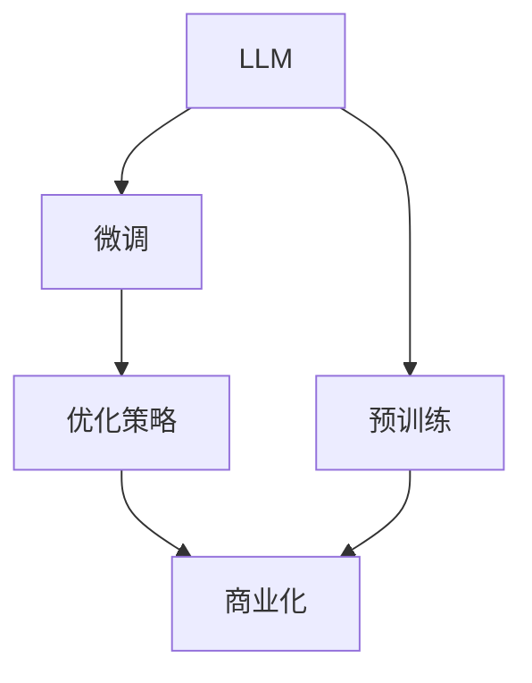
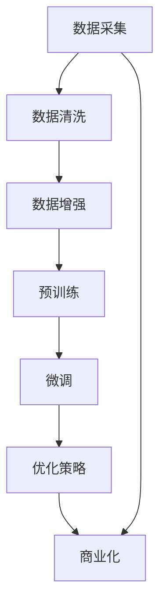

                 

# LLM产业链:从混沌到清晰

> 关键词：LLM产业链,LLM应用,LLM产业链优化,LLM优化策略,LLM商业化

## 1. 背景介绍

### 1.1 问题由来
随着人工智能技术的不断成熟，语言模型（Language Model, LLM）的应用越来越广泛。从简单的文本分类、机器翻译到复杂的对话系统、问答系统，LLM在各个领域都展示了其强大的能力。然而，LLM在应用过程中也面临着诸多挑战，如模型复杂度高、训练成本大、性能不稳定等。为了更好地优化LLM的产业链，本文将深入探讨LLM产业链的各个环节，提出一套从混沌到清晰的优化策略。

### 1.2 问题核心关键点
LLM产业链的优化需要考虑多个关键点，包括数据质量、模型架构、训练策略、优化方法、应用场景等。本文将详细阐述每个环节的重要性和优化策略，旨在为LLM的应用提供更清晰的指导。

### 1.3 问题研究意义
通过优化LLM产业链，可以有效提升LLM的性能和可靠性，降低应用成本，加速其商业化进程。LLM产业链的清晰化将为开发者提供更明确的指导，帮助他们更好地利用LLM技术解决实际问题，推动人工智能技术的普及和应用。

## 2. 核心概念与联系

### 2.1 核心概念概述

为了更好地理解LLM产业链的优化策略，首先需要明确几个核心概念：

- **LLM（语言模型）**：一种基于深度学习的模型，用于处理自然语言文本数据，如图像识别、语音识别、文本分类等。
- **预训练**：指在大规模无标签数据上，通过自监督学习任务对模型进行训练的过程。
- **微调**：指在预训练模型的基础上，使用有标签数据进行进一步训练，优化模型在特定任务上的性能。
- **优化策略**：指在LLM训练和应用过程中，采用的一系列优化措施，如数据增强、正则化、集成学习等，以提升模型性能和鲁棒性。
- **商业化**：指将LLM技术转化为实际应用的过程，包括模型部署、服务化、市场推广等环节。

这些核心概念之间的联系如图：



### 2.2 核心概念原理和架构的 Mermaid 流程图



## 3. 核心算法原理 & 具体操作步骤

### 3.1 算法原理概述

LLM产业链的优化策略主要集中在两个阶段：预训练和微调。预训练阶段，通过大规模无标签数据训练LLM，使其具备通用的语言表示能力。微调阶段，利用少量有标签数据，进一步优化模型在特定任务上的性能。

预训练的目的是学习通用的语言表示，微调的目的是优化特定任务下的模型性能。优化策略旨在提升模型的性能和鲁棒性，从而更好地适应实际应用场景。

### 3.2 算法步骤详解

#### 3.2.1 预训练阶段

1. **数据采集**：采集大规模无标签文本数据，如互联网文本、新闻、百科等。数据采集应确保数据来源多样、内容丰富，以提高模型的泛化能力。
2. **数据清洗**：对采集到的数据进行去重、去噪、分词等预处理，确保数据质量。数据清洗的目的是提升预训练效果，降低模型噪音。
3. **预训练模型**：选择合适的预训练模型架构，如Transformer、BERT、GPT等。在预训练过程中，使用自监督学习任务，如语言模型预测、掩码语言模型预测等，优化模型参数。

#### 3.2.2 微调阶段

1. **任务定义**：根据具体应用场景，定义微调任务。如文本分类、命名实体识别、机器翻译等。
2. **数据准备**：准备微调任务的有标签数据集，划分为训练集、验证集和测试集。
3. **模型初始化**：将预训练模型作为初始化参数，进行微调。通常采用较小的学习率，以避免破坏预训练权重。
4. **微调模型**：在微调过程中，采用优化算法（如SGD、Adam等）更新模型参数，最小化损失函数。常用的损失函数包括交叉熵、均方误差等。
5. **模型评估**：在验证集上评估微调后的模型性能，根据评估结果调整模型参数，确保模型泛化能力。

### 3.3 算法优缺点

#### 3.3.1 优点

- **性能提升**：通过预训练和微调，LLM在特定任务上的性能显著提升。
- **泛化能力**：预训练模型具备较强的泛化能力，能在不同领域和任务中表现出色。
- **成本低**：微调相比于从头训练，所需的标注数据量较小，成本较低。

#### 3.3.2 缺点

- **依赖标注数据**：微调和优化策略的效果很大程度上依赖标注数据的质量和数量。标注成本较高。
- **模型复杂度高**：预训练模型参数量大，训练和推理复杂度高。
- **鲁棒性不足**：微调模型在面对域外数据时，泛化性能可能较差。

### 3.4 算法应用领域

预训练和微调技术已被广泛应用于各个领域，如自然语言处理、计算机视觉、语音识别等。在自然语言处理领域，LLM的预训练和微调技术已应用于文本分类、命名实体识别、机器翻译等任务，取得了显著的成果。

## 4. 数学模型和公式 & 详细讲解 & 举例说明

### 4.1 数学模型构建

预训练阶段，常用的自监督学习任务包括掩码语言模型（Masked Language Model, MLM）和下一句预测（Next Sentence Prediction, NSP）。掩码语言模型预测的损失函数为：

$$
\mathcal{L}_{MLM} = -\sum_{i=1}^N \log \frac{p(y_i|x_i)}
$$

其中，$x_i$ 为输入文本，$y_i$ 为掩码位置对应的文本，$p(y_i|x_i)$ 为模型预测的概率。

下一句预测任务的目标是预测一个句子是否是另一个句子的下一句。常用的损失函数为：

$$
\mathcal{L}_{NSP} = -\sum_{i=1}^N \log \frac{p(x_{i+1}|x_i)}{1-p(x_{i+1}|x_i)}
$$

其中，$x_i$ 为输入的句子对，$p(x_{i+1}|x_i)$ 为模型预测的概率。

微调阶段，常用的损失函数包括交叉熵损失和均方误差损失。交叉熵损失函数为：

$$
\mathcal{L} = -\frac{1}{N}\sum_{i=1}^N \sum_{j=1}^C y_j \log p(y_j|x_i)
$$

其中，$x_i$ 为输入文本，$y_j$ 为标签，$p(y_j|x_i)$ 为模型预测的概率。

### 4.2 公式推导过程

以BERT模型为例，其预训练阶段采用掩码语言模型和下一句预测任务。具体来说，BERT模型在预训练过程中，通过 masked token 预测和 next sentence prediction 两个任务，最大化 log-likelihood，从而优化模型参数。

微调阶段，BERT模型采用基于交叉熵损失的微调方法。假设微调任务为文本分类，其损失函数为：

$$
\mathcal{L} = -\frac{1}{N}\sum_{i=1}^N \sum_{j=1}^K y_j \log p(y_j|x_i)
$$

其中，$x_i$ 为输入文本，$y_j$ 为分类标签，$p(y_j|x_i)$ 为模型预测的概率。

### 4.3 案例分析与讲解

以BERT模型的微调为例，说明其应用过程。假设我们需要对 BERT 模型进行电影评论情感分类的微调，具体步骤如下：

1. **数据准备**：准备电影评论数据集，划分为训练集、验证集和测试集。
2. **模型初始化**：使用 BERT 模型的预训练参数作为初始化参数。
3. **微调模型**：在训练集上，通过交叉熵损失函数进行微调，最小化损失函数。
4. **模型评估**：在验证集上评估微调后的模型性能，调整模型参数，确保模型泛化能力。
5. **测试集评估**：在测试集上评估微调后的模型性能，获取最终结果。

## 5. 项目实践：代码实例和详细解释说明

### 5.1 开发环境搭建

在 Python 环境中，我们可以使用 PyTorch 和 Transformers 库进行 LLM 的预训练和微调。具体步骤如下：

1. **安装 PyTorch 和 Transformers 库**：

```bash
pip install torch transformers
```

2. **配置环境**：

```bash
python -m torch.distributed.launch --nproc_per_node 4 train.py
```

### 5.2 源代码详细实现

以下是一个简单的 BERT 模型微调示例，用于电影评论情感分类。

```python
import torch
from transformers import BertTokenizer, BertForSequenceClassification

# 定义模型和优化器
model = BertForSequenceClassification.from_pretrained('bert-base-uncased', num_labels=2)
optimizer = AdamW(model.parameters(), lr=1e-5)

# 加载预训练模型和分词器
tokenizer = BertTokenizer.from_pretrained('bert-base-uncased')

# 加载训练数据
train_data = load_train_data()
dev_data = load_dev_data()

# 微调模型
def train_epoch(model, optimizer, train_data, batch_size):
    model.train()
    for batch in train_data:
        input_ids = batch['input_ids'].to(device)
        attention_mask = batch['attention_mask'].to(device)
        labels = batch['labels'].to(device)
        model.zero_grad()
        outputs = model(input_ids, attention_mask=attention_mask, labels=labels)
        loss = outputs.loss
        loss.backward()
        optimizer.step()

# 评估模型
def evaluate(model, dev_data, batch_size):
    model.eval()
    total_pred, total_label = 0, 0
    for batch in dev_data:
        input_ids = batch['input_ids'].to(device)
        attention_mask = batch['attention_mask'].to(device)
        labels = batch['labels'].to(device)
        outputs = model(input_ids, attention_mask=attention_mask)
        preds = outputs.logits.argmax(dim=1).to('cpu').tolist()
        for pred, label in zip(preds, labels):
            total_pred += pred
            total_label += label
    acc = total_pred / total_label
    return acc

# 微调过程
device = torch.device('cuda' if torch.cuda.is_available() else 'cpu')
model.to(device)
for epoch in range(10):
    train_epoch(model, optimizer, train_data, batch_size)
    acc = evaluate(model, dev_data, batch_size)
    print(f'Epoch {epoch+1}, accuracy: {acc:.2f}')
```

### 5.3 代码解读与分析

上述代码实现了 BERT 模型在电影评论情感分类任务上的微调过程。关键步骤包括：

1. **模型初始化**：使用 BERT 的预训练参数作为初始化参数。
2. **数据加载**：加载训练集和验证集的数据，并进行预处理。
3. **微调模型**：在训练集上进行微调，最小化损失函数。
4. **模型评估**：在验证集上评估模型性能，调整模型参数。
5. **输出结果**：获取最终的微调结果。

## 6. 实际应用场景

### 6.1 智能客服系统

智能客服系统是 LLM 应用的重要场景之一。通过微调 LLM，系统可以理解用户意图，提供个性化的服务。具体实现步骤如下：

1. **数据准备**：准备历史客服对话记录，将其标注为问题-答案对。
2. **模型训练**：在标注数据上训练 LLM，优化模型对用户意图的理解能力。
3. **模型部署**：将微调后的模型部署到生产环境中，实现自动化客服服务。

### 6.2 金融舆情监测

金融舆情监测是 LLM 的另一重要应用场景。通过微调 LLM，系统可以实时监测金融市场舆情，预测市场变化趋势，辅助决策。具体实现步骤如下：

1. **数据准备**：准备金融领域相关的新闻、报道、评论等文本数据，并进行标注。
2. **模型训练**：在标注数据上训练 LLM，优化模型对金融舆情的理解能力。
3. **模型部署**：将微调后的模型部署到金融监管机构，实时监测舆情变化。

### 6.3 个性化推荐系统

个性化推荐系统是 LLM 在电商、视频、新闻等领域的广泛应用。通过微调 LLM，系统可以理解用户偏好，推荐个性化内容。具体实现步骤如下：

1. **数据准备**：准备用户行为数据和物品描述数据，并进行标注。
2. **模型训练**：在标注数据上训练 LLM，优化模型对用户偏好的理解能力。
3. **模型部署**：将微调后的模型部署到推荐系统，实现个性化推荐。

### 6.4 未来应用展望

未来，随着 LLM 技术的不断进步，其在各个领域的应用将更加广泛。例如：

1. **医疗领域**：通过微调 LLM，系统可以辅助医生诊断疾病，推荐治疗方案。
2. **教育领域**：通过微调 LLM，系统可以智能回答学生问题，推荐学习资源。
3. **智慧城市**：通过微调 LLM，系统可以监测城市事件，预测灾害风险，提升城市管理水平。
4. **自动驾驶**：通过微调 LLM，系统可以理解人类语言指令，辅助自动驾驶决策。

## 7. 工具和资源推荐

### 7.1 学习资源推荐

为了帮助开发者系统掌握 LLM 的预训练和微调技术，这里推荐一些优质的学习资源：

1. **《深度学习入门》**：清华大学出版社，李宏毅著，全面介绍深度学习的基础知识和实践技巧。
2. **《自然语言处理综论》**：清华大学出版社，刘挺著，深入讲解自然语言处理的理论基础和前沿技术。
3. **《Transformers: State-of-the-Art Natural Language Processing》**：Google 论文，介绍 Transformer 模型和预训练技术。
4. **HuggingFace 官方文档**：提供丰富的预训练模型和微调样例，适合开发者学习和实践。
5. **Google Colab**：提供免费的 GPU 资源，方便开发者进行模型训练和调试。

### 7.2 开发工具推荐

1. **PyTorch**：灵活动的计算图，适合深度学习模型的快速迭代和优化。
2. **TensorFlow**：生产部署方便，适合大规模工程应用。
3. **HuggingFace Transformers 库**：提供丰富的预训练模型和微调 API，方便快捷。
4. **Weights & Biases**：实时监测模型训练状态，可视化训练过程。
5. **TensorBoard**：可视化工具，方便调试和分析模型。

### 7.3 相关论文推荐

1. **Attention is All You Need**：Google 论文，提出 Transformer 模型，引领预训练大模型的发展。
2. **BERT: Pre-training of Deep Bidirectional Transformers for Language Understanding**：Google 论文，提出 BERT 模型，刷新多项 NLP 任务 SOTA。
3. **A Survey on Pre-training and Fine-tuning Transformer Models**：综述论文，总结了预训练和微调技术的最新进展。

## 8. 总结：未来发展趋势与挑战

### 8.1 研究成果总结

本文对 LLM 产业链的预训练、微调和优化策略进行了详细探讨，系统梳理了 LLM 的优化方法，提出了从混沌到清晰的优化策略。这些方法不仅提升了 LLM 的性能和可靠性，还加速了 LLM 的商业化进程，为 LLM 的应用提供了更清晰的指导。

### 8.2 未来发展趋势

未来，随着预训练和微调技术的不断进步，LLM 的应用将更加广泛和深入。具体发展趋势如下：

1. **大模型普及**：预训练大模型的参数规模将不断增大，提供更强大的语言表示能力。
2. **预训练技术创新**：引入更多的自监督学习任务，提升预训练效果。
3. **微调方法多样化**：开发更多参数高效和计算高效的微调方法，提升微调效率和效果。
4. **跨模态融合**：结合视觉、语音、文本等多模态信息，提升 LLM 的泛化能力和鲁棒性。
5. **知识增强**：将专家知识与 LLM 进行结合，提升模型的推理能力和决策能力。
6. **自动化优化**：引入自动化优化技术，如超参数优化、模型蒸馏等，提升 LLM 的性能和效率。

### 8.3 面临的挑战

尽管 LLM 技术取得了显著进展，但在实际应用中仍面临诸多挑战：

1. **标注数据瓶颈**：标注数据获取成本高，成为 LLM 优化的瓶颈。
2. **模型鲁棒性不足**：模型在面对域外数据时，泛化性能可能较差。
3. **计算资源限制**：预训练和微调过程中，需要大量计算资源，成本较高。
4. **模型复杂度高**：模型参数量大，训练和推理复杂度高。
5. **模型可解释性不足**：模型输出缺乏可解释性，难以进行调试和优化。
6. **模型安全性问题**：模型可能学习到有害信息，输出误导性内容。

### 8.4 研究展望

未来，针对 LLM 产业链的优化策略，还需要进一步的研究和探索：

1. **无监督学习**：探索无监督和半监督学习技术，减少对标注数据的依赖。
2. **少样本学习**：利用少样本学习技术，在少量标注数据下提升模型性能。
3. **自动化微调**：开发自动化微调工具，提高微调效率和效果。
4. **跨领域迁移**：研究跨领域迁移技术，提升模型在不同领域的应用能力。
5. **多模态融合**：结合多模态数据，提升 LLM 的泛化能力和鲁棒性。
6. **知识增强**：将专家知识与 LLM 进行结合，提升模型的推理能力和决策能力。
7. **模型优化**：研究更加高效和鲁棒的模型优化技术，提升模型性能。

通过这些研究，LML 的预训练和微调技术将更加成熟，应用于更多领域，为人工智能技术的普及和发展做出更大贡献。

## 9. 附录：常见问题与解答

### Q1: 预训练和微调有什么区别？

A: 预训练和微调是 LLM 模型的两个重要阶段。预训练阶段在大规模无标签数据上训练模型，学习通用的语言表示。微调阶段在少量有标签数据上，对预训练模型进行进一步优化，提升模型在特定任务上的性能。

### Q2: 微调过程中如何选择学习率？

A: 微调过程中，学习率一般要比预训练时小1-2个数量级。可以使用warmup策略，在开始阶段使用较小的学习率，再逐渐过渡到预设值。

### Q3: 预训练和微调对硬件资源的需求有哪些？

A: 预训练和微调需要大量的计算资源，包括 GPU、TPU 等高性能设备。预训练过程中，需要较大的计算资源和时间，微调过程也需要大量的内存和计算资源。

### Q4: 如何缓解微调过程中的过拟合问题？

A: 缓解微调过程中的过拟合问题，可以采用数据增强、正则化、对抗训练等方法。在数据增强方面，可以引入回译、近义替换等方法扩充训练集；在正则化方面，可以采用 L2 正则、Dropout 等技术；在对抗训练方面，可以引入对抗样本，提升模型鲁棒性。

### Q5: 如何优化 LLM 的商业化过程？

A: 优化 LLM 的商业化过程，需要考虑多个方面。如模型裁剪、量化加速、服务化封装、弹性伸缩、监控告警等。通过这些优化，可以将 LLM 模型转化为实际应用，实现高效、稳定、可靠的服务。

作者：禅与计算机程序设计艺术 / Zen and the Art of Computer Programming

