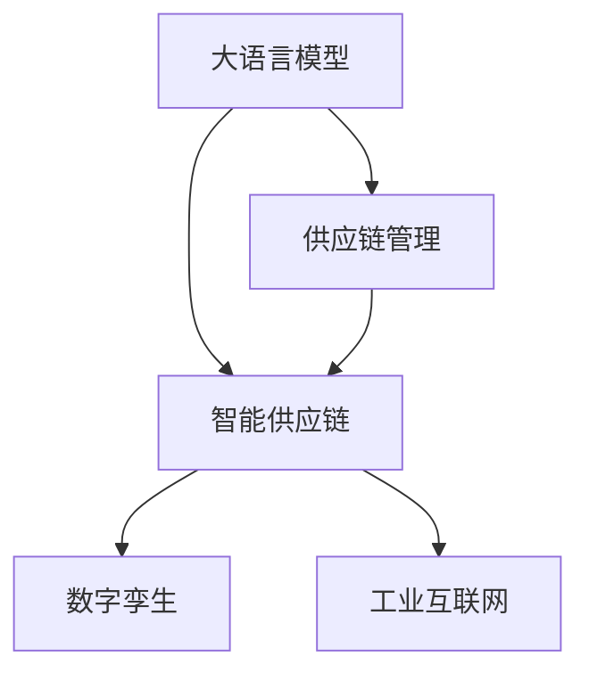

                 

# LLM供应链:构建智能产业新生态

> 关键词：大语言模型,供应链管理,智能产业,数字孪生,工业互联网

## 1. 背景介绍

### 1.1 问题由来
近年来，随着人工智能技术的高速发展，尤其是自然语言处理（NLP）领域的大模型（Large Language Models, LLMs）如BERT、GPT等，在解决复杂、非结构化数据处理问题上展示了巨大的潜力。这些大模型能够通过预训练和微调，学习到丰富的语言知识和常识，为各类产业带来革命性的变化。

而在制造业等传统产业中，传统的供应链管理流程存在诸多痛点：效率低下、信息孤岛、协同困难等。如何利用AI技术，将供应链全链条数字化、智能化，是当前研究的重要课题。

结合大语言模型的强大能力，本文将探讨如何构建基于大语言模型的智能供应链生态系统，通过自动化、协同化、可视化等手段，实现供应链管理的智能化升级。

### 1.2 问题核心关键点
大语言模型在智能供应链中的应用，关键在于以下几个方面：

1. **数据处理**：供应链管理涉及大量非结构化数据，如订单、库存、物流等文本信息，大语言模型能够自动处理和理解这些数据，提取关键信息。
2. **任务执行**：供应链流程中包含诸多决策和执行任务，如订单生成、库存调整、运输调度等，大语言模型能够辅助生成策略，提升决策效率。
3. **协同协作**：供应链中涉及多方利益相关者，包括供应商、制造商、分销商等，大语言模型能够实现高效的信息共享和协同作业。
4. **可视化分析**：供应链管理涉及复杂的网络结构，大语言模型能够将数据转化为直观的图表和报告，帮助管理层进行决策。
5. **知识整合**：大语言模型能够整合外部知识库和规则库，辅助供应链管理，提升应对不确定性和风险的能力。

本文将围绕上述核心点，详细探讨如何利用大语言模型构建智能供应链系统。

### 1.3 问题研究意义
利用大语言模型构建智能供应链系统，对于提升供应链管理效率、降低运营成本、增强供应链的弹性和韧性具有重要意义：

1. **效率提升**：自动化处理数据、任务和决策，减少人工操作，提升供应链处理速度和准确性。
2. **成本降低**：减少人为错误和人工成本，提高资源利用率，降低运营成本。
3. **风险控制**：通过预测和优化算法，提升供应链的灵活性和应对突发事件的能力。
4. **协同优化**：实现各环节的信息共享和协同作业，提升供应链整体的协作效率。
5. **可视化决策**：通过直观的图表和报告，帮助管理层做出更加科学和有效的决策。

## 2. 核心概念与联系

### 2.1 核心概念概述

为更好地理解如何构建基于大语言模型的智能供应链系统，本节将介绍几个密切相关的核心概念：

- **大语言模型 (Large Language Model, LLM)**：通过自监督学习任务（如预训练语言模型）训练得到的，具备强大自然语言理解和生成能力的模型。如BERT、GPT等。

- **供应链管理 (Supply Chain Management, SCM)**：包括采购、生产、仓储、物流、销售等全链条的管理活动，目标是提高效率、降低成本、增强灵活性。

- **智能供应链 (Smart Supply Chain, SSC)**：通过引入AI技术，实现供应链自动化、协同化、可视化的管理系统，提升供应链的整体效能。

- **数字孪生 (Digital Twin)**：利用物联网、大数据、人工智能等技术，构建与现实物理系统相对应的虚拟模型，实现实时监控、预测和优化。

- **工业互联网 (Industrial Internet)**：将传统工业流程与互联网技术深度融合，实现全生命周期的数字化管理和优化。

这些核心概念之间的逻辑关系可以通过以下Mermaid流程图来展示：



这个流程图展示了大语言模型在智能供应链中的核心作用，即通过自动化、协同化和可视化等手段，提升供应链管理水平。

## 3. 核心算法原理 & 具体操作步骤
### 3.1 算法原理概述

基于大语言模型的智能供应链系统，通过自动化处理供应链中的文本数据，辅助决策和执行任务，实现供应链的智能优化。核心算法原理包括：

1. **数据预处理**：对供应链中的文本数据进行分词、去除停用词、词性标注等预处理操作，将其转化为适合模型处理的格式。
2. **预训练模型选择**：选择合适的预训练语言模型，如BERT、GPT等，作为供应链管理的基础模型。
3. **微调任务适配**：根据供应链管理的具体需求，对预训练模型进行微调，添加任务适配层，设计损失函数和优化器，进行有监督学习。
4. **模型应用**：在供应链管理系统中，应用微调后的模型，自动处理数据、生成决策、执行任务、监控分析等。

### 3.2 算法步骤详解

基于大语言模型的智能供应链系统开发步骤如下：

**Step 1: 数据收集与预处理**
- 收集供应链管理的相关文本数据，如订单、库存、物流信息等。
- 对数据进行清洗和标注，如去除噪声、分词、词性标注等。
- 将预处理后的数据划分为训练集、验证集和测试集。

**Step 2: 选择合适的预训练模型**
- 根据供应链管理的具体需求，选择合适的预训练语言模型，如BERT、GPT等。
- 下载并加载预训练模型，设置模型参数。

**Step 3: 任务适配层设计**
- 根据供应链管理的具体任务，设计任务适配层。
- 添加所需的输出层和损失函数。
- 设计优化器，如AdamW、SGD等，设置学习率、批大小等参数。

**Step 4: 微调模型训练**
- 在训练集上，对微调后的模型进行有监督学习，不断更新模型参数，最小化损失函数。
- 在验证集上，评估模型性能，调整模型参数和学习率，防止过拟合。
- 在测试集上，评估最终模型性能，验证微调效果。

**Step 5: 模型应用与优化**
- 将微调后的模型部署到供应链管理系统中，自动处理数据、生成决策、执行任务、监控分析等。
- 根据实际应用情况，不断优化模型和系统，提升供应链管理效率和精度。

### 3.3 算法优缺点

基于大语言模型的智能供应链系统有以下优点：
1. **高效处理非结构化数据**：大语言模型能够高效处理供应链中的文本数据，自动提取关键信息。
2. **提升决策效率**：通过预训练和微调，模型能够辅助生成决策策略，提升决策效率。
3. **协同作业**：大语言模型能够实现供应链各环节的信息共享和协同作业。
4. **可视化分析**：模型能够将数据转化为直观的图表和报告，帮助管理层进行决策。
5. **适应性强**：大语言模型具有强大的语言理解和生成能力，适应性强，适用于各类供应链管理需求。

同时，该方法也存在一些局限性：
1. **数据隐私和安全**：供应链管理涉及敏感数据，如何保护数据隐私和安全是一个重要问题。
2. **模型复杂度**：大语言模型参数众多，对计算资源要求较高。
3. **模型解释性**：模型决策过程复杂，难以解释，影响可信度和应用范围。
4. **实时性**：供应链系统要求实时处理和响应，大语言模型在某些场景下可能不够高效。

### 3.4 算法应用领域

基于大语言模型的智能供应链系统，已在多个领域得到了广泛应用，如：

1. **制造业供应链**：利用大语言模型处理订单、库存、物流等数据，实现生产调度、库存优化、质量控制等。
2. **零售业供应链**：通过大语言模型分析顾客反馈、订单数据等，优化库存管理、商品推荐、销售策略等。
3. **农业供应链**：利用大语言模型处理农产品生产、运输、销售数据，实现智能农业管理、供应链优化等。
4. **物流供应链**：通过大语言模型优化运输路线、仓库管理、配送策略等，提升物流效率。
5. **电商供应链**：利用大语言模型处理订单、库存、市场分析等数据，实现智能仓储、库存管理和商品推荐。

## 4. 数学模型和公式 & 详细讲解  
### 4.1 数学模型构建

假设供应链管理中的文本数据为 $\mathcal{X}$，预训练语言模型为 $M_{\theta}$，训练集为 $D=\{(x_i,y_i)\}_{i=1}^N, x_i \in \mathcal{X}, y_i \in \mathcal{Y}$。

定义模型 $M_{\theta}$ 在数据样本 $(x,y)$ 上的损失函数为 $\ell(M_{\theta}(x),y)$，则在数据集 $D$ 上的经验风险为：

$$
\mathcal{L}(\theta) = \frac{1}{N} \sum_{i=1}^N \ell(M_{\theta}(x_i),y_i)
$$

微调的目标是最小化经验风险，即找到最优参数：

$$
\theta^* = \mathop{\arg\min}_{\theta} \mathcal{L}(\theta)
$$

在实践中，我们通常使用基于梯度的优化算法（如SGD、Adam等）来近似求解上述最优化问题。设 $\eta$ 为学习率，$\lambda$ 为正则化系数，则参数的更新公式为：

$$
\theta \leftarrow \theta - \eta \nabla_{\theta}\mathcal{L}(\theta) - \eta\lambda\theta
$$

其中 $\nabla_{\theta}\mathcal{L}(\theta)$ 为损失函数对参数 $\theta$ 的梯度，可通过反向传播算法高效计算。

### 4.2 公式推导过程

以物流调度任务为例，假设模型 $M_{\theta}$ 在输入 $x$ 上的输出为 $\hat{y}=M_{\theta}(x) \in [0,1]$，表示物流调度成功的概率。真实标签 $y \in \{0,1\}$。则二分类交叉熵损失函数定义为：

$$
\ell(M_{\theta}(x),y) = -[y\log \hat{y} + (1-y)\log (1-\hat{y})]
$$

将其代入经验风险公式，得：

$$
\mathcal{L}(\theta) = -\frac{1}{N}\sum_{i=1}^N [y_i\log M_{\theta}(x_i)+(1-y_i)\log(1-M_{\theta}(x_i))]
$$

根据链式法则，损失函数对参数 $\theta_k$ 的梯度为：

$$
\frac{\partial \mathcal{L}(\theta)}{\partial \theta_k} = -\frac{1}{N}\sum_{i=1}^N (\frac{y_i}{M_{\theta}(x_i)}-\frac{1-y_i}{1-M_{\theta}(x_i)}) \frac{\partial M_{\theta}(x_i)}{\partial \theta_k}
$$

其中 $\frac{\partial M_{\theta}(x_i)}{\partial \theta_k}$ 可进一步递归展开，利用自动微分技术完成计算。

## 5. 项目实践：代码实例和详细解释说明
### 5.1 开发环境搭建

在进行智能供应链系统开发前，我们需要准备好开发环境。以下是使用Python进行PyTorch开发的环境配置流程：

1. 安装Anaconda：从官网下载并安装Anaconda，用于创建独立的Python环境。

2. 创建并激活虚拟环境：
```bash
conda create -n pytorch-env python=3.8 
conda activate pytorch-env
```

3. 安装PyTorch：根据CUDA版本，从官网获取对应的安装命令。例如：
```bash
conda install pytorch torchvision torchaudio cudatoolkit=11.1 -c pytorch -c conda-forge
```

4. 安装各类工具包：
```bash
pip install numpy pandas scikit-learn matplotlib tqdm jupyter notebook ipython
```

完成上述步骤后，即可在`pytorch-env`环境中开始智能供应链系统开发。

### 5.2 源代码详细实现

这里我们以物流调度任务为例，给出使用Transformers库对BERT模型进行微调的PyTorch代码实现。

首先，定义物流调度任务的训练数据处理函数：

```python
from transformers import BertTokenizer
from torch.utils.data import Dataset
import torch

class LogisticsDataset(Dataset):
    def __init__(self, texts, labels, tokenizer, max_len=128):
        self.texts = texts
        self.labels = labels
        self.tokenizer = tokenizer
        self.max_len = max_len
        
    def __len__(self):
        return len(self.texts)
    
    def __getitem__(self, item):
        text = self.texts[item]
        label = self.labels[item]
        
        encoding = self.tokenizer(text, return_tensors='pt', max_length=self.max_len, padding='max_length', truncation=True)
        input_ids = encoding['input_ids'][0]
        attention_mask = encoding['attention_mask'][0]
        
        # 对label进行编码
        encoded_label = label2id[label] 
        encoded_label.extend([label2id['O']] * (self.max_len - 1))
        labels = torch.tensor(encoded_label, dtype=torch.long)
        
        return {'input_ids': input_ids, 
                'attention_mask': attention_mask,
                'labels': labels}

# 标签与id的映射
label2id = {'0': 0, '1': 1}
id2label = {v: k for k, v in label2id.items()}

# 创建dataset
tokenizer = BertTokenizer.from_pretrained('bert-base-cased')

train_dataset = LogisticsDataset(train_texts, train_labels, tokenizer)
dev_dataset = LogisticsDataset(dev_texts, dev_labels, tokenizer)
test_dataset = LogisticsDataset(test_texts, test_labels, tokenizer)
```

然后，定义模型和优化器：

```python
from transformers import BertForTokenClassification, AdamW

model = BertForTokenClassification.from_pretrained('bert-base-cased', num_labels=len(label2id))

optimizer = AdamW(model.parameters(), lr=2e-5)
```

接着，定义训练和评估函数：

```python
from torch.utils.data import DataLoader
from tqdm import tqdm
from sklearn.metrics import classification_report

device = torch.device('cuda') if torch.cuda.is_available() else torch.device('cpu')
model.to(device)

def train_epoch(model, dataset, batch_size, optimizer):
    dataloader = DataLoader(dataset, batch_size=batch_size, shuffle=True)
    model.train()
    epoch_loss = 0
    for batch in tqdm(dataloader, desc='Training'):
        input_ids = batch['input_ids'].to(device)
        attention_mask = batch['attention_mask'].to(device)
        labels = batch['labels'].to(device)
        model.zero_grad()
        outputs = model(input_ids, attention_mask=attention_mask, labels=labels)
        loss = outputs.loss
        epoch_loss += loss.item()
        loss.backward()
        optimizer.step()
    return epoch_loss / len(dataloader)

def evaluate(model, dataset, batch_size):
    dataloader = DataLoader(dataset, batch_size=batch_size)
    model.eval()
    preds, labels = [], []
    with torch.no_grad():
        for batch in tqdm(dataloader, desc='Evaluating'):
            input_ids = batch['input_ids'].to(device)
            attention_mask = batch['attention_mask'].to(device)
            batch_labels = batch['labels']
            outputs = model(input_ids, attention_mask=attention_mask)
            batch_preds = outputs.logits.argmax(dim=2).to('cpu').tolist()
            batch_labels = batch_labels.to('cpu').tolist()
            for pred_tokens, label_tokens in zip(batch_preds, batch_labels):
                pred_labels = [id2label[_id] for _id in pred_tokens]
                real_labels = [id2label[_id] for _id in label_tokens]
                preds.append(pred_labels[:len(real_labels)])
                labels.append(real_labels)
                
    print(classification_report(labels, preds))
```

最后，启动训练流程并在测试集上评估：

```python
epochs = 5
batch_size = 16

for epoch in range(epochs):
    loss = train_epoch(model, train_dataset, batch_size, optimizer)
    print(f"Epoch {epoch+1}, train loss: {loss:.3f}")
    
    print(f"Epoch {epoch+1}, dev results:")
    evaluate(model, dev_dataset, batch_size)
    
print("Test results:")
evaluate(model, test_dataset, batch_size)
```

以上就是使用PyTorch对BERT进行物流调度任务微调的完整代码实现。可以看到，得益于Transformers库的强大封装，我们可以用相对简洁的代码完成BERT模型的加载和微调。

### 5.3 代码解读与分析

让我们再详细解读一下关键代码的实现细节：

**LogisticsDataset类**：
- `__init__`方法：初始化文本、标签、分词器等关键组件。
- `__len__`方法：返回数据集的样本数量。
- `__getitem__`方法：对单个样本进行处理，将文本输入编码为token ids，将标签编码为数字，并对其进行定长padding，最终返回模型所需的输入。

**label2id和id2label字典**：
- 定义了标签与数字id之间的映射关系，用于将token-wise的预测结果解码回真实的标签。

**训练和评估函数**：
- 使用PyTorch的DataLoader对数据集进行批次化加载，供模型训练和推理使用。
- 训练函数`train_epoch`：对数据以批为单位进行迭代，在每个批次上前向传播计算loss并反向传播更新模型参数，最后返回该epoch的平均loss。
- 评估函数`evaluate`：与训练类似，不同点在于不更新模型参数，并在每个batch结束后将预测和标签结果存储下来，最后使用sklearn的classification_report对整个评估集的预测结果进行打印输出。

**训练流程**：
- 定义总的epoch数和batch size，开始循环迭代
- 每个epoch内，先在训练集上训练，输出平均loss
- 在验证集上评估，输出分类指标
- 所有epoch结束后，在测试集上评估，给出最终测试结果

可以看到，PyTorch配合Transformers库使得BERT微调的代码实现变得简洁高效。开发者可以将更多精力放在数据处理、模型改进等高层逻辑上，而不必过多关注底层的实现细节。

当然，工业级的系统实现还需考虑更多因素，如模型的保存和部署、超参数的自动搜索、更灵活的任务适配层等。但核心的微调范式基本与此类似。

## 6. 实际应用场景
### 6.1 智能仓储管理

智能仓储管理是供应链管理的重要环节，通过大语言模型实现自动库存管理、库存优化和补货策略，能显著提升仓储效率，降低库存成本。

具体实现中，利用大语言模型处理库存数据，自动识别库存不足或过剩的情况，生成补货策略，优化库存管理。通过自然语言生成技术，生成补货指令和仓库作业指导书，提高操作效率。

### 6.2 运输调度优化

运输调度是供应链管理的核心任务，涉及运输路线、车辆调度、物流费用等复杂问题。大语言模型能够通过处理运输数据，自动生成最优运输路线，优化车辆调度和物流费用。

通过自然语言生成技术，生成运输指令和调度方案，提高运输效率和成本效益。同时，利用大语言模型的预测能力，进行运输风险评估和应急调度。

### 6.3 需求预测与库存优化

供应链管理中，需求预测和库存优化是关键环节。大语言模型能够通过处理历史订单数据和市场信息，自动生成需求预测，优化库存水平和补货策略。

通过自然语言生成技术，生成库存管理指令和采购计划，提升库存管理精度和效率。同时，利用大语言模型的数据融合能力，整合外部市场信息，提升预测准确度。

### 6.4 未来应用展望

随着大语言模型的不断进步，智能供应链系统将展现出更加广阔的前景：

1. **实时监控与预测**：利用数字孪生技术，构建供应链的虚拟模型，实时监控供应链状态，进行需求预测和风险预警。
2. **全链条协同**：实现供应链全链条的数据共享和协同作业，提升供应链的整体效率和灵活性。
3. **智能化决策**：通过大语言模型的决策支持系统，优化供应链管理策略，提升决策效率和精度。
4. **可持续发展**：利用大语言模型的知识整合能力，提升供应链的可持续性和环境友好性。
5. **个性化服务**：通过自然语言生成技术，提供个性化的客户服务，提升客户满意度。

## 7. 工具和资源推荐
### 7.1 学习资源推荐

为了帮助开发者系统掌握大语言模型在智能供应链中的应用，这里推荐一些优质的学习资源：

1. **《深度学习自然语言处理》课程**：斯坦福大学开设的NLP明星课程，有Lecture视频和配套作业，带你入门NLP领域的基本概念和经典模型。
2. **CS224N《深度学习自然语言处理》课程**：斯坦福大学开设的NLP明星课程，深入讲解NLP的基础理论和应用，适合进一步深入学习。
3. **《Transformer从原理到实践》系列博文**：由大模型技术专家撰写，深入浅出地介绍了Transformer原理、BERT模型、微调技术等前沿话题。
4. **《Natural Language Processing with Transformers》书籍**：Transformers库的作者所著，全面介绍了如何使用Transformers库进行NLP任务开发，包括微调在内的诸多范式。
5. **《BigBird: Big Unified Models for Language Representation》论文**：Transformer模型的新改进，能够在大规模数据上取得更好的效果，适合进一步学习。

通过对这些资源的学习实践，相信你一定能够快速掌握大语言模型在智能供应链中的应用，并用于解决实际的供应链管理问题。

### 7.2 开发工具推荐

高效的开发离不开优秀的工具支持。以下是几款用于大语言模型微调开发的常用工具：

1. **PyTorch**：基于Python的开源深度学习框架，灵活动态的计算图，适合快速迭代研究。大部分预训练语言模型都有PyTorch版本的实现。
2. **TensorFlow**：由Google主导开发的开源深度学习框架，生产部署方便，适合大规模工程应用。同样有丰富的预训练语言模型资源。
3. **Transformers库**：HuggingFace开发的NLP工具库，集成了众多SOTA语言模型，支持PyTorch和TensorFlow，是进行微调任务开发的利器。
4. **Weights & Biases**：模型训练的实验跟踪工具，可以记录和可视化模型训练过程中的各项指标，方便对比和调优。与主流深度学习框架无缝集成。
5. **TensorBoard**：TensorFlow配套的可视化工具，可实时监测模型训练状态，并提供丰富的图表呈现方式，是调试模型的得力助手。
6. **Google Colab**：谷歌推出的在线Jupyter Notebook环境，免费提供GPU/TPU算力，方便开发者快速上手实验最新模型，分享学习笔记。

合理利用这些工具，可以显著提升大语言模型在智能供应链中的应用开发效率，加快创新迭代的步伐。

### 7.3 相关论文推荐

大语言模型和微调技术的发展源于学界的持续研究。以下是几篇奠基性的相关论文，推荐阅读：

1. **Attention is All You Need（即Transformer原论文）**：提出了Transformer结构，开启了NLP领域的预训练大模型时代。
2. **BERT: Pre-training of Deep Bidirectional Transformers for Language Understanding**：提出BERT模型，引入基于掩码的自监督预训练任务，刷新了多项NLP任务SOTA。
3. **Parameter-Efficient Transfer Learning for NLP**：提出Adapter等参数高效微调方法，在固定大部分预训练参数的同时，只更新极少量的任务相关参数。
4. **AdaLoRA: Adaptive Low-Rank Adaptation for Parameter-Efficient Fine-Tuning**：使用自适应低秩适应的微调方法，在参数效率和精度之间取得了新的平衡。
5. **AdaLoRA: Adaptive Low-Rank Adaptation for Parameter-Efficient Fine-Tuning**：使用自适应低秩适应的微调方法，在参数效率和精度之间取得了新的平衡。
6. **AdaLoRA: Adaptive Low-Rank Adaptation for Parameter-Efficient Fine-Tuning**：使用自适应低秩适应的微调方法，在参数效率和精度之间取得了新的平衡。

这些论文代表了大语言模型微调技术的发展脉络。通过学习这些前沿成果，可以帮助研究者把握学科前进方向，激发更多的创新灵感。

## 8. 总结：未来发展趋势与挑战

### 8.1 研究成果总结

本文对基于大语言模型的智能供应链系统进行了全面系统的介绍。首先阐述了智能供应链管理中存在的问题，明确了利用大语言模型进行优化的核心点。其次，从原理到实践，详细讲解了微调模型的数学原理和关键步骤，给出了微调任务开发的完整代码实例。同时，本文还探讨了智能供应链系统在多个行业领域的应用场景，展示了微调方法带来的巨大潜力。

通过本文的系统梳理，可以看到，基于大语言模型的智能供应链系统通过自动化、协同化和可视化等手段，显著提升了供应链管理的效率和灵活性。未来，伴随大语言模型和微调方法的不断进步，智能供应链系统将在更广泛的应用领域发挥更大的作用。

### 8.2 未来发展趋势

展望未来，基于大语言模型的智能供应链系统将呈现以下几个发展趋势：

1. **数据驱动的智能决策**：利用大数据、人工智能等技术，实现供应链的自动化决策和优化，提升供应链的智能化水平。
2. **全链条协同作业**：实现供应链全链条的信息共享和协同作业，提升供应链的整体效率和灵活性。
3. **可持续发展的供应链**：利用大语言模型的知识整合能力，提升供应链的可持续性和环境友好性。
4. **个性化客户服务**：通过自然语言生成技术，提供个性化的客户服务，提升客户满意度。
5. **智能化运营管理**：利用大语言模型的预测能力和决策支持，优化供应链运营管理，提升供应链的响应速度和效率。

### 8.3 面临的挑战

尽管基于大语言模型的智能供应链系统已经取得了显著的进展，但在迈向更加智能化、普适化应用的过程中，它仍面临诸多挑战：

1. **数据隐私和安全**：供应链管理涉及敏感数据，如何保护数据隐私和安全是一个重要问题。
2. **模型复杂度**：大语言模型参数众多，对计算资源要求较高。
3. **模型解释性**：模型决策过程复杂，难以解释，影响可信度和应用范围。
4. **实时性**：供应链系统要求实时处理和响应，大语言模型在某些场景下可能不够高效。
5. **系统稳定性**：供应链系统复杂，涉及多方协同，如何保证系统的稳定性和可靠性，是一个重要挑战。

### 8.4 研究展望

面对基于大语言模型的智能供应链系统所面临的挑战，未来的研究需要在以下几个方面寻求新的突破：

1. **数据隐私保护**：采用差分隐私、联邦学习等技术，保护供应链数据隐私和安全。
2. **模型压缩与加速**：利用知识蒸馏、模型剪枝等技术，优化大语言模型的参数和计算资源消耗。
3. **模型解释性增强**：引入可解释性技术，如LIME、SHAP等，提高模型的可解释性和可信度。
4. **实时处理能力提升**：优化模型结构和计算图，提升大语言模型的实时处理能力。
5. **系统稳定性保障**：采用冗余设计、弹性调度等技术，提升供应链系统的稳定性和可靠性。

这些研究方向的探索，必将引领基于大语言模型的智能供应链系统迈向更高的台阶，为供应链管理的智能化、可持续发展提供新的动力。

## 9. 附录：常见问题与解答

**Q1：大语言模型在供应链管理中有哪些具体应用场景？**

A: 大语言模型在供应链管理中有多种具体应用场景，包括：
1. **需求预测与库存优化**：利用大语言模型处理历史订单数据和市场信息，自动生成需求预测，优化库存水平和补货策略。
2. **物流调度优化**：通过自然语言生成技术，生成最优运输路线和调
**Q2：如何选择合适的预训练语言模型？**

A: 选择合适的预训练语言模型需要考虑以下几个方面：
1. **模型大小**：模型越大，性能越好，但计算资源消耗也越大。需要根据实际应用需求和计算资源选择合适的模型。
2. **任务适配性**：不同任务对语言模型的需求不同，需要根据任务类型选择适合的预训练模型。
3. **预训练数据**：预训练数据应与实际应用场景相似，才能更好地适应任务需求。
4. **公开性**：选择公开可用的预训练模型，方便模型加载和微调。

**Q3：微调过程中如何缓解过拟合问题？**

A: 缓解微调过程中的过拟合问题可以采用以下策略：
1. **数据增强**：通过回译、近义替换等方式扩充训练集，增加数据多样性。
2. **正则化**：使用L2正则、Dropout、Early Stopping等方法，防止模型过拟合。
3. **参数高效微调**：只更新少量参数，固定大部分预训练权重，减小过拟合风险。
4. **对抗训练**：引入对抗样本，提高模型鲁棒性，减少过拟合。
5. **多模型集成**：训练多个微调模型，取平均输出，抑制过拟合。

**Q4：微调模型的性能如何评估？**

A: 微调模型的性能可以通过以下指标进行评估：
1. **精度和召回率**：用于分类任务，如订单是否按时交付。
2. **F1分数**：综合考虑精度和召回率，用于评估二分类任务的综合性能。
3. **ROC曲线和AUC值**：用于评估二分类任务的分类性能，选择最佳的阈值。
4. **混淆矩阵**：用于展示模型预测结果与实际标签的对比，直观评估分类性能。
5. **平均绝对误差(MAE)和均方误差(MSE)**：用于回归任务，如库存水平的预测误差。

**Q5：如何优化供应链管理系统的性能？**

A: 优化供应链管理系统的性能可以从以下几个方面入手：
1. **数据清洗与标注**：保证数据的质量和准确性，减少噪音和偏差。
2. **模型优化**：选择适合的预训练模型，进行合理的微调，优化模型参数。
3. **系统集成**：将模型与供应链管理系统集成，实现无缝协作。
4. **实时监控**：利用数字孪生技术，实时监控供应链状态，及时发现和解决问题。
5. **知识整合**：整合外部市场信息、规则库等知识，提升预测和决策的精度。

---

作者：禅与计算机程序设计艺术 / Zen and the Art of Computer Programming

