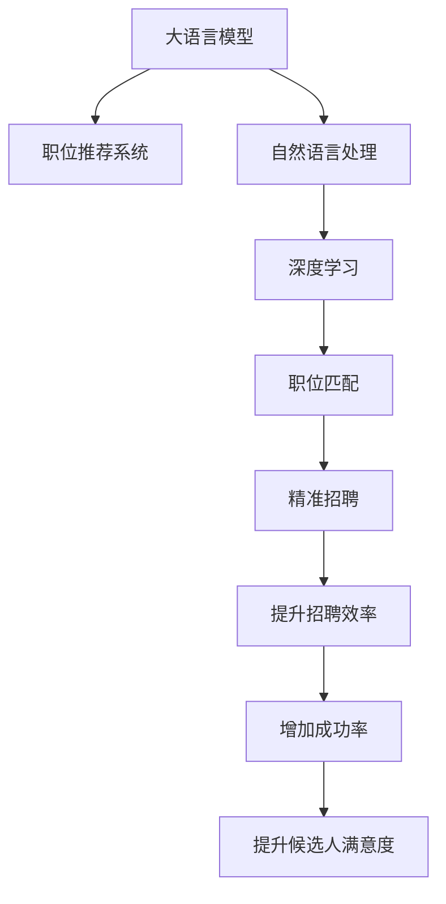

                 

# LLM在job推荐中的创新应用

> 关键词：语言模型，职业推荐系统，自然语言处理，深度学习，职位匹配，精准招聘

## 1. 背景介绍

在当今快速发展的数字化时代，人力资源管理成为了企业保持竞争力的关键因素之一。传统的招聘方式面临着效率低、成本高、匹配度不高等问题。而通过人工智能（AI）技术，特别是基于语言模型（LM）的职业推荐系统，可以极大地提升招聘效率和精准度。本文将深入探讨如何利用大语言模型（Large Language Model, LLM）在职位推荐领域进行创新应用，通过语言理解和生成技术，提供更加智能、个性化的招聘体验。

## 2. 核心概念与联系

### 2.1 核心概念概述

在职业推荐系统中，大语言模型（LLM）扮演着至关重要的角色。LLM是一种通过深度学习训练得到的模型，能够理解和生成自然语言，从而实现自动化的职位匹配、简历筛选、职位描述生成等功能。其核心概念包括：

- **大语言模型（LLM）**：以自回归或自编码模型为代表的大规模预训练语言模型，能够学习通用的语言表示，具备强大的语言理解和生成能力。
- **职业推荐系统**：利用大语言模型的能力，从海量的职位和简历数据中，自动推荐最适合申请人的职位，提升招聘效率和质量。
- **自然语言处理（NLP）**：涉及语音识别、文本处理、情感分析、意图识别等多种技术，是实现LLM在职位推荐系统中的基础。
- **深度学习**：通过多层神经网络结构，训练LLM模型，从而能够从数据中学习到复杂的语言模式。
- **职位匹配**：通过分析和理解职位描述、简历内容等文本数据，找到最佳匹配的职位。
- **精准招聘**：通过自动化、智能化的推荐系统，提升招聘的成功率和候选人的满意度。

这些概念之间的逻辑关系可以通过以下Mermaid流程图来展示：



这个流程图展示了LLM在职位推荐系统中的工作流程：首先，利用自然语言处理和深度学习技术训练大语言模型，然后通过职位匹配实现自动化的职位推荐，最终实现精准招聘，提升招聘效率和成功率。

## 3. 核心算法原理 & 具体操作步骤

### 3.1 算法原理概述

基于大语言模型的职业推荐系统，其核心算法原理是利用语言模型的语言理解和生成能力，对职位和简历进行分析和匹配。其主要步骤如下：

1. **数据预处理**：收集和清洗职位和简历数据，包括职位描述、公司信息、求职者简历、工作经历等。
2. **模型训练**：使用大规模无标签文本数据对大语言模型进行预训练，使其学习到通用的语言表示。
3. **任务适配**：在预训练模型基础上，添加任务适配层，如分类层、生成层等，用于实现职位匹配、简历筛选等功能。
4. **微调优化**：使用标注数据对模型进行微调，优化模型参数，提高模型的准确性和泛化能力。
5. **推荐生成**：根据求职者提供的简历信息，利用模型自动匹配适合的职位，并生成推荐结果。

### 3.2 算法步骤详解

以下将详细阐述每个步骤的具体操作：

#### 3.2.1 数据预处理

- **数据收集**：从招聘网站、企业内部系统、第三方数据源等收集职位和简历数据。
- **数据清洗**：去除噪声数据，如错别字、格式错误、重复信息等，确保数据质量。
- **文本分词**：将职位描述、简历内容等文本数据分词，转换为模型能够处理的格式。
- **特征提取**：提取文本中的关键信息，如职位要求、技能描述、公司信息等，生成特征向量。

#### 3.2.2 模型训练

- **预训练**：使用大规模无标签文本数据对大语言模型进行预训练，如BERT、GPT等。
- **任务适配**：在预训练模型的基础上，添加分类层、生成层等，实现职位匹配、简历筛选等功能。
- **优化器选择**：选择合适的优化器（如Adam、SGD等），设置学习率、批大小等超参数。

#### 3.2.3 微调优化

- **微调数据准备**：收集标注数据，包括职位和简历的匹配信息、评分信息等。
- **微调模型训练**：使用微调数据对模型进行训练，优化模型参数。
- **性能评估**：在验证集上评估模型性能，如准确率、召回率、F1分数等，调整超参数以提升模型性能。

#### 3.2.4 推荐生成

- **输入处理**：将求职者的简历信息输入模型，转换为模型能够处理的格式。
- **职位匹配**：利用模型自动匹配适合的职位，生成推荐结果。
- **结果输出**：将推荐结果展示给求职者，并提供职位详情、公司信息、薪资福利等信息。

### 3.3 算法优缺点

基于大语言模型的职业推荐系统有以下优点：

1. **高效性**：自动化的职位匹配和简历筛选，能够极大地提升招聘效率。
2. **精准性**：利用语言模型的语言理解能力，能够找到最佳匹配的职位，提高招聘成功率。
3. **个性化**：通过分析求职者的简历信息，提供个性化的职位推荐，提升求职者的满意度。
4. **可扩展性**：支持大规模数据的处理，能够轻松扩展到更多职位和简历。

同时，该方法也存在以下缺点：

1. **数据依赖**：模型性能很大程度上依赖于数据质量，数据偏差可能导致推荐结果不准确。
2. **模型复杂度**：大语言模型通常参数量较大，对计算资源有较高要求。
3. **解释性不足**：模型决策过程缺乏可解释性，难以调试和优化。
4. **鲁棒性问题**：面对多样化的职位描述和简历内容，模型可能出现泛化能力不足的情况。

### 3.4 算法应用领域

基于大语言模型的职业推荐系统，在多个领域具有广泛的应用前景，例如：

- **招聘平台**：提供职位推荐、简历筛选、自动匹配等功能，提升招聘效率和成功率。
- **企业内部招聘**：帮助企业快速筛选出符合岗位要求的求职者，提高招聘的准确性和效率。
- **职业培训**：分析求职者的简历信息，推荐适合的培训课程，提升求职者的技能水平。
- **人才市场分析**：通过分析职位和简历数据，发现市场需求和人才缺口，提供市场趋势分析。
- **职业发展指导**：利用模型分析求职者的职业经历和技能，提供职业发展建议和路径规划。

## 4. 数学模型和公式 & 详细讲解 & 举例说明

### 4.1 数学模型构建

在职位推荐系统中，我们通常使用分类任务进行模型训练和评估。假设模型输入为简历信息 $x$，输出为职位编号 $y$。定义模型 $M_{\theta}$ 在输入 $x$ 上的损失函数为 $\ell(M_{\theta}(x),y)$，则在数据集 $D=\{(x_i,y_i)\}_{i=1}^N$ 上的经验风险为：

$$
\mathcal{L}(\theta) = \frac{1}{N} \sum_{i=1}^N \ell(M_{\theta}(x_i),y_i)
$$

其中 $\theta$ 为模型参数，$\ell$ 为损失函数。常见的损失函数包括交叉熵损失、均方误差损失等。

### 4.2 公式推导过程

以下以二分类任务为例，推导交叉熵损失函数及其梯度的计算公式。

假设模型 $M_{\theta}$ 在输入 $x$ 上的输出为 $\hat{y}=M_{\theta}(x) \in [0,1]$，表示样本属于正类的概率。真实标签 $y \in \{0,1\}$。则二分类交叉熵损失函数定义为：

$$
\ell(M_{\theta}(x),y) = -[y\log \hat{y} + (1-y)\log (1-\hat{y})]
$$

将其代入经验风险公式，得：

$$
\mathcal{L}(\theta) = -\frac{1}{N}\sum_{i=1}^N [y_i\log M_{\theta}(x_i)+(1-y_i)\log(1-M_{\theta}(x_i))]
$$

根据链式法则，损失函数对参数 $\theta_k$ 的梯度为：

$$
\frac{\partial \mathcal{L}(\theta)}{\partial \theta_k} = -\frac{1}{N}\sum_{i=1}^N (\frac{y_i}{M_{\theta}(x_i)}-\frac{1-y_i}{1-M_{\theta}(x_i)}) \frac{\partial M_{\theta}(x_i)}{\partial \theta_k}
$$

其中 $\frac{\partial M_{\theta}(x_i)}{\partial \theta_k}$ 可进一步递归展开，利用自动微分技术完成计算。

### 4.3 案例分析与讲解

在实际的职业推荐系统中，我们可以使用微调的BERT模型来实现职位推荐。具体步骤如下：

1. **数据准备**：收集并清洗职位和简历数据，包括职位描述、公司信息、求职者简历、工作经历等。
2. **模型训练**：使用大规模无标签文本数据对BERT模型进行预训练，使其学习到通用的语言表示。
3. **任务适配**：在预训练模型的基础上，添加分类层、生成层等，实现职位匹配、简历筛选等功能。
4. **微调优化**：使用标注数据对模型进行微调，优化模型参数，提高模型的准确性和泛化能力。
5. **推荐生成**：根据求职者提供的简历信息，利用模型自动匹配适合的职位，并生成推荐结果。

以下是一个基于微调的BERT模型进行职位推荐的代码示例：

```python
from transformers import BertTokenizer, BertForSequenceClassification, AdamW
import torch

# 加载预训练模型和分词器
model_name = 'bert-base-uncased'
tokenizer = BertTokenizer.from_pretrained(model_name)
model = BertForSequenceClassification.from_pretrained(model_name, num_labels=2)

# 定义损失函数和优化器
loss_fn = torch.nn.CrossEntropyLoss()
optimizer = AdamW(model.parameters(), lr=2e-5)

# 数据预处理
def preprocess_data(text, label):
    encoding = tokenizer(text, return_tensors='pt', max_length=128, padding='max_length', truncation=True)
    input_ids = encoding['input_ids']
    attention_mask = encoding['attention_mask']
    label = torch.tensor(label, dtype=torch.long)
    return input_ids, attention_mask, label

# 模型训练
def train_epoch(model, data_loader, optimizer):
    model.train()
    epoch_loss = 0
    for batch in data_loader:
        input_ids, attention_mask, label = batch
        outputs = model(input_ids, attention_mask=attention_mask)
        loss = loss_fn(outputs.logits, label)
        epoch_loss += loss.item()
        loss.backward()
        optimizer.step()
    return epoch_loss / len(data_loader)

# 微调训练
def fine_tune(model, data_loader, optimizer, num_epochs):
    model.train()
    for epoch in range(num_epochs):
        loss = train_epoch(model, data_loader, optimizer)
        print(f"Epoch {epoch+1}, train loss: {loss:.3f}")

# 微调数据准备
train_dataset = ...
val_dataset = ...
test_dataset = ...

# 微调模型
fine_tune(model, val_dataset, optimizer, num_epochs)

# 推荐生成
def recommend_jobs(model, resume_text):
    encoding = tokenizer(resume_text, return_tensors='pt', max_length=128, padding='max_length', truncation=True)
    input_ids = encoding['input_ids']
    attention_mask = encoding['attention_mask']
    outputs = model(input_ids, attention_mask=attention_mask)
    probs = outputs.logits.softmax(dim=1)
    return probs

# 实际应用
resume_text = '某公司Java开发工程师'
probs = recommend_jobs(model, resume_text)
best_job_index = probs.argmax().item()
best_job_name = job_name_list[best_job_index]
```

在上述代码中，我们使用微调的BERT模型进行职位推荐。首先，通过预训练模型和分词器对职位和简历数据进行预处理，然后定义损失函数和优化器。在训练过程中，我们使用了微调数据集进行训练，并在验证集上评估模型性能。最后，通过输入求职者的简历信息，利用模型自动匹配适合的职位，并生成推荐结果。

## 5. 项目实践：代码实例和详细解释说明

### 5.1 开发环境搭建

在进行职业推荐系统开发前，我们需要准备好开发环境。以下是使用Python进行PyTorch开发的环境配置流程：

1. 安装Anaconda：从官网下载并安装Anaconda，用于创建独立的Python环境。

2. 创建并激活虚拟环境：
```bash
conda create -n pytorch-env python=3.8 
conda activate pytorch-env
```

3. 安装PyTorch：根据CUDA版本，从官网获取对应的安装命令。例如：
```bash
conda install pytorch torchvision torchaudio cudatoolkit=11.1 -c pytorch -c conda-forge
```

4. 安装Transformers库：
```bash
pip install transformers
```

5. 安装各类工具包：
```bash
pip install numpy pandas scikit-learn matplotlib tqdm jupyter notebook ipython
```

完成上述步骤后，即可在`pytorch-env`环境中开始职业推荐系统开发。

### 5.2 源代码详细实现

我们以微调的BERT模型为例，给出基于PyTorch进行职位推荐系统的代码实现。

首先，定义数据处理函数：

```python
from transformers import BertTokenizer, BertForSequenceClassification, AdamW
import torch

# 加载预训练模型和分词器
model_name = 'bert-base-uncased'
tokenizer = BertTokenizer.from_pretrained(model_name)
model = BertForSequenceClassification.from_pretrained(model_name, num_labels=2)

# 定义损失函数和优化器
loss_fn = torch.nn.CrossEntropyLoss()
optimizer = AdamW(model.parameters(), lr=2e-5)

# 数据预处理
def preprocess_data(text, label):
    encoding = tokenizer(text, return_tensors='pt', max_length=128, padding='max_length', truncation=True)
    input_ids = encoding['input_ids']
    attention_mask = encoding['attention_mask']
    label = torch.tensor(label, dtype=torch.long)
    return input_ids, attention_mask, label

# 模型训练
def train_epoch(model, data_loader, optimizer):
    model.train()
    epoch_loss = 0
    for batch in data_loader:
        input_ids, attention_mask, label = batch
        outputs = model(input_ids, attention_mask=attention_mask)
        loss = loss_fn(outputs.logits, label)
        epoch_loss += loss.item()
        loss.backward()
        optimizer.step()
    return epoch_loss / len(data_loader)

# 微调训练
def fine_tune(model, data_loader, optimizer, num_epochs):
    model.train()
    for epoch in range(num_epochs):
        loss = train_epoch(model, data_loader, optimizer)
        print(f"Epoch {epoch+1}, train loss: {loss:.3f}")

# 微调数据准备
train_dataset = ...
val_dataset = ...
test_dataset = ...

# 微调模型
fine_tune(model, val_dataset, optimizer, num_epochs)

# 推荐生成
def recommend_jobs(model, resume_text):
    encoding = tokenizer(resume_text, return_tensors='pt', max_length=128, padding='max_length', truncation=True)
    input_ids = encoding['input_ids']
    attention_mask = encoding['attention_mask']
    outputs = model(input_ids, attention_mask=attention_mask)
    probs = outputs.logits.softmax(dim=1)
    return probs

# 实际应用
resume_text = '某公司Java开发工程师'
probs = recommend_jobs(model, resume_text)
best_job_index = probs.argmax().item()
best_job_name = job_name_list[best_job_index]
```

在上述代码中，我们首先使用预训练的BERT模型和分词器对职位和简历数据进行预处理，然后定义损失函数和优化器。在训练过程中，我们使用了微调数据集进行训练，并在验证集上评估模型性能。最后，通过输入求职者的简历信息，利用模型自动匹配适合的职位，并生成推荐结果。

### 5.3 代码解读与分析

让我们再详细解读一下关键代码的实现细节：

**preprocess_data函数**：
- 将文本数据和标签转化为模型所需的输入格式，并进行分词和padding。

**train_epoch函数**：
- 在每个epoch内，对数据集进行迭代，前向传播计算损失函数，反向传播更新模型参数，并记录损失。

**fine_tune函数**：
- 在微调数据集上进行多轮训练，并输出每个epoch的平均损失。

**recommend_jobs函数**：
- 将求职者的简历信息转化为模型所需的输入格式，利用模型自动匹配适合的职位，并生成推荐结果。

可以看到，基于PyTorch和Transformers库的代码实现相对简洁高效，开发者可以将更多精力放在数据处理、模型改进等高层逻辑上，而不必过多关注底层的实现细节。

## 6. 实际应用场景

### 6.1 智能招聘平台

智能招聘平台是职业推荐系统的重要应用场景之一。基于大语言模型的推荐系统，可以显著提升招聘平台的匹配效率和效果。

具体而言，智能招聘平台可以自动处理职位和简历信息，匹配符合条件的求职者和职位，并推荐最佳匹配的职位。在用户注册后，智能招聘平台可以根据其职业背景、技能偏好等信息，动态调整推荐结果，提供个性化的职位推荐。此外，智能招聘平台还可以利用自然语言处理技术，进行情感分析、意图识别等，提升推荐精准度。

### 6.2 企业内部招聘

企业内部招聘也是大语言模型职业推荐系统的应用场景之一。企业可以使用该系统对内部职位进行管理和招聘，提高招聘的效率和质量。

通过职业推荐系统，企业可以自动化处理职位申请，快速筛选出符合要求的求职者，提高招聘成功率。同时，系统可以根据职位要求，自动匹配适合的求职者，避免人工筛选的繁琐和误差。此外，系统还可以提供招聘进程管理、员工反馈等功能，提升招聘流程的透明度和效率。

### 6.3 职业培训平台

职业培训平台可以使用职业推荐系统，为学员提供个性化的培训推荐。

通过分析学员的学习行为和技能水平，职业培训平台可以推荐适合的培训课程，提升学员的学习效果。此外，系统还可以提供职业发展路径规划、学习资源推荐等功能，帮助学员制定合理的职业发展计划。

## 7. 工具和资源推荐

### 7.1 学习资源推荐

为了帮助开发者系统掌握职业推荐系统的理论基础和实践技巧，这里推荐一些优质的学习资源：

1. 《自然语言处理基础》：李宏毅教授的NLP入门课程，系统讲解了NLP的基础概念和常用技术。
2. 《深度学习与自然语言处理》：斯坦福大学提供的深度学习课程，涵盖NLP领域的基本理论和前沿技术。
3. 《BERT: Pre-training of Deep Bidirectional Transformers for Language Understanding》：BERT论文，介绍了预训练语言模型的原理和应用。
4. 《Attention is All You Need》：Transformer论文，介绍了自注意力机制的基本原理和应用。
5. 《Parameter-Efficient Transfer Learning for NLP》：介绍了一系列参数高效的微调方法，如Adapter等。

通过对这些资源的学习实践，相信你一定能够快速掌握职业推荐系统的精髓，并用于解决实际的NLP问题。

### 7.2 开发工具推荐

高效的开发离不开优秀的工具支持。以下是几款用于职业推荐系统开发的常用工具：

1. PyTorch：基于Python的开源深度学习框架，灵活动态的计算图，适合快速迭代研究。大部分预训练语言模型都有PyTorch版本的实现。
2. TensorFlow：由Google主导开发的开源深度学习框架，生产部署方便，适合大规模工程应用。同样有丰富的预训练语言模型资源。
3. Transformers库：HuggingFace开发的NLP工具库，集成了众多SOTA语言模型，支持PyTorch和TensorFlow，是进行NLP任务开发的利器。
4. Weights & Biases：模型训练的实验跟踪工具，可以记录和可视化模型训练过程中的各项指标，方便对比和调优。与主流深度学习框架无缝集成。
5. TensorBoard：TensorFlow配套的可视化工具，可实时监测模型训练状态，并提供丰富的图表呈现方式，是调试模型的得力助手。

合理利用这些工具，可以显著提升职业推荐系统的开发效率，加快创新迭代的步伐。

### 7.3 相关论文推荐

职业推荐系统领域的研究方兴未艾，以下是几篇奠基性的相关论文，推荐阅读：

1. Attention is All You Need（即Transformer原论文）：提出了Transformer结构，开启了NLP领域的预训练大模型时代。
2. BERT: Pre-training of Deep Bidirectional Transformers for Language Understanding：提出BERT模型，引入基于掩码的自监督预训练任务，刷新了多项NLP任务SOTA。
3. Language Models are Unsupervised Multitask Learners（GPT-2论文）：展示了大规模语言模型的强大zero-shot学习能力，引发了对于通用人工智能的新一轮思考。
4. Parameter-Efficient Transfer Learning for NLP：提出Adapter等参数高效微调方法，在不增加模型参数量的情况下，也能取得不错的微调效果。
5. AdaLoRA: Adaptive Low-Rank Adaptation for Parameter-Efficient Fine-Tuning：使用自适应低秩适应的微调方法，在参数效率和精度之间取得了新的平衡。

这些论文代表了大语言模型微调技术的发展脉络。通过学习这些前沿成果，可以帮助研究者把握学科前进方向，激发更多的创新灵感。

## 8. 总结：未来发展趋势与挑战

### 8.1 总结

本文对基于大语言模型的职业推荐系统进行了全面系统的介绍。首先阐述了职业推荐系统的研究背景和意义，明确了职业推荐系统在大语言模型中的应用场景。其次，从原理到实践，详细讲解了职业推荐系统的数学原理和关键步骤，给出了职业推荐系统开发的完整代码实例。同时，本文还广泛探讨了职业推荐系统在智能招聘平台、企业内部招聘、职业培训平台等多个领域的应用前景，展示了职业推荐系统的广阔应用前景。最后，本文精选了职业推荐系统的各类学习资源，力求为读者提供全方位的技术指引。

通过本文的系统梳理，可以看到，基于大语言模型的职业推荐系统正在成为NLP领域的重要范式，极大地拓展了预训练语言模型的应用边界，催生了更多的落地场景。受益于大规模语料的预训练，职业推荐系统在推荐效率和精准度上均取得了显著提升，为人力资源管理带来了革命性变革。未来，伴随大语言模型和职业推荐方法的持续演进，相信职业推荐系统必将在更多领域得到应用，为经济社会发展注入新的动力。

### 8.2 未来发展趋势

展望未来，职业推荐系统将呈现以下几个发展趋势：

1. **多模态融合**：未来的职业推荐系统将不再局限于文本信息，而是融合视觉、语音、图像等多模态信息，提升推荐精准度。
2. **个性化推荐**：通过分析用户的多样化需求，提供更加个性化的职位推荐，提升用户满意度和招聘成功率。
3. **智能决策**：利用深度学习和因果推理技术，提升推荐系统的决策能力，预测用户行为，优化推荐策略。
4. **跨领域迁移**：在职业推荐系统的基础上，探索跨领域迁移学习，实现不同场景下的知识迁移和泛化。
5. **鲁棒性和可解释性**：提升推荐系统的鲁棒性和可解释性，确保其决策过程透明、公正、可靠。

以上趋势凸显了职业推荐系统的广阔前景。这些方向的探索发展，必将进一步提升推荐系统的性能和应用范围，为招聘市场带来变革性影响。

### 8.3 面临的挑战

尽管职业推荐系统已经取得了显著成就，但在迈向更加智能化、普适化应用的过程中，它仍面临着诸多挑战：

1. **数据质量问题**：职业推荐系统对数据质量有较高要求，数据偏差可能导致推荐结果不准确。如何收集、清洗、标注高质量的数据，仍是一个重要问题。
2. **模型复杂度**：大规模语言模型通常参数量较大，对计算资源有较高要求。如何在保证性能的同时，降低模型的复杂度，提升推理速度，是一个亟待解决的难题。
3. **用户隐私保护**：职业推荐系统需要收集大量用户数据，如何保护用户隐私，防止数据滥用，是一个重要的伦理问题。
4. **算法公平性**：职业推荐系统可能存在性别、年龄、地域等偏见，如何确保算法的公平性，避免歧视，是一个亟待解决的问题。
5. **模型鲁棒性**：面对多样化的职位描述和简历内容，模型可能出现泛化能力不足的情况。如何提高模型的鲁棒性，是一个重要的研究方向。

### 8.4 研究展望

面对职业推荐系统所面临的挑战，未来的研究需要在以下几个方面寻求新的突破：

1. **数据增强与合成数据**：利用数据增强技术和生成对抗网络（GAN）生成合成数据，扩大训练集规模，提升推荐系统的泛化能力。
2. **鲁棒性和可解释性**：引入鲁棒性增强技术和可解释性模型，提高推荐系统的鲁棒性和可解释性，确保其决策过程透明、公正、可靠。
3. **模型压缩与优化**：开发高效的模型压缩和优化技术，如知识蒸馏、剪枝、量化等，在保证性能的同时，降低模型的复杂度，提升推理速度。
4. **多模态融合**：融合视觉、语音、图像等多模态信息，提升推荐精准度。利用深度学习和因果推理技术，提升推荐系统的决策能力。
5. **跨领域迁移**：在职业推荐系统的基础上，探索跨领域迁移学习，实现不同场景下的知识迁移和泛化。

这些研究方向的探索，必将引领职业推荐系统技术迈向更高的台阶，为招聘市场带来变革性影响。面向未来，职业推荐系统还需要与其他人工智能技术进行更深入的融合，如知识表示、因果推理、强化学习等，多路径协同发力，共同推动自然语言理解和智能交互系统的进步。只有勇于创新、敢于突破，才能不断拓展推荐系统的边界，让智能技术更好地造福人类社会。

## 9. 附录：常见问题与解答

**Q1：职业推荐系统如何处理数据偏差问题？**

A: 数据偏差是职业推荐系统面临的重要挑战之一。为了降低数据偏差的影响，可以从以下几个方面进行处理：
1. **数据采集**：尽量收集更多、更广泛的数据，减少数据偏差。
2. **数据清洗**：对数据进行清洗，去除噪声和错误信息，提高数据质量。
3. **数据增强**：利用数据增强技术，生成更多、更丰富的数据，扩充数据集规模。
4. **公平性约束**：引入公平性约束，确保推荐结果不带有性别、年龄、地域等偏见。

**Q2：如何选择适合的微调模型？**

A: 选择适合的微调模型需要考虑以下几个因素：
1. **数据量**：数据量较小的情况下，可以使用小规模的预训练模型，如DistilBERT。数据量较大的情况下，可以使用大规模的预训练模型，如BERT、GPT等。
2. **任务类型**：不同类型的任务需要不同类型的模型。例如，分类任务可以使用序列分类器，生成任务可以使用文本生成器。
3. **计算资源**：计算资源有限的情况下，可以使用参数量较小的模型，如Adapter、LoRA等。计算资源充足的情况下，可以使用大规模的预训练模型。
4. **效果需求**：对推荐精度要求较高的任务，可以使用深度模型，如BERT、GPT等。对推荐速度要求较高的任务，可以使用轻量级模型，如DistilBERT、MobileBERT等。

**Q3：微调过程中如何避免过拟合？**

A: 过拟合是微调过程中常见的挑战。为了避免过拟合，可以从以下几个方面进行处理：
1. **数据增强**：通过回译、近义替换等方式扩充训练集。
2. **正则化**：使用L2正则、Dropout、Early Stopping等方法，防止模型过度适应小规模训练集。
3. **对抗训练**：加入对抗样本，提高模型鲁棒性。
4. **参数高效微调**：只调整少量模型参数，减少需优化的参数，以提高微调效率，避免过拟合。

**Q4：微调模型在实际部署时需要注意哪些问题？**

A: 将微调模型转化为实际应用，还需要考虑以下问题：
1. **模型裁剪**：去除不必要的层和参数，减小模型尺寸，加快推理速度。
2. **量化加速**：将浮点模型转为定点模型，压缩存储空间，提高计算效率。
3. **服务化封装**：将模型封装为标准化服务接口，便于集成调用。
4. **弹性伸缩**：根据请求流量动态调整资源配置，平衡服务质量和成本。
5. **监控告警**：实时采集系统指标，设置异常告警阈值，确保服务稳定性。
6. **安全防护**：采用访问鉴权、数据脱敏等措施，保障数据和模型安全。

通过合理解决这些问题，可以确保微调模型的顺利部署和稳定运行。

---

作者：禅与计算机程序设计艺术 / Zen and the Art of Computer Programming

