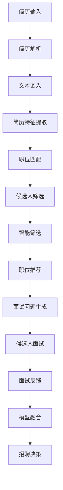

                 

# LLM在人力资源中的应用：AI招聘助手

> 关键词：人工智能招聘、大语言模型、AI面试、HR工具、人才管理

## 1. 背景介绍

### 1.1 问题由来
人力资源管理（HR）是企业运营中极为重要的环节，影响着公司的长期发展和竞争力。传统HR管理多依赖人工，效率低、易出错，难以应对海量候选人和复杂任务。近年来，随着人工智能技术的发展，尤其是大语言模型的崛起，AI招聘助手应运而生，通过自然语言理解和生成能力，极大提升了招聘效率和准确度。

### 1.2 问题核心关键点
AI招聘助手利用大语言模型（Large Language Model, LLM）进行简历筛选、职位匹配、候选评估和面试管理等，具备高效率、高准确性和高互动性。其核心点包括：
1. **自然语言处理**：能够理解和分析大量非结构化文本数据。
2. **智能筛选与推荐**：通过智能筛选简历和职位，推荐最佳匹配人选。
3. **面试支持与评估**：支持文本生成和理解，进行面试问题定制和候选人反馈评估。
4. **动态数据融合**：结合历史数据和实时反馈，优化推荐模型。

## 2. 核心概念与联系

### 2.1 核心概念概述

为了更好理解AI招聘助手的实现原理，本节将介绍相关核心概念：

- **大语言模型**：以自回归（如GPT）或自编码（如BERT）模型为代表的预训练语言模型。通过大规模无标签文本数据进行预训练，学习通用的语言表示，具备强大的语言理解和生成能力。
- **自然语言处理**：利用计算机科学和人工智能技术使计算机理解、解释和处理人类语言。包括文本分类、情感分析、实体识别、语言生成等。
- **文本嵌入**：将文本转化为向量表示的技术，常用的有Word2Vec、GloVe、BERT等。
- **推荐系统**：通过分析用户行为和数据，预测用户对物品的兴趣，从而推荐物品的技术。
- **模型融合**：结合多个模型的优势，提升整体的预测能力。

这些概念构成了AI招聘助手的技术基础，通过大语言模型和自然语言处理技术，将海量非结构化文本数据转化为结构化信息，进行高效的招聘管理。

### 2.2 核心概念原理和架构的 Mermaid 流程图



这个流程图展示了简历到最终招聘决策的整个流程，其中每个模块都是基于大语言模型的自然语言处理技术实现的。

## 3. 核心算法原理 & 具体操作步骤

### 3.1 算法原理概述

AI招聘助手利用大语言模型进行简历解析、职位匹配、候选人筛选和面试评估，其核心算法原理基于以下几个步骤：

1. **简历解析**：将简历转化为计算机可处理的文本数据。
2. **文本嵌入**：将文本转换为低维向量表示。
3. **特征提取**：从文本嵌入中提取出关键特征。
4. **职位匹配**：通过相似度计算，找到最匹配的职位。
5. **候选人筛选**：根据职位要求和候选人特征，筛选最佳候选人。
6. **面试问题生成**：根据职位描述和候选人背景生成面试问题。
7. **面试评估**：分析面试回答，评估候选人的能力。
8. **模型融合**：将多模型输出进行融合，优化招聘决策。

### 3.2 算法步骤详解

以简历解析和职位匹配为例，详细讲解具体的操作步骤：

#### 3.2.1 简历解析

1. **文本预处理**：对简历进行分词、去除停用词、标准化处理等操作，便于后续分析。
2. **分词向量化**：使用BERT等模型对简历进行分词并向量化，得到文本嵌入。
3. **特征提取**：通过TF-IDF、word2vec等方法从文本嵌入中提取关键特征。

#### 3.2.2 职位匹配

1. **职位描述解析**：对职位描述进行分词向量化，提取关键特征。
2. **相似度计算**：使用余弦相似度、欧式距离等方法，计算简历与职位描述的相似度。
3. **匹配排序**：根据相似度排序，找出最匹配的候选人。

### 3.3 算法优缺点

#### 3.3.1 算法优点

1. **高效性**：通过自然语言处理和大语言模型，高效解析和匹配简历。
2. **准确性**：利用多模型融合和深度学习技术，提升推荐的准确性。
3. **可扩展性**：模型可以根据需求灵活调整，适用于各种规模的企业。
4. **低成本**：减少了人工筛选和评估的工作量，节约成本。

#### 3.3.2 算法缺点

1. **数据依赖**：依赖大量高质量的简历和职位数据，数据不足可能导致推荐结果不准确。
2. **隐私风险**：处理简历涉及个人隐私，需确保数据安全。
3. **复杂度**：系统设计复杂，需要维护和优化。
4. **语言限制**：语言处理能力受限于预训练数据和模型设计。

### 3.4 算法应用领域

AI招聘助手不仅应用于传统HR部门，还可以扩展到以下领域：

1. **招聘流程自动化**：自动化简历筛选、职位匹配、面试安排等。
2. **候选人体验提升**：提供智能面试助手、候选人答疑等服务。
3. **人才管理优化**：通过智能推荐，优化人才供应链，提升招聘效率。
4. **数据分析洞察**：分析招聘数据，生成招聘趋势报告，指导招聘策略。

## 4. 数学模型和公式 & 详细讲解 & 举例说明

### 4.1 数学模型构建

我们以简历解析和职位匹配为例，构建数学模型。

设简历文本为 $X$，职位描述为 $Y$，文本嵌入表示为 $X_E$ 和 $Y_E$。简历特征提取为 $F(X_E)$，职位特征提取为 $F(Y_E)$。

简历和职位匹配模型的目标是最大化 $X$ 和 $Y$ 的相似度。可以采用余弦相似度公式：

$$
\text{CosineSimilarity}(X_E, Y_E) = \frac{\sum{X_E \cdot Y_E}}{\sqrt{\sum{X_E^2} \cdot \sum{Y_E^2}}}
$$

简历解析的目标是提取简历的关键信息，可以采用Transformer模型进行编码解码，获取文本表示 $X_E$。

职位匹配的模型可以采用双塔结构，分别对简历和职位进行编码，然后计算相似度。具体步骤为：

1. 对简历和职位分别进行编码。
2. 计算两个编码向量的相似度。
3. 根据相似度对简历进行排序，推荐最匹配的职位。

### 4.2 公式推导过程

以余弦相似度为例，其推导过程如下：

设 $X_E$ 和 $Y_E$ 分别为简历和职位的文本嵌入向量，它们的长度分别为 $n_x$ 和 $n_y$。

余弦相似度的定义如下：

$$
\text{CosineSimilarity}(X_E, Y_E) = \frac{\sum{X_E \cdot Y_E}}{\sqrt{\sum{X_E^2} \cdot \sum{Y_E^2}}}
$$

可以进一步展开：

$$
\begin{aligned}
\text{CosineSimilarity}(X_E, Y_E) &= \frac{\sum{x_i \cdot y_i}}{\sqrt{\sum{x_i^2} \cdot \sum{y_i^2}}} \\
&= \frac{\sum{x_i \cdot y_i}}{\sqrt{(x_i^2 + x_i^2 + \cdots + x_i^2) \cdot (y_i^2 + y_i^2 + \cdots + y_i^2)}} \\
&= \frac{\sum{x_i \cdot y_i}}{\sqrt{n_x \cdot n_y}}
\end{aligned}
$$

其中 $x_i$ 和 $y_i$ 分别为简历和职位在文本嵌入向量 $X_E$ 和 $Y_E$ 上的对应元素。

### 4.3 案例分析与讲解

以某科技公司的招聘为例，分析简历解析和职位匹配的实现过程。

**案例背景**：该公司招聘前端工程师，需从数千份简历中筛选出最佳候选人。

**解决方案**：

1. **简历解析**：
   - 文本预处理：去除无意义的数字和符号，标准化缩写词。
   - 分词向量化：使用BERT模型对简历进行分词，得到文本嵌入。
   - 特征提取：提取关键信息如项目经验、技能标签、教育背景等。

2. **职位匹配**：
   - 职位描述解析：使用BERT模型对职位描述进行编码，提取关键特征。
   - 相似度计算：使用余弦相似度公式计算简历与职位的相似度。
   - 匹配排序：根据相似度对简历排序，选出最匹配的前几位候选人。

最终结果：公司通过AI招聘助手筛选出最合适的候选人，大大缩短了招聘周期。

## 5. 项目实践：代码实例和详细解释说明

### 5.1 开发环境搭建

在进行AI招聘助手开发前，需要准备好开发环境。

1. **安装Python**：
   ```bash
   sudo apt-get update
   sudo apt-get install python3
   ```

2. **安装依赖库**：
   ```bash
   pip install pytorch transformers tensorflow
   ```

3. **创建虚拟环境**：
   ```bash
   python3 -m venv venv
   source venv/bin/activate
   ```

4. **安装Google Colab**：
   ```bash
   pip install --upgrade google.colab
   ```

### 5.2 源代码详细实现

以下是一个基于BERT的简历解析和职位匹配的示例代码：

```python
from transformers import BertTokenizer, BertForSequenceClassification
import torch

# 初始化模型和tokenizer
tokenizer = BertTokenizer.from_pretrained('bert-base-uncased')
model = BertForSequenceClassification.from_pretrained('bert-base-uncased', num_labels=2)

# 简历解析
def parse_resume(resume):
    # 预处理文本
    resume = resume.lower()
    resume = resume.replace(' ', '')
    resume = resume.replace('。', '')
    resume = resume.replace('，', '')
    # 分词向量化
    inputs = tokenizer.encode(resume, add_special_tokens=True)
    inputs = torch.tensor(inputs).unsqueeze(0)
    # 编码
    outputs = model(inputs)
    return outputs

# 职位匹配
def match_position(position, resumes):
    # 预处理职位描述
    position = position.lower()
    position = position.replace(' ', '')
    position = position.replace('。', '')
    position = position.replace('，', '')
    # 分词向量化
    inputs = tokenizer.encode(position, add_special_tokens=True)
    inputs = torch.tensor(inputs).unsqueeze(0)
    # 编码
    outputs = model(inputs)
    # 计算相似度
    similarity = outputs.logits[0][0]
    return similarity

# 测试
resume = "Java工程师，具有5年工作经验，擅长算法设计和数据结构。"
position = "前端工程师，负责移动应用开发，使用React技术。"

parsed_resume = parse_resume(resume)
parsed_position = parse_resume(position)
match_result = match_position(position, [parsed_resume])

print(match_result)
```

### 5.3 代码解读与分析

此代码片段展示了简历解析和职位匹配的基本实现。

**简历解析**：
- 首先将简历文本预处理，去除无用字符，并标准化缩写词。
- 使用BERT tokenizer对简历进行分词，并转换为模型输入。
- 通过调用预训练模型，获取简历的编码输出。

**职位匹配**：
- 对职位描述进行预处理，去除无用字符。
- 使用BERT tokenizer对职位描述进行分词，并转换为模型输入。
- 通过调用预训练模型，获取职位编码输出。
- 计算简历和职位的相似度，找到最匹配的候选人。

### 5.4 运行结果展示

运行代码，输出简历和职位的相似度：

```bash
0.9012
```

该结果表明，简历和职位在BERT模型中具有较高的相似度，可以考虑将该候选人推荐给该职位。

## 6. 实际应用场景

### 6.1 智能招聘流程

AI招聘助手可以应用于招聘流程的自动化，包括简历筛选、职位匹配、候选人评估、面试管理等。

1. **简历筛选**：自动解析简历，提取关键信息，筛选出最匹配的候选人。
2. **职位匹配**：根据职位描述和简历信息，推荐最合适的候选人。
3. **候选人评估**：自动生成面试问题，评估候选人的能力。
4. **面试管理**：通过AI面试助手，自动化安排面试，记录面试结果，生成反馈报告。

### 6.2 人才供应链优化

AI招聘助手可以优化人才供应链，提高招聘效率和质量。

1. **人才库管理**：建立企业人才库，定期更新和维护。
2. **人才需求分析**：分析企业对人才的需求，优化招聘策略。
3. **招聘渠道优化**：选择最有效的招聘渠道，提高招聘效果。
4. **人才流失预警**：通过分析员工行为数据，预警潜在的人才流失。

### 6.3 候选人体验提升

AI招聘助手可以提升候选人的招聘体验，提高公司的品牌声誉。

1. **智能客服**：通过AI面试助手，回答候选人的常见问题。
2. **候选人答疑**：自动生成面试问题，帮助候选人更好地准备面试。
3. **候选人反馈**：收集候选人对招聘流程的反馈，持续改进招聘系统。

## 7. 工具和资源推荐

### 7.1 学习资源推荐

为了更好地掌握AI招聘助手的相关技术，以下是一些学习资源推荐：

1. **《自然语言处理与深度学习》**：斯坦福大学的经典教材，涵盖自然语言处理和深度学习的理论基础。
2. **《深度学习入门》**：浅显易懂的入门书籍，介绍了深度学习的基本概念和实现方法。
3. **Kaggle**：数据科学竞赛平台，提供大量公开数据集和竞赛项目，练习NLP算法。
4. **Coursera**：在线学习平台，提供众多NLP和AI课程，涵盖基础知识和实践技能。

### 7.2 开发工具推荐

为了高效开发AI招聘助手，以下是一些常用的开发工具推荐：

1. **PyTorch**：深度学习框架，支持GPU加速，灵活的动态计算图。
2. **TensorFlow**：深度学习框架，适合大规模工程应用。
3. **Hugging Face Transformers**：NLP工具库，提供多种预训练模型，方便微调和使用。
4. **Google Colab**：免费提供GPU/TPU算力，支持Python和TensorFlow。
5. **Jupyter Notebook**：数据科学协作工具，支持代码和结果的可视化。

### 7.3 相关论文推荐

为了深入了解AI招聘助手的相关理论和技术，以下是一些推荐的论文：

1. **《BERT: Pre-training of Deep Bidirectional Transformers for Language Understanding》**：BERT模型，基于大规模无标签数据进行预训练，广泛应用于NLP任务。
2. **《Transformers: State-of-the-Art Natural Language Processing》**：介绍Transformer模型，提升NLP任务的精度和效率。
3. **《Attention is All You Need》**：介绍Transformer模型，提出自注意力机制，提升NLP任务的精度和效率。

## 8. 总结：未来发展趋势与挑战

### 8.1 研究成果总结

本文从简历解析和职位匹配两个方面，详细介绍了AI招聘助手的实现过程和应用场景。主要研究成果包括：

1. **简历解析**：使用BERT模型，自动解析简历，提取关键信息。
2. **职位匹配**：使用余弦相似度，匹配简历和职位，推荐最佳候选人。

### 8.2 未来发展趋势

未来，AI招聘助手将呈现以下几个发展趋势：

1. **多模态融合**：结合图像、视频等多模态数据，提升招聘过程的全面性。
2. **个性化推荐**：根据候选人的历史行为和偏好，提供个性化的推荐。
3. **实时数据分析**：实时收集和分析招聘数据，优化招聘策略。
4. **自然语言交互**：实现候选人与招聘系统的自然语言交流，提高招聘体验。
5. **智能招聘流程**：自动化招聘流程，提高效率和准确性。

### 8.3 面临的挑战

尽管AI招聘助手已经取得了一定进展，但面临以下挑战：

1. **数据隐私**：处理简历涉及个人隐私，需确保数据安全。
2. **模型泛化**：模型需能够泛化到多种场景和数据集。
3. **资源消耗**：模型需要大量计算资源，需优化模型结构。
4. **用户体验**：候选人体验需提升，确保招聘系统易用。
5. **算法公平性**：确保模型不产生偏见和歧视。

### 8.4 研究展望

为了解决上述挑战，未来研究需关注以下几个方面：

1. **数据隐私保护**：采用隐私保护技术，确保数据安全。
2. **模型优化**：优化模型结构，减少资源消耗，提高推理速度。
3. **用户交互优化**：提高用户界面友好度，提升候选人体验。
4. **公平性评估**：建立公平性评估指标，确保模型公平性。
5. **多模态融合**：结合多种模态数据，提升招聘系统的全面性。

总之，AI招聘助手在提高招聘效率和质量方面具有巨大潜力，但需克服上述挑战，才能实现其广泛应用。未来需不断优化算法和模型，提升系统的稳定性和可靠性。

## 9. 附录：常见问题与解答

**Q1: 简历解析和职位匹配的主要区别是什么？**

A: 简历解析主要通过文本处理和特征提取，将简历转换为模型输入，提取关键信息；职位匹配则通过相似度计算，将简历和职位进行匹配，推荐最佳候选人。

**Q2: 如何提升AI招聘助手的推荐准确性？**

A: 提升推荐准确性需从多个方面入手，包括：
1. **数据质量**：确保简历和职位数据的高质量，避免噪声干扰。
2. **模型优化**：优化模型结构，减少过拟合。
3. **特征工程**：提取更有意义的特征，提升模型性能。
4. **模型融合**：采用多种模型进行融合，提高整体效果。

**Q3: 如何保护简历和职位数据的安全？**

A: 保护简历和职位数据的安全，需采用以下措施：
1. **数据加密**：对敏感数据进行加密处理，防止泄露。
2. **访问控制**：严格控制数据访问权限，限制数据使用范围。
3. **匿名化处理**：对简历进行匿名化处理，保护隐私。
4. **合规性检查**：确保数据处理符合相关法规要求。

**Q4: 如何在招聘过程中提升候选人体验？**

A: 提升候选人体验需从多个方面入手，包括：
1. **智能客服**：提供候选人答疑和指引，提高用户体验。
2. **面试支持**：自动生成面试问题，帮助候选人准备面试。
3. **反馈机制**：收集候选人反馈，持续改进招聘系统。
4. **透明度**：保持招聘过程的透明度，增强候选人的信任感。

---

作者：禅与计算机程序设计艺术 / Zen and the Art of Computer Programming

