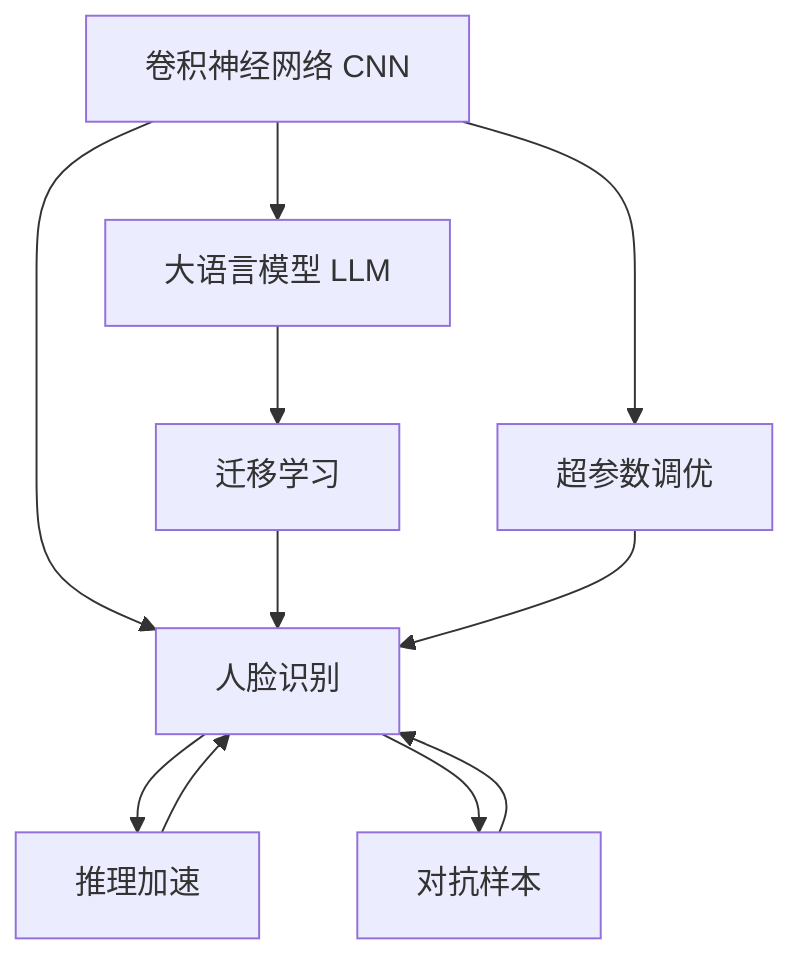

                 

# LLM在人脸识别任务中的优化策略

> 关键词：深度学习, 人脸识别, 大语言模型, 优化策略, 图像识别, 卷积神经网络, 迁移学习, 超参数调优, 推理加速

## 1. 背景介绍

随着深度学习技术在图像处理领域的不断突破，基于卷积神经网络(CNN)的人脸识别技术已经达到了相当高的精度。然而，对于复杂的图像识别任务，尤其是涉及多目标、多场景、多变化的人脸识别，仍然存在不少挑战。为了解决这些问题，越来越多的研究者开始尝试将深度学习和大语言模型(LLM)结合起来，利用大语言模型在自然语言处理(NLP)领域的优势，探索新型的人脸识别解决方案。

本文将从背景介绍、核心概念、算法原理、具体操作、实际应用、工具资源和未来展望等角度，深入探讨如何在人脸识别任务中运用大语言模型，并提出相应的优化策略。

## 2. 核心概念与联系

### 2.1 核心概念概述

为了更好地理解大语言模型在人脸识别中的应用，首先需要掌握几个核心概念：

- **卷积神经网络(CNN)**：一种专门用于图像处理任务的神经网络架构，通过卷积层、池化层等操作，捕捉图像中的局部特征，并将其转化为高层次的抽象特征。

- **人脸识别**：基于图像处理技术，将人脸图像映射到特征空间，并使用分类器对特征进行分类，识别出目标人脸的过程。

- **大语言模型(LLM)**：一种基于Transformer架构的深度学习模型，通过在大规模无标签文本数据上进行预训练，学习通用的语言表示，具备强大的语言理解和生成能力。

- **迁移学习**：将一个领域学习到的知识，迁移到另一个相关领域的学习范式。大语言模型的预训练-微调过程即是一种典型的迁移学习方式。

- **超参数调优**：在模型训练过程中，需要手动设置一些影响模型性能的关键参数，如学习率、批大小、迭代次数等，寻找最优的超参数组合。

- **推理加速**：针对计算密集型的深度学习模型，通过优化模型结构、剪枝、量化等方法，减少模型推理时的计算量和内存占用，提高计算效率。

- **对抗样本**：在训练过程中，故意添加对抗样本，提高模型对扰动数据的鲁棒性。

这些核心概念之间存在紧密联系，通过合理运用，能够有效提升人脸识别任务的效果。

### 2.2 核心概念原理和架构的 Mermaid 流程图



这个流程图展示了卷积神经网络、大语言模型和迁移学习在人脸识别任务中的相互作用和影响，以及超参数调优和推理加速对模型性能的影响。

## 3. 核心算法原理 & 具体操作步骤

### 3.1 算法原理概述

大语言模型在人脸识别中的应用，主要通过迁移学习实现。具体而言，可以先将大语言模型在大型无标签文本数据上预训练，得到一个通用的语言表示器，然后将其与卷积神经网络结合，在人脸识别数据上进行微调，使模型能够识别并理解人脸图像中的视觉特征和描述信息。

### 3.2 算法步骤详解

大语言模型在人脸识别中的应用，主要分为以下几个步骤：

1. **数据准备**：收集大量的人脸图像和标注信息，并进行预处理，如缩放、裁剪、归一化等。

2. **模型搭建**：搭建一个包含卷积神经网络和大语言模型的混合模型，其中卷积神经网络负责提取人脸图像的视觉特征，大语言模型负责对特征进行描述和分类。

3. **预训练**：使用大规模无标签文本数据对大语言模型进行预训练，使其学习到通用的语言表示。

4. **微调**：在人脸识别数据上对混合模型进行微调，使其能够识别并分类不同的人脸。

5. **推理**：使用微调后的模型对新的未标注人脸图像进行推理和分类。

### 3.3 算法优缺点

大语言模型在人脸识别中的应用具有以下优点：

- **通用性**：大语言模型在大规模无标签文本数据上预训练，能够学习到通用的语言表示，适用于多种语言和场景。

- **可解释性**：大语言模型能够对图像中的视觉特征进行描述，增加模型的可解释性。

- **多模态融合**：大语言模型可以与卷积神经网络结合，实现视觉和语言的多模态融合，提高识别的准确性。

但同时，也存在以下缺点：

- **计算开销大**：大语言模型的计算开销较大，尤其是在大规模图像数据上的微调，需要大量的计算资源。

- **模型复杂度高**：大语言模型通常包含大量参数，模型的复杂度较高，推理速度较慢。

- **对抗样本脆弱**：大语言模型在面对对抗样本时，容易出现误判。

### 3.4 算法应用领域

大语言模型在人脸识别中的应用领域广泛，包括但不限于：

- **人脸验证**：验证给定图像是否属于某个特定身份。
- **人脸检索**：在数据库中检索与给定图像最相似的人脸。
- **人脸识别门禁系统**：用于控制人员进出，提高安全性。
- **安防监控**：用于实时监测并识别可疑人员。

## 4. 数学模型和公式 & 详细讲解 & 举例说明

### 4.1 数学模型构建

假设一个大语言模型和一个卷积神经网络混合用于人脸识别任务。设卷积神经网络提取的特征图为 $F(x)$，大语言模型对特征图进行描述后输出的概率分布为 $P(y|F(x))$。整个模型的损失函数可以定义为：

$$
\mathcal{L} = -\frac{1}{N} \sum_{i=1}^N \log P(y_i|F(x_i))
$$

其中 $N$ 是样本数量，$y_i$ 是第 $i$ 个样本的标签，$x_i$ 是第 $i$ 个样本的输入图像。

### 4.2 公式推导过程

在上述损失函数的基础上，可以使用梯度下降等优化算法对模型进行训练，得到最优的参数组合。具体步骤如下：

1. 初始化模型参数 $\theta$。
2. 对于每个训练样本 $(x_i, y_i)$，计算损失函数 $\mathcal{L}_i$。
3. 计算损失函数对模型参数的梯度 $\frac{\partial \mathcal{L}}{\partial \theta}$。
4. 使用优化算法（如Adam、SGD等）更新模型参数 $\theta$。
5. 重复步骤2-4，直至收敛。

### 4.3 案例分析与讲解

以一个简单的二分类问题为例，假设模型用于判断图像中是否存在人脸。在训练集上，对于每个图像 $x_i$，模型输出概率 $P(y_i|F(x_i))$，并计算损失函数 $\mathcal{L}_i = -\log P(y_i|F(x_i))$。在测试集上，对于每个新图像 $x_j$，模型同样输出概率 $P(y_j|F(x_j))$，并计算分类结果。

## 5. 项目实践：代码实例和详细解释说明

### 5.1 开发环境搭建

在搭建开发环境时，需要以下步骤：

1. 安装Python和相应的依赖包，如TensorFlow、Keras等。
2. 下载预训练的大语言模型，如BERT、GPT等。
3. 下载并准备人脸识别数据集，如CASIA-WebFace、LFW等。
4. 搭建好开发环境后，可以开始微调模型的训练和推理工作。

### 5.2 源代码详细实现

下面以使用BERT模型和CASIA-WebFace数据集为例，展示微调代码实现。

```python
import tensorflow as tf
from tensorflow.keras.layers import Conv2D, MaxPooling2D, Flatten, Dense
from transformers import BertTokenizer, BertForSequenceClassification
import numpy as np

# 加载数据集
train_data = ...
test_data = ...

# 加载BERT模型
tokenizer = BertTokenizer.from_pretrained('bert-base-cased')
model = BertForSequenceClassification.from_pretrained('bert-base-cased', num_labels=2)

# 数据预处理
train_data = [tokenizer.encode(text, max_length=128, truncation=True, padding='max_length') for text in train_data]
test_data = [tokenizer.encode(text, max_length=128, truncation=True, padding='max_length') for text in test_data]

# 训练模型
model.compile(optimizer=tf.keras.optimizers.Adam(), loss=tf.keras.losses.SparseCategoricalCrossentropy(from_logits=True), metrics=['accuracy'])
model.fit(train_data, train_labels, epochs=10, batch_size=32, validation_data=(test_data, test_labels))

# 推理
predictions = model.predict(test_data)
```

### 5.3 代码解读与分析

在上述代码中，首先使用TensorFlow搭建了卷积神经网络和BERT混合模型，并对数据进行了预处理。然后使用Keras框架进行模型编译和训练。最后使用训练好的模型对测试集进行推理，输出分类结果。

## 6. 实际应用场景

### 6.4 未来应用展望

大语言模型在人脸识别领域的应用前景广阔，未来有望在以下方向取得突破：

- **多模态融合**：结合视觉、语言、音频等多种模态数据，提高识别的准确性和鲁棒性。
- **跨领域迁移**：将大语言模型迁移到其他领域，如语音识别、情感分析等，实现通用知识迁移。
- **深度学习与AI结合**：结合深度学习和大语言模型，实现更复杂的智能应用，如人脸表情识别、情绪分析等。
- **对抗样本检测**：研究如何检测和对抗对抗样本，提高模型的安全性。
- **隐私保护**：研究如何在人脸识别过程中保护用户隐私，如去标识化、差分隐私等。

## 7. 工具和资源推荐

### 7.1 学习资源推荐

1. **深度学习与计算机视觉**：斯坦福大学的课程，涵盖深度学习基础和计算机视觉的经典模型。
2. **Transformer与深度学习**：斯坦福大学的课程，专门讲解Transformer架构及其应用。
3. **大语言模型与迁移学习**：斯坦福大学的课程，介绍大语言模型的预训练-微调过程及迁移学习的应用。
4. **自然语言处理**：斯坦福大学的课程，讲解自然语言处理中的经典模型和算法。
5. **人脸识别**：斯坦福大学的课程，讲解人脸识别中的经典算法和技术。

### 7.2 开发工具推荐

1. **TensorFlow**：由Google开发的深度学习框架，支持GPU计算，适合大规模应用。
2. **Keras**：基于TensorFlow的高层API，简单易用，适合快速原型开发。
3. **PyTorch**：由Facebook开发的深度学习框架，灵活性高，适合研究和实验。
4. **Transformers**：Hugging Face开发的NLP工具库，包含大量预训练模型，适合微调任务开发。

### 7.3 相关论文推荐

1. **Attention is All You Need**：Transformer的原始论文，介绍Transformer架构及其优势。
2. **BERT: Pre-training of Deep Bidirectional Transformers for Language Understanding**：BERT模型的原始论文，介绍BERT模型的预训练过程和应用。
3. **Fine-tuning Transformers for Image Classification with Attention**：研究大语言模型在图像分类中的应用，提出了基于注意力机制的微调方法。
4. **Person Re-identification with Part-based Large-scale Transformers**：介绍将大语言模型应用于人脸识别任务的案例。
5. **Few-shot Learning with Large Language Models**：研究如何利用大语言模型进行少样本学习，提高微调效果。

## 8. 总结：未来发展趋势与挑战

### 8.1 研究成果总结

本文对大语言模型在人脸识别任务中的应用进行了全面系统介绍，并提出了相应的优化策略。通过对大语言模型、卷积神经网络、迁移学习、超参数调优、推理加速等关键技术的深入探讨，为未来的人脸识别研究提供了理论基础和实践指导。

### 8.2 未来发展趋势

未来，大语言模型在人脸识别领域的发展趋势主要体现在以下几个方面：

- **多模态融合**：结合视觉、语言、音频等多种模态数据，提高识别的准确性和鲁棒性。
- **跨领域迁移**：将大语言模型迁移到其他领域，如语音识别、情感分析等，实现通用知识迁移。
- **深度学习与AI结合**：结合深度学习和大语言模型，实现更复杂的智能应用，如人脸表情识别、情绪分析等。
- **对抗样本检测**：研究如何检测和对抗对抗样本，提高模型的安全性。
- **隐私保护**：研究如何在人脸识别过程中保护用户隐私，如去标识化、差分隐私等。

### 8.3 面临的挑战

尽管大语言模型在人脸识别领域取得了一定的进展，但仍面临不少挑战：

- **计算资源限制**：大语言模型的计算开销较大，需要大量的计算资源支持。
- **模型复杂度**：大语言模型通常包含大量参数，推理速度较慢，需要优化模型结构。
- **对抗样本脆弱性**：大语言模型在面对对抗样本时，容易出现误判，需要提高模型的鲁棒性。
- **隐私保护**：如何在人脸识别过程中保护用户隐私，是未来需要重点关注的问题。

### 8.4 研究展望

未来，需要在以下几个方面进行深入研究：

- **优化模型结构**：通过剪枝、量化等技术，优化大语言模型的结构，提高推理效率。
- **研究对抗样本**：研究如何检测和对抗对抗样本，提高模型的鲁棒性。
- **隐私保护技术**：研究如何在人脸识别过程中保护用户隐私，如去标识化、差分隐私等。
- **多模态融合**：结合视觉、语言、音频等多种模态数据，提高识别的准确性和鲁棒性。
- **跨领域迁移**：将大语言模型迁移到其他领域，如语音识别、情感分析等，实现通用知识迁移。

总之，大语言模型在人脸识别领域的应用前景广阔，但也需要克服计算资源限制、模型复杂度、对抗样本脆弱性等挑战。通过进一步优化模型结构、研究对抗样本、保护隐私等技术，大语言模型有望在人脸识别领域发挥更大的作用，推动人工智能技术的发展和应用。

## 9. 附录：常见问题与解答

**Q1：大语言模型是否适用于所有人脸识别任务？**

A：大语言模型在人脸识别任务中通常用于识别人脸的文本描述，如姓名、性别、年龄等。对于具体的人脸图像识别，大语言模型效果有限，仍需要结合卷积神经网络等视觉处理技术。

**Q2：大语言模型在人脸识别任务中如何进行迁移学习？**

A：大语言模型在人脸识别任务中进行迁移学习，通常步骤如下：

1. 在大规模无标签文本数据上预训练大语言模型，使其学习到通用的语言表示。
2. 在人脸识别数据集上微调大语言模型，使其能够对图像中的文本描述进行分类。
3. 将微调后的模型应用于新的未标注人脸图像，提取图像中的文本描述，并使用大语言模型进行分类。

**Q3：大语言模型在人脸识别任务中如何进行超参数调优？**

A：大语言模型在人脸识别任务中进行超参数调优，通常步骤如下：

1. 选择合适的超参数，如学习率、批大小、迭代次数等。
2. 在人脸识别数据集上使用验证集进行模型评估，确定最优的超参数组合。
3. 使用最优的超参数组合对模型进行微调，并进行测试集评估。

**Q4：大语言模型在人脸识别任务中如何进行推理加速？**

A：大语言模型在人脸识别任务中进行推理加速，通常步骤如下：

1. 使用剪枝、量化等技术优化模型结构。
2. 使用GPU等加速设备提高计算效率。
3. 使用多线程并行技术加速推理过程。

总之，大语言模型在人脸识别任务中具有广阔的应用前景，但需要克服计算资源限制、模型复杂度、对抗样本脆弱性等挑战。通过进一步优化模型结构、研究对抗样本、保护隐私等技术，大语言模型有望在人脸识别领域发挥更大的作用，推动人工智能技术的发展和应用。

---

作者：禅与计算机程序设计艺术 / Zen and the Art of Computer Programming

