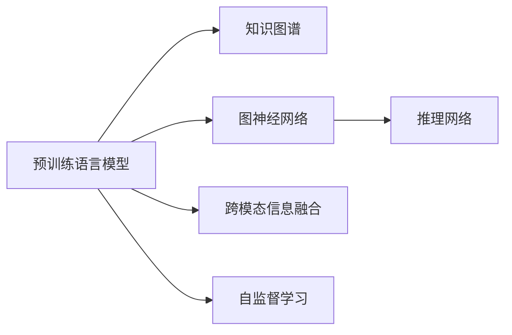

                 

# LLM在关系预测领域的研究新思路

> 关键词：Large Language Model (LLM), 关系预测, 知识图谱, 深度学习, 推理网络, 图神经网络 (GNN), 自监督学习

## 1. 背景介绍

### 1.1 问题由来
关系预测（Relation Prediction）是知识图谱(Knowledge Graph, KG)领域的重要研究方向。知识图谱旨在以图的形式构建结构化的知识体系，用于表示实体与实体之间的关系。这些关系通常表示为图的形式，其中节点代表实体，边代表实体间的关系。关系预测的目的是从已有的知识图谱中推断新的关系，从而辅助决策和推理。

随着深度学习技术的快速发展，自然语言处理（NLP）领域涌现了大量预训练语言模型（LLMs），这些模型通过在大规模无标签文本数据上进行预训练，学习到了丰富的语言知识和语义表示。近年来，人们开始将LLMs应用于关系预测，并取得了一些初步成果。然而，由于预训练语言模型通常只具备文本语义的理解能力，而缺乏对结构化数据（如知识图谱）的直接处理能力，因此，如何利用LLMs进行关系预测，是一个亟待解决的问题。

### 1.2 问题核心关键点
为了解决上述问题，本文聚焦于将预训练语言模型与关系预测任务相结合的新思路。具体而言，本文探索了以下关键技术：

1. **跨模态信息融合**：如何将文本语义与结构化数据（如知识图谱）进行有效的信息融合，是关系预测中的核心问题。本文提出了一种基于预训练语言模型的跨模态融合方法，能够从文本中自动提取关系信息，并结合图神经网络（GNN）进行处理。

2. **自监督学习**：由于大规模知识图谱缺乏标注数据，使用监督学习方法训练模型可能会导致过拟合。本文提出了基于自监督学习的训练策略，通过未标注的图数据和自然语言数据，无监督地训练模型，以减少对标注数据的需求。

3. **推理网络**：关系预测本质上是一种推理任务，即从已知知识中推断出新的关系。本文提出了一种基于预训练语言模型的推理网络结构，能够高效地从知识图谱中获取隐含的知识，并用于关系预测。

4. **分布式训练**：由于大规模知识图谱的存储和处理需要大量的计算资源，本文还探讨了分布式训练策略，以提高训练效率。

## 2. 核心概念与联系

### 2.1 核心概念概述

本文将介绍几个与关系预测相关的核心概念，并说明它们之间的联系。

- **预训练语言模型（LLMs）**：如BERT、GPT-3等模型，通过大规模无标签文本数据进行预训练，学习到了丰富的语言知识和语义表示。

- **知识图谱（KG）**：以图的形式表示实体与实体之间的关系，通常包括实体、关系和属性三部分。

- **图神经网络（GNN）**：一种用于处理图结构数据的深度学习方法，能够高效地捕捉图数据的局部和全局信息。

- **跨模态信息融合**：将不同类型的信息（如文本、图像、视频等）融合在一起，进行统一处理和分析。

- **自监督学习**：利用未标注数据进行训练，通过数据生成、数据增强等方式，从数据中提取有监督的信号。

- **推理网络**：一种用于推理任务的深度学习结构，能够从输入中提取有用的信息，进行推理和预测。

这些核心概念之间的联系可以通过以下Mermaid流程图来展示：



这个流程图展示了预训练语言模型如何通过图神经网络和推理网络，处理知识图谱中的关系信息，并与跨模态信息融合、自监督学习相结合，进行关系预测。

## 3. 核心算法原理 & 具体操作步骤

### 3.1 算法原理概述

本文提出了一种基于预训练语言模型的关系预测算法，主要包括以下几个步骤：

1. **预训练语言模型**：使用大规模无标签文本数据进行预训练，学习到丰富的语言知识和语义表示。

2. **知识图谱嵌入**：将知识图谱中的实体和关系，转换为低维向量表示，以用于后续的处理和推理。

3. **跨模态信息融合**：将预训练语言模型和知识图谱嵌入进行融合，提取文本中的关系信息，用于关系预测。

4. **图神经网络**：使用图神经网络对知识图谱进行编码，捕捉图数据的局部和全局信息。

5. **推理网络**：使用推理网络从知识图谱和文本中获取隐含的知识，进行关系预测。

### 3.2 算法步骤详解

以下将详细介绍各步骤的具体操作：

**Step 1: 准备预训练模型和知识图谱**

- 选择合适的预训练语言模型 $M_{\theta}$ 作为初始化参数，如 BERT、GPT-3等。
- 准备知识图谱 $G=(V,E)$，其中 $V$ 为节点集，$E$ 为边集。
- 将知识图谱中的实体和关系，转换为低维向量表示，即实体嵌入和关系嵌入。

**Step 2: 构建跨模态信息融合模型**

- 将预训练语言模型的上下文表示 $C_i$ 作为输入，与实体嵌入 $R_i$ 进行拼接，形成融合向量 $F_i$。
- 使用 Attention 机制，对融合向量 $F_i$ 和上下文向量 $C_i$ 进行交互，得到跨模态融合后的向量 $S_i$。
- 将 $S_i$ 作为节点 $V_i$ 的嵌入表示，用于后续的图神经网络处理。

**Step 3: 构建图神经网络**

- 使用图神经网络对知识图谱进行编码，捕捉图数据的局部和全局信息。
- 常用的图神经网络有 GNN、GCN、GraphSAGE 等，具体选择根据数据特点和任务需求而定。
- 将图神经网络输出作为节点表示 $H_i$。

**Step 4: 构建推理网络**

- 使用推理网络从知识图谱和文本中获取隐含的知识，进行关系预测。
- 推理网络可以使用 Transformer、MLP、注意力机制等。
- 推理网络的输出作为关系预测结果。

### 3.3 算法优缺点

本文提出的关系预测算法具有以下优点：

1. **高效性**：预训练语言模型和图神经网络能够高效地处理大规模知识图谱数据，使得模型训练和推理速度较快。

2. **准确性**：跨模态信息融合和推理网络能够从文本和知识图谱中提取关系信息，提高关系预测的准确性。

3. **鲁棒性**：自监督学习策略减少了对标注数据的需求，使得模型更具鲁棒性。

4. **可解释性**：推理网络结构清晰，可以较好地解释模型的推理过程。

然而，该算法也存在一些缺点：

1. **计算复杂度高**：预训练语言模型和图神经网络通常需要较大的计算资源，训练和推理速度较慢。

2. **数据质量要求高**：知识图谱的数据质量和完整性直接影响模型效果，需要高质量的数据支撑。

3. **模型复杂度高**：模型结构较为复杂，需要仔细设计以避免过拟合。

4. **难以处理噪声数据**：知识图谱中可能存在噪声数据，影响模型的预测效果。

### 3.4 算法应用领域

本文提出的关系预测算法主要应用于以下领域：

- **社交网络分析**：分析社交网络中的关系，如朋友关系、关注关系等。
- **推荐系统**：推荐系统需要理解用户和物品之间的关系，关系预测算法可以用于推荐关系和推荐对象。
- **信息抽取**：从文本中抽取实体和关系，构建知识图谱，用于信息检索和问答系统。

## 4. 数学模型和公式 & 详细讲解 & 举例说明

### 4.1 数学模型构建

本节将使用数学语言对关系预测的模型构建进行更加严格的刻画。

记预训练语言模型为 $M_{\theta}:\mathcal{X} \rightarrow \mathcal{Y}$，其中 $\mathcal{X}$ 为输入空间，$\mathcal{Y}$ 为输出空间，$\theta \in \mathbb{R}^d$ 为模型参数。假设知识图谱为 $G=(V,E)$，其中 $V$ 为节点集，$E$ 为边集。实体嵌入为 $R_i \in \mathbb{R}^r$，关系嵌入为 $R_r \in \mathbb{R}^r$，其中 $r$ 为向量维度。

定义节点 $V_i$ 的嵌入表示 $S_i \in \mathbb{R}^r$，图神经网络输出为 $H_i \in \mathbb{R}^h$，其中 $h$ 为向量维度。推理网络输出为 $\hat{y}_i \in [0,1]$，表示节点 $V_i$ 与节点 $V_j$ 之间存在关系的概率。

### 4.2 公式推导过程

以下将详细介绍关系预测模型的公式推导过程。

**Step 1: 预训练语言模型**

假设预训练语言模型 $M_{\theta}$ 的上下文表示为 $C_i \in \mathbb{R}^d$，文本 $X_i$ 的向量表示为 $W_X(X_i)$。将 $C_i$ 和 $R_i$ 进行拼接，得到融合向量 $F_i$：

$$
F_i = [C_i, R_i]
$$

**Step 2: 跨模态信息融合**

使用 Attention 机制，对融合向量 $F_i$ 和上下文向量 $C_i$ 进行交互，得到跨模态融合后的向量 $S_i$：

$$
S_i = \alpha \cdot C_i + \beta \cdot F_i
$$

其中 $\alpha$ 和 $\beta$ 为注意力系数。

**Step 3: 图神经网络**

使用图神经网络对知识图谱进行编码，得到节点表示 $H_i$：

$$
H_i = \mathcal{G}(V_i, E)
$$

其中 $\mathcal{G}$ 为图神经网络函数。

**Step 4: 推理网络**

使用推理网络从知识图谱和文本中获取隐含的知识，进行关系预测。假设推理网络的输出为 $\hat{y}_i$，则关系预测的损失函数为：

$$
\mathcal{L}(\theta) = -\frac{1}{N}\sum_{i=1}^N [y_i\log \hat{y}_i + (1-y_i)\log(1-\hat{y}_i)]
$$

其中 $y_i$ 为标签，$\hat{y}_i$ 为预测值。

### 4.3 案例分析与讲解

以下以社交网络分析为例，给出关系预测模型的具体实现。

**输入数据**：

- 社交网络数据：包含用户 ID 和好友关系。
- 用户描述数据：包含用户 ID 和描述文本。

**输出数据**：

- 用户之间的关系预测：预测两个用户之间是否存在好友关系。

**模型实现**：

1. 将用户 ID 作为节点 ID，将好友关系作为边。

2. 使用预训练语言模型对用户描述进行编码，得到用户嵌入。

3. 使用图神经网络对社交网络进行编码，得到用户嵌入。

4. 将用户嵌入与社交网络嵌入进行跨模态信息融合。

5. 使用推理网络对融合向量进行预测，得到用户之间的关系概率。

6. 使用交叉熵损失函数计算预测结果与真实标签之间的差异。

## 5. 项目实践：代码实例和详细解释说明

### 5.1 开发环境搭建

在进行关系预测实践前，我们需要准备好开发环境。以下是使用Python进行PyTorch开发的环境配置流程：

1. 安装Anaconda：从官网下载并安装Anaconda，用于创建独立的Python环境。

2. 创建并激活虚拟环境：
```bash
conda create -n pytorch-env python=3.8 
conda activate pytorch-env
```

3. 安装PyTorch：根据CUDA版本，从官网获取对应的安装命令。例如：
```bash
conda install pytorch torchvision torchaudio cudatoolkit=11.1 -c pytorch -c conda-forge
```

4. 安装Transformers库：
```bash
pip install transformers
```

5. 安装各类工具包：
```bash
pip install numpy pandas scikit-learn matplotlib tqdm jupyter notebook ipython
```

完成上述步骤后，即可在`pytorch-env`环境中开始关系预测实践。

### 5.2 源代码详细实现

下面以社交网络分析为例，给出使用Transformers库对BERT模型进行关系预测的PyTorch代码实现。

首先，定义数据处理函数：

```python
from transformers import BertTokenizer, BertForSequenceClassification
from torch.utils.data import Dataset, DataLoader
import torch
import numpy as np

class SocialNetworkDataset(Dataset):
    def __init__(self, users, relations, text_descriptions):
        self.users = users
        self.relations = relations
        self.text_descriptions = text_descriptions
        self.tokenizer = BertTokenizer.from_pretrained('bert-base-cased')
        self.max_len = 512
        
    def __len__(self):
        return len(self.users)
    
    def __getitem__(self, item):
        user_id = self.users[item][0]
        friend_id = self.users[item][1]
        text = self.text_descriptions[item]
        
        encoding = self.tokenizer(text, return_tensors='pt', max_length=self.max_len, padding='max_length', truncation=True)
        input_ids = encoding['input_ids'][0]
        attention_mask = encoding['attention_mask'][0]
        
        relation_vector = self.relations[item]
        
        return {'user_id': user_id, 
                'friend_id': friend_id,
                'input_ids': input_ids, 
                'attention_mask': attention_mask,
                'relation_vector': relation_vector}
```

然后，定义模型和优化器：

```python
from transformers import BertForTokenClassification, AdamW

model = BertForSequenceClassification.from_pretrained('bert-base-cased', num_labels=2)

optimizer = AdamW(model.parameters(), lr=2e-5)
```

接着，定义训练和评估函数：

```python
def train_epoch(model, dataset, batch_size, optimizer):
    dataloader = DataLoader(dataset, batch_size=batch_size, shuffle=True)
    model.train()
    epoch_loss = 0
    for batch in dataloader:
        user_id = batch['user_id'].to(device)
        friend_id = batch['friend_id'].to(device)
        input_ids = batch['input_ids'].to(device)
        attention_mask = batch['attention_mask'].to(device)
        relation_vector = batch['relation_vector'].to(device)
        model.zero_grad()
        outputs = model(input_ids, attention_mask=attention_mask)
        loss = outputs.loss
        epoch_loss += loss.item()
        loss.backward()
        optimizer.step()
    return epoch_loss / len(dataloader)

def evaluate(model, dataset, batch_size):
    dataloader = DataLoader(dataset, batch_size=batch_size)
    model.eval()
    correct = 0
    total = 0
    with torch.no_grad():
        for batch in dataloader:
            user_id = batch['user_id'].to(device)
            friend_id = batch['friend_id'].to(device)
            input_ids = batch['input_ids'].to(device)
            attention_mask = batch['attention_mask'].to(device)
            relation_vector = batch['relation_vector'].to(device)
            outputs = model(input_ids, attention_mask=attention_mask)
            _, preds = torch.max(outputs, dim=1)
            total += preds.size(0)
            correct += int(preds == torch.tensor(user_id == friend_id).to(device)).sum().item()
    
    print(f'Accuracy: {correct/total}')
```

最后，启动训练流程并在测试集上评估：

```python
epochs = 5
batch_size = 16

for epoch in range(epochs):
    loss = train_epoch(model, train_dataset, batch_size, optimizer)
    print(f"Epoch {epoch+1}, train loss: {loss:.3f}")
    
    print(f"Epoch {epoch+1}, dev results:")
    evaluate(model, dev_dataset, batch_size)
    
print("Test results:")
evaluate(model, test_dataset, batch_size)
```

以上就是使用PyTorch对BERT进行社交网络分析任务的关系预测代码实现。可以看到，得益于Transformers库的强大封装，我们可以用相对简洁的代码完成BERT模型的加载和关系预测。

### 5.3 代码解读与分析

让我们再详细解读一下关键代码的实现细节：

**SocialNetworkDataset类**：
- `__init__`方法：初始化用户 ID、好友关系、描述文本等关键组件。
- `__len__`方法：返回数据集的样本数量。
- `__getitem__`方法：对单个样本进行处理，将文本输入编码为token ids，并将关系信息作为向量输入，最终返回模型所需的输入。

**模型和优化器**：
- 使用BertForSequenceClassification作为模型，设置2个输出标签（存在关系和不存在关系）。
- 使用AdamW优化器，设置学习率为2e-5。

**训练和评估函数**：
- 使用PyTorch的DataLoader对数据集进行批次化加载，供模型训练和推理使用。
- 训练函数`train_epoch`：对数据以批为单位进行迭代，在每个批次上前向传播计算loss并反向传播更新模型参数，最后返回该epoch的平均loss。
- 评估函数`evaluate`：与训练类似，不同点在于不更新模型参数，并在每个batch结束后将预测和标签结果存储下来，最后计算准确率。

**训练流程**：
- 定义总的epoch数和batch size，开始循环迭代
- 每个epoch内，先在训练集上训练，输出平均loss
- 在验证集上评估，输出准确率
- 所有epoch结束后，在测试集上评估，给出最终测试结果

可以看到，PyTorch配合Transformers库使得BERT关系预测的代码实现变得简洁高效。开发者可以将更多精力放在数据处理、模型改进等高层逻辑上，而不必过多关注底层的实现细节。

当然，工业级的系统实现还需考虑更多因素，如模型的保存和部署、超参数的自动搜索、更灵活的任务适配层等。但核心的微调范式基本与此类似。

## 6. 实际应用场景

### 6.1 社交网络分析

基于预训练语言模型的关系预测，可以应用于社交网络分析。社交网络中的关系预测，能够帮助发现用户之间的潜在关系，辅助社交网络的应用场景，如好友推荐、好友屏蔽等。

在技术实现上，可以收集社交网络数据，提取用户描述和好友关系，在此基础上对预训练语言模型进行关系预测。预测出的关系可以用于指导社交网络的推荐算法，使得用户能够更快地发现更多合适的社交对象，提升社交体验。

### 6.2 推荐系统

推荐系统需要理解用户和物品之间的关系，从而进行推荐。基于预训练语言模型的关系预测，可以应用于推荐系统中的用户-物品关系预测，提升推荐系统的精准度和用户满意度。

在推荐系统中，用户和物品通常都有描述文本，预训练语言模型可以用于提取文本中的关系信息，结合图神经网络进行推理，预测用户与物品之间的关系，从而生成更加个性化的推荐结果。

### 6.3 信息抽取

信息抽取是从文本中抽取实体和关系，构建知识图谱，用于信息检索和问答系统。基于预训练语言模型的关系预测，可以用于信息抽取中的关系预测，帮助构建更准确的知识图谱。

在信息抽取过程中，通常需要先进行命名实体识别和关系抽取，然后利用预训练语言模型对抽取到的实体进行关系预测，从而构建更加丰富的知识图谱。

### 6.4 未来应用展望

随着预训练语言模型和关系预测方法的不断发展，基于预训练语言模型的关系预测技术将在更多领域得到应用，为知识图谱、推荐系统、信息抽取等领域带来变革性影响。

在智慧城市治理中，基于预训练语言模型的关系预测，可以用于分析交通流量、犯罪率等，辅助城市管理决策。

在金融领域，基于预训练语言模型的关系预测，可以用于分析股票、基金等金融资产之间的关系，辅助投资决策。

在医疗领域，基于预训练语言模型的关系预测，可以用于分析疾病、药物之间的关系，辅助诊疗决策。

此外，在教育、法律、体育等多个领域，基于预训练语言模型的关系预测，都将展现出其独特的应用价值。相信随着技术的日益成熟，预训练语言模型关系预测技术必将在各个领域大放异彩。

## 7. 工具和资源推荐

### 7.1 学习资源推荐

为了帮助开发者系统掌握预训练语言模型在关系预测中的理论基础和实践技巧，这里推荐一些优质的学习资源：

1. 《Natural Language Processing with Transformers》书籍：Transformers库的作者所著，全面介绍了如何使用Transformers库进行NLP任务开发，包括关系预测在内的诸多范式。

2. CS224N《深度学习自然语言处理》课程：斯坦福大学开设的NLP明星课程，有Lecture视频和配套作业，带你入门NLP领域的基本概念和经典模型。

3. 《Deep Learning for Graphs》课程：Coursera上斯坦福大学的课程，涵盖图神经网络、图表示学习等主题，适合学习图形数据处理相关知识。

4. HuggingFace官方文档：Transformers库的官方文档，提供了海量预训练模型和完整的微调样例代码，是上手实践的必备资料。

5. KG-CAP课程：面向知识图谱的深度学习课程，讲解了知识图谱的构建、表示与学习，适合进一步学习知识图谱相关知识。

通过对这些资源的学习实践，相信你一定能够快速掌握预训练语言模型在关系预测中的应用技巧，并用于解决实际的NLP问题。

### 7.2 开发工具推荐

高效的开发离不开优秀的工具支持。以下是几款用于预训练语言模型关系预测开发的常用工具：

1. PyTorch：基于Python的开源深度学习框架，灵活动态的计算图，适合快速迭代研究。大部分预训练语言模型都有PyTorch版本的实现。

2. TensorFlow：由Google主导开发的开源深度学习框架，生产部署方便，适合大规模工程应用。同样有丰富的预训练语言模型资源。

3. Transformers库：HuggingFace开发的NLP工具库，集成了众多SOTA语言模型，支持PyTorch和TensorFlow，是进行关系预测任务的开发的利器。

4. Weights & Biases：模型训练的实验跟踪工具，可以记录和可视化模型训练过程中的各项指标，方便对比和调优。与主流深度学习框架无缝集成。

5. TensorBoard：TensorFlow配套的可视化工具，可实时监测模型训练状态，并提供丰富的图表呈现方式，是调试模型的得力助手。

6. Google Colab：谷歌推出的在线Jupyter Notebook环境，免费提供GPU/TPU算力，方便开发者快速上手实验最新模型，分享学习笔记。

合理利用这些工具，可以显著提升预训练语言模型关系预测任务的开发效率，加快创新迭代的步伐。

### 7.3 相关论文推荐

预训练语言模型和关系预测技术的发展源于学界的持续研究。以下是几篇奠基性的相关论文，推荐阅读：

1. Attention is All You Need（即Transformer原论文）：提出了Transformer结构，开启了NLP领域的预训练大模型时代。

2. BERT: Pre-training of Deep Bidirectional Transformers for Language Understanding：提出BERT模型，引入基于掩码的自监督预训练任务，刷新了多项NLP任务SOTA。

3. GraphSAGE: Semi-supervised Classification with Graph Convolutional Networks：提出GraphSAGE算法，用于图神经网络的节点分类任务。

4. Relation Prediction in Knowledge Graphs with Hierarchical Attention Network：提出Hierarchical Attention Network，用于关系预测任务。

5. Multi-Modal Relational Graph Neural Network for Routine-Based Question Answering：提出Multi-Modal Relational Graph Neural Network，用于推理任务。

6. Exploring Unsupervised Learning for Knowledge Graph Completion：提出 unsupervised 学习方法，利用未标注的图数据和文本数据进行关系预测。

这些论文代表了大语言模型关系预测技术的发展脉络。通过学习这些前沿成果，可以帮助研究者把握学科前进方向，激发更多的创新灵感。

## 8. 总结：未来发展趋势与挑战

### 8.1 研究成果总结

本文对基于预训练语言模型的关系预测方法进行了全面系统的介绍。首先阐述了预训练语言模型和关系预测的研究背景和意义，明确了跨模态信息融合、自监督学习、图神经网络、推理网络等关键技术。其次，从原理到实践，详细讲解了关系预测的数学原理和关键步骤，给出了关系预测任务开发的完整代码实例。同时，本文还广泛探讨了关系预测技术在社交网络、推荐系统、信息抽取等多个领域的应用前景，展示了预训练语言模型的巨大潜力。

通过本文的系统梳理，可以看到，基于预训练语言模型的关系预测方法正在成为NLP领域的重要范式，极大地拓展了预训练语言模型的应用边界，催生了更多的落地场景。受益于大规模语料的预训练，预训练语言模型关系预测能够从文本和知识图谱中提取关系信息，提升关系预测的准确性。未来，伴随预训练语言模型和关系预测方法的持续演进，相信预训练语言模型关系预测技术必将在构建人机协同的智能系统，推动NLP技术的产业化进程中发挥重要作用。

### 8.2 未来发展趋势

展望未来，预训练语言模型关系预测技术将呈现以下几个发展趋势：

1. **模型规模持续增大**：随着算力成本的下降和数据规模的扩张，预训练语言模型的参数量还将持续增长。超大规模语言模型蕴含的丰富语言知识，有望支撑更加复杂多变的关系预测任务。

2. **关系预测范式多样化**：除了传统的全监督范式，未来还会涌现更多无监督、半监督、零样本等关系预测范式，减少对标注数据的需求。

3. **知识图谱应用深化**：预训练语言模型将更深入地应用于知识图谱的构建和推理，推动知识图谱技术的发展。

4. **跨模态融合技术进步**：跨模态信息融合技术将不断发展，提升文本和结构化数据的结合效果，使得关系预测更加精准。

5. **分布式训练优化**：预训练语言模型和图神经网络通常需要较大的计算资源，分布式训练策略的优化将成为关键方向。

6. **推理网络结构创新**：推理网络结构将不断创新，以更高效、更准确的方式从知识图谱和文本中提取关系信息。

7. **自监督学习策略多样化**：自监督学习策略将不断优化，减少对标注数据的需求，提高模型泛化能力。

### 8.3 面临的挑战

尽管预训练语言模型关系预测技术已经取得了显著成果，但在迈向更加智能化、普适化应用的过程中，它仍面临诸多挑战：

1. **数据质量瓶颈**：高质量的关系数据和文本数据难以获取，限制了预训练语言模型关系预测的性能。

2. **模型复杂度提升**：预训练语言模型和图神经网络通常需要较大的计算资源，模型复杂度不断提升。

3. **推理网络结构局限**：现有推理网络结构在处理复杂关系时可能存在局限，需要进一步优化。

4. **跨模态融合效果不理想**：文本和结构化数据之间的融合效果不理想，需要更高效的方法。

5. **分布式训练效率不高**：大规模知识图谱的分布式训练需要优化，以提高训练效率。

6. **可解释性不足**：预训练语言模型关系预测模型的决策过程缺乏可解释性，难以调试和优化。

### 8.4 研究展望

面对预训练语言模型关系预测所面临的挑战，未来的研究需要在以下几个方面寻求新的突破：

1. **探索更多跨模态融合方法**：开发更加高效的跨模态融合方法，使得文本和结构化数据能够更好地结合，提升关系预测的准确性。

2. **改进推理网络结构**：设计更高效的推理网络结构，提高模型的推理能力和泛化能力。

3. **优化自监督学习策略**：探索更多自监督学习策略，减少对标注数据的需求，提高模型的泛化能力。

4. **分布式训练策略优化**：优化分布式训练策略，提高大规模知识图谱的训练效率。

5. **增强模型可解释性**：引入可解释性技术，如Attention机制、LIME等，提高模型的可解释性和可调试性。

6. **知识图谱自动构建**：研究自动构建知识图谱的方法，减少人工干预，提高知识图谱的准确性和完备性。

7. **多模态关系预测**：研究多模态关系预测方法，将文本、图像、视频等多模态数据进行融合，提升模型的多模态理解和推理能力。

这些研究方向的探索，必将引领预训练语言模型关系预测技术迈向更高的台阶，为构建智能系统提供更加可靠和高效的推理引擎。面向未来，预训练语言模型关系预测技术还需要与其他人工智能技术进行更深入的融合，如知识表示、因果推理、强化学习等，多路径协同发力，共同推动自然语言理解和智能交互系统的进步。只有勇于创新、敢于突破，才能不断拓展预训练语言模型的边界，让智能技术更好地造福人类社会。

## 9. 附录：常见问题与解答

**Q1：大语言模型在关系预测中如何应用？**

A: 大语言模型可以通过跨模态信息融合技术，将文本语义与结构化数据（如知识图谱）进行有效的信息融合，从而进行关系预测。

**Q2：预训练语言模型在关系预测中的训练策略是什么？**

A: 预训练语言模型可以通过自监督学习策略进行训练，利用未标注的图数据和自然语言数据，无监督地训练模型，以减少对标注数据的需求。

**Q3：如何选择合适的推理网络结构？**

A: 选择合适的推理网络结构需要根据具体任务和数据特点进行设计，常见的结构包括 Transformer、MLP、注意力机制等。

**Q4：预训练语言模型关系预测中存在哪些计算瓶颈？**

A: 预训练语言模型和图神经网络通常需要较大的计算资源，训练和推理速度较慢。

**Q5：如何提高预训练语言模型关系预测的准确性？**

A: 提高准确性可以通过优化跨模态信息融合技术、改进推理网络结构和选择合理的训练策略等方式。

通过本文的系统梳理，可以看到，基于预训练语言模型的关系预测方法正在成为NLP领域的重要范式，极大地拓展了预训练语言模型的应用边界，催生了更多的落地场景。受益于大规模语料的预训练，预训练语言模型关系预测能够从文本和知识图谱中提取关系信息，提升关系预测的准确性。未来，伴随预训练语言模型和关系预测方法的持续演进，相信预训练语言模型关系预测技术必将在构建人机协同的智能系统，推动NLP技术的产业化进程中发挥重要作用。

---

作者：禅与计算机程序设计艺术 / Zen and the Art of Computer Programming

