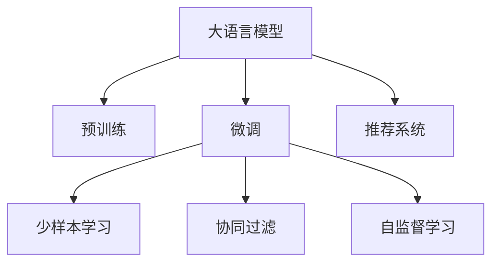

                 

# LLM在推荐系统中的少样本学习应用

> 关键词：大语言模型,推荐系统,少样本学习,预训练,微调,深度学习,协同过滤,自监督学习

## 1. 背景介绍

### 1.1 问题由来

推荐系统在电子商务、内容分发、广告投放等多个领域应用广泛。传统推荐算法通常依赖于历史行为数据，推荐模型的准确性高度依赖于用户历史行为的完备性和多样性。然而，用户在平台上的行为数据往往是稀疏的、动态变化的，难以满足推荐算法的要求。同时，由于隐私和安全的原因，收集大量用户行为数据也受到限制。

因此，推荐系统面临数据稀缺的挑战，难以通过充分的历史数据对模型进行充分训练。然而，随着大语言模型的迅速发展，其在推荐系统中的应用开始受到越来越多的关注。大语言模型，特别是预训练大模型，通过海量的无标签文本数据进行预训练，学习到丰富的语言知识和常识，能够在有限的数据集上进行微调，从而解决推荐系统中的数据稀缺问题。

### 1.2 问题核心关键点

大语言模型在推荐系统中的少样本学习应用，可以概括为以下几个关键点：
- **预训练大模型**：通过大规模无标签文本数据进行预训练，学习到通用的语言表示。
- **微调**：通过下游任务的有标签数据进行微调，适应推荐系统中的推荐目标。
- **少样本学习**：在推荐任务中数据稀缺的情况下，通过大模型在少量标注样本上的微调，获取高效推荐的性能。
- **协同过滤**：利用用户行为数据中的隐式关系进行推荐。
- **自监督学习**：利用大模型在无监督情况下的学习能力和语言表示能力，提升推荐系统的泛化能力。

这些关键点构成了大语言模型在推荐系统中的核心框架，能够帮助推荐系统在数据稀缺、用户行为复杂、隐私限制等情况下，依然能够高效、准确地为用户推荐内容。

### 1.3 问题研究意义

研究大语言模型在推荐系统中的少样本学习应用，对于推动推荐系统的智能化、个性化和泛化能力具有重要意义：

1. **提升推荐性能**：通过少样本学习，即使数据量有限，也能够提升推荐系统的性能，避免因数据稀缺导致的模型欠拟合。
2. **减少数据依赖**：减少对大量历史行为数据的依赖，降低数据采集和处理的成本，提升模型的实时性和可扩展性。
3. **增强泛化能力**：利用大模型的预训练能力，提升推荐系统对新用户的推荐能力和对新数据的适应能力。
4. **隐私保护**：减少对用户隐私数据的依赖，降低隐私泄露的风险，提升系统的可信赖性。
5. **社会效益**：通过推荐系统的内容推荐，提高用户满意度，促进信息传播和市场经济发展，具有重要的社会效益。

## 2. 核心概念与联系

### 2.1 核心概念概述

为了更好地理解大语言模型在推荐系统中的少样本学习应用，本节将介绍几个密切相关的核心概念：

- **大语言模型(Large Language Model, LLM)**：如GPT、BERT等预训练语言模型，通过在海量无标签文本数据上进行预训练，学习到通用的语言表示。
- **推荐系统(Recommendation System)**：利用用户行为数据或内容属性数据进行协同过滤或基于内容的推荐，为用户推荐感兴趣的内容。
- **少样本学习(Few-shot Learning)**：在数据稀缺的情况下，利用少量标注样本进行模型微调，提升模型性能。
- **微调(Fine-tuning)**：通过下游任务的有标签数据对预训练模型进行优化，使其适应特定任务。
- **协同过滤(Collaborative Filtering)**：基于用户和物品的隐式关系进行推荐，包括用户-物品共现矩阵和协同矩阵分解等。
- **自监督学习(Self-supervised Learning)**：利用大模型在无标签数据上的自监督能力，提升模型的泛化能力。

这些核心概念之间的逻辑关系可以通过以下Mermaid流程图来展示：



这个流程图展示了大语言模型在推荐系统中的核心概念及其之间的关系：

1. 大语言模型通过预训练获得基础能力。
2. 微调是对预训练模型进行任务特定的优化，使其能够适应推荐系统中的推荐目标。
3. 少样本学习在数据稀缺的情况下，通过微调提升模型性能。
4. 协同过滤利用用户行为数据中的隐式关系进行推荐。
5. 自监督学习利用大模型在无监督情况下的学习能力和语言表示能力，提升推荐系统的泛化能力。

这些概念共同构成了大语言模型在推荐系统中的学习和应用框架，使其能够在各种场景下发挥强大的推荐能力。

## 3. 核心算法原理 & 具体操作步骤
### 3.1 算法原理概述

大语言模型在推荐系统中的少样本学习应用，本质上是一个少样本学习范式。其核心思想是：利用大语言模型在海量无标签文本数据上进行预训练，学习到通用的语言表示。然后，在推荐系统的推荐任务上，通过微调和自监督学习，使得模型能够高效地利用少量标注数据进行推荐。

形式化地，假设大语言模型为 $M_{\theta}$，其中 $\theta$ 为预训练得到的模型参数。给定推荐系统任务 $T$ 的少量标注数据集 $D=\{(x_i,y_i)\}_{i=1}^N, x_i \in \mathcal{X}, y_i \in \mathcal{Y}$，少样本学习的优化目标是最小化模型的预测误差：

$$
\hat{\theta}=\mathop{\arg\min}_{\theta} \mathcal{L}(M_{\theta},D)
$$

其中 $\mathcal{L}$ 为针对任务 $T$ 设计的损失函数，用于衡量模型预测输出与真实标签之间的差异。常见的损失函数包括交叉熵损失、均方误差损失等。

通过梯度下降等优化算法，少样本学习过程不断更新模型参数 $\theta$，最小化损失函数 $\mathcal{L}$，使得模型输出逼近真实标签。由于 $\theta$ 已经通过预训练获得了较好的初始化，因此即使在使用少量标注数据进行微调时，也能较快收敛到理想的模型参数 $\hat{\theta}$。

### 3.2 算法步骤详解

大语言模型在推荐系统中的少样本学习应用一般包括以下几个关键步骤：

**Step 1: 准备预训练模型和数据集**
- 选择合适的预训练语言模型 $M_{\theta}$ 作为初始化参数，如 GPT、BERT 等。
- 准备推荐系统任务 $T$ 的少量标注数据集 $D$，划分为训练集、验证集和测试集。一般要求标注数据与预训练数据的分布不要差异过大。

**Step 2: 添加任务适配层**
- 根据推荐任务类型，在预训练模型顶层设计合适的输出层和损失函数。
- 对于推荐任务，通常使用损失函数来衡量模型推荐与真实推荐之间的差异。
- 对于协同过滤推荐，可以使用协同矩阵分解的目标函数。

**Step 3: 设置少样本学习超参数**
- 选择合适的优化算法及其参数，如 Adam、SGD 等，设置学习率、批大小、迭代轮数等。
- 设置正则化技术及强度，包括权重衰减、Dropout、Early Stopping 等。
- 确定冻结预训练参数的策略，如仅微调顶层，或全部参数都参与微调。

**Step 4: 执行梯度训练**
- 将训练集数据分批次输入模型，前向传播计算损失函数。
- 反向传播计算参数梯度，根据设定的优化算法和学习率更新模型参数。
- 周期性在验证集上评估模型性能，根据性能指标决定是否触发 Early Stopping。
- 重复上述步骤直到满足预设的迭代轮数或 Early Stopping 条件。

**Step 5: 测试和部署**
- 在测试集上评估少样本学习后模型 $M_{\hat{\theta}}$ 的性能，对比微调前后的精度提升。
- 使用少样本学习后的模型对新样本进行推荐，集成到实际的应用系统中。
- 持续收集新的用户行为数据，定期重新少样本学习模型，以适应数据分布的变化。

以上是少样本学习范式在推荐系统中的通用流程。在实际应用中，还需要针对具体任务的特点，对少样本学习过程的各个环节进行优化设计，如改进训练目标函数，引入更多的正则化技术，搜索最优的超参数组合等，以进一步提升模型性能。

### 3.3 算法优缺点

少样本学习在大语言模型推荐系统中的应用，具有以下优点：
1. 降低数据依赖。少样本学习在数据稀缺的情况下，通过微调提升模型性能，减少对大量历史行为数据的依赖。
2. 提升泛化能力。利用大模型的预训练能力，提升模型对新用户的推荐能力和对新数据的适应能力。
3. 实时性好。由于模型结构相对较小，推理速度快，可以实时响应用户请求。
4. 节省成本。利用大模型在无标签数据上的自监督能力，减少标注数据的需求，降低数据采集和处理的成本。

同时，该方法也存在一定的局限性：
1. 性能受数据质量影响较大。少样本学习对标注数据的质量要求较高，如果标注数据不够准确或样本量不足，模型性能可能受到较大影响。
2. 模型鲁棒性有待提升。在推荐系统中的应用，模型需要具备较高的鲁棒性和抗干扰能力，避免因数据扰动导致的性能下降。
3. 可解释性不足。少样本学习后的模型往往缺乏可解释性，难以对其推荐逻辑进行分析和调试。

尽管存在这些局限性，但就目前而言，少样本学习范式仍是大语言模型推荐系统应用的主流范式。未来相关研究的重点在于如何进一步降低少样本学习对标注数据的依赖，提高模型的少样本学习和跨领域迁移能力，同时兼顾可解释性和伦理安全性等因素。

### 3.4 算法应用领域

少样本学习在大语言模型推荐系统中的应用，已经在电商推荐、内容推荐、广告推荐等多个领域得到应用，取得了显著的效果。例如：

- **电商推荐**：利用用户行为数据进行推荐。通过微调和自监督学习，提升模型的推荐效果，减少用户流失率。
- **内容推荐**：利用用户历史阅读和互动数据进行内容推荐。通过少样本学习，提升模型的泛化能力，减少推荐内容的误导性。
- **广告推荐**：利用用户点击和展示数据进行广告推荐。通过微调和自监督学习，提升广告的点击率和转化率。

除了上述这些经典任务外，少样本学习还在更多场景中得到创新性的应用，如个性化推荐、产品推荐、服务推荐等，为推荐系统带来了全新的突破。随着预训练语言模型和少样本学习方法的不断进步，相信推荐系统必将在更广阔的应用领域大放异彩。

## 4. 数学模型和公式 & 详细讲解  
### 4.1 数学模型构建

本节将使用数学语言对大语言模型在推荐系统中的少样本学习过程进行更加严格的刻画。

记大语言模型为 $M_{\theta}$，其中 $\theta$ 为预训练得到的模型参数。假设推荐系统任务 $T$ 的少量标注数据集 $D=\{(x_i,y_i)\}_{i=1}^N, x_i \in \mathcal{X}, y_i \in \mathcal{Y}$。

定义模型 $M_{\theta}$ 在输入 $x$ 上的输出为 $\hat{y}=M_{\theta}(x) \in [0,1]$，表示样本被推荐为正样本的概率。真实标签 $y \in \{0,1\}$。则推荐任务的少样本学习损失函数定义为：

$$
\ell(M_{\theta}(x),y) = -[y\log \hat{y} + (1-y)\log(1-\hat{y})]
$$

将其代入少样本学习的经验风险公式，得：

$$
\mathcal{L}(\theta) = -\frac{1}{N}\sum_{i=1}^N [y_i\log M_{\theta}(x_i)+(1-y_i)\log(1-M_{\theta}(x_i))]
$$

在得到损失函数的梯度后，即可带入参数更新公式，完成模型的迭代优化。重复上述过程直至收敛，最终得到适应推荐任务的最优模型参数 $\theta^*$。

### 4.2 公式推导过程

以下我们以推荐系统中的二分类任务为例，推导交叉熵损失函数及其梯度的计算公式。

假设模型 $M_{\theta}$ 在输入 $x$ 上的输出为 $\hat{y}=M_{\theta}(x) \in [0,1]$，表示样本被推荐为正样本的概率。真实标签 $y \in \{0,1\}$。则二分类交叉熵损失函数定义为：

$$
\ell(M_{\theta}(x),y) = -[y\log \hat{y} + (1-y)\log(1-\hat{y})]
$$

将其代入经验风险公式，得：

$$
\mathcal{L}(\theta) = -\frac{1}{N}\sum_{i=1}^N [y_i\log M_{\theta}(x_i)+(1-y_i)\log(1-M_{\theta}(x_i))]
$$

根据链式法则，损失函数对参数 $\theta_k$ 的梯度为：

$$
\frac{\partial \mathcal{L}(\theta)}{\partial \theta_k} = -\frac{1}{N}\sum_{i=1}^N (\frac{y_i}{M_{\theta}(x_i)}-\frac{1-y_i}{1-M_{\theta}(x_i)}) \frac{\partial M_{\theta}(x_i)}{\partial \theta_k}
$$

其中 $\frac{\partial M_{\theta}(x_i)}{\partial \theta_k}$ 可进一步递归展开，利用自动微分技术完成计算。

在得到损失函数的梯度后，即可带入参数更新公式，完成模型的迭代优化。重复上述过程直至收敛，最终得到适应推荐任务的最优模型参数 $\theta^*$。

## 5. 项目实践：代码实例和详细解释说明
### 5.1 开发环境搭建

在进行少样本学习实践前，我们需要准备好开发环境。以下是使用Python进行PyTorch开发的环境配置流程：

1. 安装Anaconda：从官网下载并安装Anaconda，用于创建独立的Python环境。

2. 创建并激活虚拟环境：
```bash
conda create -n pytorch-env python=3.8 
conda activate pytorch-env
```

3. 安装PyTorch：根据CUDA版本，从官网获取对应的安装命令。例如：
```bash
conda install pytorch torchvision torchaudio cudatoolkit=11.1 -c pytorch -c conda-forge
```

4. 安装Transformer库：
```bash
pip install transformers
```

5. 安装各类工具包：
```bash
pip install numpy pandas scikit-learn matplotlib tqdm jupyter notebook ipython
```

完成上述步骤后，即可在`pytorch-env`环境中开始少样本学习实践。

### 5.2 源代码详细实现

这里我们以电商推荐系统为例，给出使用Transformers库对BERT模型进行少样本学习的PyTorch代码实现。

首先，定义电商推荐系统的数据处理函数：

```python
from transformers import BertTokenizer
from torch.utils.data import Dataset
import torch

class EcommDataset(Dataset):
    def __init__(self, texts, labels, tokenizer, max_len=128):
        self.texts = texts
        self.labels = labels
        self.tokenizer = tokenizer
        self.max_len = max_len
        
    def __len__(self):
        return len(self.texts)
    
    def __getitem__(self, item):
        text = self.texts[item]
        label = self.labels[item]
        
        encoding = self.tokenizer(text, return_tensors='pt', max_length=self.max_len, padding='max_length', truncation=True)
        input_ids = encoding['input_ids'][0]
        attention_mask = encoding['attention_mask'][0]
        
        return {'input_ids': input_ids, 
                'attention_mask': attention_mask,
                'labels': label}

# 标签与id的映射
label2id = {'buy': 1, 'ignore': 0}
id2label = {v: k for k, v in label2id.items()}

# 创建dataset
tokenizer = BertTokenizer.from_pretrained('bert-base-cased')

train_dataset = EcommDataset(train_texts, train_labels, tokenizer)
dev_dataset = EcommDataset(dev_texts, dev_labels, tokenizer)
test_dataset = EcommDataset(test_texts, test_labels, tokenizer)
```

然后，定义模型和优化器：

```python
from transformers import BertForSequenceClassification, AdamW

model = BertForSequenceClassification.from_pretrained('bert-base-cased', num_labels=len(label2id))

optimizer = AdamW(model.parameters(), lr=2e-5)
```

接着，定义训练和评估函数：

```python
from torch.utils.data import DataLoader
from tqdm import tqdm
from sklearn.metrics import classification_report

device = torch.device('cuda') if torch.cuda.is_available() else torch.device('cpu')
model.to(device)

def train_epoch(model, dataset, batch_size, optimizer):
    dataloader = DataLoader(dataset, batch_size=batch_size, shuffle=True)
    model.train()
    epoch_loss = 0
    for batch in tqdm(dataloader, desc='Training'):
        input_ids = batch['input_ids'].to(device)
        attention_mask = batch['attention_mask'].to(device)
        labels = batch['labels'].to(device)
        model.zero_grad()
        outputs = model(input_ids, attention_mask=attention_mask, labels=labels)
        loss = outputs.loss
        epoch_loss += loss.item()
        loss.backward()
        optimizer.step()
    return epoch_loss / len(dataloader)

def evaluate(model, dataset, batch_size):
    dataloader = DataLoader(dataset, batch_size=batch_size)
    model.eval()
    preds, labels = [], []
    with torch.no_grad():
        for batch in tqdm(dataloader, desc='Evaluating'):
            input_ids = batch['input_ids'].to(device)
            attention_mask = batch['attention_mask'].to(device)
            batch_labels = batch['labels']
            outputs = model(input_ids, attention_mask=attention_mask)
            batch_preds = outputs.logits.argmax(dim=2).to('cpu').tolist()
            batch_labels = batch_labels.to('cpu').tolist()
            for pred_tokens, label_tokens in zip(batch_preds, batch_labels):
                pred_labels = [id2label[_id] for _id in pred_tokens]
                real_labels = [id2label[_id] for _id in label_tokens]
                preds.append(pred_labels[:len(real_labels)])
                labels.append(real_labels)
                
    print(classification_report(labels, preds))
```

最后，启动训练流程并在测试集上评估：

```python
epochs = 5
batch_size = 16

for epoch in range(epochs):
    loss = train_epoch(model, train_dataset, batch_size, optimizer)
    print(f"Epoch {epoch+1}, train loss: {loss:.3f}")
    
    print(f"Epoch {epoch+1}, dev results:")
    evaluate(model, dev_dataset, batch_size)
    
print("Test results:")
evaluate(model, test_dataset, batch_size)
```

以上就是使用PyTorch对BERT进行电商推荐系统少样本学习的完整代码实现。可以看到，得益于Transformers库的强大封装，我们可以用相对简洁的代码完成BERT模型的加载和微调。

### 5.3 代码解读与分析

让我们再详细解读一下关键代码的实现细节：

**EcommDataset类**：
- `__init__`方法：初始化文本、标签、分词器等关键组件。
- `__len__`方法：返回数据集的样本数量。
- `__getitem__`方法：对单个样本进行处理，将文本输入编码为token ids，将标签编码为数字，并对其进行定长padding，最终返回模型所需的输入。

**label2id和id2label字典**：
- 定义了标签与数字id之间的映射关系，用于将模型预测结果解码回真实的标签。

**训练和评估函数**：
- 使用PyTorch的DataLoader对数据集进行批次化加载，供模型训练和推理使用。
- 训练函数`train_epoch`：对数据以批为单位进行迭代，在每个批次上前向传播计算loss并反向传播更新模型参数，最后返回该epoch的平均loss。
- 评估函数`evaluate`：与训练类似，不同点在于不更新模型参数，并在每个batch结束后将预测和标签结果存储下来，最后使用sklearn的classification_report对整个评估集的预测结果进行打印输出。

**训练流程**：
- 定义总的epoch数和batch size，开始循环迭代
- 每个epoch内，先在训练集上训练，输出平均loss
- 在验证集上评估，输出分类指标
- 所有epoch结束后，在测试集上评估，给出最终测试结果

可以看到，PyTorch配合Transformers库使得BERT微调的代码实现变得简洁高效。开发者可以将更多精力放在数据处理、模型改进等高层逻辑上，而不必过多关注底层的实现细节。

当然，工业级的系统实现还需考虑更多因素，如模型的保存和部署、超参数的自动搜索、更灵活的任务适配层等。但核心的少样本学习范式基本与此类似。

## 6. 实际应用场景
### 6.1 电商推荐系统

基于大语言模型的少样本学习范式，可以广泛应用于电商推荐系统的构建。传统电商推荐系统往往依赖用户历史行为数据，而部分用户在新平台上没有足够的历史数据，难以获取其兴趣偏好。而利用少样本学习，即使用户数据稀缺，也能通过少量标注数据快速适应用户行为模式，为用户推荐相关商品。

在技术实现上，可以收集用户在平台上的浏览、点击、收藏、购买等行为数据，构建商品-用户交互矩阵。通过微调预训练模型，学习到商品的特征表示和用户行为模式，进而推荐用户感兴趣的商品。对于新用户，可以通过少样本学习快速适应其行为模式，进行个性化推荐。

### 6.2 内容推荐系统

内容推荐系统常用于新闻、视频、音乐等多个领域，旨在为用户推荐符合其兴趣爱好的内容。内容推荐系统通常基于协同过滤或基于内容的推荐算法，利用用户与内容之间的互动关系或内容特征进行推荐。

利用大语言模型的少样本学习范式，可以在内容推荐系统中提升模型的泛化能力和推荐效果。具体而言，可以收集用户对内容的浏览、点赞、评论等互动数据，构建用户-内容互动矩阵。通过微调预训练模型，学习到内容的特征表示和用户的兴趣偏好，进而推荐用户感兴趣的内容。对于新用户，可以通过少样本学习快速适应其行为模式，进行个性化推荐。

### 6.3 广告推荐系统

广告推荐系统旨在为用户推荐符合其兴趣的个性化广告，提升广告的点击率和转化率。广告推荐系统通常基于用户点击和展示数据进行推荐。

利用大语言模型的少样本学习范式，可以在广告推荐系统中提升模型的泛化能力和推荐效果。具体而言，可以收集用户对广告的点击和展示数据，构建用户-广告点击矩阵。通过微调预训练模型，学习到广告的特征表示和用户的兴趣偏好，进而推荐用户感兴趣的广告。对于新用户，可以通过少样本学习快速适应其行为模式，进行个性化推荐。

### 6.4 未来应用展望

随着大语言模型和少样本学习方法的不断发展，基于微调范式将在更多领域得到应用，为传统行业带来变革性影响。

在智慧医疗领域，基于少样本学习的医疗问答、病历分析、药物研发等应用将提升医疗服务的智能化水平，辅助医生诊疗，加速新药开发进程。

在智能教育领域，少样本学习可应用于作业批改、学情分析、知识推荐等方面，因材施教，促进教育公平，提高教学质量。

在智慧城市治理中，少样本学习可用于城市事件监测、舆情分析、应急指挥等环节，提高城市管理的自动化和智能化水平，构建更安全、高效的未来城市。

此外，在企业生产、社会治理、文娱传媒等众多领域，基于大模型微调的人工智能应用也将不断涌现，为经济社会发展注入新的动力。相信随着技术的日益成熟，少样本学习范式将成为人工智能落地应用的重要范式，推动人工智能向更广阔的领域加速渗透。

## 7. 工具和资源推荐
### 7.1 学习资源推荐

为了帮助开发者系统掌握大语言模型少样本学习的理论基础和实践技巧，这里推荐一些优质的学习资源：

1. 《Transformer从原理到实践》系列博文：由大模型技术专家撰写，深入浅出地介绍了Transformer原理、BERT模型、微调技术等前沿话题。

2. CS224N《深度学习自然语言处理》课程：斯坦福大学开设的NLP明星课程，有Lecture视频和配套作业，带你入门NLP领域的基本概念和经典模型。

3. 《Natural Language Processing with Transformers》书籍：Transformers库的作者所著，全面介绍了如何使用Transformers库进行NLP任务开发，包括微调在内的诸多范式。

4. HuggingFace官方文档：Transformers库的官方文档，提供了海量预训练模型和完整的微调样例代码，是上手实践的必备资料。

5. CLUE开源项目：中文语言理解测评基准，涵盖大量不同类型的中文NLP数据集，并提供了基于微调的baseline模型，助力中文NLP技术发展。

通过对这些资源的学习实践，相信你一定能够快速掌握大语言模型少样本学习的精髓，并用于解决实际的NLP问题。
###  7.2 开发工具推荐

高效的开发离不开优秀的工具支持。以下是几款用于大语言模型少样本学习开发的常用工具：

1. PyTorch：基于Python的开源深度学习框架，灵活动态的计算图，适合快速迭代研究。大部分预训练语言模型都有PyTorch版本的实现。

2. TensorFlow：由Google主导开发的开源深度学习框架，生产部署方便，适合大规模工程应用。同样有丰富的预训练语言模型资源。

3. Transformers库：HuggingFace开发的NLP工具库，集成了众多SOTA语言模型，支持PyTorch和TensorFlow，是进行少样本学习任务的开发的利器。

4. Weights & Biases：模型训练的实验跟踪工具，可以记录和可视化模型训练过程中的各项指标，方便对比和调优。与主流深度学习框架无缝集成。

5. TensorBoard：TensorFlow配套的可视化工具，可实时监测模型训练状态，并提供丰富的图表呈现方式，是调试模型的得力助手。

6. Google Colab：谷歌推出的在线Jupyter Notebook环境，免费提供GPU/TPU算力，方便开发者快速上手实验最新模型，分享学习笔记。

合理利用这些工具，可以显著提升大语言模型少样本学习任务的开发效率，加快创新迭代的步伐。

### 7.3 相关论文推荐

大语言模型和少样本学习的发展源于学界的持续研究。以下是几篇奠基性的相关论文，推荐阅读：

1. Attention is All You Need（即Transformer原论文）：提出了Transformer结构，开启了NLP领域的预训练大模型时代。

2. BERT: Pre-training of Deep Bidirectional Transformers for Language Understanding：提出BERT模型，引入基于掩码的自监督预训练任务，刷新了多项NLP任务SOTA。

3. Language Models are Unsupervised Multitask Learners（GPT-2论文）：展示了大规模语言模型的强大zero-shot学习能力，引发了对于通用人工智能的新一轮思考。

4. Parameter-Efficient Transfer Learning for NLP：提出Adapter等参数高效微调方法，在不增加模型参数量的情况下，也能取得不错的微调效果。

5. Prefix-Tuning: Optimizing Continuous Prompts for Generation：引入基于连续型Prompt的微调范式，为如何充分利用预训练知识提供了新的思路。

6. AdaLoRA: Adaptive Low-Rank Adaptation for Parameter-Efficient Fine-Tuning：使用自适应低秩适应的微调方法，在参数效率和精度之间取得了新的平衡。

这些论文代表了大语言模型少样本学习的发展脉络。通过学习这些前沿成果，可以帮助研究者把握学科前进方向，激发更多的创新灵感。

## 8. 总结：未来发展趋势与挑战

### 8.1 总结

本文对大语言模型在推荐系统中的少样本学习应用进行了全面系统的介绍。首先阐述了大语言模型和少样本学习范式的研究背景和意义，明确了少样本学习在数据稀缺情况下提升推荐系统性能的重要性。其次，从原理到实践，详细讲解了少样本学习的数学原理和关键步骤，给出了少样本学习任务开发的完整代码实例。同时，本文还广泛探讨了少样本学习范式在电商、内容、广告等多个推荐系统中的应用前景，展示了少样本学习范式的广阔潜力。最后，本文精选了少样本学习的各类学习资源，力求为读者提供全方位的技术指引。

通过本文的系统梳理，可以看到，大语言模型少样本学习范式在推荐系统中正发挥着越来越重要的作用。利用大模型的预训练能力，在少样本学习的情况下，依然能够高效、准确地为用户推荐内容，解决数据稀缺问题。未来，伴随预训练语言模型和少样本学习方法的不断进步，相信推荐系统必将在更广阔的应用领域大放异彩，深刻影响人类的生产生活方式。

### 8.2 未来发展趋势

展望未来，大语言模型少样本学习范式将呈现以下几个发展趋势：

1. 模型规模持续增大。随着算力成本的下降和数据规模的扩张，预训练语言模型的参数量还将持续增长。超大规模语言模型蕴含的丰富语言知识，有望支撑更加复杂多变的推荐任务。

2. 少样本学习范式日趋多样。除了传统的全样本微调外，未来会涌现更多少样本学习范式，如Prefix-Tuning、LoRA等，在保留模型性能的同时，进一步降低少样本学习对标注数据的需求。

3. 实时性增强。随着模型结构优化和推理速度提升，少样本学习模型可以实时响应用户请求，进一步提高推荐系统的实时性和用户体验。

4. 模型泛化能力增强。利用大模型的预训练能力，提升模型对新用户和新数据的适应能力，减少推荐系统的冷启动问题。

5. 隐私保护优化。减少对用户隐私数据的依赖，降低隐私泄露的风险，提升系统的可信赖性。

6. 自监督学习与少样本学习结合。利用大模型在无监督情况下的学习能力和语言表示能力，提升少样本学习模型的泛化能力，减少标注数据的需求。

以上趋势凸显了大语言模型少样本学习范式的广阔前景。这些方向的探索发展，必将进一步提升推荐系统的性能和应用范围，为人类认知智能的进化带来深远影响。

### 8.3 面临的挑战

尽管大语言模型少样本学习范式已经取得了瞩目成就，但在迈向更加智能化、普适化应用的过程中，它仍面临着诸多挑战：

1. 数据依赖问题。虽然少样本学习在数据稀缺的情况下能够提升推荐系统性能，但对标注数据的质量和多样性要求较高，标注成本高，数据收集难度大。

2. 模型鲁棒性不足。在推荐系统中的应用，模型需要具备较高的鲁棒性和抗干扰能力，避免因数据扰动导致的性能下降。

3. 可解释性不足。少样本学习后的模型往往缺乏可解释性，难以对其推荐逻辑进行分析和调试。

4. 冷启动问题。对于新用户和新商品，少样本学习模型需要快速适应，才能提供准确的推荐结果。

尽管存在这些局限性，但就目前而言，少样本学习范式仍是大语言模型推荐系统应用的主流范式。未来相关研究的重点在于如何进一步降低少样本学习对标注数据的依赖，提高模型的少样本学习和跨领域迁移能力，同时兼顾可解释性和伦理安全性等因素。

### 8.4 研究展望

面对大语言模型少样本学习范式所面临的种种挑战，未来的研究需要在以下几个方面寻求新的突破：

1. 探索无监督和半监督少样本学习方法。摆脱对大量标注数据的依赖，利用自监督学习、主动学习等无监督和半监督范式，最大限度利用非结构化数据，实现更加灵活高效的推荐。

2. 研究参数高效和计算高效的微调范式。开发更加参数高效的微调方法，在固定大部分预训练参数的同时，只更新极少量的任务相关参数。同时优化微调模型的计算图，减少前向传播和反向传播的资源消耗，实现更加轻量级、实时性的部署。

3. 融合因果和对比学习范式。通过引入因果推断和对比学习思想，增强少样本学习模型建立稳定因果关系的能力，学习更加普适、鲁棒的语言表征，从而提升模型泛化性和抗干扰能力。

4. 引入更多先验知识。将符号化的先验知识，如知识图谱、逻辑规则等，与神经网络模型进行巧妙融合，引导少样本学习过程学习更准确、合理的语言模型。同时加强不同模态数据的整合，实现视觉、语音等多模态信息与文本信息的协同建模。

5. 结合因果分析和博弈论工具。将因果分析方法引入少样本学习模型，识别出模型决策的关键特征，增强输出解释的因果性和逻辑性。借助博弈论工具刻画人机交互过程，主动探索并规避模型的脆弱点，提高系统稳定性。

6. 纳入伦理道德约束。在模型训练目标中引入伦理导向的评估指标，过滤和惩罚有偏见、有害的输出倾向。同时加强人工干预和审核，建立模型行为的监管机制，确保输出符合人类价值观和伦理道德。

这些研究方向的探索，必将引领大语言模型少样本学习范式迈向更高的台阶，为构建安全、可靠、可解释、可控的智能系统铺平道路。面向未来，大语言模型少样本学习范式还需要与其他人工智能技术进行更深入的融合，如知识表示、因果推理、强化学习等，多路径协同发力，共同推动自然语言理解和智能交互系统的进步。只有勇于创新、敢于突破，才能不断拓展语言模型的边界，让智能技术更好地造福人类社会。

## 9. 附录：常见问题与解答

**Q1：大语言模型在推荐系统中的少样本学习是否适用于所有推荐任务？**

A: 大语言模型在推荐系统中的少样本学习可以适用于大多数推荐任务，特别是对于数据稀缺的任务。但对于一些特定领域的推荐任务，如医学、法律等，仅仅依靠通用语料预训练的模型可能难以很好地适应。此时需要在特定领域语料上进一步预训练，再进行少样本学习，才能获得理想效果。此外，对于一些需要时效性、个性化很强的任务，如对话、推荐等，少样本学习方法也需要针对性的改进优化。

**Q2：如何在少样本学习中提高模型的泛化能力？**

A: 提高少样本学习模型的泛化能力，可以通过以下几个策略：
1. 使用更多的先验知识。将符号化的先验知识，如知识图谱、逻辑规则等，与神经网络模型进行巧妙融合，引导少样本学习过程学习更准确、合理的语言模型。
2. 引入因果推断方法。通过因果分析方法识别出模型决策的关键特征，增强输出解释的因果性和逻辑性，提高模型的泛化能力。
3. 融合多模态数据。利用视觉、语音等多模态信息与文本信息的协同建模，提升模型对复杂场景的适应能力。
4. 使用自监督学习。利用大模型在无监督情况下的学习能力和语言表示能力，提升模型的泛化能力。
5. 引入对比学习。通过对比学习增强模型对相似样本的区分能力，提升模型的泛化能力。

这些策略往往需要根据具体任务和数据特点进行灵活组合，以最大限度地提高模型的泛化能力。

**Q3：少样本学习对标注数据的需求如何？**

A: 少样本学习在推荐系统中的应用，对标注数据的需求较低。由于其能够利用大模型的预训练能力，通过微调提升模型的推荐性能，减少对大量历史行为数据的依赖。但标注数据的质量和多样性仍然对模型性能有重要影响，需要在标注数据稀缺的情况下，采取数据增强、正则化等技术，提升模型的泛化能力。

**Q4：少样本学习在推荐系统中的优势和劣势是什么？**

A: 少样本学习在推荐系统中的优势包括：
1. 降低数据依赖。在数据稀缺的情况下，通过微调提升模型性能，减少对大量历史行为数据的依赖。
2. 提升泛化能力。利用大模型的预训练能力，提升模型对新用户的推荐能力和对新数据的适应能力。
3. 实时性好。由于模型结构相对较小，推理速度快，可以实时响应用户请求。
4. 节省成本。利用大模型在无标签数据上的自监督能力，减少标注数据的需求，降低数据采集和处理的成本。

劣势包括：
1. 性能受数据质量影响较大。少样本学习对标注数据的质量要求较高，如果标注数据不够准确或样本量不足，模型性能可能受到较大影响。
2. 模型鲁棒性有待提升。在推荐系统中的应用，模型需要具备较高的鲁棒性和抗干扰能力，避免因数据扰动导致的性能下降。
3. 可解释性不足。少样本学习后的模型往往缺乏可解释性，难以对其推荐逻辑进行分析和调试。

尽管存在这些局限性，但就目前而言，少样本学习范式仍是大语言模型推荐系统应用的主流范式。未来相关研究的重点在于如何进一步降低少样本学习对标注数据的依赖，提高模型的少样本学习和跨领域迁移能力，同时兼顾可解释性和伦理安全性等因素。

**Q5：如何在少样本学习中实现模型参数的高效利用？**

A: 在少样本学习中实现模型参数的高效利用，可以通过以下几个策略：
1. 参数共享。通过参数共享技术，减少模型的参数量，同时保持模型的性能。
2. 参数裁剪。通过剪枝技术去除冗余的参数，减少模型的存储空间和计算量。
3. 模型压缩。利用模型压缩技术，将模型转换为更紧凑的形式，提高模型的推理速度。
4. 参数分组。通过参数分组技术，将模型参数分组，提升模型训练和推理的效率。

这些策略需要根据具体任务和数据特点进行灵活组合，以最大限度地提高模型的参数利用效率。

**Q6：少样本学习在推荐系统中的应用是否需要大规模计算资源？**

A: 在推荐系统中的应用，少样本学习通常不需要大规模计算资源。由于其模型结构相对较小，推理速度快，可以在现有的硬件设备上高效运行。但为了提高模型的性能和泛化能力，可能需要使用更大的模型和更多的计算资源，如GPU/TPU等高性能设备。

总之，少样本学习在大语言模型推荐系统中的应用，通过充分利用大模型的预训练能力，在数据稀缺的情况下，依然能够高效、准确地为用户推荐内容，解决数据稀缺问题。未来，伴随预训练语言模型和少样本学习方法的不断进步，相信推荐系统必将在更广阔的应用领域大放异彩，深刻影响人类的生产生活方式。

---

作者：禅与计算机程序设计艺术 / Zen and the Art of Computer Programming

