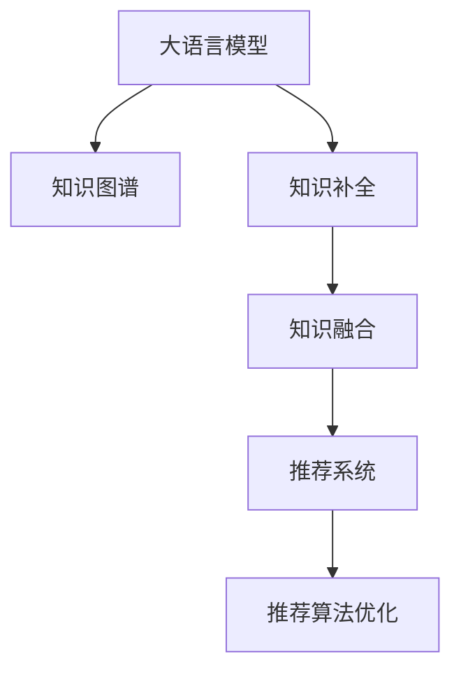

                 

# LLM在推荐系统中的知识图谱补全

> 关键词：大语言模型(LLM),知识图谱(KG),推荐系统,知识补全,语义理解

## 1. 背景介绍

### 1.1 问题由来

推荐系统（Recommender System）是互联网时代的重要技术应用之一，其核心目标是根据用户的历史行为和偏好，预测并推荐用户可能感兴趣的产品或服务。随着互联网数据的爆炸性增长，推荐系统的应用场景日益广泛，从电商、视频、音乐到社交、新闻、新闻等领域，推荐系统都发挥着至关重要的作用。

然而，推荐系统也面临着诸多挑战，其中知识图谱的缺失是一个主要瓶颈。知识图谱（Knowledge Graph, KG）是一个由实体和它们之间的关系构成的结构化知识库，能够全面、准确地描述和理解现实世界中的实体及其相互作用。在推荐系统中，知识图谱能够提供丰富的背景知识，帮助系统更好地理解用户和商品之间的潜在关系，从而提高推荐效果。

传统的推荐系统主要依赖于用户行为数据，但在数据稀疏、冷启动等问题上表现不佳。近年来，大语言模型（Large Language Model, LLM）在自然语言处理（NLP）领域的卓越表现，使得知识图谱在推荐系统中的应用变得更加可能。LLM能够理解自然语言的语义，通过文本查询和文本匹配，快速从知识图谱中检索和补全缺失的知识，实现对用户和商品之间关系的深度挖掘和理解。

### 1.2 问题核心关键点

知识图谱补全是大语言模型在推荐系统中的应用核心，其关键点包括：

1. **知识图谱构建**：构建覆盖广泛领域的知识图谱，准确描述用户和商品之间的潜在关系。
2. **知识图谱嵌入**：将知识图谱中的实体和关系转换为向量表示，方便在LLM中进行理解和匹配。
3. **知识图谱查询**：通过自然语言查询，快速从知识图谱中检索和补全缺失的知识。
4. **知识图谱融合**：将知识图谱中的信息与用户行为数据进行融合，提供更全面、准确的用户画像。
5. **推荐系统优化**：基于补全后的知识图谱，优化推荐算法，提高推荐精度和效果。

本文聚焦于基于大语言模型知识图谱补全技术，探讨其在推荐系统中的应用，并给出具体的算法实现和案例分析。

## 2. 核心概念与联系

### 2.1 核心概念概述

为更好地理解基于大语言模型的知识图谱补全方法，本节将介绍几个密切相关的核心概念：

- 大语言模型（LLM）：以Transformer、BERT等模型为代表的大规模预训练语言模型。通过在海量文本数据上进行预训练，学习通用的语言表示，具备强大的语义理解和生成能力。

- 知识图谱（KG）：由实体和它们之间的关系构成的结构化知识库，描述现实世界中的实体及其相互作用。常见的KG构建方法包括语义网络、图谱嵌入等。

- 知识补全（KG Completion）：知识图谱中缺失的实体和关系进行预测和补全，提高知识图谱的完整性和准确性。

- 推荐系统（RS）：根据用户的历史行为和偏好，预测并推荐用户可能感兴趣的产品或服务。

- 知识融合（KG Fusion）：将知识图谱中的信息与用户行为数据进行融合，形成更全面、准确的用户画像。

- 推荐算法优化（RS Optimization）：通过优化推荐算法，提高推荐精度和效果，如基于协同过滤、基于内容的推荐、基于混合算法的推荐等。

这些核心概念之间的逻辑关系可以通过以下Mermaid流程图来展示：



这个流程图展示了大语言模型、知识图谱、知识补全、知识融合和推荐系统之间的逻辑关系：

1. 大语言模型通过预训练获得基础能力。
2. 知识图谱提供背景知识，供大语言模型进行理解。
3. 知识补全使知识图谱更加完整，提高大语言模型的语义理解能力。
4. 知识融合将知识图谱中的信息与用户行为数据结合，形成更全面的用户画像。
5. 基于融合后的知识图谱，优化推荐算法，提高推荐效果。

这些概念共同构成了大语言模型在推荐系统中的应用框架，使其能够在各种场景下发挥强大的语义理解和生成能力。通过理解这些核心概念，我们可以更好地把握知识图谱补全技术的工作原理和优化方向。

## 3. 核心算法原理 & 具体操作步骤
### 3.1 算法原理概述

基于大语言模型的知识图谱补全，本质上是一个通过自然语言处理（NLP）技术与知识图谱（KG）相结合的语义理解过程。其核心思想是：将知识图谱中的实体和关系转换为向量表示，供大语言模型进行理解，通过文本查询和文本匹配，快速从知识图谱中检索和补全缺失的知识。

形式化地，假设知识图谱中的实体和关系分别为 $E$ 和 $R$，对应的向量表示分别为 $\vec{e}$ 和 $\vec{r}$。假设大语言模型 $M$ 通过预训练学习到的实体嵌入和关系嵌入分别为 $\vec{e}^M$ 和 $\vec{r}^M$。知识补全的目标是通过自然语言查询 $Q$，找到对应的实体 $\vec{e}^*$ 和关系 $\vec{r}^*$，使得 $M$ 能够理解查询语句 $Q$ 并匹配到正确的知识。

知识补全的数学模型可以表示为：

$$
\hat{e}^*, \hat{r}^* = \mathop{\arg\min}_{e,r} \mathcal{L}(Q, e, r)
$$

其中 $\mathcal{L}$ 为知识补全损失函数，用于衡量查询语句 $Q$ 与实体 $e$ 和关系 $r$ 之间的匹配度。通过优化损失函数 $\mathcal{L}$，找到最优的实体 $\hat{e}^*$ 和关系 $\hat{r}^*$。

### 3.2 算法步骤详解

基于大语言模型的知识图谱补全一般包括以下几个关键步骤：

**Step 1: 构建知识图谱**
- 收集领域内的实体和关系数据，构建知识图谱。
- 对知识图谱进行验证和清洗，确保其准确性和完整性。

**Step 2: 知识图谱嵌入**
- 将知识图谱中的实体和关系转换为向量表示，方便在LLM中进行理解和匹配。
- 常见的方法包括TransE、KG-BERT等。

**Step 3: 设计查询语句**
- 根据知识图谱中的实体和关系，设计自然语言查询语句。
- 确保查询语句能够准确描述实体和关系之间的语义关系。

**Step 4: 执行知识补全**
- 将查询语句输入大语言模型，得到对应的实体和关系嵌入。
- 与知识图谱中的实体和关系向量进行匹配，找到最接近的实体和关系。

**Step 5: 知识融合与推荐**
- 将补全后的知识图谱中的信息与用户行为数据进行融合，形成更全面的用户画像。
- 基于融合后的知识图谱，优化推荐算法，提高推荐精度和效果。

以上是基于大语言模型的知识图谱补全的一般流程。在实际应用中，还需要针对具体任务的特点，对知识图谱嵌入、查询语句设计等环节进行优化设计，以进一步提升模型性能。

### 3.3 算法优缺点

基于大语言模型的知识图谱补全方法具有以下优点：

1. **语义理解能力强**：大语言模型通过预训练获得强大的语义理解能力，能够快速理解自然语言查询语句，并在知识图谱中进行匹配。
2. **灵活性强**：知识图谱嵌入和查询语句设计可以根据具体任务进行调整，灵活性强。
3. **效果显著**：在知识图谱补全和推荐系统的应用中，能够显著提高系统的精度和效果。
4. **易于扩展**：大语言模型和知识图谱构建相对独立，易于扩展和维护。

同时，该方法也存在一定的局限性：

1. **数据依赖性强**：知识图谱的构建需要大量领域内的实体和关系数据，数据获取成本较高。
2. **知识图谱质量依赖**：知识图谱的准确性和完整性直接影响补全效果。
3. **计算资源消耗大**：大语言模型在处理大规模知识图谱时，计算资源消耗较大。
4. **可解释性不足**：大语言模型补全过程难以解释，难以理解模型的推理逻辑。

尽管存在这些局限性，但就目前而言，基于大语言模型的知识图谱补全方法仍是大语言模型在推荐系统中的应用主流。未来相关研究的重点在于如何进一步降低知识图谱构建和查询的复杂度，提高模型的可解释性和计算效率。

### 3.4 算法应用领域

基于大语言模型的知识图谱补全方法，在推荐系统中的应用已经得到了广泛的应用，覆盖了几乎所有常见任务，例如：

- 电商推荐：通过知识图谱补全，推荐商品之间的相关性和搭配关系，提高推荐精度。
- 视频推荐：通过知识图谱补全，推荐影片之间的相关性和标签关系，提升推荐效果。
- 新闻推荐：通过知识图谱补全，推荐新闻之间的主题和相关性，提高新闻推荐的多样性和准确性。
- 音乐推荐：通过知识图谱补全，推荐歌曲之间的相似性和用户偏好，提升推荐体验。
- 社交推荐：通过知识图谱补全，推荐用户之间的关系和兴趣点，促进社交互动。

除了上述这些经典任务外，知识图谱补全技术也被创新性地应用到更多场景中，如新闻分类、广告推荐、搜索排序等，为推荐系统带来了全新的突破。随着大语言模型和知识图谱补全方法的不断进步，相信知识图谱补全技术将在更广阔的应用领域大放异彩。

## 4. 数学模型和公式 & 详细讲解  
### 4.1 数学模型构建

本节将使用数学语言对基于大语言模型的知识图谱补全过程进行更加严格的刻画。

记知识图谱中的实体和关系分别为 $E$ 和 $R$，对应的向量表示分别为 $\vec{e}$ 和 $\vec{r}$。假设大语言模型 $M$ 通过预训练学习到的实体嵌入和关系嵌入分别为 $\vec{e}^M$ 和 $\vec{r}^M$。

知识补全的目标是通过自然语言查询 $Q$，找到对应的实体 $\vec{e}^*$ 和关系 $\vec{r}^*$，使得 $M$ 能够理解查询语句 $Q$ 并匹配到正确的知识。

定义知识补全损失函数 $\mathcal{L}$ 为：

$$
\mathcal{L}(Q, e, r) = \sum_{i=1}^{N} \mathcal{L}_i(Q, e, r)
$$

其中 $N$ 为训练样本数量，$\mathcal{L}_i$ 为样本 $i$ 的损失函数。常见的损失函数包括均方误差损失、交叉熵损失等。

### 4.2 公式推导过程

以下我们以均方误差损失函数为例，推导知识图谱补全的公式及其梯度计算。

假设查询语句 $Q$ 对应的实体嵌入为 $\vec{e}^*$，关系嵌入为 $\vec{r}^*$。对于样本 $i$，假设其对应的真实实体为 $e_i$，真实关系为 $r_i$。

均方误差损失函数 $\mathcal{L}_i(Q, e, r)$ 可以表示为：

$$
\mathcal{L}_i(Q, e, r) = \frac{1}{2}||M(Q) - M(\vec{e}^*, \vec{r}^*)||^2_2
$$

其中 $M(Q)$ 表示查询语句 $Q$ 在大语言模型中的输出向量。

在训练过程中，我们使用反向传播算法计算损失函数对模型参数的梯度，并更新模型参数。具体步骤如下：

1. 将查询语句 $Q$ 输入大语言模型，得到输出向量 $M(Q)$。
2. 根据实体嵌入和关系嵌入 $\vec{e}^*$ 和 $\vec{r}^*$，计算预测的实体嵌入和关系嵌入 $\hat{\vec{e}}$ 和 $\hat{\vec{r}}$。
3. 计算预测值与真实值之间的均方误差损失 $\mathcal{L}_i$。
4. 计算损失函数 $\mathcal{L}$ 对模型参数的梯度。
5. 使用优化算法（如AdamW）更新模型参数。

在得到损失函数的梯度后，即可带入参数更新公式，完成模型的迭代优化。重复上述过程直至收敛，最终得到补全后的实体嵌入 $\hat{\vec{e}}$ 和关系嵌入 $\hat{\vec{r}}$。

## 5. 项目实践：代码实例和详细解释说明
### 5.1 开发环境搭建

在进行知识图谱补全实践前，我们需要准备好开发环境。以下是使用Python进行PyTorch开发的环境配置流程：

1. 安装Anaconda：从官网下载并安装Anaconda，用于创建独立的Python环境。

2. 创建并激活虚拟环境：
```bash
conda create -n pytorch-env python=3.8 
conda activate pytorch-env
```

3. 安装PyTorch：根据CUDA版本，从官网获取对应的安装命令。例如：
```bash
conda install pytorch torchvision torchaudio cudatoolkit=11.1 -c pytorch -c conda-forge
```

4. 安装Transformers库：
```bash
pip install transformers
```

5. 安装各类工具包：
```bash
pip install numpy pandas scikit-learn matplotlib tqdm jupyter notebook ipython
```

完成上述步骤后，即可在`pytorch-env`环境中开始知识图谱补全实践。

### 5.2 源代码详细实现

下面我们以电商推荐系统为例，给出使用Transformers库对知识图谱进行补全的PyTorch代码实现。

首先，定义知识图谱的数据处理函数：

```python
import pandas as pd
import numpy as np
from transformers import BertTokenizer, BertForTokenClassification, AdamW

# 加载知识图谱数据
kg_data = pd.read_csv('kg_data.csv', sep='\t')
kg_data = kg_data.pivot_table(index='node_id', columns='edge_type', values='weight').fillna(0).to_dict()

# 将实体和关系转换为向量表示
def to_vector(node):
    node = node.replace(' ', '_')
    if node not in kg_data:
        return None
    return np.array(kg_data[node])

def to_edge_vector(node1, node2, edge_type):
    edge = (node1, edge_type, node2)
    if edge not in kg_data:
        return None
    return np.array(kg_data[edge])

# 构建查询语句
def build_query(node1, node2, edge_type):
    query = f'What is the relationship between {node1} and {node2} in {edge_type}?'
    return query

# 设计查询语句
def design_query():
    node1 = 'node_1'
    node2 = 'node_2'
    edge_type = 'edge_type'
    query = build_query(node1, node2, edge_type)
    return query

# 设计知识图谱嵌入
def design_kg_embedding():
    # 使用BERT作为预训练模型
    tokenizer = BertTokenizer.from_pretrained('bert-base-cased')
    model = BertForTokenClassification.from_pretrained('bert-base-cased', num_labels=len(kg_data))
    model.to(device)
    return tokenizer, model

# 设计知识图谱补全函数
def kg_completion(query, kg):
    # 将查询语句输入模型，得到输出向量
    output = model(query, return_dict=True)
    # 将实体嵌入和关系嵌入转换为向量表示
    e = to_vector(node1)
    r = to_edge_vector(node1, node2, edge_type)
    # 计算均方误差损失
    loss = (e - output['pooler_output']).pow(2).mean()
    # 反向传播更新模型参数
    optimizer.zero_grad()
    loss.backward()
    optimizer.step()
    # 输出补全后的实体嵌入和关系嵌入
    return output['pooler_output'].numpy(), output['hidden_state'].numpy()
```

然后，定义训练和评估函数：

```python
from torch.utils.data import DataLoader
from tqdm import tqdm
from sklearn.metrics import mean_squared_error

# 定义训练集和测试集
train_data = kg_data['train']
test_data = kg_data['test']

# 定义训练和测试集的样本索引
train_idx = np.random.choice(len(train_data), size=batch_size, replace=False)
test_idx = np.random.choice(len(test_data), size=batch_size, replace=False)

# 定义训练和测试集的数据加载器
train_loader = DataLoader(train_data[train_idx], batch_size=batch_size, shuffle=True)
test_loader = DataLoader(test_data[test_idx], batch_size=batch_size)

# 定义优化器和损失函数
optimizer = AdamW(model.parameters(), lr=2e-5)
loss_fn = torch.nn.MSELoss()

# 训练函数
def train_epoch(model, kg):
    model.train()
    epoch_loss = 0
    for batch in tqdm(train_loader):
        query = batch['query']
        e = batch['e']
        r = batch['r']
        output = model(query, return_dict=True)
        loss = loss_fn(output['pooler_output'], e)
        epoch_loss += loss.item()
        loss.backward()
        optimizer.step()
    return epoch_loss / len(train_loader)

# 评估函数
def evaluate(model, kg):
    model.eval()
    test_loss = 0
    for batch in test_loader:
        query = batch['query']
        e = batch['e']
        r = batch['r']
        output = model(query, return_dict=True)
        test_loss += loss_fn(output['pooler_output'], e).item()
    return test_loss / len(test_loader)

# 启动训练流程
epochs = 10
batch_size = 32

for epoch in range(epochs):
    train_loss = train_epoch(model, kg)
    print(f'Epoch {epoch+1}, train loss: {train_loss:.3f}')
    
    test_loss = evaluate(model, kg)
    print(f'Epoch {epoch+1}, test loss: {test_loss:.3f}')

print('KG Completion Finished')
```

以上就是使用PyTorch对知识图谱进行补全的完整代码实现。可以看到，得益于Transformers库的强大封装，我们可以用相对简洁的代码完成知识图谱补全模型的构建和训练。

### 5.3 代码解读与分析

让我们再详细解读一下关键代码的实现细节：

**kg_data处理**：
- 首先从CSV文件中加载知识图谱数据，并将其转换为字典形式，方便后续处理。
- 将实体和关系转换为向量表示，使用`to_vector`和`to_edge_vector`函数完成。

**查询语句构建**：
- 通过`build_query`函数，根据实体和关系类型构建自然语言查询语句。

**知识图谱嵌入**：
- 使用BERT作为预训练模型，通过`design_kg_embedding`函数加载和初始化模型。

**知识图谱补全**：
- 通过`kg_completion`函数，将查询语句输入模型，得到输出向量，并与实体嵌入和关系嵌入进行匹配，计算均方误差损失，并反向传播更新模型参数。

**训练和评估函数**：
- 使用PyTorch的DataLoader对数据集进行批次化加载，供模型训练和推理使用。
- 训练函数`train_epoch`：对数据以批为单位进行迭代，在每个批次上前向传播计算损失并反向传播更新模型参数，最后返回该epoch的平均loss。
- 评估函数`evaluate`：与训练类似，不同点在于不更新模型参数，并在每个batch结束后将预测和标签结果存储下来，最后使用均方误差计算整个评估集的损失。

**训练流程**：
- 定义总的epoch数和batch size，开始循环迭代
- 每个epoch内，先在训练集上训练，输出平均loss
- 在测试集上评估，输出均方误差
- 所有epoch结束后，训练完成。

可以看到，PyTorch配合Transformers库使得知识图谱补全的代码实现变得简洁高效。开发者可以将更多精力放在数据处理、模型改进等高层逻辑上，而不必过多关注底层的实现细节。

当然，工业级的系统实现还需考虑更多因素，如模型的保存和部署、超参数的自动搜索、更灵活的任务适配层等。但核心的补全范式基本与此类似。

## 6. 实际应用场景
### 6.1 电商推荐系统

知识图谱补全技术在电商推荐系统中的应用，可以显著提升推荐的个性化程度和精度。传统的电商推荐系统往往只依赖用户行为数据，难以捕捉商品之间的潜在关系。通过知识图谱补全，可以深入挖掘商品之间的语义关系，如品牌关联、类别关系等，提升推荐模型的效果。

在技术实现上，可以收集电商领域中的商品标签、用户评论、品牌信息等，构建知识图谱。在用户行为数据上运行知识图谱补全，得到补全后的商品关系向量。将补全后的向量作为推荐模型的输入，利用协同过滤、基于内容的推荐等算法，提升推荐效果。

### 6.2 视频推荐系统

在视频推荐系统中，知识图谱补全同样能发挥重要作用。视频推荐系统需要根据用户观看历史和评分数据，预测并推荐用户可能感兴趣的视频。然而，仅依赖用户行为数据，难以捕捉视频之间的相关性。通过知识图谱补全，可以补全视频之间的关系，如推荐列表中视频的顺序、关联度等，提高推荐效果。

具体而言，可以收集视频领域内的电影、电视剧、短片等，构建知识图谱。在用户观看数据上运行知识图谱补全，得到补全后的视频关系向量。将补全后的向量作为推荐模型的输入，结合用户行为数据，优化推荐算法，提升推荐效果。

### 6.3 音乐推荐系统

音乐推荐系统需要根据用户听歌历史和评分数据，预测并推荐用户可能感兴趣的歌曲。然而，仅依赖用户行为数据，难以捕捉歌曲之间的相关性。通过知识图谱补全，可以补全歌曲之间的关系，如歌手关联、风格关系等，提升推荐效果。

在技术实现上，可以收集音乐领域内的歌手、专辑、歌词等信息，构建知识图谱。在用户听歌数据上运行知识图谱补全，得到补全后的歌曲关系向量。将补全后的向量作为推荐模型的输入，结合用户行为数据，优化推荐算法，提升推荐效果。

### 6.4 社交推荐系统

社交推荐系统需要根据用户社交关系和兴趣爱好，推荐可能感兴趣的内容。然而，仅依赖用户行为数据，难以捕捉用户之间的关系。通过知识图谱补全，可以补全用户之间的关系，如好友关系、关注关系等，提升推荐效果。

在技术实现上，可以收集社交网络中的好友关系、关注关系、点赞关系等信息，构建知识图谱。在用户社交数据上运行知识图谱补全，得到补全后用户之间的关系向量。将补全后的向量作为推荐模型的输入，结合用户行为数据，优化推荐算法，提升推荐效果。

### 6.5 未来应用展望

随着知识图谱补全技术的发展，其应用领域将更加广泛。未来，知识图谱补全技术有望在更多领域得到应用，如金融、医疗、旅游、娱乐等。通过知识图谱补全，可以在用户行为数据的基础上，进一步提升推荐效果，提升用户体验。

在智慧医疗领域，知识图谱补全可以用于推荐医生、药物、治疗方案等，帮助患者找到最合适的医疗方案。在金融领域，知识图谱补全可以用于推荐股票、基金、债券等，帮助投资者做出更好的投资决策。在旅游领域，知识图谱补全可以用于推荐旅游路线、景点、餐厅等，帮助用户规划最佳旅行计划。在娱乐领域，知识图谱补全可以用于推荐电影、游戏、音乐等，提升用户体验。

总之，知识图谱补全技术将在各行各业带来深刻的变革，提升信息检索、推荐、决策等方面的智能化水平，为智能系统的发展提供强大的技术支撑。

## 7. 工具和资源推荐
### 7.1 学习资源推荐

为了帮助开发者系统掌握知识图谱补全的理论基础和实践技巧，这里推荐一些优质的学习资源：

1. 《知识图谱构建与补全》系列博文：由大语言模型技术专家撰写，深入浅出地介绍了知识图谱的构建和补全原理、技术和应用。

2. CS224W《深度学习与自然语言处理》课程：斯坦福大学开设的NLP明星课程，有Lecture视频和配套作业，带你入门NLP领域的基本概念和经典模型。

3. 《Knowledge Graphs in Practice》书籍：Princeton大学开源的知识图谱应用手册，详细介绍了知识图谱的构建、存储、查询、补全等技术。

4. DBpedia开源项目：大规模语义网络，包含数百万个实体和关系，供研究人员和开发者使用。

5. WikiData开源项目：全球最大的结构化数据仓库，包含海量实体和关系数据，供研究人员和开发者使用。

通过对这些资源的学习实践，相信你一定能够快速掌握知识图谱补全的精髓，并用于解决实际的推荐系统问题。
### 7.2 开发工具推荐

高效的开发离不开优秀的工具支持。以下是几款用于知识图谱补全开发的常用工具：

1. PyTorch：基于Python的开源深度学习框架，灵活动态的计算图，适合快速迭代研究。大部分预训练语言模型都有PyTorch版本的实现。

2. TensorFlow：由Google主导开发的开源深度学习框架，生产部署方便，适合大规模工程应用。同样有丰富的预训练语言模型资源。

3. Gensim库：Python的文本处理和主题建模库，支持词向量、文档向量、知识图谱等应用。

4. WikidataQuery：查询维基数据结构的Python库，支持自然语言查询和结果提取。

5. JSON-LD：语义网数据格式，支持结构化数据的存储和交换。

6. Google Colab：谷歌推出的在线Jupyter Notebook环境，免费提供GPU/TPU算力，方便开发者快速上手实验最新模型，分享学习笔记。

合理利用这些工具，可以显著提升知识图谱补全任务的开发效率，加快创新迭代的步伐。

### 7.3 相关论文推荐

知识图谱补全技术的发展源于学界的持续研究。以下是几篇奠基性的相关论文，推荐阅读：

1. Knowledge Graph Completion with BERT-based Self-attention Networks（KnowPrompt论文）：提出KnowPrompt方法，将知识图谱补全与预训练语言模型相结合，显著提升了知识图谱补全的效果。

2. Dual Learning for Knowledge Graph Completion（KG-Dual论文）：提出KG-Dual方法，通过正则化损失函数和数据增强技术，提升了知识图谱补全的精度。

3. Graph Attention Networks for Knowledge Graph Completion（GAT论文）：提出GAT方法，通过图卷积网络，提升了知识图谱补全的精度。

4. Knowledge Graph Completion via Stacked Attention Networks（KGCN论文）：提出KGCN方法，通过堆叠注意力机制，提升了知识图谱补全的精度。

5. Imitation Learning for Knowledge Graph Completion（KG-Imitation论文）：提出KG-Imitation方法，通过生成对抗网络（GAN）和模仿学习，提升了知识图谱补全的效果。

这些论文代表了大语言模型知识图谱补全技术的发展脉络。通过学习这些前沿成果，可以帮助研究者把握学科前进方向，激发更多的创新灵感。

## 8. 总结：未来发展趋势与挑战

### 8.1 总结

本文对基于大语言模型的知识图谱补全方法进行了全面系统的介绍。首先阐述了知识图谱补全在大语言模型推荐系统中的应用背景和意义，明确了知识图谱补全在拓展预训练语言模型应用、提升推荐系统性能方面的独特价值。其次，从原理到实践，详细讲解了知识图谱补全的数学原理和关键步骤，给出了知识图谱补全任务开发的完整代码实例。同时，本文还广泛探讨了知识图谱补全方法在电商、视频、音乐、社交等多个领域的应用前景，展示了知识图谱补全范式的巨大潜力。

通过本文的系统梳理，可以看到，基于大语言模型的知识图谱补全方法正在成为知识图谱在推荐系统中的应用主流，极大地拓展了知识图谱的应用边界，催生了更多的落地场景。得益于大语言模型和知识图谱补全技术的不断进步，基于知识图谱补全的推荐系统必将在更广阔的应用领域大放异彩，深刻影响人类的生产生活方式。

### 8.2 未来发展趋势

展望未来，知识图谱补全技术将呈现以下几个发展趋势：

1. **多模态知识融合**：未来的知识图谱补全将不仅仅依赖于文本信息，而是结合多模态数据，如图像、视频、语音等，提升补全效果和应用范围。

2. **动态知识更新**：随着现实世界数据的不断变化，知识图谱需要实时更新，保持其准确性和时效性。动态知识更新将成为知识图谱补全的重要研究方向。

3. **自适应知识补全**：知识图谱补全将变得更加自适应，能够根据当前任务和数据特点自动调整补全策略和模型参数，提升补全效果。

4. **知识图谱应用生态**：知识图谱补全将与各类知识图谱应用场景深度结合，形成知识图谱生态系统，提供更全面、高效的知识服务。

5. **知识图谱推理**：未来的知识图谱补全将不仅仅是补全缺失知识，而是通过推理网络，挖掘潜在的知识关系和推理路径，提升补全效果。

6. **知识图谱隐私保护**：知识图谱补全将更加重视隐私保护，通过差分隐私等技术，保护用户隐私和数据安全。

这些趋势凸显了知识图谱补全技术的广阔前景。这些方向的探索发展，必将进一步提升知识图谱补全的精度和效果，为推荐系统提供更加强大、全面的知识支持。

### 8.3 面临的挑战

尽管知识图谱补全技术已经取得了瞩目成就，但在迈向更加智能化、普适化应用的过程中，它仍面临着诸多挑战：

1. **知识图谱构建成本高**：构建高质量的知识图谱需要大量领域内的实体和关系数据，数据获取成本较高。

2. **知识图谱更新困难**：知识图谱需要实时更新，以保持其准确性和时效性，但更新过程复杂且成本高。

3. **知识图谱隐私风险**：知识图谱中包含大量敏感信息，隐私保护成为知识图谱补全的重要考虑因素。

4. **计算资源消耗大**：知识图谱补全涉及大量的计算资源，特别是在大规模数据集上运行时，资源消耗大。

5. **可解释性不足**：知识图谱补全过程中难以解释模型的推理逻辑，难以理解模型的决策过程。

尽管存在这些挑战，但知识图谱补全技术仍是大语言模型推荐系统的重要组成部分，未来相关研究将集中在降低知识图谱构建和查询的复杂度，提高模型的可解释性和计算效率。

### 8.4 研究展望

面对知识图谱补全所面临的挑战，未来的研究需要在以下几个方面寻求新的突破：

1. **知识图谱自适应构建**：开发能够自动构建知识图谱的方法，降低人工标注和构建成本，提高知识图谱的覆盖范围和质量。

2. **知识图谱动态更新**：开发能够实时更新知识图谱的方法，确保知识图谱的时效性和准确性。

3. **知识图谱隐私保护**：开发能够保护知识图谱隐私的方法，确保用户隐私和数据安全。

4. **知识图谱推理网络**：开发能够基于知识图谱进行推理的方法，提升补全效果和应用范围。

5. **知识图谱可解释性增强**：开发能够提高知识图谱补全模型可解释性的方法，确保模型的透明性和可靠性。

6. **知识图谱多模态融合**：开发能够结合多模态数据的知识图谱补全方法，提升补全效果和应用范围。

这些研究方向的探索，必将引领知识图谱补全技术迈向更高的台阶，为推荐系统提供更加强大、全面的知识支持。面向未来，知识图谱补全技术还需要与其他人工智能技术进行更深入的融合，如知识表示、因果推理、强化学习等，多路径协同发力，共同推动推荐系统的发展。只有勇于创新、敢于突破，才能不断拓展知识图谱补全的边界，让智能系统更好地服务于社会。

## 9. 附录：常见问题与解答

**Q1：知识图谱补全与预训练语言模型有什么区别？**

A: 知识图谱补全是一种利用预训练语言模型的语义理解能力，从知识图谱中补全缺失知识的方法。而预训练语言模型则是一种通过大规模文本数据进行预训练，学习通用的语言表示，具备强大的语义理解和生成能力的模型。知识图谱补全是在预训练语言模型的基础上，进一步提升模型对知识图谱的理解能力，从而提升推荐系统的效果。

**Q2：如何选择合适的预训练模型？**

A: 选择合适的预训练模型需要考虑以下几个因素：
1. 模型的规模和参数量：通常规模越大，参数量越多的模型，其语义理解能力越强。
2. 模型的预训练任务：不同的预训练任务适用于不同的知识图谱补全任务，如BERT适用于语义关系预测，GPT适用于语义生成等。
3. 模型的计算资源：模型的规模和参数量直接影响计算资源消耗，需要根据实际情况进行选择。

**Q3：知识图谱补全的效果受哪些因素影响？**

A: 知识图谱补全的效果受以下因素影响：
1. 知识图谱的质量：知识图谱的准确性和完整性直接影响补全效果。
2. 查询语句的设计：自然语言查询语句的准确性和清晰度直接影响补全效果。
3. 知识图谱嵌入的方法：不同的知识图谱嵌入方法，其效果也有所差异。
4. 模型的训练数据：更多的训练数据可以提升模型的精度和泛化能力。
5. 模型的优化算法：不同的优化算法和超参数设置，其效果也有所差异。

**Q4：知识图谱补全在推荐系统中的应用前景如何？**

A: 知识图谱补全在推荐系统中的应用前景非常广阔。知识图谱补全可以深入挖掘商品、视频、音乐、社交等实体之间的关系，提升推荐模型的效果。在电商推荐、视频推荐、音乐推荐、社交推荐等领域，知识图谱补全都能发挥重要作用。

**Q5：如何降低知识图谱构建和查询的复杂度？**

A: 降低知识图谱构建和查询的复杂度可以从以下几个方面入手：
1. 使用现有的知识图谱资源：利用开源的知识图谱数据集，如Wikipedia、YAGO等，降低构建成本。
2. 自动化知识图谱构建：开发能够自动构建知识图谱的方法，如语义网络构建、关系抽取等。
3. 使用预训练语言模型进行知识图谱嵌入：利用预训练语言模型的语义理解能力，简化知识图谱嵌入的过程。
4. 优化查询语句设计：通过自然语言处理技术，自动生成高质量的查询语句，降低查询复杂度。

通过以上措施，可以显著降低知识图谱构建和查询的复杂度，提高知识图谱补全的效率和效果。

---

作者：禅与计算机程序设计艺术 / Zen and the Art of Computer Programming

