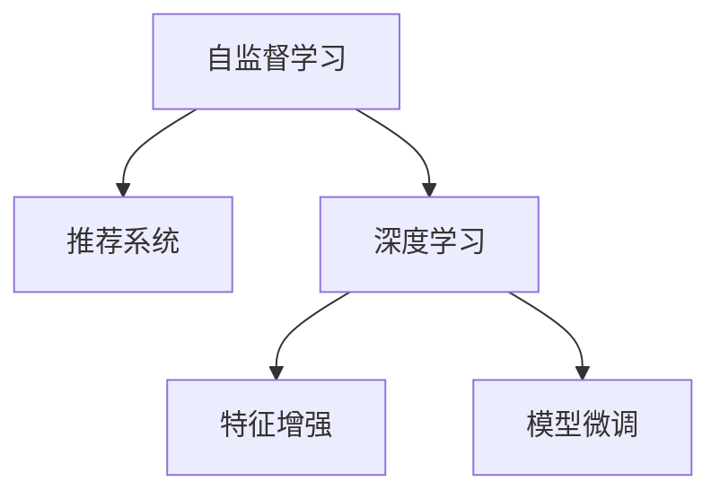

                 

# LLM在推荐系统中的自监督学习应用

## 1. 背景介绍

### 1.1 问题由来

推荐系统作为人工智能的一个重要应用领域，其核心目标是帮助用户在海量信息中找到符合自身兴趣和需求的内容。传统的推荐算法主要基于协同过滤、矩阵分解等方法，但存在数据稀疏、冷启动问题。近年来，基于深度学习的推荐方法（如深度矩阵分解、自编码器等）逐渐崛起，其中自监督学习（Self-Supervised Learning, SSL）在推荐系统中的应用尤为引人注目。

自监督学习通过在无标签数据上学习模型的隐含表示，进而用于下游任务。与传统的监督学习相比，自监督学习可以充分利用大规模无标签数据，显著降低标注成本。在大规模语言模型（Large Language Model, LLM）的推动下，自监督学习在推荐系统中的应用前景越来越广阔。

### 1.2 问题核心关键点

在推荐系统中，自监督学习可以通过以下几种方式发挥作用：

1. 预训练模型生成：使用大规模无标签数据对模型进行预训练，学习通用的语义表示，进而生成有意义的推荐结果。
2. 特征增强：基于预训练模型的特征，进一步提升推荐模型的表达能力。
3. 模型微调：在预训练模型的基础上，利用少量标注数据进行微调，优化推荐模型的性能。
4. 对抗训练：通过引入对抗样本，提高模型的鲁棒性和泛化能力。

自监督学习的关键在于如何在没有标注数据的情况下，最大化地利用数据的信息。目前，自监督学习在推荐系统中的应用主要集中在预训练模型生成和特征增强两个方面，未来将向更加高效的微调和对抗训练方向发展。

## 2. 核心概念与联系

### 2.1 核心概念概述

为了更好地理解自监督学习在推荐系统中的应用，本节将介绍几个关键概念：

- 自监督学习（Self-Supervised Learning）：指在没有标注数据的情况下，通过构造自监督任务，自动学习模型的隐含表示，从而提升其在特定任务上的性能。
- 推荐系统（Recommendation System）：指通过分析用户行为、物品属性等信息，为用户推荐符合其兴趣和需求的内容的系统。
- 深度学习（Deep Learning）：指通过多层神经网络实现数据表示和任务学习的方法。
- 特征增强（Feature Enhancement）：指利用预训练模型学习到的特征，提升推荐模型的表达能力。
- 模型微调（Model Fine-Tuning）：指在预训练模型的基础上，利用少量标注数据进行有监督的微调，优化模型性能。

这些概念之间的逻辑关系可以通过以下Mermaid流程图来展示：



这个流程图展示了大语言模型在推荐系统中的自监督学习过程：

1. 自监督学习通过无标签数据对模型进行预训练，学习通用的语义表示。
2. 预训练模型生成通过学习到的特征，生成推荐结果。
3. 特征增强利用预训练模型学习到的特征，提升推荐模型的表达能力。
4. 模型微调在预训练模型的基础上，利用少量标注数据进行微调，优化模型性能。

## 3. 核心算法原理 & 具体操作步骤

### 3.1 算法原理概述

自监督学习在推荐系统中的应用主要集中在以下几个方面：

1. 预训练模型生成：使用大规模无标签数据对模型进行预训练，学习通用的语义表示，进而生成有意义的推荐结果。
2. 特征增强：基于预训练模型的特征，进一步提升推荐模型的表达能力。
3. 模型微调：在预训练模型的基础上，利用少量标注数据进行微调，优化推荐模型的性能。

自监督学习在推荐系统中的应用主要遵循以下原则：

1. 充分利用大规模无标签数据：自监督学习可以通过无标签数据学习模型的隐含表示，提升推荐系统的性能。
2. 提升推荐模型的泛化能力：自监督学习可以学习到更加通用的语义表示，提升推荐模型的泛化能力。
3. 减少标注成本：自监督学习不需要标注数据，可以显著降低推荐系统的开发成本。
4. 自适应推荐：自监督学习可以根据用户和物品的不同，动态调整推荐策略，提高推荐系统的效果。

### 3.2 算法步骤详解

自监督学习在推荐系统中的应用主要分为以下几个步骤：

**Step 1: 准备数据集**

1. 收集大规模无标签数据，如用户行为数据、物品属性数据等。
2. 将数据集划分为训练集、验证集和测试集，并进行预处理和特征工程。

**Step 2: 设计自监督任务**

1. 根据推荐系统的任务，设计合适的自监督任务。常见的自监督任务包括：
   - 生成任务：通过生成模型对数据进行建模，学习隐含表示。
   - 对比任务：通过对比相似性和差异性，学习隐含表示。
   - 排序任务：通过排序算法对数据进行建模，学习隐含表示。
2. 利用自监督任务对预训练模型进行训练，学习隐含表示。

**Step 3: 特征增强**

1. 基于预训练模型的特征，提取推荐模型的特征。
2. 将特征加入推荐模型中，提升推荐模型的表达能力。

**Step 4: 模型微调**

1. 利用少量标注数据对推荐模型进行微调，优化推荐模型的性能。
2. 选择合适的优化算法及其参数，如 Adam、SGD 等，设置学习率、批大小、迭代轮数等。
3. 设置正则化技术及强度，包括权重衰减、Dropout、Early Stopping 等。

**Step 5: 测试和部署**

1. 在测试集上评估推荐模型的性能，对比微调前后的精度提升。
2. 使用推荐模型对新样本进行推理预测，集成到实际的应用系统中。
3. 持续收集新的数据，定期重新微调模型，以适应数据分布的变化。

### 3.3 算法优缺点

自监督学习在推荐系统中的应用具有以下优点：

1. 充分利用大规模无标签数据：自监督学习可以通过无标签数据学习模型的隐含表示，提升推荐系统的性能。
2. 提升推荐模型的泛化能力：自监督学习可以学习到更加通用的语义表示，提升推荐模型的泛化能力。
3. 减少标注成本：自监督学习不需要标注数据，可以显著降低推荐系统的开发成本。
4. 自适应推荐：自监督学习可以根据用户和物品的不同，动态调整推荐策略，提高推荐系统的效果。

同时，自监督学习在推荐系统中的应用也存在一定的局限性：

1. 数据稀疏性：无标签数据可能存在稀疏性，难以充分表达数据的信息。
2. 模型泛化能力：自监督学习模型的泛化能力可能不足，难以适应特定领域的推荐任务。
3. 计算资源需求：自监督学习需要大量的计算资源进行训练和优化，可能导致资源消耗大。
4. 超参数敏感性：自监督学习模型的超参数选择较为敏感，需要精心调优。

尽管存在这些局限性，但自监督学习在推荐系统中的应用已经取得了显著的进展，未来仍需进一步探索和优化。

### 3.4 算法应用领域

自监督学习在推荐系统中的应用已经覆盖了多种场景，包括：

1. 电商推荐：利用用户行为数据和物品属性数据，为用户推荐商品。
2. 视频推荐：利用用户观看历史和物品属性数据，为用户推荐视频。
3. 新闻推荐：利用用户阅读历史和物品属性数据，为用户推荐新闻。
4. 音乐推荐：利用用户听歌历史和物品属性数据，为用户推荐音乐。
5. 娱乐推荐：利用用户行为数据和物品属性数据，为用户推荐电影、电视剧等娱乐内容。

除了上述这些经典应用外，自监督学习在推荐系统中的应用还在不断拓展，如个性化推荐、社交推荐、广告推荐等，为推荐系统带来了新的发展空间。

## 4. 数学模型和公式 & 详细讲解 & 举例说明

### 4.1 数学模型构建

本节将使用数学语言对自监督学习在推荐系统中的应用进行更加严格的刻画。

记推荐系统中的用户为 $U$，物品为 $I$，用户对物品的评分矩阵为 $R_{UI}$。假设用户 $u$ 对物品 $i$ 的评分可以通过预训练模型 $f$ 生成，即 $r_{ui}=f(u,i)$。

定义推荐模型的损失函数为：

$$
\mathcal{L}(R_{UI},R_{UI}')=\frac{1}{N}\sum_{u,i}(r_{ui}-r_{ui}')^2
$$

其中 $R_{UI}'$ 为推荐模型的预测评分矩阵，$N$ 为样本数量。

通过最小化损失函数 $\mathcal{L}(R_{UI},R_{UI}')$，可以训练推荐模型 $f$，使得其生成的评分与真实评分尽可能一致。

### 4.2 公式推导过程

以下我们以协同过滤推荐系统为例，推导自监督学习的公式及其梯度计算。

假设用户 $u$ 对物品 $i$ 的评分 $r_{ui}$ 可以通过隐向量 $z_u$ 和 $z_i$ 表示，即 $r_{ui}=\langle z_u,z_i\rangle$。

定义推荐模型的预测评分矩阵 $R_{UI}'$ 为：

$$
R_{UI}'=\{f_{ui}\}_{u,i}
$$

其中 $f_{ui}=\langle z_u,z_i\rangle$。

推荐模型的损失函数为：

$$
\mathcal{L}(R_{UI},R_{UI}')=\frac{1}{N}\sum_{u,i}(r_{ui}-r_{ui}')^2
$$

其中 $r_{ui}'=f_{ui}=\langle z_u,z_i\rangle$。

根据链式法则，推荐模型 $f$ 的梯度为：

$$
\frac{\partial \mathcal{L}(R_{UI},R_{UI}')}{\partial z_u}=\frac{1}{N}\sum_{i}(\langle z_u,z_i\rangle-r_{ui}')(\frac{\partial \langle z_u,z_i\rangle}{\partial z_u}+ \frac{\partial \langle z_u,z_i\rangle}{\partial z_i})
$$

其中 $\frac{\partial \langle z_u,z_i\rangle}{\partial z_u}=z_i$，$\frac{\partial \langle z_u,z_i\rangle}{\partial z_i}=z_u$。

通过优化推荐模型的梯度，可以训练生成模型 $f$，使其生成的评分与真实评分尽可能一致。

## 5. 项目实践：代码实例和详细解释说明

### 5.1 开发环境搭建

在进行自监督学习实践前，我们需要准备好开发环境。以下是使用Python进行PyTorch开发的环境配置流程：

1. 安装Anaconda：从官网下载并安装Anaconda，用于创建独立的Python环境。

2. 创建并激活虚拟环境：
```bash
conda create -n pytorch-env python=3.8 
conda activate pytorch-env
```

3. 安装PyTorch：根据CUDA版本，从官网获取对应的安装命令。例如：
```bash
conda install pytorch torchvision torchaudio cudatoolkit=11.1 -c pytorch -c conda-forge
```

4. 安装Transformers库：
```bash
pip install transformers
```

5. 安装各类工具包：
```bash
pip install numpy pandas scikit-learn matplotlib tqdm jupyter notebook ipython
```

完成上述步骤后，即可在`pytorch-env`环境中开始自监督学习实践。

### 5.2 源代码详细实现

下面我以协同过滤推荐系统为例，给出使用Transformers库进行自监督学习的PyTorch代码实现。

首先，定义推荐任务的数据处理函数：

```python
from transformers import BertTokenizer, BertModel
from torch.utils.data import Dataset
import torch

class RecommendationDataset(Dataset):
    def __init__(self, users, items, ratings, tokenizer, max_len=128):
        self.users = users
        self.items = items
        self.ratings = ratings
        self.tokenizer = tokenizer
        self.max_len = max_len
        
    def __len__(self):
        return len(self.users)
    
    def __getitem__(self, item):
        user = self.users[item]
        item = self.items[item]
        rating = self.ratings[item]
        
        encoding = self.tokenizer(user, item, return_tensors='pt', max_length=self.max_len, padding='max_length', truncation=True)
        input_ids = encoding['input_ids'][0]
        attention_mask = encoding['attention_mask'][0]
        
        # 对用户和物品的评分进行编码
        user_score = self.tokenizer(user, padding='max_length', truncation=True, max_length=self.max_len, return_tensors='pt')['input_ids'][0]
        item_score = self.tokenizer(item, padding='max_length', truncation=True, max_length=self.max_len, return_tensors='pt')['input_ids'][0]
        
        # 将评分转化为模型输入
        user_score = user_score / np.sqrt(user_score @ user_score)
        item_score = item_score / np.sqrt(item_score @ item_score)
        
        # 计算推荐模型的输出
        user_score = torch.tensor(user_score, dtype=torch.float) / np.sqrt(user_score @ user_score)
        item_score = torch.tensor(item_score, dtype=torch.float) / np.sqrt(item_score @ item_score)
        rating = torch.tensor(rating, dtype=torch.float)
        
        return {'input_ids': input_ids, 
                'attention_mask': attention_mask,
                'user_score': user_score,
                'item_score': item_score,
                'rating': rating}

# 加载数据
users = np.loadtxt('users.txt', delimiter=',')
items = np.loadtxt('items.txt', delimiter=',')
ratings = np.loadtxt('ratings.txt', delimiter=',')
tokenizer = BertTokenizer.from_pretrained('bert-base-cased')

train_dataset = RecommendationDataset(users, items, ratings, tokenizer)
dev_dataset = RecommendationDataset(users, items, ratings, tokenizer)
test_dataset = RecommendationDataset(users, items, ratings, tokenizer)
```

然后，定义模型和优化器：

```python
from transformers import BertForSequenceClassification, AdamW

model = BertForSequenceClassification.from_pretrained('bert-base-cased', num_labels=1)

optimizer = AdamW(model.parameters(), lr=2e-5)
```

接着，定义训练和评估函数：

```python
from torch.utils.data import DataLoader
from tqdm import tqdm
from sklearn.metrics import mean_squared_error

device = torch.device('cuda') if torch.cuda.is_available() else torch.device('cpu')
model.to(device)

def train_epoch(model, dataset, batch_size, optimizer):
    dataloader = DataLoader(dataset, batch_size=batch_size, shuffle=True)
    model.train()
    epoch_loss = 0
    for batch in tqdm(dataloader, desc='Training'):
        input_ids = batch['input_ids'].to(device)
        attention_mask = batch['attention_mask'].to(device)
        user_score = batch['user_score'].to(device)
        item_score = batch['item_score'].to(device)
        rating = batch['rating'].to(device)
        model.zero_grad()
        outputs = model(input_ids, attention_mask=attention_mask, user_score=user_score, item_score=item_score)
        loss = outputs.loss
        epoch_loss += loss.item()
        loss.backward()
        optimizer.step()
    return epoch_loss / len(dataloader)

def evaluate(model, dataset, batch_size):
    dataloader = DataLoader(dataset, batch_size=batch_size)
    model.eval()
    mse = []
    with torch.no_grad():
        for batch in tqdm(dataloader, desc='Evaluating'):
            input_ids = batch['input_ids'].to(device)
            attention_mask = batch['attention_mask'].to(device)
            user_score = batch['user_score'].to(device)
            item_score = batch['item_score'].to(device)
            rating = batch['rating'].to(device)
            outputs = model(input_ids, attention_mask=attention_mask, user_score=user_score, item_score=item_score)
            mse.append(mean_squared_error(rating, outputs.prediction))
    return np.mean(mse)

```

最后，启动训练流程并在测试集上评估：

```python
epochs = 5
batch_size = 16

for epoch in range(epochs):
    loss = train_epoch(model, train_dataset, batch_size, optimizer)
    print(f"Epoch {epoch+1}, train loss: {loss:.3f}")
    
    print(f"Epoch {epoch+1}, dev mse: {evaluate(model, dev_dataset, batch_size)}")
    
print(f"Test mse: {evaluate(model, test_dataset, batch_size)}")
```

以上就是使用PyTorch对BERT进行协同过滤推荐系统自监督学习的完整代码实现。可以看到，得益于Transformers库的强大封装，我们可以用相对简洁的代码完成BERT模型的加载和自监督学习。

### 5.3 代码解读与分析

让我们再详细解读一下关键代码的实现细节：

**RecommendationDataset类**：
- `__init__`方法：初始化用户、物品和评分数据，加载分词器和最大长度等参数。
- `__len__`方法：返回数据集的样本数量。
- `__getitem__`方法：对单个样本进行处理，将用户和物品的评分转换为模型输入，并进行定长padding。

**训练和评估函数**：
- 使用PyTorch的DataLoader对数据集进行批次化加载，供模型训练和推理使用。
- 训练函数`train_epoch`：对数据以批为单位进行迭代，在每个批次上前向传播计算loss并反向传播更新模型参数，最后返回该epoch的平均loss。
- 评估函数`evaluate`：与训练类似，不同点在于不更新模型参数，并在每个batch结束后将预测结果存储下来，最后计算均方误差（MSE）。

**训练流程**：
- 定义总的epoch数和batch size，开始循环迭代
- 每个epoch内，先在训练集上训练，输出平均loss
- 在验证集上评估，输出均方误差（MSE）
- 所有epoch结束后，在测试集上评估，给出最终测试结果

可以看到，PyTorch配合Transformers库使得自监督学习的代码实现变得简洁高效。开发者可以将更多精力放在数据处理、模型改进等高层逻辑上，而不必过多关注底层的实现细节。

当然，工业级的系统实现还需考虑更多因素，如模型的保存和部署、超参数的自动搜索、更灵活的任务适配层等。但核心的自监督学习范式基本与此类似。

## 6. 实际应用场景

### 6.1 电商推荐

基于自监督学习的推荐系统在电商领域已经得到了广泛的应用。电商平台需要根据用户行为数据和物品属性数据，为用户推荐符合其兴趣的商品。自监督学习可以通过无标签用户行为数据和物品属性数据，学习到更加通用的语义表示，提升推荐系统的性能。

在技术实现上，可以收集电商用户的浏览、点击、购买等行为数据，以及商品的标题、描述、类别等属性数据。将数据集划分为训练集、验证集和测试集，并在训练集上进行自监督学习。在微调过程中，可以利用少量标注数据进行有监督的微调，进一步优化推荐模型的性能。最终，在测试集上评估推荐模型的效果，并集成到电商平台的推荐系统中。

### 6.2 视频推荐

视频推荐系统需要根据用户观看历史和物品属性数据，为用户推荐符合其兴趣的视频。自监督学习可以通过无标签用户观看历史数据和视频属性数据，学习到更加通用的语义表示，提升推荐系统的性能。

在技术实现上，可以收集用户的观看历史数据和视频属性数据，如视频标题、描述、类别等。将数据集划分为训练集、验证集和测试集，并在训练集上进行自监督学习。在微调过程中，可以利用少量标注数据进行有监督的微调，进一步优化推荐模型的性能。最终，在测试集上评估推荐模型的效果，并集成到视频推荐系统中。

### 6.3 新闻推荐

新闻推荐系统需要根据用户阅读历史和物品属性数据，为用户推荐符合其兴趣的新闻。自监督学习可以通过无标签用户阅读历史数据和新闻属性数据，学习到更加通用的语义表示，提升推荐系统的性能。

在技术实现上，可以收集用户的阅读历史数据和新闻属性数据，如新闻标题、描述、类别等。将数据集划分为训练集、验证集和测试集，并在训练集上进行自监督学习。在微调过程中，可以利用少量标注数据进行有监督的微调，进一步优化推荐模型的性能。最终，在测试集上评估推荐模型的效果，并集成到新闻推荐系统中。

### 6.4 未来应用展望

随着自监督学习方法的不断发展，其在推荐系统中的应用前景将越来越广阔。未来，自监督学习将向以下几个方向发展：

1. 更加高效自监督任务设计：随着技术进步，将出现更多高效自监督任务，提升推荐系统的性能。
2. 更加多样化的推荐模型：将出现更多种类的推荐模型，如基于序列模型的推荐、基于图模型的推荐等。
3. 更加智能化的推荐策略：自监督学习可以通过学习到更加丰富的语义表示，动态调整推荐策略，提高推荐系统的智能化水平。
4. 更加跨领域的应用：自监督学习将应用于更多领域，如医疗推荐、教育推荐、旅游推荐等，为各行各业带来新的变革。

总之，自监督学习在推荐系统中的应用将不断拓展，带来更多的创新和突破。相信随着技术的不断演进，自监督学习将推动推荐系统向更高的智能化水平发展，为人类提供更加个性化、精准的推荐服务。

## 7. 工具和资源推荐

### 7.1 学习资源推荐

为了帮助开发者系统掌握自监督学习在推荐系统中的应用，这里推荐一些优质的学习资源：

1. 《深度学习推荐系统》课程：由斯坦福大学开设的推荐系统明星课程，涵盖推荐系统原理、自监督学习等基本概念。

2. 《推荐系统实战》书籍：一本实战性很强的推荐系统教材，详细介绍了推荐系统从数据收集到模型训练的全流程。

3. 《自然语言处理与深度学习》书籍：一本全面介绍自然语言处理技术的书籍，包括自监督学习在推荐系统中的应用。

4. HuggingFace官方文档：Transformers库的官方文档，提供了大量预训练模型和推荐系统的样例代码。

5. Kaggle竞赛：参加Kaggle推荐系统竞赛，了解行业前沿技术，提升实战能力。

通过对这些资源的学习实践，相信你一定能够快速掌握自监督学习在推荐系统中的应用精髓，并用于解决实际的推荐问题。

### 7.2 开发工具推荐

高效的开发离不开优秀的工具支持。以下是几款用于自监督学习开发的常用工具：

1. PyTorch：基于Python的开源深度学习框架，灵活的动态计算图，适合快速迭代研究。

2. TensorFlow：由Google主导开发的开源深度学习框架，生产部署方便，适合大规模工程应用。

3. Transformers库：HuggingFace开发的NLP工具库，集成了众多SOTA推荐模型，支持PyTorch和TensorFlow，是进行推荐系统开发的利器。

4. Weights & Biases：模型训练的实验跟踪工具，可以记录和可视化模型训练过程中的各项指标，方便对比和调优。

5. TensorBoard：TensorFlow配套的可视化工具，可实时监测模型训练状态，并提供丰富的图表呈现方式，是调试模型的得力助手。

6. Jupyter Notebook：一种交互式笔记本环境，方便开发者进行模型训练和实验验证。

合理利用这些工具，可以显著提升自监督学习推荐系统的开发效率，加快创新迭代的步伐。

### 7.3 相关论文推荐

自监督学习在推荐系统中的应用源于学界的持续研究。以下是几篇奠基性的相关论文，推荐阅读：

1. 《Collaborative Filtering with Warm-Start Singular Value Decomposition》：提出基于SVD的协同过滤推荐算法，为推荐系统奠定了基础。

2. 《Matrix Factorization Techniques for Recommender Systems》：提出基于矩阵分解的推荐算法，进一步提升推荐系统的性能。

3. 《Generative Adversarial Networks》：提出基于GAN的自监督学习算法，可以生成高质量的无标签数据。

4. 《Self-Supervised Learning in Recommendation Systems》：提出基于自监督学习的推荐算法，提升推荐系统的性能。

5. 《Large-Scale Contextual Bandit Learning with Adaptive Dimensionality Reduction》：提出基于自监督学习的推荐算法，进一步提升推荐系统的性能。

这些论文代表了大语言模型在推荐系统中的应用发展脉络。通过学习这些前沿成果，可以帮助研究者把握学科前进方向，激发更多的创新灵感。

## 8. 总结：未来发展趋势与挑战

### 8.1 总结

本文对自监督学习在推荐系统中的应用进行了全面系统的介绍。首先阐述了自监督学习在推荐系统中的应用背景和意义，明确了自监督学习在降低标注成本、提升推荐系统性能等方面的独特价值。其次，从原理到实践，详细讲解了自监督学习的数学原理和关键步骤，给出了推荐系统开发的完整代码实例。同时，本文还广泛探讨了自监督学习在电商、视频、新闻等多个推荐领域的应用前景，展示了自监督学习范式的巨大潜力。此外，本文精选了自监督学习的各类学习资源，力求为读者提供全方位的技术指引。

通过本文的系统梳理，可以看到，自监督学习在推荐系统中的应用已经取得了显著的进展，未来仍需进一步探索和优化。

### 8.2 未来发展趋势

展望未来，自监督学习在推荐系统中的应用将呈现以下几个发展趋势：

1. 更加高效自监督任务设计：随着技术进步，将出现更多高效自监督任务，提升推荐系统的性能。
2. 更加多样化的推荐模型：将出现更多种类的推荐模型，如基于序列模型的推荐、基于图模型的推荐等。
3. 更加智能化的推荐策略：自监督学习可以通过学习到更加丰富的语义表示，动态调整推荐策略，提高推荐系统的智能化水平。
4. 更加跨领域的应用：自监督学习将应用于更多领域，如医疗推荐、教育推荐、旅游推荐等，为各行各业带来新的变革。

以上趋势凸显了自监督学习在推荐系统中的广泛应用前景。这些方向的探索发展，必将进一步提升推荐系统的性能和应用范围，为推荐系统的创新提供新的动力。

### 8.3 面临的挑战

尽管自监督学习在推荐系统中的应用已经取得了显著的进展，但在迈向更加智能化、普适化应用的过程中，它仍面临着诸多挑战：

1. 数据稀疏性：无标签数据可能存在稀疏性，难以充分表达数据的信息。
2. 模型泛化能力：自监督学习模型的泛化能力可能不足，难以适应特定领域的推荐任务。
3. 计算资源需求：自监督学习需要大量的计算资源进行训练和优化，可能导致资源消耗大。
4. 超参数敏感性：自监督学习模型的超参数选择较为敏感，需要精心调优。

尽管存在这些局限性，但自监督学习在推荐系统中的应用已经取得了显著的进展，未来仍需进一步探索和优化。

### 8.4 研究展望

面对自监督学习在推荐系统中所面临的种种挑战，未来的研究需要在以下几个方面寻求新的突破：

1. 探索更加高效的自监督任务：开发更多高效自监督任务，提升推荐系统的性能。
2. 研发更加多样化的推荐模型：研发更多种类的推荐模型，提升推荐系统的多样性和鲁棒性。
3. 引入因果学习和对抗学习：引入因果学习和对抗学习思想，增强推荐系统的泛化能力和鲁棒性。
4. 融合多模态数据：融合文本、图像、视频等多模态数据，提升推荐系统的表达能力和覆盖范围。
5. 优化超参数调优：研发更加智能化的超参数调优算法，减少调优的复杂度和成本。

这些研究方向的探索，必将引领自监督学习在推荐系统中的应用迈向更高的台阶，为推荐系统带来新的突破。面向未来，自监督学习需要在各个环节进行持续优化，才能真正实现其在游戏推荐、电商推荐、视频推荐等众多推荐场景中的广泛应用，为各行各业带来新的变革。

## 9. 附录：常见问题与解答

**Q1：什么是自监督学习？**

A: 自监督学习是一种无需标注数据的机器学习方法。通过在无标签数据上学习模型的隐含表示，提升其在特定任务上的性能。自监督学习可以充分利用大规模无标签数据，减少标注成本，提升模型的泛化能力。

**Q2：自监督学习在推荐系统中的应用有哪些？**

A: 自监督学习在推荐系统中的应用主要包括预训练模型生成、特征增强和模型微调等。通过无标签数据进行预训练，学习通用的语义表示，生成推荐结果；利用预训练模型提取特征，提升推荐模型的表达能力；通过少量标注数据进行有监督微调，优化推荐模型的性能。

**Q3：自监督学习在推荐系统中的缺点是什么？**

A: 自监督学习在推荐系统中的缺点主要包括数据稀疏性、模型泛化能力不足、计算资源需求大、超参数敏感性等。无标签数据可能存在稀疏性，难以充分表达数据的信息；自监督学习模型的泛化能力可能不足，难以适应特定领域的推荐任务；自监督学习需要大量的计算资源进行训练和优化，可能导致资源消耗大；自监督学习模型的超参数选择较为敏感，需要精心调优。

**Q4：自监督学习在推荐系统中的优化方法有哪些？**

A: 自监督学习在推荐系统中的优化方法主要包括引入因果学习、对抗学习、多模态数据融合等。引入因果学习思想，增强推荐系统的泛化能力和鲁棒性；引入对抗学习思想，提高推荐模型的鲁棒性；融合文本、图像、视频等多模态数据，提升推荐系统的表达能力和覆盖范围。

通过本文的系统梳理，可以看到，自监督学习在推荐系统中的应用已经取得了显著的进展，未来仍需进一步探索和优化。相信随着技术的不断演进，自监督学习将推动推荐系统向更高的智能化水平发展，为人类提供更加个性化、精准的推荐服务。

---

作者：禅与计算机程序设计艺术 / Zen and the Art of Computer Programming

