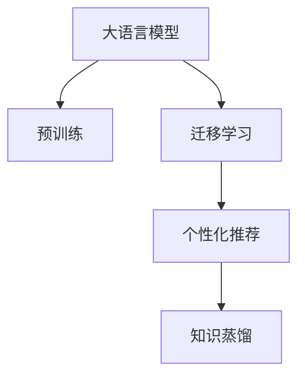

                 

# LLM在推荐系统中的迁移学习应用

> 关键词：大语言模型(LLM), 迁移学习, 推荐系统, 个性化推荐, 知识蒸馏, 用户行为分析

## 1. 背景介绍

### 1.1 问题由来

随着互联网的迅速发展和电子商务的兴起，推荐系统已经成为了各大电商平台不可或缺的核心组件，极大地提升了用户体验和平台收益。传统的推荐系统往往依赖于用户的显式反馈（如点击、购买、评分等）进行模型训练，但这种方式获取数据的成本较高，且容易受到用户反馈偏差的影响。与此同时，用户行为数据并非孤立存在，而是蕴含着丰富的语义和背景信息，而推荐系统的设计往往难以充分利用这些潜在信息。

大语言模型(LLM)的兴起为推荐系统注入了新的活力。大模型通常基于大规模无监督数据进行预训练，拥有强大的自然语言理解和生成能力。通过在推荐系统上下游任务上微调预训练语言模型，能够更好地利用语言知识，挖掘用户行为背后的深层次语义，从而实现更加精准和个性化的推荐服务。

### 1.2 问题核心关键点

大语言模型在推荐系统中的应用核心在于迁移学习。具体来说，大模型的预训练过程与推荐任务的学习过程存在显著差异，但通过迁移学习，可以有效整合两者优势，使得推荐系统可以充分利用大模型的知识，实现更高效的推荐决策。

核心问题包括：

1. **如何将大模型的预训练知识迁移到推荐系统任务中？**
2. **如何在大模型的初始化和微调过程中，更好地适应推荐系统的特点和需求？**
3. **如何在推荐系统中高效利用大模型的知识，提升推荐性能？**

## 2. 核心概念与联系

### 2.1 核心概念概述

为了更好地理解大语言模型在推荐系统中的应用，首先需要明确几个关键概念：

- **大语言模型(LLM)**：基于Transformer结构，通过在大规模无监督文本数据上进行预训练，学习到通用的语言表示，具备强大的自然语言理解和生成能力。

- **迁移学习**：指将一个领域学习到的知识，迁移应用到另一个不同但相关的领域的学习范式。在推荐系统中，大模型的预训练知识可以迁移到用户行为分析、个性化推荐等任务中。

- **个性化推荐**：通过分析用户的历史行为数据，挖掘用户的兴趣偏好，为每个用户推荐最符合其需求的物品。个性化推荐系统可以分为基于内容的推荐和基于协同过滤的推荐。

- **知识蒸馏**：指通过将复杂模型的知识转化为简洁模型的过程，实现模型压缩和性能提升。在大模型的预训练和推荐系统微调过程中，知识蒸馏技术可以有效转移大模型的知识，提升推荐模型的准确性和泛化能力。

### 2.2 核心概念原理和架构的 Mermaid 流程图



此流程图展示了大语言模型在推荐系统中的应用过程。预训练模型在大规模文本数据上学习通用的语言表示，通过迁移学习将知识迁移到推荐系统任务中，进一步在个性化推荐任务上微调，并通过知识蒸馏进行模型压缩和性能提升。

## 3. 核心算法原理 & 具体操作步骤

### 3.1 算法原理概述

大语言模型在推荐系统中的迁移学习主要分为两个步骤：预训练和微调。预训练步骤在大规模无标签文本数据上，通过自监督学习任务训练模型；微调步骤则在下游推荐任务上，通过有监督学习优化模型性能。

- **预训练**：在大规模无标签文本数据上进行自监督学习，如掩码语言建模、下一句预测等任务，使得模型学习到丰富的语言表示。
- **微调**：在下游推荐任务上，利用少量有标签的数据进行微调，使得模型能够匹配特定任务的输出格式，提升推荐效果。

通过预训练和微调的结合，大语言模型能够充分利用无监督学习和有监督学习的优势，提升推荐系统的性能和泛化能力。

### 3.2 算法步骤详解

基于大语言模型在推荐系统中的迁移学习，主要包括以下几个关键步骤：

**Step 1: 准备预训练模型和数据集**

- 选择合适的预训练语言模型，如BERT、GPT等。
- 准备推荐系统的训练集，包括用户历史行为数据和物品特征数据。

**Step 2: 设计任务适配层**

- 根据推荐任务类型，设计合适的输出层和损失函数。
- 对于分类任务，通常使用交叉熵损失；对于回归任务，通常使用均方误差损失。

**Step 3: 设置微调超参数**

- 选择合适的优化算法及其参数，如Adam、SGD等，设置学习率、批大小、迭代轮数等。
- 设置正则化技术及强度，包括权重衰减、Dropout、Early Stopping等。
- 确定冻结预训练参数的策略，如仅微调顶层，或全部参数都参与微调。

**Step 4: 执行梯度训练**

- 将训练集数据分批次输入模型，前向传播计算损失函数。
- 反向传播计算参数梯度，根据设定的优化算法和学习率更新模型参数。
- 周期性在验证集上评估模型性能，根据性能指标决定是否触发Early Stopping。
- 重复上述步骤直至满足预设的迭代轮数或Early Stopping条件。

**Step 5: 测试和部署**

- 在测试集上评估微调后模型性能，对比微调前后的推荐效果提升。
- 使用微调后的模型对新用户和新物品进行推荐，集成到实际推荐系统中。
- 持续收集新用户行为数据，定期重新微调模型，以适应数据分布的变化。

### 3.3 算法优缺点

基于大语言模型在推荐系统中的应用，具有以下优点：

1. **模型性能提升**：通过迁移学习，大模型能够充分利用其预训练知识，提升推荐系统的效果。
2. **泛化能力强**：大模型具备良好的泛化能力，能够适应不同领域和不同规模的推荐任务。
3. **无需标注数据**：大模型的预训练过程通常不需要标注数据，节省了数据获取和标注的成本。

但同时也存在一些缺点：

1. **计算资源消耗大**：大模型的预训练和微调需要消耗大量计算资源，可能导致成本较高。
2. **过拟合风险**：在大模型微调过程中，容易出现过拟合问题，尤其是在数据量较少的情况下。
3. **模型复杂度高**：大模型的参数量通常较大，可能导致推理速度较慢，影响用户体验。

## 4. 数学模型和公式 & 详细讲解

### 4.1 数学模型构建

在推荐系统中，大语言模型的微调可以视为一个二分类任务。假设有 $N$ 个样本 $(x_i, y_i)$，其中 $x_i$ 为输入，$y_i$ 为二元标签。目标是训练一个模型 $M_{\theta}$，使得对于任意输入 $x$，能够预测正确的标签 $y$。

**目标函数**：
$$
\min_{\theta} \frac{1}{N} \sum_{i=1}^N \ell(M_{\theta}(x_i), y_i)
$$

其中 $\ell$ 为损失函数，通常使用交叉熵损失函数：
$$
\ell(y, \hat{y}) = -y \log \hat{y} - (1-y) \log (1-\hat{y})
$$

**模型表示**：
$$
M_{\theta}(x) = \text{softmax}(W^T x + b)
$$

其中 $W$ 和 $b$ 为模型的参数，$x$ 为输入，$\text{softmax}$ 函数将输出转换为概率分布。

### 4.2 公式推导过程

在推荐系统中，我们通常将用户行为数据作为训练样本，将用户是否点击物品作为二元标签。对于每个样本 $(x_i, y_i)$，模型的预测概率为：
$$
\hat{y}_i = \text{softmax}(W^T x_i + b)
$$

模型的损失函数为：
$$
\ell(y_i, \hat{y}_i) = -y_i \log \hat{y}_i - (1-y_i) \log (1-\hat{y}_i)
$$

平均损失函数为：
$$
\mathcal{L}(\theta) = \frac{1}{N} \sum_{i=1}^N \ell(y_i, \hat{y}_i)
$$

利用反向传播算法，计算梯度并更新模型参数 $\theta$：
$$
\frac{\partial \mathcal{L}(\theta)}{\partial \theta} = - \frac{1}{N} \sum_{i=1}^N (y_i - \hat{y}_i) \frac{\partial \hat{y}_i}{\partial \theta}
$$

其中 $\frac{\partial \hat{y}_i}{\partial \theta}$ 为雅可比矩阵，通过链式法则计算得到：
$$
\frac{\partial \hat{y}_i}{\partial \theta} = \frac{\partial \text{softmax}(W^T x_i + b)}{\partial \theta} = \frac{\partial (e^{W^T x_i + b})}{\partial \theta}
$$

### 4.3 案例分析与讲解

以下通过一个简单的案例来说明大语言模型在推荐系统中的应用。

假设我们有一个推荐系统，目标是为每个用户推荐其最感兴趣的书籍。首先，我们需要准备推荐系统的训练数据，包括用户的历史点击数据和书籍的特征数据。然后，我们将书籍的特征数据作为输入 $x$，用户是否点击作为标签 $y$，将书籍特征表示为向量，通过大语言模型进行微调。

假设我们使用BERT模型作为预训练语言模型，并设计了如下任务适配层：

- 输入层：将书籍特征向量作为输入。
- 隐藏层：使用BERT模型作为特征提取器，输出上下文表示。
- 输出层：使用线性分类器，输出书籍是否被点击的概率。

训练过程如下：

1. 将用户历史点击数据作为训练集，使用交叉熵损失函数进行训练。
2. 对于每个样本 $(x_i, y_i)$，前向传播计算预测概率 $\hat{y}_i = \text{softmax}(W^T x_i + b)$。
3. 计算损失 $\ell(y_i, \hat{y}_i) = -y_i \log \hat{y}_i - (1-y_i) \log (1-\hat{y}_i)$。
4. 反向传播更新模型参数 $\theta$。
5. 周期性在验证集上评估模型性能，根据性能指标决定是否触发Early Stopping。
6. 使用微调后的模型对新用户和新书籍进行推荐，集成到实际推荐系统中。

## 5. 项目实践：代码实例和详细解释说明

### 5.1 开发环境搭建

在进行大语言模型微调实践前，我们需要准备好开发环境。以下是使用Python进行PyTorch开发的环境配置流程：

1. 安装Anaconda：从官网下载并安装Anaconda，用于创建独立的Python环境。

2. 创建并激活虚拟环境：
```bash
conda create -n pytorch-env python=3.8 
conda activate pytorch-env
```

3. 安装PyTorch：根据CUDA版本，从官网获取对应的安装命令。例如：
```bash
conda install pytorch torchvision torchaudio cudatoolkit=11.1 -c pytorch -c conda-forge
```

4. 安装Transformers库：
```bash
pip install transformers
```

5. 安装各类工具包：
```bash
pip install numpy pandas scikit-learn matplotlib tqdm jupyter notebook ipython
```

完成上述步骤后，即可在`pytorch-env`环境中开始微调实践。

### 5.2 源代码详细实现

下面我们以书籍推荐任务为例，给出使用Transformers库对BERT模型进行微调的PyTorch代码实现。

首先，定义推荐任务的数据处理函数：

```python
from transformers import BertTokenizer
from torch.utils.data import Dataset
import torch

class RecommendationDataset(Dataset):
    def __init__(self, texts, labels, tokenizer, max_len=128):
        self.texts = texts
        self.labels = labels
        self.tokenizer = tokenizer
        self.max_len = max_len
        
    def __len__(self):
        return len(self.texts)
    
    def __getitem__(self, item):
        text = self.texts[item]
        label = self.labels[item]
        
        encoding = self.tokenizer(text, return_tensors='pt', max_length=self.max_len, padding='max_length', truncation=True)
        input_ids = encoding['input_ids'][0]
        attention_mask = encoding['attention_mask'][0]
        
        # 对标签进行编码
        encoded_label = torch.tensor(label, dtype=torch.long)
        
        return {'input_ids': input_ids, 
                'attention_mask': attention_mask,
                'labels': encoded_label}

# 定义标签与id的映射
label2id = {'clicked': 1, 'not_clicked': 0}
id2label = {v: k for k, v in label2id.items()}

# 创建dataset
tokenizer = BertTokenizer.from_pretrained('bert-base-cased')

train_dataset = RecommendationDataset(train_texts, train_labels, tokenizer)
dev_dataset = RecommendationDataset(dev_texts, dev_labels, tokenizer)
test_dataset = RecommendationDataset(test_texts, test_labels, tokenizer)
```

然后，定义模型和优化器：

```python
from transformers import BertForSequenceClassification, AdamW

model = BertForSequenceClassification.from_pretrained('bert-base-cased', num_labels=len(label2id))

optimizer = AdamW(model.parameters(), lr=2e-5)
```

接着，定义训练和评估函数：

```python
from torch.utils.data import DataLoader
from tqdm import tqdm
from sklearn.metrics import classification_report

device = torch.device('cuda') if torch.cuda.is_available() else torch.device('cpu')
model.to(device)

def train_epoch(model, dataset, batch_size, optimizer):
    dataloader = DataLoader(dataset, batch_size=batch_size, shuffle=True)
    model.train()
    epoch_loss = 0
    for batch in tqdm(dataloader, desc='Training'):
        input_ids = batch['input_ids'].to(device)
        attention_mask = batch['attention_mask'].to(device)
        labels = batch['labels'].to(device)
        model.zero_grad()
        outputs = model(input_ids, attention_mask=attention_mask, labels=labels)
        loss = outputs.loss
        epoch_loss += loss.item()
        loss.backward()
        optimizer.step()
    return epoch_loss / len(dataloader)

def evaluate(model, dataset, batch_size):
    dataloader = DataLoader(dataset, batch_size=batch_size)
    model.eval()
    preds, labels = [], []
    with torch.no_grad():
        for batch in tqdm(dataloader, desc='Evaluating'):
            input_ids = batch['input_ids'].to(device)
            attention_mask = batch['attention_mask'].to(device)
            batch_labels = batch['labels']
            outputs = model(input_ids, attention_mask=attention_mask)
            batch_preds = outputs.logits.argmax(dim=2).to('cpu').tolist()
            batch_labels = batch_labels.to('cpu').tolist()
            for pred, label in zip(batch_preds, batch_labels):
                preds.append(pred[0])
                labels.append(label)
                
    print(classification_report(labels, preds))
```

最后，启动训练流程并在测试集上评估：

```python
epochs = 5
batch_size = 16

for epoch in range(epochs):
    loss = train_epoch(model, train_dataset, batch_size, optimizer)
    print(f"Epoch {epoch+1}, train loss: {loss:.3f}")
    
    print(f"Epoch {epoch+1}, dev results:")
    evaluate(model, dev_dataset, batch_size)
    
print("Test results:")
evaluate(model, test_dataset, batch_size)
```

以上就是使用PyTorch对BERT进行书籍推荐任务微调的完整代码实现。可以看到，得益于Transformers库的强大封装，我们可以用相对简洁的代码完成BERT模型的加载和微调。

### 5.3 代码解读与分析

让我们再详细解读一下关键代码的实现细节：

**RecommendationDataset类**：
- `__init__`方法：初始化文本、标签、分词器等关键组件。
- `__len__`方法：返回数据集的样本数量。
- `__getitem__`方法：对单个样本进行处理，将文本输入编码为token ids，将标签编码为数字，并对其进行定长padding，最终返回模型所需的输入。

**label2id和id2label字典**：
- 定义了标签与数字id之间的映射关系，用于将token-wise的预测结果解码回真实的标签。

**训练和评估函数**：
- 使用PyTorch的DataLoader对数据集进行批次化加载，供模型训练和推理使用。
- 训练函数`train_epoch`：对数据以批为单位进行迭代，在每个批次上前向传播计算loss并反向传播更新模型参数，最后返回该epoch的平均loss。
- 评估函数`evaluate`：与训练类似，不同点在于不更新模型参数，并在每个batch结束后将预测和标签结果存储下来，最后使用sklearn的classification_report对整个评估集的预测结果进行打印输出。

**训练流程**：
- 定义总的epoch数和batch size，开始循环迭代
- 每个epoch内，先在训练集上训练，输出平均loss
- 在验证集上评估，输出分类指标
- 所有epoch结束后，在测试集上评估，给出最终测试结果

可以看到，PyTorch配合Transformers库使得BERT微调的代码实现变得简洁高效。开发者可以将更多精力放在数据处理、模型改进等高层逻辑上，而不必过多关注底层的实现细节。

当然，工业级的系统实现还需考虑更多因素，如模型的保存和部署、超参数的自动搜索、更灵活的任务适配层等。但核心的微调范式基本与此类似。

## 6. 实际应用场景

### 6.1 电商推荐

大语言模型在电商推荐系统中可以发挥重要作用。电商推荐系统通常需要处理海量的用户行为数据，包括浏览、点击、购买等行为。通过大语言模型微调，可以更好地理解用户的兴趣偏好，提高推荐的准确性和个性化程度。

具体而言，可以收集用户的历史浏览、点击、购买等行为数据，使用BERT等大模型进行预训练，并在电商推荐任务上进行微调。微调后的模型能够更好地学习用户的行为模式和兴趣特征，从而实现更精准的推荐。

### 6.2 视频推荐

视频推荐系统面临着比电商推荐更复杂的推荐场景。视频推荐需要同时考虑用户的历史行为、视频内容的多样性以及视频之间的关联性。通过大语言模型微调，可以更好地捕捉用户对视频内容的语义理解，提升推荐效果。

具体而言，可以收集用户对视频内容的评价、观看时长等行为数据，并提取视频的元数据信息。利用BERT等大模型进行预训练，并在视频推荐任务上进行微调。微调后的模型能够更好地理解视频内容，结合用户行为，实现更精确的推荐。

### 6.3 社交媒体推荐

社交媒体推荐系统需要对用户发表的文本数据进行理解，从而推荐相关的内容和用户。通过大语言模型微调，可以更好地捕捉用户对内容的兴趣和情感，提升推荐效果。

具体而言，可以收集用户发表的微博、文章等文本数据，使用BERT等大模型进行预训练，并在社交媒体推荐任务上进行微调。微调后的模型能够更好地理解用户的兴趣和情感，从而实现更精准的内容推荐。

### 6.4 未来应用展望

随着大语言模型和微调方法的不断发展，其在推荐系统中的应用将呈现更多创新和突破。

1. **多模态推荐**：结合图像、音频等多模态信息，提升推荐的全面性和准确性。例如，在视频推荐中结合视频内容和用户的语义描述，实现更精确的推荐。
2. **跨领域迁移学习**：将大模型的知识迁移到不同领域的应用中，提升模型的泛化能力和鲁棒性。例如，在电商和视频推荐系统中，通过迁移学习实现模型的跨领域迁移。
3. **联邦学习**：利用用户的隐私数据，通过联邦学习技术，在不共享数据的前提下，提升推荐模型的性能。例如，在社交媒体推荐中，通过联邦学习实现用户行为的联合建模。
4. **对抗训练**：通过对抗样本训练，提升推荐模型的鲁棒性和安全性。例如，在电商推荐中，通过对抗样本训练，提高模型对异常数据的识别能力。
5. **个性化推荐模型优化**：通过优化推荐模型的架构和算法，提升推荐模型的效率和性能。例如，在电商推荐中，通过优化推荐模型的特征提取和表示学习，提高模型的推荐效果。

## 7. 工具和资源推荐

### 7.1 学习资源推荐

为了帮助开发者系统掌握大语言模型在推荐系统中的应用，这里推荐一些优质的学习资源：

1. 《Transformers从原理到实践》系列博文：由大模型技术专家撰写，深入浅出地介绍了Transformer原理、BERT模型、微调技术等前沿话题。

2. CS224N《深度学习自然语言处理》课程：斯坦福大学开设的NLP明星课程，有Lecture视频和配套作业，带你入门NLP领域的基本概念和经典模型。

3. 《Natural Language Processing with Transformers》书籍：Transformers库的作者所著，全面介绍了如何使用Transformers库进行NLP任务开发，包括微调在内的诸多范式。

4. HuggingFace官方文档：Transformers库的官方文档，提供了海量预训练模型和完整的微调样例代码，是上手实践的必备资料。

5. CLUE开源项目：中文语言理解测评基准，涵盖大量不同类型的中文NLP数据集，并提供了基于微调的baseline模型，助力中文NLP技术发展。

通过对这些资源的学习实践，相信你一定能够快速掌握大语言模型在推荐系统中的应用，并用于解决实际的推荐问题。

### 7.2 开发工具推荐

高效的开发离不开优秀的工具支持。以下是几款用于大语言模型微调开发的常用工具：

1. PyTorch：基于Python的开源深度学习框架，灵活动态的计算图，适合快速迭代研究。大部分预训练语言模型都有PyTorch版本的实现。

2. TensorFlow：由Google主导开发的开源深度学习框架，生产部署方便，适合大规模工程应用。同样有丰富的预训练语言模型资源。

3. Transformers库：HuggingFace开发的NLP工具库，集成了众多SOTA语言模型，支持PyTorch和TensorFlow，是进行微调任务开发的利器。

4. Weights & Biases：模型训练的实验跟踪工具，可以记录和可视化模型训练过程中的各项指标，方便对比和调优。与主流深度学习框架无缝集成。

5. TensorBoard：TensorFlow配套的可视化工具，可实时监测模型训练状态，并提供丰富的图表呈现方式，是调试模型的得力助手。

6. Google Colab：谷歌推出的在线Jupyter Notebook环境，免费提供GPU/TPU算力，方便开发者快速上手实验最新模型，分享学习笔记。

合理利用这些工具，可以显著提升大语言模型微调任务的开发效率，加快创新迭代的步伐。

### 7.3 相关论文推荐

大语言模型在推荐系统中的应用源于学界的持续研究。以下是几篇奠基性的相关论文，推荐阅读：

1. Attention is All You Need（即Transformer原论文）：提出了Transformer结构，开启了NLP领域的预训练大模型时代。

2. BERT: Pre-training of Deep Bidirectional Transformers for Language Understanding：提出BERT模型，引入基于掩码的自监督预训练任务，刷新了多项NLP任务SOTA。

3. Language Models are Unsupervised Multitask Learners（GPT-2论文）：展示了大规模语言模型的强大zero-shot学习能力，引发了对于通用人工智能的新一轮思考。

4. Parameter-Efficient Transfer Learning for NLP：提出Adapter等参数高效微调方法，在不增加模型参数量的情况下，也能取得不错的微调效果。

5. Knowledge Distillation: A New Framework for Transfer Learning in NLP：介绍了知识蒸馏框架，通过将复杂模型的知识转化为简洁模型的过程，实现模型压缩和性能提升。

6. Multi-task Learning for Multi-modal Recommendation：介绍了多模态推荐的多任务学习框架，通过同时学习多个推荐任务，提升模型的推荐效果。

这些论文代表了大语言模型在推荐系统中的应用发展脉络。通过学习这些前沿成果，可以帮助研究者把握学科前进方向，激发更多的创新灵感。

## 8. 总结：未来发展趋势与挑战

### 8.1 研究成果总结

本文对基于大语言模型的推荐系统进行了全面系统的介绍。首先阐述了大语言模型在推荐系统中的应用背景和意义，明确了迁移学习在大模型微调中的关键作用。其次，从原理到实践，详细讲解了迁移学习的数学模型和操作步骤，给出了微调任务开发的完整代码实例。同时，本文还探讨了推荐系统在大语言模型微调中的实际应用场景，展示了微调范式的巨大潜力。最后，本文推荐了相关的学习资源、开发工具和论文，力求为读者提供全方位的技术指引。

通过本文的系统梳理，可以看到，大语言模型在推荐系统中的应用将带来显著的性能提升和泛化能力，为推荐系统的发展提供了新的契机。随着大语言模型和微调方法的不断进步，推荐系统必将在更多领域得到应用，为智能交互和决策支持提供更加精准和个性化的服务。

### 8.2 未来发展趋势

展望未来，大语言模型在推荐系统中的应用将呈现以下几个发展趋势：

1. **多模态融合**：结合图像、音频等多模态信息，提升推荐系统的全面性和准确性。通过多模态融合，可以更好地捕捉用户的兴趣和情感，实现更精准的推荐。
2. **跨领域迁移**：将大模型的知识迁移到不同领域的应用中，提升模型的泛化能力和鲁棒性。通过跨领域迁移，可以实现大模型的知识共享，提升推荐系统的性能。
3. **联邦学习**：利用用户的隐私数据，通过联邦学习技术，在不共享数据的前提下，提升推荐模型的性能。通过联邦学习，可以实现多用户数据的联合建模，提升推荐系统的精度和鲁棒性。
4. **对抗训练**：通过对抗样本训练，提升推荐模型的鲁棒性和安全性。通过对抗训练，可以识别和防范恶意攻击，提升推荐系统的可靠性。
5. **个性化推荐模型优化**：通过优化推荐模型的架构和算法，提升推荐模型的效率和性能。通过模型优化，可以实现推荐系统的快速响应和高效部署。
6. **对抗训练**：通过对抗样本训练，提升推荐模型的鲁棒性和安全性。通过对抗训练，可以识别和防范恶意攻击，提升推荐系统的可靠性。

### 8.3 面临的挑战

尽管大语言模型在推荐系统中的应用已经取得了显著成效，但在迈向更加智能化、普适化应用的过程中，仍面临诸多挑战：

1. **数据隐私保护**：大模型的微调需要大量的用户行为数据，如何在保护用户隐私的前提下，获取高质量的数据，是一个重要的挑战。
2. **模型复杂度**：大模型的参数量通常较大，推理速度较慢，如何在保证精度的同时，提高模型的计算效率，是一个需要不断探索的问题。
3. **对抗攻击**：大模型的微调容易受到对抗攻击，如何在保证鲁棒性的前提下，提升推荐模型的安全性，是一个需要持续研究的课题。
4. **用户反馈偏差**：大模型的微调依赖于用户的历史行为数据，用户反馈偏差可能导致模型学习到的知识不全面或不准确。如何通过对抗样本训练和多重验证，减小反馈偏差的影响，是一个需要解决的问题。
5. **模型公平性**：大模型的微调可能会学习到模型偏见，如何在模型设计和训练过程中，保证公平性，避免歧视性的推荐结果，是一个需要关注的问题。

### 8.4 研究展望

面对大语言模型在推荐系统中面临的挑战，未来的研究需要在以下几个方面寻求新的突破：

1. **隐私保护技术**：利用差分隐私、联邦学习等技术，保护用户数据的隐私安全。
2. **模型压缩技术**：通过剪枝、量化等技术，压缩大模型的参数量，提高推理速度和效率。
3. **对抗训练技术**：通过对抗样本训练，提升推荐模型的鲁棒性和安全性。
4. **反馈偏差缓解**：通过多轮验证和对抗样本训练，减小用户反馈偏差的影响。
5. **公平性保障**：通过模型设计、数据预处理等手段，保证推荐模型的公平性和无偏性。

这些研究方向将为大语言模型在推荐系统中的应用提供新的思路和技术手段，推动推荐系统的创新和发展。

## 9. 附录：常见问题与解答

**Q1：大语言模型在推荐系统中需要多少标注数据？**

A: 大语言模型在推荐系统中的微调通常需要较少的标注数据。具体而言，数据量取决于模型的复杂度和推荐任务的难度。一般而言，几百万到几千万条用户行为数据即可进行微调，不同领域和任务的数据需求会有所不同。

**Q2：如何选择合适的学习率？**

A: 大语言模型在推荐系统中的微调通常需要较小的学习率，以免破坏预训练权重。一般建议从1e-5开始调参，逐步减小学习率，直至收敛。也可以使用warmup策略，在开始阶段使用较小的学习率，再逐渐过渡到预设值。需要注意的是，不同的优化器(如AdamW、Adafactor等)以及不同的学习率调度策略，可能需要设置不同的学习率阈值。

**Q3：大语言模型在推荐系统中的计算资源消耗大吗？**

A: 大语言模型在推荐系统中的计算资源消耗确实较大，尤其是对于一些大规模推荐系统，可能需要数个GPU或TPU进行计算。但随着硬件设备的不断进步和优化，推荐系统的计算效率也在不断提高。同时，一些轻量级的模型和小样本学习技术，如Prompt-based Learning，也可以在一定程度上缓解计算资源的压力。

**Q4：大语言模型在推荐系统中的过拟合问题如何解决？**

A: 大语言模型在推荐系统中的过拟合问题可以通过以下方法解决：
1. 数据增强：通过回译、近义替换等方式扩充训练集。
2. 正则化：使用L2正则、Dropout、Early Stopping等避免过拟合。
3. 对抗训练：引入对抗样本，提高模型鲁棒性。
4. 参数高效微调：只调整少量参数(如Adapter、Prefix等)，减小过拟合风险。

这些策略往往需要根据具体任务和数据特点进行灵活组合。只有在数据、模型、训练、推理等各环节进行全面优化，才能最大限度地发挥大模型微调的威力。

**Q5：大语言模型在推荐系统中的推荐效果如何？**

A: 大语言模型在推荐系统中的推荐效果通常优于传统的协同过滤和内容推荐方法。具体而言，大语言模型能够更好地理解用户的兴趣和情感，通过预训练和微调学习到更丰富的语义信息，从而实现更精准和个性化的推荐。

通过本文的系统梳理，可以看到，大语言模型在推荐系统中的应用将带来显著的性能提升和泛化能力，为推荐系统的发展提供了新的契机。随着大语言模型和微调方法的不断进步，推荐系统必将在更多领域得到应用，为智能交互和决策支持提供更加精准和个性化的服务。

总之，大语言模型在推荐系统中的应用前景广阔，但同时也面临着诸多挑战和研究方向。只有在数据、算法、工程、业务等多个维度协同发力，才能真正实现人工智能技术在推荐系统中的落地应用，推动推荐系统向更加智能化、普适化的方向发展。

