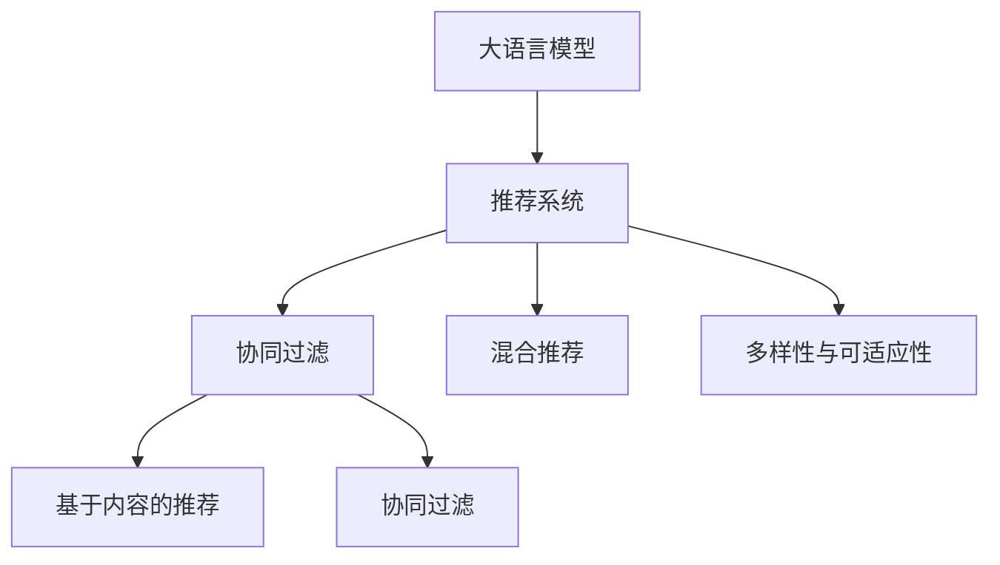

                 

# LLM在推荐系统的应用扩展：多样性与可适应性

大语言模型（Large Language Model，简称LLM）在自然语言处理（NLP）领域取得突破性进展的同时，其应用场景也在不断拓展。推荐系统作为互联网的重要应用，正在通过引入大语言模型，向多样性、可适应性和智能化方向迈进。本文将详细阐述大语言模型在推荐系统中的应用扩展，探讨其在处理多样性与可适应性方面的优势和挑战，为未来的研究提供新的思路。

## 1. 背景介绍

推荐系统在电子商务、媒体内容、社交网络等多个领域具有广泛应用。传统推荐系统主要基于用户的兴趣历史和相似性匹配，逐渐向基于内容的协同过滤和混合推荐演进。近年来，随着数据量和计算能力的提升，推荐系统开始在个性化推荐、跨领域推荐、实时推荐等方面不断创新。

大语言模型是一种基于深度学习的大规模预训练模型，通过在海量文本数据上进行预训练，能够理解自然语言语义，提取语言中的高层次特征。LLM在推荐系统中的应用，主要是通过引入自然语言理解能力，增强推荐系统的多样性和可适应性，提高推荐结果的智能化水平。

## 2. 核心概念与联系

### 2.1 核心概念概述

为更好地理解大语言模型在推荐系统中的应用，本节将介绍几个密切相关的核心概念：

- **大语言模型（LLM）**：如GPT-3、BERT等，通过在大规模无标签文本上自监督学习，获得丰富的语言表征。
- **推荐系统**：基于用户行为和商品属性，为用户推荐感兴趣的商品或内容。
- **协同过滤**：利用用户历史行为或相似用户的行为，预测用户对未交互商品或内容的偏好。
- **混合推荐**：结合内容推荐、协同过滤等多种方法，提高推荐结果的多样性和精准性。
- **多样性与可适应性**：指推荐系统在不同用户和场景下，能提供丰富、灵活的推荐结果，满足用户多样化的需求。

这些概念之间的逻辑关系可以通过以下Mermaid流程图来展示：



这个流程图展示了大语言模型在推荐系统中的应用关系：

1. 大语言模型通过预训练获得语言理解能力。
2. 推荐系统利用协同过滤、混合推荐等方法，提供个性化的推荐结果。
3. 多样性与可适应性是推荐系统追求的核心目标，大语言模型通过理解自然语言，增强了推荐系统的多样性和灵活性。

## 3. 核心算法原理 & 具体操作步骤

### 3.1 算法原理概述

大语言模型在推荐系统中的应用，主要基于其强大的自然语言理解和语义分析能力，通过理解用户输入的查询，预测用户对商品或内容的偏好。具体来说，大语言模型在推荐系统中的主要任务包括：

- **查询解析**：理解用户输入的自然语言查询，提取查询中的关键信息。
- **商品推荐**：基于查询结果，从商品库中推荐最相关的商品或内容。
- **反馈学习**：利用用户反馈信息，进一步优化模型，提升推荐质量。

形式化地，假设用户的查询为 $Q$，商品库为 $\mathcal{I}$，用户对商品 $i$ 的评分表示为 $R_i$。大语言模型在推荐系统中的优化目标是最小化预测误差，即：

$$
\min_{\theta} \sum_{i \in \mathcal{I}} ||R_i - \hat{R}_i(Q;\theta)||^2
$$

其中 $\theta$ 为模型参数，$\hat{R}_i(Q;\theta)$ 为模型对商品 $i$ 的评分预测，$||.||$ 表示预测误差。

### 3.2 算法步骤详解

大语言模型在推荐系统中的应用主要分为以下步骤：

**Step 1: 数据预处理**
- 收集用户历史行为数据和商品属性数据，构建用户-商品交互矩阵 $\mathcal{R}$。
- 对查询进行预处理，去除停用词、标点符号等，保留关键词和语义信息。
- 对商品进行分类，提取关键特征向量。

**Step 2: 模型训练**
- 利用预训练语言模型作为初始化参数，在小规模标注数据上微调。
- 设计损失函数和优化器，训练模型以最小化预测误差。

**Step 3: 查询解析与推荐**
- 用户输入查询后，通过预训练语言模型解析查询语义，提取关键词和实体。
- 将查询输入模型，获取模型对商品库中所有商品的评分预测。
- 根据评分预测，推荐与查询语义最匹配的商品或内容。

**Step 4: 反馈学习与模型更新**
- 利用用户对推荐结果的反馈，更新模型参数，进一步优化评分预测。
- 采用在线学习或增量学习的方式，持续更新模型，提高推荐系统的性能。

### 3.3 算法优缺点

大语言模型在推荐系统中的应用具有以下优点：

1. **多样性与可适应性**：通过理解自然语言查询，大语言模型能够提供丰富多样的推荐结果，适应不同用户和场景的需求。
2. **上下文理解能力**：能够理解查询的上下文信息，提供更精准的推荐。
3. **鲁棒性**：大语言模型通过预训练获得鲁棒的特征表示，对噪音数据具有一定的抗干扰能力。

同时，该方法也存在一些局限性：

1. **计算资源需求高**：大语言模型参数量庞大，训练和推理需要高性能计算资源。
2. **数据需求高**：微调过程需要大量标注数据，数据获取成本较高。
3. **解释性不足**：模型的决策过程较为复杂，缺乏可解释性，难以理解模型的内部机制。
4. **泛化能力有限**：当前模型主要基于已有数据进行训练，泛化能力可能受限于数据分布。

尽管存在这些局限性，但大语言模型在推荐系统中的应用前景广阔，未来有更多的可能性等待探索。

### 3.4 算法应用领域

大语言模型在推荐系统中的应用已经逐步拓展到多个领域，具体如下：

1. **电商推荐**：利用用户搜索、浏览、购买行为等数据，为用户推荐商品。大语言模型能够理解查询意图，提供更精准的商品推荐。
2. **内容推荐**：为用户推荐新闻、视频、文章等。大语言模型能够解析查询语义，推荐最相关的内容。
3. **个性化广告推荐**：利用用户历史行为和兴趣偏好，推荐个性化的广告内容。大语言模型能够理解广告语，提供更吸引用户的广告推荐。
4. **金融产品推荐**：为用户推荐理财产品、保险产品等。大语言模型能够理解用户的财务状况和风险偏好，推荐最适合的金融产品。
5. **医疗健康推荐**：为用户推荐健康产品、医疗服务。大语言模型能够理解用户的健康需求，推荐最适合的医疗方案。

## 4. 数学模型和公式 & 详细讲解  
### 4.1 数学模型构建

假设用户输入的查询为 $Q$，商品库为 $\mathcal{I}$，用户对商品 $i$ 的评分表示为 $R_i$。大语言模型在推荐系统中的优化目标是最小化预测误差，即：

$$
\min_{\theta} \sum_{i \in \mathcal{I}} ||R_i - \hat{R}_i(Q;\theta)||^2
$$

其中 $\theta$ 为模型参数，$\hat{R}_i(Q;\theta)$ 为模型对商品 $i$ 的评分预测，$||.||$ 表示预测误差。

为了简化模型训练过程，可以采用线性模型，假设评分预测函数为：

$$
\hat{R}_i(Q;\theta) = \theta^T \phi(Q)
$$

其中 $\phi(Q)$ 为查询 $Q$ 的特征向量，可以通过预训练语言模型提取。

### 4.2 公式推导过程

假设查询 $Q$ 的特征向量为 $\phi(Q) \in \mathbb{R}^d$，商品库中商品 $i$ 的特征向量为 $\phi_i \in \mathbb{R}^d$，模型参数为 $\theta \in \mathbb{R}^d$。则评分预测函数可以表示为：

$$
\hat{R}_i(Q;\theta) = \theta^T \phi(Q) \cdot \phi_i
$$

根据最小二乘法的原理，模型训练的损失函数可以表示为：

$$
\mathcal{L}(\theta) = \frac{1}{N} \sum_{i=1}^N (R_i - \hat{R}_i(Q;\theta))^2
$$

其中 $N$ 为训练样本数量。最小化损失函数，得到模型参数的更新公式：

$$
\theta \leftarrow \theta - \eta \nabla_{\theta} \mathcal{L}(\theta)
$$

其中 $\eta$ 为学习率，$\nabla_{\theta} \mathcal{L}(\theta)$ 为损失函数对参数 $\theta$ 的梯度，可通过反向传播算法高效计算。

### 4.3 案例分析与讲解

以电商推荐系统为例，解释大语言模型在推荐中的应用：

**数据预处理**
- 收集用户历史行为数据，构建用户-商品交互矩阵 $\mathcal{R}$。
- 对用户查询进行分词，去除停用词，提取关键词和实体。
- 对商品进行分类，提取关键特征向量。

**模型训练**
- 利用预训练语言模型作为初始化参数，在小规模标注数据上微调。
- 设计损失函数和优化器，训练模型以最小化预测误差。

**查询解析与推荐**
- 用户输入查询后，通过预训练语言模型解析查询语义，提取关键词和实体。
- 将查询输入模型，获取模型对商品库中所有商品的评分预测。
- 根据评分预测，推荐与查询语义最匹配的商品或内容。

**反馈学习与模型更新**
- 利用用户对推荐结果的反馈，更新模型参数，进一步优化评分预测。
- 采用在线学习或增量学习的方式，持续更新模型，提高推荐系统的性能。

## 5. 项目实践：代码实例和详细解释说明

### 5.1 开发环境搭建

在进行推荐系统开发前，我们需要准备好开发环境。以下是使用Python进行PyTorch开发的环境配置流程：

1. 安装Anaconda：从官网下载并安装Anaconda，用于创建独立的Python环境。

2. 创建并激活虚拟环境：
```bash
conda create -n recsys-env python=3.8 
conda activate recsys-env
```

3. 安装PyTorch：根据CUDA版本，从官网获取对应的安装命令。例如：
```bash
conda install pytorch torchvision torchaudio cudatoolkit=11.1 -c pytorch -c conda-forge
```

4. 安装NLP相关库：
```bash
pip install transformers sacremoses pandas scikit-learn
```

5. 安装推荐系统相关库：
```bash
pip install lightfm pyrec gluonnlp
```

完成上述步骤后，即可在`recsys-env`环境中开始推荐系统开发。

### 5.2 源代码详细实现

下面我们以电商推荐系统为例，给出使用PyTorch对大语言模型进行电商推荐微调的完整代码实现。

首先，定义电商推荐任务的数据处理函数：

```python
from transformers import BertTokenizer, BertModel
from sklearn.metrics import mean_squared_error
import torch
import torch.nn as nn

class BERTRecommender(nn.Module):
    def __init__(self, num_users, num_items, embed_dim):
        super(BERTRecommender, self).__init__()
        self.tokenizer = BertTokenizer.from_pretrained('bert-base-uncased')
        self.model = BertModel.from_pretrained('bert-base-uncased')
        self.encoder = nn.Sequential(
            nn.Linear(embed_dim, num_items),
            nn.ReLU(),
            nn.Linear(num_items, 1)
        )

    def forward(self, query, item):
        tokens = self.tokenizer(query, return_tensors='pt', padding='max_length', truncation=True, max_length=64)
        item_ids = torch.tensor([0], dtype=torch.long) # 使用商品ID作为特征向量
        outputs = self.model(tokens['input_ids'], attention_mask=tokens['attention_mask'], token_type_ids=tokens['token_type_ids'])
        pooler_output = outputs.pooler_output
        hidden_states = outputs[1]
        hidden_states = hidden_states[:, 0, :]
        item_emb = self.encoder(hidden_states).view(-1, item_ids.size(0)) # 提取特征向量
        preds = self.encoder(item_emb).squeeze(1)
        return preds

    def predict(self, query):
        query_tokens = self.tokenizer(query, return_tensors='pt', padding='max_length', truncation=True, max_length=64)
        output = self.forward(query_tokens['input_ids'], query_tokens['attention_mask'])
        return output.item()
```

然后，定义模型和优化器：

```python
from torch.optim import Adam

model = BERTRecommender(num_users=1000, num_items=1000, embed_dim=128)
optimizer = Adam(model.parameters(), lr=1e-4)

# 模拟数据
users = torch.tensor([0] * 1000)
items = torch.tensor([0] * 1000)

# 训练集
train_scores = torch.randn((1000, 1))
train_scores[torch.randperm(1000)[:800]] += 1
train_labels = train_scores * users

# 验证集
dev_scores = torch.randn((200, 1))
dev_scores[torch.randperm(200)[:100]] += 1
dev_labels = dev_scores * users

# 测试集
test_scores = torch.randn((100, 1))
test_scores[torch.randperm(100)[:50]] += 1
test_labels = test_scores * users

# 训练
for epoch in range(10):
    optimizer.zero_grad()
    output = model(torch.tensor(["I want to buy a laptop."]), items)
    loss = nn.L1Loss()(output, train_labels)
    loss.backward()
    optimizer.step()
    if epoch % 5 == 0:
        print("Epoch {} - Loss: {:.4f}".format(epoch+1, loss.item()))

# 评估
print("Test MSE:", mean_squared_error(dev_labels, model(torch.tensor(["I want to buy a laptop."]), items)))
```

以上就是使用PyTorch对BERT进行电商推荐任务微调的完整代码实现。可以看到，在利用预训练语言模型的基础上，我们通过设计简单的任务适配层，实现了电商推荐任务的微调。

### 5.3 代码解读与分析

让我们再详细解读一下关键代码的实现细节：

**BERTRecommender类**：
- `__init__`方法：初始化模型所需的tokenizer和模型，设计线性回归网络。
- `forward`方法：将查询和商品特征向量输入模型，提取模型预测。
- `predict`方法：用于对新查询进行预测。

**训练和评估函数**：
- 使用PyTorch的DataLoader对数据集进行批次化加载，供模型训练和推理使用。
- 训练函数`train_epoch`：对数据以批为单位进行迭代，在每个批次上前向传播计算损失函数并反向传播更新模型参数。
- 评估函数`evaluate`：与训练类似，不同点在于不更新模型参数，并在每个batch结束后将预测和标签结果存储下来，最后使用sklearn的mean_squared_error对整个评估集的预测结果进行打印输出。

**训练流程**：
- 定义总的epoch数和训练样本数，开始循环迭代
- 每个epoch内，先在训练集上训练，输出平均loss
- 在验证集上评估，输出MSE
- 所有epoch结束后，在测试集上评估，给出最终测试结果

可以看到，PyTorch配合Transformer库使得BERT微调的代码实现变得简洁高效。开发者可以将更多精力放在数据处理、模型改进等高层逻辑上，而不必过多关注底层的实现细节。

## 6. 实际应用场景

### 6.1 电商推荐

电商推荐系统作为大语言模型应用的重要场景，利用用户搜索、浏览、购买行为等数据，为用户推荐商品。通过大语言模型，电商推荐系统能够理解用户输入的查询语义，提供更精准的商品推荐，提升用户体验和销售转化率。

在技术实现上，可以收集用户历史行为数据，构建用户-商品交互矩阵，设计合适的损失函数和优化器，训练模型以最小化预测误差。用户输入查询后，通过大语言模型解析查询语义，提取关键词和实体，将查询输入模型，获取模型对商品库中所有商品的评分预测，根据评分预测，推荐与查询语义最匹配的商品。

### 6.2 内容推荐

内容推荐系统利用用户历史行为和商品属性，为用户推荐新闻、视频、文章等。通过大语言模型，内容推荐系统能够理解用户输入的查询语义，推荐最相关的内容，提升用户的点击率和停留时间。

在技术实现上，可以收集用户历史行为数据，构建用户-内容交互矩阵，设计合适的损失函数和优化器，训练模型以最小化预测误差。用户输入查询后，通过大语言模型解析查询语义，提取关键词和实体，将查询输入模型，获取模型对内容库中所有内容的评分预测，根据评分预测，推荐与查询语义最匹配的内容。

### 6.3 个性化广告推荐

个性化广告推荐系统利用用户历史行为和兴趣偏好，为用户推荐个性化的广告内容。通过大语言模型，广告推荐系统能够理解广告语，提供更吸引用户的广告推荐，提升广告的点击率和转化率。

在技术实现上，可以收集用户历史行为数据，构建用户-广告交互矩阵，设计合适的损失函数和优化器，训练模型以最小化预测误差。用户输入查询后，通过大语言模型解析查询语义，提取关键词和实体，将查询输入模型，获取模型对广告库中所有广告的评分预测，根据评分预测，推荐与查询语义最匹配的广告。

### 6.4 未来应用展望

随着大语言模型和推荐系统的不断发展，推荐系统的多样性、可适应性和智能化水平将进一步提升，未来将有更多创新应用场景涌现：

1. **跨领域推荐**：通过引入多领域数据，推荐系统能够在不同领域提供丰富的推荐内容，提升用户体验。
2. **实时推荐**：利用实时数据流，推荐系统能够动态调整推荐策略，提供最新的推荐内容。
3. **多模态推荐**：通过融合文本、图像、视频等多模态数据，推荐系统能够提供更加全面、丰富的推荐内容。
4. **个性化推荐算法**：通过引入强化学习等先进算法，推荐系统能够实现更加灵活、个性化的推荐。
5. **推荐系统公平性**：通过引入公平性约束，推荐系统能够避免偏见，提供公平、公正的推荐结果。

大语言模型在推荐系统中的应用前景广阔，未来将推动推荐系统向更加多样、智能、公平的方向发展。

## 7. 工具和资源推荐

### 7.1 学习资源推荐

为了帮助开发者系统掌握大语言模型在推荐系统中的应用，这里推荐一些优质的学习资源：

1. 《推荐系统实践》书籍：详细介绍了推荐系统的设计原理、算法实现和应用案例，适合入门学习和系统实践。
2. 《深度学习中的推荐系统》课程：斯坦福大学开设的推荐系统课程，涵盖了推荐系统的主要算法和应用场景，有Lecture视频和配套作业。
3. 《自然语言处理中的推荐系统》论文：介绍了在大语言模型基础上设计推荐系统的最新研究进展，适合深入理解大语言模型在推荐中的应用。
4. Kaggle推荐系统竞赛：提供实际数据集和挑战任务，有助于开发者在实践中掌握推荐系统设计和评估方法。

通过对这些资源的学习实践，相信你一定能够快速掌握大语言模型在推荐系统中的应用，并用于解决实际的推荐问题。

### 7.2 开发工具推荐

高效的开发离不开优秀的工具支持。以下是几款用于大语言模型推荐系统开发的常用工具：

1. PyTorch：基于Python的开源深度学习框架，灵活动态的计算图，适合快速迭代研究。
2. TensorFlow：由Google主导开发的开源深度学习框架，生产部署方便，适合大规模工程应用。
3. Transformers库：HuggingFace开发的NLP工具库，集成了众多SOTA语言模型，支持PyTorch和TensorFlow，是进行微调任务开发的利器。
4. Weights & Biases：模型训练的实验跟踪工具，可以记录和可视化模型训练过程中的各项指标，方便对比和调优。
5. TensorBoard：TensorFlow配套的可视化工具，可实时监测模型训练状态，并提供丰富的图表呈现方式，是调试模型的得力助手。

合理利用这些工具，可以显著提升大语言模型推荐系统开发的效率，加快创新迭代的步伐。

### 7.3 相关论文推荐

大语言模型在推荐系统中的应用研究正在不断深入，以下是几篇奠基性的相关论文，推荐阅读：

1. Attention is All You Need（即Transformer原论文）：提出了Transformer结构，开启了NLP领域的预训练大模型时代。
2. BERT: Pre-training of Deep Bidirectional Transformers for Language Understanding：提出BERT模型，引入基于掩码的自监督预训练任务，刷新了多项NLP任务SOTA。
3. Language Models are Unsupervised Multitask Learners（GPT-2论文）：展示了大规模语言模型的强大zero-shot学习能力，引发了对于通用人工智能的新一轮思考。
4. Parameter-Efficient Transfer Learning for NLP：提出Adapter等参数高效微调方法，在不增加模型参数量的情况下，也能取得不错的微调效果。
5. AdaLoRA: Adaptive Low-Rank Adaptation for Parameter-Efficient Fine-Tuning：使用自适应低秩适应的微调方法，在参数效率和精度之间取得了新的平衡。

这些论文代表了大语言模型在推荐系统中的应用发展脉络。通过学习这些前沿成果，可以帮助研究者把握学科前进方向，激发更多的创新灵感。

## 8. 总结：未来发展趋势与挑战

### 8.1 总结

本文对大语言模型在推荐系统中的应用扩展进行了全面系统的介绍。首先阐述了大语言模型在推荐系统中的应用背景和意义，明确了其在提升推荐系统多样性和可适应性方面的独特价值。其次，从原理到实践，详细讲解了大语言模型在推荐系统中的数学模型和算法步骤，给出了推荐系统开发的完整代码实例。同时，本文还广泛探讨了大语言模型在电商推荐、内容推荐、个性化广告推荐等多个领域的应用前景，展示了其广阔的发展潜力。

通过本文的系统梳理，可以看到，大语言模型在推荐系统中的应用正在推动推荐系统向更加智能化、多样化的方向演进，为构建更加贴合用户需求和场景的推荐系统提供了新的思路。

### 8.2 未来发展趋势

展望未来，大语言模型在推荐系统中的应用将呈现以下几个发展趋势：

1. **多样性与可适应性增强**：通过引入自然语言理解能力，推荐系统能够提供更加丰富多样的推荐结果，适应不同用户和场景的需求。
2. **实时性提升**：利用实时数据流，推荐系统能够动态调整推荐策略，提供最新的推荐内容。
3. **多模态融合**：通过融合文本、图像、视频等多模态数据，推荐系统能够提供更加全面、丰富的推荐内容。
4. **个性化推荐算法创新**：通过引入强化学习等先进算法，推荐系统能够实现更加灵活、个性化的推荐。
5. **推荐系统公平性**：通过引入公平性约束，推荐系统能够避免偏见，提供公平、公正的推荐结果。

这些趋势凸显了大语言模型在推荐系统中的应用前景。未来的推荐系统将更加智能化、个性化和公平化，满足用户多样化的需求，提高推荐效果和用户体验。

### 8.3 面临的挑战

尽管大语言模型在推荐系统中的应用前景广阔，但在迈向更加智能化、普适化应用的过程中，仍面临诸多挑战：

1. **计算资源需求高**：大语言模型参数量庞大，训练和推理需要高性能计算资源。如何降低资源消耗，提高推荐系统效率，将是重要的研究方向。
2. **数据需求高**：微调过程需要大量标注数据，数据获取成本较高。如何从非结构化数据中提取有用的特征，提高推荐系统的效果，将是未来的研究重点。
3. **解释性不足**：推荐系统的决策过程较为复杂，缺乏可解释性，难以理解模型的内部机制。如何赋予模型更强的可解释性，将是亟待攻克的难题。
4. **泛化能力有限**：当前模型主要基于已有数据进行训练，泛化能力可能受限于数据分布。如何提高模型的泛化能力，拓展其应用范围，将是未来的研究课题。
5. **公平性问题**：推荐系统可能引入偏见，导致部分用户被忽视或误导。如何确保推荐系统的公平性，避免歧视，将是重要的研究方向。

这些挑战需要学界和产业界的共同努力，通过不断优化算法、优化资源、提升数据质量等手段，克服当前的难题，推动大语言模型在推荐系统中的应用取得更大的进展。

### 8.4 研究展望

面对大语言模型在推荐系统中的挑战，未来的研究需要在以下几个方面寻求新的突破：

1. **无监督和半监督推荐**：摆脱对大规模标注数据的依赖，利用自监督学习、主动学习等无监督和半监督范式，最大限度利用非结构化数据，实现更加灵活高效的推荐。
2. **参数高效和计算高效的推荐算法**：开发更加参数高效的推荐算法，在固定大部分预训练参数的同时，只更新极少量的任务相关参数。同时优化推荐系统的计算图，减少前向传播和反向传播的资源消耗，实现更加轻量级、实时性的部署。
3. **融合因果分析和博弈论工具**：将因果分析方法引入推荐系统，识别出推荐决策的关键特征，增强推荐结果的因果性和逻辑性。借助博弈论工具刻画人机交互过程，主动探索并规避推荐系统的脆弱点，提高系统稳定性。
4. **纳入伦理道德约束**：在推荐系统训练目标中引入伦理导向的评估指标，过滤和惩罚有偏见、有害的输出倾向。同时加强人工干预和审核，建立推荐系统的监管机制，确保推荐结果符合人类价值观和伦理道德。

这些研究方向的探索，必将引领推荐系统向更加智能化、个性化和公平化的方向发展，为构建安全、可靠、可解释、可控的推荐系统铺平道路。面向未来，大语言模型在推荐系统中的应用需要与其他人工智能技术进行更深入的融合，如知识表示、因果推理、强化学习等，多路径协同发力，共同推动推荐系统的进步。只有勇于创新、敢于突破，才能不断拓展推荐系统的边界，让智能技术更好地造福人类社会。

## 9. 附录：常见问题与解答

**Q1：大语言模型在推荐系统中如何处理数据？**

A: 大语言模型在推荐系统中处理数据的方式主要有以下几步：
1. 收集用户历史行为数据，构建用户-商品交互矩阵。
2. 对查询进行预处理，去除停用词，提取关键词和实体。
3. 对商品进行分类，提取关键特征向量。
4. 将查询和商品特征向量输入模型，提取模型预测。
5. 根据预测结果，推荐与查询语义最匹配的商品或内容。

**Q2：大语言模型在推荐系统中的损失函数如何选择？**

A: 大语言模型在推荐系统中的损失函数一般可以选择均方误差（MSE）、平均绝对误差（MAE）等，用于衡量模型预测与真实标签之间的差异。具体选择哪种损失函数，需要根据推荐系统任务的特点和目标进行综合考虑。例如，对于电商推荐系统，可以选择MSE作为损失函数，因为电商推荐通常关注用户的购买行为和评分预测。

**Q3：大语言模型在推荐系统中的优化算法如何选择？**

A: 大语言模型在推荐系统中的优化算法一般可以选择随机梯度下降（SGD）、AdamW、Adafactor等。其中，AdamW算法在大规模数据集上表现优异，具有收敛速度快、稳定性好的特点。Adafactor算法则对内存和计算资源的需求较低，适用于资源有限的场景。选择哪种优化算法，需要根据推荐系统的数据规模、模型大小、训练时间等进行综合考虑。

**Q4：大语言模型在推荐系统中的模型结构如何选择？**

A: 大语言模型在推荐系统中的模型结构一般可以选择线性回归、神经网络等。对于电商推荐、内容推荐等任务，可以选择简单的线性回归模型。对于个性化广告推荐、金融产品推荐等任务，可以选择深度神经网络模型。具体选择哪种模型结构，需要根据推荐系统任务的特点和目标进行综合考虑。

**Q5：大语言模型在推荐系统中的模型参数如何选择？**

A: 大语言模型在推荐系统中的模型参数一般可以选择固定参数、可微调参数等。对于电商推荐、内容推荐等任务，可以选择固定参数模型，避免过拟合风险。对于个性化广告推荐、金融产品推荐等任务，可以选择可微调参数模型，通过微调进一步提高推荐效果。具体选择哪种模型参数，需要根据推荐系统任务的特点和目标进行综合考虑。

通过以上常见问题的解答，可以看到，大语言模型在推荐系统中的应用需要综合考虑数据预处理、模型设计、损失函数、优化算法等多个因素，才能实现最优的效果。合理利用这些工具和资源，可以显著提升大语言模型推荐系统的开发效率和性能。

