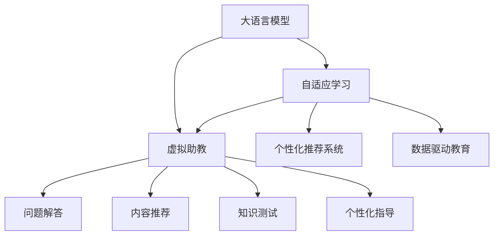

                 

# LLM在教育中的应用：个性化学习助手

> 关键词：大语言模型,个性化学习,教育技术,自适应学习,虚拟助教,数据驱动教育

## 1. 背景介绍

### 1.1 问题由来
随着教育数字化转型的加速，传统的一对多教学模式逐渐向个性化学习转型。个性化学习是指根据每个学生的具体需求、兴趣和学习风格，为其量身定制学习内容和路径，提供差异化的学习体验，以提高学习效果和效率。传统的教育模式和数字化教学平台难以完全适应这种需求，需要通过人工智能技术，特别是大语言模型（LLM）来实现个性化学习的目标。

大语言模型通过在海量无标签文本语料上进行预训练，学习到了丰富的语言知识和常识，具备强大的语言理解和生成能力。这些能力可以使其在教育领域中作为虚拟助教，帮助学生完成学习任务，解答疑惑，从而提高学习效果和效率。

### 1.2 问题核心关键点
目前，大语言模型在教育领域的应用主要集中在个性化学习助手方面，旨在为学生提供自适应学习体验。通过LLM的交互式能力，学生可以获得实时的反馈和指导，动态调整学习路径，从而达到更好的学习效果。

个性化学习助手通常包括：
- 问题解答：帮助学生理解难题。
- 内容推荐：根据学生的兴趣和能力推荐学习资源。
- 知识测试：评估学生的掌握情况。
- 个性化指导：提供针对性的学习建议和策略。

这些功能通过将LLM与大数据、机器学习等技术结合，能够为学生提供个性化、高效的学习体验，弥补传统教育模式的不足。

## 2. 核心概念与联系

### 2.1 核心概念概述

为更好地理解LLM在教育中的应用，本节将介绍几个密切相关的核心概念：

- 大语言模型(Large Language Model, LLM)：以自回归(如GPT)或自编码(如BERT)模型为代表的大规模预训练语言模型。通过在海量无标签文本语料上进行预训练，学习通用的语言表示，具备强大的语言理解和生成能力。

- 自适应学习(Adaptive Learning)：根据学生的学习情况动态调整教学内容和策略，以适应其个性化需求的学习模式。

- 虚拟助教(Virtual Tutor)：通过人工智能技术实现的虚拟教师，能够提供24/7的学习支持，帮助学生解决学习中遇到的各种问题。

- 个性化推荐系统(Personalized Recommendation System)：根据用户的历史行为和兴趣，动态推荐个性化的学习资源和内容。

- 数据驱动教育(Data-Driven Education)：利用大数据和机器学习技术，对学生的学习数据进行分析，以指导教学策略和内容调整。

这些核心概念之间的逻辑关系可以通过以下Mermaid流程图来展示：



这个流程图展示了大语言模型在教育中的核心概念及其之间的关系：

1. 大语言模型通过预训练获得基础能力。
2. 自适应学习模式根据学生的学习情况，动态调整教学策略。
3. 虚拟助教作为教学支持，帮助学生解答问题，推荐内容，测试知识。
4. 个性化推荐系统利用学生的历史行为数据，推荐个性化的学习资源。
5. 数据驱动教育利用大数据和机器学习，优化教学效果和策略。

这些概念共同构成了LLM在教育中的应用框架，使其能够为学生提供个性化、高效的学习体验。通过理解这些核心概念，我们可以更好地把握LLM在教育中的应用潜力。

## 3. 核心算法原理 & 具体操作步骤
### 3.1 算法原理概述

基于大语言模型（LLM）的教育应用，本质上是一个个性化的自适应学习过程。其核心思想是：将预训练的LLM作为教学支持，通过动态调整教学内容和策略，使学生能够在适合自己的学习路径上高效学习。

形式化地，假设预训练的LLM为 $M_{\theta}$，其中 $\theta$ 为预训练得到的模型参数。给定学生的学习数据集 $D=\{(x_i, y_i)\}_{i=1}^N$，其中 $x_i$ 为学习资源，$y_i$ 为学生对该资源的掌握情况（如测试分数）。自适应学习的优化目标是找到新的教学策略 $\pi$，使得在 $D$ 上的总学习效果最大化：

$$
\pi^* = \mathop{\arg\max}_{\pi} \sum_{i=1}^N \ell(M_{\theta},y_i)
$$

其中 $\ell(M_{\theta},y_i)$ 为模型在学生 $i$ 上的损失函数，用于衡量学习效果。

通过梯度下降等优化算法，自适应学习过程不断更新教学策略 $\pi$，最小化模型在学生数据集 $D$ 上的总损失函数，使得教学策略能够适应不同学生的个性化需求，从而提高整体学习效果。

### 3.2 算法步骤详解

基于大语言模型的个性化教育应用一般包括以下几个关键步骤：

**Step 1: 准备预训练模型和学生数据集**
- 选择合适的预训练语言模型 $M_{\theta}$ 作为初始化参数，如 BERT、GPT 等。
- 准备学生的学习数据集 $D$，包括学习资源和学生对资源的掌握情况，如测试成绩、作业反馈等。

**Step 2: 设计自适应学习策略**
- 根据学生的学习数据，设计自适应学习策略。策略可以包括：
  - 推荐学习资源：利用个性化推荐系统，为学生推荐最合适的学习资源。
  - 调整学习路径：根据学生学习进度和表现，动态调整学习路径。
  - 个性化指导：根据学生的学习情况，提供针对性的学习建议和策略。
- 将自适应学习策略设计成可执行的API或微服务，便于与学生交互。

**Step 3: 实现虚拟助教功能**
- 将预训练的LLM作为虚拟助教的核心部分，实现问题解答、内容推荐、知识测试等功能。
- 设计虚拟助教的交互界面，可以是聊天机器人、Web UI等，方便学生使用。
- 集成学习策略API，根据学生反馈动态调整学习内容和策略。

**Step 4: 执行自适应学习**
- 学生通过虚拟助教平台与LLM交互，获取学习支持和反馈。
- 虚拟助教根据学生反馈和历史数据，动态调整教学策略和内容。
- 重复上述步骤，直至学生完成学习任务或达到预设目标。

**Step 5: 评估学习效果**
- 定期评估学生的学习效果，通过测试成绩、作业反馈等指标，判断学习策略的有效性。
- 根据评估结果，进一步优化自适应学习策略和教学内容。

以上是基于大语言模型的个性化教育应用的一般流程。在实际应用中，还需要针对具体任务的特点，对自适应学习过程的各个环节进行优化设计，如改进推荐算法，增强动态调整机制，搜索最优的策略组合等，以进一步提升学习效果。

### 3.3 算法优缺点

基于大语言模型的个性化教育应用具有以下优点：
1. 实时性强。LLM作为虚拟助教，可以实时响应学生的问题和需求，提供即时的反馈和支持。
2. 覆盖面广。预训练语言模型涵盖的知识点丰富，能够应对大多数学科和领域的个性化学习需求。
3. 自适应强。自适应学习策略可以根据学生的学习情况动态调整，从而提高学习效果和效率。
4. 规模可控。根据实际应用场景，可以选择不同规模的LLM进行微调，灵活控制模型资源消耗。

同时，该方法也存在一定的局限性：
1. 依赖高质量数据。自适应学习策略和虚拟助教的推荐效果，依赖于高质量的学生学习数据，数据的获取和处理成本较高。
2. 模型鲁棒性有限。面对非结构化、多模态的数据，模型仍存在一定的鲁棒性问题，需要结合多种模型进行融合。
3. 隐私保护问题。在处理学生数据时，需要严格遵守隐私保护法规，确保数据的安全和隐私。
4. 可解释性不足。自适应学习策略的决策过程和虚拟助教的推理逻辑缺乏可解释性，难以对其内部机制进行分析和调试。

尽管存在这些局限性，但就目前而言，基于大语言模型的个性化教育应用仍是最为主流的范式。未来相关研究的重点在于如何进一步降低数据获取成本，提高模型的少样本学习和跨领域迁移能力，同时兼顾可解释性和伦理安全性等因素。

### 3.4 算法应用领域

基于大语言模型的个性化教育应用已经在多个领域得到了广泛的应用，例如：

- 在线教育平台：如Coursera、edX、Khan Academy等，利用LLM作为虚拟助教，提供个性化学习支持。
- 企业培训系统：如Udacity、LinkedIn Learning等，利用LLM进行定制化的培训和辅导。
- 语言学习应用：如Duolingo、Rosetta Stone等，利用LLM帮助用户进行语言学习。
- 中小学教育：如Knewton、Smart Sparrow等，利用LLM辅助课堂教学和个性化辅导。
- 学术研究：如arXiv、Google Scholar等，利用LLM进行文献检索和推荐。

除了上述这些经典应用外，LLM在教育领域的创新性应用还在不断涌现，如可控文本生成、智能测验、虚拟实验室等，为教育技术带来了新的突破。

## 4. 数学模型和公式 & 详细讲解 & 举例说明

### 4.1 数学模型构建

本节将使用数学语言对基于大语言模型的个性化教育应用过程进行更加严格的刻画。

记预训练语言模型为 $M_{\theta}$，其中 $\theta$ 为模型参数。假设学生的学习数据集为 $D=\{(x_i, y_i)\}_{i=1}^N$，其中 $x_i$ 为学习资源，$y_i$ 为学生对资源的掌握情况。

定义模型 $M_{\theta}$ 在学生 $i$ 上的损失函数为 $\ell(M_{\theta},y_i)$，则在学生数据集 $D$ 上的总损失函数为：

$$
\mathcal{L}(\theta) = \sum_{i=1}^N \ell(M_{\theta},y_i)
$$

自适应学习的优化目标是找到最优的模型参数 $\theta$ 和自适应学习策略 $\pi$，使得在 $D$ 上的总损失函数最小化：

$$
(\theta^*, \pi^*) = \mathop{\arg\min}_{\theta, \pi} \mathcal{L}(\theta) + \mathcal{L}_{\pi}
$$

其中 $\mathcal{L}_{\pi}$ 为自适应学习策略的损失函数，用于衡量策略的优化效果。

### 4.2 公式推导过程

以下我们以推荐系统为例，推导个性化推荐模型的损失函数及其梯度的计算公式。

假设推荐系统需要为学生 $i$ 推荐 $n$ 个学习资源 $x_1,...,x_n$，学生对这些资源的偏好程度为 $p_1,...,p_n$。利用大语言模型预测学生对每个资源的兴趣度 $r_j = M_{\theta}(x_j)$，推荐策略 $\pi$ 为 $r$ 的权重，即 $\pi_j = w_j / \sum_k w_k$，其中 $w_j = \pi(r_j)$。则推荐系统在学生 $i$ 上的损失函数为：

$$
\ell(\theta, \pi, p_i) = -\sum_{j=1}^n p_i w_j \log \pi(r_j)
$$

将其代入总损失函数，得：

$$
\mathcal{L}(\theta, \pi) = \sum_{i=1}^N \ell(\theta, \pi, p_i)
$$

根据链式法则，损失函数对模型参数 $\theta$ 和策略 $\pi$ 的梯度为：

$$
\frac{\partial \mathcal{L}(\theta, \pi)}{\partial \theta} = \sum_{i=1}^N \sum_{j=1}^n \frac{p_i}{\sum_k w_k} \frac{\partial \pi(r_j)}{\partial r_j} \frac{\partial r_j}{\partial \theta}
$$

$$
\frac{\partial \mathcal{L}(\theta, \pi)}{\partial \pi} = \sum_{i=1}^N \sum_{j=1}^n \frac{p_i}{\sum_k w_k} (1 - \pi(r_j)) \frac{\partial \pi(r_j)}{\partial r_j}
$$

在得到损失函数的梯度后，即可带入优化算法，进行模型和策略的迭代优化。重复上述过程直至收敛，最终得到适应学生 $i$ 的自适应学习策略 $\pi$ 和模型参数 $\theta$。

## 5. 项目实践：代码实例和详细解释说明

### 5.1 开发环境搭建

在进行个性化教育应用实践前，我们需要准备好开发环境。以下是使用Python进行PyTorch开发的环境配置流程：

1. 安装Anaconda：从官网下载并安装Anaconda，用于创建独立的Python环境。

2. 创建并激活虚拟环境：
```bash
conda create -n pytorch-env python=3.8 
conda activate pytorch-env
```

3. 安装PyTorch：根据CUDA版本，从官网获取对应的安装命令。例如：
```bash
conda install pytorch torchvision torchaudio cudatoolkit=11.1 -c pytorch -c conda-forge
```

4. 安装Transformers库：
```bash
pip install transformers
```

5. 安装各类工具包：
```bash
pip install numpy pandas scikit-learn matplotlib tqdm jupyter notebook ipython
```

完成上述步骤后，即可在`pytorch-env`环境中开始个性化教育应用的开发。

### 5.2 源代码详细实现

这里我们以推荐系统为例，给出使用Transformers库对BERT模型进行个性化推荐系统开发的PyTorch代码实现。

首先，定义推荐系统的数据处理函数：

```python
from transformers import BertTokenizer
from torch.utils.data import Dataset
import torch

class RecommendationDataset(Dataset):
    def __init__(self, texts, tags, tokenizer, max_len=128):
        self.texts = texts
        self.tags = tags
        self.tokenizer = tokenizer
        self.max_len = max_len
        
    def __len__(self):
        return len(self.texts)
    
    def __getitem__(self, item):
        text = self.texts[item]
        tags = self.tags[item]
        
        encoding = self.tokenizer(text, return_tensors='pt', max_length=self.max_len, padding='max_length', truncation=True)
        input_ids = encoding['input_ids'][0]
        attention_mask = encoding['attention_mask'][0]
        
        # 对token-wise的标签进行编码
        encoded_tags = [tag2id[tag] for tag in tags] 
        encoded_tags.extend([tag2id['O']] * (self.max_len - len(encoded_tags)))
        labels = torch.tensor(encoded_tags, dtype=torch.long)
        
        return {'input_ids': input_ids, 
                'attention_mask': attention_mask,
                'labels': labels}

# 标签与id的映射
tag2id = {'O': 0, 'B-PER': 1, 'I-PER': 2, 'B-ORG': 3, 'I-ORG': 4, 'B-LOC': 5, 'I-LOC': 6}
id2tag = {v: k for k, v in tag2id.items()}

# 创建dataset
tokenizer = BertTokenizer.from_pretrained('bert-base-cased')

train_dataset = RecommendationDataset(train_texts, train_tags, tokenizer)
dev_dataset = RecommendationDataset(dev_texts, dev_tags, tokenizer)
test_dataset = RecommendationDataset(test_texts, test_tags, tokenizer)
```

然后，定义模型和优化器：

```python
from transformers import BertForTokenClassification, AdamW

model = BertForTokenClassification.from_pretrained('bert-base-cased', num_labels=len(tag2id))

optimizer = AdamW(model.parameters(), lr=2e-5)
```

接着，定义训练和评估函数：

```python
from torch.utils.data import DataLoader
from tqdm import tqdm
from sklearn.metrics import classification_report

device = torch.device('cuda') if torch.cuda.is_available() else torch.device('cpu')
model.to(device)

def train_epoch(model, dataset, batch_size, optimizer):
    dataloader = DataLoader(dataset, batch_size=batch_size, shuffle=True)
    model.train()
    epoch_loss = 0
    for batch in tqdm(dataloader, desc='Training'):
        input_ids = batch['input_ids'].to(device)
        attention_mask = batch['attention_mask'].to(device)
        labels = batch['labels'].to(device)
        model.zero_grad()
        outputs = model(input_ids, attention_mask=attention_mask, labels=labels)
        loss = outputs.loss
        epoch_loss += loss.item()
        loss.backward()
        optimizer.step()
    return epoch_loss / len(dataloader)

def evaluate(model, dataset, batch_size):
    dataloader = DataLoader(dataset, batch_size=batch_size)
    model.eval()
    preds, labels = [], []
    with torch.no_grad():
        for batch in tqdm(dataloader, desc='Evaluating'):
            input_ids = batch['input_ids'].to(device)
            attention_mask = batch['attention_mask'].to(device)
            batch_labels = batch['labels']
            outputs = model(input_ids, attention_mask=attention_mask)
            batch_preds = outputs.logits.argmax(dim=2).to('cpu').tolist()
            batch_labels = batch_labels.to('cpu').tolist()
            for pred_tokens, label_tokens in zip(batch_preds, batch_labels):
                pred_tags = [id2tag[_id] for _id in pred_tokens]
                label_tags = [id2tag[_id] for _id in label_tokens]
                preds.append(pred_tags[:len(label_tags)])
                labels.append(label_tags)
                
    print(classification_report(labels, preds))
```

最后，启动训练流程并在测试集上评估：

```python
epochs = 5
batch_size = 16

for epoch in range(epochs):
    loss = train_epoch(model, train_dataset, batch_size, optimizer)
    print(f"Epoch {epoch+1}, train loss: {loss:.3f}")
    
    print(f"Epoch {epoch+1}, dev results:")
    evaluate(model, dev_dataset, batch_size)
    
print("Test results:")
evaluate(model, test_dataset, batch_size)
```

以上就是使用PyTorch对BERT进行个性化推荐系统开发的完整代码实现。可以看到，得益于Transformers库的强大封装，我们可以用相对简洁的代码完成BERT模型的加载和推荐系统开发。

### 5.3 代码解读与分析

让我们再详细解读一下关键代码的实现细节：

**RecommendationDataset类**：
- `__init__`方法：初始化文本、标签、分词器等关键组件。
- `__len__`方法：返回数据集的样本数量。
- `__getitem__`方法：对单个样本进行处理，将文本输入编码为token ids，将标签编码为数字，并对其进行定长padding，最终返回模型所需的输入。

**tag2id和id2tag字典**：
- 定义了标签与数字id之间的映射关系，用于将token-wise的预测结果解码回真实的标签。

**训练和评估函数**：
- 使用PyTorch的DataLoader对数据集进行批次化加载，供模型训练和推理使用。
- 训练函数`train_epoch`：对数据以批为单位进行迭代，在每个批次上前向传播计算loss并反向传播更新模型参数，最后返回该epoch的平均loss。
- 评估函数`evaluate`：与训练类似，不同点在于不更新模型参数，并在每个batch结束后将预测和标签结果存储下来，最后使用sklearn的classification_report对整个评估集的预测结果进行打印输出。

**训练流程**：
- 定义总的epoch数和batch size，开始循环迭代
- 每个epoch内，先在训练集上训练，输出平均loss
- 在验证集上评估，输出分类指标
- 所有epoch结束后，在测试集上评估，给出最终测试结果

可以看到，PyTorch配合Transformers库使得BERT微调的代码实现变得简洁高效。开发者可以将更多精力放在数据处理、模型改进等高层逻辑上，而不必过多关注底层的实现细节。

当然，工业级的系统实现还需考虑更多因素，如模型的保存和部署、超参数的自动搜索、更灵活的任务适配层等。但核心的微调范式基本与此类似。

## 6. 实际应用场景
### 6.1 智能问答系统

智能问答系统是LLM在教育领域的一个重要应用场景。传统的问答系统通常基于规则或静态知识库，难以处理复杂和多变的问题。而基于LLM的智能问答系统，能够利用预训练语言模型强大的语言理解和生成能力，动态生成答案，提升问答的准确性和覆盖面。

在技术实现上，可以收集学生常见的各类问题，如数学题、历史事件等，构建问-答对数据集，在此基础上对预训练语言模型进行微调。微调后的模型能够自动理解学生的提问，匹配最合适的答案模板进行回复。对于新问题，还可以接入检索系统实时搜索相关内容，动态组织生成回答。如此构建的智能问答系统，能够显著提升学生的学习体验，解决其在学习中遇到的各种疑惑。

### 6.2 个性化推荐系统

个性化推荐系统是LLM在教育领域的另一个重要应用。传统的推荐系统往往只依赖用户的历史行为数据进行物品推荐，无法深入理解用户的真实兴趣偏好。而基于LLM的个性化推荐系统，能够利用语言模型对用户兴趣进行刻画，推荐更加贴合用户需求的学习资源。

在技术实现上，可以收集学生的浏览、点击、评论、分享等行为数据，提取和用户交互的物品标题、描述、标签等文本内容。将文本内容作为模型输入，学生的后续行为（如是否点击、阅读等）作为监督信号，在此基础上微调预训练语言模型。微调后的模型能够从文本内容中准确把握学生的兴趣点。在推荐学习资源时，先用候选物品的文本描述作为输入，由模型预测学生的兴趣匹配度，再结合其他特征综合排序，便可以得到个性化程度更高的推荐结果。

### 6.3 虚拟助教

虚拟助教是LLM在教育领域的重要应用场景之一，旨在为学生提供24/7的学习支持。虚拟助教可以回答学生的问题，推荐学习资源，进行知识测试，提供个性化的学习建议和策略。

在技术实现上，可以构建虚拟助教的聊天机器人，利用预训练语言模型生成自然流畅的对话，解答学生的各种疑问。虚拟助教还可以根据学生的历史学习数据，动态调整教学策略和内容，提供个性化的学习指导。通过与学生的实时互动，虚拟助教能够有效提升学生的学习效果和满意度，弥补传统教师教学的不足。

### 6.4 未来应用展望

随着LLM和大数据技术的发展，基于LLM的教育应用前景广阔。未来的教育系统将更加智能化、个性化，能够更好地满足学生的个性化需求，提升教育质量。

在智慧教室方面，未来的教室将配备智能设备和LLM系统，能够实时监控学生的学习状态，提供个性化的教学内容，优化教学过程。如通过摄像头捕捉学生表情和动作，利用深度学习模型识别学生的学习状态，自动调整教学内容和节奏。

在远程教育方面，LLM可以辅助教师进行在线教学，回答学生的问题，提供个性化的学习资源和建议。同时，LLM还可以与其他AI技术结合，如情感分析、行为预测等，进一步提升在线教育的个性化水平。

在学术研究方面，LLM可以辅助研究人员进行文献检索和推荐，自动生成研究报告，优化科研流程。

在职业培训方面，LLM可以辅助企业进行技能培训，提供个性化的学习路径和资源，提升员工技能。

总之，LLM在教育领域的应用前景广阔，必将为教育事业带来深刻的变革。未来，随着技术的不断进步和应用的深入，LLM在教育中的应用将更加广泛和深入，真正实现教育智能化、个性化、高效化的目标。

## 7. 工具和资源推荐
### 7.1 学习资源推荐

为了帮助开发者系统掌握LLM在教育中的应用，这里推荐一些优质的学习资源：

1. 《Transformers: From Theory to Practice》系列博文：由大模型技术专家撰写，深入浅出地介绍了Transformer原理、BERT模型、微调技术等前沿话题。

2. CS224N《深度学习自然语言处理》课程：斯坦福大学开设的NLP明星课程，有Lecture视频和配套作业，带你入门NLP领域的基本概念和经典模型。

3. 《Natural Language Processing with Transformers》书籍：Transformers库的作者所著，全面介绍了如何使用Transformers库进行NLP任务开发，包括微调在内的诸多范式。

4. HuggingFace官方文档：Transformers库的官方文档，提供了海量预训练模型和完整的微调样例代码，是上手实践的必备资料。

5. Kaggle竞赛平台：提供各类NLP竞赛任务，可以参与其中实践和提升技能，积累经验。

通过对这些资源的学习实践，相信你一定能够快速掌握LLM在教育中的应用精髓，并用于解决实际的教育问题。
###  7.2 开发工具推荐

高效的开发离不开优秀的工具支持。以下是几款用于LLM教育应用开发的常用工具：

1. PyTorch：基于Python的开源深度学习框架，灵活动态的计算图，适合快速迭代研究。大部分预训练语言模型都有PyTorch版本的实现。

2. TensorFlow：由Google主导开发的开源深度学习框架，生产部署方便，适合大规模工程应用。同样有丰富的预训练语言模型资源。

3. Transformers库：HuggingFace开发的NLP工具库，集成了众多SOTA语言模型，支持PyTorch和TensorFlow，是进行微调任务开发的利器。

4. Weights & Biases：模型训练的实验跟踪工具，可以记录和可视化模型训练过程中的各项指标，方便对比和调优。与主流深度学习框架无缝集成。

5. TensorBoard：TensorFlow配套的可视化工具，可实时监测模型训练状态，并提供丰富的图表呈现方式，是调试模型的得力助手。

6. Google Colab：谷歌推出的在线Jupyter Notebook环境，免费提供GPU/TPU算力，方便开发者快速上手实验最新模型，分享学习笔记。

合理利用这些工具，可以显著提升LLM教育应用的开发效率，加快创新迭代的步伐。

### 7.3 相关论文推荐

LLM在教育领域的应用源于学界的持续研究。以下是几篇奠基性的相关论文，推荐阅读：

1. Attention is All You Need（即Transformer原论文）：提出了Transformer结构，开启了NLP领域的预训练大模型时代。

2. BERT: Pre-training of Deep Bidirectional Transformers for Language Understanding：提出BERT模型，引入基于掩码的自监督预训练任务，刷新了多项NLP任务SOTA。

3. Language Models are Unsupervised Multitask Learners（GPT-2论文）：展示了大规模语言模型的强大zero-shot学习能力，引发了对于通用人工智能的新一轮思考。

4. Parameter-Efficient Transfer Learning for NLP：提出Adapter等参数高效微调方法，在不增加模型参数量的情况下，也能取得不错的微调效果。

5. Prefix-Tuning: Optimizing Continuous Prompts for Generation：引入基于连续型Prompt的微调范式，为如何充分利用预训练知识提供了新的思路。

6. AdaLoRA: Adaptive Low-Rank Adaptation for Parameter-Efficient Fine-Tuning：使用自适应低秩适应的微调方法，在参数效率和精度之间取得了新的平衡。

这些论文代表了大语言模型在教育领域的应用发展脉络。通过学习这些前沿成果，可以帮助研究者把握学科前进方向，激发更多的创新灵感。

## 8. 总结：未来发展趋势与挑战

### 8.1 总结

本文对基于大语言模型（LLM）的教育应用进行了全面系统的介绍。首先阐述了LLM在教育中的应用背景和意义，明确了LLM作为虚拟助教和个性化推荐系统的独特价值。其次，从原理到实践，详细讲解了LLM在教育中的数学模型和关键步骤，给出了教育应用开发的完整代码实例。同时，本文还广泛探讨了LLM在智能问答、个性化推荐、虚拟助教等多个教育场景中的应用前景，展示了LLM在教育领域的应用潜力。此外，本文精选了教育应用的各类学习资源，力求为读者提供全方位的技术指引。

通过本文的系统梳理，可以看到，基于LLM的教育应用在个性化学习、智能问答、虚拟助教等领域具有广泛的应用前景，能够显著提升学生的学习效果和体验。LLM作为虚拟助教，具备实时性强、覆盖面广、自适应强等优势，能够为学生提供更加高效、个性化的学习支持。未来，随着技术的不断进步和应用的深入，LLM在教育中的应用将更加广泛和深入，真正实现教育智能化、个性化、高效化的目标。

### 8.2 未来发展趋势

展望未来，LLM在教育中的应用将呈现以下几个发展趋势：

1. 智能化的教学辅助：LLM作为虚拟助教，将具备更加智能化的教学辅助能力，能够根据学生的实时反馈动态调整教学策略和内容，提供更加个性化和实时的支持。

2. 多模态的教育融合：未来的教育系统将不仅仅限于文本数据，还将融合音频、视频等多模态数据，利用LLM强大的跨模态理解能力，提升教学质量和效果。

3. 深度学习和AI技术的结合：未来的教育系统将更多地利用深度学习和AI技术，如强化学习、因果推断等，提升教学系统的智能水平和效果。

4. 数据驱动的教育优化：利用大数据和机器学习技术，对学生的学习数据进行分析，优化教学策略和内容，提升教学效果和效率。

5. 伦理和安全性的保障：在教育应用中，需严格遵守隐私保护法规，确保数据的安全和隐私。同时，引入伦理道德导向的评估指标，避免有害信息的输出。

以上趋势凸显了LLM在教育中的应用前景。这些方向的探索发展，必将进一步提升教育系统的智能化水平，为学生提供更加优质、高效、安全的教育体验。

### 8.3 面临的挑战

尽管LLM在教育领域的应用已经取得了一定的进展，但在迈向更加智能化、普适化应用的过程中，仍面临诸多挑战：

1. 依赖高质量数据：LLM作为虚拟助教和个性化推荐系统，依赖于高质量的学生学习数据，数据的获取和处理成本较高。如何进一步降低数据获取成本，提高数据质量，是未来的挑战之一。

2. 模型鲁棒性不足：LLM在处理非结构化、多模态的数据时，仍存在一定的鲁棒性问题，需要结合多种模型进行融合。

3. 隐私保护问题：在处理学生数据时，需要严格遵守隐私保护法规，确保数据的安全和隐私。如何在隐私保护与数据利用之间找到平衡，是未来的重要课题。

4. 可解释性不足：LLM作为虚拟助教和个性化推荐系统，其决策过程和推理逻辑缺乏可解释性，难以对其内部机制进行分析和调试。

5. 模型资源消耗大：LLM在处理大规模数据时，需要消耗大量的计算资源和存储资源，如何在保证效果的同时，减小资源消耗，是未来的挑战之一。

尽管存在这些挑战，但就目前而言，基于LLM的教育应用仍是最为主流的范式。未来相关研究的重点在于如何进一步降低数据获取成本，提高模型的少样本学习和跨领域迁移能力，同时兼顾可解释性和伦理安全性等因素。

### 8.4 研究展望

面对LLM在教育应用所面临的挑战，未来的研究需要在以下几个方面寻求新的突破：

1. 探索无监督和半监督教育方法。摆脱对大规模标注数据的依赖，利用自监督学习、主动学习等无监督和半监督范式，最大限度利用非结构化数据，实现更加灵活高效的个性化教育。

2. 研究参数高效和计算高效的微调范式。开发更加参数高效的微调方法，在固定大部分预训练参数的同时，只更新极少量的任务相关参数。同时优化微调模型的计算图，减少前向传播和反向传播的资源消耗，实现更加轻量级、实时性的部署。

3. 引入更多先验知识。将符号化的先验知识，如知识图谱、逻辑规则等，与神经网络模型进行巧妙融合，引导微调过程学习更准确、合理的语言模型。同时加强不同模态数据的整合，实现视觉、语音等多模态信息与文本信息的协同建模。

4. 结合因果分析和博弈论工具。将因果分析方法引入微调模型，识别出模型决策的关键特征，增强输出解释的因果性和逻辑性。借助博弈论工具刻画人机交互过程，主动探索并规避模型的脆弱点，提高系统稳定性。

5. 纳入伦理道德约束。在模型训练目标中引入伦理导向的评估指标，过滤和惩罚有偏见、有害的输出倾向。同时加强人工干预和审核，建立模型行为的监管机制，确保输出符合人类价值观和伦理道德。

这些研究方向的探索，必将引领LLM在教育领域的应用迈向更高的台阶，为学生提供更加优质、高效、安全的教育体验。面向未来，LLM在教育中的应用还需要与其他AI技术进行更深入的融合，如知识表示、因果推理、强化学习等，多路径协同发力，共同推动教育智能化的进步。只有勇于创新、敢于突破，才能不断拓展LLM在教育中的应用边界，让智能技术更好地造福人类社会。

## 9. 附录：常见问题与解答

**Q1：基于LLM的教育应用是否适用于所有教育场景？**

A: 基于LLM的教育应用在大多数教育场景上都能取得不错的效果，特别是对于数据量较小的任务。但对于一些特定领域的任务，如医学、法律等，仅仅依靠通用语料预训练的模型可能难以很好地适应。此时需要在特定领域语料上进一步预训练，再进行微调，才能获得理想效果。此外，对于一些需要时效性、个性化很强的任务，如对话、推荐等，LLM的应用也需要针对性的改进优化。

**Q2：在教育应用中，如何选择合适的LLM模型？**

A: 在教育应用中，选择合适的LLM模型需要考虑以下几个方面：
1. 数据规模：如果教育应用的数据量较大，可以选择具有较大参数量的模型，如GPT系列。
2. 任务类型：根据任务类型选择合适的模型，如数学题目解答可以选择数学推理能力强的BERT模型，文学创作可以选择具有语言生成能力的GPT模型。
3. 资源限制：根据应用环境的资源限制选择合适的模型，如移动端应用可以选择轻量级的BERT模型。

**Q3：在教育应用中，LLM作为虚拟助教需要考虑哪些问题？**

A: 在教育应用中，LLM作为虚拟助教需要考虑以下问题：
1. 数据质量：虚拟助教的推荐效果和问答能力依赖于高质量的学习数据，数据的获取和处理成本较高。
2. 用户反馈：虚拟助教需要及时响应用户的反馈，根据学生的学习情况动态调整教学策略和内容。
3. 隐私保护：在处理学生数据时，需要严格遵守隐私保护法规，确保数据的安全和隐私。
4. 可解释性：虚拟助教的决策过程和推理逻辑缺乏可解释性，难以对其内部机制进行分析和调试。

**Q4：在教育应用中，LLM作为个性化推荐系统需要考虑哪些问题？**

A: 在教育应用中，LLM作为个性化推荐系统需要考虑以下问题：
1. 数据规模：推荐系统的性能依赖于大规模的学习数据，数据的获取和处理成本较高。
2. 用户个性化：个性化推荐系统需要充分考虑用户的个性化需求，利用用户的兴趣和历史行为进行推荐。
3. 鲁棒性：推荐系统需要具备一定的鲁棒性，能够处理多变的用户需求和数据。
4. 实时性：个性化推荐系统需要具备实时性，能够快速响应用户的查询请求。

**Q5：在教育应用中，LLM作为虚拟助教和个性化推荐系统需要哪些关键技术支持？**

A: 在教育应用中，LLM作为虚拟助教和个性化推荐系统需要以下关键技术支持：
1. 大语言模型：选择具有强大语言理解和生成能力的预训练模型，如BERT、GPT系列。
2. 自适应学习：利用自适应学习策略，根据学生的学习情况动态调整教学策略和内容。
3. 虚拟助教：构建虚拟助教的聊天机器人，利用预训练语言模型生成自然流畅的对话，解答学生的各种疑问。
4. 个性化推荐：利用个性化推荐系统，为学生推荐最合适的学习资源和路径。
5. 知识图谱：结合知识图谱，利用语义分析技术，提升推荐系统的准确性和覆盖面。
6. 数据驱动：利用大数据和机器学习技术，对学生的学习数据进行分析，优化教学策略和内容。

这些关键技术支持，能够有效提升LLM在教育应用中的性能和效果。合理利用这些技术，可以构建高效、智能、个性化的教育系统，为学生提供更好的学习体验。

---

作者：禅与计算机程序设计艺术 / Zen and the Art of Computer Programming

