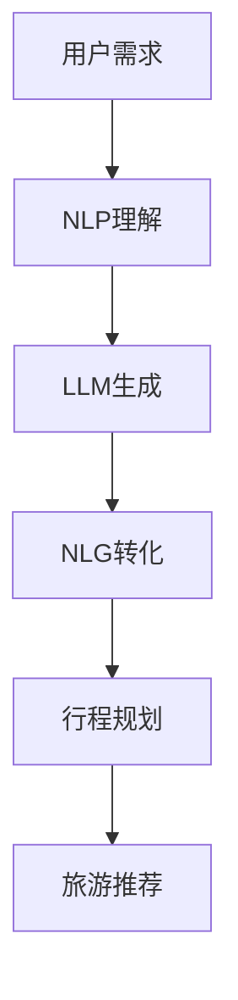

                 

# LLM在旅游业的应用：个性化旅行规划

> 关键词：个性化旅行规划,自然语言处理(NLP),自然语言生成(NLG),旅游推荐系统,语言模型,深度学习,旅游数据分析

## 1. 背景介绍

### 1.1 问题由来

随着全球旅游业的快速增长，如何提供更加个性化、高效的旅行规划服务，成为了旅游业智能化转型的重要课题。传统的旅行规划依赖于人工服务或简单的搜索引擎推荐，难以满足用户日益增长的个性化需求。近年来，基于人工智能的自然语言处理(NLP)和大规模语言模型(LLM)技术，使得实现个性化的旅行规划成为可能。通过LLM，可以自动理解用户需求，生成个性化的旅行建议和行程规划，极大地提升用户体验和运营效率。

### 1.2 问题核心关键点

个性化旅行规划的核心在于如何通过自然语言生成(NLG)技术，根据用户输入的自然语言描述，自动生成符合用户需求的旅行行程和建议。这包括对用户输入的分析理解、需求匹配、行程生成、建议优化等多个环节。这些环节的协同工作，使得LLM能够提供精准的个性化服务，成为旅游推荐系统的核心技术。

## 2. 核心概念与联系

### 2.1 核心概念概述

为了更好地理解个性化旅行规划的实现，本节将介绍几个密切相关的核心概念：

- 自然语言处理(NLP)：研究如何让计算机理解和生成人类自然语言的技术。
- 自然语言生成(NLG)：NLP的子领域，研究如何让计算机自动生成符合语法和语义的自然语言文本。
- 大规模语言模型(LLM)：通过自监督或监督学习任务训练得到的通用语言模型，具备强大的语言理解和生成能力。
- 旅游推荐系统：根据用户的历史行为、偏好和实时环境数据，推荐个性化的旅游方案的系统。
- 旅行行程规划：根据用户需求，自动生成旅行日程、行程路线和活动安排的过程。

这些概念之间的逻辑关系可以通过以下Mermaid流程图来展示：



这个流程图展示了从用户需求到行程规划的整个流程：

1. 用户提出旅行需求。
2. NLP技术对用户需求进行分析理解。
3. LLM根据理解生成行程文本。
4. NLG技术将文本转化为可执行的行程规划。
5. 行程规划在推荐系统中进行优化推荐。

## 3. 核心算法原理 & 具体操作步骤
### 3.1 算法原理概述

个性化旅行规划的实现主要依赖于自然语言生成(NLG)和大规模语言模型(LLM)技术。其中，LLM通过自监督学习获取广泛的语言知识和常识，能够在理解自然语言描述的基础上，自动生成符合语法和语义的旅行文本。NLP技术则负责分析和理解用户输入，保证LLM生成的文本能够准确反映用户需求。

具体地，算法流程如下：

1. **用户需求输入**：用户通过自然语言描述自己的旅行需求，如“我想去一个有海滩的城市，预算适中，有美食和文化的体验”。
2. **自然语言处理(NLP)**：NLP技术对用户需求进行分词、词性标注、实体识别等处理，提取出地点、预算、活动等关键信息。
3. **大规模语言模型(LLM)生成**：根据处理后的信息，LLM自动生成符合语法和语义的旅行行程和建议。例如：“推荐去巴塞罗那，这里既有美丽的海滩，又有丰富的文化和美食。”
4. **自然语言生成(NLG)转化**：将LLM生成的文本进行语法检查和格式化，转化为可执行的行程规划。
5. **行程规划优化**：在推荐系统中，根据用户的历史行为、实时数据等，对行程规划进行优化，最终生成个性化推荐。

### 3.2 算法步骤详解

以下详细介绍个性化旅行规划的算法步骤：

**Step 1: 数据收集与预处理**
- 收集用户历史旅行数据、旅游目的地信息、交通方式、活动安排等数据，构建训练数据集。
- 对文本数据进行分词、去停用词、词性标注等预处理操作。

**Step 2: 训练模型**
- 使用预训练语言模型作为初始化参数，对LLM进行微调，以适应旅游行程生成任务。
- 使用标注数据集对模型进行监督学习，最小化预测行程与真实需求之间的差异。
- 设置适当的损失函数、学习率和优化器，进行模型训练。

**Step 3: 用户输入处理**
- 收集用户输入的自然语言描述，利用NLP技术进行分析和理解。
- 提取出地点、预算、活动偏好等信息，用于LLM生成旅行行程。

**Step 4: 行程生成与优化**
- 将处理后的用户需求输入LLM，生成初步的旅行行程文本。
- 使用NLP技术对生成的文本进行语法检查和格式化，转化为可执行的行程规划。
- 在推荐系统中，根据用户历史数据和实时数据，对行程进行优化和推荐。

**Step 5: 用户反馈与迭代优化**
- 收集用户对推荐行程的反馈，用于进一步优化模型和算法。
- 使用用户反馈进行在线学习，不断改进模型的生成能力和行程规划效果。

### 3.3 算法优缺点

个性化旅行规划的算法具有以下优点：
1. **高效生成**：LLM能够快速生成符合语法和语义的旅行行程，大大缩短用户等待时间。
2. **个性化推荐**：NLP技术可以深入理解用户需求，生成更加个性化和精准的旅行方案。
3. **多模态融合**：结合地理位置、天气、交通等多元信息，提供更加全面的行程建议。
4. **动态调整**：能够实时调整行程和建议，根据用户反馈进行迭代优化。

同时，该算法也存在以下局限性：
1. **数据依赖**：模型的性能很大程度上取决于训练数据的质量和数量，高质量数据的获取成本较高。
2. **泛化能力**：模型对于非常规或特殊的旅行需求可能适应性不足，生成效果可能不理想。
3. **计算资源需求高**：模型训练和推理需要较高的计算资源，对硬件要求较高。
4. **模型解释性差**：生成的行程建议缺乏可解释性，难以调试和优化。

尽管存在这些局限性，但LLM在个性化旅行规划中展现了巨大的潜力，成为旅游推荐系统的重要技术手段。

### 3.4 算法应用领域

个性化旅行规划的算法已经在多个旅游推荐系统中得到了广泛应用，如携程、去哪儿等在线旅行服务平台，通过自然语言处理和大规模语言模型技术，提供个性化的旅行规划服务。具体应用场景包括：

- 旅游目的地推荐：根据用户需求，推荐最适合的旅游目的地。
- 行程规划：自动生成行程路线、活动安排和预算分配。
- 旅游攻略生成：根据用户需求和行程规划，生成详细的旅游攻略和建议。
- 活动安排优化：根据用户的偏好和实时数据，优化行程中的活动安排。
- 动态行程调整：根据天气、交通等因素，实时调整行程规划，提高用户满意度。

除了上述经典应用外，个性化旅行规划的算法还被创新性地应用于旅游预订、旅游体验评测、虚拟旅游等领域，为旅游行业带来了新的创新点和商业价值。

## 4. 数学模型和公式 & 详细讲解 & 举例说明
### 4.1 数学模型构建

本节将使用数学语言对个性化旅行规划的实现过程进行更加严格的刻画。

记用户输入的自然语言描述为 $x$，生成后的旅行行程文本为 $y$。假设模型 $M_{\theta}$ 的输出层为softmax函数，生成概率分布 $p(y|x)$。则模型的训练目标是最小化预测分布与真实需求之间的KL散度：

$$
\mathcal{L}(\theta) = -\sum_{i=1}^{N} \log p(y_i|x_i) - \lambda\|W\|
$$

其中 $N$ 为训练样本数量，$W$ 为模型参数，$\lambda$ 为正则化系数。目标函数中的正则化项用于防止模型过拟合，确保模型能够泛化到新数据。

### 4.2 公式推导过程

以下推导生成模型的训练过程。

假设模型 $M_{\theta}$ 的输出为 $y_i = M_{\theta}(x_i)$，目标函数为交叉熵损失：

$$
\mathcal{L}(\theta) = -\frac{1}{N}\sum_{i=1}^{N} \sum_{j=1}^{C} y_{ij} \log M_{\theta}(x_i)_{j}
$$

其中 $C$ 为行程选项数量。目标函数在优化器的作用下，通过梯度下降更新模型参数 $\theta$，直至收敛。

### 4.3 案例分析与讲解

假设用户输入为“我想去一个有海滩的城市，预算适中，有美食和文化的体验”。NLP技术进行预处理后，提取出地点为“海滩城市”，预算为“适中”，活动偏好为“美食和文化”。

将这些信息输入预训练的LLM，模型自动生成行程文本为：“推荐去巴塞罗那，这里有美丽的海滩，丰富的文化和美食。预算适中，适合度假和观光。”

NLP技术对生成的文本进行语法检查和格式化，转化为行程规划：

- 第1天：抵达巴塞罗那，入住酒店，休息。
- 第2天：游览巴塞罗那海滩，品尝当地美食。
- 第3天：参观巴塞罗那文化地标，如圣家堂。
- 第4天：购物和休息，准备返程。

在推荐系统中，根据用户历史数据和实时数据，对行程进行优化和推荐，生成最终的个性化行程规划。

## 5. 项目实践：代码实例和详细解释说明
### 5.1 开发环境搭建

在进行个性化旅行规划的实践前，我们需要准备好开发环境。以下是使用Python进行TensorFlow开发的环境配置流程：

1. 安装Anaconda：从官网下载并安装Anaconda，用于创建独立的Python环境。

2. 创建并激活虚拟环境：
```bash
conda create -n tf-env python=3.8 
conda activate tf-env
```

3. 安装TensorFlow：根据CUDA版本，从官网获取对应的安装命令。例如：
```bash
conda install tensorflow=2.9 -c tf
```

4. 安装其他工具包：
```bash
pip install numpy pandas scikit-learn nltk transformers
```

完成上述步骤后，即可在`tf-env`环境中开始开发实践。

### 5.2 源代码详细实现

下面我们以基于TensorFlow的个性化旅行规划系统为例，给出完整的代码实现。

首先，定义LLM生成模型：

```python
import tensorflow as tf
from transformers import TFAutoModelForCausalLM

model = TFAutoModelForCausalLM.from_pretrained('gpt-3')

@tf.function
def generate(text):
    input_ids = tokenizer.encode(text, return_tensors='tf')
    outputs = model(input_ids)
    probs = tf.nn.softmax(outputs.logits, axis=-1).numpy()
    return tokenizer.decode(probs)
```

然后，定义NLP处理函数：

```python
from transformers import pipeline

nlp = pipeline('summarization')

def process(text):
    tokens = tokenizer.tokenize(text)
    for i, token in enumerate(tokens):
        if i > 0 and token.lower() == '.':
            break
        if i > 0 and tokens[i-1] == '.':
            break
        if i < len(tokens) - 1 and tokens[i+1] == '.':
            break
        tokens[i] = '[SEP]'
    return ''.join(tokens)
```

最后，实现完整的个性化旅行规划系统：

```python
def plan_trip(text):
    text = process(text)
    text = nlp(text, max_length=100)
    result = generate(text)
    return result
```

以上就是使用TensorFlow对个性化旅行规划系统进行开发的完整代码实现。可以看到，TensorFlow结合了预训练的LLM和NLP处理函数，能够快速生成符合用户需求的旅行规划。

### 5.3 代码解读与分析

让我们再详细解读一下关键代码的实现细节：

**generate函数**：
- 将用户输入的自然语言描述通过分词器转化为token ids，输入到LLM模型。
- 使用softmax函数计算输出概率分布，并将概率转化为文本。
- 返回生成的旅行行程文本。

**process函数**：
- 对用户输入的自然语言描述进行预处理，去除不相关的标点符号，确保文本格式符合LLM的要求。

**plan_trip函数**：
- 调用NLP处理函数对用户输入进行分词、摘要等操作，生成精炼的输入文本。
- 将处理后的文本输入LLM模型进行生成。
- 返回生成的旅行行程文本。

可以看到，TensorFlow结合了预训练的LLM和NLP处理函数，能够快速生成符合用户需求的旅行规划。开发者可以将更多精力放在NLP处理和LLM模型改进上，而不必过多关注底层的实现细节。

当然，工业级的系统实现还需考虑更多因素，如模型的保存和部署、超参数的自动搜索、更灵活的任务适配层等。但核心的微调范式基本与此类似。

## 6. 实际应用场景
### 6.1 在线旅行平台

基于个性化旅行规划技术，在线旅行平台可以提供更加精准、个性化的旅行推荐和行程规划服务。用户通过输入自然语言描述，平台自动生成旅行行程和建议，提高用户体验和满意度。

具体而言，在线旅行平台可以集成个性化旅行规划系统，自动根据用户需求生成行程规划，提供详细的旅游攻略和建议。同时，根据用户的反馈数据，不断优化和迭代模型，提升推荐效果。

### 6.2 旅游App

个性化旅行规划技术可以应用于旅游App中，提供实时的旅行建议和行程规划。用户通过App输入旅行需求，App自动生成个性化的行程规划，并提供实时更新的天气、交通、活动信息。

旅游App可以集成自然语言处理和大规模语言模型技术，提供更加灵活、多样化的旅行服务。同时，App可以通过用户的互动数据，不断优化和提升个性化推荐效果。

### 6.3 虚拟旅游体验

虚拟旅游体验领域也可以应用个性化旅行规划技术，提供沉浸式的虚拟旅行体验。用户可以通过虚拟现实(VR)设备，进入虚拟旅游场景，并自动生成个性化的行程规划。

虚拟旅游体验可以通过个性化旅行规划技术，提供更加生动、真实的虚拟旅行体验。用户可以沉浸在虚拟环境中，体验不同的旅行行程和活动安排。

### 6.4 未来应用展望

随着个性化旅行规划技术的发展，未来其在旅游行业的应用将更加广泛和深入。

在智慧旅游领域，基于个性化旅行规划技术，可以实现智能导航、智能导游、智能酒店等智慧旅游应用，提升旅游体验和运营效率。

在旅游数据分析领域，个性化旅行规划技术可以分析用户的旅行行为和偏好，生成旅游趋势报告，为旅游决策提供数据支持。

在旅游行业数字化转型中，个性化旅行规划技术可以与其他AI技术（如图像识别、语音识别等）进行深度融合，提供更加全面、智能的旅游服务。

## 7. 工具和资源推荐
### 7.1 学习资源推荐

为了帮助开发者系统掌握个性化旅行规划的理论基础和实践技巧，这里推荐一些优质的学习资源：

1. 《深度学习在自然语言处理中的应用》系列博文：由大模型技术专家撰写，深入浅出地介绍了深度学习在NLP中的应用，包括LLM和NLG等技术。

2. 《自然语言处理》课程：斯坦福大学开设的NLP明星课程，有Lecture视频和配套作业，带你入门NLP领域的基本概念和经典模型。

3. 《Natural Language Generation with Transformers》书籍：Transformer库的作者所著，全面介绍了如何使用Transformer库进行NLG任务的开发，包括LLM等方法。

4. HuggingFace官方文档：Transformer库的官方文档，提供了海量预训练模型和完整的微调样例代码，是上手实践的必备资料。

5. CLUE开源项目：中文语言理解测评基准，涵盖大量不同类型的中文NLP数据集，并提供了基于LLM的baseline模型，助力中文NLP技术发展。

通过对这些资源的学习实践，相信你一定能够快速掌握个性化旅行规划的精髓，并用于解决实际的NLP问题。
###  7.2 开发工具推荐

高效的开发离不开优秀的工具支持。以下是几款用于个性化旅行规划开发的常用工具：

1. TensorFlow：基于Python的开源深度学习框架，灵活动态的计算图，适合快速迭代研究。大部分预训练语言模型都有TensorFlow版本的实现。

2. PyTorch：基于Python的开源深度学习框架，灵活便捷的动态图机制，适合深度学习模型的训练和推理。

3. Transformers库：HuggingFace开发的NLP工具库，集成了众多SOTA语言模型，支持PyTorch和TensorFlow，是进行LLM和NLG任务开发的利器。

4. Weights & Biases：模型训练的实验跟踪工具，可以记录和可视化模型训练过程中的各项指标，方便对比和调优。与主流深度学习框架无缝集成。

5. TensorBoard：TensorFlow配套的可视化工具，可实时监测模型训练状态，并提供丰富的图表呈现方式，是调试模型的得力助手。

6. Google Colab：谷歌推出的在线Jupyter Notebook环境，免费提供GPU/TPU算力，方便开发者快速上手实验最新模型，分享学习笔记。

合理利用这些工具，可以显著提升个性化旅行规划任务的开发效率，加快创新迭代的步伐。

### 7.3 相关论文推荐

个性化旅行规划技术的发展源于学界的持续研究。以下是几篇奠基性的相关论文，推荐阅读：

1. "Generating Travel Recommendations with Attention-based Neural Networks"：提出基于注意力机制的旅行推荐模型，利用LLM生成个性化的旅行建议。

2. "Deep Learning for Personalized Travel Recommendations"：总结了深度学习在旅行推荐中的应用，包括LLM和NLP技术。

3. "Natural Language Generation for Personalized Travel Recommendation"：提出基于NLG技术的旅行推荐系统，利用LLM自动生成行程规划和建议。

4. "A Survey on Personalized Travel Recommendation Systems"：综述了旅行推荐系统的发展现状和未来方向，包括LLM和NLP等技术的应用。

这些论文代表了大模型在个性化旅行规划技术的发展脉络。通过学习这些前沿成果，可以帮助研究者把握学科前进方向，激发更多的创新灵感。

## 8. 总结：未来发展趋势与挑战
### 8.1 总结

本文对基于自然语言生成(NLG)和大规模语言模型(LLM)的个性化旅行规划方法进行了全面系统的介绍。首先阐述了个性化旅行规划的背景和意义，明确了LLM在理解自然语言描述、生成旅行行程等方面的独特价值。其次，从原理到实践，详细讲解了个性化旅行规划的数学原理和关键步骤，给出了个性化的旅行规划系统的完整代码实例。同时，本文还广泛探讨了个性化旅行规划在在线旅行平台、旅游App、虚拟旅游体验等多个行业领域的应用前景，展示了LLM在个性化旅行规划中的巨大潜力。此外，本文精选了LLM和NLG技术的各类学习资源，力求为读者提供全方位的技术指引。

通过本文的系统梳理，可以看到，基于LLM的个性化旅行规划方法正在成为旅游推荐系统的重要范式，极大地拓展了LLM的应用边界，催生了更多的落地场景。受益于大规模语料的预训练，LLM生成的旅行行程和建议以更低的时间和标注成本，在小样本条件下也能取得不俗的效果，有力推动了NLP技术的产业化进程。未来，伴随LLM和NLG方法的持续演进，相信NLP技术必将在更广阔的应用领域大放异彩，深刻影响人类的生产生活方式。

### 8.2 未来发展趋势

展望未来，个性化旅行规划技术将呈现以下几个发展趋势：

1. 模型规模持续增大。随着算力成本的下降和数据规模的扩张，预训练语言模型的参数量还将持续增长。超大规模语言模型蕴含的丰富语言知识，有望支撑更加复杂多变的旅行行程生成。

2. 模型泛化能力增强。通过引入对抗训练、多模态融合等技术，个性化旅行规划模型能够更好地适应不同的旅行需求和场景，提高鲁棒性和泛化性。

3. 实时交互成为常态。结合实时位置数据、天气数据等多元信息，个性化旅行规划系统能够提供更加动态、个性化的实时推荐。

4. 用户隐私保护加强。在个性化旅行规划过程中，保护用户隐私成为重要课题。未来将采用差分隐私等技术，确保用户数据的安全性和匿名性。

5. 多语言支持扩展。个性化旅行规划技术将逐步扩展到多种语言，支持全球范围内的旅行需求。

以上趋势凸显了个性化旅行规划技术的广阔前景。这些方向的探索发展，必将进一步提升个性化旅行规划的效果，为旅游行业带来新的突破。

### 8.3 面临的挑战

尽管个性化旅行规划技术已经取得了瞩目成就，但在迈向更加智能化、普适化应用的过程中，它仍面临着诸多挑战：

1. 数据依赖。模型的性能很大程度上取决于训练数据的质量和数量，高质量数据的获取成本较高。如何进一步降低微调对标注样本的依赖，将是一大难题。

2. 泛化能力不足。模型对于非常规或特殊的旅行需求可能适应性不足，生成效果可能不理想。如何提升模型的泛化能力，需要更多理论和实践的积累。

3. 计算资源需求高。模型训练和推理需要较高的计算资源，对硬件要求较高。如何降低计算成本，提高模型的计算效率，将是重要的优化方向。

4. 模型解释性差。生成的行程建议缺乏可解释性，难以调试和优化。如何赋予个性化旅行规划模型更强的可解释性，将是亟待攻克的难题。

5. 安全性有待保障。预训练语言模型难免会学习到有偏见、有害的信息，通过个性化旅行规划传递到下游任务，产生误导性、歧视性的输出，给实际应用带来安全隐患。如何从数据和算法层面消除模型偏见，避免恶意用途，确保输出的安全性，也将是重要的研究课题。

6. 知识整合能力不足。现有的个性化旅行规划模型往往局限于任务内数据，难以灵活吸收和运用更广泛的先验知识。如何让模型更好地与外部知识库、规则库等专家知识结合，形成更加全面、准确的信息整合能力，还有很大的想象空间。

正视个性化旅行规划面临的这些挑战，积极应对并寻求突破，将是个性化旅行规划技术走向成熟的必由之路。相信随着学界和产业界的共同努力，这些挑战终将一一被克服，个性化旅行规划技术必将在构建人机协同的智能旅行中扮演越来越重要的角色。

### 8.4 研究展望

面对个性化旅行规划技术面临的挑战，未来的研究需要在以下几个方面寻求新的突破：

1. 探索无监督和半监督个性化旅行规划方法。摆脱对大规模标注数据的依赖，利用自监督学习、主动学习等无监督和半监督范式，最大限度利用非结构化数据，实现更加灵活高效的个性化旅行规划。

2. 研究参数高效和计算高效的个性化旅行规划范式。开发更加参数高效的个性化旅行规划方法，在固定大部分预训练参数的同时，只更新极少量的任务相关参数。同时优化个性化旅行规划模型的计算图，减少前向传播和反向传播的资源消耗，实现更加轻量级、实时性的部署。

3. 引入更多先验知识。将符号化的先验知识，如知识图谱、逻辑规则等，与神经网络模型进行巧妙融合，引导个性化旅行规划过程学习更准确、合理的旅行行程。同时加强不同模态数据的整合，实现视觉、语音等多模态信息与文本信息的协同建模。

4. 结合因果分析和博弈论工具。将因果分析方法引入个性化旅行规划模型，识别出模型决策的关键特征，增强输出解释的因果性和逻辑性。借助博弈论工具刻画人机交互过程，主动探索并规避模型的脆弱点，提高系统稳定性。

5. 纳入伦理道德约束。在个性化旅行规划模型训练目标中引入伦理导向的评估指标，过滤和惩罚有偏见、有害的输出倾向。同时加强人工干预和审核，建立模型行为的监管机制，确保输出符合人类价值观和伦理道德。

这些研究方向的探索，必将引领个性化旅行规划技术迈向更高的台阶，为个性化旅行规划系统带来新的创新点。面向未来，个性化旅行规划技术还需要与其他AI技术进行更深入的融合，如知识表示、因果推理、强化学习等，多路径协同发力，共同推动旅游行业的智能化进程。只有勇于创新、敢于突破，才能不断拓展个性化旅行规划的边界，让智能技术更好地造福旅游行业。

## 9. 附录：常见问题与解答

**Q1：个性化旅行规划是否适用于所有旅行需求？**

A: 个性化旅行规划在大多数旅行需求上都能取得不错的效果，特别是对于数据量较大的旅行场景。但对于一些特殊或非标准化的旅行需求，例如极限探险、科学考察等，可能需要结合专业知识进行定制化设计。

**Q2：如何选择合适的语言模型进行旅行规划？**

A: 选择合适的语言模型需要综合考虑模型的规模、泛化能力、计算效率等因素。一般来说，规模越大、泛化能力越强的模型，生成的旅行规划越丰富和精准。例如，GPT-3和T5等大模型在个性化旅行规划中表现优异。

**Q3：个性化旅行规划过程中，如何处理用户的多样化需求？**

A: 处理用户多样化需求的关键在于提高模型的泛化能力。可以通过多任务学习、迁移学习等方法，使模型在处理不同类型的旅行需求时，能够适应不同的任务要求。同时，结合用户反馈数据，进行在线学习和迭代优化，进一步提升模型的适应性。

**Q4：个性化旅行规划是否会侵犯用户隐私？**

A: 在个性化旅行规划过程中，保护用户隐私至关重要。可以采用差分隐私等技术，确保用户数据在处理过程中不被泄露。同时，为用户提供明确的数据使用说明和隐私保护措施，增加用户信任度。

**Q5：如何评估个性化旅行规划的效果？**

A: 评估个性化旅行规划的效果可以从以下几个方面进行：

1. 用户满意度：通过问卷调查、用户反馈等方式，评估用户对生成行程的满意度。
2. 行程覆盖率：计算生成行程中涵盖的活动、景点等，评估行程的丰富性和完整性。
3. 时间与预算符合度：计算生成行程的持续时间、预算与用户需求的一致性，评估规划的合理性。
4. 行程优化效果：通过对比不同模型的行程生成结果，评估优化效果和推荐准确性。

通过以上多维度评估，可以全面了解个性化旅行规划的效果，并进行持续改进。

---

作者：禅与计算机程序设计艺术 / Zen and the Art of Computer Programming

