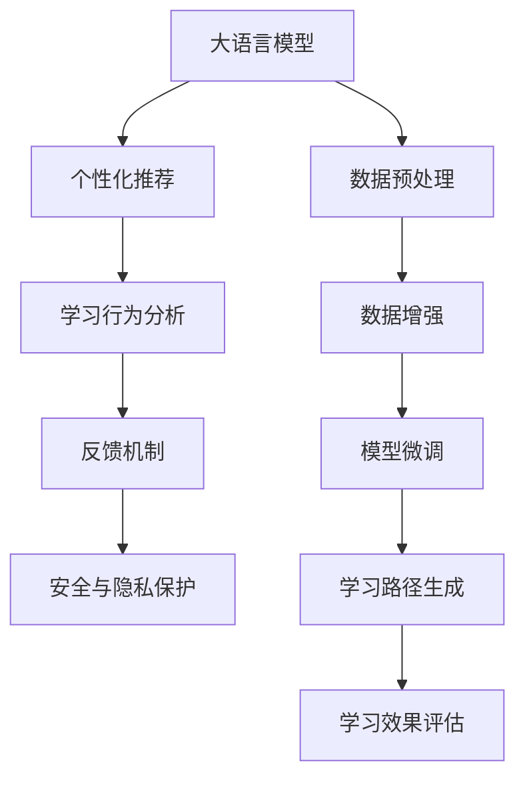

                 

# LLM在智能个性化学习系统中的应用探索

## 1. 背景介绍

### 1.1 问题由来

随着人工智能技术的不断进步，大语言模型(LLM)在教育领域的应用越来越广泛，特别是在智能个性化学习系统的构建上，取得了显著的进展。传统的教学方法往往无法满足每个学生个性化需求，而智能个性化学习系统能够根据学生的学习行为和偏好，提供个性化的学习内容和策略，显著提升学习效果。然而，构建这样一套系统需要大量的数据和复杂的技术支持，存在一定的技术和资源门槛。

### 1.2 问题核心关键点

构建智能个性化学习系统需要解决以下几个关键问题：

- 如何利用大语言模型进行个性化推荐？
- 如何根据学生的学习行为和反馈调整学习策略？
- 如何确保系统的稳定性和安全性？

解决这些问题，能够极大地提升个性化学习系统的效果和用户体验，为教育技术的发展带来新的突破。

## 2. 核心概念与联系

### 2.1 核心概念概述

为更好地理解大语言模型在个性化学习系统中的应用，本节将介绍几个密切相关的核心概念：

- 大语言模型(LLM)：基于自回归或自编码模型构建的，通过大规模无标签文本数据预训练得到的通用语言模型，具备强大的语言理解和生成能力。
- 个性化推荐系统：根据用户的行为和兴趣，推荐最适合其需求的内容的系统。
- 学习行为分析：对学生的学习行为进行统计和分析，如阅读时间、答题正确率等，以提供个性化的学习建议。
- 反馈机制：收集学生对学习内容和学习策略的反馈，持续优化个性化学习系统。
- 安全与隐私保护：确保学习数据的隐私性，防止未授权访问和数据泄露。

这些核心概念之间的逻辑关系可以通过以下Mermaid流程图来展示：



这个流程图展示了大语言模型在个性化学习系统中的应用流程：

1. 数据预处理和大模型预训练。
2. 通过数据增强和模型微调，适应特定学习任务。
3. 根据学习行为分析生成个性化推荐。
4. 收集学生反馈，持续优化学习路径。
5. 保障数据安全与隐私。

这些核心概念共同构成了智能个性化学习系统的核心框架，使得大语言模型能够更有效地应用于教育领域。

## 3. 核心算法原理 & 具体操作步骤
### 3.1 算法原理概述

大语言模型在智能个性化学习系统中的主要应用是通过对学生的学习行为和兴趣进行分析和建模，生成个性化的学习内容推荐和学习路径，以提升学习效果。其核心算法原理可以概括为以下几个方面：

- 数据预处理：收集学生的学习记录、答题情况等数据，进行清洗和标准化处理。
- 个性化推荐：使用大语言模型对学生的需求和兴趣进行建模，生成个性化的学习内容和推荐。
- 学习行为分析：统计学生的学习行为，分析其学习状态和效果，以调整学习策略。
- 反馈机制：通过学生对推荐内容的反馈，对个性化推荐系统进行优化。
- 安全与隐私保护：采用加密、去标识化等技术手段，保障学生数据的安全性和隐私性。

### 3.2 算法步骤详解

#### 步骤1: 数据预处理

1. 收集学生学习数据：包括学生的成绩、答题情况、阅读记录、课外阅读等。
2. 数据清洗：去除噪声数据，处理缺失值和异常值。
3. 数据标准化：将数据转化为标准格式，便于后续处理和分析。

#### 步骤2: 数据增强

1. 生成学习行为样本：根据学生的学习记录，生成不同的学习场景和行为样本。
2. 数据增强：通过对数据进行扩充和变换，增加数据多样性，减少过拟合风险。
3. 数据平衡：对不同学习阶段的数据进行平衡处理，确保模型能全面覆盖学生的需求。

#### 步骤3: 模型微调

1. 选择预训练模型：选择具有丰富语言知识的预训练模型，如GPT-3、BERT等。
2. 微调目标任务：根据个性化学习任务的需求，对模型进行微调。
3. 设置微调参数：包括学习率、优化器、批大小等。
4. 微调训练：在标注数据集上训练微调模型，调整模型参数。

#### 步骤4: 个性化推荐

1. 学生兴趣建模：使用预训练模型，对学生的学习行为和兴趣进行建模。
2. 生成推荐内容：根据模型预测的兴趣，生成个性化的学习内容。
3. 推荐算法：采用基于协同过滤、深度学习等推荐算法，推荐合适的学习内容。

#### 步骤5: 学习行为分析

1. 学习行为统计：对学生的学习行为进行统计，包括阅读时间、答题正确率等。
2. 学习状态分析：分析学生当前的学习状态和效果，生成学习报告。
3. 学习策略调整：根据学习行为分析结果，调整学习路径和策略。

#### 步骤6: 反馈机制

1. 反馈收集：收集学生对推荐内容的反馈，如满意度、难度等。
2. 反馈分析：分析学生反馈数据，优化个性化推荐模型。
3. 反馈闭环：将反馈结果应用于下一轮的推荐和优化。

#### 步骤7: 安全与隐私保护

1. 数据加密：对学生数据进行加密处理，防止数据泄露。
2. 去标识化：对数据进行去标识化处理，保护学生隐私。
3. 访问控制：设置访问权限，防止未授权访问。

### 3.3 算法优缺点

大语言模型在智能个性化学习系统中的应用具有以下优点：

- 个性化推荐效果显著：大语言模型能够根据学生的行为和兴趣生成个性化的推荐，提升学习效果。
- 自适应性强：大语言模型能够自适应学生的学习状态，调整学习策略。
- 数据利用率高：大语言模型能够高效利用学生的学习数据，生成丰富的个性化内容。

同时，该方法也存在一定的局限性：

- 依赖标注数据：微调模型的效果很大程度上取决于标注数据的质量和数量，获取高质量标注数据的成本较高。
- 模型复杂度：大语言模型参数量较大，对计算资源的要求较高。
- 安全性问题：学生的学习数据涉及隐私，必须采取相应的安全措施。

尽管存在这些局限性，但就目前而言，大语言模型在个性化学习系统中的应用仍是主流范式。未来相关研究的重点在于如何进一步降低数据标注成本，提高模型的鲁棒性和安全性。

### 3.4 算法应用领域

大语言模型在智能个性化学习系统中的应用已经涉及诸多领域，例如：

- 在线教育平台：如Khan Academy、Coursera等，通过个性化推荐提升学习效果。
- 智能辅导系统：如Knewton、BrightBytes等，根据学生的学习行为，生成个性化学习路径。
- 虚拟教室系统：如Class Central、Udacity等，根据学生的反馈，调整课堂教学内容。
- 作业系统：如Socrative、Formative Code等，通过个性化推荐提高作业完成质量。
- 语音识别系统：如Google Speech-to-Text、Baidu Speech等，根据语音输入生成个性化学习内容。

除了上述这些经典应用外，大语言模型还被创新性地应用到更多场景中，如个性化阅读推荐、学习路径优化、智能家教等，为个性化学习技术的发展提供了新的突破点。

## 4. 数学模型和公式 & 详细讲解 & 举例说明
### 4.1 数学模型构建

本节将使用数学语言对大语言模型在个性化学习系统中的应用过程进行更加严格的刻画。

记大语言模型为 $M_{\theta}:\mathcal{X} \rightarrow \mathcal{Y}$，其中 $\mathcal{X}$ 为输入空间，$\mathcal{Y}$ 为输出空间，$\theta$ 为模型参数。假设学生学习数据集为 $D=\{(x_i, y_i)\}_{i=1}^N$，其中 $x_i$ 表示学生学习行为记录，$y_i$ 表示学习行为标签。

定义模型 $M_{\theta}$ 在数据样本 $(x,y)$ 上的损失函数为 $\ell(M_{\theta}(x),y)$，则在数据集 $D$ 上的经验风险为：

$$
\mathcal{L}(\theta) = \frac{1}{N} \sum_{i=1}^N \ell(M_{\theta}(x_i),y_i)
$$

微调的目标是最小化经验风险，即找到最优参数：

$$
\theta^* = \mathop{\arg\min}_{\theta} \mathcal{L}(\theta)
$$

在实践中，我们通常使用基于梯度的优化算法（如SGD、Adam等）来近似求解上述最优化问题。设 $\eta$ 为学习率，$\lambda$ 为正则化系数，则参数的更新公式为：

$$
\theta \leftarrow \theta - \eta \nabla_{\theta}\mathcal{L}(\theta) - \eta\lambda\theta
$$

其中 $\nabla_{\theta}\mathcal{L}(\theta)$ 为损失函数对参数 $\theta$ 的梯度，可通过反向传播算法高效计算。

### 4.2 公式推导过程

以下我们以二分类任务为例，推导交叉熵损失函数及其梯度的计算公式。

假设模型 $M_{\theta}$ 在输入 $x$ 上的输出为 $\hat{y}=M_{\theta}(x) \in [0,1]$，表示学生学习行为属于某个标签的概率。真实标签 $y \in \{0,1\}$。则二分类交叉熵损失函数定义为：

$$
\ell(M_{\theta}(x),y) = -[y\log \hat{y} + (1-y)\log (1-\hat{y})]
$$

将其代入经验风险公式，得：

$$
\mathcal{L}(\theta) = -\frac{1}{N}\sum_{i=1}^N [y_i\log M_{\theta}(x_i)+(1-y_i)\log(1-M_{\theta}(x_i))]
$$

根据链式法则，损失函数对参数 $\theta_k$ 的梯度为：

$$
\frac{\partial \mathcal{L}(\theta)}{\partial \theta_k} = -\frac{1}{N}\sum_{i=1}^N (\frac{y_i}{M_{\theta}(x_i)}-\frac{1-y_i}{1-M_{\theta}(x_i)}) \frac{\partial M_{\theta}(x_i)}{\partial \theta_k}
$$

其中 $\frac{\partial M_{\theta}(x_i)}{\partial \theta_k}$ 可进一步递归展开，利用自动微分技术完成计算。

在得到损失函数的梯度后，即可带入参数更新公式，完成模型的迭代优化。重复上述过程直至收敛，最终得到适应个性化学习任务的最优模型参数 $\theta^*$。

### 4.3 案例分析与讲解

假设有两位学生，学生A和学生B，分别进行了以下学习行为：

- 学生A：阅读了5篇文章，答题正确率80%，阅读时间5小时。
- 学生B：阅读了3篇文章，答题正确率60%，阅读时间3小时。

根据这些行为数据，可以构建如下数据集：

$$
D = \{((5, 80, 5), 1), ((3, 60, 3), 0)\}
$$

其中第一个元组表示学生行为，第二个元素表示学习行为标签（1表示正向行为，0表示负向行为）。

接下来，使用上述公式，对模型进行微调，得到最优参数 $\theta^*$。在得到 $\theta^*$ 后，使用该模型对新学生的学习行为进行预测，生成个性化推荐。例如，假设新学生C进行了以下行为：

- 阅读时间4小时
- 答题正确率70%

将这些行为输入模型，得到学生C的预测标签，并生成个性化推荐。

## 5. 项目实践：代码实例和详细解释说明
### 5.1 开发环境搭建

在进行个性化学习系统开发前，我们需要准备好开发环境。以下是使用Python进行PyTorch开发的环境配置流程：

1. 安装Anaconda：从官网下载并安装Anaconda，用于创建独立的Python环境。

2. 创建并激活虚拟环境：
```bash
conda create -n pytorch-env python=3.8 
conda activate pytorch-env
```

3. 安装PyTorch：根据CUDA版本，从官网获取对应的安装命令。例如：
```bash
conda install pytorch torchvision torchaudio cudatoolkit=11.1 -c pytorch -c conda-forge
```

4. 安装TensorFlow：
```bash
pip install tensorflow
```

5. 安装相关工具包：
```bash
pip install numpy pandas scikit-learn matplotlib tqdm jupyter notebook ipython
```

完成上述步骤后，即可在`pytorch-env`环境中开始开发。

### 5.2 源代码详细实现

下面我们以二分类个性化推荐系统为例，给出使用PyTorch进行模型训练和预测的代码实现。

首先，定义模型和优化器：

```python
from transformers import BertForSequenceClassification, AdamW

model = BertForSequenceClassification.from_pretrained('bert-base-cased', num_labels=2)

optimizer = AdamW(model.parameters(), lr=2e-5)
```

然后，定义训练和评估函数：

```python
from torch.utils.data import Dataset
from torch.utils.data import DataLoader
import torch

class StudentDataset(Dataset):
    def __init__(self, behaviors, labels):
        self.behaviors = behaviors
        self.labels = labels
        
    def __len__(self):
        return len(self.behaviors)
    
    def __getitem__(self, item):
        return {'behavior': self.behaviors[item], 'label': self.labels[item]}

# 学习行为数据
behaviors = [
    (5, 80, 5),
    (3, 60, 3)
]
labels = [1, 0]

# 创建dataset
train_dataset = StudentDataset(behaviors, labels)

# 设置训练参数
train_loader = DataLoader(train_dataset, batch_size=1, shuffle=True)

# 训练模型
for epoch in range(10):
    model.train()
    total_loss = 0
    for batch in train_loader:
        behavior = batch['behavior']
        label = batch['label']
        outputs = model(behavior)
        loss = outputs.loss
        total_loss += loss.item()
        optimizer.zero_grad()
        loss.backward()
        optimizer.step()
    print(f"Epoch {epoch+1}, train loss: {total_loss:.3f}")
```

最后，定义预测函数：

```python
def predict(behavior):
    model.eval()
    with torch.no_grad():
        outputs = model(behavior)
        probability = outputs.logits.sigmoid()
        return probability.item()
```

使用上述代码实现，可以得到微调后的模型，并根据学生的行为数据，生成个性化推荐。

### 5.3 代码解读与分析

让我们再详细解读一下关键代码的实现细节：

**StudentDataset类**：
- `__init__`方法：初始化学习行为和标签。
- `__len__`方法：返回数据集的样本数量。
- `__getitem__`方法：返回单个样本的特征和标签。

**训练函数**：
- 使用PyTorch的DataLoader对数据集进行批次化加载。
- 每个批次包含一个样本，将学习行为作为输入，预测标签作为损失函数的实际标签。
- 在每个批次内进行前向传播和反向传播，更新模型参数。
- 输出每个epoch的平均损失。

**预测函数**：
- 将学生的行为数据作为模型输入，计算预测概率。
- 返回概率值，作为个性化推荐系统的输出。

可以看到，PyTorch的强大封装和灵活性使得模型的训练和推理变得简单高效。开发者只需专注于模型结构和算法优化，而不必过多关注底层实现细节。

## 6. 实际应用场景
### 6.1 在线教育平台

基于大语言模型的个性化推荐系统，可以在在线教育平台上广泛应用。通过分析学生的学习行为和反馈，推荐适合其需求的学习内容，提升学习效果。例如，Khan Academy和Coursera等在线教育平台，已经使用类似的系统来个性化推荐课程和视频，显著提高了学生的学习体验。

在技术实现上，可以收集学生在学习平台上的行为数据，如学习时间、答题正确率、观看视频等，将这些数据作为模型输入，训练个性化推荐模型。模型能够根据学生的行为特征，生成个性化的学习路径和推荐内容，提升学习效果。例如，针对学习时间长的学生，可以推荐更多挑战性的内容；对于答题正确率低的学生，可以推荐更多基础性的学习材料。

### 6.2 智能辅导系统

智能辅导系统通过大语言模型分析学生的学习行为和反馈，提供个性化的辅导和建议，帮助学生克服学习障碍，提高学习效果。例如，Knewton和BrightBytes等智能辅导系统，已经实现了基于学生行为数据的个性化辅导。

在技术实现上，可以构建智能辅导平台，收集学生在学习过程中的行为数据，如阅读时间、答题错误次数、学习路径等，训练个性化辅导模型。模型能够根据学生的学习状态和反馈，生成个性化的辅导建议和策略，帮助学生克服困难，提升学习效果。例如，对于阅读时间长的学生，可以推荐更多相关的学习材料；对于答题错误多的学生，可以提供更多的习题和解释。

### 6.3 虚拟教室系统

虚拟教室系统通过大语言模型分析学生的学习行为和反馈，调整课堂教学内容和方式，提升教学效果。例如，Class Central和Udacity等虚拟教室系统，已经使用类似的系统来个性化调整教学内容。

在技术实现上，可以构建虚拟教室平台，收集学生在课堂学习过程中的行为数据，如提问次数、互动情况、课堂反馈等，训练个性化调整模型。模型能够根据学生的课堂行为和反馈，生成个性化的教学策略和内容，提升教学效果。例如，对于提问多的学生，可以提供更多的互动机会；对于反馈不好的学生，可以提供更多的反馈和解释。

### 6.4 未来应用展望

随着大语言模型的不断进步和个性化学习系统的发展，未来基于大语言模型的个性化推荐系统将会有更多的应用场景：

- 在工业培训中，可以根据工人的操作行为，推荐合适的培训材料，提高培训效果。
- 在医疗领域，可以根据患者的病情和检查结果，推荐个性化的治疗方案和康复指导。
- 在金融投资中，可以根据投资者的交易行为，推荐合适的投资建议和风险控制策略。
- 在旅游推荐中，可以根据旅游者的兴趣和行为，推荐合适的旅游目的地和行程安排。

总之，大语言模型在个性化学习系统中的应用前景广阔，将为各行各业带来新的变革。未来，随着技术的不断进步和应用场景的拓展，大语言模型将进一步推动人工智能技术的发展和应用。

## 7. 工具和资源推荐
### 7.1 学习资源推荐

为了帮助开发者系统掌握大语言模型在个性化学习系统中的应用理论基础和实践技巧，这里推荐一些优质的学习资源：

1. 《深度学习与自然语言处理》：斯坦福大学提供的NLP课程，系统介绍了NLP的基本概念和经典模型，适合初学者学习。

2. 《Transformer from Scratch》：从零开始实现Transformer模型的教程，详细介绍了模型的原理和实现方法。

3. 《BERT: Pre-training of Deep Bidirectional Transformers for Language Understanding》：BERT论文，介绍了BERT模型的构建和训练方法，是理解大语言模型的重要资料。

4. HuggingFace官方文档：提供了丰富的预训练模型和微调样例，是学习大语言模型的必备资源。

5. Arxiv论文：收录了最新的NLP研究论文，涵盖了各种大语言模型和个性化推荐系统的最新进展。

通过这些资源的学习，相信你一定能够系统掌握大语言模型在个性化学习系统中的应用技巧，并用于解决实际的个性化推荐问题。

### 7.2 开发工具推荐

高效的开发离不开优秀的工具支持。以下是几款用于大语言模型微调开发的常用工具：

1. PyTorch：基于Python的开源深度学习框架，灵活动态的计算图，适合快速迭代研究。

2. TensorFlow：由Google主导开发的开源深度学习框架，生产部署方便，适合大规模工程应用。

3. Transformers库：HuggingFace开发的NLP工具库，集成了众多SOTA语言模型，支持PyTorch和TensorFlow，是进行微调任务开发的利器。

4. Weights & Biases：模型训练的实验跟踪工具，可以记录和可视化模型训练过程中的各项指标，方便对比和调优。

5. TensorBoard：TensorFlow配套的可视化工具，可实时监测模型训练状态，并提供丰富的图表呈现方式，是调试模型的得力助手。

合理利用这些工具，可以显著提升大语言模型微调任务的开发效率，加快创新迭代的步伐。

### 7.3 相关论文推荐

大语言模型和微调技术的发展源于学界的持续研究。以下是几篇奠基性的相关论文，推荐阅读：

1. Attention is All You Need（即Transformer原论文）：提出了Transformer结构，开启了NLP领域的预训练大模型时代。

2. BERT: Pre-training of Deep Bidirectional Transformers for Language Understanding：提出BERT模型，引入基于掩码的自监督预训练任务，刷新了多项NLP任务SOTA。

3. Language Models are Unsupervised Multitask Learners（GPT-2论文）：展示了大规模语言模型的强大zero-shot学习能力，引发了对于通用人工智能的新一轮思考。

4. Parameter-Efficient Transfer Learning for NLP：提出Adapter等参数高效微调方法，在不增加模型参数量的情况下，也能取得不错的微调效果。

5. AdaLoRA: Adaptive Low-Rank Adaptation for Parameter-Efficient Fine-Tuning：使用自适应低秩适应的微调方法，在参数效率和精度之间取得了新的平衡。

6. Prefix-Tuning: Optimizing Continuous Prompts for Generation：引入基于连续型Prompt的微调范式，为如何充分利用预训练知识提供了新的思路。

这些论文代表了大语言模型微调技术的发展脉络。通过学习这些前沿成果，可以帮助研究者把握学科前进方向，激发更多的创新灵感。

## 8. 总结：未来发展趋势与挑战
### 8.1 研究成果总结

本文对基于大语言模型的个性化学习系统进行了全面系统的介绍。首先阐述了大语言模型在教育领域的应用背景和意义，明确了个性化学习系统的核心目标和关键问题。其次，从原理到实践，详细讲解了个性化学习系统的数学模型和算法步骤，给出了微调任务开发的完整代码实例。同时，本文还广泛探讨了个性化学习系统在在线教育、智能辅导、虚拟教室等多个领域的应用前景，展示了个性化学习系统的巨大潜力。

通过本文的系统梳理，可以看到，基于大语言模型的个性化学习系统已经迈出了重要的一步，为个性化学习技术的发展带来了新的突破。未来，随着技术的不断进步和应用场景的拓展，大语言模型将进一步推动个性化学习系统的发展和应用。

### 8.2 未来发展趋势

展望未来，基于大语言模型的个性化学习系统将呈现以下几个发展趋势：

1. 数据增强和模型优化：随着数据量的增加和算法优化，个性化推荐系统将更加精准和高效。
2. 多模态融合：将语音、图像等多模态数据与文本数据结合，提供更全面的个性化学习体验。
3. 模型通用化和自适应：开发更加通用的个性化学习模型，能够自适应不同的应用场景和学习需求。
4. 多任务学习：将个性化学习系统与多种学习任务结合，提供全方位的学习支持。
5. 实时反馈和迭代优化：基于实时反馈，持续优化个性化学习系统，提升学习效果。

这些趋势将使得个性化学习系统更加智能化、高效化和个性化，为学生提供更加优质的学习体验。

### 8.3 面临的挑战

尽管基于大语言模型的个性化学习系统已经取得了显著进展，但在迈向更加智能化、普适化应用的过程中，仍面临诸多挑战：

1. 数据标注成本高：高质量的学习行为数据获取成本较高，难以大规模应用。
2. 模型鲁棒性不足：个性化学习模型面对新数据时，泛化性能有限，可能出现灾难性遗忘。
3. 隐私和安全问题：学生的学习数据涉及隐私，必须采取相应的安全措施。
4. 资源消耗大：大模型训练和推理计算量大，需要高性能计算资源支持。
5. 用户接受度低：部分学生和家长对个性化学习系统存在疑虑，可能影响其应用效果。

这些挑战需要从数据采集、算法优化、技术架构、伦理道德等多个维度进行全面应对，才能实现个性化学习系统的广泛应用。

### 8.4 研究展望

未来，研究需要从以下几个方向进行深入探索：

1. 无监督学习：利用非标注数据，进行自监督学习，降低对标注数据的依赖。
2. 多模态融合：将多种模态数据与文本数据结合，提供更全面的学习体验。
3. 因果推理：引入因果推理模型，提高个性化学习系统的可靠性和稳定性。
4. 元学习：探索元学习技术，让学习系统能够自适应新任务和学习需求。
5. 数据隐私保护：开发隐私保护技术，确保学习数据的隐私和安全。

这些研究方向将进一步推动个性化学习系统的进步，为学生的个性化学习提供更加智能和可靠的支持。

## 9. 附录：常见问题与解答

**Q1：如何提高个性化推荐系统的精度？**

A: 提高个性化推荐系统精度的方法包括：
1. 数据增强：通过回译、近义替换等方式扩充训练集。
2. 正则化：使用L2正则、Dropout、Early Stopping等防止过拟合。
3. 对抗训练：引入对抗样本，提高模型鲁棒性。
4. 参数高效微调：只调整少量参数，减少过拟合风险。
5. 多任务学习：将多种学习任务结合，提供全方位的学习支持。

**Q2：如何保障个性化学习系统的安全性？**

A: 保障个性化学习系统的安全性需要采取以下措施：
1. 数据加密：对学生数据进行加密处理，防止数据泄露。
2. 去标识化：对数据进行去标识化处理，保护学生隐私。
3. 访问控制：设置访问权限，防止未授权访问。
4. 监控告警：实时采集系统指标，设置异常告警阈值，确保服务稳定性。
5. 安全审计：定期进行系统审计，发现和修复潜在的安全漏洞。

**Q3：如何处理个性化学习系统中的数据偏差？**

A: 处理数据偏差的方法包括：
1. 数据清洗：去除噪声数据，处理缺失值和异常值。
2. 数据平衡：对不同学习阶段的数据进行平衡处理，确保模型能全面覆盖学生的需求。
3. 公平性分析：评估模型的公平性，调整模型参数，消除偏差。
4. 多样性训练：在训练过程中加入多样性样本，提高模型的鲁棒性。
5. 人工干预：对模型输出进行人工审查，纠正偏差。

这些措施能够帮助个性化学习系统应对数据偏差，提高模型的公平性和鲁棒性。

**Q4：如何优化个性化学习系统的资源消耗？**

A: 优化个性化学习系统的资源消耗的方法包括：
1. 模型压缩：使用模型压缩技术，减小模型尺寸，提高推理速度。
2. 稀疏化存储：采用稀疏化存储技术，压缩存储空间。
3. 梯度压缩：使用梯度压缩技术，减少反向传播的资源消耗。
4. 混合精度训练：使用混合精度训练技术，提高计算效率。
5. 并行计算：使用并行计算技术，加快模型训练和推理速度。

这些优化措施能够显著降低个性化学习系统的资源消耗，提高系统的稳定性和可扩展性。

**Q5：如何应对个性化学习系统中的用户反馈？**

A: 应对个性化学习系统中的用户反馈的方法包括：
1. 反馈收集：通过问卷调查、用户评价等方式收集用户反馈。
2. 反馈分析：分析用户反馈数据，优化个性化推荐模型。
3. 反馈闭环：将反馈结果应用于下一轮的推荐和优化。
4. 用户干预：允许用户自行调整推荐策略，提高用户满意度。
5. 系统迭代：根据用户反馈不断优化个性化学习系统，提升用户体验。

这些措施能够帮助个性化学习系统及时响应用户需求，提高系统的用户接受度和满意度。

---

作者：禅与计算机程序设计艺术 / Zen and the Art of Computer Programming

