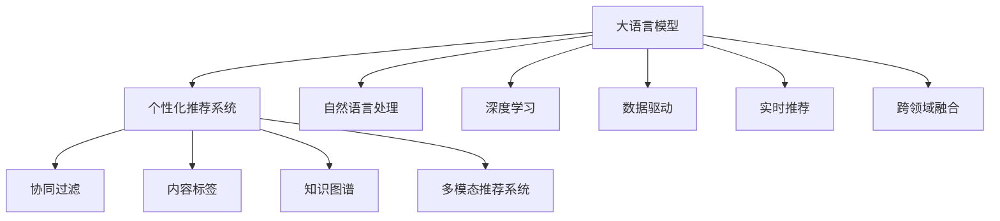

                 

# LLM在智能个性化推荐系统中的应用前景

> 关键词：大语言模型(LLM), 个性化推荐系统, 自然语言处理(NLP), 深度学习, 用户行为分析, 协同过滤, 知识图谱

## 1. 背景介绍

### 1.1 问题由来
个性化推荐系统(Personalized Recommendation System, PReS)是当前电商、媒体、社交网络等领域的重要技术手段，帮助用户在海量信息中找到自己感兴趣的内容。传统的推荐系统主要以基于协同过滤、内容标签等特征的模型为主，但随着数据量的爆炸性增长，这些模型的效果和扩展性都受到了一定挑战。

近年来，深度学习技术在推荐系统中的应用逐渐增多，其中最引人注目的是基于大语言模型的推荐系统。由于深度学习可以挖掘数据深层次特征，并且大语言模型具备强大的文本处理和生成能力，因而在大规模、复杂任务上表现出了巨大优势。

### 1.2 问题核心关键点
大语言模型在推荐系统中的应用，主要体现在以下几个方面：

1. **用户意图的深度挖掘**：大语言模型能够从文本数据中学习用户的意图，预测其可能的偏好和行为。
2. **长尾物品的推荐**：通过自然语言处理能力，大语言模型能够推荐一些小众但用户可能感兴趣的商品。
3. **动态推荐模型的构建**：大语言模型能够基于最新的用户数据和实时反馈，动态更新推荐策略。
4. **跨领域知识融合**：大语言模型可以结合不同领域的数据，如商品描述、用户评论、知识图谱等，提供更全面、准确的推荐。
5. **多模态数据融合**：大语言模型能够整合图像、视频、音频等多模态数据，提升推荐系统的智能化程度。

## 2. 核心概念与联系

### 2.1 核心概念概述

为更好地理解大语言模型在推荐系统中的应用，本节将介绍几个密切相关的核心概念：

- **大语言模型(LLM)**：以自回归(如GPT)或自编码(如BERT)模型为代表的大规模预训练语言模型。通过在大规模无标签文本语料上进行预训练，学习通用的语言表示，具备强大的语言理解和生成能力。

- **个性化推荐系统(PReS)**：根据用户的历史行为、兴趣、背景等信息，推荐用户可能感兴趣的商品或内容。目标是提高用户满意度，增加用户粘性。

- **协同过滤(Collaborative Filtering, CF)**：一种基于用户-物品交互历史数据的推荐方法，包括基于用户的CF和基于物品的CF。利用用户和物品的相似度进行推荐。

- **内容标签(Content-Based Filtering, CB)**：一种根据商品属性和用户特征进行推荐的CF方法，强调物品属性与用户特征的匹配。

- **知识图谱(Knowledge Graph, KG)**：一种结构化的语义表示方式，用于存储和查询实体的关系和属性。在推荐系统中，可以用于构建商品的语义网络。

- **多模态推荐系统**：融合多种数据源(如文本、图像、音频等)，提供更全面、多元的推荐。

这些核心概念之间的逻辑关系可以通过以下Mermaid流程图来展示：



这个流程图展示了大语言模型和个性化推荐系统的核心概念及其之间的关系：

1. 大语言模型通过预训练获得基础能力。
2. 个性化推荐系统利用大语言模型的文本处理能力，深入挖掘用户意图，推荐物品。
3. 协同过滤、内容标签等传统方法与大语言模型结合，构建推荐模型。
4. 知识图谱和多模态数据融合技术，拓展推荐系统的数据源和表达能力。
5. 大语言模型中的自然语言处理和深度学习能力，用于实时推荐和跨领域融合。

这些概念共同构成了大语言模型在推荐系统中的应用框架，使其能够更有效地捕捉用户需求和推荐效果。

## 3. 核心算法原理 & 具体操作步骤
### 3.1 算法原理概述

基于大语言模型的个性化推荐系统，本质上是一个将自然语言处理技术与推荐算法结合的混合系统。其核心思想是：利用大语言模型强大的文本理解能力，提取用户需求和商品描述中的语义信息，结合传统的推荐算法，生成个性化的推荐结果。

形式化地，假设大语言模型为 $M_{\theta}$，其中 $\theta$ 为预训练得到的模型参数。推荐系统为 $S$，其中 $S_{\theta}$ 为推荐模型参数。给定用户 $u$ 和商品 $i$ 的数据集 $D=\{(x_i,y_i)\}_{i=1}^N, x_i \in \mathbb{R}^d, y_i \in \{0,1\}$，推荐系统的目标是最小化损失函数：

$$
\min_{\theta} \mathcal{L}(S_{\theta}, D)
$$

其中 $\mathcal{L}$ 为推荐模型的损失函数，用于衡量模型预测推荐结果与真实标签之间的差异。常见的损失函数包括均方误差损失、交叉熵损失等。

通过梯度下降等优化算法，推荐过程不断更新模型参数 $\theta$ 和 $S_{\theta}$，最小化损失函数 $\mathcal{L}$，使得模型输出逼近真实标签。由于 $\theta$ 已经通过预训练获得了较好的初始化，因此即便在推荐系统数据量较少的情况下，也能较快收敛到理想的模型参数 $\hat{\theta}$。

### 3.2 算法步骤详解

基于大语言模型的个性化推荐系统一般包括以下几个关键步骤：

**Step 1: 准备预训练模型和推荐系统**
- 选择合适的预训练语言模型 $M_{\theta}$ 作为初始化参数，如 BERT、GPT等。
- 设计推荐算法 $S_{\theta}$，如协同过滤、内容标签等。

**Step 2: 数据预处理**
- 收集用户历史行为数据，如浏览、购买、评分等，将其转换为向量表示。
- 收集商品描述、属性、标签等信息，同样进行向量化处理。
- 对于多模态数据，使用相应的处理方法进行特征提取和融合。

**Step 3: 提取用户意图**
- 对用户行为数据和商品描述进行文本处理，使用大语言模型 $M_{\theta}$ 提取语义特征。
- 将文本数据转化为数字序列，输入到语言模型中。
- 使用语言模型的输出概率分布，选择最可能的文本描述。

**Step 4: 构建推荐模型**
- 根据用户意图和商品特征，构建推荐模型 $S_{\theta}$。
- 如果选择协同过滤，使用用户行为数据和商品特征计算相似度。
- 如果选择内容标签，使用商品属性和用户特征进行匹配。

**Step 5: 执行推荐**
- 将提取的用户意图和商品特征输入到推荐模型 $S_{\theta}$，得到推荐结果。
- 结合商品描述，对推荐结果进行展示和排序。

**Step 6: 反馈循环**
- 收集用户对推荐结果的反馈，包括点击、购买、评分等行为。
- 将反馈数据用于更新大语言模型的参数，进行持续学习和优化。

以上是基于大语言模型的推荐系统的一般流程。在实际应用中，还需要针对具体任务的特点，对推荐过程的各个环节进行优化设计，如改进文本处理方法、优化推荐模型算法等，以进一步提升推荐效果。

### 3.3 算法优缺点

基于大语言模型的个性化推荐系统具有以下优点：
1. 深度挖掘用户意图：大语言模型能够理解复杂的文本描述，提取用户的深层需求。
2. 长尾物品推荐：大语言模型可以基于用户少量浏览行为，推荐小众但可能感兴趣的商品。
3. 动态推荐：大语言模型能够实时处理最新用户数据和反馈，动态更新推荐策略。
4. 跨领域融合：大语言模型可以整合不同领域的数据，提供更全面的推荐。
5. 多模态支持：大语言模型能够处理图像、视频等多模态数据，提升推荐系统的智能化程度。

同时，该方法也存在一定的局限性：
1. 计算成本较高：大语言模型参数量巨大，计算和存储资源需求高。
2. 模型复杂度高：大语言模型模型的复杂度较高，训练和推理效率受限。
3. 数据隐私问题：推荐系统需要收集大量用户数据，存在隐私泄露的风险。
4. 推荐结果解释性不足：大语言模型推荐过程复杂，难以解释推荐结果。
5. 稳定性问题：推荐系统依赖于大语言模型的预训练权重，新模型引入的噪声可能导致不稳定。

尽管存在这些局限性，但就目前而言，基于大语言模型的推荐方法已经在大规模电商推荐、视频推荐、智能广告等领域取得了显著效果，成为推荐系统的重要组成部分。未来相关研究的重点在于如何进一步降低计算成本，提高模型效率，确保数据隐私安全，增强推荐结果的可解释性，以及提升推荐系统的稳定性和鲁棒性。

### 3.4 算法应用领域

基于大语言模型的个性化推荐系统，在电商、媒体、社交网络等多个领域都有广泛的应用，例如：

- **电商推荐系统**：根据用户浏览记录和历史购买行为，推荐可能感兴趣的商品。使用大语言模型提取用户意图，结合协同过滤、内容标签等算法，提升推荐精度。
- **视频推荐系统**：根据用户观看历史和视频属性，推荐可能喜欢的视频内容。使用大语言模型分析视频描述，结合视频特征进行推荐。
- **智能广告系统**：根据用户行为数据和兴趣标签，推荐可能感兴趣的广告。使用大语言模型提取用户意图，结合广告特征进行定向投放。
- **内容推荐系统**：根据用户阅读历史和文章属性，推荐可能喜欢的文章。使用大语言模型分析文章摘要，结合内容特征进行推荐。
- **社交网络推荐**：根据用户关注关系和好友推荐行为，推荐可能感兴趣的内容。使用大语言模型分析用户评论，结合社交网络特征进行推荐。

除了上述这些经典应用外，大语言模型推荐系统还被创新性地应用到更多场景中，如商品搜索、旅游推荐、健康医疗等，为推荐系统带来了新的突破。随着预训练语言模型和推荐算法的持续演进，相信推荐系统将在更多领域发挥重要作用，带来更深刻的体验升级和业务价值。

## 4. 数学模型和公式 & 详细讲解  
### 4.1 数学模型构建

本节将使用数学语言对基于大语言模型的推荐系统进行更加严格的刻画。

记大语言模型为 $M_{\theta}$，推荐系统为 $S_{\theta}$，其中 $\theta$ 为模型参数。假设推荐系统训练集为 $D=\{(x_i,y_i)\}_{i=1}^N, x_i \in \mathbb{R}^d, y_i \in \{0,1\}$。

定义推荐系统 $S_{\theta}$ 在数据样本 $(x,y)$ 上的损失函数为 $\ell(S_{\theta}(x),y)$，则在数据集 $D$ 上的经验风险为：

$$
\mathcal{L}(\theta) = \frac{1}{N} \sum_{i=1}^N \ell(S_{\theta}(x_i),y_i)
$$

推荐系统的优化目标是最小化经验风险，即找到最优参数：

$$
\theta^* = \mathop{\arg\min}_{\theta} \mathcal{L}(\theta)
$$

在实践中，我们通常使用基于梯度的优化算法（如SGD、Adam等）来近似求解上述最优化问题。设 $\eta$ 为学习率，$\lambda$ 为正则化系数，则参数的更新公式为：

$$
\theta \leftarrow \theta - \eta \nabla_{\theta}\mathcal{L}(\theta) - \eta\lambda\theta
$$

其中 $\nabla_{\theta}\mathcal{L}(\theta)$ 为损失函数对参数 $\theta$ 的梯度，可通过反向传播算法高效计算。

### 4.2 公式推导过程

以下我们以协同过滤推荐系统为例，推导推荐系统的损失函数及其梯度的计算公式。

假设协同过滤推荐系统利用用户行为数据和商品特征计算相似度，得到推荐结果。推荐系统 $S_{\theta}$ 将用户特征和商品特征映射为相似度向量，使用 $\sigma$ 激活函数计算预测值 $p_{ui}$：

$$
p_{ui} = \sigma(\mathbf{w}^T \mathbf{z}_u + \mathbf{b})
$$

其中 $\mathbf{z}_u$ 为用户的特征向量，$\mathbf{z}_i$ 为商品的特征向量，$\mathbf{w}$ 和 $\mathbf{b}$ 为模型参数。

设 $y_{ui}$ 为实际用户对商品 $i$ 的评分，则推荐系统的损失函数为均方误差损失函数：

$$
\ell(S_{\theta}(x),y) = \frac{1}{N}\sum_{i=1}^N \|y_{ui} - p_{ui}\|^2
$$

根据链式法则，损失函数对参数 $\theta$ 的梯度为：

$$
\frac{\partial \mathcal{L}(\theta)}{\partial \theta} = \frac{1}{N}\sum_{i=1}^N -2 \sum_{u=1}^N (y_{ui} - p_{ui})\mathbf{z}_u \nabla_{\theta}\sigma(\mathbf{w}^T \mathbf{z}_u + \mathbf{b})
$$

其中 $\nabla_{\theta}\sigma(\mathbf{w}^T \mathbf{z}_u + \mathbf{b})$ 为激活函数 $\sigma$ 的导数。在实际应用中，通常使用 $\tanh$ 或 $sigmoid$ 函数作为激活函数。

在得到损失函数的梯度后，即可带入参数更新公式，完成模型的迭代优化。重复上述过程直至收敛，最终得到适应推荐任务的最优模型参数 $\theta^*$。

## 5. 项目实践：代码实例和详细解释说明
### 5.1 开发环境搭建

在进行推荐系统开发前，我们需要准备好开发环境。以下是使用Python进行PyTorch开发的环境配置流程：

1. 安装Anaconda：从官网下载并安装Anaconda，用于创建独立的Python环境。

2. 创建并激活虚拟环境：
```bash
conda create -n recommendation-env python=3.8 
conda activate recommendation-env
```

3. 安装PyTorch：根据CUDA版本，从官网获取对应的安装命令。例如：
```bash
conda install pytorch torchvision torchaudio cudatoolkit=11.1 -c pytorch -c conda-forge
```

4. 安装Transformers库：
```bash
pip install transformers
```

5. 安装各类工具包：
```bash
pip install numpy pandas scikit-learn matplotlib tqdm jupyter notebook ipython
```

完成上述步骤后，即可在`recommendation-env`环境中开始推荐系统实践。

### 5.2 源代码详细实现

下面我们以协同过滤推荐系统为例，给出使用Transformers库对BERT模型进行推荐开发的PyTorch代码实现。

首先，定义推荐系统的数据处理函数：

```python
from transformers import BertTokenizer
from torch.utils.data import Dataset
import torch

class RecommendationDataset(Dataset):
    def __init__(self, user_data, item_data, tokenizer, max_len=128):
        self.user_data = user_data
        self.item_data = item_data
        self.tokenizer = tokenizer
        self.max_len = max_len
        
    def __len__(self):
        return len(self.user_data)
    
    def __getitem__(self, item):
        user = self.user_data[item]
        item = self.item_data[item]
        
        # 对用户行为数据进行分词和编码
        user_encoded = self.tokenizer(user, return_tensors='pt', max_length=self.max_len, padding='max_length', truncation=True)
        item_encoded = self.tokenizer(item, return_tensors='pt', max_length=self.max_len, padding='max_length', truncation=True)
        
        # 计算用户和商品的相似度
        user_vector = user_encoded['input_ids'].mean(dim=1)
        item_vector = item_encoded['input_ids'].mean(dim=1)
        similarity = torch.cosine_similarity(user_vector.unsqueeze(0), item_vector.unsqueeze(0))
        
        # 使用模型进行预测
        output = model(input_ids=user_encoded['input_ids'], attention_mask=user_encoded['attention_mask'], labels=torch.tensor(similarity))
        prediction = output['logits'].sigmoid()
        
        return {'user': user, 'item': item, 'similarity': similarity, 'prediction': prediction}

# 加载用户行为数据和商品数据
user_data = ...
item_data = ...

# 创建dataset
tokenizer = BertTokenizer.from_pretrained('bert-base-cased')
dataset = RecommendationDataset(user_data, item_data, tokenizer)
```

然后，定义模型和优化器：

```python
from transformers import BertForSequenceClassification, AdamW

model = BertForSequenceClassification.from_pretrained('bert-base-cased', num_labels=1)

optimizer = AdamW(model.parameters(), lr=2e-5)
```

接着，定义训练和评估函数：

```python
from torch.utils.data import DataLoader
from tqdm import tqdm
from sklearn.metrics import roc_auc_score

device = torch.device('cuda') if torch.cuda.is_available() else torch.device('cpu')
model.to(device)

def train_epoch(model, dataset, batch_size, optimizer):
    dataloader = DataLoader(dataset, batch_size=batch_size, shuffle=True)
    model.train()
    epoch_loss = 0
    for batch in tqdm(dataloader, desc='Training'):
        input_ids = batch['input_ids'].to(device)
        attention_mask = batch['attention_mask'].to(device)
        labels = batch['similarity'].to(device)
        model.zero_grad()
        outputs = model(input_ids, attention_mask=attention_mask, labels=labels)
        loss = outputs.loss
        epoch_loss += loss.item()
        loss.backward()
        optimizer.step()
    return epoch_loss / len(dataloader)

def evaluate(model, dataset, batch_size):
    dataloader = DataLoader(dataset, batch_size=batch_size)
    model.eval()
    preds, labels = [], []
    with torch.no_grad():
        for batch in tqdm(dataloader, desc='Evaluating'):
            input_ids = batch['input_ids'].to(device)
            attention_mask = batch['attention_mask'].to(device)
            batch_labels = batch['similarity'].to(device)
            batch_preds = model(input_ids, attention_mask=attention_mask).predictions.sigmoid()
            batch_labels = batch_labels.to('cpu').tolist()
            for pred, label in zip(batch_preds, batch_labels):
                preds.append(pred.item())
                labels.append(label.item())
                
    return roc_auc_score(labels, preds)

```

最后，启动训练流程并在测试集上评估：

```python
epochs = 5
batch_size = 16

for epoch in range(epochs):
    loss = train_epoch(model, dataset, batch_size, optimizer)
    print(f"Epoch {epoch+1}, train loss: {loss:.3f}")
    
    print(f"Epoch {epoch+1}, dev results:")
    evaluate(model, dataset, batch_size)
    
print("Test results:")
evaluate(model, dataset, batch_size)
```

以上就是使用PyTorch对BERT进行推荐系统开发的完整代码实现。可以看到，得益于Transformers库的强大封装，我们可以用相对简洁的代码完成BERT模型的加载和微调。

### 5.3 代码解读与分析

让我们再详细解读一下关键代码的实现细节：

**RecommendationDataset类**：
- `__init__`方法：初始化用户数据、商品数据、分词器等关键组件。
- `__len__`方法：返回数据集的样本数量。
- `__getitem__`方法：对单个样本进行处理，将用户行为数据和商品数据输入到分词器进行编码，计算用户和商品的相似度，最后输入到模型中进行预测。

**训练和评估函数**：
- 使用PyTorch的DataLoader对数据集进行批次化加载，供模型训练和推理使用。
- 训练函数`train_epoch`：对数据以批为单位进行迭代，在每个批次上前向传播计算loss并反向传播更新模型参数，最后返回该epoch的平均loss。
- 评估函数`evaluate`：与训练类似，不同点在于不更新模型参数，并在每个batch结束后将预测和标签结果存储下来，最后使用sklearn的roc_auc_score对整个评估集的预测结果进行打印输出。

**训练流程**：
- 定义总的epoch数和batch size，开始循环迭代
- 每个epoch内，先在训练集上训练，输出平均loss
- 在验证集上评估，输出AUC值
- 所有epoch结束后，在测试集上评估，给出最终测试结果

可以看到，PyTorch配合Transformers库使得BERT推荐系统的代码实现变得简洁高效。开发者可以将更多精力放在数据处理、模型改进等高层逻辑上，而不必过多关注底层的实现细节。

当然，工业级的系统实现还需考虑更多因素，如模型的保存和部署、超参数的自动搜索、更灵活的任务适配层等。但核心的推荐范式基本与此类似。

## 6. 实际应用场景
### 6.1 电商推荐系统

基于大语言模型的推荐系统，可以广泛应用于电商平台的推荐业务。电商平台通常需要根据用户浏览记录、购买行为、评分反馈等信息，为用户推荐可能感兴趣的商品。传统推荐系统主要以基于协同过滤和内容标签的方法为主，难以捕捉用户深层次的需求和兴趣。

在电商推荐系统中，可以使用大语言模型提取用户评论、商品描述中的语义信息，结合用户行为数据和商品特征，构建协同过滤或内容标签等推荐模型。通过大语言模型的引导，推荐系统可以更准确地理解用户意图和商品属性，推荐更符合用户需求的商品。同时，大语言模型还可以对小众但用户可能感兴趣的商品进行推荐，扩大商品覆盖面。

### 6.2 视频推荐系统

视频推荐系统需要根据用户观看历史、评分反馈等信息，为用户推荐可能喜欢的视频内容。传统视频推荐系统主要以基于协同过滤和内容标签的方法为主，难以捕捉用户深层次的需求和兴趣。

在视频推荐系统中，可以使用大语言模型分析视频描述、标签等文本信息，结合用户观看历史和评分反馈，构建推荐模型。通过大语言模型的引导，推荐系统可以更准确地理解视频内容，推荐更符合用户需求的视频。同时，大语言模型还可以对用户少量观看历史进行推荐，推荐更符合用户偏好的视频内容。

### 6.3 智能广告系统

智能广告系统需要根据用户行为数据和兴趣标签，推荐可能感兴趣的广告。传统广告系统主要以基于关键词匹配和点击率预测的方法为主，难以捕捉用户深层次的需求和兴趣。

在智能广告系统中，可以使用大语言模型提取用户评论、广告文本中的语义信息，结合用户行为数据和兴趣标签，构建推荐模型。通过大语言模型的引导，广告系统可以更准确地理解用户需求和广告内容，推荐更符合用户兴趣的广告。同时，大语言模型还可以对用户少量行为数据进行推荐，推荐更符合用户偏好的广告内容。

### 6.4 未来应用展望

随着大语言模型和推荐算法的不断发展，基于大语言模型的推荐系统将在更多领域得到应用，为电商、媒体、社交网络等平台带来新的变革。

在智慧城市治理中，推荐系统可以用于推荐城市服务、事件、活动等内容，提高市民生活质量。在医疗健康领域，推荐系统可以用于推荐药物、治疗方法、健康知识等内容，辅助医生诊疗，促进健康管理。

除了电商、媒体、社交网络等常见场景外，推荐系统还可以应用于教育、旅游、金融、娱乐等多个领域，为各行各业提供更智能化、个性化的推荐服务。未来，随着大语言模型和推荐算法的持续演进，推荐系统将在更多领域发挥重要作用，带来更深刻的体验升级和业务价值。

## 7. 工具和资源推荐
### 7.1 学习资源推荐

为了帮助开发者系统掌握大语言模型在推荐系统中的应用，这里推荐一些优质的学习资源：

1. 《推荐系统实战》书籍：深度介绍推荐系统的原理、算法和实现，结合实际案例，全面覆盖电商、视频、广告等多个领域。

2. 《深度学习与推荐系统》课程：由斯坦福大学开设的在线课程，系统讲解推荐系统的前沿算法和技术，提供实践指导。

3. 《个性化推荐系统》书籍：全面介绍个性化推荐系统的理论和算法，结合实际应用案例，提供实践指导。

4. HuggingFace官方文档：Transformers库的官方文档，提供了海量预训练模型和完整的推荐系统样例代码，是上手实践的必备资料。

5. Kaggle推荐系统竞赛：参加Kaggle举办的推荐系统竞赛，通过实际项目提升推荐算法的设计和优化能力。

通过对这些资源的学习实践，相信你一定能够快速掌握大语言模型在推荐系统中的应用精髓，并用于解决实际的推荐问题。
###  7.2 开发工具推荐

高效的开发离不开优秀的工具支持。以下是几款用于大语言模型推荐系统开发的常用工具：

1. PyTorch：基于Python的开源深度学习框架，灵活动态的计算图，适合快速迭代研究。大部分预训练语言模型都有PyTorch版本的实现。

2. TensorFlow：由Google主导开发的开源深度学习框架，生产部署方便，适合大规模工程应用。同样有丰富的预训练语言模型资源。

3. Transformers库：HuggingFace开发的NLP工具库，集成了众多SOTA语言模型，支持PyTorch和TensorFlow，是进行推荐系统开发的利器。

4. Weights & Biases：模型训练的实验跟踪工具，可以记录和可视化模型训练过程中的各项指标，方便对比和调优。与主流深度学习框架无缝集成。

5. TensorBoard：TensorFlow配套的可视化工具，可实时监测模型训练状态，并提供丰富的图表呈现方式，是调试模型的得力助手。

6. Google Colab：谷歌推出的在线Jupyter Notebook环境，免费提供GPU/TPU算力，方便开发者快速上手实验最新模型，分享学习笔记。

合理利用这些工具，可以显著提升大语言模型推荐系统的开发效率，加快创新迭代的步伐。

### 7.3 相关论文推荐

大语言模型在推荐系统中的应用源于学界的持续研究。以下是几篇奠基性的相关论文，推荐阅读：

1. Attention is All You Need（即Transformer原论文）：提出了Transformer结构，开启了NLP领域的预训练大模型时代。

2. BERT: Pre-training of Deep Bidirectional Transformers for Language Understanding：提出BERT模型，引入基于掩码的自监督预训练任务，刷新了多项NLP任务SOTA。

3. Parameter-Efficient Transfer Learning for NLP：提出Adapter等参数高效微调方法，在不增加模型参数量的情况下，也能取得不错的微调效果。

4. Multimodal Sequence-to-Sequence Learning with Attention-Based Transformer Networks：提出将多模态信息融合到语言模型中，提升推荐系统的智能化程度。

5. Deep Auto-Related Text Retrieval Using Multiple Semantic Embeddings：提出将多种语义嵌入信息融合到推荐系统中，提升推荐结果的准确性和多样性。

这些论文代表了大语言模型在推荐系统中的应用发展脉络。通过学习这些前沿成果，可以帮助研究者把握学科前进方向，激发更多的创新灵感。

## 8. 总结：未来发展趋势与挑战
### 8.1 总结

本文对基于大语言模型的个性化推荐系统进行了全面系统的介绍。首先阐述了大语言模型和推荐系统应用的场景和背景，明确了其在深度挖掘用户需求和动态推荐方面的独特价值。其次，从原理到实践，详细讲解了推荐系统的数学原理和关键步骤，给出了推荐系统开发的完整代码实例。同时，本文还广泛探讨了推荐系统在电商、视频、智能广告等多个领域的应用前景，展示了推荐系统的广阔应用空间。

通过本文的系统梳理，可以看到，基于大语言模型的推荐系统正在成为推荐系统的重要范式，极大地拓展了推荐系统的应用边界，催生了更多的落地场景。得益于大语言模型的预训练能力和深度理解能力，推荐系统能够更准确地捕捉用户需求和行为，提供更个性化、多样化的推荐服务。未来，随着大语言模型和推荐算法的持续演进，推荐系统将在更多领域发挥重要作用，带来更深刻的体验升级和业务价值。

### 8.2 未来发展趋势

展望未来，大语言模型在推荐系统中的应用将呈现以下几个发展趋势：

1. **深度用户意图理解**：大语言模型能够进一步深入理解用户的意图和需求，提供更精准的推荐。通过多轮对话、上下文理解等技术，更全面地捕捉用户需求。

2. **跨领域知识融合**：大语言模型可以整合多领域数据，如商品描述、知识图谱、社交网络等，提升推荐系统的数据质量和多样性。

3. **实时动态推荐**：大语言模型可以实时处理新数据，动态更新推荐策略，适应用户需求的变化。

4. **多模态数据融合**：大语言模型可以处理图像、视频、音频等多模态数据，提升推荐系统的智能化程度。

5. **低成本、高效能推荐**：开发更加参数高效、计算高效的微调方法，降低大语言模型的资源消耗，提高推荐系统的扩展性和可维护性。

6. **模型可解释性**：研究推荐模型的可解释性，使用可解释性模型和方法，增强推荐结果的透明度和可信度。

7. **用户隐私保护**：强化推荐系统的隐私保护能力，使用差分隐私、联邦学习等技术，保障用户数据安全。

以上趋势凸显了大语言模型在推荐系统中的应用前景。这些方向的探索发展，必将进一步提升推荐系统的性能和应用范围，为电商、媒体、社交网络等平台带来新的变革。

### 8.3 面临的挑战

尽管大语言模型在推荐系统中的应用已经取得了显著成效，但在迈向更加智能化、普适化应用的过程中，它仍面临诸多挑战：

1. **计算资源消耗**：大语言模型参数量巨大，计算和存储资源需求高。如何在降低计算成本的同时，保持推荐系统的性能和效果，是一个重要课题。

2. **模型复杂度**：大语言模型的复杂度较高，训练和推理效率受限。如何简化模型结构，提升推荐系统的实时性，是另一个重要挑战。

3. **数据隐私问题**：推荐系统需要收集大量用户数据，存在隐私泄露的风险。如何在使用推荐服务的同时，保护用户隐私，是必须解决的问题。

4. **推荐结果可解释性**：大语言模型推荐过程复杂，难以解释推荐结果。对于高风险应用，如医疗、金融等领域，如何增强推荐结果的可解释性，是亟需解决的问题。

5. **稳定性问题**：推荐系统依赖于大语言模型的预训练权重，新模型引入的噪声可能导致不稳定。如何在模型更新过程中，保持推荐系统的稳定性和鲁棒性，是另一个重要挑战。

6. **个性化与多样性平衡**：推荐系统需要在个性化和多样性之间取得平衡，避免过度个性化导致的推荐单一化。如何在推荐系统中实现个性化与多样性的平衡，是未来推荐系统的重要研究方向。

这些挑战展示了推荐系统在大语言模型应用中的复杂性和多样性。只有不断克服这些挑战，才能真正实现推荐系统的智能化、普适化和个性化，为不同领域带来更深刻的体验升级和业务价值。

### 8.4 研究展望

面对大语言模型在推荐系统中面临的挑战，未来的研究需要在以下几个方面寻求新的突破：

1. **无监督和半监督推荐算法**：探索无监督和半监督推荐算法，摆脱对大规模标注数据的依赖，利用自监督学习、主动学习等方法，最大限度利用非结构化数据。

2. **参数高效和计算高效的微调方法**：开发更加参数高效、计算高效的微调方法，如Prompt-based Learning、LoRA等，降低大语言模型的资源消耗，提高推荐系统的扩展性和可维护性。

3. **因果推断与对比学习**：引入因果推断和对比学习思想，增强推荐模型的因果关系，学习更加普适、鲁棒的语言表征，从而提升推荐模型的泛化性和抗干扰能力。

4. **多模态融合与知识图谱**：研究多模态数据的融合方法和知识图谱的引入，提升推荐系统的智能化程度和知识表示能力。

5. **推荐系统的伦理与安全**：研究推荐系统的伦理导向和安全性，引入伦理评估指标，过滤和惩罚有偏见、有害的推荐结果，确保推荐系统的健康发展。

这些研究方向将引领大语言模型在推荐系统中的应用不断进步，为推荐系统带来新的突破和应用场景。未来，大语言模型在推荐系统中的应用将更加智能化、普适化和个性化，为电商、媒体、社交网络等平台带来更加深刻的体验升级和业务价值。

## 9. 附录：常见问题与解答
**Q1：如何在大语言模型推荐系统中提高推荐效果？**

A: 提高大语言模型推荐系统的推荐效果，可以从以下几个方面入手：

1. **数据质量与多样性**：收集高质量、多样化的数据，包括用户行为、商品属性、商品描述等。数据多样性有助于模型学习到更多样化的用户需求和商品特征。

2. **特征工程**：进行有效的特征工程，提取有意义的特征，如用户行为、商品属性、社交网络等。特征工程可以提高模型的表达能力和性能。

3. **模型选择与调参**：选择合适的推荐算法，如协同过滤、内容标签、矩阵分解等。进行超参数调优，如学习率、正则化系数等，找到最优的模型参数。

4. **模型融合**：使用多种模型进行融合，如模型融合、集成学习等。多种模型可以互补，提高推荐系统的整体性能。

5. **用户反馈与动态更新**：利用用户反馈数据，进行动态更新和优化。实时更新模型参数，提高推荐系统的时效性和个性化。

**Q2：大语言模型在推荐系统中存在哪些局限性？**

A: 大语言模型在推荐系统中的局限性主要体现在以下几个方面：

1. **计算成本高**：大语言模型参数量巨大，计算和存储资源需求高。推荐系统的部署和训练成本较高。

2. **模型复杂度高**：大语言模型的复杂度较高，训练和推理效率受限。推荐系统的实时性较差。

3. **数据隐私问题**：推荐系统需要收集大量用户数据，存在隐私泄露的风险。用户隐私保护是一个重要问题。

4. **推荐结果可解释性不足**：大语言模型推荐过程复杂，难以解释推荐结果。推荐系统的透明度和可信度较低。

5. **稳定性问题**：推荐系统依赖于大语言模型的预训练权重，新模型引入的噪声可能导致不稳定。推荐系统的鲁棒性有待提升。

6. **个性化与多样性平衡**：推荐系统需要在个性化和多样性之间取得平衡，避免过度个性化导致的推荐单一化。推荐系统的平衡问题需要解决。

这些局限性展示了推荐系统在大语言模型应用中的复杂性和多样性。只有不断克服这些局限性，才能真正实现推荐系统的智能化、普适化和个性化，为不同领域带来更深刻的体验升级和业务价值。

**Q3：推荐系统在大语言模型中的实际应用有哪些？**

A: 推荐系统在大语言模型中的实际应用非常广泛，以下是几个典型的应用场景：

1. **电商推荐系统**：根据用户浏览记录和购买行为，推荐可能感兴趣的商品。使用大语言模型提取用户意图，结合用户行为数据和商品特征，构建协同过滤或内容标签等推荐模型。

2. **视频推荐系统**：根据用户观看历史和评分反馈，推荐可能喜欢的视频内容。使用大语言模型分析视频描述和标签，结合用户观看历史和评分反馈，构建推荐模型。

3. **智能广告系统**：根据用户行为数据和兴趣标签，推荐可能感兴趣的广告。使用大语言模型提取用户评论和广告文本中的语义信息，结合用户行为数据和兴趣标签，构建推荐模型。

4. **内容推荐系统**：根据用户阅读历史和文章属性，推荐可能喜欢的文章。使用大语言模型分析文章摘要，结合用户阅读历史和文章属性，构建推荐模型。

5. **社交网络推荐**：根据用户关注关系和好友推荐行为，推荐可能感兴趣的内容。使用大语言模型分析用户评论和社交网络数据，结合用户关注关系和好友推荐行为，构建推荐模型。

除了上述这些经典应用外，大语言模型推荐系统还被创新性地应用到更多场景中，如商品搜索、旅游推荐、健康医疗等，为推荐系统带来了新的突破。

**Q4：如何在大语言模型推荐系统中解决推荐结果可解释性问题？**

A: 大语言模型推荐系统中的推荐结果可解释性问题，可以通过以下几个方面来解决：

1. **模型可解释性增强**：研究推荐模型的可解释性，使用可解释性模型和方法，增强推荐结果的透明度和可信度。例如，使用LIME、SHAP等方法，对推荐模型进行局部可解释性分析。

2. **用户反馈机制**：利用用户反馈机制，收集用户对推荐结果的评价和建议。根据用户反馈，动态调整推荐策略，提高推荐结果的可解释性。

3. **推荐策略多样化**：提供多种推荐策略，供用户选择。用户可以选择不同的推荐策略，了解推荐系统的决策过程，提高推荐结果的可解释性。

4. **推荐结果展示**：在推荐结果展示中，提供推荐理由和依据，增强用户对推荐结果的理解和信任。例如，展示推荐模型的预测概率和解释向量。

5. **跨模态数据融合**：融合多种数据源，如商品属性、知识图谱、用户评论等，提供更全面、多样化的推荐结果，提高推荐结果的可解释性。

这些方法可以在不同程度上提高大语言模型推荐系统的可解释性，增强用户对推荐结果的理解和信任，提升推荐系统的用户体验和满意度。

**Q5：推荐系统在大语言模型中未来有哪些发展趋势？**

A: 推荐系统在大语言模型中的未来发展趋势主要体现在以下几个方面：

1. **深度用户意图理解**：大语言模型能够进一步深入理解用户的意图和需求，提供更精准的推荐。通过多轮对话、上下文理解等技术，更全面地捕捉用户需求。

2. **跨领域知识融合**：大语言模型可以整合多领域数据，如商品描述、知识图谱、社交网络等，提升推荐系统的数据质量和多样性。

3. **实时动态推荐**：大语言模型可以实时处理新数据，动态更新推荐策略，适应用户需求的变化。

4. **多模态数据融合**：大语言模型可以处理图像、视频、音频等多模态数据，提升推荐系统的智能化程度。

5. **低成本、高效能推荐**：开发更加参数高效、计算高效的微调方法，降低大语言模型的资源消耗，提高推荐系统的扩展性和可维护性。

6. **模型可解释性**：研究推荐模型的可解释性，使用可解释性模型和方法，增强推荐结果的透明度和可信度。

7. **用户隐私保护**：强化推荐系统的隐私保护能力，使用差分隐私、联邦学习等技术，保障用户数据安全。

这些趋势展示了推荐系统在大语言模型应用中的广阔前景。这些方向的探索发展，必将进一步提升推荐系统的性能和应用范围，为电商、媒体、社交网络等平台带来新的变革。

总之，基于大语言模型的推荐系统需要在推荐算法、模型结构、用户隐私保护等方面不断探索和创新，才能真正实现智能化、普适化和个性化，为不同领域带来更深刻的体验升级和业务价值。

---

作者：禅与计算机程序设计艺术 / Zen and the Art of Computer Programming

