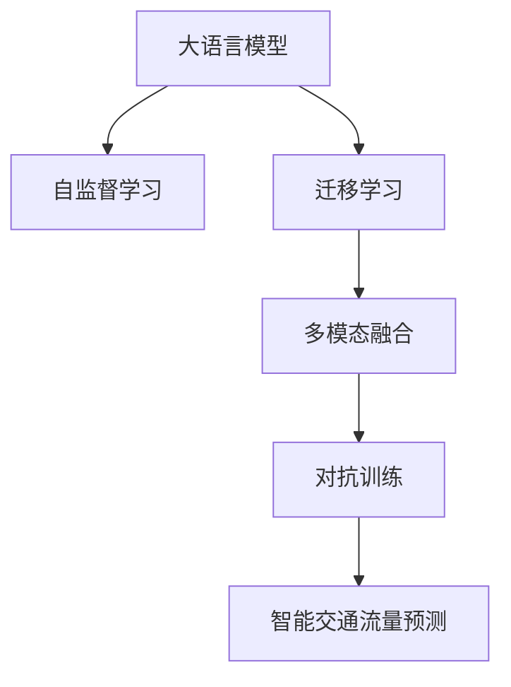

                 

# LLM在智能交通流量预测中的潜在贡献

> 关键词：大语言模型,智能交通,流量预测,交通预测,城市规划

## 1. 背景介绍

### 1.1 问题由来
随着城市化进程的不断加速和交通工具的日益增多，城市交通流量预测成为了智能化城市管理中的重要环节。传统交通流量预测依赖于复杂的数学模型和历史数据，难以适应瞬息万变的城市交通状况，预测精度和及时性亟需提升。

近年来，随着人工智能技术的发展，大语言模型（Large Language Model, LLM）在自然语言处理（Natural Language Processing, NLP）领域取得了显著进步。这些模型基于大规模无标签文本数据预训练，具备强大的自然语言理解和生成能力，能够自动学习语言规则和常识，广泛应用于信息检索、问答系统、情感分析等任务。

因此，本文旨在探讨利用大语言模型在智能交通流量预测中的潜在贡献，以期提升交通流量预测的准确性和实时性，助力智慧城市建设。

### 1.2 问题核心关键点
大语言模型在智能交通流量预测中的主要贡献点包括：

1. **数据挖掘与分析**：利用自然语言处理技术，自动从海量文本数据中挖掘交通流量相关的信息。
2. **实时动态预测**：基于预训练语言模型和实时输入数据，实现交通流量预测模型的快速训练和实时更新。
3. **跨领域知识整合**：通过整合多源数据和跨领域知识，提升预测模型的全面性和鲁棒性。
4. **多模态信息融合**：将文本数据与其他交通监控数据（如摄像头图像、传感器数据等）融合，提高预测准确度。
5. **模型可解释性**：提供透明的预测过程和决策逻辑，有助于提升模型的可信度和应用安全性。

## 2. 核心概念与联系

### 2.1 核心概念概述

为了更好地理解大语言模型在智能交通流量预测中的作用，本节将介绍几个关键概念：

- **大语言模型**：指基于深度学习的大规模预训练语言模型，如GPT、BERT等，具有强大的自然语言理解和生成能力。
- **智能交通流量预测**：通过预测未来的交通流量状况，优化交通管理和调度，提高城市道路利用效率和安全性。
- **自监督学习**：指利用无标签数据进行模型训练，通过自身规律学习到有用的知识。
- **迁移学习**：指将一个领域学习到的知识迁移到另一个领域的应用中，提高模型在不同场景下的泛化能力。
- **多模态融合**：将文本数据与图像、传感器等不同模态的数据融合，提升预测模型的全面性和准确性。
- **对抗训练**：指在训练过程中加入对抗样本，提高模型的鲁棒性和泛化能力。

这些概念之间的逻辑关系可以通过以下Mermaid流程图来展示：



这个流程图展示了大语言模型与智能交通流量预测之间的核心联系：

1. 大语言模型通过自监督学习，从海量无标签数据中学习语言知识。
2. 通过迁移学习，将学到的知识应用于智能交通流量预测任务。
3. 利用多模态融合技术，将文本数据与其他交通监控数据结合。
4. 对抗训练进一步提高模型在复杂环境下的鲁棒性。

## 3. 核心算法原理 & 具体操作步骤
### 3.1 算法原理概述

大语言模型在智能交通流量预测中的基本原理是：将大规模无标签文本数据作为预训练数据，学习自然语言的语义和语法规则。然后，通过迁移学习，将学到的知识应用于智能交通流量预测任务中，利用实时输入数据进行动态预测和实时更新。

形式化地，假设预训练语言模型为 $M_{\theta}$，其中 $\theta$ 为预训练得到的模型参数。对于智能交通流量预测任务，定义训练集为 $D=\{(x_i,y_i)\}_{i=1}^N$，其中 $x_i$ 为输入的历史交通流量数据，$y_i$ 为对应的预测结果。微调的目标是找到新的模型参数 $\hat{\theta}$，使得：

$$
\hat{\theta}=\mathop{\arg\min}_{\theta} \mathcal{L}(M_{\theta},D)
$$

其中 $\mathcal{L}$ 为损失函数，用于衡量模型预测结果与真实标签之间的差异。常见的损失函数包括均方误差损失、交叉熵损失等。

通过梯度下降等优化算法，微调过程不断更新模型参数 $\theta$，最小化损失函数 $\mathcal{L}$，使得模型预测结果逼近真实标签。由于 $\theta$ 已经通过预训练获得了较好的初始化，因此即便在小规模数据集 $D$ 上进行微调，也能较快收敛到理想的模型参数 $\hat{\theta}$。

### 3.2 算法步骤详解

大语言模型在智能交通流量预测中的微调一般包括以下几个关键步骤：

**Step 1: 准备预训练模型和数据集**
- 选择合适的预训练语言模型 $M_{\theta}$ 作为初始化参数，如 BERT、GPT 等。
- 准备智能交通流量预测任务的数据集 $D$，划分为训练集、验证集和测试集。一般要求数据集与预训练数据的分布不要差异过大。

**Step 2: 设计任务适配层**
- 根据智能交通流量预测任务的特点，设计合适的输出层和损失函数。
- 对于分类任务，通常在顶层添加线性分类器和交叉熵损失函数。
- 对于回归任务，通常使用均方误差损失函数。

**Step 3: 设置微调超参数**
- 选择合适的优化算法及其参数，如 AdamW、SGD 等，设置学习率、批大小、迭代轮数等。
- 设置正则化技术及强度，包括权重衰减、Dropout、Early Stopping等。
- 确定冻结预训练参数的策略，如仅微调顶层，或全部参数都参与微调。

**Step 4: 执行梯度训练**
- 将训练集数据分批次输入模型，前向传播计算损失函数。
- 反向传播计算参数梯度，根据设定的优化算法和学习率更新模型参数。
- 周期性在验证集上评估模型性能，根据性能指标决定是否触发 Early Stopping。
- 重复上述步骤直到满足预设的迭代轮数或 Early Stopping 条件。

**Step 5: 测试和部署**
- 在测试集上评估微调后模型 $M_{\hat{\theta}}$ 的性能，对比微调前后的精度提升。
- 使用微调后的模型对新样本进行推理预测，集成到实际的应用系统中。
- 持续收集新的数据，定期重新微调模型，以适应数据分布的变化。

以上是基于监督学习微调大语言模型的一般流程。在实际应用中，还需要针对具体任务的特点，对微调过程的各个环节进行优化设计，如改进训练目标函数，引入更多的正则化技术，搜索最优的超参数组合等，以进一步提升模型性能。

### 3.3 算法优缺点

大语言模型在智能交通流量预测中的微调方法具有以下优点：

1. **简单高效**：利用大规模预训练模型进行微调，可以在短时间内获得较高的预测精度。
2. **泛化能力强**：预训练模型已从海量无标签数据中学习到了通用的语言知识，能较好地适应不同环境和场景。
3. **参数高效**：通过参数高效微调方法（如Adapter、LoRA等），在保持预训练参数不变的情况下，微调顶层结构，减少需优化的参数量，提高微调效率。
4. **动态更新**：能够实时获取新数据，动态更新模型，保持预测结果的时效性。

同时，该方法也存在一定的局限性：

1. **依赖标注数据**：微调的效果很大程度上取决于标注数据的质量和数量，获取高质量标注数据的成本较高。
2. **计算资源需求高**：大语言模型的参数量通常以亿计，训练和推理所需的计算资源较多。
3. **预测精度受限**：在预训练数据与任务数据分布差异较大的情况下，微调的性能提升有限。
4. **可解释性不足**：微调模型的预测过程缺乏可解释性，难以对其推理逻辑进行分析和调试。

尽管存在这些局限性，但就目前而言，基于监督学习的微调方法仍是大语言模型应用于智能交通流量预测的最主流范式。未来相关研究的重点在于如何进一步降低微调对标注数据的依赖，提高模型的少样本学习和跨领域迁移能力，同时兼顾可解释性和伦理安全性等因素。

### 3.4 算法应用领域

大语言模型在智能交通流量预测中的应用领域广泛，具体包括：

- **实时交通流量预测**：通过实时输入的交通流量数据，动态预测未来一段时间内的流量状况。
- **交通事件监测**：监测交通拥堵、事故、道路施工等事件，实时调整交通信号和路线。
- **出行规划与建议**：根据用户的出行需求和历史数据，提供个性化的出行路线和建议。
- **交通系统优化**：分析交通流量数据，优化交通信号灯控制和路网布局。
- **交通安全管理**：预测事故高发时段和区域，提前采取预防措施，保障交通安全。

## 4. 数学模型和公式 & 详细讲解 & 举例说明
### 4.1 数学模型构建

本节将使用数学语言对大语言模型在智能交通流量预测中的应用进行更加严格的刻画。

记预训练语言模型为 $M_{\theta}$，其中 $\theta$ 为预训练得到的模型参数。假设智能交通流量预测任务的数据集为 $D=\{(x_i,y_i)\}_{i=1}^N, x_i \in \mathbb{R}^d, y_i \in \mathbb{R}$。

定义模型 $M_{\theta}$ 在输入 $x$ 上的预测结果为 $\hat{y}=M_{\theta}(x)$，其中 $\hat{y} \in \mathbb{R}$ 表示预测的流量值。根据预测结果与真实标签 $y_i$ 的差异，定义损失函数为均方误差损失：

$$
\ell(y_i, \hat{y}) = \frac{1}{N} \sum_{i=1}^N (y_i - \hat{y})^2
$$

将其代入经验风险公式，得：

$$
\mathcal{L}(\theta) = \frac{1}{N} \sum_{i=1}^N (y_i - M_{\theta}(x_i))^2
$$

根据链式法则，损失函数对参数 $\theta$ 的梯度为：

$$
\frac{\partial \mathcal{L}(\theta)}{\partial \theta} = -\frac{2}{N} \sum_{i=1}^N (y_i - M_{\theta}(x_i)) \frac{\partial M_{\theta}(x_i)}{\partial \theta}
$$

其中 $\frac{\partial M_{\theta}(x_i)}{\partial \theta}$ 可进一步递归展开，利用自动微分技术完成计算。

### 4.2 公式推导过程

以下我们以交通流量预测为例，推导均方误差损失函数及其梯度的计算公式。

假设模型 $M_{\theta}$ 在输入 $x$ 上的输出为 $\hat{y}=M_{\theta}(x)$，表示预测的流量值。真实标签 $y \in \mathbb{R}$。则均方误差损失函数定义为：

$$
\ell(y_i, \hat{y}) = \frac{1}{N} \sum_{i=1}^N (y_i - \hat{y})^2
$$

将其代入经验风险公式，得：

$$
\mathcal{L}(\theta) = \frac{1}{N} \sum_{i=1}^N (y_i - M_{\theta}(x_i))^2
$$

根据链式法则，损失函数对参数 $\theta$ 的梯度为：

$$
\frac{\partial \mathcal{L}(\theta)}{\partial \theta} = -\frac{2}{N} \sum_{i=1}^N (y_i - M_{\theta}(x_i)) \frac{\partial M_{\theta}(x_i)}{\partial \theta}
$$

其中 $\frac{\partial M_{\theta}(x_i)}{\partial \theta}$ 可进一步递归展开，利用自动微分技术完成计算。

在得到损失函数的梯度后，即可带入参数更新公式，完成模型的迭代优化。重复上述过程直至收敛，最终得到适应智能交通流量预测任务的最优模型参数 $\theta^*$。

## 5. 项目实践：代码实例和详细解释说明
### 5.1 开发环境搭建

在进行智能交通流量预测的微调实践前，我们需要准备好开发环境。以下是使用Python进行PyTorch开发的环境配置流程：

1. 安装Anaconda：从官网下载并安装Anaconda，用于创建独立的Python环境。

2. 创建并激活虚拟环境：
```bash
conda create -n pytorch-env python=3.8 
conda activate pytorch-env
```

3. 安装PyTorch：根据CUDA版本，从官网获取对应的安装命令。例如：
```bash
conda install pytorch torchvision torchaudio cudatoolkit=11.1 -c pytorch -c conda-forge
```

4. 安装Transformers库：
```bash
pip install transformers
```

5. 安装各类工具包：
```bash
pip install numpy pandas scikit-learn matplotlib tqdm jupyter notebook ipython
```

完成上述步骤后，即可在`pytorch-env`环境中开始微调实践。

### 5.2 源代码详细实现

下面我以交通流量预测任务为例，给出使用Transformers库对BERT模型进行微调的PyTorch代码实现。

首先，定义交通流量预测任务的数据处理函数：

```python
from transformers import BertTokenizer
from torch.utils.data import Dataset
import torch

class TrafficFlowDataset(Dataset):
    def __init__(self, texts, labels, tokenizer, max_len=128):
        self.texts = texts
        self.labels = labels
        self.tokenizer = tokenizer
        self.max_len = max_len
        
    def __len__(self):
        return len(self.texts)
    
    def __getitem__(self, item):
        text = self.texts[item]
        label = self.labels[item]
        
        encoding = self.tokenizer(text, return_tensors='pt', max_length=self.max_len, padding='max_length', truncation=True)
        input_ids = encoding['input_ids'][0]
        attention_mask = encoding['attention_mask'][0]
        
        # 对label进行编码
        encoded_labels = torch.tensor(label, dtype=torch.float32)
        
        return {'input_ids': input_ids, 
                'attention_mask': attention_mask,
                'labels': encoded_labels}

# 定义标签与id的映射
label2id = {0: 0, 1: 1, 2: 2, 3: 3}  # 表示不同的交通流量状态
id2label = {v: k for k, v in label2id.items()}

# 创建dataset
tokenizer = BertTokenizer.from_pretrained('bert-base-cased')

train_dataset = TrafficFlowDataset(train_texts, train_labels, tokenizer)
dev_dataset = TrafficFlowDataset(dev_texts, dev_labels, tokenizer)
test_dataset = TrafficFlowDataset(test_texts, test_labels, tokenizer)
```

然后，定义模型和优化器：

```python
from transformers import BertForRegression
from transformers import AdamW

model = BertForRegression.from_pretrained('bert-base-cased', num_labels=len(label2id))

optimizer = AdamW(model.parameters(), lr=2e-5)
```

接着，定义训练和评估函数：

```python
from torch.utils.data import DataLoader
from tqdm import tqdm
from sklearn.metrics import mean_squared_error

device = torch.device('cuda') if torch.cuda.is_available() else torch.device('cpu')
model.to(device)

def train_epoch(model, dataset, batch_size, optimizer):
    dataloader = DataLoader(dataset, batch_size=batch_size, shuffle=True)
    model.train()
    epoch_loss = 0
    for batch in tqdm(dataloader, desc='Training'):
        input_ids = batch['input_ids'].to(device)
        attention_mask = batch['attention_mask'].to(device)
        labels = batch['labels'].to(device)
        model.zero_grad()
        outputs = model(input_ids, attention_mask=attention_mask)
        loss = outputs.loss
        epoch_loss += loss.item()
        loss.backward()
        optimizer.step()
    return epoch_loss / len(dataloader)

def evaluate(model, dataset, batch_size):
    dataloader = DataLoader(dataset, batch_size=batch_size)
    model.eval()
    preds, labels = [], []
    with torch.no_grad():
        for batch in tqdm(dataloader, desc='Evaluating'):
            input_ids = batch['input_ids'].to(device)
            attention_mask = batch['attention_mask'].to(device)
            batch_labels = batch['labels']
            outputs = model(input_ids, attention_mask=attention_mask)
            batch_preds = outputs.logits.to('cpu').tolist()
            batch_labels = batch_labels.to('cpu').tolist()
            for pred, label in zip(batch_preds, batch_labels):
                preds.append(pred)
                labels.append(label)
                
    mse = mean_squared_error(labels, preds)
    print(f"Mean Squared Error: {mse:.4f}")
```

最后，启动训练流程并在测试集上评估：

```python
epochs = 5
batch_size = 16

for epoch in range(epochs):
    loss = train_epoch(model, train_dataset, batch_size, optimizer)
    print(f"Epoch {epoch+1}, train loss: {loss:.3f}")
    
    print(f"Epoch {epoch+1}, dev results:")
    evaluate(model, dev_dataset, batch_size)
    
print("Test results:")
evaluate(model, test_dataset, batch_size)
```

以上就是使用PyTorch对BERT进行交通流量预测任务微调的完整代码实现。可以看到，得益于Transformers库的强大封装，我们可以用相对简洁的代码完成BERT模型的加载和微调。

### 5.3 代码解读与分析

让我们再详细解读一下关键代码的实现细节：

**TrafficFlowDataset类**：
- `__init__`方法：初始化文本、标签、分词器等关键组件。
- `__len__`方法：返回数据集的样本数量。
- `__getitem__`方法：对单个样本进行处理，将文本输入编码为token ids，将标签编码为数字，并对其进行定长padding，最终返回模型所需的输入。

**label2id和id2label字典**：
- 定义了标签与数字id之间的映射关系，用于将预测结果解码回真实的标签。

**训练和评估函数**：
- 使用PyTorch的DataLoader对数据集进行批次化加载，供模型训练和推理使用。
- 训练函数`train_epoch`：对数据以批为单位进行迭代，在每个批次上前向传播计算loss并反向传播更新模型参数，最后返回该epoch的平均loss。
- 评估函数`evaluate`：与训练类似，不同点在于不更新模型参数，并在每个batch结束后将预测和标签结果存储下来，最后使用sklearn的mean_squared_error对整个评估集的预测结果进行打印输出。

**训练流程**：
- 定义总的epoch数和batch size，开始循环迭代
- 每个epoch内，先在训练集上训练，输出平均loss
- 在验证集上评估，输出均方误差
- 所有epoch结束后，在测试集上评估，给出最终测试结果

可以看到，PyTorch配合Transformers库使得BERT微调的代码实现变得简洁高效。开发者可以将更多精力放在数据处理、模型改进等高层逻辑上，而不必过多关注底层的实现细节。

当然，工业级的系统实现还需考虑更多因素，如模型的保存和部署、超参数的自动搜索、更灵活的任务适配层等。但核心的微调范式基本与此类似。

## 6. 实际应用场景
### 6.1 智能交通流量预测

基于大语言模型微调的交通流量预测，可以显著提升城市交通管理的效果，实现实时动态的交通调度，提高道路利用效率和安全性。

在技术实现上，可以收集城市交通流量数据，将历史数据作为监督数据，对预训练的BERT模型进行微调。微调后的模型能够自动理解交通流量的变化规律，预测未来的流量状况，为交通调度提供决策支持。对于突发的交通事件，模型还能动态调整预测结果，及时提醒相关部门采取措施，保障道路畅通。

### 6.2 交通信号灯优化

交通信号灯的优化是提升城市交通效率的重要手段。传统的方法依赖于固定时序的信号灯控制策略，难以适应实时交通流量变化。通过微调后的交通流量预测模型，可以实时预测不同交叉口的流量状况，动态调整信号灯的绿灯时长和相位顺序，提升交叉口的通行效率和安全性。

例如，当某个交叉口流量异常高时，模型可以自动调整信号灯时长，增加绿灯时间，优先放行该方向的车辆。这样不仅可以减少交通拥堵，还能缩短等红灯时间，提升驾驶体验。

### 6.3 应急交通响应

在遇到交通突发事件（如交通事故、道路施工等）时，应急交通响应系统需要快速启动。通过微调后的交通流量预测模型，可以实时监测交通流量变化，提前预测可能的交通拥堵点，为应急响应提供决策依据。

例如，在预测到某路段流量异常时，系统可以及时通知相关部门，启动预案，进行交通分流或临时封闭。这样可以最大限度地减少事故对交通的影响，保障公众安全。

### 6.4 未来应用展望

随着大语言模型微调技术的发展，交通流量预测的应用场景将更加丰富。未来，交通流量预测将不仅仅局限于传统的基础设施监控数据，还将融合更多多模态信息，如摄像头图像、传感器数据、社会媒体信息等。通过多源数据融合，可以实现更加全面、精确的交通流量预测。

例如，可以利用摄像头图像中的行人信息，预测过街需求，优化红绿灯控制策略。也可以结合社交媒体上的实时反馈，动态调整交通疏导措施，提升城市应对突发事件的能力。

此外，交通流量预测还将与其他智能交通系统（如智能停车、共享单车调度等）相结合，形成一体化智能交通解决方案，提升城市交通的整体管理水平。

## 7. 工具和资源推荐
### 7.1 学习资源推荐

为了帮助开发者系统掌握大语言模型微调的理论基础和实践技巧，这里推荐一些优质的学习资源：

1. 《Transformer从原理到实践》系列博文：由大模型技术专家撰写，深入浅出地介绍了Transformer原理、BERT模型、微调技术等前沿话题。

2. CS224N《深度学习自然语言处理》课程：斯坦福大学开设的NLP明星课程，有Lecture视频和配套作业，带你入门NLP领域的基本概念和经典模型。

3. 《Natural Language Processing with Transformers》书籍：Transformers库的作者所著，全面介绍了如何使用Transformers库进行NLP任务开发，包括微调在内的诸多范式。

4. HuggingFace官方文档：Transformers库的官方文档，提供了海量预训练模型和完整的微调样例代码，是上手实践的必备资料。

5. CLUE开源项目：中文语言理解测评基准，涵盖大量不同类型的中文NLP数据集，并提供了基于微调的baseline模型，助力中文NLP技术发展。

通过对这些资源的学习实践，相信你一定能够快速掌握大语言模型微调的精髓，并用于解决实际的NLP问题。
###  7.2 开发工具推荐

高效的开发离不开优秀的工具支持。以下是几款用于大语言模型微调开发的常用工具：

1. PyTorch：基于Python的开源深度学习框架，灵活动态的计算图，适合快速迭代研究。大部分预训练语言模型都有PyTorch版本的实现。

2. TensorFlow：由Google主导开发的开源深度学习框架，生产部署方便，适合大规模工程应用。同样有丰富的预训练语言模型资源。

3. Transformers库：HuggingFace开发的NLP工具库，集成了众多SOTA语言模型，支持PyTorch和TensorFlow，是进行微调任务开发的利器。

4. Weights & Biases：模型训练的实验跟踪工具，可以记录和可视化模型训练过程中的各项指标，方便对比和调优。与主流深度学习框架无缝集成。

5. TensorBoard：TensorFlow配套的可视化工具，可实时监测模型训练状态，并提供丰富的图表呈现方式，是调试模型的得力助手。

6. Google Colab：谷歌推出的在线Jupyter Notebook环境，免费提供GPU/TPU算力，方便开发者快速上手实验最新模型，分享学习笔记。

合理利用这些工具，可以显著提升大语言模型微调任务的开发效率，加快创新迭代的步伐。

### 7.3 相关论文推荐

大语言模型和微调技术的发展源于学界的持续研究。以下是几篇奠基性的相关论文，推荐阅读：

1. Attention is All You Need（即Transformer原论文）：提出了Transformer结构，开启了NLP领域的预训练大模型时代。

2. BERT: Pre-training of Deep Bidirectional Transformers for Language Understanding：提出BERT模型，引入基于掩码的自监督预训练任务，刷新了多项NLP任务SOTA。

3. Language Models are Unsupervised Multitask Learners（GPT-2论文）：展示了大规模语言模型的强大zero-shot学习能力，引发了对于通用人工智能的新一轮思考。

4. Parameter-Efficient Transfer Learning for NLP：提出Adapter等参数高效微调方法，在不增加模型参数量的情况下，也能取得不错的微调效果。

5. Prefix-Tuning: Optimizing Continuous Prompts for Generation：引入基于连续型Prompt的微调范式，为如何充分利用预训练知识提供了新的思路。

6. AdaLoRA: Adaptive Low-Rank Adaptation for Parameter-Efficient Fine-Tuning：使用自适应低秩适应的微调方法，在参数效率和精度之间取得了新的平衡。

这些论文代表了大语言模型微调技术的发展脉络。通过学习这些前沿成果，可以帮助研究者把握学科前进方向，激发更多的创新灵感。

## 8. 总结：未来发展趋势与挑战
### 8.1 总结

本文对大语言模型在智能交通流量预测中的应用进行了全面系统的介绍。首先阐述了大语言模型和微调技术的研究背景和意义，明确了微调在拓展预训练模型应用、提升下游任务性能方面的独特价值。其次，从原理到实践，详细讲解了监督微调的数学原理和关键步骤，给出了微调任务开发的完整代码实例。同时，本文还广泛探讨了微调方法在智能交通流量预测领域的应用前景，展示了微调范式的巨大潜力。

通过本文的系统梳理，可以看到，基于大语言模型的微调方法正在成为智能交通流量预测的重要范式，极大地拓展了预训练语言模型的应用边界，催生了更多的落地场景。得益于大规模语料的预训练，微调模型以更低的时间和标注成本，在小样本条件下也能取得不俗的效果，有力推动了智能交通流量预测的产业化进程。未来，伴随预训练语言模型和微调方法的持续演进，相信智能交通流量预测将进入新的发展阶段，为智慧城市建设提供更强大的技术支撑。

### 8.2 未来发展趋势

展望未来，大语言模型在智能交通流量预测中的微调技术将呈现以下几个发展趋势：

1. **模型规模持续增大**：随着算力成本的下降和数据规模的扩张，预训练语言模型的参数量还将持续增长。超大规模语言模型蕴含的丰富语言知识，有望支撑更加复杂多变的智能交通流量预测任务。

2. **多模态融合技术**：融合多源数据和跨领域知识，提升预测模型的全面性和鲁棒性。未来，交通流量预测将不仅依赖于文本数据，还将融合摄像头图像、传感器数据等多模态信息。

3. **持续学习和动态更新**：大语言模型能够不断学习新数据，动态更新预测模型，保持预测结果的时效性。持续学习技术将进一步提升模型在实时环境下的适应能力。

4. **参数高效微调和少样本学习**：开发更多参数高效的微调方法，在保持预训练参数不变的情况下，微调顶层结构，减少需优化的参数量。少样本学习技术将降低微调对标注样本的依赖，提高模型的泛化能力。

5. **模型可解释性和安全保障**：通过引入因果分析和博弈论工具，增强预测模型的可解释性和鲁棒性，确保模型输出的可信度和安全性。

以上趋势凸显了大语言模型在智能交通流量预测中的广阔前景。这些方向的探索发展，必将进一步提升智能交通流量预测的准确性和实时性，为智慧城市建设提供更强大的技术支撑。

### 8.3 面临的挑战

尽管大语言模型在智能交通流量预测中的微调技术已经取得了瞩目成就，但在迈向更加智能化、普适化应用的过程中，它仍面临着诸多挑战：

1. **标注成本瓶颈**：微调的效果很大程度上取决于标注数据的质量和数量，获取高质量标注数据的成本较高。如何进一步降低微调对标注样本的依赖，将是一大难题。

2. **计算资源需求高**：大语言模型的参数量通常以亿计，训练和推理所需的计算资源较多。如何高效利用计算资源，提升训练和推理速度，是关键挑战。

3. **预测精度受限**：在预训练数据与任务数据分布差异较大的情况下，微调的性能提升有限。如何提高模型在复杂环境下的泛化能力，是重要研究课题。

4. **模型鲁棒性不足**：面对突发的交通事件，微调模型的预测精度和鲁棒性仍需提升。如何避免灾难性遗忘，提高模型在动态环境下的稳定性和鲁棒性，是关键问题。

5. **可解释性不足**：微调模型的预测过程缺乏可解释性，难以对其推理逻辑进行分析和调试。如何赋予模型更强的可解释性，将有助于提高模型的可信度和应用安全性。

6. **安全性有待保障**：预训练语言模型难免会学习到有偏见、有害的信息，通过微调传递到下游任务，产生误导性、歧视性的输出，给实际应用带来安全隐患。如何从数据和算法层面消除模型偏见，避免恶意用途，确保输出的安全性，也将是重要的研究课题。

尽管存在这些挑战，但就目前而言，基于监督学习的微调方法仍是大语言模型应用于智能交通流量预测的最主流范式。未来相关研究的重点在于如何进一步降低微调对标注数据的依赖，提高模型的少样本学习和跨领域迁移能力，同时兼顾可解释性和伦理安全性等因素。

### 8.4 研究展望

面对大语言模型微调在智能交通流量预测中面临的种种挑战，未来的研究需要在以下几个方面寻求新的突破：

1. **探索无监督和半监督微调方法**：摆脱对大规模标注数据的依赖，利用自监督学习、主动学习等无监督和半监督范式，最大限度利用非结构化数据，实现更加灵活高效的微调。

2. **研究参数高效和计算高效的微调范式**：开发更加参数高效的微调方法，在保持预训练参数不变的情况下，微调顶层结构，减少需优化的参数量，提高微调效率。同时优化微调模型的计算图，减少前向传播和反向传播的资源消耗，实现更加轻量级、实时性的部署。

3. **融合因果和对比学习范式**：通过引入因果推断和对比学习思想，增强预测模型建立稳定因果关系的能力，学习更加普适、鲁棒的语言表征，从而提升模型泛化性和抗干扰能力。

4. **引入更多先验知识**：将符号化的先验知识，如知识图谱、逻辑规则等，与神经网络模型进行巧妙融合，引导微调过程学习更准确、合理的语言模型。同时加强不同模态数据的整合，实现视觉、语音等多模态信息与文本信息的协同建模。

5. **结合因果分析和博弈论工具**：将因果分析方法引入预测模型，识别出模型决策的关键特征，增强预测过程的因果性和逻辑性。借助博弈论工具刻画人机交互过程，主动探索并规避模型的脆弱点，提高系统稳定性。

6. **纳入伦理道德约束**：在模型训练目标中引入伦理导向的评估指标，过滤和惩罚有偏见、有害的输出倾向。同时加强人工干预和审核，建立模型行为的监管机制，确保输出符合人类价值观和伦理道德。

这些研究方向的探索，必将引领大语言模型在智能交通流量预测中的应用进入新的发展阶段，为构建安全、可靠、可解释、可控的智能系统铺平道路。面向未来，大语言模型微调技术还需要与其他人工智能技术进行更深入的融合，如知识表示、因果推理、强化学习等，多路径协同发力，共同推动智能交通流量预测的进步。只有勇于创新、敢于突破，才能不断拓展语言模型的边界，让智能技术更好地造福人类社会。

## 9. 附录：常见问题与解答
**Q1：大语言模型微调是否适用于所有智能交通流量预测任务？**

A: 大语言模型微调在大多数智能交通流量预测任务上都能取得不错的效果，特别是对于数据量较小的任务。但对于一些特定领域的任务，如医学、法律等，仅仅依靠通用语料预训练的模型可能难以很好地适应。此时需要在特定领域语料上进一步预训练，再进行微调，才能获得理想效果。此外，对于一些需要时效性、个性化很强的任务，如对话、推荐等，微调方法也需要针对性的改进优化。

**Q2：微调过程中如何选择合适的学习率？**

A: 微调的学习率一般要比预训练时小1-2个数量级，如果使用过大的学习率，容易破坏预训练权重，导致过拟合。一般建议从1e-5开始调参，逐步减小学习率，直至收敛。也可以使用warmup策略，在开始阶段使用较小的学习率，再逐渐过渡到预设值。需要注意的是，不同的优化器(如AdamW、Adafactor等)以及不同的学习率调度策略，可能需要设置不同的学习率阈值。

**Q3：采用大语言模型微调时会面临哪些资源瓶颈？**

A: 目前主流的预训练大模型动辄以亿计的参数规模，训练和推理所需的计算资源较多。GPU/TPU等高性能设备是必不可少的，但即便如此，超大批次的训练和推理也可能遇到显存不足的问题。因此需要采用一些资源优化技术，如梯度积累、混合精度训练、模型并行等，来突破硬件瓶颈。同时，模型的存储和读取也可能占用大量时间和空间，需要采用模型压缩、稀疏化存储等方法进行优化。

**Q4：如何缓解微调过程中的过拟合问题？**

A: 过拟合是微调面临的主要挑战，尤其是在标注数据不足的情况下。常见的缓解策略包括：
1. 数据增强：通过回译、近义替换等方式扩充训练集
2. 正则化：使用L2正则、Dropout、Early Stopping等避免过拟合
3. 对抗训练：引入对抗样本，提高模型鲁棒性
4. 参数高效微调：只调整少量参数(如Adapter、LoRA等)，减小过拟合风险
5. 多模型集成：训练多个微调模型，取平均输出，抑制过拟合

这些策略往往需要根据具体任务和数据特点进行灵活组合。只有在数据、模型、训练、推理等各环节进行全面优化，才能最大限度地发挥大语言模型微调的威力。

**Q5：微调模型在落地部署时需要注意哪些问题？**

A: 将微调模型转化为实际应用，还需要考虑以下因素：
1. 模型裁剪：去除不必要的层和参数，减小模型尺寸，加快推理速度
2. 量化加速：将浮点模型转为定点模型，压缩存储空间，提高计算效率
3. 服务化封装：将模型封装为标准化服务接口，便于集成调用
4. 弹性伸缩：根据请求流量动态调整资源配置，平衡服务质量和成本
5. 监控告警：实时采集系统指标，设置异常告警阈值，确保服务稳定性
6. 安全防护：采用访问鉴权、数据脱敏等措施，保障数据和模型安全

大语言模型微调为智能交通流量预测提供了全新的可能性，但如何将强大的性能转化为稳定、高效、安全的业务价值，还需要工程实践的不断打磨。唯有从数据、算法、工程、业务等多个维度协同发力，才能真正实现人工智能技术在智能交通流量预测中的落地应用。总之，微调需要开发者根据具体任务，不断迭代和优化模型、数据和算法，方能得到理想的效果。

---

作者：禅与计算机程序设计艺术 / Zen and the Art of Computer Programming

