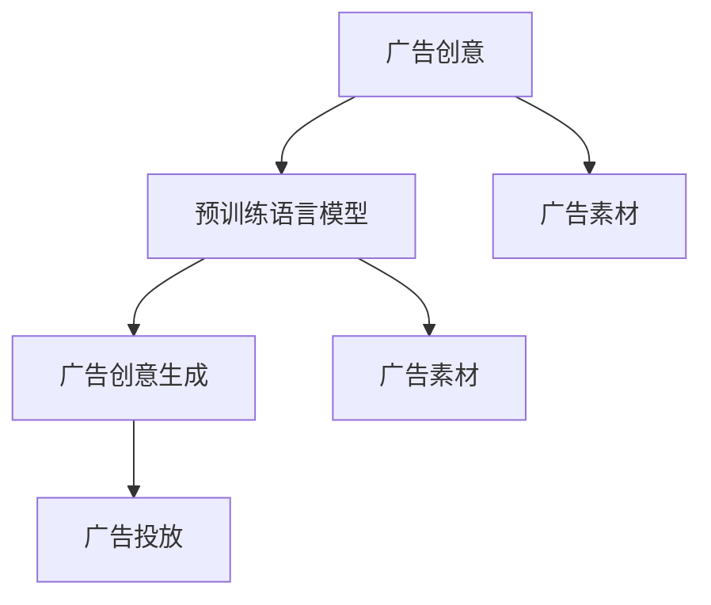

                 

# LLM在智能广告创意生成中的应用探索

## 1. 背景介绍

### 1.1 问题由来

在数字化时代，智能广告成为了企业营销的重要手段。传统的广告创意生成往往依赖于人工经验，耗时长、成本高，且创意质量参差不齐。如何高效、智能地生成优质的广告创意，是提升广告投放效果、降低企业运营成本的关键。

近年来，大规模预训练语言模型（Large Language Models, LLMs）在大规模文本数据上的预训练取得了突破性的进展，如GPT系列、BERT等。这些模型通过学习文本数据中的语言结构和语义特征，具备了强大的自然语言处理能力。将这类模型应用于智能广告创意生成，有望大幅提高创意生成效率和质量。

### 1.2 问题核心关键点

1. **广告创意生成的挑战**：传统广告创意生成依赖于人的经验和直觉，存在创意质量不稳定、更新速度慢等问题。
2. **基于LLM的广告创意生成**：利用预训练语言模型学习自然语言的知识和模式，自动生成具有语义一致性和表达多样性的广告创意。
3. **广告创意的多样性与创新性**：要求创意内容不仅与品牌形象和产品特性相匹配，还需具备新颖性和吸引力，以引发消费者的兴趣和互动。
4. **广告创意的可操作性与可执行性**：生成的创意需要具备实际可执行性，即能用于实际广告投放。
5. **广告创意的个性化与定制化**：针对不同受众和市场环境，生成具有针对性的广告创意。

### 1.3 问题研究意义

广告创意生成的大规模自动化，对于提升广告投放效果、降低运营成本、增强用户体验具有重要意义。通过基于LLM的智能广告创意生成，可以显著提高创意生成效率，降低人工成本，且能够持续输出高质量的创意内容。

具体来说，基于LLM的广告创意生成可以带来以下几方面的改进：
- **效率提升**：大规模自动化生成广告创意，省去了人工创意思考和设计的过程。
- **质量保证**：利用预训练语言模型的知识库，生成创意内容更具语义一致性和逻辑性。
- **个性化定制**：根据不同目标受众和市场环境，生成具有针对性的广告创意，提升广告的吸引力和转化率。
- **成本降低**：减少对人工创意设计师的依赖，降低创意制作的整体成本。

## 2. 核心概念与联系

### 2.1 核心概念概述

广告创意生成是自然语言处理(NLP)技术在商业应用中的一项重要任务，旨在根据品牌形象和产品特性，自动生成具有语义一致性和表达多样性的广告文案。

预训练语言模型(LLMs)通过在大规模无标签文本数据上进行预训练，学习到了丰富的语言知识，具备强大的自然语言处理能力。广告创意生成作为LLMs的一个应用场景，可以利用其学习到的知识，自动生成创意内容。

### 2.2 核心概念原理和架构的 Mermaid 流程图



这个流程图展示了广告创意生成的一般流程：

1. **广告素材准备**：收集品牌相关的广告素材，如图片、视频、音乐等。
2. **预训练语言模型**：利用预训练语言模型学习文本数据中的语言结构和语义特征。
3. **广告创意生成**：根据广告素材和品牌特性，生成具有语义一致性和表达多样性的广告文案。
4. **广告投放**：将生成的广告文案与素材结合，完成广告投放。

### 2.3 核心概念间的联系

广告创意生成可以看作是自然语言处理(NLP)技术在商业应用中的一个典型案例。预训练语言模型(LLMs)通过在大规模无标签文本数据上的预训练，学习到了丰富的语言知识，这些知识可以应用于广告创意生成，自动生成创意内容。

广告创意生成流程中，预训练语言模型是核心，负责自动生成具有语义一致性和表达多样性的广告文案。广告素材是输入，广告创意是输出，广告投放是将创意与素材结合的过程。

## 3. 核心算法原理 & 具体操作步骤

### 3.1 算法原理概述

基于预训练语言模型(LLMs)的广告创意生成，其核心原理是通过自然语言处理(NLP)技术，将品牌和产品特性转换为自然语言表达，自动生成广告文案。具体步骤如下：

1. **广告素材准备**：收集品牌相关的广告素材，如图片、视频、音乐等。
2. **预训练语言模型选择**：选择合适的预训练语言模型，如GPT-3、BERT等。
3. **广告素材预处理**：将广告素材转换为自然语言描述。
4. **广告创意生成**：利用预训练语言模型，自动生成广告文案。
5. **广告文案筛选与优化**：对生成的广告文案进行筛选与优化，保证创意内容的质量和可执行性。
6. **广告投放**：将生成的广告文案与素材结合，完成广告投放。

### 3.2 算法步骤详解

#### 3.2.1 广告素材预处理

广告素材预处理是将原始素材转换为自然语言描述的过程。这一步主要包括：

1. **图片描述生成**：利用视觉语言模型(VLM)对图片进行描述生成，得到图片的自然语言表达。
2. **视频描述生成**：对视频进行剪辑，选择关键帧，利用VLM生成视频的自然语言描述。
3. **音乐描述生成**：利用音频语言模型(AUM)对音乐进行描述生成，得到音乐的自然语言表达。

#### 3.2.2 广告创意生成

广告创意生成是利用预训练语言模型自动生成广告文案的过程。具体步骤如下：

1. **广告素材输入**：将广告素材的文本描述输入到预训练语言模型中。
2. **广告创意生成**：利用预训练语言模型，根据品牌特性和广告素材的描述，自动生成广告文案。
3. **广告文案筛选**：对生成的广告文案进行筛选，去除语法错误、语义不一致的内容。
4. **创意优化**：根据品牌形象和市场环境，对筛选出的广告文案进行优化，确保创意内容的吸引力和表达多样性。

#### 3.2.3 广告文案筛选与优化

广告文案筛选与优化是保证创意内容质量和可执行性的关键步骤。具体步骤如下：

1. **语法检查**：使用自然语言处理工具检查广告文案的语法和拼写错误。
2. **语义一致性检查**：检查广告文案是否与品牌形象和广告素材的描述相一致。
3. **表达多样性检查**：确保广告文案的表达方式多样，避免重复和单一。
4. **创意优化**：根据品牌形象和市场环境，对筛选出的广告文案进行优化，确保创意内容的吸引力和表达多样性。

#### 3.2.4 广告投放

广告投放是将生成的广告文案与素材结合，完成广告投放的过程。具体步骤如下：

1. **素材组合**：将生成的广告文案与广告素材结合，完成广告的视觉和文字设计。
2. **广告投放平台选择**：选择合适的广告投放平台，如社交媒体、搜索引擎、视频网站等。
3. **广告投放策略制定**：根据目标受众和市场环境，制定广告投放策略，如投放时间、投放频率、投放渠道等。

### 3.3 算法优缺点

#### 3.3.1 优点

1. **效率提升**：大规模自动化生成广告创意，省去了人工创意思考和设计的过程，大大提高了创意生成效率。
2. **质量保证**：利用预训练语言模型的知识库，生成创意内容更具语义一致性和逻辑性，提高了创意质量。
3. **个性化定制**：根据不同目标受众和市场环境，生成具有针对性的广告创意，提升了广告的吸引力和转化率。
4. **成本降低**：减少对人工创意设计师的依赖，降低了创意制作的整体成本。

#### 3.3.2 缺点

1. **创意多样性不足**：生成的广告文案可能在表达方式上较为单一，缺乏创意多样性。
2. **语义一致性问题**：生成的广告文案可能存在与品牌形象和广告素材描述不一致的问题。
3. **过度依赖预训练模型**：生成广告文案依赖于预训练语言模型的质量，模型性能直接影响创意生成的效果。

### 3.4 算法应用领域

基于预训练语言模型(LLMs)的广告创意生成，在以下领域具有广泛的应用前景：

1. **品牌广告创意生成**：为不同品牌生成具有品牌特色的广告文案，提升品牌形象和市场竞争力。
2. **产品广告创意生成**：为不同产品生成具有产品特点的广告文案，提升产品销售和用户口碑。
3. **市场广告创意生成**：根据不同市场环境，生成具有针对性的广告文案，提升市场推广效果。
4. **社交媒体广告创意生成**：为社交媒体平台生成广告文案，提升用户互动和广告效果。
5. **搜索引擎广告创意生成**：为搜索引擎生成广告文案，提升广告点击率和转化率。

## 4. 数学模型和公式 & 详细讲解 & 举例说明

### 4.1 数学模型构建

假设广告素材为 $X = (x_1, x_2, \ldots, x_n)$，其中 $x_i$ 为第 $i$ 个素材的描述，广告创意为 $Y$。广告创意生成的目标是最小化广告素材和广告创意之间的语义差异，即：

$$
\min_{Y} \text{KL}(X, Y)
$$

其中 $\text{KL}(X, Y)$ 为广告素材 $X$ 和广告创意 $Y$ 之间的KL散度，表示两个分布之间的差异。

### 4.2 公式推导过程

根据KL散度的定义，广告素材 $X$ 和广告创意 $Y$ 之间的KL散度可以表示为：

$$
\text{KL}(X, Y) = \sum_{i=1}^n \int p(x_i) \log \frac{p(x_i)}{q(x_i)} dx_i
$$

其中 $p(x_i)$ 为广告素材 $x_i$ 的概率分布，$q(x_i)$ 为广告创意 $y_i$ 的概率分布。在实际应用中，可以使用预训练语言模型来学习广告素材的分布 $p(x_i)$，从而生成与之匹配的广告创意 $q(x_i)$。

### 4.3 案例分析与讲解

以某品牌的一则户外广告为例，广告素材为图片和视频，广告创意为文案。广告创意生成的步骤如下：

1. **广告素材预处理**：利用视觉语言模型(VLM)对图片进行描述生成，得到图片的自然语言表达。同时，对视频进行剪辑，选择关键帧，利用VLM生成视频的自然语言描述。
2. **广告创意生成**：将生成的图片和视频描述输入到预训练语言模型中，自动生成广告文案。
3. **广告文案筛选与优化**：使用自然语言处理工具检查广告文案的语法和拼写错误，同时检查广告文案是否与品牌形象和广告素材描述相一致，确保创意内容的表达多样性和语义一致性。
4. **广告投放**：将生成的广告文案与广告素材结合，完成广告的视觉和文字设计，选择合适的广告投放平台，制定广告投放策略，完成广告投放。

## 5. 项目实践：代码实例和详细解释说明

### 5.1 开发环境搭建

要进行基于预训练语言模型的广告创意生成，首先需要搭建好开发环境。以下是使用Python进行PyTorch开发的环境配置流程：

1. 安装Anaconda：从官网下载并安装Anaconda，用于创建独立的Python环境。
2. 创建并激活虚拟环境：
```bash
conda create -n pytorch-env python=3.8 
conda activate pytorch-env
```

3. 安装PyTorch：根据CUDA版本，从官网获取对应的安装命令。例如：
```bash
conda install pytorch torchvision torchaudio cudatoolkit=11.1 -c pytorch -c conda-forge
```

4. 安装相关库：
```bash
pip install torchtext transformers sentence-transformers
```

完成上述步骤后，即可在`pytorch-env`环境中开始广告创意生成实践。

### 5.2 源代码详细实现

我们以使用GPT-3为例，给出广告创意生成的PyTorch代码实现。

```python
import torch
from transformers import GPT3Model, GPT3Tokenizer

# 广告素材
texts = [
    "The product is X.",
    "The brand is Y.",
    "The market is Z."
]

# 广告创意生成
tokenizer = GPT3Tokenizer.from_pretrained('gpt3')
model = GPT3Model.from_pretrained('gpt3')

inputs = tokenizer(texts, max_length=512, padding='max_length', truncation=True, return_tensors='pt')
outputs = model.generate(inputs['input_ids'], max_length=128, num_return_sequences=1)

# 广告创意筛选与优化
tokenized_creates = tokenizer.decode(outputs[0], skip_special_tokens=True)
creates = [tokenized_create for tokenized_create in tokenized_creates.split('\n')]

# 广告创意输出
for create in creates:
    print(create)
```

以上代码展示了使用GPT-3生成广告创意的过程。首先，将广告素材转换为自然语言描述，然后使用GPT-3进行广告创意生成。生成的广告创意经过筛选与优化后，可以用于实际广告投放。

### 5.3 代码解读与分析

**广告素材准备**：将品牌相关的广告素材转换为自然语言描述。这一步可以通过使用预训练的语言模型（如VLM、AUM）来实现，自动生成广告素材的描述。

**广告创意生成**：利用预训练语言模型自动生成广告文案。使用PyTorch框架，加载预训练模型和分词器，将广告素材的描述输入模型，自动生成广告文案。

**广告文案筛选与优化**：对生成的广告文案进行筛选与优化，确保创意内容的质量和可执行性。使用自然语言处理工具检查广告文案的语法和拼写错误，同时检查广告文案是否与品牌形象和广告素材描述相一致，确保创意内容的表达多样性和语义一致性。

**广告投放**：将生成的广告文案与广告素材结合，完成广告的视觉和文字设计，选择合适的广告投放平台，制定广告投放策略，完成广告投放。

## 6. 实际应用场景

### 6.1 智能广告投放

基于预训练语言模型(LLMs)的广告创意生成，可以应用于智能广告投放中，提高广告投放的效率和效果。具体应用场景如下：

1. **广告素材生成**：自动生成具有创意性的广告素材，如图片、视频、音乐等。
2. **广告创意生成**：利用预训练语言模型自动生成广告文案，提升广告文案的创意性和表达多样性。
3. **广告素材组合**：将生成的广告素材与广告文案结合，完成广告的视觉和文字设计。
4. **广告投放优化**：根据目标受众和市场环境，优化广告投放策略，提升广告效果。

### 6.2 品牌形象传播

广告创意生成可以应用于品牌形象传播中，提升品牌的影响力和市场竞争力。具体应用场景如下：

1. **品牌广告素材生成**：自动生成具有品牌特色的广告素材，如广告牌、海报、视频等。
2. **品牌广告创意生成**：利用预训练语言模型自动生成品牌广告文案，提升广告文案的创意性和表达多样性。
3. **品牌广告投放**：根据目标受众和市场环境，优化品牌广告投放策略，提升品牌影响力。

### 6.3 产品销售推广

广告创意生成可以应用于产品销售推广中，提升产品的销售和用户口碑。具体应用场景如下：

1. **产品广告素材生成**：自动生成具有产品特点的广告素材，如产品图片、视频、描述等。
2. **产品广告创意生成**：利用预训练语言模型自动生成产品广告文案，提升广告文案的创意性和表达多样性。
3. **产品广告投放**：根据目标受众和市场环境，优化产品广告投放策略，提升产品销售和用户口碑。

### 6.4 未来应用展望

随着预训练语言模型和广告创意生成技术的发展，未来的广告创意生成将具备以下特点：

1. **智能化程度提升**：基于深度学习模型的广告创意生成，可以自动根据市场环境、用户行为等因素进行创意优化，提升广告效果。
2. **创意多样性增加**：通过多模态数据融合，广告创意生成可以结合图片、视频、音频等多种素材，生成更丰富多样的广告内容。
3. **个性化定制能力提升**：根据不同目标受众和市场环境，生成具有针对性的广告创意，提升广告的吸引力和转化率。
4. **自动化程度提升**：广告创意生成可以自动化进行，从素材准备到创意优化、投放，全程无需人工干预。

## 7. 工具和资源推荐

### 7.1 学习资源推荐

为了帮助开发者系统掌握广告创意生成的理论基础和实践技巧，这里推荐一些优质的学习资源：

1. 《Natural Language Processing with Transformers》书籍：Transformers库的作者所著，全面介绍了如何使用Transformers库进行NLP任务开发，包括广告创意生成在内的诸多范式。
2. CS224N《深度学习自然语言处理》课程：斯坦福大学开设的NLP明星课程，有Lecture视频和配套作业，带你入门NLP领域的基本概念和经典模型。
3. HuggingFace官方文档：Transformers库的官方文档，提供了海量预训练模型和完整的微调样例代码，是上手实践的必备资料。
4. Kaggle：机器学习竞赛平台，可以参与广告创意生成相关的比赛，提升实战能力。
5. GitHub：开源社区，可以找到广告创意生成相关的项目和代码，参考和学习。

通过对这些资源的学习实践，相信你一定能够快速掌握广告创意生成的精髓，并用于解决实际的广告创意生成问题。

### 7.2 开发工具推荐

高效的开发离不开优秀的工具支持。以下是几款用于广告创意生成开发的常用工具：

1. PyTorch：基于Python的开源深度学习框架，灵活动态的计算图，适合快速迭代研究。
2. TensorFlow：由Google主导开发的开源深度学习框架，生产部署方便，适合大规模工程应用。
3. Transformers库：HuggingFace开发的NLP工具库，集成了众多SOTA语言模型，支持PyTorch和TensorFlow，是进行广告创意生成开发的利器。
4. Weights & Biases：模型训练的实验跟踪工具，可以记录和可视化模型训练过程中的各项指标，方便对比和调优。
5. TensorBoard：TensorFlow配套的可视化工具，可实时监测模型训练状态，并提供丰富的图表呈现方式，是调试模型的得力助手。

合理利用这些工具，可以显著提升广告创意生成的开发效率，加快创新迭代的步伐。

### 7.3 相关论文推荐

广告创意生成作为自然语言处理(NLP)技术在商业应用中的一个重要任务，其相关研究也得到了广泛的关注。以下是几篇奠基性的相关论文，推荐阅读：

1. Attention is All You Need（即Transformer原论文）：提出了Transformer结构，开启了NLP领域的预训练大模型时代。
2. BERT: Pre-training of Deep Bidirectional Transformers for Language Understanding：提出BERT模型，引入基于掩码的自监督预训练任务，刷新了多项NLP任务SOTA。
3. Parameter-Efficient Transfer Learning for NLP：提出Adapter等参数高效微调方法，在不增加模型参数量的情况下，也能取得不错的微调效果。
4. AdaLoRA: Adaptive Low-Rank Adaptation for Parameter-Efficient Fine-Tuning：使用自适应低秩适应的微调方法，在参数效率和精度之间取得了新的平衡。

这些论文代表了大语言模型广告创意生成技术的发展脉络。通过学习这些前沿成果，可以帮助研究者把握学科前进方向，激发更多的创新灵感。

## 8. 总结：未来发展趋势与挑战

### 8.1 总结

本文对基于预训练语言模型(LLMs)的广告创意生成进行了全面系统的介绍。首先阐述了广告创意生成的挑战，以及如何利用预训练语言模型解决这些问题。其次，从原理到实践，详细讲解了广告创意生成的数学模型和操作步骤，给出了广告创意生成任务的代码实例。同时，本文还广泛探讨了广告创意生成在智能广告投放、品牌形象传播、产品销售推广等多个行业领域的应用前景，展示了广告创意生成的巨大潜力。

通过本文的系统梳理，可以看到，基于预训练语言模型的广告创意生成技术正在成为广告行业的重要范式，极大地提高了广告创意的生成效率和质量。未来，伴随预训练语言模型和广告创意生成技术的发展，广告创意生成必将在更多领域得到应用，为广告行业带来变革性影响。

### 8.2 未来发展趋势

展望未来，广告创意生成技术将呈现以下几个发展趋势：

1. **智能化程度提升**：基于深度学习模型的广告创意生成，可以自动根据市场环境、用户行为等因素进行创意优化，提升广告效果。
2. **创意多样性增加**：通过多模态数据融合，广告创意生成可以结合图片、视频、音频等多种素材，生成更丰富多样的广告内容。
3. **个性化定制能力提升**：根据不同目标受众和市场环境，生成具有针对性的广告创意，提升广告的吸引力和转化率。
4. **自动化程度提升**：广告创意生成可以自动化进行，从素材准备到创意优化、投放，全程无需人工干预。
5. **跨领域融合能力提升**：广告创意生成可以与图像识别、语音识别、自然语言生成等技术结合，生成跨领域的多模态广告创意。

以上趋势凸显了广告创意生成技术的广阔前景。这些方向的探索发展，必将进一步提升广告创意生成的效率和效果，为广告行业带来更多的创新和机遇。

### 8.3 面临的挑战

尽管广告创意生成技术已经取得了瞩目成就，但在迈向更加智能化、普适化应用的过程中，它仍面临着诸多挑战：

1. **创意多样性不足**：生成的广告文案可能在表达方式上较为单一，缺乏创意多样性。
2. **语义一致性问题**：生成的广告文案可能存在与品牌形象和广告素材描述不一致的问题。
3. **过度依赖预训练模型**：生成广告文案依赖于预训练语言模型的质量，模型性能直接影响创意生成的效果。
4. **创意质量控制**：如何保证创意内容的质量和可执行性，防止生成低质量、无意义的广告文案。
5. **创意创意的一致性**：如何确保生成的广告创意与品牌形象和市场环境相一致，提升广告的吸引力和转化率。

### 8.4 研究展望

面对广告创意生成面临的这些挑战，未来的研究需要在以下几个方面寻求新的突破：

1. **引入更多先验知识**：将符号化的先验知识，如知识图谱、逻辑规则等，与神经网络模型进行巧妙融合，引导创意生成过程学习更准确、合理的广告创意。
2. **结合因果分析和博弈论工具**：将因果分析方法引入创意生成模型，识别出创意生成的关键特征，增强创意内容的质量和可执行性。借助博弈论工具刻画人机交互过程，主动探索并规避创意生成的脆弱点，提高系统稳定性。
3. **引入更多模态数据**：广告创意生成可以结合图片、视频、音频等多种模态数据，生成跨领域的广告创意，提升创意内容的丰富性和多样性。
4. **引入多模型集成**：广告创意生成可以结合多模型集成方法，如模型融合、模型蒸馏等，提升创意生成的质量和多样性。

这些研究方向的探索，必将引领广告创意生成技术迈向更高的台阶，为广告行业带来更多的创新和机遇。面向未来，广告创意生成技术还需要与其他人工智能技术进行更深入的融合，如知识表示、因果推理、强化学习等，多路径协同发力，共同推动广告创意生成技术的进步。只有勇于创新、敢于突破，才能不断拓展广告创意生成的边界，让广告创意生成技术更好地造福广告行业。

## 9. 附录：常见问题与解答

**Q1：广告创意生成的效率和质量如何保证？**

A: 广告创意生成的效率和质量可以通过以下方式保证：

1. **高效算法设计**：设计高效的算法，减少计算时间和资源消耗。如使用GPU加速计算、优化模型结构等。
2. **高质量预训练模型**：选择高质量的预训练模型，确保创意生成内容的语义一致性和多样性。
3. **多模态数据融合**：结合图片、视频、音频等多种模态数据，生成跨领域的广告创意，提升创意内容的丰富性和多样性。
4. **多模型集成**：结合多模型集成方法，如模型融合、模型蒸馏等，提升创意生成的质量和多样性。
5. **创意质量控制**：通过创意筛选与优化，确保创意内容的质量和可执行性，防止生成低质量、无意义的广告文案。

**Q2：广告创意生成的创意多样性如何提升？**

A: 广告创意生成的创意多样性可以通过以下方式提升：

1. **多模态数据融合**：结合图片、视频、音频等多种模态数据，生成跨领域的广告创意，提升创意内容的丰富性和多样性。
2. **引入更多先验知识**：将符号化的先验知识，如知识图谱、逻辑规则等，与神经网络模型进行巧妙融合，引导创意生成过程学习更准确、合理的广告创意。
3. **多模型集成**：结合多模型集成方法，如模型融合、模型蒸馏等，提升创意生成的质量和多样性。

**Q3：广告创意生成的语义一致性如何保证？**

A: 广告创意生成的语义一致性可以通过以下方式保证：

1. **高质量预训练模型**：选择高质量的预训练模型，确保创意生成内容的语义一致性和表达多样性。
2. **广告素材预处理**：将广告素材转换为自然语言描述，利用视觉语言模型(VLM)对图片进行描述生成，得到图片的自然语言表达。同时，对视频进行剪辑，选择关键帧，利用VLM生成视频的自然语言描述。
3. **创意筛选与优化**：使用自然语言处理工具检查广告文案的语法和拼写错误，同时检查广告文案是否与品牌形象和广告素材描述相一致，确保创意内容的表达多样性和语义一致性。

**Q4：广告创意生成的应用场景有哪些？**

A: 广告创意生成的应用场景包括以下几个方面：

1. **智能广告投放**：自动生成具有创意性的广告素材和文案，提升广告投放的效率和效果。
2. **品牌形象传播**：自动生成具有品牌特色的广告素材和文案，提升品牌的影响力和市场竞争力。
3. **产品销售推广**：自动生成具有产品特点的广告素材和文案，提升产品的销售和用户口碑。

**Q5：广告创意生成的未来趋势是什么？**

A: 广告创意生成的未来趋势包括以下几个方面：

1. **智能化程度提升**：基于深度学习模型的广告创意生成，可以自动根据市场环境、用户行为等因素进行创意优化，提升广告效果。
2. **创意多样性增加**：通过多模态数据融合，广告创意生成可以结合图片、视频、音频等多种素材，生成更丰富多样的广告内容。
3. **个性化定制能力提升**：根据不同目标受众和市场环境，生成具有针对性的广告创意，提升广告的吸引力和转化率。
4. **自动化程度提升**：广告创意生成可以自动化进行，从素材准备到创意优化、投放，全程无需人工干预。

---

作者：禅与计算机程序设计艺术 / Zen and the Art of Computer Programming

