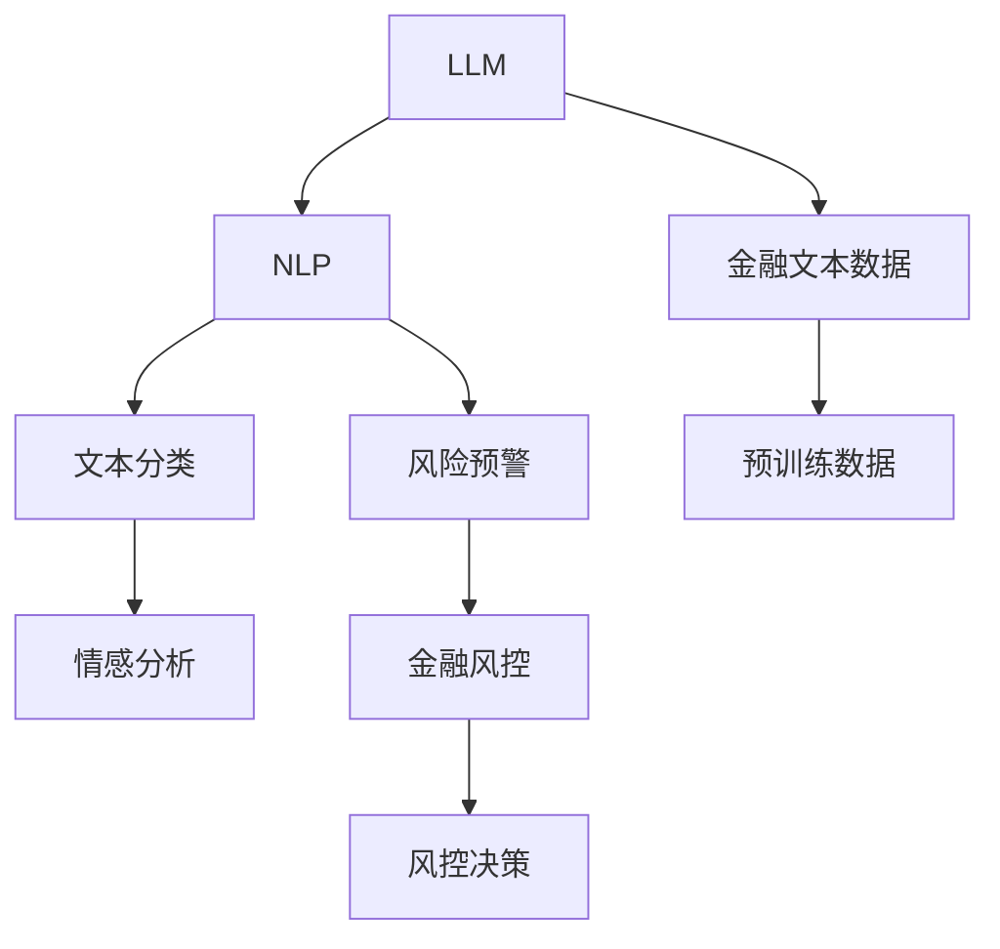

                 

# LLM在智能金融风控中的潜在贡献

## 1. 背景介绍

### 1.1 问题由来

随着金融科技的发展，金融风控已经成为金融机构风险管理的核心环节。传统的金融风控方式依赖人工审核，流程繁琐、效率低、且易受人为因素影响。随着金融数据的爆发性增长，数据驱动的自动化风控需求日益迫切。然而，传统的机器学习模型难以充分利用海量数据，也无法准确把握金融产品的复杂特性。

与此同时，自然语言处理(NLP)技术在金融风控领域的应用日益广泛。通过分析客户投诉、新闻报道、社交媒体评论等文本数据，金融机构可以更好地洞察客户需求，捕捉市场动态，进行风险预警和异常检测。这一过程中，大语言模型(Large Language Model, LLM)作为NLP领域的新星，凭借其强大的自然语言理解和生成能力，有望为智能金融风控注入新的活力。

### 1.2 问题核心关键点

本文将围绕以下关键问题，探讨LLM在智能金融风控中的潜在贡献：

- 如何有效利用LLM处理金融文本数据，挖掘关键特征，提升风控模型的预测精度？
- 基于LLM的文本信息如何与其他金融数据融合，构建更为全面和准确的风险评估体系？
- 结合LLM的智能风控系统在实际落地时，面临哪些挑战和机遇？

### 1.3 问题研究意义

研究LLM在金融风控中的应用，对于提升金融机构的智能化风控水平，防范金融风险，具有重要意义：

1. **提升决策效率**：通过自动化处理金融文本数据，智能风控系统可以显著提升风控决策的速度和准确性，降低人工审核的资源和时间成本。

2. **拓展风控边界**：LLM具备理解和生成金融文本的能力，可以处理更多类型的金融数据，拓宽风控模型的应用场景，提升其通用性和鲁棒性。

3. **强化风险预警**：通过分析金融文本中的情绪和舆情信息，智能风控系统可以更早地发现风险信号，及时采取防控措施，减少损失。

4. **改善客户体验**：基于金融文本分析，智能风控系统可以提供更为精准的客户服务，提升客户满意度和信任度。

5. **推动金融创新**：结合LLM的智能风控技术，金融机构可以开发更多基于文本数据的创新产品和服务，增强竞争力。

## 2. 核心概念与联系

### 2.1 核心概念概述

为更好地理解LLM在智能金融风控中的应用，本节将介绍几个关键概念：

- **大语言模型(LLM)**：以自回归(如GPT)或自编码(如BERT)模型为代表的大规模预训练语言模型。通过在大规模无标签文本语料上进行预训练，学习通用的语言表示，具备强大的语言理解和生成能力。

- **自然语言处理(NLP)**：涉及计算机对人类语言的理解、处理和生成，涵盖文本分类、信息抽取、情感分析等任务。

- **金融风控**：金融机构通过评估和控制风险，保障资金安全和业务稳健运行。涵盖信用风险、市场风险、操作风险等多个方面。

- **文本分类**：将文本数据划分到预定义的类别中，如金融产品评价、客户投诉类型等。

- **情感分析**：分析文本中的情绪倾向，如积极、消极、中性等，评估市场和客户的情绪状态。

- **风险预警**：根据市场和客户行为的数据，提前预测潜在的风险事件，如信用违约、欺诈等。

这些核心概念之间的逻辑关系可以通过以下Mermaid流程图来展示：



这个流程图展示了大语言模型与金融风控之间的核心联系：

1. 大语言模型通过预训练获得基础能力。
2. 自然语言处理技术将金融文本数据转换为模型可理解的形式。
3. 文本分类、情感分析等技术用于提取文本特征，支持风险预警。
4. 风险预警结果用于指导金融风控决策，防范金融风险。

## 3. 核心算法原理 & 具体操作步骤

### 3.1 算法原理概述

基于LLM的智能金融风控方法，核心思想是：将LLM作为强大的文本处理工具，通过处理金融文本数据，提取出关键特征，结合其他金融数据，构建风险评估模型，实现智能风控。

形式化地，假设预训练语言模型为 $M_{\theta}$，其中 $\theta$ 为预训练得到的模型参数。给定金融文本数据集 $D=\{(x_i, y_i)\}_{i=1}^N$，其中 $x_i$ 为金融文本样本，$y_i$ 为标注的风险类别，风控模型的目标是找到最优参数 $\hat{\theta}$，使得：

$$
\hat{\theta}=\mathop{\arg\min}_{\theta} \mathcal{L}(M_{\theta},D)
$$

其中 $\mathcal{L}$ 为风险评估任务设计的损失函数，用于衡量模型预测输出与真实标签之间的差异。常见的损失函数包括交叉熵损失、均方误差损失等。

通过梯度下降等优化算法，风控模型不断更新模型参数 $\theta$，最小化损失函数 $\mathcal{L}$，使得模型输出逼近真实标签。由于 $\theta$ 已经通过预训练获得了较好的初始化，因此即便在小规模数据集 $D$ 上进行风控模型训练，也能较快收敛到理想的模型参数 $\hat{\theta}$。

### 3.2 算法步骤详解

基于LLM的智能金融风控一般包括以下几个关键步骤：

**Step 1: 准备金融文本数据和标注**

- 收集金融文本数据，如金融产品说明书、客户投诉、市场新闻等。
- 为数据集添加标签，如产品风险等级、客户满意度、市场情绪等。

**Step 2: 预处理金融文本数据**

- 对金融文本进行分词、去停用词、词性标注等预处理操作。
- 将金融文本转换为模型所需的向量形式，如BERT、GPT等模型可接受的input_ids和attention_mask。

**Step 3: 选择合适的LLM**

- 选择合适的预训练语言模型 $M_{\theta}$ 作为初始化参数，如 BERT、GPT 等。
- 根据具体任务，选择适用的模型结构，如分类、生成等。

**Step 4: 添加任务适配层**

- 根据任务类型，在预训练模型顶层设计合适的输出层和损失函数。
- 对于分类任务，通常在顶层添加线性分类器和交叉熵损失函数。
- 对于生成任务，通常使用语言模型的解码器输出概率分布，并以负对数似然为损失函数。

**Step 5: 设置风控模型超参数**

- 选择合适的优化算法及其参数，如 AdamW、SGD 等，设置学习率、批大小、迭代轮数等。
- 设置正则化技术及强度，包括权重衰减、Dropout、Early Stopping等。
- 确定冻结预训练参数的策略，如仅微调顶层，或全部参数都参与微调。

**Step 6: 执行梯度训练**

- 将训练集数据分批次输入模型，前向传播计算损失函数。
- 反向传播计算参数梯度，根据设定的优化算法和学习率更新模型参数。
- 周期性在验证集上评估模型性能，根据性能指标决定是否触发 Early Stopping。
- 重复上述步骤直到满足预设的迭代轮数或 Early Stopping 条件。

**Step 7: 测试和部署**

- 在测试集上评估风控模型 $M_{\hat{\theta}}$ 的性能，对比微调前后的精度提升。
- 使用风控模型对新样本进行推理预测，集成到实际的风控系统中。
- 持续收集新的金融文本数据，定期重新微调模型，以适应数据分布的变化。

以上是基于LLM的智能金融风控的一般流程。在实际应用中，还需要针对具体任务的特点，对风控过程的各个环节进行优化设计，如改进训练目标函数，引入更多的正则化技术，搜索最优的超参数组合等，以进一步提升模型性能。

### 3.3 算法优缺点

基于LLM的智能金融风控方法具有以下优点：

1. **处理非结构化数据**：金融文本数据是结构化和非结构化数据并存的，LLM可以有效地处理文本数据，提取关键信息。
2. **提升预测精度**：通过引入文本信息，风控模型可以捕捉更多的特征，提升预测精度。
3. **适应性强**：LLM能够适应不同的文本数据格式和语言特性，具有较强的泛化能力。
4. **易于集成**：结合LLM的风控系统，可以通过API接口轻松集成到现有系统中。

同时，该方法也存在一定的局限性：

1. **依赖金融文本数据**：风控效果很大程度上取决于金融文本数据的质量和数量，获取高质量文本数据的成本较高。
2. **解释性不足**：LLM决策过程缺乏可解释性，难以对其推理逻辑进行分析和调试。
3. **可能引入偏见**：金融文本中可能包含偏见和歧视性内容，通过LLM传播到风控模型，可能产生不公正的输出。

尽管存在这些局限性，但就目前而言，基于LLM的智能风控方法仍是大数据驱动金融风控的重要范式。未来相关研究的重点在于如何进一步降低对金融文本数据的依赖，提高模型的少样本学习和跨领域迁移能力，同时兼顾可解释性和伦理安全性等因素。

### 3.4 算法应用领域

基于LLM的智能金融风控方法，在金融领域已经得到了广泛的应用，涵盖以下几个方面：

1. **信用评估**：通过对客户投诉、社交媒体评论等文本数据的情感分析，预测客户的违约风险。
2. **市场情绪分析**：分析金融新闻、市场评论等文本数据，评估市场的情绪状态，预测股票走势。
3. **欺诈检测**：结合客户投诉和交易记录的文本信息，检测异常交易行为，防范欺诈风险。
4. **产品推荐**：基于产品说明书和用户评论的文本数据，提供个性化的金融产品推荐。
5. **舆情监测**：监控社交媒体、新闻等渠道的金融舆情，及时发现风险事件，采取防控措施。

除了上述这些经典应用外，基于LLM的智能风控技术也被创新性地应用到更多场景中，如贷款审批、保险理赔、反洗钱等，为金融风险管理带来了新的突破。随着预训练语言模型和智能风控方法的不断进步，相信LLM将在更广泛的金融应用领域发挥重要作用。

## 4. 数学模型和公式 & 详细讲解 & 举例说明

### 4.1 数学模型构建

本节将使用数学语言对基于LLM的智能金融风控过程进行更加严格的刻画。

记预训练语言模型为 $M_{\theta}$，其中 $\theta$ 为预训练得到的模型参数。假设风控任务的训练集为 $D=\{(x_i,y_i)\}_{i=1}^N$，其中 $x_i$ 为金融文本样本，$y_i$ 为标注的风险类别。

定义模型 $M_{\theta}$ 在输入 $x$ 上的输出为 $\hat{y}=M_{\theta}(x)$，表示模型对样本的预测风险等级。定义损失函数 $\mathcal{L}(\theta)$ 为模型预测输出与真实标签之间的差异：

$$
\mathcal{L}(\theta) = -\frac{1}{N}\sum_{i=1}^N \ell(\hat{y_i}, y_i)
$$

其中 $\ell$ 为交叉熵损失函数，计算公式为：

$$
\ell(y_i, y_i^{\hat{}}) = -[y_i\log \hat{y_i} + (1-y_i)\log(1-\hat{y_i})]
$$

### 4.2 公式推导过程

下面以信用评估任务为例，推导基于LLM的信用评估模型的损失函数及其梯度计算公式。

假设模型 $M_{\theta}$ 在输入 $x$ 上的输出为 $\hat{y}=M_{\theta}(x)$，表示模型对样本的预测违约概率。真实标签 $y \in \{0,1\}$，其中 $0$ 表示未违约，$1$ 表示违约。则二分类交叉熵损失函数定义为：

$$
\ell(M_{\theta}(x),y) = -[y\log \hat{y} + (1-y)\log(1-\hat{y})]
$$

将其代入经验风险公式，得：

$$
\mathcal{L}(\theta) = -\frac{1}{N}\sum_{i=1}^N \ell(\hat{y_i}, y_i)
$$

根据链式法则，损失函数对参数 $\theta_k$ 的梯度为：

$$
\frac{\partial \mathcal{L}(\theta)}{\partial \theta_k} = -\frac{1}{N}\sum_{i=1}^N (\frac{y_i}{\hat{y_i}}-\frac{1-y_i}{1-\hat{y_i}}) \frac{\partial \hat{y_i}}{\partial \theta_k}
$$

其中 $\frac{\partial \hat{y_i}}{\partial \theta_k}$ 可进一步递归展开，利用自动微分技术完成计算。

在得到损失函数的梯度后，即可带入参数更新公式，完成模型的迭代优化。重复上述过程直至收敛，最终得到适应金融风控任务的最优模型参数 $\theta^*$。

## 5. 项目实践：代码实例和详细解释说明

### 5.1 开发环境搭建

在进行智能风控实践前，我们需要准备好开发环境。以下是使用Python进行PyTorch开发的环境配置流程：

1. 安装Anaconda：从官网下载并安装Anaconda，用于创建独立的Python环境。

2. 创建并激活虚拟环境：
```bash
conda create -n pytorch-env python=3.8 
conda activate pytorch-env
```

3. 安装PyTorch：根据CUDA版本，从官网获取对应的安装命令。例如：
```bash
conda install pytorch torchvision torchaudio cudatoolkit=11.1 -c pytorch -c conda-forge
```

4. 安装Transformers库：
```bash
pip install transformers
```

5. 安装各类工具包：
```bash
pip install numpy pandas scikit-learn matplotlib tqdm jupyter notebook ipython
```

完成上述步骤后，即可在`pytorch-env`环境中开始智能风控实践。

### 5.2 源代码详细实现

这里我们以信用评估任务为例，给出使用Transformers库对BERT模型进行智能风控的PyTorch代码实现。

首先，定义信用评估任务的数据处理函数：

```python
from transformers import BertTokenizer
from torch.utils.data import Dataset
import torch

class CreditAssessmentDataset(Dataset):
    def __init__(self, texts, labels, tokenizer, max_len=128):
        self.texts = texts
        self.labels = labels
        self.tokenizer = tokenizer
        self.max_len = max_len
        
    def __len__(self):
        return len(self.texts)
    
    def __getitem__(self, item):
        text = self.texts[item]
        label = self.labels[item]
        
        encoding = self.tokenizer(text, return_tensors='pt', max_length=self.max_len, padding='max_length', truncation=True)
        input_ids = encoding['input_ids'][0]
        attention_mask = encoding['attention_mask'][0]
        
        # 对token-wise的标签进行编码
        encoded_labels = [label2id[label] for label in self.labels] 
        encoded_labels.extend([label2id['O']] * (self.max_len - len(encoded_labels)))
        labels = torch.tensor(encoded_labels, dtype=torch.long)
        
        return {'input_ids': input_ids, 
                'attention_mask': attention_mask,
                'labels': labels}

# 标签与id的映射
label2id = {'O': 0, 'Low Risk': 1, 'High Risk': 2}
id2label = {v: k for k, v in label2id.items()}

# 创建dataset
tokenizer = BertTokenizer.from_pretrained('bert-base-cased')

train_dataset = CreditAssessmentDataset(train_texts, train_labels, tokenizer)
dev_dataset = CreditAssessmentDataset(dev_texts, dev_labels, tokenizer)
test_dataset = CreditAssessmentDataset(test_texts, test_labels, tokenizer)
```

然后，定义模型和优化器：

```python
from transformers import BertForTokenClassification, AdamW

model = BertForTokenClassification.from_pretrained('bert-base-cased', num_labels=len(label2id))

optimizer = AdamW(model.parameters(), lr=2e-5)
```

接着，定义训练和评估函数：

```python
from torch.utils.data import DataLoader
from tqdm import tqdm
from sklearn.metrics import classification_report

device = torch.device('cuda') if torch.cuda.is_available() else torch.device('cpu')
model.to(device)

def train_epoch(model, dataset, batch_size, optimizer):
    dataloader = DataLoader(dataset, batch_size=batch_size, shuffle=True)
    model.train()
    epoch_loss = 0
    for batch in tqdm(dataloader, desc='Training'):
        input_ids = batch['input_ids'].to(device)
        attention_mask = batch['attention_mask'].to(device)
        labels = batch['labels'].to(device)
        model.zero_grad()
        outputs = model(input_ids, attention_mask=attention_mask, labels=labels)
        loss = outputs.loss
        epoch_loss += loss.item()
        loss.backward()
        optimizer.step()
    return epoch_loss / len(dataloader)

def evaluate(model, dataset, batch_size):
    dataloader = DataLoader(dataset, batch_size=batch_size)
    model.eval()
    preds, labels = [], []
    with torch.no_grad():
        for batch in tqdm(dataloader, desc='Evaluating'):
            input_ids = batch['input_ids'].to(device)
            attention_mask = batch['attention_mask'].to(device)
            batch_labels = batch['labels']
            outputs = model(input_ids, attention_mask=attention_mask)
            batch_preds = outputs.logits.argmax(dim=2).to('cpu').tolist()
            batch_labels = batch_labels.to('cpu').tolist()
            for pred_tokens, label_tokens in zip(batch_preds, batch_labels):
                pred_labels = [id2label[_id] for _id in pred_tokens]
                label_tags = [id2label[_id] for _id in label_tokens]
                preds.append(pred_labels[:len(label_tokens)])
                labels.append(label_tags)
                
    print(classification_report(labels, preds))
```

最后，启动训练流程并在测试集上评估：

```python
epochs = 5
batch_size = 16

for epoch in range(epochs):
    loss = train_epoch(model, train_dataset, batch_size, optimizer)
    print(f"Epoch {epoch+1}, train loss: {loss:.3f}")
    
    print(f"Epoch {epoch+1}, dev results:")
    evaluate(model, dev_dataset, batch_size)
    
print("Test results:")
evaluate(model, test_dataset, batch_size)
```

以上就是使用PyTorch对BERT进行信用评估任务智能风控的完整代码实现。可以看到，得益于Transformers库的强大封装，我们可以用相对简洁的代码完成BERT模型的加载和风控任务的微调。

### 5.3 代码解读与分析

让我们再详细解读一下关键代码的实现细节：

**CreditAssessmentDataset类**：
- `__init__`方法：初始化文本、标签、分词器等关键组件。
- `__len__`方法：返回数据集的样本数量。
- `__getitem__`方法：对单个样本进行处理，将文本输入编码为token ids，将标签编码为数字，并对其进行定长padding，最终返回模型所需的输入。

**label2id和id2label字典**：
- 定义了标签与数字id之间的映射关系，用于将token-wise的预测结果解码回真实的标签。

**训练和评估函数**：
- 使用PyTorch的DataLoader对数据集进行批次化加载，供模型训练和推理使用。
- 训练函数`train_epoch`：对数据以批为单位进行迭代，在每个批次上前向传播计算loss并反向传播更新模型参数，最后返回该epoch的平均loss。
- 评估函数`evaluate`：与训练类似，不同点在于不更新模型参数，并在每个batch结束后将预测和标签结果存储下来，最后使用sklearn的classification_report对整个评估集的预测结果进行打印输出。

**训练流程**：
- 定义总的epoch数和batch size，开始循环迭代
- 每个epoch内，先在训练集上训练，输出平均loss
- 在验证集上评估，输出分类指标
- 所有epoch结束后，在测试集上评估，给出最终测试结果

可以看到，PyTorch配合Transformers库使得BERT微调的代码实现变得简洁高效。开发者可以将更多精力放在数据处理、模型改进等高层逻辑上，而不必过多关注底层的实现细节。

当然，工业级的系统实现还需考虑更多因素，如模型的保存和部署、超参数的自动搜索、更灵活的任务适配层等。但核心的微调范式基本与此类似。

## 6. 实际应用场景
### 6.1 智能客服系统

基于大语言模型微调的对话技术，可以广泛应用于智能客服系统的构建。传统客服往往需要配备大量人力，高峰期响应缓慢，且一致性和专业性难以保证。而使用微调后的对话模型，可以7x24小时不间断服务，快速响应客户咨询，用自然流畅的语言解答各类常见问题。

在技术实现上，可以收集企业内部的历史客服对话记录，将问题和最佳答复构建成监督数据，在此基础上对预训练对话模型进行微调。微调后的对话模型能够自动理解用户意图，匹配最合适的答案模板进行回复。对于客户提出的新问题，还可以接入检索系统实时搜索相关内容，动态组织生成回答。如此构建的智能客服系统，能大幅提升客户咨询体验和问题解决效率。

### 6.2 金融舆情监测

金融机构需要实时监测市场舆论动向，以便及时应对负面信息传播，规避金融风险。传统的人工监测方式成本高、效率低，难以应对网络时代海量信息爆发的挑战。基于大语言模型微调的文本分类和情感分析技术，为金融舆情监测提供了新的解决方案。

具体而言，可以收集金融领域相关的新闻、报道、评论等文本数据，并对其进行主题标注和情感标注。在此基础上对预训练语言模型进行微调，使其能够自动判断文本属于何种主题，情感倾向是正面、中性还是负面。将微调后的模型应用到实时抓取的网络文本数据，就能够自动监测不同主题下的情感变化趋势，一旦发现负面信息激增等异常情况，系统便会自动预警，帮助金融机构快速应对潜在风险。

### 6.3 个性化推荐系统

当前的推荐系统往往只依赖用户的历史行为数据进行物品推荐，无法深入理解用户的真实兴趣偏好。基于大语言模型微调技术，个性化推荐系统可以更好地挖掘用户行为背后的语义信息，从而提供更精准、多样的推荐内容。

在实践中，可以收集用户浏览、点击、评论、分享等行为数据，提取和用户交互的物品标题、描述、标签等文本内容。将文本内容作为模型输入，用户的后续行为（如是否点击、购买等）作为监督信号，在此基础上微调预训练语言模型。微调后的模型能够从文本内容中准确把握用户的兴趣点。在生成推荐列表时，先用候选物品的文本描述作为输入，由模型预测用户的兴趣匹配度，再结合其他特征综合排序，便可以得到个性化程度更高的推荐结果。

### 6.4 未来应用展望

随着大语言模型微调技术的发展，基于LLM的智能风控系统将在金融风控中发挥越来越重要的作用。以下是一些未来可能的创新方向：

1. **多模态信息融合**：结合图像、视频等多模态数据，增强风控模型的感知能力，如通过人脸识别技术验证用户身份，增强风控的安全性。
2. **深度学习模型融合**：将深度学习模型与LLM结合，提升风控模型的复杂特征提取能力，如结合图神经网络进行风险传播路径分析。
3. **实时异常检测**：通过流式数据处理技术，实现实时监测和异常检测，增强风控的及时性和效率。
4. **强化学习结合**：结合强化学习技术，优化风控决策过程，提升模型的自适应能力。
5. **联邦学习**：在分布式数据环境中，利用联邦学习技术，保护用户隐私的同时，提升风控模型的泛化能力。

这些方向不仅能够提升风控系统的性能，还能够更好地适应新兴的金融业务场景，为金融风险管理带来新的突破。

## 7. 工具和资源推荐
### 7.1 学习资源推荐

为了帮助开发者系统掌握大语言模型在智能金融风控中的应用，这里推荐一些优质的学习资源：

1. 《Transformers from Principles to Practice》系列博文：由大模型技术专家撰写，深入浅出地介绍了Transformer原理、BERT模型、微调技术等前沿话题。

2. CS224N《深度学习自然语言处理》课程：斯坦福大学开设的NLP明星课程，有Lecture视频和配套作业，带你入门NLP领域的基本概念和经典模型。

3. 《Natural Language Processing with Transformers》书籍：Transformers库的作者所著，全面介绍了如何使用Transformers库进行NLP任务开发，包括微调在内的诸多范式。

4. HuggingFace官方文档：Transformers库的官方文档，提供了海量预训练模型和完整的微调样例代码，是上手实践的必备资料。

5. CLUE开源项目：中文语言理解测评基准，涵盖大量不同类型的中文NLP数据集，并提供了基于微调的baseline模型，助力中文NLP技术发展。

通过对这些资源的学习实践，相信你一定能够快速掌握大语言模型在金融风控中的应用，并用于解决实际的金融问题。
###  7.2 开发工具推荐

高效的开发离不开优秀的工具支持。以下是几款用于大语言模型微调开发的常用工具：

1. PyTorch：基于Python的开源深度学习框架，灵活动态的计算图，适合快速迭代研究。大部分预训练语言模型都有PyTorch版本的实现。

2. TensorFlow：由Google主导开发的开源深度学习框架，生产部署方便，适合大规模工程应用。同样有丰富的预训练语言模型资源。

3. Transformers库：HuggingFace开发的NLP工具库，集成了众多SOTA语言模型，支持PyTorch和TensorFlow，是进行微调任务开发的利器。

4. Weights & Biases：模型训练的实验跟踪工具，可以记录和可视化模型训练过程中的各项指标，方便对比和调优。与主流深度学习框架无缝集成。

5. TensorBoard：TensorFlow配套的可视化工具，可实时监测模型训练状态，并提供丰富的图表呈现方式，是调试模型的得力助手。

6. Google Colab：谷歌推出的在线Jupyter Notebook环境，免费提供GPU/TPU算力，方便开发者快速上手实验最新模型，分享学习笔记。

合理利用这些工具，可以显著提升大语言模型微调任务的开发效率，加快创新迭代的步伐。

### 7.3 相关论文推荐

大语言模型和微调技术的发展源于学界的持续研究。以下是几篇奠基性的相关论文，推荐阅读：

1. Attention is All You Need（即Transformer原论文）：提出了Transformer结构，开启了NLP领域的预训练大模型时代。

2. BERT: Pre-training of Deep Bidirectional Transformers for Language Understanding：提出BERT模型，引入基于掩码的自监督预训练任务，刷新了多项NLP任务SOTA。

3. Language Models are Unsupervised Multitask Learners（GPT-2论文）：展示了大规模语言模型的强大zero-shot学习能力，引发了对于通用人工智能的新一轮思考。

4. Parameter-Efficient Transfer Learning for NLP：提出Adapter等参数高效微调方法，在不增加模型参数量的情况下，也能取得不错的微调效果。

5. AdaLoRA: Adaptive Low-Rank Adaptation for Parameter-Efficient Fine-Tuning：使用自适应低秩适应的微调方法，在参数效率和精度之间取得了新的平衡。

这些论文代表了大语言模型微调技术的发展脉络。通过学习这些前沿成果，可以帮助研究者把握学科前进方向，激发更多的创新灵感。

## 8. 总结：未来发展趋势与挑战

### 8.1 总结

本文对基于大语言模型的智能金融风控方法进行了全面系统的介绍。首先阐述了LLM在金融风控中的潜在贡献，明确了LLM的强大自然语言处理能力和其在金融风控中的广泛应用场景。其次，从原理到实践，详细讲解了基于LLM的智能风控的数学模型和关键步骤，给出了微调任务开发的完整代码实例。同时，本文还广泛探讨了LLM在智能金融风控中的应用前景，展示了其在信用评估、市场情绪分析、欺诈检测等任务中的优势。

通过本文的系统梳理，可以看到，基于LLM的智能风控方法在金融领域具有广阔的前景，可以显著提升金融机构的风险管理和决策效率，为防范金融风险提供强有力的技术支撑。未来，伴随预训练语言模型和智能风控方法的不断进步，LLM必将在金融风控中发挥更加重要的作用。

### 8.2 未来发展趋势

展望未来，LLM在智能金融风控中的应用将呈现以下几个发展趋势：

1. **模型规模持续增大**：随着算力成本的下降和数据规模的扩张，预训练语言模型的参数量还将持续增长。超大模型能够更好地处理金融文本数据，提取更丰富的特征，提升风控模型的预测精度。

2. **深度学习模型融合**：将深度学习模型与LLM结合，提升风控模型的复杂特征提取能力。例如，结合图神经网络进行风险传播路径分析，结合强化学习优化风控决策过程。

3. **实时异常检测**：通过流式数据处理技术，实现实时监测和异常检测，增强风控的及时性和效率。

4. **多模态信息融合**：结合图像、视频等多模态数据，增强风控模型的感知能力，如通过人脸识别技术验证用户身份，增强风控的安全性。

5. **联邦学习**：在分布式数据环境中，利用联邦学习技术，保护用户隐私的同时，提升风控模型的泛化能力。

以上趋势凸显了LLM在智能金融风控中的巨大潜力。这些方向的探索发展，必将进一步提升风控系统的性能和应用范围，为金融机构的风险管理带来新的突破。

### 8.3 面临的挑战

尽管LLM在金融风控中的应用前景广阔，但在迈向更加智能化、普适化应用的过程中，仍面临诸多挑战：

1. **标注成本瓶颈**：尽管微调模型能够利用金融文本数据，但标注高质量文本数据的成本较高。如何进一步降低标注样本的依赖，仍需研究和探索。

2. **模型鲁棒性不足**：LLM在处理金融文本数据时，可能受到数据分布差异、噪音干扰等因素影响，泛化性能有限。如何提高模型的鲁棒性，避免灾难性遗忘，还需要更多理论和实践的积累。

3. **推理效率有待提高**：超大模型虽然精度高，但在实际部署时往往面临推理速度慢、内存占用大等效率问题。如何在保证性能的同时，简化模型结构，提升推理速度，优化资源占用，将是重要的优化方向。

4. **可解释性亟需加强**：LLM决策过程缺乏可解释性，难以对其推理逻辑进行分析和调试。对于金融风控系统，模型的透明性和可解释性尤为重要，如何赋予模型更强的可解释性，将是亟待攻克的难题。

5. **安全性有待保障**：预训练语言模型可能学习到有偏见、有害的信息，通过LLM传播到风控模型，可能产生不公正的输出。如何从数据和算法层面消除模型偏见，避免恶意用途，确保输出的安全性，也将是重要的研究课题。

6. **知识整合能力不足**：现有的LLM模型往往局限于任务内数据，难以灵活吸收和运用更广泛的先验知识。如何让LLM模型更好地与外部知识库、规则库等专家知识结合，形成更加全面、准确的信息整合能力，还有很大的想象空间。

正视LLM在金融风控中面临的这些挑战，积极应对并寻求突破，将是大语言模型在智能风控领域走向成熟的必由之路。相信随着学界和产业界的共同努力，这些挑战终将一一被克服，LLM必将在构建安全、可靠、可解释、可控的智能系统中发挥越来越重要的作用。

### 8.4 研究展望

面向未来，LLM在智能金融风控的研究方向和创新突破如下：

1. **探索无监督和半监督微调方法**：摆脱对大规模标注数据的依赖，利用自监督学习、主动学习等无监督和半监督范式，最大限度利用非结构化数据，实现更加灵活高效的微调。

2. **研究参数高效和计算高效的微调范式**：开发更加参数高效的微调方法，在固定大部分预训练参数的同时，只更新极少量的任务相关参数。同时优化微调模型的计算图，减少前向传播和反向传播的资源消耗，实现更加轻量级、实时性的部署。

3. **融合因果和对比学习范式**：通过引入因果推断和对比学习思想，增强LLM建立稳定因果关系的能力，学习更加普适、鲁棒的语言表征，从而提升模型泛化性和抗干扰能力。

4. **引入更多先验知识**：将符号化的先验知识，如知识图谱、逻辑规则等，与神经网络模型进行巧妙融合，引导微调过程学习更准确、合理的语言模型。同时加强不同模态数据的整合，实现视觉、语音等多模态信息与文本信息的协同建模。

5. **结合因果分析和博弈论工具**：将因果分析方法引入LLM模型，识别出模型决策的关键特征，增强输出解释的因果性和逻辑性。借助博弈论工具刻画人机交互过程，主动探索并规避模型的脆弱点，提高系统稳定性。

6. **纳入伦理道德约束**：在模型训练目标中引入伦理导向的评估指标，过滤和惩罚有偏见、有害的输出倾向。同时加强人工干预和审核，建立模型行为的监管机制，确保输出符合人类价值观和伦理道德。

这些研究方向的探索，必将引领LLM在智能风控领域迈向更高的台阶，为构建安全、可靠、可解释、可控的智能系统铺平道路。面向未来，LLM还需要与其他人工智能技术进行更深入的融合，如知识表示、因果推理、强化学习等，多路径协同发力，共同推动自然语言理解和智能交互系统的进步。只有勇于创新、敢于突破，才能不断拓展语言模型的边界，让智能技术更好地造福人类社会。

## 9. 附录：常见问题与解答

**Q1：大语言模型在金融风控中的主要应用有哪些？**

A: 大语言模型在金融风控中的主要应用包括：
1. **信用评估**：通过对客户投诉、社交媒体评论等文本数据的情感分析，预测客户的违约风险。
2. **市场情绪分析**：分析金融新闻、市场评论等文本数据，评估市场的情绪状态，预测股票走势。
3. **欺诈检测**：结合客户投诉和交易记录的文本信息，检测异常交易行为，防范欺诈风险。
4. **产品推荐**：基于产品说明书和用户评论的文本数据，提供个性化的金融产品推荐。
5. **舆情监测**：监控社交媒体、新闻等渠道的金融舆情，及时发现风险事件，采取防控措施。

**Q2：大语言模型在风控模型中的超参数选择有哪些建议？**

A: 大语言模型在风控模型中的超参数选择建议如下：
1. **学习率**：一般建议从1e-5开始调参，逐步减小学习率。如果使用过大的学习率，容易破坏预训练权重，导致过拟合。
2. **批次大小**：建议选择16或32等常见的批次大小，避免过小或过大的批次大小影响训练效果。
3. **优化器**：AdamW是一个常用的优化器，适合处理大规模的金融文本数据。
4. **正则化**：使用L2正则、Dropout等正则化技术，防止模型过拟合。
5. **Early Stopping**：在验证集上设置Early Stopping，避免模型过度拟合训练集。

**Q3：大语言模型在风控模型中容易出现哪些问题？**

A: 大语言模型在风控模型中容易出现以下问题：
1. **过拟合**：金融文本数据存在噪声和偏见，模型容易过拟合训练集，泛化性能有限。
2. **鲁棒性不足**：模型可能受到数据分布差异、噪音干扰等因素影响，泛化性能有限。
3. **推理效率低**：超大模型推理速度慢，内存占用大，实际部署中可能遇到资源瓶颈。
4. **可解释性差**：模型的决策过程缺乏可解释性，难以对其推理逻辑进行分析和调试。
5. **安全性问题**：模型可能学习到有偏见、有害的信息，导致输出不公正。

**Q4：如何评估大语言模型在风控模型中的性能？**

A: 评估大语言模型在风控模型中的性能可以从以下几个方面入手：
1. **准确率**：计算模型预测结果与真实标签之间的准确率。
2. **召回率**：计算模型对真实正例的召回率，评估模型对高风险样本的识别能力。
3. **F1-score**：综合考虑准确率和召回率，评估模型的整体性能。
4. **ROC曲线**：绘制模型在不同阈值下的真正例率和假正例率，评估模型的分类能力。
5. **混淆矩阵**：计算模型在各分类上的预测结果，分析模型的误判和漏判情况。

**Q5：如何提高大语言模型在风控模型中的泛化能力？**

A: 提高大语言模型在风控模型中的泛化能力，可以从以下几个方面入手：
1. **数据增强**：通过数据增强技术，如回译、近义词替换等，丰富训练集的多样性。
2. **对抗训练**：引入对抗样本，增强模型的鲁棒性，避免过拟合训练集。
3. **参数高效微调**：采用参数高效微调方法，只更新部分模型参数，减少过拟合风险。
4. **正则化技术**：使用L2正则、Dropout等正则化技术，防止模型过拟合。
5. **集成学习**：结合多个模型的预测结果，提升模型的泛化能力。

---

作者：禅与计算机程序设计艺术 / Zen and the Art of Computer Programming

