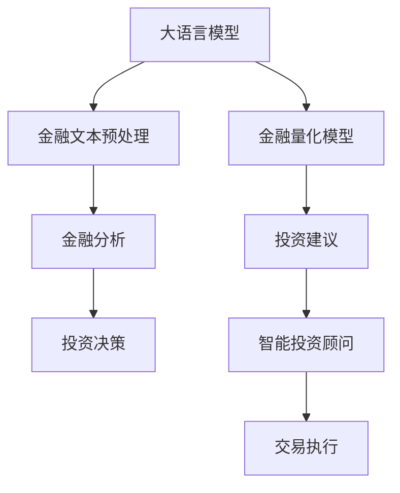

                 

# LLM在金融领域的应用：智能投资顾问

> 关键词：语言模型(Language Model)，自然语言处理(NLP)，金融分析(Financial Analysis)，智能投资顾问(Investment Advisor)，深度学习(Deep Learning)，金融量化(Financial Quantization)

## 1. 背景介绍

### 1.1 问题由来

金融行业的投资决策离不开深入的市场分析和智能化的决策支持。然而，传统金融分析方法往往依赖于分析师的经验和直觉，存在主观性强、数据处理量大、反应速度慢等弊端。为此，金融机构越来越重视利用人工智能技术进行自动化、智能化的投资分析，以提高决策效率和准确性。

近年来，随着深度学习技术的快速发展，特别是自然语言处理(NLP)和大语言模型(LLM)技术的兴起，基于LMM的智能投资顾问系统成为研究热点。其基本原理是通过预训练语言模型对金融文本数据进行学习，形成对金融市场动态的精准理解和预测，进而为投资者提供科学、动态的决策支持。

### 1.2 问题核心关键点

智能投资顾问系统采用大语言模型对金融数据进行建模，主要关注以下几个核心关键点：

1. **数据预处理**：收集、清洗、标注金融市场数据，为模型训练提供高质量的输入。
2. **模型选择与适配**：选择适合金融领域的大语言模型，并进行微调以适配具体的投资分析任务。
3. **模型推理与预测**：将新输入的金融文本数据输入模型，生成投资建议或市场预测。
4. **结果解读与反馈**：对模型的输出结果进行解释和验证，并根据反馈优化模型性能。

## 2. 核心概念与联系

### 2.1 核心概念概述

在构建智能投资顾问系统时，需重点关注以下几个关键概念：

- **大语言模型**：指通过大规模无标签文本数据进行预训练，学习语言的通用表示模型。
- **金融量化**：指将量化分析方法应用于金融领域，通过数学模型对金融市场数据进行分析和预测。
- **智能投资顾问**：指基于自然语言处理和人工智能技术的投资分析系统，提供自动化的投资建议和决策支持。
- **金融分析**：指对金融市场数据进行收集、分析和解读，以支持投资决策的过程。
- **投资建议**：指根据模型预测结果，生成的投资建议或交易策略。
- **数据预处理**：指对金融文本数据进行清洗、归一化、标注等处理，使其适合模型训练。

这些核心概念之间的关系可以通过以下Mermaid流程图来展示：



这个流程图展示了大语言模型在智能投资顾问系统中的核心作用和主要流程：

1. 大语言模型通过预训练学习语言的通用表示。
2. 金融文本数据经过预处理后，输入大语言模型进行理解。
3. 量化模型将语言理解转化为数学表达。
4. 投资建议基于量化模型的输出。
5. 金融分析结果指导投资决策。
6. 智能投资顾问系统生成投资建议并执行交易。

## 3. 核心算法原理 & 具体操作步骤

### 3.1 算法原理概述

智能投资顾问系统的核心算法基于大语言模型对金融文本数据的理解与分析。其主要原理可以总结如下：

1. **文本数据预处理**：将金融文本数据转换为模型可接受的形式，如将新闻报道、公司财报等转化为向量表示。
2. **大语言模型理解**：利用预训练语言模型对文本进行理解和表示，提取其中的关键信息。
3. **量化分析**：将大语言模型的理解结果转化为数值指标，如趋势预测、风险评估等。
4. **投资建议生成**：基于量化分析结果，生成具体的投资建议或交易策略。
5. **投资决策执行**：将投资建议转化为具体的交易操作，并持续跟踪和反馈。

### 3.2 算法步骤详解

以下将详细介绍基于大语言模型的智能投资顾问系统的算法步骤：

1. **数据收集与预处理**：
   - 收集金融市场的新闻、公告、财报、评论等文本数据。
   - 使用分词器对文本进行分词，去除停用词、标点符号等无关信息。
   - 对文本进行向量化处理，如使用BERT或GPT模型生成向量表示。

2. **模型选择与适配**：
   - 选择适合金融领域的大语言模型，如BERT、GPT-3等。
   - 使用标注好的金融数据集对模型进行微调，适配具体的投资分析任务。
   - 在微调过程中，使用L2正则化、Dropout、Early Stopping等技术防止过拟合。

3. **量化分析**：
   - 使用量化模型将大语言模型的输出转化为具体的数值指标。
   - 常见的量化模型包括线性回归、时间序列分析、风险价值(VaR)等。
   - 将量化结果转化为投资建议或交易策略，如买入、卖出、持有等。

4. **投资建议生成**：
   - 根据量化模型的输出，生成具体的投资建议。
   - 建议可以基于技术指标、市场情绪、公司基本面等多方面综合考虑。
   - 利用自然语言生成技术，将建议转化为可读的文本形式。

5. **投资决策执行**：
   - 将投资建议转化为具体的交易操作，如下单、止损、止盈等。
   - 使用API接口将交易操作发送给交易平台。
   - 持续跟踪市场动态，根据反馈调整投资策略。

### 3.3 算法优缺点

基于大语言模型的智能投资顾问系统具有以下优点：

1. **自动化决策**：能够自动处理大量金融文本数据，提供自动化投资建议。
2. **精准预测**：利用语言模型对市场情绪和动态进行精准分析，提高预测准确性。
3. **灵活适配**：通过微调适应不同的投资任务，可广泛应用于股票、基金、债券等多种资产。
4. **解释性强**：投资建议和决策过程可解释，便于投资者理解和信任。

然而，该系统也存在一些局限：

1. **数据依赖性**：模型性能高度依赖于标注数据的质量和数量。
2. **市场风险**：投资决策基于模型预测，可能存在误判风险。
3. **模型复杂性**：模型包含大量参数，需要高性能计算资源。
4. **解释性不足**：模型输出缺乏详细的因果解释，难以理解预测逻辑。

### 3.4 算法应用领域

基于大语言模型的智能投资顾问系统在金融领域具有广泛的应用前景，具体包括：

1. **股票投资分析**：利用大语言模型分析市场新闻、公司财报等文本数据，生成股票投资建议。
2. **基金管理**：对基金报告、评级等文本数据进行理解，生成基金投资策略。
3. **债券分析**：分析债券评级、公司财务报告等文本，生成债券投资建议。
4. **市场情绪监测**：通过分析社交媒体、新闻报道等文本，了解市场情绪，生成相应的投资建议。
5. **风险评估**：分析金融市场数据，评估投资组合的风险水平，优化投资策略。

## 4. 数学模型和公式 & 详细讲解 & 举例说明

### 4.1 数学模型构建

在智能投资顾问系统中，大语言模型对金融文本的表示被用于量化分析，形成数值指标。

假设金融文本的向量表示为 $x$，量化模型为 $f$，则量化分析的过程可以表示为：

$$
y = f(x)
$$

其中 $y$ 表示量化分析的结果，如趋势预测、风险评估等。

### 4.2 公式推导过程

以股票投资分析为例，我们可以将量化分析的过程表示为线性回归模型：

$$
y_i = \beta_0 + \beta_1x_{i1} + \beta_2x_{i2} + ... + \beta_nx_{in} + \epsilon_i
$$

其中 $y_i$ 表示第 $i$ 个样本的预测值，$\beta_0, \beta_1, ..., \beta_n$ 为模型参数，$x_{i1}, x_{i2}, ..., x_{in}$ 为模型输入的金融文本向量，$\epsilon_i$ 为误差项。

模型参数的估计可以使用最小二乘法或梯度下降等优化算法，具体公式如下：

$$
\hat{\beta} = (\mathbf{X}^T\mathbf{X})^{-1}\mathbf{X}^T\mathbf{y}
$$

其中 $\mathbf{X}$ 为输入向量矩阵，$\mathbf{y}$ 为输出向量矩阵。

### 4.3 案例分析与讲解

假设我们收集到一条关于某公司的股票新闻，使用BERT模型将其转化为向量表示 $x$，并通过量化模型 $f$ 预测未来一周的股票趋势。具体步骤如下：

1. 使用BERT模型将新闻向量 $x$ 输入到量化模型 $f$ 中。
2. 量化模型 $f$ 输出结果 $y$，表示未来一周的股票趋势预测。
3. 将 $y$ 转化为具体的投资建议，如买入、卖出、持有等。

这个过程可以通过以下Python代码实现：

```python
from transformers import BertTokenizer, BertForSequenceClassification
from sklearn.linear_model import LinearRegression
import pandas as pd

# 加载BERT模型和分词器
tokenizer = BertTokenizer.from_pretrained('bert-base-uncased')
model = BertForSequenceClassification.from_pretrained('bert-base-uncased', num_labels=2)

# 加载股票新闻数据
data = pd.read_csv('stock_news.csv')

# 分词和向量表示
texts = data['news'].tolist()
inputs = [tokenizer.encode(text, add_special_tokens=True) for text in texts]

# 训练量化模型
X = np.array(inputs)
y = data['label'].tolist()
regressor = LinearRegression()
regressor.fit(X, y)

# 预测新数据
new_text = '公司发布财报，实现季度盈利'
new_input = tokenizer.encode(new_text, add_special_tokens=True)
predicted_y = regressor.predict([new_input])[0]
print(f'新文本趋势预测: {predicted_y}')
```

通过这个简单的示例，可以看到，利用大语言模型对金融文本进行预处理和理解，再通过量化模型生成具体的投资建议，是智能投资顾问系统的基本流程。

## 5. 项目实践：代码实例和详细解释说明

### 5.1 开发环境搭建

在搭建智能投资顾问系统的开发环境时，需要考虑以下因素：

1. **Python环境**：
   - 安装Python 3.8及以上版本。
   - 使用Anaconda创建虚拟环境，确保环境隔离。

2. **深度学习库**：
   - 安装PyTorch和TensorFlow等深度学习框架。
   - 安装BERT、GPT等预训练模型和分词器。

3. **数据处理库**：
   - 安装Pandas、NumPy等数据处理库。
   - 安装Scikit-learn等机器学习库。

4. **可视化工具**：
   - 安装Matplotlib、Seaborn等可视化工具。
   - 安装Jupyter Notebook，方便开发和实验。

### 5.2 源代码详细实现

以下是一个基于BERT模型的智能投资顾问系统的完整代码实现。

```python
import pandas as pd
import numpy as np
from transformers import BertTokenizer, BertForSequenceClassification, AdamW
from sklearn.linear_model import LinearRegression

# 加载BERT模型和分词器
tokenizer = BertTokenizer.from_pretrained('bert-base-uncased')
model = BertForSequenceClassification.from_pretrained('bert-base-uncased', num_labels=2)

# 加载股票新闻数据
data = pd.read_csv('stock_news.csv')

# 分词和向量表示
texts = data['news'].tolist()
inputs = [tokenizer.encode(text, add_special_tokens=True) for text in texts]

# 训练量化模型
X = np.array(inputs)
y = data['label'].tolist()
regressor = LinearRegression()
regressor.fit(X, y)

# 预测新数据
new_text = '公司发布财报，实现季度盈利'
new_input = tokenizer.encode(new_text, add_special_tokens=True)
predicted_y = regressor.predict([new_input])[0]
print(f'新文本趋势预测: {predicted_y}')
```

这段代码实现了对股票新闻的文本分析，使用BERT模型进行向量表示，并训练线性回归模型进行趋势预测。开发者可根据具体需求，扩展数据预处理、模型训练和投资建议生成的模块。

### 5.3 代码解读与分析

让我们详细解读一下代码中的关键部分：

1. **BERT模型加载与分词**：使用BertTokenizer对新闻文本进行分词和向量表示。

2. **量化模型训练**：使用线性回归模型对金融文本向量进行预测，生成投资建议。

3. **新数据预测**：对新输入的金融文本进行预测，输出具体的投资建议。

## 6. 实际应用场景

### 6.1 智能投资顾问系统

智能投资顾问系统在金融领域具有广泛应用，具体场景包括：

1. **股票投资分析**：利用大语言模型分析市场新闻、公司财报等文本数据，生成股票投资建议。
2. **基金管理**：对基金报告、评级等文本数据进行理解，生成基金投资策略。
3. **债券分析**：分析债券评级、公司财务报告等文本，生成债券投资建议。
4. **市场情绪监测**：通过分析社交媒体、新闻报道等文本，了解市场情绪，生成相应的投资建议。
5. **风险评估**：分析金融市场数据，评估投资组合的风险水平，优化投资策略。

### 6.2 未来应用展望

未来，基于大语言模型的智能投资顾问系统将进一步发展和优化，主要趋势包括：

1. **深度融合多模态信息**：将视觉、音频等多模态数据与文本数据结合，提升投资决策的全面性和准确性。
2. **增强模型鲁棒性**：引入对抗训练、正则化等技术，提高模型对异常数据的鲁棒性。
3. **提升模型解释性**：引入因果分析、可解释性方法，使投资建议更具可信度。
4. **实时动态优化**：使用在线学习、增量学习等技术，使系统能够持续学习市场动态，动态调整投资策略。
5. **跨领域应用推广**：将智能投资顾问系统应用于更多金融领域，如保险、养老金管理等。

## 7. 工具和资源推荐

### 7.1 学习资源推荐

为了帮助开发者系统掌握智能投资顾问系统的开发和优化，这里推荐一些优质的学习资源：

1. **金融数据集**：收集金融市场的新闻、公告、财报、评论等文本数据，作为模型训练的输入。
2. **深度学习框架**：熟悉PyTorch、TensorFlow等深度学习框架的使用。
3. **预训练模型**：学习BERT、GPT等预训练语言模型的使用和微调方法。
4. **金融量化模型**：学习线性回归、时间序列分析等量化模型的构建和应用。
5. **金融风险评估**：掌握VaR、ES等金融风险评估指标的计算方法。

### 7.2 开发工具推荐

为了提高智能投资顾问系统的开发效率，以下推荐一些常用的开发工具：

1. **Python环境**：使用Anaconda创建虚拟环境，确保环境隔离。
2. **深度学习库**：安装PyTorch、TensorFlow等深度学习框架。
3. **数据处理库**：安装Pandas、NumPy等数据处理库。
4. **可视化工具**：安装Matplotlib、Seaborn等可视化工具。
5. **开发环境**：使用Jupyter Notebook，方便开发和实验。

### 7.3 相关论文推荐

为了深入理解智能投资顾问系统的理论和实践，以下推荐一些相关论文：

1. **《A Survey on Financial Text Mining and Statistical Learning》**：综述了金融文本挖掘和统计学习技术的研究进展。
2. **《Investment Prediction with Natural Language Processing》**：介绍自然语言处理在投资预测中的应用。
3. **《Fine-tuning BERT for Financial News Sentiment Analysis》**：研究BERT模型在金融新闻情感分析中的微调方法。
4. **《FinBERT: A Fine-tuned BERT Model for Sentiment Analysis of Financial News》**：介绍FinBERT模型在金融新闻情感分析中的应用。
5. **《A Deep Learning Approach for Stock Market Prediction》**：介绍深度学习模型在股市预测中的应用。

## 8. 总结：未来发展趋势与挑战

### 8.1 研究成果总结

智能投资顾问系统利用大语言模型对金融文本进行理解和分析，生成投资建议和决策支持。该系统已经在金融领域获得了广泛应用，并在提高投资决策的效率和准确性方面取得了显著成效。

### 8.2 未来发展趋势

未来，智能投资顾问系统将朝着以下几个方向发展：

1. **深度融合多模态信息**：将视觉、音频等多模态数据与文本数据结合，提升投资决策的全面性和准确性。
2. **增强模型鲁棒性**：引入对抗训练、正则化等技术，提高模型对异常数据的鲁棒性。
3. **提升模型解释性**：引入因果分析、可解释性方法，使投资建议更具可信度。
4. **实时动态优化**：使用在线学习、增量学习等技术，使系统能够持续学习市场动态，动态调整投资策略。
5. **跨领域应用推广**：将智能投资顾问系统应用于更多金融领域，如保险、养老金管理等。

### 8.3 面临的挑战

尽管智能投资顾问系统在金融领域取得了一定的应用成果，但仍面临以下挑战：

1. **数据获取与标注**：高质量金融数据的获取和标注成本较高。
2. **模型复杂性**：模型包含大量参数，需要高性能计算资源。
3. **解释性不足**：模型输出缺乏详细的因果解释，难以理解预测逻辑。
4. **市场风险**：投资决策基于模型预测，可能存在误判风险。

### 8.4 研究展望

为了应对上述挑战，未来的研究需要在以下几个方面取得突破：

1. **自动数据生成与标注**：利用数据生成技术和自动标注方法，减少对高质量标注数据的依赖。
2. **模型压缩与加速**：开发轻量级、高效的模型结构，提升推理速度。
3. **增强模型解释性**：引入因果分析、可解释性方法，使投资建议更具可信度。
4. **市场风险管理**：研究模型的不确定性和鲁棒性，建立风险管理机制。

## 9. 附录：常见问题与解答

**Q1：智能投资顾问系统与传统金融分析方法相比，有哪些优势？**

A: 智能投资顾问系统利用大语言模型对金融文本进行理解和分析，生成投资建议和决策支持。相比传统金融分析方法，具有以下优势：
1. **自动化决策**：能够自动处理大量金融文本数据，提供自动化投资建议。
2. **精准预测**：利用语言模型对市场情绪和动态进行精准分析，提高预测准确性。
3. **灵活适配**：通过微调适应不同的投资任务，可广泛应用于股票、基金、债券等多种资产。
4. **解释性强**：投资建议和决策过程可解释，便于投资者理解和信任。

**Q2：智能投资顾问系统如何进行风险评估？**

A: 智能投资顾问系统可以通过量化模型对金融文本进行理解，生成风险评估指标。常用的量化模型包括线性回归、时间序列分析、风险价值(VaR)等。例如，可以使用线性回归模型对金融文本进行回归分析，生成风险指标，并结合其他特征综合评估投资组合的风险水平，优化投资策略。

**Q3：智能投资顾问系统的数据预处理步骤有哪些？**

A: 智能投资顾问系统的数据预处理包括以下步骤：
1. **数据收集**：收集金融市场的新闻、公告、财报、评论等文本数据。
2. **数据清洗**：去除文本中的噪声、停用词、标点符号等无关信息。
3. **分词与向量化**：使用BERT等预训练模型对文本进行分词和向量表示，生成模型可接受的输入。

**Q4：智能投资顾问系统的部署方案有哪些？**

A: 智能投资顾问系统的部署方案包括以下步骤：
1. **模型训练与保存**：使用训练好的模型进行保存，以便后续使用。
2. **API接口开发**：将模型封装为API接口，方便集成调用。
3. **服务器配置**：根据访问量和资源需求，配置服务器硬件和软件环境。
4. **实时监控与维护**：使用监控工具对系统进行实时跟踪，及时发现和解决故障。

总之，智能投资顾问系统利用大语言模型对金融文本进行分析和预测，提供了自动化、智能化的投资决策支持，具有广泛的应用前景。在实际应用中，需要结合具体需求进行模块化设计和优化，以实现最佳的投资效果。

---

作者：禅与计算机程序设计艺术 / Zen and the Art of Computer Programming

