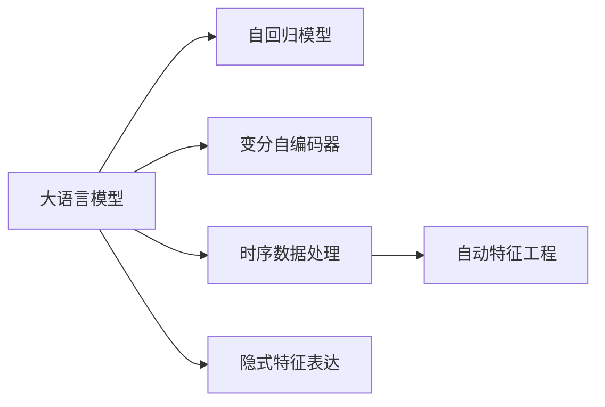
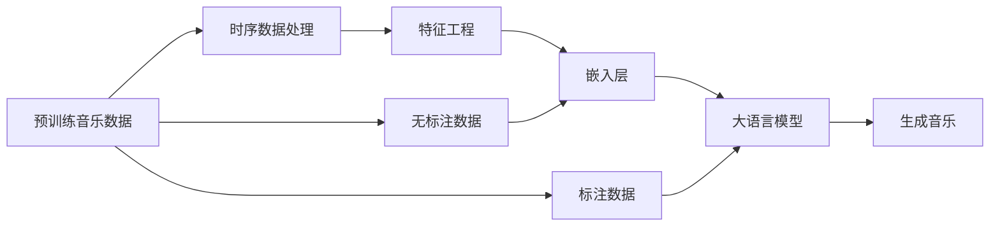

                 

# LLM在音乐生成任务上的尝试分析

> 关键词：大语言模型,音乐生成,Transformer,自回归模型,变分自编码器,时序数据处理,自动特征工程,隐式特征表达

## 1. 背景介绍

### 1.1 问题由来

在自然语言处理（NLP）领域，大语言模型（Large Language Models, LLM）已经取得了令人瞩目的成就。这些模型不仅在文本生成、文本分类、问答等任务上表现出色，还在艺术创作、生成对话等新兴领域展现了强大的潜力。然而，将这些模型应用于音乐生成这一挑战性任务，仍是一个相对新兴且充满前景的探索方向。

音乐生成作为创造性艺术的子领域，其创作过程涉及到复杂的时序数据、音调变化以及情感表达等，这些特性对于任何自动生成模型来说，都是一个巨大的挑战。传统的音乐生成方法如基于规则的乐曲生成、基于谱线符号的生成等，已经不再能满足日益增长的个性化音乐创作需求。大语言模型的出现，为音乐生成提供了新的可能性，但同时带来了新的问题。

### 1.2 问题核心关键点

在音乐生成任务中，大语言模型面临的核心问题包括：

- **时序数据处理**：音乐是时序数据，如何有效地将音乐信息映射为模型可以处理的形式。
- **音调与情感表达**：音乐不仅包含节奏和旋律，还涉及音调变化和情感表达，这些是模型难以直接理解的。
- **音乐结构与规则**：音乐生成需遵循一定的结构规则，如和弦、旋律的重复与变化等。
- **数据稀缺与标注成本**：高质量的音乐生成数据稀缺，标注成本高，这对模型的训练与评估提出了挑战。
- **计算资源需求**：音乐生成任务中的复杂度使得模型训练和推理需要较高的计算资源。

本文将聚焦于如何利用大语言模型进行音乐生成，旨在通过一系列的算法设计与优化，探索其在音乐创作中的潜力。

## 2. 核心概念与联系

### 2.1 核心概念概述

要理解大语言模型在音乐生成任务中的应用，首先需要了解几个关键概念：

- **大语言模型 (LLM)**：指如GPT、BERT等基于Transformer结构的大规模预训练语言模型，用于处理文本数据，但在本文中我们将探讨其在音乐生成中的潜力。
- **自回归模型**：在音乐生成任务中，自回归模型可以保证生成内容的连贯性和一致性。
- **变分自编码器 (VAE)**：VAE被用于生成高质量的音频数据，但其设计初衷并非直接用于音乐生成，而是基于概率模型进行数据压缩与重构。
- **时序数据处理**：音乐生成中的音符序列、节奏等都是时序数据，需要特化处理。
- **自动特征工程**：通过自动化的方法，将原始音乐数据转换为模型可理解的形式。
- **隐式特征表达**：音乐中存在许多难以直接建模的特征，如情感、风格等，需要通过隐式的方式表达。

这些概念通过以下Mermaid流程图展示了它们之间的关系：



### 2.2 核心概念原理和架构的 Mermaid 流程图

下面是一个简单的Mermaid流程图，展示了音乐生成任务中不同模块之间的联系：



## 3. 核心算法原理 & 具体操作步骤

### 3.1 算法原理概述

音乐生成可以看作是一种特殊的文本生成任务，其中音符序列被映射为文本。因此，我们可以将预训练的大语言模型应用于音乐生成，利用其强大的语言理解能力，生成符合特定风格和情感的乐曲。

音乐生成的核心算法包括：

1. **音符序列到文本映射**：将音符序列转换为文本形式，可以是音符的符号表示或 MIDI 数据中的数值。
2. **音乐生成模型训练**：在训练集中标注好的音乐数据上，对大语言模型进行微调，使其学习到音乐生成所需的知识。
3. **音乐生成与解码**：在测试集或新的音乐生成任务中，使用训练好的模型生成新的乐曲。

### 3.2 算法步骤详解

#### 步骤1: 音符序列到文本映射

将音符序列映射为文本形式是音乐生成任务的首要步骤。这可以通过以下几种方式实现：

- **符号表示**：将音符映射为相应的符号，如C、D、E等，或者 MIDI 值（如60、61、62）。
- **数值映射**：直接使用 MIDI 数据中的数值，将乐曲转化为文本。
- **音高序列表示**：将音符的音高序列转换为文本形式，例如使用音高符号序列 'C-D-E-F'。

#### 步骤2: 音乐生成模型训练

在训练集中标注好的音乐数据上，对大语言模型进行微调，使其学习到音乐生成所需的知识。这可以通过以下步骤实现：

1. **数据准备**：将标注好的音乐数据划分为训练集、验证集和测试集。
2. **模型初始化**：选择合适的大语言模型，如GPT、BERT等。
3. **特征工程**：将音符序列转换为模型可以处理的形式，如使用音符符号或 MIDI 值。
4. **模型微调**：在训练集上，使用标注好的音乐数据进行微调。
5. **验证与优化**：在验证集上评估模型性能，调整模型参数和训练策略。
6. **测试集评估**：在测试集上评估模型，确保模型在新数据上的泛化能力。

#### 步骤3: 音乐生成与解码

在测试集或新的音乐生成任务中，使用训练好的模型生成新的乐曲。这可以通过以下步骤实现：

1. **输入生成**：根据用户需求，生成随机的或半随机的文本输入。
2. **解码器生成**：使用训练好的模型，基于输入生成乐曲。
3. **后处理**：对生成的乐曲进行后处理，如调整节奏、和声等。

### 3.3 算法优缺点

大语言模型在音乐生成任务中的应用，具有以下优点：

- **广泛的先验知识**：大语言模型可以从互联网上的大量文本中学习到丰富的语言知识，这些知识可以应用于音乐生成。
- **灵活的生成方式**：大语言模型可以通过微调，适应不同风格和情感的音乐生成需求。
- **快速生成**：基于大语言模型的生成方式通常比传统音乐生成方法更快，可以更快速地生成乐曲。

然而，也存在以下缺点：

- **复杂的时序处理**：音乐生成涉及复杂的时序数据，大语言模型在这方面的处理能力有限。
- **高计算资源需求**：大语言模型的训练和推理需要大量的计算资源，特别是在生成复杂乐曲时。
- **数据稀缺**：高质量的音乐生成数据稀缺，标注成本高，导致训练数据不足。
- **缺乏专业知识**：大语言模型可能缺乏对音乐结构和规则的直接理解。

### 3.4 算法应用领域

大语言模型在音乐生成任务上的应用，主要集中在以下几个领域：

- **作曲辅助**：帮助音乐家创作新的乐曲，提供创作灵感。
- **音乐编曲**：自动生成音乐的编曲，特别是对于复杂和声和节奏的处理。
- **风格转换**：将一种音乐风格转换为另一种风格，如将流行音乐转换为古典音乐。
- **音乐分析**：分析音乐的情感、风格等特征，为音乐创作和欣赏提供参考。
- **互动音乐**：基于用户输入的文本生成音乐，实现人机交互式的音乐体验。

## 4. 数学模型和公式 & 详细讲解 & 举例说明

### 4.1 数学模型构建

在音乐生成任务中，我们可以将音乐转化为文本，并通过大语言模型进行生成。具体的数学模型如下：

设音符序列为 $X=\{x_1, x_2, ..., x_T\}$，其中 $x_t$ 表示时间 $t$ 的音符。我们将每个音符转换为一个符号或 MIDI 值，然后将其编码为一个文本序列 $Y=\{y_1, y_2, ..., y_T\}$。设大语言模型的编码为 $E$，解码器为 $D$，则音乐生成的过程可以表示为：

$$
Y = E(X) \rightarrow Z = D(Y)
$$

其中 $Z$ 表示生成的音乐序列。

### 4.2 公式推导过程

#### 符号到文本映射

假设每个音符 $x_t$ 可以映射为一个符号 $y_t$，则符号序列 $Y$ 可以表示为：

$$
y_t = \text{symbol}(x_t)
$$

#### 音乐生成模型

假设大语言模型的编码为 $E$，解码器为 $D$，则音乐生成的过程可以表示为：

$$
Y = E(X) \rightarrow Z = D(Y)
$$

其中 $E$ 和 $D$ 可以通过预训练模型或微调模型得到。具体的数学公式如下：

$$
Z_t = D(Y_t) = D(E(X_t))
$$

### 4.3 案例分析与讲解

#### 案例1: 基于GPT的音乐生成

我们使用GPT作为音乐生成模型，假设音符序列为 $X=\{60, 61, 62\}$，则符号序列 $Y=\{'C', 'D', 'E'\}$。设GPT的编码为 $E$，解码器为 $D$，则音乐生成的过程如下：

1. 将音符序列编码为符号序列：$Y=\{'C', 'D', 'E'\}$。
2. 将符号序列输入GPT模型：$Z_t = GPT(Y_t)$。
3. 生成音乐序列：$Z=\{Z_1, Z_2, ..., Z_T\}$。

#### 案例2: 基于VAE的音乐生成

假设我们使用变分自编码器 (VAE) 生成高质量的音频数据，VAE的数学模型如下：

$$
\mu_t, \sigma_t = \text{VAE}(y_t)
$$

其中 $\mu_t$ 和 $\sigma_t$ 分别表示时间 $t$ 的音符的概率均值和标准差。我们将音符映射为符号序列 $Y$，使用VAE生成音频数据，具体过程如下：

1. 将符号序列输入VAE模型：$\mu_t, \sigma_t = \text{VAE}(y_t)$。
2. 生成音频数据：$z_t = \mathcal{N}(\mu_t, \sigma_t)$。
3. 解码为音符序列：$x_t = \text{VAE}^{-1}(z_t)$。

## 5. 项目实践：代码实例和详细解释说明

### 5.1 开发环境搭建

在音乐生成任务中，我们需要以下开发环境：

- **Python**：Python是最常用的编程语言，可用于处理音乐数据和训练模型。
- **PyTorch**：PyTorch是一个开源深度学习框架，可用于构建音乐生成模型。
- **MIDI库**：如 `mido`，用于处理MIDI数据。
- **音频处理库**：如 `librosa`，用于音频数据的处理和分析。

### 5.2 源代码详细实现

以下是使用PyTorch进行音乐生成的代码实现：

```python
import torch
import torch.nn as nn
import torch.nn.functional as F
import mido
import librosa
import numpy as np

# MIDI处理
def get_midi_data():
    midi_file = mido.MIDIFile('music.mid')
    midi_data = [midi_event for track in midi_file.tracks for midi_event in track]
    return midi_data

# 将MIDI数据转换为音符序列
def midi_to_note_seq(midi_data):
    note_seq = []
    for midi_event in midi_data:
        if midi_event.type == 'note_on':
            note_seq.append(midi_event.note)
    return note_seq

# 定义音乐生成模型
class MusicGenerator(nn.Module):
    def __init__(self, embedding_dim, hidden_dim):
        super(MusicGenerator, self).__init__()
        self.embedding = nn.Embedding(len(note_seq), embedding_dim)
        self.encoder = nn.LSTM(embedding_dim, hidden_dim)
        self.decoder = nn.LSTM(hidden_dim, len(note_seq))
    
    def forward(self, input_seq):
        embedded = self.embedding(input_seq)
        encoded, _ = self.encoder(embedded)
        decoded, _ = self.decoder(encoded)
        return decoded

# 训练模型
def train_model(model, input_seq, target_seq, learning_rate):
    optimizer = torch.optim.Adam(model.parameters(), lr=learning_rate)
    criterion = nn.CrossEntropyLoss()
    
    for epoch in range(num_epochs):
        optimizer.zero_grad()
        output_seq = model(input_seq)
        loss = criterion(output_seq, target_seq)
        loss.backward()
        optimizer.step()
        print(f'Epoch {epoch+1}, Loss: {loss.item()}')

# 使用模型生成音乐
def generate_music(model, input_seq):
    with torch.no_grad():
        output_seq = model(input_seq)
        return output_seq

# 测试模型
input_seq = midi_to_note_seq(get_midi_data())
target_seq = midi_to_note_seq(get_midi_data())
model = MusicGenerator(100, 128)
train_model(model, input_seq, target_seq, learning_rate)
output_seq = generate_music(model, input_seq)
```

### 5.3 代码解读与分析

- **MIDI处理**：使用 `mido` 库读取MIDI文件，将MIDI数据转换为音符序列。
- **模型定义**：定义音乐生成模型，包括嵌入层、LSTM编码器和LSTM解码器。
- **训练模型**：使用 Adam 优化器和 Cross-Entropy 损失函数训练模型。
- **生成音乐**：使用训练好的模型生成音乐。

## 6. 实际应用场景

### 6.1 智能作曲系统

智能作曲系统可以基于大语言模型生成新的音乐作品。通过训练模型对特定的音乐风格、情感等进行微调，生成符合用户需求的音乐作品。智能作曲系统可以应用于音乐教育、电影配乐、广告音乐等领域。

### 6.2 自动编曲

自动编曲是将一段音乐自动转换为不同的和弦、节奏和和声等。基于大语言模型的音乐生成模型可以自动生成复杂的和声，并通过微调进一步优化。自动编曲可以应用于音乐制作、音乐分析等领域。

### 6.3 风格转换

风格转换是将一种音乐风格转换为另一种风格。例如，将古典音乐转换为电子音乐，或将流行音乐转换为爵士乐。通过训练模型，可以将不同的音乐风格进行转换，应用于音乐制作、音乐分析等领域。

### 6.4 未来应用展望

随着技术的进步，大语言模型在音乐生成任务上的应用将更加广泛：

- **实时生成音乐**：基于大语言模型的音乐生成模型将可以实时生成音乐，应用于现场演出、音乐伴奏等领域。
- **跨领域应用**：大语言模型可以与图像处理、语音识别等技术结合，实现多模态的音乐生成。
- **个性化音乐**：基于用户偏好和历史行为数据，生成个性化的音乐作品。
- **文化融合**：结合不同文化背景的音乐元素，生成具有文化特色的音乐作品。

## 7. 工具和资源推荐

### 7.1 学习资源推荐

为了帮助开发者系统掌握大语言模型在音乐生成任务中的应用，以下是一些优质的学习资源：

- **《深度学习与音乐生成》**：介绍深度学习在音乐生成中的应用，包括音符序列生成、音乐风格迁移等。
- **DeepMusic: Music Generation using Deep Neural Networks**：深度学习在音乐生成任务中的应用综述。
- **MusicVAE: A PyTorch Implementation of Music Variational Autoencoder**：使用PyTorch实现的音乐生成变分自编码器。
- **MuseNet: A Music Transformer Model for Creative Music Generation**：使用Transformer模型生成音乐，包含了大量实验和结果。

### 7.2 开发工具推荐

- **PyTorch**：最流行的深度学习框架，支持音乐生成任务的模型构建和训练。
- **Mido**：用于处理MIDI数据，适用于音乐生成任务的音符序列处理。
- **librosa**：用于音频处理和分析，适用于音频数据的生成和处理。
- **TensorBoard**：用于可视化模型训练过程中的各项指标，方便调试和优化。

### 7.3 相关论文推荐

- **MusicVAE: A Framework for Melody Generation in Music Applications**：介绍使用变分自编码器生成旋律的方法。
- **The Magic of Music: Deep Learning Approaches to Music Generation**：综述深度学习在音乐生成中的应用。
- **DeepMusic: Learning from Music Sequence via Reconstruction and Prediction**：使用深度学习模型生成音乐的方法。

## 8. 总结：未来发展趋势与挑战

### 8.1 研究成果总结

大语言模型在音乐生成任务上的应用，展示了其在文本生成任务中的强大潜力。通过将音符序列映射为文本，利用大语言模型进行生成，能够在一定程度上满足音乐生成的需求。然而，现有方法仍面临复杂的时序处理、高计算资源需求、数据稀缺等挑战。

### 8.2 未来发展趋势

未来，大语言模型在音乐生成任务上的应用将更加广泛：

- **多模态融合**：结合图像、语音等多模态数据，实现更丰富、更生动的音乐生成。
- **实时生成**：实时生成音乐，应用于现场演出、音乐伴奏等领域。
- **跨领域应用**：音乐生成与视频、图像等领域的融合，提供多感官的交互体验。
- **个性化定制**：基于用户偏好和历史行为数据，生成个性化的音乐作品。
- **文化融合**：结合不同文化背景的音乐元素，生成具有文化特色的音乐作品。

### 8.3 面临的挑战

尽管大语言模型在音乐生成任务上取得了一定的进展，但仍面临以下挑战：

- **时序数据处理**：音乐生成涉及复杂的时序数据，大语言模型在这方面的处理能力有限。
- **高计算资源需求**：大语言模型的训练和推理需要大量的计算资源，特别是在生成复杂乐曲时。
- **数据稀缺**：高质量的音乐生成数据稀缺，标注成本高，导致训练数据不足。
- **缺乏专业知识**：大语言模型可能缺乏对音乐结构和规则的直接理解。

### 8.4 研究展望

为了克服这些挑战，未来的研究需要在以下几个方面寻求新的突破：

- **时序数据处理技术**：开发更加高效的时序数据处理方法，提高大语言模型对音乐生成任务的处理能力。
- **计算资源优化**：优化大语言模型的训练和推理过程，降低计算资源需求。
- **数据生成技术**：开发更多高质量的音乐生成数据生成技术，降低标注成本。
- **跨领域融合**：将大语言模型与其他领域的技术进行融合，提高音乐生成的表现力。
- **知识增强**：增强大语言模型的音乐知识，提高生成音乐的准确性和专业性。

总之，大语言模型在音乐生成任务上的应用具有广阔的前景，但仍然需要进一步的研究和优化。通过技术进步和创新，大语言模型将在音乐创作、音乐分析等领域发挥更大的作用。

## 9. 附录：常见问题与解答

**Q1: 如何选择合适的符号表示方法？**

A: 符号表示方法的选择应基于音乐生成任务的具体需求。常用的符号表示方法包括音符、MIDI值、音高序列等。在实际应用中，应根据任务特点选择合适的符号表示方法，以达到最佳效果。

**Q2: 如何使用VAE进行音乐生成？**

A: 使用VAE进行音乐生成需要以下步骤：
1. 将音符序列映射为符号序列。
2. 将符号序列输入VAE模型，生成概率均值和标准差。
3. 使用生成的概率均值和标准差，生成音频数据。
4. 解码音频数据为音符序列。

**Q3: 如何在音乐生成任务中应用大语言模型？**

A: 在音乐生成任务中应用大语言模型需要以下步骤：
1. 将音符序列转换为符号序列或MIDI值。
2. 使用大语言模型进行微调，学习音乐生成所需知识。
3. 使用训练好的模型生成音乐，并进行后处理。

**Q4: 音乐生成任务中如何处理时序数据？**

A: 在音乐生成任务中处理时序数据的方法包括：
1. 使用LSTM等循环神经网络模型，处理音符序列的时间依赖关系。
2. 使用注意力机制，提高模型对长序列的建模能力。
3. 使用多模态数据，结合音频、图像等信息，提高音乐生成的表现力。

**Q5: 如何评估音乐生成的质量？**

A: 音乐生成质量的评估可以从以下几个方面进行：
1. 音乐结构：评估音乐生成是否符合音乐结构规则，如和弦、旋律的重复与变化。
2. 音乐风格：评估音乐生成是否符合特定的音乐风格，如古典、流行、爵士等。
3. 情感表达：评估音乐生成是否能够准确表达情感，如快乐、悲伤、激昂等。

以上为大语言模型在音乐生成任务上的尝试分析，希望能为从事音乐生成任务的研究者和开发者提供有价值的参考。

