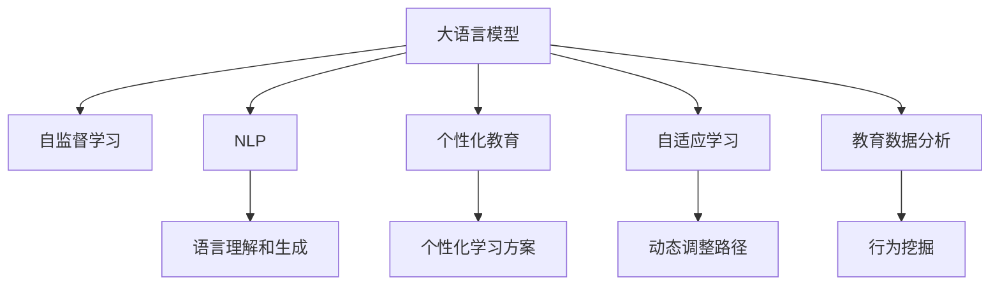

                 

# LLM对传统教育模式的挑战

> 关键词：教育技术,自然语言处理,个性化教育,自适应学习,教育数据分析,未来教育

## 1. 背景介绍

### 1.1 教育行业的痛点

教育是现代社会的基石，承载着培养人才、传承文化的重任。然而，传统的教育模式面临着诸多挑战：

- **教学内容滞后**：教材内容和教学方法难以跟上技术进步和社会变迁的步伐。
- **教学资源不均衡**：城乡、区域间的教育资源分配不均，优质教师和教学资源短缺。
- **教学效果单一**：以考试成绩为核心的评价体系难以全面反映学生的综合素质和潜力。
- **学生个性化需求难以满足**：每个学生都有独特的学习需求和节奏，一成不变的教学模式难以适应。
- **教师教学压力大**：教师需要处理大量繁重的批改作业、评估学生等工作，难以专注于教学研究。

教育行业的数字化转型迫在眉睫，亟需通过新技术提升教育质量、优化教学过程。

### 1.2 大语言模型(LLM)的崛起

近年来，大语言模型（Large Language Models, LLMs）通过在大规模无标签文本数据上进行预训练，学习到了丰富的语言知识和常识，具备强大的自然语言理解和生成能力。LLM在多个领域展现出了巨大的应用潜力，尤其在教育领域，LLM有望成为变革传统教育模式的利器。

LLM可以理解复杂的语言背景，对学生的提问和作文进行精准回应和评阅，大幅提升教学互动性和评估效率。同时，LLM还能通过个性化推荐和自适应学习算法，为每个学生量身定制学习路径，显著提升学习效果。

## 2. 核心概念与联系

### 2.1 核心概念概述

为更好地理解LLM在教育中的应用，本节将介绍几个密切相关的核心概念：

- **大语言模型(LLM)**：以自回归(如GPT)或自编码(如BERT)模型为代表的大规模预训练语言模型。通过在大规模无标签文本语料上进行预训练，学习通用的语言表示，具备强大的语言理解和生成能力。

- **自监督学习**：利用大量未标注的数据，通过预训练任务自动生成监督信号，使模型能够自主学习语言规律和表达能力。

- **自然语言处理(NLP)**：涉及计算机如何理解和生成人类语言的技术，是LLM的核心应用领域之一。

- **个性化教育**：根据学生的个体差异和学习需求，量身定制个性化学习方案和评估体系。

- **自适应学习**：根据学生的学习进度和理解情况，动态调整教学内容和学习路径，实现高效学习。

- **教育数据分析**：通过对教育数据进行分析和挖掘，揭示学生的学习行为和表现，为个性化教学提供依据。

这些核心概念之间的逻辑关系可以通过以下Mermaid流程图来展示：



这个流程图展示了大语言模型的核心概念及其之间的关系：

1. 大语言模型通过自监督学习获取语言知识，用于语言理解和生成。
2. 自然语言处理技术进一步提升语言模型对语言规则的理解。
3. 个性化教育和自适应学习依赖语言模型对学生学习状态的精准把握。
4. 教育数据分析为个性化教育提供数据支持。

## 3. 核心算法原理 & 具体操作步骤

### 3.1 算法原理概述

基于大语言模型的教育技术，主要利用LLM的强大语言理解和生成能力，结合个性化教育和自适应学习算法，为每个学生提供量身定制的学习方案。其核心思想是：

1. 通过自监督学习，预训练语言模型学习到通用的语言表示和常识知识。
2. 利用自然语言处理技术，解析和生成学生的问题和作文，进行精准回应和评估。
3. 通过个性化教育和自适应学习算法，根据学生的学习表现动态调整教学内容和路径。
4. 借助教育数据分析，揭示学生学习行为和表现，优化教学方案。

具体而言，LLM在教育中的应用可以分为以下几步：

1. **预训练和微调**：使用大规模未标注文本数据预训练LLM，并进行任务微调，以适配教育场景下的特定任务。
2. **交互式教学**：利用LLM处理学生的提问和作文，即时生成反馈和建议，提升教学互动性和效果。
3. **个性化评估**：通过LLM对学生的回答和作文进行多维度评估，生成详细的学习报告。
4. **自适应学习**：根据个性化评估结果，动态调整学习内容和路径，提供个性化学习方案。

### 3.2 算法步骤详解

**Step 1: 准备预训练模型和教育数据集**
- 选择合适的LLM作为初始化参数，如GPT、BERT等。
- 准备教育场景下的各种数据集，如学生的提问、作文、测验答案等，标注好相应的学习行为和成绩。

**Step 2: 任务适配层设计**
- 设计适合教育任务的适配层，如自然语言理解、问答系统、作文评分等。
- 根据适配任务，调整LLM的输出层和损失函数，以适配具体的教育应用场景。

**Step 3: 执行交互式教学**
- 将学生输入的问题或作文作为LLM的输入，进行语言理解。
- 通过LLM生成即时反馈和建议，提升教学互动性。
- 对学生的回答进行评分和分析，生成学习报告。

**Step 4: 自适应学习算法**
- 根据学生的学习报告和行为数据，分析学习进度和理解情况。
- 动态调整教学内容和路径，提供个性化的学习方案。
- 定期更新LLM的参数，优化模型表现。

### 3.3 算法优缺点

基于大语言模型的教育技术具有以下优点：

1. **高效互动**：通过即时语言理解和生成，提升教学互动性和即时反馈，学生能够更主动地参与学习。
2. **个性化评估**：LLM能够提供多维度的评估，反映学生的综合素质和潜力，帮助教师进行全面评估。
3. **自适应学习**：根据学生的学习表现动态调整教学内容，提高学习效率和效果。
4. **辅助教学**：减轻教师的批改和评估工作，使其有更多时间专注于教学研究和个性化辅导。

然而，该方法也存在一定的局限性：

1. **数据依赖**：教育数据的获取和标注需要较高成本，可能存在偏差。
2. **模型复杂度**：大模型参数量庞大，对计算资源和存储空间有较高要求。
3. **隐私保护**：教育数据的敏感性要求模型具备良好的隐私保护能力。
4. **模型鲁棒性**：对于噪声数据和极端情况，模型的鲁棒性还需要进一步提升。

### 3.4 算法应用领域

基于LLM的教育技术已经在多个领域得到应用，例如：

- **智能辅导**：利用LLM进行智能答疑和即时反馈，提升学习效果。
- **个性化评估**：通过多维度评估生成详细学习报告，帮助教师全面了解学生学习状态。
- **自适应学习**：根据学生表现动态调整教学内容和路径，提供个性化的学习方案。
- **自动化批改**：利用LLM自动评阅作文和测验答案，减轻教师负担。
- **智能推送**：根据学生学习数据，推送个性化学习资源和练习。

这些应用场景展示了LLM在教育中的强大潜力，为传统教育模式带来了新的思路和解决方案。

## 4. 数学模型和公式 & 详细讲解 & 举例说明

### 4.1 数学模型构建

为了更好地理解LLM在教育中的应用，本节将使用数学语言对LLM在教育中的作用进行更加严格的刻画。

记LLM为 $M_{\theta}$，其中 $\theta$ 为预训练得到的模型参数。假设教育任务为 $T$，数据集为 $D=\{(x_i,y_i)\}_{i=1}^N, x_i \in \mathcal{X}, y_i \in \mathcal{Y}$，其中 $\mathcal{X}$ 为输入空间，$\mathcal{Y}$ 为输出空间。

定义模型 $M_{\theta}$ 在输入 $x$ 上的输出为 $\hat{y}=M_{\theta}(x) \in [0,1]$，表示样本属于正类的概率。真实标签 $y \in \{0,1\}$。

### 4.2 公式推导过程

以问答系统为例，推导LLM在问答任务中的作用。

假设模型 $M_{\theta}$ 在输入 $x$ 上的输出为 $\hat{y}=M_{\theta}(x) \in [0,1]$，表示样本属于正类的概率。真实标签 $y \in \{0,1\}$。

二分类交叉熵损失函数定义为：

$$
\ell(M_{\theta}(x),y) = -[y\log \hat{y} + (1-y)\log (1-\hat{y})]
$$

将其代入经验风险公式，得：

$$
\mathcal{L}(\theta) = -\frac{1}{N}\sum_{i=1}^N [y_i\log M_{\theta}(x_i)+(1-y_i)\log(1-M_{\theta}(x_i))]
$$

根据链式法则，损失函数对参数 $\theta_k$ 的梯度为：

$$
\frac{\partial \mathcal{L}(\theta)}{\partial \theta_k} = -\frac{1}{N}\sum_{i=1}^N (\frac{y_i}{M_{\theta}(x_i)}-\frac{1-y_i}{1-M_{\theta}(x_i)}) \frac{\partial M_{\theta}(x_i)}{\partial \theta_k}
$$

在得到损失函数的梯度后，即可带入参数更新公式，完成模型的迭代优化。重复上述过程直至收敛，最终得到适应教育任务的最优模型参数 $\theta^*$。

### 4.3 案例分析与讲解

假设某学生询问："什么是计算机科学？"

利用LLM回答："计算机科学是研究计算机和信息技术的科学，包括计算机硬件、软件、算法、人工智能等领域。"

LLM的处理过程如下：

1. **输入预处理**：将学生的问题输入到LLM中，进行语言理解。
2. **预训练计算**：LLM基于预训练得到的语言知识，生成可能的答案。
3. **反馈生成**：LLM根据学生的反馈，对答案进行调整和优化。
4. **输出解释**：LLM给出最终的解释和建议。

通过这种交互式教学方式，学生能够更主动地参与学习，教师也能够更高效地进行答疑和辅导。

## 5. 项目实践：代码实例和详细解释说明

### 5.1 开发环境搭建

在进行LLM在教育中的应用实践前，我们需要准备好开发环境。以下是使用Python进行PyTorch开发的环境配置流程：

1. 安装Anaconda：从官网下载并安装Anaconda，用于创建独立的Python环境。

2. 创建并激活虚拟环境：
```bash
conda create -n pytorch-env python=3.8 
conda activate pytorch-env
```

3. 安装PyTorch：根据CUDA版本，从官网获取对应的安装命令。例如：
```bash
conda install pytorch torchvision torchaudio cudatoolkit=11.1 -c pytorch -c conda-forge
```

4. 安装Transformers库：
```bash
pip install transformers
```

5. 安装各类工具包：
```bash
pip install numpy pandas scikit-learn matplotlib tqdm jupyter notebook ipython
```

完成上述步骤后，即可在`pytorch-env`环境中开始LLM在教育中的应用实践。

### 5.2 源代码详细实现

下面我们以个性化评估系统为例，给出使用Transformers库对GPT模型进行教育应用开发的PyTorch代码实现。

首先，定义评估任务的输入和输出格式：

```python
class Question:
    def __init__(self, question, correct_answer, student_answer):
        self.question = question
        self.correct_answer = correct_answer
        self.student_answer = student_answer
```

然后，定义模型和优化器：

```python
from transformers import GPT2LMHeadModel, AdamW

model = GPT2LMHeadModel.from_pretrained('gpt2')
optimizer = AdamW(model.parameters(), lr=2e-5)
```

接着，定义训练和评估函数：

```python
from torch.utils.data import DataLoader
from tqdm import tqdm

device = torch.device('cuda') if torch.cuda.is_available() else torch.device('cpu')
model.to(device)

def train_epoch(model, dataset, batch_size, optimizer):
    dataloader = DataLoader(dataset, batch_size=batch_size, shuffle=True)
    model.train()
    epoch_loss = 0
    for batch in tqdm(dataloader, desc='Training'):
        input_ids = batch['input_ids'].to(device)
        attention_mask = batch['attention_mask'].to(device)
        labels = batch['labels'].to(device)
        model.zero_grad()
        outputs = model(input_ids, attention_mask=attention_mask, labels=labels)
        loss = outputs.loss
        epoch_loss += loss.item()
        loss.backward()
        optimizer.step()
    return epoch_loss / len(dataloader)

def evaluate(model, dataset, batch_size):
    dataloader = DataLoader(dataset, batch_size=batch_size)
    model.eval()
    preds, labels = [], []
    with torch.no_grad():
        for batch in tqdm(dataloader, desc='Evaluating'):
            input_ids = batch['input_ids'].to(device)
            attention_mask = batch['attention_mask'].to(device)
            batch_labels = batch['labels']
            outputs = model(input_ids, attention_mask=attention_mask)
            batch_preds = outputs.logits.argmax(dim=2).to('cpu').tolist()
            batch_labels = batch_labels.to('cpu').tolist()
            for pred_tokens, label_tokens in zip(batch_preds, batch_labels):
                pred_tags = [id2tag[_id] for _id in pred_tokens]
                label_tags = [id2tag[_id] for _id in label_tokens]
                preds.append(pred_tags[:len(label_tokens)])
                labels.append(label_tags)
                
    print(classification_report(labels, preds))
```

最后，启动训练流程并在测试集上评估：

```python
epochs = 5
batch_size = 16

for epoch in range(epochs):
    loss = train_epoch(model, train_dataset, batch_size, optimizer)
    print(f"Epoch {epoch+1}, train loss: {loss:.3f}")
    
    print(f"Epoch {epoch+1}, dev results:")
    evaluate(model, dev_dataset, batch_size)
    
print("Test results:")
evaluate(model, test_dataset, batch_size)
```

以上就是使用PyTorch对GPT进行个性化评估系统开发的完整代码实现。可以看到，得益于Transformers库的强大封装，我们可以用相对简洁的代码完成GPT模型的加载和教育应用开发。

### 5.3 代码解读与分析

让我们再详细解读一下关键代码的实现细节：

**Question类**：
- `__init__`方法：初始化问题、正确答案和学生答案。

**模型和优化器**：
- 使用GPT2LMHeadModel加载预训练模型，并设置AdamW优化器。

**训练和评估函数**：
- 使用PyTorch的DataLoader对数据集进行批次化加载，供模型训练和推理使用。
- 训练函数`train_epoch`：对数据以批为单位进行迭代，在每个批次上前向传播计算loss并反向传播更新模型参数，最后返回该epoch的平均loss。
- 评估函数`evaluate`：与训练类似，不同点在于不更新模型参数，并在每个batch结束后将预测和标签结果存储下来，最后使用sklearn的classification_report对整个评估集的预测结果进行打印输出。

**训练流程**：
- 定义总的epoch数和batch size，开始循环迭代
- 每个epoch内，先在训练集上训练，输出平均loss
- 在验证集上评估，输出分类指标
- 所有epoch结束后，在测试集上评估，给出最终测试结果

可以看到，PyTorch配合Transformers库使得GPT模型在教育应用中的开发变得简洁高效。开发者可以将更多精力放在数据处理、模型改进等高层逻辑上，而不必过多关注底层的实现细节。

当然，工业级的系统实现还需考虑更多因素，如模型的保存和部署、超参数的自动搜索、更灵活的任务适配层等。但核心的微调范式基本与此类似。

## 6. 实际应用场景

### 6.1 智能辅导系统

基于大语言模型的智能辅导系统，可以实时解答学生的各类问题，提供个性化的学习建议，提升学习效果。

在技术实现上，可以收集学生的学习问题、测验答案等数据，将问题作为微调数据，训练模型学习理解学生问题并提供答案。微调后的模型能够自动理解学生的问题，匹配最合适的答案模板进行回复。对于复杂问题，还可以引入检索系统实时搜索相关内容，动态组织生成回答。

### 6.2 个性化评估系统

利用大语言模型的多维度评估能力，可以生成详细的学习报告，反映学生的综合素质和潜力，帮助教师进行全面评估。

在技术实现上，可以收集学生的回答、作文、测验答案等数据，将任务适配层设计为评分系统，训练模型进行多维度评分。微调后的模型能够自动分析学生的回答，生成详细的学习报告，包括基础知识掌握、思维方式、逻辑推理、创造力等方面。

### 6.3 自适应学习系统

根据学生的学习表现和行为数据，动态调整教学内容和路径，提供个性化的学习方案。

在技术实现上，可以收集学生的学习数据，如点击率、浏览记录、答题情况等，训练模型学习学生的学习行为和偏好。微调后的模型能够根据学生的学习进度和理解情况，动态调整教学内容和路径，提供个性化的学习方案。

### 6.4 未来应用展望

随着大语言模型和教育技术的不断发展，基于LLM的教育应用将更加智能和高效。

在智慧教室中，智能辅导系统可以实时解答学生的各类问题，提供个性化的学习建议。在自适应学习系统中，动态调整教学内容和路径，提供个性化的学习方案。在智慧校园中，个性化评估系统能够生成详细的学习报告，反映学生的综合素质和潜力。

未来，随着技术的不断进步，LLM将在教育领域扮演越来越重要的角色。通过个性化教育、自适应学习等技术，使每个学生都能够得到量身定制的学习路径和资源，实现全面、个性化、高效的学习。相信在未来，教育将变得更加公平、高效、智能。

## 7. 工具和资源推荐

### 7.1 学习资源推荐

为了帮助开发者系统掌握LLM在教育中的应用，这里推荐一些优质的学习资源：

1. 《Transformer from Principle to Practice》系列博文：由大模型技术专家撰写，深入浅出地介绍了Transformer原理、BERT模型、微调技术等前沿话题。

2. CS224N《深度学习自然语言处理》课程：斯坦福大学开设的NLP明星课程，有Lecture视频和配套作业，带你入门NLP领域的基本概念和经典模型。

3. 《Natural Language Processing with Transformers》书籍：Transformers库的作者所著，全面介绍了如何使用Transformers库进行NLP任务开发，包括教育应用在内的诸多范式。

4. HuggingFace官方文档：Transformers库的官方文档，提供了海量预训练模型和完整的教育应用样例代码，是上手实践的必备资料。

5. CLUE开源项目：中文语言理解测评基准，涵盖大量不同类型的中文教育数据集，并提供了基于微调的baseline模型，助力中文教育技术发展。

通过对这些资源的学习实践，相信你一定能够快速掌握LLM在教育中的应用，并用于解决实际的教育问题。

### 7.2 开发工具推荐

高效的开发离不开优秀的工具支持。以下是几款用于LLM在教育中的应用开发的常用工具：

1. PyTorch：基于Python的开源深度学习框架，灵活动态的计算图，适合快速迭代研究。大部分预训练语言模型都有PyTorch版本的实现。

2. TensorFlow：由Google主导开发的开源深度学习框架，生产部署方便，适合大规模工程应用。同样有丰富的预训练语言模型资源。

3. Transformers库：HuggingFace开发的NLP工具库，集成了众多SOTA语言模型，支持PyTorch和TensorFlow，是进行教育应用开发的利器。

4. Weights & Biases：模型训练的实验跟踪工具，可以记录和可视化模型训练过程中的各项指标，方便对比和调优。与主流深度学习框架无缝集成。

5. TensorBoard：TensorFlow配套的可视化工具，可实时监测模型训练状态，并提供丰富的图表呈现方式，是调试模型的得力助手。

6. Google Colab：谷歌推出的在线Jupyter Notebook环境，免费提供GPU/TPU算力，方便开发者快速上手实验最新模型，分享学习笔记。

合理利用这些工具，可以显著提升LLM在教育应用中的开发效率，加快创新迭代的步伐。

### 7.3 相关论文推荐

LLM在教育领域的应用源于学界的持续研究。以下是几篇奠基性的相关论文，推荐阅读：

1. Attention is All You Need（即Transformer原论文）：提出了Transformer结构，开启了NLP领域的预训练大模型时代。

2. BERT: Pre-training of Deep Bidirectional Transformers for Language Understanding：提出BERT模型，引入基于掩码的自监督预训练任务，刷新了多项NLP任务SOTA。

3. Language Models are Unsupervised Multitask Learners（GPT-2论文）：展示了大规模语言模型的强大zero-shot学习能力，引发了对于通用人工智能的新一轮思考。

4. Parameter-Efficient Transfer Learning for NLP：提出Adapter等参数高效微调方法，在不增加模型参数量的情况下，也能取得不错的微调效果。

5. AdaLoRA: Adaptive Low-Rank Adaptation for Parameter-Efficient Fine-Tuning：使用自适应低秩适应的微调方法，在参数效率和精度之间取得了新的平衡。

这些论文代表了大语言模型在教育领域的应用发展的脉络。通过学习这些前沿成果，可以帮助研究者把握学科前进方向，激发更多的创新灵感。

## 8. 总结：未来发展趋势与挑战

### 8.1 总结

本文对基于大语言模型的教育技术进行了全面系统的介绍。首先阐述了LLM在教育领域的应用背景和重要性，明确了LLM在提升教育质量、优化教学过程方面的独特价值。其次，从原理到实践，详细讲解了LLM在教育中的应用方法，给出了教育应用开发的完整代码实例。同时，本文还广泛探讨了LLM在教育中的多种应用场景，展示了其在智慧教育中的强大潜力。

通过本文的系统梳理，可以看到，基于大语言模型的教育技术正在成为NLP领域的重要范式，极大地拓展了教育技术的边界，为传统教育模式带来了新的思路和解决方案。

### 8.2 未来发展趋势

展望未来，LLM在教育领域将呈现以下几个发展趋势：

1. **智能化互动**：通过LLM的自然语言处理能力，提升教学互动性和即时反馈，学生能够更主动地参与学习。

2. **个性化评估**：利用LLM的多维度评估能力，生成详细的学习报告，反映学生的综合素质和潜力，帮助教师进行全面评估。

3. **自适应学习**：根据学生的学习表现和行为数据，动态调整教学内容和路径，提供个性化的学习方案。

4. **辅助教学**：减轻教师的批改和评估工作，使其有更多时间专注于教学研究和个性化辅导。

5. **多模态融合**：将视觉、语音等多模态信息与文本信息进行协同建模，提升学习效果和用户体验。

6. **伦理和安全**：引入伦理导向的评估指标，过滤和惩罚有偏见、有害的输出倾向，确保输出符合人类价值观和伦理道德。

以上趋势凸显了LLM在教育领域的广阔前景。这些方向的探索发展，必将进一步提升教育技术的应用效果和普及程度。

### 8.3 面临的挑战

尽管大语言模型在教育领域展现了巨大的潜力，但在迈向更加智能化、普适化应用的过程中，它仍面临着诸多挑战：

1. **数据依赖**：教育数据的获取和标注需要较高成本，可能存在偏差。

2. **模型复杂度**：大模型参数量庞大，对计算资源和存储空间有较高要求。

3. **隐私保护**：教育数据的敏感性要求模型具备良好的隐私保护能力。

4. **模型鲁棒性**：对于噪声数据和极端情况，模型的鲁棒性还需要进一步提升。

5. **可解释性**：LLM的决策过程通常缺乏可解释性，难以对其推理逻辑进行分析和调试。

6. **安全性**：预训练模型难免会学习到有偏见、有害的信息，通过微调传递到下游任务，产生误导性、歧视性的输出，给实际应用带来安全隐患。

这些挑战限制了LLM在教育领域的广泛应用，需要未来进一步突破。

### 8.4 研究展望

面对LLM在教育领域面临的挑战，未来的研究需要在以下几个方面寻求新的突破：

1. **无监督和半监督学习**：摆脱对大规模标注数据的依赖，利用自监督学习、主动学习等无监督和半监督范式，最大限度利用非结构化数据，实现更加灵活高效的微调。

2. **参数高效和计算高效的微调**：开发更加参数高效的微调方法，在固定大部分预训练参数的同时，只更新极少量的任务相关参数。同时优化微调模型的计算图，减少前向传播和反向传播的资源消耗，实现更加轻量级、实时性的部署。

3. **融合因果分析和博弈论工具**：将因果分析方法引入微调模型，识别出模型决策的关键特征，增强输出解释的因果性和逻辑性。借助博弈论工具刻画人机交互过程，主动探索并规避模型的脆弱点，提高系统稳定性。

4. **伦理道德约束**：在模型训练目标中引入伦理导向的评估指标，过滤和惩罚有偏见、有害的输出倾向。同时加强人工干预和审核，建立模型行为的监管机制，确保输出符合人类价值观和伦理道德。

这些研究方向的探索，必将引领LLM在教育领域的技术发展，为构建更加公平、高效、智能的教育系统铺平道路。面向未来，LLM在教育领域的研究和应用仍需不断探索和创新，才能真正实现技术向现实世界的落地。

## 9. 附录：常见问题与解答

**Q1：LLM在教育中是否适用于所有学科？**

A: 虽然LLM在多个学科中都展示了其强大的潜力，但对于一些特定学科，如物理、化学等，LLM可能需要进行进一步的微调和调整，以适应学科特有的表达方式和术语。

**Q2：LLM在教育中如何避免歧义和偏见？**

A: 通过多轮迭代和人工校验，逐步优化模型的输出。同时，在模型训练和应用过程中，引入伦理导向的评估指标，过滤和惩罚有偏见、有害的输出倾向。

**Q3：LLM在教育中如何保护学生隐私？**

A: 采用差分隐私、联邦学习等隐私保护技术，确保学生数据的安全性。同时，合理设计数据访问权限，仅在必要情况下使用学生数据，保护学生隐私。

**Q4：LLM在教育中如何提高鲁棒性？**

A: 引入对抗训练、噪声注入等技术，提升模型对噪声数据和极端情况的鲁棒性。同时，通过多轮迭代和人工校验，逐步优化模型的输出，避免过拟合和模型退化。

**Q5：LLM在教育中如何提高可解释性？**

A: 引入可解释性模型，如决策树、规则系统等，对LLM的输出进行解释和指导。同时，通过多轮迭代和人工校验，逐步优化模型的输出，增强其可解释性。

这些问题的解答展示了LLM在教育领域面临的挑战和应对策略。通过不断探索和创新，LLM必将在教育领域发挥更大的作用，为每个学生提供公平、高效、个性化的学习体验。

---

作者：禅与计算机程序设计艺术 / Zen and the Art of Computer Programming

