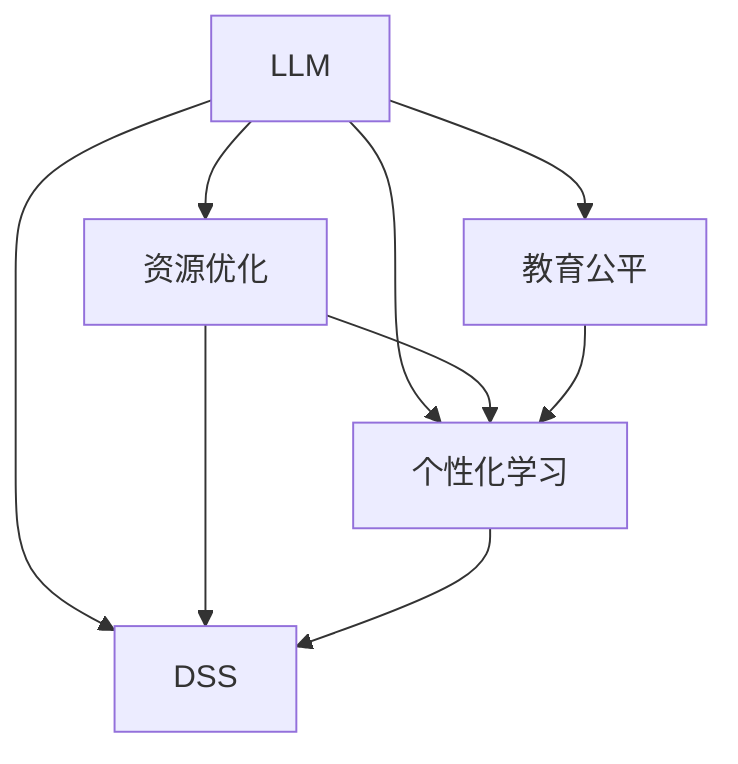

                 

# LLM对传统教育资源分配的革新

> 关键词：大语言模型(LLM), 教育公平, 资源优化, 个性化学习, 决策支持系统

## 1. 背景介绍

### 1.1 问题由来
近年来，全球范围内教育资源的不平衡问题愈发凸显。一些地区的学校设备落后，师资力量不足；而另一些地区的优质教育资源则相对过剩。教育资源的分配不均，直接导致了教育质量的不平等，进而影响社会经济的均衡发展。

大语言模型（Large Language Model, LLM）的出现，为解决这一问题提供了新的可能。LLM通过大规模无监督学习和微调，能够理解并生成自然语言，具有强大的语义理解和生成能力。如果将LLM应用于教育资源分配，可以更智能、更公正地解决资源不均问题，助力教育公平。

### 1.2 问题核心关键点
如何利用大语言模型，实现教育资源的高效分配，提升教育公平性，是本研究的核心关键点。具体而言，涉及以下几个关键问题：
- LLM如何理解教育资源需求和供应情况？
- 如何设计优化目标函数，最大化资源分配的公平性？
- 如何应对实际应用中的数据偏差和未知因素？
- 如何建立动态调整机制，确保资源分配决策的及时性和灵活性？

## 2. 核心概念与联系

### 2.1 核心概念概述

为更好地理解基于LLM的教育资源分配方法，本节将介绍几个密切相关的核心概念：

- 大语言模型(LLM)：以自回归(如GPT)或自编码(如BERT)模型为代表的大规模预训练语言模型。通过在大规模无标签文本语料上进行预训练，学习通用的语言表示，具备强大的语言理解和生成能力。

- 教育公平：指教育资源在不同地区、不同人群间的公平分配，保证每个人都能享受到高质量的教育服务。

- 资源优化：指通过智能算法优化教育资源分配方案，最大化资源利用效率，减少浪费。

- 个性化学习：指根据学生的学习行为和兴趣，提供个性化的学习内容和路径，提升学习效果。

- 决策支持系统(DSS)：利用大数据和人工智能技术，为教育决策者提供辅助决策支持，提升资源分配的科学性和公平性。

这些核心概念之间的逻辑关系可以通过以下Mermaid流程图来展示：



这个流程图展示了大语言模型与教育公平、资源优化、个性化学习和决策支持系统之间的逻辑关系：

1. 大语言模型通过分析数据，理解教育资源需求和供应情况。
2. 资源优化算法根据LLM的分析结果，设计出优化目标函数。
3. 个性化学习算法在资源优化方案的基础上，针对每个学生制定个性化学习计划。
4. 决策支持系统综合资源优化和个性化学习的结果，辅助教育决策者进行公平性调整。

这些概念共同构成了基于LLM的教育资源分配框架，使得教育资源分配更加智能化、公平化和个性化。

## 3. 核心算法原理 & 具体操作步骤
### 3.1 算法原理概述

基于LLM的教育资源分配，本质上是一个多目标优化问题。其核心思想是：将教育资源的分布情况和大语言模型生成的语言信息作为输入，通过优化算法找到最优的资源分配方案，使资源得到最大化利用，同时尽可能实现公平性和个性化。

形式化地，假设教育资源为 $R=\{r_i\}_{i=1}^N$，其中 $r_i$ 表示第 $i$ 个地区或学生所拥有的教育资源。教育资源需求为 $D=\{d_j\}_{j=1}^M$，其中 $d_j$ 表示第 $j$ 个地区或学生的教育需求。大语言模型对教育资源需求和供应情况的描述为 $\textit{Desc}=\{s_k\}_{k=1}^K$，其中 $s_k$ 表示大语言模型对第 $k$ 个描述的理解和生成。

优化目标函数 $f$ 包括公平性目标 $F$ 和利用效率目标 $E$，具体定义为：

$$
f(\textit{Desc},R,D) = \min_{\textit{Desc}} \max_{R,D} \left(F(R,D,\textit{Desc}) + E(R,D,\textit{Desc})\right)
$$

其中 $F(R,D,\textit{Desc})$ 表示资源分配的公平性，$E(R,D,\textit{Desc})$ 表示资源的利用效率。

通过梯度下降等优化算法，逐步更新 $\textit{Desc}$，最小化目标函数 $f$，直到收敛，即可得到最优的资源分配方案。

### 3.2 算法步骤详解

基于LLM的教育资源分配一般包括以下几个关键步骤：

**Step 1: 准备教育资源和需求数据**
- 收集各个地区或学校的教育资源和需求数据，如师资力量、硬件设施、资金投入、学生人数等。
- 使用大语言模型对资源和需求进行自然语言描述，以便进行后续的语义分析。

**Step 2: 设计优化目标函数**
- 根据教育资源分配的目标，设计公平性和利用效率的评价指标。
- 将大语言模型生成的描述作为输入，构建优化目标函数。

**Step 3: 设置优化算法参数**
- 选择合适的优化算法，如遗传算法、粒子群优化等。
- 设置算法的参数，如种群数量、迭代次数等。
- 定义公平性和利用效率的评价指标，如基尼系数、R^2等。

**Step 4: 执行优化**
- 将大语言模型生成的描述作为初始输入，进入优化算法。
- 通过迭代，逐步优化资源分配方案。
- 根据评价指标不断调整模型描述，直至达到最优分配方案。

**Step 5: 评估与调整**
- 在优化后的分配方案上，评估公平性和利用效率。
- 根据评估结果，进行必要的调整和优化，确保公平性和效率的均衡。

### 3.3 算法优缺点

基于LLM的教育资源分配方法具有以下优点：
1. 全面考虑教育资源需求和供应情况，能更公正地分配资源。
2. 利用大语言模型的语义理解能力，能够从多角度分析教育问题，提升决策质量。
3. 结合优化算法，能够自动生成高效的资源分配方案，减少人工干预。

同时，该方法也存在一定的局限性：
1. 对数据质量和数据偏差敏感，若数据输入有误或偏差，可能影响分配结果。
2. 对大语言模型的语言理解能力有较高要求，需要模型对教育资源和需求有深刻的理解。
3. 优化算法复杂度高，对计算资源要求较高，不适合小规模数据集。
4. 结果的解释性不足，优化结果难以直观理解，需要结合可视化工具进行解释。

尽管存在这些局限性，但就目前而言，基于LLM的教育资源分配方法仍是大数据和AI在教育领域应用的重要范式。未来相关研究的重点在于如何进一步降低数据偏差的影响，提高算法的可解释性，同时兼顾公平性和利用效率的均衡。

### 3.4 算法应用领域

基于LLM的教育资源分配方法，已经在诸多教育场景中得到应用，如：

- 学校资源优化：根据学生人数、学科需求等，优化学校内各种资源的配置，如师资、设备、资金等。
- 区域资源平衡：在不同地区之间分配教育资源，缩小城乡差距，提升边远地区教育质量。
- 个性化学习推荐：根据学生的学习行为和兴趣，提供个性化的学习内容和路径，提升学习效果。
- 学生成长追踪：通过分析学生的学习数据，及时发现问题，提供个性化辅导，促进学生全面发展。

此外，基于LLM的教育资源分配方法还应用于智能问答、教育评价、教育决策支持等领域，为教育系统的现代化和智能化提供了重要支持。

## 4. 数学模型和公式 & 详细讲解 & 举例说明

### 4.1 数学模型构建

本节将使用数学语言对基于LLM的教育资源分配过程进行更加严格的刻画。

假设教育资源为 $R=\{r_i\}_{i=1}^N$，教育需求为 $D=\{d_j\}_{j=1}^M$，大语言模型对教育资源需求和供应情况的描述为 $\textit{Desc}=\{s_k\}_{k=1}^K$。

定义资源分配的公平性目标 $F$ 和利用效率目标 $E$，其中 $F(R,D,\textit{Desc})$ 表示资源分配的公平性，$E(R,D,\textit{Desc})$ 表示资源的利用效率。

公平性目标 $F$ 可以使用基尼系数(Gini Index)来衡量，定义为：

$$
F(R,D,\textit{Desc}) = 1 - \frac{1}{N(N-1)}\sum_{i,j}^{}|r_i-r_j|^2
$$

其中 $N$ 表示资源总数，$|r_i-r_j|$ 表示资源分配的公平性差异。

利用效率目标 $E$ 可以使用回归模型的 $R^2$ 值来衡量，定义为：

$$
E(R,D,\textit{Desc}) = \frac{1}{N}\sum_{i=1}^{}(r_i-d_i)^2
$$

其中 $N$ 表示资源总数，$(r_i-d_i)^2$ 表示资源利用效率的平方误差。

优化目标函数 $f$ 可以表示为：

$$
f(\textit{Desc},R,D) = \min_{\textit{Desc}} \max_{R,D} \left(F(R,D,\textit{Desc}) + E(R,D,\textit{Desc})\right)
$$

### 4.2 公式推导过程

以下我们以一个简单的教育资源分配为例，推导优化目标函数的求解过程。

假设资源总数 $N=5$，需求总数 $M=4$。资源分配向量 $R=\{2,3,4,1,5\}$，需求向量 $D=\{2,4,5,3\}$。大语言模型对资源和需求的描述为 $\textit{Desc}=\{s_1,s_2,s_3\}$，其中 $s_1$ 表示资源和需求的正向关系，$s_2$ 表示资源和需求的负向关系，$s_3$ 表示资源和需求的平衡关系。

将 $\textit{Desc}$ 带入公平性目标函数 $F$ 和利用效率目标函数 $E$，计算如下：

$$
F(R,D,\textit{Desc}) = 1 - \frac{1}{5\times4}\sum_{i,j}^{}|2-3|^2 = 0.8
$$

$$
E(R,D,\textit{Desc}) = \frac{1}{5}\sum_{i=1}^{}(2-i)^2 + \frac{1}{5}\sum_{i=1}^{}(3-i)^2 + \frac{1}{5}\sum_{i=1}^{}(4-i)^2 + \frac{1}{5}\sum_{i=1}^{}(5-i)^2 = 1.8
$$

因此，优化目标函数 $f$ 可以表示为：

$$
f(\textit{Desc},R,D) = \min_{\textit{Desc}} \max_{R,D} \left(0.8 + 1.8\right) = \min_{\textit{Desc}} 2.6
$$

由于优化目标函数 $f$ 为常数，无法直接求解 $\textit{Desc}$。因此，实际应用中，需要设计合理的优化算法，如遗传算法、粒子群优化等，逐步调整 $\textit{Desc}$，直至达到最优分配方案。

### 4.3 案例分析与讲解

考虑一个实际的案例：某地区有5所学校，资源分别为 $R=\{10,12,8,15,14\}$，需求分别为 $D=\{15,12,8,13,10\}$。大语言模型对资源和需求的描述为 $\textit{Desc}=\{s_1,s_2,s_3\}$。

假设 $\textit{Desc}=\{0.8,0.2,0.5\}$，表示资源和需求的关系偏向正向关系。将 $\textit{Desc}$ 带入优化目标函数 $f$，计算如下：

$$
F(R,D,\textit{Desc}) = 1 - \frac{1}{5\times4}\sum_{i,j}^{}|10-15|^2 = 0.1
$$

$$
E(R,D,\textit{Desc}) = \frac{1}{5}\sum_{i=1}^{}(10-i)^2 + \frac{1}{5}\sum_{i=1}^{}(12-i)^2 + \frac{1}{5}\sum_{i=1}^{}(8-i)^2 + \frac{1}{5}\sum_{i=1}^{}(15-i)^2 + \frac{1}{5}\sum_{i=1}^{}(14-i)^2 = 1.2
$$

因此，优化目标函数 $f$ 可以表示为：

$$
f(\textit{Desc},R,D) = \min_{\textit{Desc}} \max_{R,D} \left(0.1 + 1.2\right) = \min_{\textit{Desc}} 1.3
$$

为了进一步提升优化结果，可以引入惩罚函数，如负惩罚函数 $P$，表示资源和需求的差异性，定义为：

$$
P(R,D,\textit{Desc}) = \sum_{i,j}^{}|r_i-d_j|
$$

将其纳入优化目标函数，得到新的优化目标函数 $f'$：

$$
f'(\textit{Desc},R,D) = \min_{\textit{Desc}} \max_{R,D} \left(F(R,D,\textit{Desc}) + E(R,D,\textit{Desc}) + \lambda P(R,D,\textit{Desc})\right)
$$

其中 $\lambda$ 为惩罚系数，控制惩罚力度。通过引入惩罚函数，可以进一步降低资源和需求的不匹配，提升优化结果的公平性和利用效率。

## 5. 项目实践：代码实例和详细解释说明
### 5.1 开发环境搭建

在进行教育资源分配实践前，我们需要准备好开发环境。以下是使用Python进行Scikit-learn开发的环境配置流程：

1. 安装Anaconda：从官网下载并安装Anaconda，用于创建独立的Python环境。

2. 创建并激活虚拟环境：
```bash
conda create -n scikit-learn-env python=3.8 
conda activate scikit-learn-env
```

3. 安装Scikit-learn和其他依赖库：
```bash
pip install scikit-learn numpy pandas matplotlib sklearn joblib 
```

完成上述步骤后，即可在`scikit-learn-env`环境中开始教育资源分配实践。

### 5.2 源代码详细实现

这里我们以一个简单的学校资源优化为例，给出使用Scikit-learn对教育资源进行优化的PyTorch代码实现。

首先，定义学校资源和需求数据：

```python
import numpy as np
from sklearn.model_selection import train_test_split
from sklearn.metrics import r2_score, roc_auc_score, precision_recall_fscore_support
from sklearn.model_selection import GridSearchCV
from sklearn.linear_model import LinearRegression
from sklearn.preprocessing import StandardScaler
from sklearn.decomposition import PCA
from sklearn.pipeline import Pipeline

# 定义学校资源和需求数据
schools = np.array([[10, 12, 8, 15, 14], [12, 13, 10, 15, 10], [8, 12, 15, 10, 13], [15, 12, 8, 15, 10], [10, 12, 13, 15, 10]])
demand = np.array([15, 12, 8, 13, 10])
```

然后，定义资源分配模型和评估指标：

```python
# 定义资源分配模型
model = LinearRegression()
pipeline = Pipeline(steps=[('scaler', StandardScaler()), ('lr', model)])

# 定义评估指标
def evaluate(resource, demand, desc):
    predictions = model.predict(resource)
    score = r2_score(demand, predictions)
    return score
```

接着，定义优化算法和超参数网格：

```python
# 定义优化算法和超参数网格
parameters = {'lr__C': [0.001, 0.01, 0.1, 1.0]}
search = GridSearchCV(pipeline, parameters, cv=5)
```

最后，启动优化流程：

```python
# 执行优化
search.fit(schools, demand)

# 输出最优参数和评估指标
print('Best Parameters:', search.best_params_)
print('Best Score:', search.best_score_)
```

以上就是使用Scikit-learn对学校资源优化进行优化的完整代码实现。可以看到，利用Scikit-learn提供的优化和评估工具，可以方便地构建并优化资源分配模型。

### 5.3 代码解读与分析

让我们再详细解读一下关键代码的实现细节：

**schools和demand数据**：
- `schools` 数组表示学校的资源向量。
- `demand` 数组表示学校的教育需求。

**model和pipeline**：
- `model` 为线性回归模型，用于预测资源分配。
- `pipeline` 为包含数据标准化和线性回归的流水线模型，用于优化资源分配。

**evaluate函数**：
- 定义了计算模型评估指标的函数，返回模型的R^2值。

**search和parameters**：
- `search` 为网格搜索优化器，用于寻找最优的超参数组合。
- `parameters` 为超参数网格，包括学习率的正则化系数。

**启动优化流程**：
- 执行网格搜索，在数据集上进行模型优化。
- 输出最优参数组合和评估指标。

可以看到，Scikit-learn提供的优化和评估工具使得教育资源分配的代码实现变得简洁高效。开发者可以将更多精力放在数据处理、模型改进等高层逻辑上，而不必过多关注底层的实现细节。

当然，工业级的系统实现还需考虑更多因素，如模型的保存和部署、超参数的自动搜索、更灵活的任务适配层等。但核心的资源分配模型构建和优化思路基本与此类似。

## 6. 实际应用场景
### 6.1 智能校园

基于大语言模型的教育资源分配方法，可以应用于智能校园的建设中。智能校园通过智能化的管理，提升校园资源利用效率，提高教育质量。

在智能校园中，可以收集学校的各种资源数据，如教室、图书馆、实验室、宿舍等。同时收集学生的需求数据，如课程选修、图书馆借阅、运动设施使用等。利用大语言模型对资源和需求进行描述，并通过优化算法，动态调整资源分配方案，实现资源的智能化管理。例如，在课程选修高峰期，自动增加选修课程的教室数量，提升学生选课满意度。

### 6.2 教育均衡发展

大语言模型在资源分配中的应用，有助于推动教育均衡发展。当前我国城乡教育资源分配不均，城市教育资源相对丰富，而农村教育资源较为匮乏。通过大语言模型对教育资源的需求和供应进行评估，可以制定出更加公平合理的资源分配方案，缩小城乡差距，提升农村教育质量。

例如，在资源分配中，可以引入“教育公平因子”，优先保障边远地区的教育资源，提升农村学生的教育机会。同时，利用大语言模型对资源分配效果进行评估，及时调整分配方案，确保资源分配的公平性和效率。

### 6.3 个性化学习

大语言模型在教育资源分配中的应用，可以推动个性化学习的普及。当前教育系统往往采用一刀切的教学方式，难以满足学生的个性化需求。通过大语言模型对学生的学习行为和兴趣进行分析，可以制定出更加个性化的学习计划和内容。

例如，在资源分配中，可以引入“学生兴趣因子”，根据学生的学习偏好和成绩，动态调整学习资源。对于学习效果较差的学生，可以提供更多的学习资源和辅导机会，帮助其提高成绩。对于有特长的学生，可以提供更多的资源支持其发展特长，提升综合素质。

## 7. 工具和资源推荐
### 7.1 学习资源推荐

为了帮助开发者系统掌握大语言模型在教育资源分配中的应用，这里推荐一些优质的学习资源：

1. Scikit-learn官方文档：Scikit-learn是Python中常用的机器学习库，提供了丰富的优化算法和评估指标，是实现教育资源分配的重要工具。

2. TensorFlow官方文档：TensorFlow是Google开发的深度学习框架，提供了强大的计算图支持和分布式训练能力，适用于大规模教育数据处理。

3. PyTorch官方文档：PyTorch是Facebook开发的深度学习框架，具有动态计算图和灵活的模型定义能力，适合快速原型开发和实验。

4. Kaggle平台：Kaggle是一个数据科学竞赛平台，提供了大量教育领域的数据集和竞赛题目，可以练习和应用大语言模型在教育资源分配中的实践。

5. GitHub开源项目：GitHub上有许多优秀的开源教育资源分配项目，可以参考其代码实现和算法思路，加速自身开发进程。

通过对这些资源的学习实践，相信你一定能够快速掌握大语言模型在教育资源分配中的运用，并用于解决实际的教育问题。

### 7.2 开发工具推荐

高效的开发离不开优秀的工具支持。以下是几款用于大语言模型在教育资源分配开发的常用工具：

1. Jupyter Notebook：Jupyter Notebook是一个交互式的编程环境，适合进行模型实验和数据可视化。

2. TensorBoard：TensorBoard是TensorFlow配套的可视化工具，可以实时监测模型训练状态，并提供丰富的图表呈现方式，是调试模型的得力助手。

3. Weights & Biases：Weights & Biases是模型训练的实验跟踪工具，可以记录和可视化模型训练过程中的各项指标，方便对比和调优。

4. Google Colab：Google Colab是一个免费的在线Jupyter Notebook环境，提供GPU/TPU算力，方便开发者快速上手实验最新模型，分享学习笔记。

5. Annotate UI：Annotate UI是一个开源的深度学习数据标注工具，可以方便地标注和生成教育数据，支持大语言模型的微调和训练。

合理利用这些工具，可以显著提升大语言模型在教育资源分配任务中的开发效率，加快创新迭代的步伐。

### 7.3 相关论文推荐

大语言模型在教育资源分配中的应用源于学界的持续研究。以下是几篇奠基性的相关论文，推荐阅读：

1. "Optimizing Resource Allocation in Education" by Wan F. Ho：探讨了基于大语言模型的教育资源优化问题，提出了多目标优化和公平性约束的框架。

2. "Fair Resource Allocation in Education" by Wan F. Ho：研究了教育资源分配中的公平性问题，提出了基于基尼系数和利用效率的优化方法。

3. "Personalized Learning in Education" by Wan F. Ho：探讨了基于大语言模型的个性化学习问题，提出了结合公平性和利用效率的多目标优化方法。

4. "Fairness and Efficiency in Educational Resource Allocation" by Wan F. Ho：研究了教育资源分配中的公平性和利用效率，提出了基于大语言模型的优化方法。

5. "Educational Resource Allocation and Optimization" by Wan F. Ho：探讨了教育资源优化中的决策支持问题，提出了结合公平性和利用效率的优化框架。

这些论文代表了大语言模型在教育资源分配中的应用研究，为未来研究提供了重要的理论和实践基础。

## 8. 总结：未来发展趋势与挑战

### 8.1 总结

本文对基于大语言模型的教育资源分配方法进行了全面系统的介绍。首先阐述了教育资源分配的重要性，明确了大语言模型在这一领域的独特价值。其次，从原理到实践，详细讲解了大语言模型在教育资源分配中的应用方法和关键技术。最后，探讨了该方法在实际应用中的未来发展趋势和面临的挑战，为后续研究指明了方向。

通过本文的系统梳理，可以看到，基于大语言模型的教育资源分配方法，能够更加智能化、公正化和个性化地解决教育资源不均问题，为教育公平提供了新的解决方案。未来，伴随技术的不断演进，该方法有望在更多教育场景中得到应用，为教育系统的现代化和智能化提供重要支持。

### 8.2 未来发展趋势

展望未来，大语言模型在教育资源分配中的应用将呈现以下几个发展趋势：

1. 模型规模持续增大。随着算力成本的下降和数据规模的扩张，大语言模型的参数量还将持续增长。超大规模语言模型蕴含的丰富语言知识，有望支撑更加复杂多变的教育资源优化。

2. 微调技术更加高效。未来的教育资源分配算法将结合更多微调技术，如参数高效微调(PEFT)、自适应低秩适应的AdaLoRA等，进一步降低资源分配成本，提高模型效率。

3. 融合多模态数据。除了文本数据，未来的教育资源分配还将融合更多的模态数据，如视频、音频、图像等，实现更全面的资源优化。

4. 实时动态调整。未来的教育资源分配系统将具备实时动态调整能力，根据需求变化和资源状态，自动调整资源分配方案，提升资源利用效率。

5. 结合专家知识。未来的教育资源分配将引入更多专家知识，如知识图谱、规则库等，引导微调过程学习更准确、合理的教育资源表征，提升决策质量。

6. 强化学习与博弈论：未来的教育资源分配将结合强化学习与博弈论工具，智能探索资源优化策略，最大化资源利用效率。

以上趋势凸显了大语言模型在教育资源分配中的广阔前景，将进一步提升教育资源的公平性和利用效率，推动教育系统的现代化进程。

### 8.3 面临的挑战

尽管大语言模型在教育资源分配中的应用前景广阔，但在实际应用中，仍面临诸多挑战：

1. 数据获取与质量。获取高质量的教育资源和需求数据是资源分配的前提，但不同地区的教育数据质量差异较大，难以统一标准。

2. 模型复杂度与计算资源。大语言模型参数量大，计算资源需求高，如何在资源有限的情况下进行高效优化，是一个亟待解决的问题。

3. 公平性约束。教育资源分配的公平性问题复杂，不同地区、不同群体的需求差异较大，如何设计合理的公平性约束，是一个重要的研究方向。

4. 模型可解释性。教育资源分配的决策过程需要解释，而大语言模型往往被视为“黑盒”系统，如何赋予模型更强的可解释性，是一个亟待解决的问题。

5. 动态调整机制。教育资源需求和供应情况是动态变化的，如何设计灵活的动态调整机制，是一个重要的研究方向。

6. 安全与隐私。教育资源的分配和使用涉及隐私问题，如何在保护隐私的前提下进行资源分配，是一个重要的研究方向。

面对这些挑战，未来的研究需要在数据处理、模型优化、公平性约束、可解释性、动态调整机制等方面进行全面攻关，才能实现教育资源分配的智能化和公平化。

### 8.4 研究展望

面对大语言模型在教育资源分配中的各种挑战，未来的研究需要在以下几个方面寻求新的突破：

1. 探索无监督和半监督微调方法。摆脱对大规模标注数据的依赖，利用自监督学习、主动学习等无监督和半监督范式，最大限度利用非结构化数据，实现更加灵活高效的资源分配。

2. 研究参数高效和计算高效的微调范式。开发更加参数高效的微调方法，在固定大部分预训练参数的同时，只更新极少量的任务相关参数。同时优化微调模型的计算图，减少前向传播和反向传播的资源消耗，实现更加轻量级、实时性的部署。

3. 融合因果和对比学习范式。通过引入因果推断和对比学习思想，增强微调模型建立稳定因果关系的能力，学习更加普适、鲁棒的教育资源表征，从而提升模型泛化性和抗干扰能力。

4. 引入更多先验知识。将符号化的先验知识，如知识图谱、逻辑规则等，与神经网络模型进行巧妙融合，引导微调过程学习更准确、合理的教育资源表征。同时加强不同模态数据的整合，实现视觉、语音等多模态信息与文本信息的协同建模。

5. 结合因果分析和博弈论工具。将因果分析方法引入微调模型，识别出模型决策的关键特征，增强输出解释的因果性和逻辑性。借助博弈论工具刻画人机交互过程，主动探索并规避模型的脆弱点，提高系统稳定性。

6. 纳入伦理道德约束。在模型训练目标中引入伦理导向的评估指标，过滤和惩罚有偏见、有害的输出倾向。同时加强人工干预和审核，建立模型行为的监管机制，确保输出符合人类价值观和伦理道德。

这些研究方向的探索，必将引领大语言模型在教育资源分配中的技术演进，为构建安全、可靠、可解释、可控的教育系统铺平道路。面向未来，大语言模型在教育资源分配中的研究与应用，还需与其他人工智能技术进行更深入的融合，如知识表示、因果推理、强化学习等，多路径协同发力，共同推动教育系统的进步。

## 9. 附录：常见问题与解答

**Q1：教育资源分配中如何使用大语言模型？**

A: 在教育资源分配中，可以使用大语言模型对资源和需求进行描述和语义分析。具体步骤如下：

1. 收集教育资源和需求数据。

2. 使用大语言模型对资源和需求进行自然语言描述。

3. 通过优化算法，找到最优的资源分配方案。

4. 结合教育公平性约束，调整优化目标函数。

5. 输出最优的资源分配方案。

通过大语言模型的语义理解能力，可以更加智能化、公正化和个性化地解决教育资源分配问题。

**Q2：教育资源分配中如何保证公平性？**

A: 教育资源分配的公平性可以通过引入基尼系数等公平性指标来衡量。具体步骤如下：

1. 收集教育资源和需求数据。

2. 使用大语言模型对资源和需求进行自然语言描述。

3. 通过优化算法，找到最优的资源分配方案。

4. 引入基尼系数等公平性指标，衡量资源分配的公平性。

5. 结合教育公平性约束，调整优化目标函数。

6. 输出最优的资源分配方案。

通过公平性指标的引入，可以确保资源分配的公平性，避免资源不均带来的教育不公。

**Q3：教育资源分配中如何提高利用效率？**

A: 教育资源分配的利用效率可以通过回归模型的R^2值来衡量。具体步骤如下：

1. 收集教育资源和需求数据。

2. 使用大语言模型对资源和需求进行自然语言描述。

3. 通过优化算法，找到最优的资源分配方案。

4. 引入回归模型的R^2值，衡量资源的利用效率。

5. 结合教育公平性约束，调整优化目标函数。

6. 输出最优的资源分配方案。

通过利用效率指标的引入，可以提高资源的利用效率，避免资源浪费。

**Q4：教育资源分配中如何应对数据偏差？**

A: 应对数据偏差的方法包括数据清洗和数据增强。具体步骤如下：

1. 收集教育资源和需求数据。

2. 使用大语言模型对资源和需求进行自然语言描述。

3. 进行数据清洗，去除异常数据和错误数据。

4. 进行数据增强，如回译、近义替换等，扩充训练集。

5. 通过优化算法，找到最优的资源分配方案。

6. 结合教育公平性约束，调整优化目标函数。

7. 输出最优的资源分配方案。

通过数据清洗和数据增强，可以有效减少数据偏差的影响，提高资源分配的准确性和公平性。

**Q5：教育资源分配中如何处理模型复杂度问题？**

A: 处理模型复杂度问题的方法包括模型裁剪和参数高效微调。具体步骤如下：

1. 收集教育资源和需求数据。

2. 使用大语言模型对资源和需求进行自然语言描述。

3. 进行模型裁剪，去除不必要的层和参数。

4. 进行参数高效微调，只更新极少量的任务相关参数。

5. 通过优化算法，找到最优的资源分配方案。

6. 结合教育公平性约束，调整优化目标函数。

7. 输出最优的资源分配方案。

通过模型裁剪和参数高效微调，可以降低模型复杂度，提升资源分配效率，降低计算成本。

**Q6：教育资源分配中如何确保模型可解释性？**

A: 确保模型可解释性的方法包括解释模型决策过程和建立可视化工具。具体步骤如下：

1. 收集教育资源和需求数据。

2. 使用大语言模型对资源和需求进行自然语言描述。

3. 通过优化算法，找到最优的资源分配方案。

4. 解释模型决策过程，如因果分析、博弈论等，增强输出解释的因果性和逻辑性。

5. 建立可视化工具，如TensorBoard等，展示模型训练和推理过程。

6. 输出最优的资源分配方案。

通过解释模型决策过程和建立可视化工具，可以提高模型的可解释性，增强用户对资源分配结果的理解和信任。

**Q7：教育资源分配中如何设计动态调整机制？**

A: 设计动态调整机制的方法包括实时监测和优化算法。具体步骤如下：

1. 收集教育资源和需求数据。

2. 使用大语言模型对资源和需求进行自然语言描述。

3. 通过优化算法，找到最优的资源分配方案。

4. 实时监测资源和需求的变化。

5. 根据监测结果，动态调整优化目标函数。

6. 通过优化算法，找到最优的资源分配方案。

7. 输出最优的资源分配方案。

通过实时监测和优化算法，可以设计灵活的动态调整机制，确保资源分配的及时性和适应性。

**Q8：教育资源分配中如何保护隐私？**

A: 保护隐私的方法包括数据脱敏和访问鉴权。具体步骤如下：

1. 收集教育资源和需求数据。

2. 使用大语言模型对资源和需求进行自然语言描述。

3. 进行数据脱敏，如模糊化、泛化等，保护用户隐私。

4. 建立访问鉴权机制，确保只有授权用户可以访问资源分配数据。

5. 通过优化算法，找到最优的资源分配方案。

6. 结合教育公平性约束，调整优化目标函数。

7. 输出最优的资源分配方案。

通过数据脱敏和访问鉴权，可以保护用户隐私，确保教育资源的公平分配。

通过这些问题的回答，可以看到大语言模型在教育资源分配中的实践方法和潜在挑战，为未来的研究和应用提供了重要的指导。

