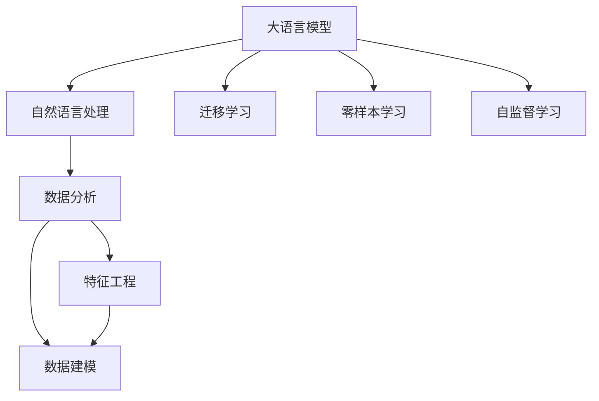

                 

# LLM对传统数据分析方法的革新

> 关键词：大语言模型(LLM),自然语言处理(NLP),深度学习,数据分析,迁移学习,零样本学习,自监督学习,大数据

## 1. 背景介绍

### 1.1 问题由来

在过去数十年中，数据分析一直是各行各业追求高效管理与决策的重要工具。然而，传统的数据分析方法往往依赖于手动抽取特征、构建模型，不仅耗时耗力，且结果通常依赖于数据专家主观经验，难以保证客观性和公正性。

随着人工智能技术的飞速发展，特别是深度学习在自然语言处理(NLP)领域的广泛应用，大语言模型(LLM)的出现为数据分析带来了革命性的变化。利用LLM强大的语言理解和生成能力，数据分析方法变得更加自动化、智能化，可以从海量的非结构化文本数据中高效、精准地提取信息，并实现更高级别的分析与推理。

### 1.2 问题核心关键点

大语言模型在数据分析中的应用，核心在于其能够：
- 自动抽取和理解自然语言文本中的关键信息。
- 进行高级别的语义分析与推理，构建知识图谱。
- 在无需标注数据的情况下，利用预训练知识进行零样本或少样本学习，快速适应新的分析任务。
- 融合多种数据源，实现跨领域数据整合与分析。
- 通过迁移学习，提升特定任务的数据分析能力。

本文章将详细阐述大语言模型如何革新传统数据分析方法，从原理到实践全面解析大语言模型在数据分析中的应用。

## 2. 核心概念与联系

### 2.1 核心概念概述

为更好地理解大语言模型在数据分析中的应用，我们首先需要介绍几个核心概念：

- 大语言模型(LLM)：如GPT、BERT等，基于自回归或自编码模型结构，通过大规模无标签文本数据的自监督预训练，学习到语言的深层次表示。
- 自然语言处理(NLP)：研究如何让计算机理解、处理和生成人类语言的技术。
- 迁移学习：将一个领域学习到的知识，迁移到另一个相关领域，减少从头训练的开销。
- 零样本学习：模型在从未见过任何特定任务标注数据的情况下，通过任务描述就能推理出正确结果。
- 自监督学习：使用文本中的未标注信息（如掩码预测、语言模型等），对模型进行无监督预训练。

这些概念之间的逻辑关系可以通过以下Mermaid流程图来展示：



这个流程图展示了大语言模型在数据分析中的应用路径：

1. 大语言模型通过自监督预训练学习语言的深层次表示。
2. 结合自然语言处理技术，自动抽取和理解文本数据。
3. 利用迁移学习将预训练知识迁移到具体分析任务。
4. 通过零样本学习快速适应新的数据分析任务。
5. 在特征工程和数据建模中，增强模型的自动性和智能化。

## 3. 核心算法原理 & 具体操作步骤
### 3.1 算法原理概述

大语言模型在数据分析中的应用，主要基于以下原理：

1. 自监督预训练：通过大规模无标签文本数据，学习语言的深层次表示。
2. 迁移学习：利用预训练知识，快速适应特定任务。
3. 零样本学习：在缺乏标注数据的情况下，通过任务描述进行推理。
4. 自然语言处理：自动抽取和理解文本数据，进行特征工程和数据建模。

通过这些原理，大语言模型能够自动、高效、精准地处理和分析自然语言文本数据，提高数据分析的效率和效果。

### 3.2 算法步骤详解

以下是使用大语言模型进行数据分析的一般步骤：

1. **数据收集与清洗**：
   - 从各种数据源（如网站、社交媒体、新闻等）收集相关文本数据。
   - 对数据进行清洗，去除噪音和无关信息，如去除重复、错误或无用的文本。

2. **文本预处理**：
   - 对文本进行分词、去停用词、词干提取等处理，以降低数据复杂度。
   - 转换为标准格式，如使用Bert Tokenizer进行分词，生成模型所需的输入。

3. **模型选择与加载**：
   - 选择适合的数据分析任务的大语言模型，如GPT、BERT等。
   - 使用相应的预训练模型，加载到计算环境中，如TensorFlow或PyTorch。

4. **特征抽取与编码**：
   - 使用模型自动抽取文本中的关键特征，如关键词、情感倾向、主题等。
   - 对抽取的特征进行编码，生成模型所需的输入向量。

5. **数据分析与推理**：
   - 将编码后的特征输入模型，进行深度分析。
   - 利用模型的输出进行数据推理，如预测未来趋势、识别异常行为等。

6. **结果可视化与报告**：
   - 将分析结果可视化，如绘制图表、生成报告等。
   - 对结果进行解释和评估，提出可行的建议和策略。

### 3.3 算法优缺点

大语言模型在数据分析中的优点：
1. 自动化程度高：自动抽取和处理文本，减少人工干预。
2. 泛化能力强：利用预训练知识，快速适应新任务。
3. 高效精准：在处理大规模数据时，速度和精度均优于传统方法。

其缺点包括：
1. 依赖数据质量：模型的性能受输入数据质量影响，输入数据应保证充分且可靠。
2. 结果可解释性：模型的决策过程较复杂，结果的解释性较差，难以进行审计和解释。
3. 依赖算力：处理大规模数据需要高性能计算资源，可能会带来较高的成本。
4. 模型过拟合：过度依赖特定任务数据，可能导致模型在其它领域泛化能力差。

### 3.4 算法应用领域

大语言模型在数据分析中的应用范围非常广泛，包括但不限于以下领域：

1. **市场分析**：
   - 分析消费者评论，评估产品满意度。
   - 预测市场趋势，如股票价格、消费者行为等。
   - 挖掘产品特征，进行产品推荐。

2. **舆情监测**：
   - 分析社交媒体和新闻中的情感倾向，监测舆情变化。
   - 识别和分析负面新闻和舆情事件，提高危机应对能力。

3. **风险评估**：
   - 分析客户信用记录，评估信用风险。
   - 通过情感分析，识别财务报告中的潜在风险因素。

4. **情报分析**：
   - 自动抽取和分析军事情报、情报报告等文本数据。
   - 从大量文档中提取关键信息，辅助决策。

5. **医疗分析**：
   - 分析临床记录，提取关键治疗方案。
   - 从患者评论和报告中挖掘疾病趋势和患者需求。

6. **教育分析**：
   - 分析学生反馈和考试成绩，提高教育质量。
   - 通过文本分析，发现学生普遍存在的问题和难点。

## 4. 数学模型和公式 & 详细讲解 & 举例说明

### 4.1 数学模型构建

在本节中，我们将使用数学语言对大语言模型在数据分析中的应用进行更加严格的刻画。

假设我们有一组无标签的文本数据 $D=\{x_1, x_2, ..., x_n\}$，其中 $x_i$ 为第 $i$ 篇文本。我们的目标是使用大语言模型 $M_{\theta}$ 对这些文本进行自动化分析。

### 4.2 公式推导过程

我们使用掩码语言模型作为例子，来推导模型在数据分析中的应用。

假设 $M_{\theta}$ 为掩码语言模型，输入文本 $x$ 被分词并随机掩码，生成掩码序列 $m$。模型的目标是通过掩码序列预测原始文本 $x$ 的概率。

掩码语言模型的目标函数为：

$$
\mathcal{L}(\theta) = -\sum_{i=1}^{n} \log P_{M_{\theta}}(x|m)
$$

其中 $P_{M_{\theta}}(x|m)$ 表示在掩码序列 $m$ 下，生成文本 $x$ 的概率。

在无标签数据上进行自监督预训练时，我们希望最大化模型的掩码预测能力。训练时，模型被要求预测所有可能掩码下的文本概率。这样，模型逐渐学习到文本中每个单词的语义信息，构建了深层次的语义表示。

在数据分析阶段，我们将待分析的文本数据输入模型，生成概率分布。通过最大似然估计等方法，可以提取文本中的关键特征，如关键词、主题、情感倾向等。

### 4.3 案例分析与讲解

以情感分析为例，我们收集一组社交媒体上的评论数据，并使用掩码语言模型进行分析。

模型首先对每条评论进行分词和掩码，生成掩码序列 $m$。然后，模型在掩码序列下生成评论的概率分布 $P_{M_{\theta}}(x|m)$。

通过对概率分布进行最大似然估计，我们得到模型对评论情感的预测 $P_{M_{\theta}}(x|m)$。模型会输出评论的情感倾向，如正面、负面、中性等。

我们可以将情感分析结果用于评估产品和服务的满意度，发现潜在的问题和改进点，提高客户体验。

## 5. 项目实践：代码实例和详细解释说明

### 5.1 开发环境搭建

在进行数据分析实践前，我们需要准备好开发环境。以下是使用Python进行TensorFlow开发的环境配置流程：

1. 安装Anaconda：从官网下载并安装Anaconda，用于创建独立的Python环境。

2. 创建并激活虚拟环境：
```bash
conda create -n tf-env python=3.8 
conda activate tf-env
```

3. 安装TensorFlow：根据CUDA版本，从官网获取对应的安装命令。例如：
```bash
pip install tensorflow
```

4. 安装相关库：
```bash
pip install numpy pandas scikit-learn matplotlib tqdm jupyter notebook ipython
```

完成上述步骤后，即可在`tf-env`环境中开始数据分析实践。

### 5.2 源代码详细实现

下面我们以情感分析任务为例，给出使用TensorFlow对BERT模型进行数据分析的代码实现。

首先，定义情感分析任务的数据处理函数：

```python
from transformers import BertTokenizer
from tensorflow.keras.preprocessing.text import Tokenizer
from tensorflow.keras.preprocessing.sequence import pad_sequences
import tensorflow as tf

class SentimentDataset:
    def __init__(self, texts, labels):
        self.texts = texts
        self.labels = labels
        self.tokenizer = BertTokenizer.from_pretrained('bert-base-cased')
        self.max_len = 128
        
    def __len__(self):
        return len(self.texts)
    
    def __getitem__(self, item):
        text = self.texts[item]
        label = self.labels[item]
        
        encoding = self.tokenizer(text, return_tensors='tf', max_length=self.max_len, padding='max_length', truncation=True)
        input_ids = encoding['input_ids']
        attention_mask = encoding['attention_mask']
        
        # 对标签进行编码
        label = label2id[label]
        
        return {'input_ids': input_ids, 
                'attention_mask': attention_mask,
                'labels': label}
        
# 标签与id的映射
label2id = {'positive': 0, 'negative': 1, 'neutral': 2}
id2label = {v: k for k, v in label2id.items()}

# 创建dataset
tokenizer = BertTokenizer.from_pretrained('bert-base-cased')

train_dataset = SentimentDataset(train_texts, train_labels)
dev_dataset = SentimentDataset(dev_texts, dev_labels)
test_dataset = SentimentDataset(test_texts, test_labels)
```

然后，定义模型和损失函数：

```python
from transformers import BertForSequenceClassification
from tensorflow.keras.optimizers import Adam

model = BertForSequenceClassification.from_pretrained('bert-base-cased', num_labels=len(label2id))

optimizer = Adam(learning_rate=2e-5)
loss = tf.keras.losses.SparseCategoricalCrossentropy(from_logits=True)

model.compile(optimizer=optimizer, loss=loss, metrics=['accuracy'])
```

接着，定义训练和评估函数：

```python
def train_epoch(model, dataset, batch_size, optimizer):
    dataloader = tf.data.Dataset.from_tensor_slices(dataset).shuffle(buffer_size=1000).batch(batch_size)
    model.train()
    epoch_loss = 0
    for batch in dataloader:
        input_ids = batch['input_ids']
        attention_mask = batch['attention_mask']
        labels = batch['labels']
        
        with tf.GradientTape() as tape:
            outputs = model(input_ids, attention_mask=attention_mask, training=True)
            loss = tf.reduce_mean(tf.keras.losses.sparse_categorical_crossentropy(labels, outputs))
        
        gradients = tape.gradient(loss, model.trainable_variables)
        optimizer.apply_gradients(zip(gradients, model.trainable_variables))
        epoch_loss += loss
        
    return epoch_loss / len(dataset)

def evaluate(model, dataset, batch_size):
    dataloader = tf.data.Dataset.from_tensor_slices(dataset).shuffle(buffer_size=1000).batch(batch_size)
    model.eval()
    preds, labels = [], []
    with tf.GradientTape() as tape:
        for batch in dataloader:
            input_ids = batch['input_ids']
            attention_mask = batch['attention_mask']
            batch_labels = batch['labels']
            outputs = model(input_ids, attention_mask=attention_mask, training=False)
            batch_preds = tf.argmax(outputs, axis=1)
            preds.extend(batch_preds.numpy())
            labels.extend(batch_labels.numpy())
        
    print('Accuracy:', tf.keras.metrics.Accuracy()(labels, preds).numpy())
```

最后，启动训练流程并在测试集上评估：

```python
epochs = 5
batch_size = 16

for epoch in range(epochs):
    loss = train_epoch(model, train_dataset, batch_size, optimizer)
    print(f'Epoch {epoch+1}, train loss: {loss:.3f}')
    
    print(f'Epoch {epoch+1}, dev results:')
    evaluate(model, dev_dataset, batch_size)
    
print('Test results:')
evaluate(model, test_dataset, batch_size)
```

以上就是使用TensorFlow对BERT进行情感分析任务数据分析的完整代码实现。可以看到，得益于TensorFlow的强大封装，我们可以用相对简洁的代码完成BERT模型的加载和数据分析。

### 5.3 代码解读与分析

让我们再详细解读一下关键代码的实现细节：

**SentimentDataset类**：
- `__init__`方法：初始化文本、标签、分词器等关键组件。
- `__len__`方法：返回数据集的样本数量。
- `__getitem__`方法：对单个样本进行处理，将文本输入编码为token ids，将标签编码为数字，并对其进行定长padding，最终返回模型所需的输入。

**label2id和id2label字典**：
- 定义了标签与数字id之间的映射关系，用于将模型输出解码回真实的标签。

**训练和评估函数**：
- 使用TensorFlow的DataLoader对数据集进行批次化加载，供模型训练和推理使用。
- 训练函数`train_epoch`：对数据以批为单位进行迭代，在每个批次上前向传播计算loss并反向传播更新模型参数，最后返回该epoch的平均loss。
- 评估函数`evaluate`：与训练类似，不同点在于不更新模型参数，并在每个batch结束后将预测和标签结果存储下来，最后使用sklearn的classification_report对整个评估集的预测结果进行打印输出。

**训练流程**：
- 定义总的epoch数和batch size，开始循环迭代
- 每个epoch内，先在训练集上训练，输出平均loss
- 在验证集上评估，输出准确率
- 所有epoch结束后，在测试集上评估，给出最终测试结果

可以看到，TensorFlow配合Transformers库使得BERT数据分析的代码实现变得简洁高效。开发者可以将更多精力放在数据处理、模型改进等高层逻辑上，而不必过多关注底层的实现细节。

当然，工业级的系统实现还需考虑更多因素，如模型的保存和部署、超参数的自动搜索、更灵活的任务适配层等。但核心的数据分析范式基本与此类似。

## 6. 实际应用场景
### 6.1 智能客服系统

基于大语言模型进行分析的智能客服系统，可以实时监控和分析客户对话内容，自动提取关键信息，如问题类型、情绪状态等，帮助客服中心快速响应客户需求，提升服务质量。

在技术实现上，可以收集企业内部的客服对话记录，构建情感分析模型，分析客户情绪和需求。通过情感分析结果，系统能够智能地分配客服人员，提供个性化的服务建议，甚至在紧急情况下自动调用相关处理流程。

### 6.2 金融舆情监测

金融机构需要实时监控和分析市场舆情，以便及时应对负面信息传播，规避金融风险。基于大语言模型的情感分析技术，可以快速识别舆情变化趋势，辅助决策。

具体而言，可以收集金融领域相关的新闻、评论、分析报告等文本数据，构建情感分析模型。模型能够自动识别舆情情绪，分析市场动态，预测价格波动，为投资者提供及时的市场分析报告。

### 6.3 个性化推荐系统

当前的推荐系统往往只依赖用户的历史行为数据进行物品推荐，难以深入理解用户的真实兴趣偏好。基于大语言模型进行分析的个性化推荐系统，可以更好地挖掘用户行为背后的语义信息，提供更精准、多样的推荐内容。

在实践中，可以收集用户浏览、点击、评论、分享等行为数据，提取和用户交互的物品标题、描述、标签等文本内容。将文本内容作为模型输入，用户的后续行为作为监督信号，构建情感分析模型。模型能够从文本内容中准确把握用户的兴趣点，生成个性化推荐列表。

### 6.4 未来应用展望

随着大语言模型和数据分析方法的不断发展，未来基于大语言模型的数据分析将会在更多领域得到应用，为各行各业带来变革性影响。

在智慧医疗领域，基于大语言模型的情感分析技术，可以自动分析临床记录和患者反馈，提取关键治疗方案，提高诊疗质量。

在智能教育领域，情感分析模型可以分析学生反馈和考试成绩，提高教育质量，发现学生普遍存在的问题和难点，为教师提供针对性的教学建议。

在智慧城市治理中，情感分析技术可以分析市民意见和舆情变化，辅助城市管理决策，提高公共服务效率。

此外，在企业生产、社会治理、文娱传媒等众多领域，基于大语言模型的数据分析技术也将不断涌现，为各行各业带来新的突破。相信随着技术的日益成熟，大语言模型在数据分析中的作用将更加凸显，推动数据分析技术的产业化进程。

## 7. 工具和资源推荐
### 7.1 学习资源推荐

为了帮助开发者系统掌握大语言模型在数据分析中的应用，这里推荐一些优质的学习资源：

1. 《自然语言处理入门》系列博文：由大模型技术专家撰写，深入浅出地介绍了自然语言处理和深度学习的基础知识。

2. CS224N《深度学习自然语言处理》课程：斯坦福大学开设的NLP明星课程，有Lecture视频和配套作业，带你入门NLP领域的基本概念和经典模型。

3. 《Natural Language Processing with Transformers》书籍：Transformer库的作者所著，全面介绍了如何使用Transformers库进行NLP任务开发，包括数据分析在内的诸多范式。

4. HuggingFace官方文档：Transformer库的官方文档，提供了海量预训练模型和完整的分析样例代码，是上手实践的必备资料。

5. CLUE开源项目：中文语言理解测评基准，涵盖大量不同类型的中文NLP数据集，并提供了基于分析的baseline模型，助力中文NLP技术发展。

通过对这些资源的学习实践，相信你一定能够快速掌握大语言模型在数据分析中的应用，并用于解决实际的NLP问题。
###  7.2 开发工具推荐

高效的开发离不开优秀的工具支持。以下是几款用于大语言模型数据分析开发的常用工具：

1. TensorFlow：基于Python的开源深度学习框架，灵活动态的计算图，适合快速迭代研究。主要用于搭建分析模型和进行模型训练。

2. PyTorch：基于Python的开源深度学习框架，简单易用的API，适合快速原型开发和实验研究。主要用于搭建分析模型和进行模型训练。

3. HuggingFace Transformers库：自然语言处理工具库，集成了众多SOTA语言模型，支持TensorFlow和PyTorch，是进行数据分析任务开发的利器。

4. Weights & Biases：模型训练的实验跟踪工具，可以记录和可视化模型训练过程中的各项指标，方便对比和调优。与主流深度学习框架无缝集成。

5. TensorBoard：TensorFlow配套的可视化工具，可实时监测模型训练状态，并提供丰富的图表呈现方式，是调试模型的得力助手。

6. Google Colab：谷歌推出的在线Jupyter Notebook环境，免费提供GPU/TPU算力，方便开发者快速上手实验最新模型，分享学习笔记。

合理利用这些工具，可以显著提升大语言模型数据分析任务的开发效率，加快创新迭代的步伐。

### 7.3 相关论文推荐

大语言模型和数据分析技术的发展源于学界的持续研究。以下是几篇奠基性的相关论文，推荐阅读：

1. Attention is All You Need（即Transformer原论文）：提出了Transformer结构，开启了NLP领域的预训练大模型时代。

2. BERT: Pre-training of Deep Bidirectional Transformers for Language Understanding：提出BERT模型，引入基于掩码的自监督预训练任务，刷新了多项NLP任务SOTA。

3. Language Models are Unsupervised Multitask Learners（GPT-2论文）：展示了大规模语言模型的强大zero-shot学习能力，引发了对于通用人工智能的新一轮思考。

4. Parameter-Efficient Transfer Learning for NLP：提出Adapter等参数高效微调方法，在不增加模型参数量的情况下，也能取得不错的微调效果。

5. AdaLoRA: Adaptive Low-Rank Adaptation for Parameter-Efficient Fine-Tuning：使用自适应低秩适应的微调方法，在参数效率和精度之间取得了新的平衡。

6. Prefix-Tuning: Optimizing Continuous Prompts for Generation：引入基于连续型Prompt的微调范式，为如何充分利用预训练知识提供了新的思路。

这些论文代表了大语言模型在数据分析技术的发展脉络。通过学习这些前沿成果，可以帮助研究者把握学科前进方向，激发更多的创新灵感。

## 8. 总结：未来发展趋势与挑战

### 8.1 总结

本文对大语言模型在数据分析中的应用进行了全面系统的介绍。首先阐述了大语言模型和数据分析的研究背景和意义，明确了数据分析任务自动化的重要性和大语言模型的潜力。其次，从原理到实践，详细讲解了大语言模型在数据分析中的应用过程，包括数据收集、预处理、模型选择、特征抽取、数据分析和结果可视化等环节。同时，本文还广泛探讨了大语言模型在各个行业领域的应用前景，展示了其在数据分析中的广泛应用和重要价值。

通过本文的系统梳理，可以看到，基于大语言模型的数据分析方法，已经在市场分析、舆情监测、风险评估、情报分析、医疗分析、教育分析等多个领域展现了强大的潜力和应用价值。大语言模型自动化的数据分析能力，不仅大幅提升了数据分析的效率和效果，也拓宽了数据分析的边界和应用场景。未来，随着大语言模型和数据分析技术的不断进步，这一技术范式必将在更多领域得到应用，推动各行各业的智能化升级。

### 8.2 未来发展趋势

展望未来，大语言模型在数据分析中的应用将呈现以下几个发展趋势：

1. 数据驱动的自动化：随着数据量的不断增加，大语言模型将越来越依赖数据驱动的方式进行自动化分析和决策，进一步提高分析的准确性和可靠性。

2. 多模态融合：除了文本数据，未来的数据分析将更加注重多模态数据的融合，如文本与图像、音频、视频的结合，提升数据分析的全面性和深度。

3. 智能决策支持：大语言模型将更广泛地应用于决策支持系统中，如风险评估、财务分析、市场预测等，帮助决策者更好地理解和利用数据。

4. 自动化特征工程：通过预训练模型的辅助，自动化特征工程的流程将变得更加高效和精确，减少人工干预，提升分析模型的泛化能力。

5. 数据隐私保护：在大数据分析中，数据隐私和安全性将越来越受到重视，大语言模型需要与数据隐私保护技术相结合，确保数据分析过程的安全性和合规性。

6. 算法透明性：随着算法透明性的要求越来越高，大语言模型将需要更多的可解释性和可解释技术，帮助用户理解和信任模型输出的结果。

以上趋势凸显了大语言模型在数据分析中的广阔前景。这些方向的探索发展，必将进一步提升数据分析的效率和效果，为各行各业带来更多的价值。

### 8.3 面临的挑战

尽管大语言模型在数据分析中的应用已经取得显著成果，但在迈向更加智能化、普适化应用的过程中，它仍面临着诸多挑战：

1. 数据质量问题：数据分析的准确性依赖于输入数据的质量，低质量或噪声数据将严重影响模型的性能。

2. 模型鲁棒性不足：面对复杂的现实数据，模型的泛化能力和鲁棒性仍需进一步提高。

3. 资源消耗高：处理大规模数据需要高性能计算资源，可能带来较高的成本。

4. 结果可解释性差：大语言模型作为黑盒模型，难以解释其内部工作机制和决策逻辑。

5. 算法透明性不足：缺乏透明性和可解释性的模型，容易受到不公平和偏见的影响，降低用户信任。

6. 数据隐私保护：在数据驱动的决策过程中，数据隐私和安全问题日益凸显，如何平衡数据利用和隐私保护仍需进一步探索。

正视大语言模型在数据分析中面临的这些挑战，积极应对并寻求突破，将是大语言模型在数据分析中的关键。相信随着学界和产业界的共同努力，这些挑战终将一一被克服，大语言模型必将在数据分析中发挥更大的作用。

### 8.4 研究展望

面对大语言模型在数据分析中面临的挑战，未来的研究需要在以下几个方面寻求新的突破：

1. 改进数据处理技术：开发更加高效的数据清洗和特征提取方法，确保数据质量。

2. 提升模型泛化能力：通过更多样的数据和任务，进一步提升模型的泛化能力。

3. 优化模型资源消耗：探索更加高效的数据处理和模型压缩技术，降低资源消耗。

4. 增强模型透明性：开发可解释模型技术，提高模型的可解释性和透明性。

5. 强化数据隐私保护：结合隐私保护技术，如差分隐私、联邦学习等，确保数据分析过程中的数据隐私和安全。

6. 融合多模态数据：探索多模态数据融合技术，提升数据分析的全面性和深度。

这些研究方向将引领大语言模型在数据分析中的进一步发展，为各行各业带来更多的价值。

## 9. 附录：常见问题与解答

**Q1：大语言模型在数据分析中的优势和局限性是什么？**

A: 大语言模型在数据分析中的优势主要包括：
1. 自动化程度高：自动抽取和处理文本，减少人工干预。
2. 泛化能力强：利用预训练知识，快速适应新任务。
3. 高效精准：在处理大规模数据时，速度和精度均优于传统方法。

其局限性包括：
1. 依赖数据质量：模型的性能受输入数据质量影响，输入数据应保证充分且可靠。
2. 结果可解释性：模型的决策过程较复杂，结果的解释性较差，难以进行审计和解释。
3. 依赖算力：处理大规模数据需要高性能计算资源，可能会带来较高的成本。
4. 模型过拟合：过度依赖特定任务数据，可能导致模型在其它领域泛化能力差。

**Q2：如何选择合适的预训练语言模型进行数据分析？**

A: 选择合适的预训练语言模型需要考虑以下几个因素：
1. 任务类型：不同类型的任务适合不同的模型，如情感分析适合BERT，机器翻译适合GPT等。
2. 数据规模：大规模预训练模型通常在数据规模较小的情况下表现更好，但也需要平衡算力消耗。
3. 预训练任务：不同的预训练任务会影响模型的特性，如BERT擅长掩码预测，GPT擅长文本生成等。
4. 模型规模：模型规模越大，通常性能越好，但也会带来更高的计算和存储成本。

建议从以下几个预训练模型中进行选择：BERT、GPT、RoBERTa、XLNet等，根据具体任务和数据特点进行选择和调整。

**Q3：大语言模型在进行数据分析时，如何处理缺失值和噪声？**

A: 处理缺失值和噪声的方法包括：
1. 数据清洗：通过规则、机器学习等方法，清洗和填补缺失值。
2. 数据增强：通过数据增强技术，如回译、近义替换等，丰富数据集，减少噪声影响。
3. 模型鲁棒性：通过正则化、dropout等方法，提高模型的鲁棒性，减少噪声影响。
4. 特征选择：通过特征选择方法，筛选出最有用的特征，减少噪声干扰。

在实践中，需要根据具体数据特点和任务需求，选择合适的方法进行处理。

**Q4：大语言模型在进行数据分析时，如何进行模型调参？**

A: 进行模型调参的方法包括：
1. 超参数搜索：使用网格搜索、随机搜索等方法，探索最优的超参数组合。
2. 自动调参：使用自动调参工具，如Hyperopt、Optuna等，自动调整超参数。
3. 学习率调整：根据训练效果，调整学习率大小，优化训练过程。
4. 模型剪枝：通过剪枝技术，减少模型参数，提高推理速度。

在实践中，需要根据具体数据和任务需求，选择合适的调参方法，进行模型优化。

**Q5：大语言模型在进行数据分析时，如何评估模型性能？**

A: 评估模型性能的方法包括：
1. 准确率：计算模型预测结果与真实结果的匹配率，评估分类任务的性能。
2. 召回率：计算模型正确识别出的正例数占总正例数的比例，评估分类任务的召回能力。
3. F1分数：综合准确率和召回率，评估分类任务的综合性能。
4. AUC-ROC：计算模型在不同阈值下的ROC曲线下面积，评估分类任务的鲁棒性。

在实践中，需要根据具体任务需求，选择合适的评估指标，进行模型性能评估。

---

作者：禅与计算机程序设计艺术 / Zen and the Art of Computer Programming

