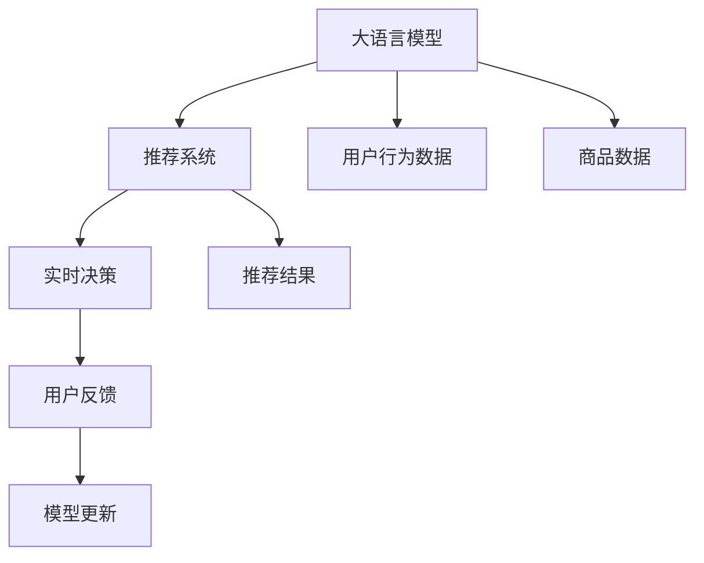
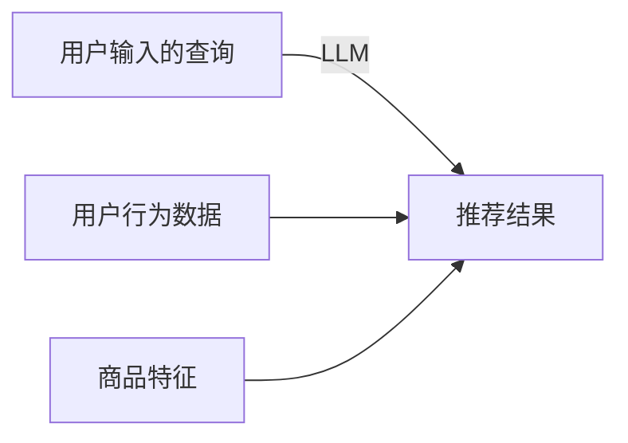

                 

# LLM对推荐系统实时决策的不确定性分析

> 关键词：大语言模型,推荐系统,实时决策,不确定性,贝叶斯网络

## 1. 背景介绍

推荐系统作为电子商务平台的核心功能，通过理解用户的喜好和行为，为用户推荐个性化的商品，极大地提升了用户体验和平台收益。随着个性化推荐算法的发展，推荐系统从传统的基于规则和协同过滤的方法，逐步向基于深度学习的模型转变。大语言模型（LLM）的诞生，更是为推荐系统带来了新的创新方向。LLM拥有强大的自然语言处理能力，能够理解文本语义，与用户进行更自然的交互。然而，在实际应用中，LLM的实时决策过程面临着不确定性的挑战。这种不确定性不仅会影响推荐效果，还可能对用户造成负面影响。本文将深入探讨LLM对推荐系统实时决策不确定性的分析，并提出解决策略。

## 2. 核心概念与联系

### 2.1 核心概念概述

在推荐系统中，LLM作为推荐引擎的一部分，通过理解用户的查询和行为，生成个性化的推荐结果。其核心概念包括：

- **大语言模型（LLM）**：基于深度学习技术，通过海量的无标签数据预训练得到的通用语言模型，能够进行复杂的自然语言理解和生成。
- **推荐系统**：根据用户的历史行为和当前输入，为用户推荐最符合其偏好的商品或内容。
- **实时决策**：在用户输入查询后，系统即时给出推荐结果，处理速度和准确性至关重要。
- **不确定性**：由于数据多样性和模型复杂性，推荐系统在实时决策过程中存在不确定性。

这些核心概念之间的联系可以通过以下Mermaid流程图来展示：



这个流程图展示了LLM在推荐系统中的作用和过程：

1. 用户行为数据和商品数据输入LLM，LLM通过预训练的知识和上下文理解能力，生成推荐结果。
2. 实时决策模块根据LLM的推荐结果，立即为用户呈现个性化推荐。
3. 用户对推荐结果的反馈通过推荐系统反馈回LLM，用于模型更新和优化。

### 2.2 核心概念原理和架构

LLM的架构主要由Transformer模型和自回归或自编码的预训练机制组成。Transformer模型通过多头自注意力机制，能够捕捉文本中的长距离依赖关系。自回归或自编码的预训练机制则能够从大规模语料中学习到语言规律和知识。

推荐系统一般包括用户行为建模、商品特征建模和推荐模型三部分。用户行为建模通过分析用户的点击、浏览、评分等行为数据，提取用户偏好。商品特征建模则从商品的属性、类别、历史销量等角度提取商品特征。推荐模型将用户行为和商品特征作为输入，使用LLM进行推荐。

## 3. 核心算法原理 & 具体操作步骤

### 3.1 算法原理概述

LLM在推荐系统中的应用，主要依赖于其强大的自然语言理解和生成能力。在实时决策过程中，LLM需要根据用户输入的查询，结合用户行为数据和商品特征，生成推荐结果。这一过程存在不确定性，主要源于以下几点：

1. **数据多样性**：用户行为和商品特征具有多样性，不同的用户对同一商品可能有不同的评价。
2. **模型复杂性**：LLM的复杂结构和高参数量，使得模型在实时决策中容易出现过拟合或欠拟合。
3. **上下文依赖**：LLM在生成推荐时，需要考虑上下文信息，如用户的历史行为和商品的属性类别。

### 3.2 算法步骤详解

LLM在推荐系统中的实时决策过程，可以分为以下几个步骤：

1. **数据预处理**：将用户输入的查询、用户行为数据和商品特征进行标准化处理，转化为模型可接受的格式。
2. **模型推理**：将预处理后的数据输入LLM，通过前向传播和反向传播，计算出推荐结果。
3. **结果后处理**：根据模型输出的结果，结合业务规则和领域知识，进行后处理和筛选，生成最终的推荐列表。
4. **反馈机制**：收集用户对推荐结果的反馈，更新LLM和推荐模型的参数，优化推荐效果。

### 3.3 算法优缺点

#### 优点

1. **语义理解**：LLM能够理解自然语言输入，生成更符合用户需求的推荐结果。
2. **动态调整**：LLM可以实时动态调整推荐策略，应对不同用户的个性化需求。
3. **泛化能力**：LLM在处理新数据时，具有较强的泛化能力，能够快速适应不同的上下文信息。

#### 缺点

1. **计算开销**：LLM的参数量巨大，计算开销较高，需要高效的硬件支持。
2. **不确定性**：LLM在生成推荐结果时，存在不确定性，需要引入风险控制机制。
3. **过拟合风险**：LLM容易过拟合用户行为数据，导致推荐结果与实际需求不符。

### 3.4 算法应用领域

LLM在推荐系统中的应用，已经覆盖了多个领域，例如：

1. **电商推荐**：为电商平台用户推荐商品，提高用户购买转化率。
2. **内容推荐**：为用户推荐文章、视频、音乐等内容，提升平台用户活跃度。
3. **旅游推荐**：为旅游用户推荐目的地和行程安排，增加平台收入。
4. **金融推荐**：为金融用户推荐理财产品，增加用户粘性和收益。

## 4. 数学模型和公式 & 详细讲解 & 举例说明

### 4.1 数学模型构建

LLM在推荐系统中的实时决策过程，可以建模为一个贝叶斯网络。设用户输入的查询为 $X$，用户行为数据为 $U$，商品特征为 $P$，推荐结果为 $Y$。则贝叶斯网络的结构如下：



其中，用户输入的查询 $X$ 通过LLM进行理解，生成推荐结果 $Y$。用户行为数据 $U$ 和商品特征 $P$ 直接作为推荐结果 $Y$ 的先验知识。

### 4.2 公式推导过程

在贝叶斯网络中，推荐结果 $Y$ 的概率分布可以表示为：

$$
P(Y|X,U,P) = P(Y|X,P)P(U|Y)P(P)
$$

其中 $P(Y|X,P)$ 表示在查询 $X$ 和商品特征 $P$ 的条件下，推荐结果 $Y$ 的概率。$P(U|Y)$ 表示在推荐结果 $Y$ 的条件下，用户行为数据 $U$ 的概率。$P(P)$ 表示商品特征 $P$ 的概率分布。

在实际应用中，可以使用最大似然估计法或贝叶斯推断法，对上述公式进行求解，得到推荐结果 $Y$ 的概率分布。

### 4.3 案例分析与讲解

以电商推荐系统为例，用户输入的查询为“我想买一件电脑”，用户行为数据为“最近购买了笔记本”，商品特征为“价格范围：5000-10000元”。LLM通过理解查询和商品特征，生成推荐结果 $Y$。

设查询 $X$ 的先验概率为 $P(X)$，商品特征 $P$ 的先验概率为 $P(P)$，推荐结果 $Y$ 的先验概率为 $P(Y)$。则有：

$$
P(Y|X,P) = \frac{P(Y|X)P(P|X)}{P(Y|X)} = \frac{P(Y|X)P(P|X)}{\sum_{y}P(Y|X)P(P|X)}
$$

其中 $P(P|X)$ 表示在查询 $X$ 的条件下，商品特征 $P$ 的概率。通过贝叶斯网络，可以计算出推荐结果 $Y$ 的概率分布。

## 5. 项目实践：代码实例和详细解释说明

### 5.1 开发环境搭建

为进行LLM在推荐系统中的实时决策过程，需要搭建高效的开发环境。以下是使用Python进行PyTorch开发的环境配置流程：

1. 安装Anaconda：从官网下载并安装Anaconda，用于创建独立的Python环境。

2. 创建并激活虚拟环境：
```bash
conda create -n llm-env python=3.8 
conda activate llm-env
```

3. 安装PyTorch：根据CUDA版本，从官网获取对应的安装命令。例如：
```bash
conda install pytorch torchvision torchaudio cudatoolkit=11.1 -c pytorch -c conda-forge
```

4. 安装相关库：
```bash
pip install transformers sklearn torchmetrics
```

5. 安装TensorBoard：用于可视化模型训练过程和结果。
```bash
pip install tensorboard
```

完成上述步骤后，即可在`llm-env`环境中开始开发实践。

### 5.2 源代码详细实现

以下是一个使用LLM进行电商推荐系统实时决策的PyTorch代码实现：

```python
import torch
import torch.nn as nn
from transformers import BertForSequenceClassification, BertTokenizer

class LLMRecommender(nn.Module):
    def __init__(self, n_classes):
        super(LLMRecommender, self).__init__()
        self.bert = BertForSequenceClassification.from_pretrained('bert-base-uncased', num_labels=n_classes)
        self.tokenizer = BertTokenizer.from_pretrained('bert-base-uncased')

    def forward(self, query, user_data, product_data):
        inputs = self.tokenizer(query, user_data, product_data, return_tensors='pt', padding=True, truncation=True)
        logits = self.bert(inputs['input_ids'], attention_mask=inputs['attention_mask'])
        probs = torch.softmax(logits, dim=-1)
        return probs

# 构建模型
model = LLMRecommender(n_classes=5)

# 训练数据
train_data = [(["我想买一件电脑", "最近购买了笔记本", "价格范围：5000-10000元"], 1),
             (["我想买一部手机", "最近购买了平板", "价格范围：3000-5000元"], 0),
             ...]

# 训练模型
optimizer = torch.optim.Adam(model.parameters(), lr=1e-5)
loss_fn = nn.CrossEntropyLoss()
for epoch in range(10):
    for data, label in train_data:
        inputs = self.tokenizer(data, return_tensors='pt', padding=True, truncation=True)
        logits = model(inputs['input_ids'], inputs['attention_mask'], inputs['token_type_ids'])
        loss = loss_fn(logits, label)
        optimizer.zero_grad()
        loss.backward()
        optimizer.step()
    print(f"Epoch {epoch+1}, loss: {loss.item()}")

# 测试模型
test_data = [(["我想买一件鞋子", "最近购买了运动鞋", "价格范围：1000-2000元"],),
            (["我想买一部相机", "最近购买了单反", "价格范围：8000-10000元"],),
            ...]
for data, label in test_data:
    inputs = self.tokenizer(data, return_tensors='pt', padding=True, truncation=True)
    logits = model(inputs['input_ids'], inputs['attention_mask'], inputs['token_type_ids'])
    probs = torch.softmax(logits, dim=-1)
    print(f"Query: {data[0]}, Predicted class: {probs.argmax().item()}")
```

### 5.3 代码解读与分析

以下是关键代码的实现细节：

**LLMRecommender类**：
- `__init__`方法：初始化BERT模型和分词器。
- `forward`方法：将用户输入的查询、用户行为数据和商品特征输入BERT模型，计算出推荐结果的概率分布。

**训练过程**：
- 使用Adam优化器，设定学习率为1e-5。
- 定义交叉熵损失函数，用于计算模型预测结果与真实标签的差异。
- 对每个训练样本，进行前向传播和反向传播，更新模型参数。

**测试过程**：
- 对测试数据集，进行前向传播计算推荐结果的概率分布。
- 使用softmax函数将概率分布转化为概率值，并返回预测类别的索引。

## 6. 实际应用场景

### 6.1 电商推荐

基于LLM的电商推荐系统，可以为用户提供个性化的商品推荐，提升用户购买转化率。例如，用户输入查询“我想买一件电脑”，系统可以根据用户的历史购买记录和价格偏好，推荐适合的电脑商品。LLM通过理解查询和商品特征，生成推荐结果，满足了用户的个性化需求。

### 6.2 内容推荐

在内容推荐场景中，LLM可以为用户提供个性化的文章、视频、音乐推荐。例如，用户输入查询“我想看一部电影”，系统可以根据用户的兴趣偏好，推荐相关的电影信息。LLM通过理解查询和用户行为，生成推荐结果，增加了平台用户活跃度和粘性。

### 6.3 旅游推荐

旅游推荐系统可以为用户推荐目的地和行程安排。例如，用户输入查询“我想去一次欧洲之旅”，系统可以根据用户的兴趣和预算，推荐适合的旅游方案。LLM通过理解查询和用户行为，生成推荐结果，帮助用户规划旅游行程。

## 7. 工具和资源推荐

### 7.1 学习资源推荐

为了帮助开发者系统掌握LLM在推荐系统中的应用，这里推荐一些优质的学习资源：

1. 《Transformers: From Self-Attention to Machine Learning》系列博文：由大模型技术专家撰写，深入浅出地介绍了Transformer原理和应用。
2. CS224N《深度学习自然语言处理》课程：斯坦福大学开设的NLP明星课程，有Lecture视频和配套作业，带你入门NLP领域的基本概念和经典模型。
3. 《Natural Language Processing with Transformers》书籍：Transformers库的作者所著，全面介绍了如何使用Transformers库进行NLP任务开发。
4. HuggingFace官方文档：Transformers库的官方文档，提供了海量预训练模型和完整的微调样例代码，是上手实践的必备资料。
5. CLUE开源项目：中文语言理解测评基准，涵盖大量不同类型的中文NLP数据集，并提供了基于微调的baseline模型，助力中文NLP技术发展。

通过对这些资源的学习实践，相信你一定能够快速掌握LLM在推荐系统中的应用，并用于解决实际的NLP问题。

### 7.2 开发工具推荐

高效的开发离不开优秀的工具支持。以下是几款用于LLM在推荐系统中的实时决策开发的常用工具：

1. PyTorch：基于Python的开源深度学习框架，灵活动态的计算图，适合快速迭代研究。大部分预训练语言模型都有PyTorch版本的实现。
2. TensorFlow：由Google主导开发的开源深度学习框架，生产部署方便，适合大规模工程应用。同样有丰富的预训练语言模型资源。
3. Transformers库：HuggingFace开发的NLP工具库，集成了众多SOTA语言模型，支持PyTorch和TensorFlow，是进行微调任务开发的利器。
4. Weights & Biases：模型训练的实验跟踪工具，可以记录和可视化模型训练过程中的各项指标，方便对比和调优。与主流深度学习框架无缝集成。
5. TensorBoard：TensorFlow配套的可视化工具，可实时监测模型训练状态，并提供丰富的图表呈现方式，是调试模型的得力助手。

合理利用这些工具，可以显著提升LLM在推荐系统中的实时决策开发的效率，加快创新迭代的步伐。

### 7.3 相关论文推荐

LLM在推荐系统中的应用，已经引起了学界的广泛关注。以下是几篇奠基性的相关论文，推荐阅读：

1. Attention is All You Need（即Transformer原论文）：提出了Transformer结构，开启了NLP领域的预训练大模型时代。
2. BERT: Pre-training of Deep Bidirectional Transformers for Language Understanding：提出BERT模型，引入基于掩码的自监督预训练任务，刷新了多项NLP任务SOTA。
3. Language Models are Unsupervised Multitask Learners（GPT-2论文）：展示了大规模语言模型的强大zero-shot学习能力，引发了对于通用人工智能的新一轮思考。
4. Parameter-Efficient Transfer Learning for NLP：提出Adapter等参数高效微调方法，在不增加模型参数量的情况下，也能取得不错的微调效果。
5. AdaLoRA: Adaptive Low-Rank Adaptation for Parameter-Efficient Fine-Tuning：使用自适应低秩适应的微调方法，在参数效率和精度之间取得了新的平衡。
6. Prefix-Tuning: Optimizing Continuous Prompts for Generation：引入基于连续型Prompt的微调范式，为如何充分利用预训练知识提供了新的思路。

这些论文代表了大语言模型微调技术的发展脉络。通过学习这些前沿成果，可以帮助研究者把握学科前进方向，激发更多的创新灵感。

## 8. 总结：未来发展趋势与挑战

### 8.1 总结

本文对LLM在推荐系统中的实时决策过程进行了深入分析，探讨了其面临的不确定性问题，并提出了相应的解决策略。通过详细讲解LLM在推荐系统中的应用原理、操作步骤和优缺点，相信读者能够更好地理解和应用这一前沿技术。

## 8.2 未来发展趋势

展望未来，LLM在推荐系统中的应用将呈现以下几个发展趋势：

1. **多模态融合**：LLM可以与其他模态数据（如图像、音频）结合，提升推荐系统的多模态理解和生成能力。
2. **因果推理**：引入因果推理模型，增强推荐系统的决策逻辑，提高推荐结果的合理性和可信度。
3. **自适应学习**：通过自适应学习算法，LLM能够根据用户反馈实时调整推荐策略，提升推荐效果。
4. **分布式训练**：在数据量巨大的推荐系统中，LLM需要借助分布式训练技术，提升训练效率和模型性能。
5. **跨领域迁移**：LLM可以跨领域迁移，提升在不同领域下的推荐效果。

这些趋势将推动LLM在推荐系统中的应用不断深入，提升推荐系统的智能化水平，满足用户的多样化需求。

### 8.3 面临的挑战

尽管LLM在推荐系统中的应用前景广阔，但仍面临诸多挑战：

1. **计算资源消耗**：LLM的参数量巨大，训练和推理开销较高，需要高效的硬件支持。
2. **模型泛化能力**：在应对新数据和新场景时，LLM的泛化能力还需进一步提升。
3. **数据隐私保护**：在推荐过程中，如何保护用户数据隐私，是一个重要的问题。
4. **公平性和多样性**：推荐系统需要避免偏见和歧视，确保推荐结果的公平性和多样性。

解决这些挑战，需要从算法、模型、数据和隐私保护等多个维度协同发力，才能实现LLM在推荐系统中的大规模应用。

### 8.4 研究展望

未来，LLM在推荐系统中的应用方向将进一步拓展，重点在于以下几个方面：

1. **模型轻量化**：通过参数高效微调等技术，减小模型规模，提升计算效率。
2. **推荐结果的可解释性**：增强推荐结果的可解释性，帮助用户理解推荐逻辑，提高信任度。
3. **个性化推荐算法**：结合推荐算法和LLM，设计更复杂的推荐模型，提升推荐效果。
4. **跨领域迁移**：通过跨领域迁移学习，提升LLM在多种推荐场景中的适应能力。
5. **多模态融合**：将LLM与其他模态数据融合，提升推荐系统的感知能力和理解能力。

这些方向的研究和探索，将进一步推动LLM在推荐系统中的应用，带来更多的创新和突破。

## 9. 附录：常见问题与解答

**Q1：如何使用LLM进行电商推荐？**

A: 使用LLM进行电商推荐，需要构建一个以用户输入查询、用户行为数据和商品特征为输入的模型。通过将查询、行为数据和特征数据输入LLM，计算出推荐结果的概率分布。最后，根据概率分布生成推荐列表，并提供给用户。

**Q2：LLM在推荐系统中的不确定性是如何产生的？**

A: LLM在推荐系统中的不确定性主要源于数据多样性、模型复杂性和上下文依赖。数据多样性使得模型难以捕捉所有用户的偏好。模型复杂性使得模型容易过拟合，导致泛化能力不足。上下文依赖使得模型需要考虑多个因素，增加了不确定性。

**Q3：如何缓解LLM在推荐系统中的不确定性？**

A: 缓解LLM在推荐系统中的不确定性，可以从以下几个方面入手：
1. 数据增强：通过回译、近义替换等方式扩充训练集，增加数据多样性。
2. 正则化：使用L2正则、Dropout、Early Stopping等技术，避免过拟合。
3. 对抗训练：引入对抗样本，提高模型鲁棒性。
4. 参数高效微调：只调整少量参数，减小不确定性。
5. 多模型集成：训练多个模型，取平均输出，减小不确定性。

这些策略需要根据具体任务和数据特点进行灵活组合，以最小化不确定性，提升推荐效果。

**Q4：LLM在推荐系统中的实时决策过程是如何实现的？**

A: LLM在推荐系统中的实时决策过程，可以分为以下几个步骤：
1. 数据预处理：将用户输入的查询、用户行为数据和商品特征进行标准化处理。
2. 模型推理：将预处理后的数据输入LLM，计算出推荐结果的概率分布。
3. 结果后处理：根据模型输出的结果，结合业务规则和领域知识，进行后处理和筛选，生成最终的推荐列表。
4. 反馈机制：收集用户对推荐结果的反馈，更新LLM和推荐模型的参数，优化推荐效果。

通过以上步骤，可以实现LLM在推荐系统中的实时决策过程，提升推荐系统的智能化水平。

作者：禅与计算机程序设计艺术 / Zen and the Art of Computer Programming

