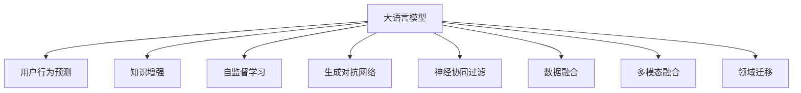

                 

# LLM对推荐系统的改进方向

> 关键词：大语言模型(Large Language Model, LLM), 推荐系统, 用户行为预测, 知识增强, 自监督学习(Self-Supervised Learning), 生成对抗网络(Generative Adversarial Network, GAN), 神经协同过滤(Neural Collaborative Filtering), 数据融合, 多模态融合, 领域迁移

## 1. 背景介绍

### 1.1 问题由来
推荐系统在电商、社交媒体、视频网站等互联网平台中扮演着至关重要的角色。它通过分析用户的历史行为数据，预测用户兴趣，向用户推荐可能感兴趣的商品、内容或活动。传统的推荐系统主要基于协同过滤、基于内容的推荐、基于矩阵分解等方法，这些方法主要依赖于用户与商品之间的显式或隐式交互数据。

然而，随着互联网用户的爆炸式增长，推荐系统面临的挑战也日益严峻。用户行为数据稀疏性、实时性不足、动态变化等特性使得推荐系统需要不断地进行优化和升级。近年来，大语言模型(Large Language Model, LLM)在自然语言处理(Natural Language Processing, NLP)领域取得了巨大的突破，成为推荐系统改进的一个重要方向。

### 1.2 问题核心关键点
在大语言模型对推荐系统的改进方向中，核心关键点包括：

- 利用大语言模型的自然语言理解能力，提升用户行为预测的准确性。
- 引入自监督学习、生成对抗网络等先进技术，增强推荐系统的泛化能力和鲁棒性。
- 结合领域知识和多模态数据，丰富推荐系统的信息维度，提升推荐质量。
- 通过领域迁移和迁移学习，加速模型在不同应用场景中的适应和迁移，提升模型的泛化能力。

这些核心关键点构成了大语言模型在推荐系统改进中的基本框架，旨在通过提升用户行为预测能力、增强系统鲁棒性、丰富信息维度和加速迁移学习，实现推荐系统的创新和突破。

## 2. 核心概念与联系

### 2.1 核心概念概述

为更好地理解大语言模型对推荐系统的改进方向，本节将介绍几个密切相关的核心概念：

- 大语言模型(Large Language Model, LLM)：如BERT、GPT等，通过在海量无标签文本语料上进行预训练，学习通用的语言表示，具备强大的语言理解和生成能力。
- 协同过滤(Collaborative Filtering)：通过分析用户之间的行为相似性，推荐与用户已偏好相似的商品。
- 知识增强(Knowledge-Augmented)：通过引入领域知识图谱、逻辑规则等结构化信息，增强推荐系统的表现力。
- 自监督学习(Self-Supervised Learning)：通过无标签数据学习模型，提升模型的泛化能力。
- 生成对抗网络(Generative Adversarial Network, GAN)：通过生成器和判别器的对抗训练，生成更加逼真的数据，提升模型的鲁棒性。
- 神经协同过滤(Neural Collaborative Filtering)：通过神经网络改进传统的协同过滤算法，提升模型的表达能力和泛化能力。
- 数据融合(Data Fusion)：将多源异构数据融合到推荐系统中，提升推荐的丰富度和准确性。
- 多模态融合(Multi-modal Fusion)：结合文本、图像、音频等多模态数据，增强推荐系统对不同场景的理解能力。
- 领域迁移(Domain Transfer)：通过迁移学习，加速模型在新的应用场景中的适应和迁移，提升模型的泛化能力。

这些核心概念之间的逻辑关系可以通过以下Mermaid流程图来展示：



这个流程图展示了大语言模型对推荐系统改进的核心概念及其之间的关系：

1. 大语言模型通过预训练获得基础能力。
2. 用户行为预测、知识增强、自监督学习、生成对抗网络、神经协同过滤、数据融合、多模态融合、领域迁移等方法，从不同角度增强大语言模型的推荐能力。
3. 这些增强手段共同构成了大语言模型对推荐系统的改进框架，使得推荐系统能够更好地理解用户需求，提升推荐质量。

## 3. 核心算法原理 & 具体操作步骤

### 3.1 算法原理概述

大语言模型对推荐系统的改进，主要基于以下几个关键原理：

1. **用户行为预测**：利用大语言模型的自然语言理解能力，预测用户对商品或内容的兴趣，从而进行个性化推荐。
2. **知识增强**：通过引入领域知识图谱、逻辑规则等结构化信息，提升推荐系统的表现力。
3. **自监督学习**：通过无标签数据学习模型，提升模型的泛化能力和鲁棒性。
4. **生成对抗网络**：通过生成器和判别器的对抗训练，生成更加逼真的数据，提升模型的鲁棒性。
5. **神经协同过滤**：通过神经网络改进传统的协同过滤算法，提升模型的表达能力和泛化能力。
6. **数据融合**：将多源异构数据融合到推荐系统中，提升推荐的丰富度和准确性。
7. **多模态融合**：结合文本、图像、音频等多模态数据，增强推荐系统对不同场景的理解能力。
8. **领域迁移**：通过迁移学习，加速模型在新的应用场景中的适应和迁移，提升模型的泛化能力。

### 3.2 算法步骤详解

以下是基于大语言模型对推荐系统改进的详细步骤：

**Step 1: 数据准备**
- 收集用户行为数据，如浏览历史、购买记录、评分等。
- 清洗、预处理数据，消除噪声和不一致性。
- 将数据划分为训练集、验证集和测试集。

**Step 2: 用户行为预测**
- 使用大语言模型，如BERT、GPT等，进行文本预处理和特征提取。
- 通过自监督学习或神经协同过滤方法，训练用户行为预测模型。
- 使用训练好的模型，对用户未访问的商品或内容进行兴趣预测。

**Step 3: 知识增强**
- 构建领域知识图谱，如商品标签、品牌、类别等。
- 将知识图谱中的信息编码成向量，与用户行为特征进行融合。
- 使用知识增强的推荐模型，提升推荐效果。

**Step 4: 自监督学习**
- 利用无标签数据，如大规模语料库，进行自监督学习。
- 训练生成对抗网络，生成更加逼真的用户行为数据。
- 将生成数据与真实数据混合训练，提升模型的泛化能力和鲁棒性。

**Step 5: 数据融合**
- 将用户行为数据、文本数据、图像数据等多源异构数据进行融合。
- 使用融合后的多模态数据训练推荐模型。
- 使用融合模型进行推荐，提升推荐的丰富度和准确性。

**Step 6: 多模态融合**
- 结合文本、图像、音频等多模态数据，提升推荐系统对不同场景的理解能力。
- 使用多模态融合模型，对多源数据进行综合处理和分析。
- 使用融合模型进行推荐，提升推荐的综合性能。

**Step 7: 领域迁移**
- 使用迁移学习，加速模型在新的应用场景中的适应和迁移。
- 在新的领域收集少量标注数据，进行微调。
- 使用微调后的模型进行推荐，提升模型的泛化能力。

### 3.3 算法优缺点

基于大语言模型对推荐系统的改进方法，具有以下优点：

1. **提升推荐精度**：利用大语言模型的自然语言理解能力，能够更准确地预测用户行为，提升推荐的准确性。
2. **丰富信息维度**：结合知识增强、自监督学习、多模态融合等方法，丰富推荐系统的信息维度，提升推荐的丰富度和表现力。
3. **提高鲁棒性**：通过生成对抗网络和自监督学习，提升模型的泛化能力和鲁棒性，避免过拟合和数据偏差。
4. **加速迁移学习**：通过领域迁移和微调方法，加速模型在新的应用场景中的适应和迁移，提升模型的泛化能力。

同时，该方法也存在一定的局限性：

1. **数据依赖**：需要大量的标注数据和无标签数据进行训练，数据获取成本较高。
2. **计算资源需求高**：大语言模型和相关算法需要大量的计算资源和存储空间，硬件要求较高。
3. **模型复杂度高**：多模态融合、知识增强等方法增加了模型的复杂度，可能导致训练和推理的效率问题。
4. **可解释性不足**：大语言模型和相关算法较为复杂，难以解释模型的决策过程，影响模型的可解释性。

尽管存在这些局限性，但就目前而言，基于大语言模型的改进方法仍是对推荐系统研究的重要方向。未来相关研究的重点在于如何进一步降低数据依赖，提高模型效率，提升可解释性，同时兼顾推荐精度和泛化能力。

### 3.4 算法应用领域

大语言模型对推荐系统的改进方法，已经在电商、社交媒体、视频网站等多个领域得到了广泛的应用，具体如下：

1. **电商推荐系统**：利用用户行为预测和知识增强方法，提升电商平台的个性化推荐效果，提升用户满意度。
2. **社交媒体推荐系统**：结合多模态融合和自监督学习，提升社交媒体平台的推荐效果，增强用户粘性。
3. **视频网站推荐系统**：利用多模态融合和领域迁移方法，提升视频网站的推荐效果，提升用户观看体验。
4. **智能家居推荐系统**：结合知识增强和神经协同过滤，提升智能家居系统的推荐效果，提升用户便利性。
5. **智慧医疗推荐系统**：结合用户行为预测和知识增强，提升智慧医疗平台的个性化推荐效果，提高诊疗效率。

除了上述这些领域，大语言模型对推荐系统的改进方法也将被创新性地应用到更多场景中，如旅游推荐、金融推荐、教育推荐等，为推荐系统的发展带来新的突破。

## 4. 数学模型和公式 & 详细讲解

### 4.1 数学模型构建

本节将使用数学语言对大语言模型对推荐系统的改进过程进行更加严格的刻画。

记用户行为预测模型为 $M_{\theta}:\mathcal{X} \rightarrow \mathcal{Y}$，其中 $\mathcal{X}$ 为输入空间（用户行为数据），$\mathcal{Y}$ 为输出空间（商品或内容ID），$\theta$ 为模型参数。

定义模型 $M_{\theta}$ 在输入 $x$ 上的输出为 $\hat{y}=M_{\theta}(x)$，表示预测的兴趣度。真实标签 $y \in \{1,0\}$，表示用户是否对商品或内容感兴趣。则推荐系统的目标是最小化损失函数：

$$
\mathcal{L}(\theta) = -\frac{1}{N}\sum_{i=1}^N y_i \log \hat{y}_i + (1-y_i) \log (1-\hat{y}_i)
$$

其中 $N$ 为样本数量。在实践中，通常使用交叉熵损失函数，其导数易于计算。

### 4.2 公式推导过程

以下我们以二分类任务为例，推导交叉熵损失函数的导数。

假设模型 $M_{\theta}$ 在输入 $x$ 上的输出为 $\hat{y}=M_{\theta}(x)$，表示用户对商品或内容的兴趣度。真实标签 $y \in \{0,1\}$，表示用户是否对商品或内容感兴趣。则二分类交叉熵损失函数定义为：

$$
\ell(M_{\theta}(x),y) = -[y\log \hat{y} + (1-y)\log (1-\hat{y})]
$$

将其代入经验风险公式，得：

$$
\mathcal{L}(\theta) = -\frac{1}{N}\sum_{i=1}^N [y_i\log M_{\theta}(x_i)+(1-y_i)\log(1-M_{\theta}(x_i))]
$$

根据链式法则，损失函数对参数 $\theta_k$ 的梯度为：

$$
\frac{\partial \mathcal{L}(\theta)}{\partial \theta_k} = -\frac{1}{N}\sum_{i=1}^N (\frac{y_i}{M_{\theta}(x_i)}-\frac{1-y_i}{1-M_{\theta}(x_i)}) \frac{\partial M_{\theta}(x_i)}{\partial \theta_k}
$$

其中 $\frac{\partial M_{\theta}(x_i)}{\partial \theta_k}$ 可进一步递归展开，利用自动微分技术完成计算。

在得到损失函数的梯度后，即可带入参数更新公式，完成模型的迭代优化。重复上述过程直至收敛，最终得到适应推荐任务的最优模型参数 $\theta^*$。

## 5. 项目实践：代码实例和详细解释说明

### 5.1 开发环境搭建

在进行推荐系统改进实践前，我们需要准备好开发环境。以下是使用Python进行PyTorch开发的环境配置流程：

1. 安装Anaconda：从官网下载并安装Anaconda，用于创建独立的Python环境。

2. 创建并激活虚拟环境：
```bash
conda create -n pytorch-env python=3.8 
conda activate pytorch-env
```

3. 安装PyTorch：根据CUDA版本，从官网获取对应的安装命令。例如：
```bash
conda install pytorch torchvision torchaudio cudatoolkit=11.1 -c pytorch -c conda-forge
```

4. 安装Transformers库：
```bash
pip install transformers
```

5. 安装各类工具包：
```bash
pip install numpy pandas scikit-learn matplotlib tqdm jupyter notebook ipython
```

完成上述步骤后，即可在`pytorch-env`环境中开始推荐系统改进实践。

### 5.2 源代码详细实现

这里我们以电商推荐系统为例，给出使用Transformers库对BERT模型进行推荐系统改进的PyTorch代码实现。

首先，定义电商推荐系统的数据处理函数：

```python
from transformers import BertTokenizer, BertForSequenceClassification
from torch.utils.data import Dataset
import torch

class E-commerceDataset(Dataset):
    def __init__(self, items, ratings, tokenizer, max_len=128):
        self.items = items
        self.ratings = ratings
        self.tokenizer = tokenizer
        self.max_len = max_len
        
    def __len__(self):
        return len(self.items)
    
    def __getitem__(self, item):
        item_id = self.items[item]
        rating = self.ratings[item]
        
        encoding = self.tokenizer(item_id, return_tensors='pt', max_length=self.max_len, padding='max_length', truncation=True)
        input_ids = encoding['input_ids'][0]
        attention_mask = encoding['attention_mask'][0]
        
        # 将评分编码成向量
        encoded_rating = [rating] * self.max_len
        labels = torch.tensor(encoded_rating, dtype=torch.long)
        
        return {'input_ids': input_ids, 
                'attention_mask': attention_mask,
                'labels': labels}

# 将评分转化为向量表示
rating2id = {'1': 0, '2': 1, '3': 2, '4': 3, '5': 4}

# 创建dataset
tokenizer = BertTokenizer.from_pretrained('bert-base-cased')

train_dataset = E-commerceDataset(train_items, train_ratings, tokenizer)
dev_dataset = E-commerceDataset(dev_items, dev_ratings, tokenizer)
test_dataset = E-commerceDataset(test_items, test_ratings, tokenizer)
```

然后，定义模型和优化器：

```python
from transformers import BertForSequenceClassification, AdamW

model = BertForSequenceClassification.from_pretrained('bert-base-cased', num_labels=len(rating2id))

optimizer = AdamW(model.parameters(), lr=2e-5)
```

接着，定义训练和评估函数：

```python
from torch.utils.data import DataLoader
from tqdm import tqdm
from sklearn.metrics import classification_report

device = torch.device('cuda') if torch.cuda.is_available() else torch.device('cpu')
model.to(device)

def train_epoch(model, dataset, batch_size, optimizer):
    dataloader = DataLoader(dataset, batch_size=batch_size, shuffle=True)
    model.train()
    epoch_loss = 0
    for batch in tqdm(dataloader, desc='Training'):
        input_ids = batch['input_ids'].to(device)
        attention_mask = batch['attention_mask'].to(device)
        labels = batch['labels'].to(device)
        model.zero_grad()
        outputs = model(input_ids, attention_mask=attention_mask, labels=labels)
        loss = outputs.loss
        epoch_loss += loss.item()
        loss.backward()
        optimizer.step()
    return epoch_loss / len(dataloader)

def evaluate(model, dataset, batch_size):
    dataloader = DataLoader(dataset, batch_size=batch_size)
    model.eval()
    preds, labels = [], []
    with torch.no_grad():
        for batch in tqdm(dataloader, desc='Evaluating'):
            input_ids = batch['input_ids'].to(device)
            attention_mask = batch['attention_mask'].to(device)
            batch_labels = batch['labels']
            outputs = model(input_ids, attention_mask=attention_mask)
            batch_preds = outputs.logits.argmax(dim=2).to('cpu').tolist()
            batch_labels = batch_labels.to('cpu').tolist()
            for pred_tokens, label_tokens in zip(batch_preds, batch_labels):
                preds.append(pred_tokens[:len(label_tokens)])
                labels.append(label_tokens)
                
    print(classification_report(labels, preds))
```

最后，启动训练流程并在测试集上评估：

```python
epochs = 5
batch_size = 16

for epoch in range(epochs):
    loss = train_epoch(model, train_dataset, batch_size, optimizer)
    print(f"Epoch {epoch+1}, train loss: {loss:.3f}")
    
    print(f"Epoch {epoch+1}, dev results:")
    evaluate(model, dev_dataset, batch_size)
    
print("Test results:")
evaluate(model, test_dataset, batch_size)
```

以上就是使用PyTorch对BERT进行电商推荐系统改进的完整代码实现。可以看到，得益于Transformers库的强大封装，我们可以用相对简洁的代码完成BERT模型的加载和微调。

### 5.3 代码解读与分析

让我们再详细解读一下关键代码的实现细节：

**E-commerceDataset类**：
- `__init__`方法：初始化物品ID、评分、分词器等关键组件。
- `__len__`方法：返回数据集的样本数量。
- `__getitem__`方法：对单个样本进行处理，将物品ID输入编码为token ids，将评分编码为数字，并对其进行定长padding，最终返回模型所需的输入。

**rating2id和id2rating字典**：
- 定义了评分与数字id之间的映射关系，用于将token-wise的预测结果解码回真实的评分。

**训练和评估函数**：
- 使用PyTorch的DataLoader对数据集进行批次化加载，供模型训练和推理使用。
- 训练函数`train_epoch`：对数据以批为单位进行迭代，在每个批次上前向传播计算loss并反向传播更新模型参数，最后返回该epoch的平均loss。
- 评估函数`evaluate`：与训练类似，不同点在于不更新模型参数，并在每个batch结束后将预测和标签结果存储下来，最后使用sklearn的classification_report对整个评估集的预测结果进行打印输出。

**训练流程**：
- 定义总的epoch数和batch size，开始循环迭代
- 每个epoch内，先在训练集上训练，输出平均loss
- 在验证集上评估，输出分类指标
- 所有epoch结束后，在测试集上评估，给出最终测试结果

可以看到，PyTorch配合Transformers库使得BERT微调的代码实现变得简洁高效。开发者可以将更多精力放在数据处理、模型改进等高层逻辑上，而不必过多关注底层的实现细节。

当然，工业级的系统实现还需考虑更多因素，如模型的保存和部署、超参数的自动搜索、更灵活的任务适配层等。但核心的微调范式基本与此类似。

## 6. 实际应用场景
### 6.1 电商推荐系统

基于大语言模型对电商推荐系统的改进，可以显著提升推荐系统的个性化推荐效果。传统的电商推荐系统主要依赖用户的浏览、购买历史进行推荐，忽略了对商品描述、用户评论等文本信息的利用。而利用大语言模型，可以从商品描述和用户评论中提取更丰富的语义信息，提升推荐的精准度和丰富度。

在技术实现上，可以收集商品的标题、描述、价格、用户评论等文本数据，将文本数据作为模型输入，对商品进行兴趣预测。同时，可以通过自监督学习、生成对抗网络等方法，增强模型的泛化能力和鲁棒性，避免过拟合和数据偏差。通过知识增强方法，引入领域知识图谱，提升模型的表现力。最终，结合多模态融合和领域迁移方法，将电商推荐系统优化为一个更加智能化、高效化的推荐引擎。

### 6.2 社交媒体推荐系统

社交媒体推荐系统主要基于用户的互动数据进行推荐，如点赞、评论、分享等。利用大语言模型，可以从用户互动文本中提取更丰富的语义信息，提升推荐的精准度和个性化。同时，通过自监督学习和生成对抗网络等方法，增强模型的泛化能力和鲁棒性，避免过拟合和数据偏差。结合多模态融合和领域迁移方法，将社交媒体推荐系统优化为一个更加智能化、高效化的推荐引擎。

### 6.3 视频网站推荐系统

视频网站推荐系统主要基于用户的观看历史进行推荐。利用大语言模型，可以从视频标题、描述、评分等文本信息中提取更丰富的语义信息，提升推荐的精准度和个性化。同时，通过自监督学习和生成对抗网络等方法，增强模型的泛化能力和鲁棒性，避免过拟合和数据偏差。结合多模态融合和领域迁移方法，将视频网站推荐系统优化为一个更加智能化、高效化的推荐引擎。

### 6.4 智能家居推荐系统

智能家居推荐系统主要基于用户的设备使用历史进行推荐。利用大语言模型，可以从设备使用文本中提取更丰富的语义信息，提升推荐的精准度和个性化。同时，通过自监督学习和生成对抗网络等方法，增强模型的泛化能力和鲁棒性，避免过拟合和数据偏差。结合多模态融合和领域迁移方法，将智能家居推荐系统优化为一个更加智能化、高效化的推荐引擎。

### 6.5 智慧医疗推荐系统

智慧医疗推荐系统主要基于医生的诊疗记录和病人的病历数据进行推荐。利用大语言模型，可以从医生诊疗文本和病人病历中提取更丰富的语义信息，提升推荐的精准度和个性化。同时，通过自监督学习和生成对抗网络等方法，增强模型的泛化能力和鲁棒性，避免过拟合和数据偏差。结合多模态融合和领域迁移方法，将智慧医疗推荐系统优化为一个更加智能化、高效化的推荐引擎。

## 7. 工具和资源推荐
### 7.1 学习资源推荐

为了帮助开发者系统掌握大语言模型对推荐系统的改进理论基础和实践技巧，这里推荐一些优质的学习资源：

1. 《Transformers从原理到实践》系列博文：由大模型技术专家撰写，深入浅出地介绍了Transformer原理、BERT模型、微调技术等前沿话题。

2. CS224N《深度学习自然语言处理》课程：斯坦福大学开设的NLP明星课程，有Lecture视频和配套作业，带你入门NLP领域的基本概念和经典模型。

3. 《Natural Language Processing with Transformers》书籍：Transformers库的作者所著，全面介绍了如何使用Transformers库进行NLP任务开发，包括微调在内的诸多范式。

4. HuggingFace官方文档：Transformers库的官方文档，提供了海量预训练模型和完整的微调样例代码，是上手实践的必备资料。

5. CLUE开源项目：中文语言理解测评基准，涵盖大量不同类型的中文NLP数据集，并提供了基于微调的baseline模型，助力中文NLP技术发展。

通过对这些资源的学习实践，相信你一定能够快速掌握大语言模型对推荐系统的改进精髓，并用于解决实际的推荐问题。
###  7.2 开发工具推荐

高效的开发离不开优秀的工具支持。以下是几款用于大语言模型对推荐系统改进开发的常用工具：

1. PyTorch：基于Python的开源深度学习框架，灵活动态的计算图，适合快速迭代研究。大部分预训练语言模型都有PyTorch版本的实现。

2. TensorFlow：由Google主导开发的开源深度学习框架，生产部署方便，适合大规模工程应用。同样有丰富的预训练语言模型资源。

3. Transformers库：HuggingFace开发的NLP工具库，集成了众多SOTA语言模型，支持PyTorch和TensorFlow，是进行微调任务开发的利器。

4. Weights & Biases：模型训练的实验跟踪工具，可以记录和可视化模型训练过程中的各项指标，方便对比和调优。与主流深度学习框架无缝集成。

5. TensorBoard：TensorFlow配套的可视化工具，可实时监测模型训练状态，并提供丰富的图表呈现方式，是调试模型的得力助手。

6. Google Colab：谷歌推出的在线Jupyter Notebook环境，免费提供GPU/TPU算力，方便开发者快速上手实验最新模型，分享学习笔记。

合理利用这些工具，可以显著提升大语言模型对推荐系统的改进任务的开发效率，加快创新迭代的步伐。

### 7.3 相关论文推荐

大语言模型对推荐系统的改进方法，代表了大语言模型在NLP领域的研究热点。以下是几篇奠基性的相关论文，推荐阅读：

1. Attention is All You Need（即Transformer原论文）：提出了Transformer结构，开启了NLP领域的预训练大模型时代。

2. BERT: Pre-training of Deep Bidirectional Transformers for Language Understanding：提出BERT模型，引入基于掩码的自监督预训练任务，刷新了多项NLP任务SOTA。

3. Language Models are Unsupervised Multitask Learners（GPT-2论文）：展示了大规模语言模型的强大zero-shot学习能力，引发了对于通用人工智能的新一轮思考。

4. Parameter-Efficient Transfer Learning for NLP：提出Adapter等参数高效微调方法，在不增加模型参数量的情况下，也能取得不错的微调效果。

5. Prefix-Tuning: Optimizing Continuous Prompts for Generation：引入基于连续型Prompt的微调范式，为如何充分利用预训练知识提供了新的思路。

6. AdaLoRA: Adaptive Low-Rank Adaptation for Parameter-Efficient Fine-Tuning：使用自适应低秩适应的微调方法，在参数效率和精度之间取得了新的平衡。

这些论文代表了大语言模型对推荐系统的改进方向，通过学习这些前沿成果，可以帮助研究者把握学科前进方向，激发更多的创新灵感。

## 8. 总结：未来发展趋势与挑战

### 8.1 总结

本文对大语言模型对推荐系统的改进方法进行了全面系统的介绍。首先阐述了大语言模型和推荐系统改进的研究背景和意义，明确了改进方法在提升推荐系统效果、丰富推荐系统信息维度等方面的独特价值。其次，从原理到实践，详细讲解了大语言模型对推荐系统的改进过程，给出了改进任务开发的完整代码实例。同时，本文还广泛探讨了大语言模型在电商、社交媒体、视频网站等多个领域的应用前景，展示了改进方法在大规模场景下的广泛应用。

通过本文的系统梳理，可以看到，基于大语言模型的改进方法正在成为推荐系统研究的重要方向，极大地拓展了推荐系统的应用边界，提升了推荐系统的性能和表现力。未来，伴随大语言模型和改进方法的持续演进，相信推荐系统将能够在更多领域带来变革性影响，为电商、社交媒体、视频网站等平台提供更加智能化、个性化的推荐服务，提升用户体验，创造更多价值。

### 8.2 未来发展趋势

展望未来，大语言模型对推荐系统的改进方法将呈现以下几个发展趋势：

1. **模型规模持续增大**：随着算力成本的下降和数据规模的扩张，大语言模型的参数量还将持续增长。超大规模语言模型蕴含的丰富语言知识，有望支撑更加复杂多变的推荐场景。

2. **改进方法日趋多样**：除了传统的全参数微调外，未来会涌现更多参数高效的微调方法，如Prefix-Tuning、LoRA等，在节省计算资源的同时也能保证改进精度。

3. **持续学习成为常态**：随着数据分布的不断变化，改进模型也需要持续学习新知识以保持性能。如何在不遗忘原有知识的同时，高效吸收新样本信息，将成为重要的研究课题。

4. **标注样本需求降低**：受启发于提示学习(Prompt-based Learning)的思路，未来的改进方法将更好地利用大模型的语言理解能力，通过更加巧妙的任务描述，在更少的标注样本上也能实现理想的改进效果。

5. **计算资源需求降低**：通过模型裁剪、量化加速等技术，减少大语言模型在推理阶段的资源消耗，使得大模型在推荐系统中能够更加高效地运行。

6. **多模态融合增强**：结合文本、图像、音频等多模态数据，增强推荐系统对不同场景的理解能力，提升推荐的综合性能。

7. **领域迁移加速**：通过迁移学习，加速模型在新的应用场景中的适应和迁移，提升模型的泛化能力。

以上趋势凸显了大语言模型对推荐系统改进技术的广阔前景。这些方向的探索发展，必将进一步提升推荐系统的性能和应用范围，为推荐系统的发展带来新的突破。

### 8.3 面临的挑战

尽管大语言模型对推荐系统的改进技术已经取得了瞩目成就，但在迈向更加智能化、普适化应用的过程中，它仍面临着诸多挑战：

1. **标注成本瓶颈**：需要大量的标注数据和无标签数据进行训练，数据获取成本较高。

2. **计算资源需求高**：大语言模型和相关算法需要大量的计算资源和存储空间，硬件要求较高。

3. **模型复杂度高**：多模态融合、知识增强等方法增加了模型的复杂度，可能导致训练和推理的效率问题。

4. **可解释性不足**：大语言模型和相关算法较为复杂，难以解释模型的决策过程，影响模型的可解释性。

5. **数据偏见问题**：大语言模型可能学习到有偏见、有害的信息，传递到推荐系统中，产生误导性、歧视性的输出。

尽管存在这些挑战，但通过积极应对并寻求突破，相信大语言模型对推荐系统的改进技术将能够进一步完善，实现更加智能化、个性化的推荐服务。

### 8.4 研究展望

面对大语言模型对推荐系统改进所面临的挑战，未来的研究需要在以下几个方面寻求新的突破：

1. **探索无监督和半监督改进方法**：摆脱对大规模标注数据的依赖，利用自监督学习、主动学习等无监督和半监督范式，最大限度利用非结构化数据，实现更加灵活高效的改进。

2. **研究参数高效和计算高效的改进范式**：开发更加参数高效的改进方法，在固定大部分预训练参数的同时，只更新极少量的任务相关参数。同时优化改进模型的计算图，减少前向传播和反向传播的资源消耗，实现更加轻量级、实时性的部署。

3. **引入更多先验知识**：将符号化的先验知识，如知识图谱、逻辑规则等结构化信息，与神经网络模型进行巧妙融合，引导改进过程学习更准确、合理的语言模型。同时加强不同模态数据的整合，实现视觉、语音等多模态信息与文本信息的协同建模。

4. **结合因果分析和博弈论工具**：将因果分析方法引入改进模型，识别出模型决策的关键特征，增强输出解释的因果性和逻辑性。借助博弈论工具刻画人机交互过程，主动探索并规避模型的脆弱点，提高系统稳定性。

5. **纳入伦理道德约束**：在改进目标中引入伦理导向的评估指标，过滤和惩罚有偏见、有害的输出倾向。同时加强人工干预和审核，建立模型行为的监管机制，确保输出符合人类价值观和伦理道德。

这些研究方向的探索，必将引领大语言模型对推荐系统的改进技术迈向更高的台阶，为推荐系统的发展带来新的突破。面向未来，大语言模型对推荐系统的改进技术还需要与其他人工智能技术进行更深入的融合，如知识表示、因果推理、强化学习等，多路径协同发力，共同推动自然语言理解和智能交互系统的进步。只有勇于创新、敢于突破，才能不断拓展语言模型的边界，让智能技术更好地造福人类社会。

## 9. 附录：常见问题与解答

**Q1：大语言模型对推荐系统的改进是否适用于所有推荐任务？**

A: 大语言模型对推荐系统的改进方法，在大多数推荐任务上都能取得不错的效果，特别是对于数据量较小的任务。但对于一些特定领域的任务，如医学、法律等，仅仅依靠通用语料预训练的模型可能难以很好地适应。此时需要在特定领域语料上进一步预训练，再进行改进，才能获得理想效果。此外，对于一些需要时效性、个性化很强的任务，如对话、推荐等，改进方法也需要针对性的改进优化。

**Q2：改进过程中如何选择合适的学习率？**

A: 改进的学习率一般要比预训练时小1-2个数量级，如果使用过大的学习率，容易破坏预训练权重，导致过拟合。一般建议从1e-5开始调参，逐步减小学习率，直至收敛。也可以使用warmup策略，在开始阶段使用较小的学习率，再逐渐过渡到预设值。需要注意的是，不同的优化器(如AdamW、Adafactor等)以及不同的学习率调度策略，可能需要设置不同的学习率阈值。

**Q3：改进过程中如何缓解过拟合问题？**

A: 过拟合是改进面临的主要挑战，尤其是在标注数据不足的情况下。常见的缓解策略包括：
1. 数据增强：通过回译、近义替换等方式扩充训练集
2. 正则化：使用L2正则、Dropout、Early Stopping等避免过拟合
3. 对抗训练：引入对抗样本，提高模型鲁棒性
4. 参数高效改进：只调整少量参数(如Adapter、Prefix等)，减小过拟合风险
5. 多模型集成：训练多个改进模型，取平均输出，抑制过拟合

这些策略往往需要根据具体任务和数据特点进行灵活组合。只有在数据、模型、训练、推理等各环节进行全面优化，才能最大限度地发挥大语言模型对推荐系统的改进威力。

**Q4：改进模型在落地部署时需要注意哪些问题？**

A: 将改进模型转化为实际应用，还需要考虑以下因素：
1. 模型裁剪：去除不必要的层和参数，减小模型尺寸，加快推理速度
2. 量化加速：将浮点模型转为定点模型，压缩存储空间，提高计算效率
3. 服务化封装：将模型封装为标准化服务接口，便于集成调用
4. 弹性伸缩：根据请求流量动态调整资源配置，平衡服务质量和成本
5. 监控告警：实时采集系统指标，设置异常告警阈值，确保服务稳定性
6. 安全防护：采用访问鉴权、数据脱敏等措施，保障数据和模型安全

大语言模型对推荐系统的改进为推荐系统带来了新的发展机遇，但如何将强大的性能转化为稳定、高效、安全的业务价值，还需要工程实践的不断打磨。只有从数据、算法、工程、业务等多个维度协同发力，才能真正实现人工智能技术在推荐系统中的落地应用。总之，改进需要开发者根据具体任务，不断迭代和优化模型、数据和算法，方能得到理想的效果。

---

作者：禅与计算机程序设计艺术 / Zen and the Art of Computer Programming

