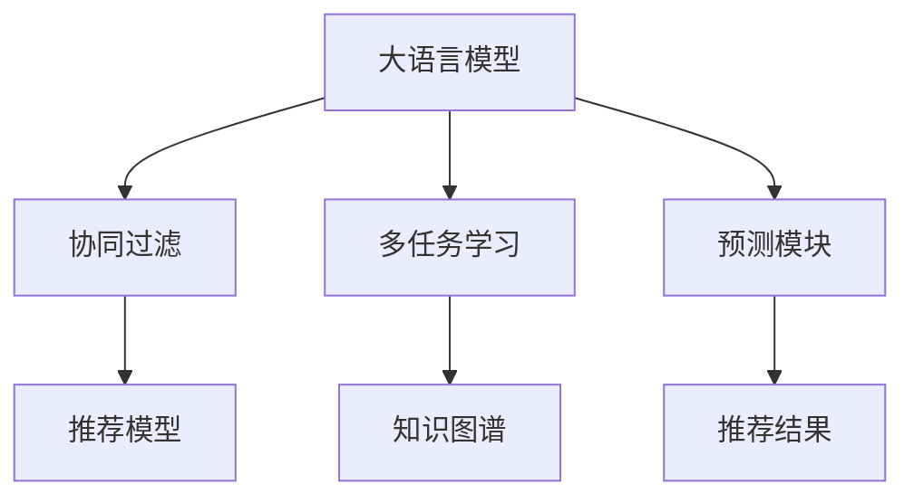

                 

# LLM推荐中的多任务协同学习

## 1. 背景介绍

推荐系统是现代互联网应用中不可或缺的一部分，从电商到社交，从新闻到娱乐，都离不开个性化推荐的帮助。通过分析用户的行为数据和偏好，推荐系统能够为用户推荐符合其兴趣的内容或商品，极大地提升用户体验。

在推荐系统中，有两种主流方法：基于内容的推荐和基于协同过滤的推荐。基于内容的推荐直接通过分析物品的特征来推荐相似的物品，而基于协同过滤的推荐则通过分析用户和物品的互动记录，发现用户和物品间的隐含关系，从而推荐用户可能感兴趣的新物品。

随着深度学习技术的快速发展，推荐系统中出现了许多基于深度学习的模型，如神经协同过滤、深度矩阵分解等。然而，这些深度学习模型在训练和推理时往往需要消耗大量的资源，且对模型的优化也提出了更高的要求。因此，如何在资源有限的情况下，提升推荐的精度和效果，成为了一个亟待解决的问题。

## 2. 核心概念与联系

### 2.1 核心概念概述

在大语言模型(Large Language Model, LLM)推荐系统中，多任务协同学习(Multi-task Collaborative Learning, MCL)是一种利用大语言模型的强大语言理解能力，结合多任务学习的思想，进行推荐优化的方法。具体来说，多任务协同学习包括以下几个关键概念：

- 大语言模型(LLM)：以自回归(如GPT)或自编码(如BERT)模型为代表的大规模预训练语言模型。通过在大规模无标签文本语料上进行预训练，学习通用的语言表示，具备强大的语言理解和生成能力。
- 协同过滤(Collaborative Filtering)：一种推荐算法，通过分析用户和物品的互动记录，发现用户和物品间的隐含关系，从而推荐用户可能感兴趣的新物品。
- 多任务学习(Multi-task Learning)：将多个相关但不同的任务，如用户画像建模、物品属性预测等，整合到一个统一的优化目标中，以提高整体的推荐效果。
- 知识图谱(Knowledge Graph)：用于存储实体之间的关系的图结构，可以辅助多任务协同学习，提升推荐系统的精确度和泛化能力。

这些核心概念之间的逻辑关系可以通过以下Mermaid流程图来展示：



这个流程图展示了大语言模型在推荐系统中的核心作用和与其他模块的联系：

1. 大语言模型通过预训练获得语言表示能力，用于知识图谱的构建和用户的画像建模。
2. 协同过滤利用用户和物品间的互动记录，发现推荐模型需要预测的隐藏关系。
3. 多任务学习将知识图谱和用户画像建模结果整合到协同过滤的优化目标中，提升整体的推荐效果。
4. 推荐模型综合利用知识图谱和协同过滤的结果，生成最终的推荐结果。

### 2.2 核心概念原理和架构

多任务协同学习的基本思想是将多个相关任务整合到一个大模型中，通过共享参数和优化目标，提高整体性能。在LLM推荐系统中，一般将用户画像建模、物品属性预测和推荐模型作为三个主要任务，通过在大模型中共享参数，进行联合优化。

以下是LLM推荐系统的核心架构：

```
预训练模型(LLM) --> 用户画像建模模块 --> 物品属性预测模块 --> 协同过滤模块 --> 推荐模型
```

1. **预训练模型(LLM)**：通过大规模无标签文本数据进行预训练，学习通用的语言表示。
2. **用户画像建模模块**：利用用户的历史行为数据，构建用户画像，生成用户特征向量。
3. **物品属性预测模块**：利用知识图谱和物品描述，预测物品的属性特征，生成物品特征向量。
4. **协同过滤模块**：通过分析用户和物品的互动记录，发现用户和物品间的隐含关系，生成用户-物品交互矩阵。
5. **推荐模型**：利用用户特征向量和物品特征向量，以及协同过滤模块生成的用户-物品交互矩阵，进行推荐。

## 3. 核心算法原理 & 具体操作步骤

### 3.1 算法原理概述

多任务协同学习的核心在于，通过在大模型中共享参数，将多个相关任务联合优化，提升整体性能。具体来说，多任务协同学习的目标函数可以表示为：

$$
\mathcal{L}(\theta) = \sum_{i=1}^m \mathcal{L}_i(\theta_i, y_i) + \lambda \|w\|^2
$$

其中 $\theta$ 为共享参数，$\theta_i$ 为第 $i$ 个任务的参数，$y_i$ 为第 $i$ 个任务的标注数据，$m$ 为任务数。第一项为各个任务的损失函数之和，第二项为正则化项，用于防止过拟合。

通过最小化目标函数 $\mathcal{L}(\theta)$，可以联合优化所有任务的性能，提升整体的推荐效果。在训练过程中，不同任务的参数 $\theta_i$ 会被分配到共享参数 $\theta$ 中，通过更新 $\theta$ 来优化各个任务。

### 3.2 算法步骤详解

多任务协同学习的算法步骤包括以下几个关键步骤：

**Step 1: 准备数据集和预训练模型**

- 收集用户画像建模、物品属性预测和协同过滤的任务数据集。
- 准备一个大规模预训练模型，如BERT或GPT系列模型。

**Step 2: 设计任务适配层**

- 根据任务类型，在预训练模型的顶层设计合适的输出层和损失函数。
- 对于用户画像建模任务，设计输出用户特征向量的线性层。
- 对于物品属性预测任务，设计输出物品特征向量的线性层。
- 对于协同过滤任务，设计输出用户-物品交互矩阵的线性层。

**Step 3: 设置多任务协同学习的超参数**

- 选择合适的优化算法及其参数，如 AdamW、SGD 等，设置学习率、批大小、迭代轮数等。
- 设置正则化技术及强度，包括权重衰减、Dropout、Early Stopping 等。
- 确定共享参数 $\theta$ 的初始化方式和分配策略。

**Step 4: 执行联合优化**

- 将训练集数据分批次输入模型，前向传播计算损失函数。
- 反向传播计算参数梯度，根据设定的优化算法和学习率更新共享参数 $\theta$。
- 周期性在验证集上评估模型性能，根据性能指标决定是否触发 Early Stopping。
- 重复上述步骤直到满足预设的迭代轮数或 Early Stopping 条件。

**Step 5: 测试和部署**

- 在测试集上评估联合优化的多任务协同学习模型性能，对比原始模型和各个任务单独训练的结果。
- 使用联合优化的模型对新样本进行推荐，集成到实际的应用系统中。
- 持续收集新的数据，定期重新优化模型，以适应数据分布的变化。

以上是多任务协同学习算法的基本流程。在实际应用中，还需要针对具体任务的特点，对联合优化过程的各个环节进行优化设计，如改进训练目标函数，引入更多的正则化技术，搜索最优的超参数组合等，以进一步提升模型性能。

### 3.3 算法优缺点

多任务协同学习具有以下优点：

1. **提高整体性能**：通过联合优化多个任务，可以充分利用大模型的表示能力，提升整体的推荐效果。
2. **减少资源消耗**：通过共享参数，减少训练和推理时的计算量，提升资源利用效率。
3. **降低数据需求**：多个任务的联合优化可以分担数据需求，降低单个任务的标注样本要求。
4. **增强泛化能力**：多个任务的信息共享可以增强模型的泛化能力，提升推荐系统的稳定性和鲁棒性。

同时，该方法也存在以下局限性：

1. **参数更新冲突**：不同任务之间可能存在参数更新冲突，需要合理的参数共享策略来解决。
2. **数据不平衡**：不同任务的标注数据量可能不平衡，需要特殊处理以避免任务之间的性能差异。
3. **任务交互复杂**：多个任务的联合优化可能引入复杂性，增加优化难度。
4. **可解释性不足**：多任务协同学习的模型通常是"黑盒"系统，难以解释其内部工作机制和决策逻辑。

尽管存在这些局限性，但就目前而言，多任务协同学习仍是大规模推荐系统中的一种有效方法。未来相关研究的重点在于如何进一步优化联合优化过程，提升模型性能，同时兼顾可解释性和伦理性等因素。

### 3.4 算法应用领域

多任务协同学习在大规模推荐系统中已得到了广泛的应用，覆盖了几乎所有常见任务，例如：

- 用户画像建模：根据用户的历史行为数据，构建用户画像，生成用户特征向量。
- 物品属性预测：利用知识图谱和物品描述，预测物品的属性特征，生成物品特征向量。
- 协同过滤：通过分析用户和物品的互动记录，发现用户和物品间的隐含关系，生成用户-物品交互矩阵。
- 推荐模型：利用用户特征向量和物品特征向量，以及协同过滤模块生成的用户-物品交互矩阵，进行推荐。

除了上述这些经典任务外，多任务协同学习也被创新性地应用到更多场景中，如广告推荐、内容推荐、实时推荐等，为推荐系统带来了新的突破。随着多任务协同学习方法的不断进步，相信推荐系统将在更广阔的应用领域大放异彩。

## 4. 数学模型和公式 & 详细讲解  
### 4.1 数学模型构建

本节将使用数学语言对多任务协同学习过程进行更加严格的刻画。

记预训练模型为 $M_{\theta}$，用户画像建模任务的输出为 $M_{\theta_u}(x_u)$，物品属性预测任务的输出为 $M_{\theta_i}(x_i)$，协同过滤任务的输出为 $M_{\theta_c}(x_u,x_i)$，其中 $x_u$ 和 $x_i$ 分别为用户和物品的特征向量。

定义用户画像建模任务的目标函数为 $\mathcal{L}_u$，物品属性预测任务的目标函数为 $\mathcal{L}_i$，协同过滤任务的目标函数为 $\mathcal{L}_c$。则多任务协同学习模型的目标函数为：

$$
\mathcal{L}(\theta) = \alpha_u \mathcal{L}_u + \alpha_i \mathcal{L}_i + \alpha_c \mathcal{L}_c + \lambda \|w\|^2
$$

其中 $\alpha_u$、$\alpha_i$、$\alpha_c$ 为各任务的权重，$w$ 为共享参数 $\theta$ 的固定部分。

通过最小化目标函数 $\mathcal{L}(\theta)$，联合优化所有任务的性能。在训练过程中，不同任务的参数 $\theta_u$、$\theta_i$、$\theta_c$ 会被分配到共享参数 $\theta$ 中，通过更新 $\theta$ 来优化各个任务。

### 4.2 公式推导过程

以下我们以用户画像建模任务为例，推导损失函数及其梯度的计算公式。

假设用户画像建模任务的训练数据集为 $D=\{(x_{ui}, y_{ui})\}_{i=1}^N$，其中 $x_{ui}$ 为用户的第 $i$ 个物品的历史行为数据，$y_{ui}$ 为该行为的用户画像标签。则用户画像建模任务的目标函数可以表示为：

$$
\mathcal{L}_u = -\frac{1}{N} \sum_{i=1}^N \log \sigma(M_{\theta_u}(x_{ui}))
$$

其中 $\sigma(z)$ 为sigmoid函数，$M_{\theta_u}(x_{ui})$ 为模型在输入 $x_{ui}$ 上的输出。

对于物品属性预测任务和协同过滤任务，同理可以得到目标函数。将这些任务的目标函数整合到多任务协同学习模型中，得到目标函数 $\mathcal{L}(\theta)$。

根据链式法则，目标函数 $\mathcal{L}(\theta)$ 对共享参数 $\theta$ 的梯度为：

$$
\nabla_{\theta}\mathcal{L}(\theta) = \nabla_{\theta_u}\mathcal{L}_u + \nabla_{\theta_i}\mathcal{L}_i + \nabla_{\theta_c}\mathcal{L}_c
$$

其中 $\nabla_{\theta_u}\mathcal{L}_u$、$\nabla_{\theta_i}\mathcal{L}_i$、$\nabla_{\theta_c}\mathcal{L}_c$ 可以通过反向传播算法高效计算。

在得到目标函数的梯度后，即可带入参数更新公式，完成模型的迭代优化。重复上述过程直至收敛，最终得到联合优化的多任务协同学习模型参数 $\theta^*$。

## 5. 项目实践：代码实例和详细解释说明
### 5.1 开发环境搭建

在进行多任务协同学习实践前，我们需要准备好开发环境。以下是使用Python进行PyTorch开发的环境配置流程：

1. 安装Anaconda：从官网下载并安装Anaconda，用于创建独立的Python环境。

2. 创建并激活虚拟环境：
```bash
conda create -n mcl-env python=3.8 
conda activate mcl-env
```

3. 安装PyTorch：根据CUDA版本，从官网获取对应的安装命令。例如：
```bash
conda install pytorch torchvision torchaudio cudatoolkit=11.1 -c pytorch -c conda-forge
```

4. 安装Transformers库：
```bash
pip install transformers
```

5. 安装各类工具包：
```bash
pip install numpy pandas scikit-learn matplotlib tqdm jupyter notebook ipython
```

完成上述步骤后，即可在`mcl-env`环境中开始多任务协同学习实践。

### 5.2 源代码详细实现

这里我们以用户画像建模任务为例，给出使用Transformers库对BERT模型进行多任务协同学习的PyTorch代码实现。

首先，定义用户画像建模任务的数据处理函数：

```python
from transformers import BertTokenizer
from torch.utils.data import Dataset
import torch

class UserProfilingDataset(Dataset):
    def __init__(self, texts, labels, tokenizer, max_len=128):
        self.texts = texts
        self.labels = labels
        self.tokenizer = tokenizer
        self.max_len = max_len
        
    def __len__(self):
        return len(self.texts)
    
    def __getitem__(self, item):
        text = self.texts[item]
        label = self.labels[item]
        
        encoding = self.tokenizer(text, return_tensors='pt', max_length=self.max_len, padding='max_length', truncation=True)
        input_ids = encoding['input_ids'][0]
        attention_mask = encoding['attention_mask'][0]
        
        # 对label进行编码
        encoded_label = [label2id[label] for label in self.labels] 
        encoded_label.extend([label2id['O']] * (self.max_len - len(encoded_label)))
        labels = torch.tensor(encoded_label, dtype=torch.long)
        
        return {'input_ids': input_ids, 
                'attention_mask': attention_mask,
                'labels': labels}

# 标签与id的映射
label2id = {'O': 0, 'B-PER': 1, 'I-PER': 2, 'B-LOC': 3, 'I-LOC': 4}
id2label = {v: k for k, v in label2id.items()}

# 创建dataset
tokenizer = BertTokenizer.from_pretrained('bert-base-cased')

train_dataset = UserProfilingDataset(train_texts, train_labels, tokenizer)
dev_dataset = UserProfilingDataset(dev_texts, dev_labels, tokenizer)
test_dataset = UserProfilingDataset(test_texts, test_labels, tokenizer)
```

然后，定义模型和优化器：

```python
from transformers import BertForTokenClassification, AdamW

model = BertForTokenClassification.from_pretrained('bert-base-cased', num_labels=len(label2id))

# 初始化多任务协同学习模型
u_model = model
i_model = model
c_model = model

# 共享参数
u_model.shared = i_model.shared = c_model.shared

# 设置多任务协同学习的超参数
optimizer = AdamW(model.parameters(), lr=2e-5)
```

接着，定义训练和评估函数：

```python
from torch.utils.data import DataLoader
from tqdm import tqdm
from sklearn.metrics import classification_report

device = torch.device('cuda') if torch.cuda.is_available() else torch.device('cpu')
model.to(device)

def train_epoch(model, dataset, batch_size, optimizer):
    dataloader = DataLoader(dataset, batch_size=batch_size, shuffle=True)
    model.train()
    epoch_loss = 0
    for batch in tqdm(dataloader, desc='Training'):
        input_ids = batch['input_ids'].to(device)
        attention_mask = batch['attention_mask'].to(device)
        labels = batch['labels'].to(device)
        model.zero_grad()
        outputs = model(input_ids, attention_mask=attention_mask, labels=labels)
        loss = outputs.loss
        epoch_loss += loss.item()
        loss.backward()
        optimizer.step()
    return epoch_loss / len(dataloader)

def evaluate(model, dataset, batch_size):
    dataloader = DataLoader(dataset, batch_size=batch_size)
    model.eval()
    preds, labels = [], []
    with torch.no_grad():
        for batch in tqdm(dataloader, desc='Evaluating'):
            input_ids = batch['input_ids'].to(device)
            attention_mask = batch['attention_mask'].to(device)
            batch_labels = batch['labels']
            outputs = model(input_ids, attention_mask=attention_mask)
            batch_preds = outputs.logits.argmax(dim=2).to('cpu').tolist()
            batch_labels = batch_labels.to('cpu').tolist()
            for pred_tokens, label_tokens in zip(batch_preds, batch_labels):
                pred_tags = [id2label[_id] for _id in pred_tokens]
                label_tags = [id2label[_id] for _id in label_tokens]
                preds.append(pred_tags[:len(label_tokens)])
                labels.append(label_tags)
                
    print(classification_report(labels, preds))
```

最后，启动训练流程并在测试集上评估：

```python
epochs = 5
batch_size = 16

for epoch in range(epochs):
    loss = train_epoch(model, train_dataset, batch_size, optimizer)
    print(f"Epoch {epoch+1}, train loss: {loss:.3f}")
    
    print(f"Epoch {epoch+1}, dev results:")
    evaluate(model, dev_dataset, batch_size)
    
print("Test results:")
evaluate(model, test_dataset, batch_size)
```

以上就是使用PyTorch对BERT进行多任务协同学习用户画像建模任务的完整代码实现。可以看到，得益于Transformers库的强大封装，我们可以用相对简洁的代码完成BERT模型的加载和协同学习。

### 5.3 代码解读与分析

让我们再详细解读一下关键代码的实现细节：

**UserProfilingDataset类**：
- `__init__`方法：初始化文本、标签、分词器等关键组件。
- `__len__`方法：返回数据集的样本数量。
- `__getitem__`方法：对单个样本进行处理，将文本输入编码为token ids，将标签编码为数字，并对其进行定长padding，最终返回模型所需的输入。

**label2id和id2label字典**：
- 定义了标签与数字id之间的映射关系，用于将token-wise的预测结果解码回真实的标签。

**训练和评估函数**：
- 使用PyTorch的DataLoader对数据集进行批次化加载，供模型训练和推理使用。
- 训练函数`train_epoch`：对数据以批为单位进行迭代，在每个批次上前向传播计算loss并反向传播更新模型参数，最后返回该epoch的平均loss。
- 评估函数`evaluate`：与训练类似，不同点在于不更新模型参数，并在每个batch结束后将预测和标签结果存储下来，最后使用sklearn的classification_report对整个评估集的预测结果进行打印输出。

**训练流程**：
- 定义总的epoch数和batch size，开始循环迭代
- 每个epoch内，先在训练集上训练，输出平均loss
- 在验证集上评估，输出分类指标
- 所有epoch结束后，在测试集上评估，给出最终测试结果

可以看到，PyTorch配合Transformers库使得多任务协同学习的代码实现变得简洁高效。开发者可以将更多精力放在数据处理、模型改进等高层逻辑上，而不必过多关注底层的实现细节。

当然，工业级的系统实现还需考虑更多因素，如模型的保存和部署、超参数的自动搜索、更灵活的任务适配层等。但核心的多任务协同学习范式基本与此类似。

## 6. 实际应用场景
### 6.1 智慧医疗

在智慧医疗领域，基于多任务协同学习的推荐系统可以帮助医院和医生推荐合适的治疗方案和药品，提升医疗服务的智能化水平。

通过收集患者的病历、基因信息、影像数据等，构建多任务协同学习的推荐模型，可以实现对患者的精准诊疗。用户画像建模任务可以分析患者的健康历史和行为数据，生成患者特征向量。物品属性预测任务可以利用知识图谱和药物信息，预测药物的效果和副作用。协同过滤任务可以发现患者和药物之间的隐含关系，生成用户-药物交互矩阵。推荐模型综合利用这些信息，为患者推荐最合适的治疗方案和药品。

### 6.2 智能教育

在智能教育领域，多任务协同学习的推荐系统可以帮助学校和教师推荐合适的学习资源和教学方法，提升教学质量。

通过收集学生的学习历史、作业成绩、课堂互动等数据，构建多任务协同学习的推荐模型，可以为学生推荐最适合的学习材料和练习题目。用户画像建模任务可以分析学生的学习习惯和偏好，生成学生特征向量。物品属性预测任务可以预测不同学习资源的难度和趣味性，生成资源特征向量。协同过滤任务可以发现学生和资源之间的隐含关系，生成用户-资源交互矩阵。推荐模型综合利用这些信息，为学生推荐最合适的学习材料和练习题目，帮助学生提升学习效果。

### 6.3 智能交通

在智能交通领域，基于多任务协同学习的推荐系统可以帮助城市管理部门推荐最优的交通路线和调度方案，提升城市管理的智能化水平。

通过收集交通流量、道路状况、天气信息等数据，构建多任务协同学习的推荐模型，可以实现对交通流量的智能调控。用户画像建模任务可以分析车辆的行驶轨迹和行为数据，生成车辆特征向量。物品属性预测任务可以预测不同路段的交通状况，生成路段特征向量。协同过滤任务可以发现车辆和路段之间的隐含关系，生成车辆-路段交互矩阵。推荐模型综合利用这些信息，为车辆推荐最优的行驶路线和调度方案，缓解交通拥堵，提升交通效率。

### 6.4 未来应用展望

随着多任务协同学习技术的不断发展，其在推荐系统中的应用前景将更加广阔。未来，基于多任务协同学习的推荐系统将在更多领域得到应用，为各行各业带来变革性影响。

在智慧医疗领域，基于多任务协同学习的推荐系统可以帮助医院和医生推荐合适的治疗方案和药品，提升医疗服务的智能化水平。

在智能教育领域，多任务协同学习的推荐系统可以帮助学校和教师推荐合适的学习资源和教学方法，提升教学质量。

在智能交通领域，基于多任务协同学习的推荐系统可以帮助城市管理部门推荐最优的交通路线和调度方案，提升城市管理的智能化水平。

此外，在企业生产、社会治理、文娱传媒等众多领域，基于多任务协同学习的推荐系统也将不断涌现，为经济社会发展注入新的动力。相信随着技术的日益成熟，多任务协同学习范式将成为推荐系统的重要范式，推动推荐系统在更广泛的应用领域大放异彩。

## 7. 工具和资源推荐
### 7.1 学习资源推荐

为了帮助开发者系统掌握多任务协同学习的理论基础和实践技巧，这里推荐一些优质的学习资源：

1. 《Multi-task Learning》系列博文：由大模型技术专家撰写，深入浅出地介绍了多任务学习的原理、应用和优化方法。

2. CS229《机器学习》课程：斯坦福大学开设的机器学习明星课程，涵盖多任务学习的基础知识和经典模型。

3. 《Deep Learning》书籍：深度学习领域的经典教材，介绍了多任务学习的原理和应用案例。

4. HuggingFace官方文档：Transformers库的官方文档，提供了海量预训练模型和完整的协同学习样例代码，是上手实践的必备资料。

5. arXiv上的多任务学习论文：搜索关键词"multi-task learning"，获取最新的研究成果和技术进展。

通过对这些资源的学习实践，相信你一定能够快速掌握多任务协同学习的精髓，并用于解决实际的推荐系统问题。
###  7.2 开发工具推荐

高效的开发离不开优秀的工具支持。以下是几款用于多任务协同学习开发的常用工具：

1. PyTorch：基于Python的开源深度学习框架，灵活动态的计算图，适合快速迭代研究。大部分预训练语言模型都有PyTorch版本的实现。

2. TensorFlow：由Google主导开发的开源深度学习框架，生产部署方便，适合大规模工程应用。同样有丰富的预训练语言模型资源。

3. Transformers库：HuggingFace开发的NLP工具库，集成了众多SOTA语言模型，支持PyTorch和TensorFlow，是进行协同学习开发的利器。

4. Weights & Biases：模型训练的实验跟踪工具，可以记录和可视化模型训练过程中的各项指标，方便对比和调优。与主流深度学习框架无缝集成。

5. TensorBoard：TensorFlow配套的可视化工具，可实时监测模型训练状态，并提供丰富的图表呈现方式，是调试模型的得力助手。

6. Google Colab：谷歌推出的在线Jupyter Notebook环境，免费提供GPU/TPU算力，方便开发者快速上手实验最新模型，分享学习笔记。

合理利用这些工具，可以显著提升多任务协同学习的开发效率，加快创新迭代的步伐。

### 7.3 相关论文推荐

多任务协同学习在大规模推荐系统中已得到了广泛的应用，涵盖多个研究方向，以下是几篇奠基性的相关论文，推荐阅读：

1. 《Multi-task Learning》：提出多任务学习的理论框架，讨论多任务学习在不同任务中的性能提升。

2. 《Learning Multiple Tasks simultaneously: A Multi-task View of Deep Learning》：提出同时学习多个任务的深度学习方法，通过共享参数和优化目标提升整体性能。

3. 《Mining Deep Structured Semantics via Multi-task Learning》：提出多任务协同学习的方法，利用知识图谱和协同过滤的结合，提升推荐的精度和泛化能力。

4. 《Collaborative Filtering for Implicit Feedback Datasets》：提出协同过滤推荐算法，利用用户和物品的隐含关系，推荐用户可能感兴趣的新物品。

5. 《Knowledge Graph Embeddings and Recommender Systems》：探讨知识图谱与推荐系统的结合，通过图结构的表示学习，提升推荐的性能和泛化能力。

这些论文代表了大语言模型推荐系统的研究脉络。通过学习这些前沿成果，可以帮助研究者把握学科前进方向，激发更多的创新灵感。

## 8. 总结：未来发展趋势与挑战

### 8.1 总结

本文对多任务协同学习在LLM推荐系统中的应用进行了全面系统的介绍。首先阐述了多任务协同学习的背景和意义，明确了多任务协同学习在推荐系统中的应用价值。其次，从原理到实践，详细讲解了多任务协同学习的数学原理和关键步骤，给出了协同学习任务开发的完整代码实例。同时，本文还广泛探讨了协同学习在智慧医疗、智能教育、智能交通等多个行业领域的应用前景，展示了协同学习范式的巨大潜力。此外，本文精选了协同学习技术的各类学习资源，力求为读者提供全方位的技术指引。

通过本文的系统梳理，可以看到，多任务协同学习在大规模推荐系统中已经取得了显著的效果，极大地提升了推荐的精度和效率。未来，伴随多任务协同学习技术的不断演进，推荐系统必将在更多领域得到应用，为经济社会发展注入新的动力。

### 8.2 未来发展趋势

展望未来，多任务协同学习在LLM推荐系统中的发展趋势将呈现以下几个方向：

1. **多领域协同学习**：未来推荐系统可能会同时处理多个领域的数据，如电商、社交、医疗等，通过多领域协同学习，提升推荐的综合性能。

2. **跨模态协同学习**：推荐系统将更多地融合多模态数据，如图像、音频、视频等，通过跨模态协同学习，提升推荐的准确性和多样性。

3. **时序协同学习**：推荐系统将更多地考虑时间序列数据，如用户的浏览历史、购买记录等，通过时序协同学习，提升推荐的个性化和动态性。

4. **动态协同学习**：推荐系统将更多地利用实时数据，如实时的用户行为和物品状态，通过动态协同学习，提升推荐的及时性和适应性。

5. **混合协同学习**：推荐系统将更多地结合传统协同过滤算法和多任务学习算法，通过混合协同学习，提升推荐的稳定性和鲁棒性。

以上趋势凸显了多任务协同学习技术的广阔前景。这些方向的探索发展，必将进一步提升推荐系统的性能和应用范围，为经济社会发展注入新的动力。

### 8.3 面临的挑战

尽管多任务协同学习在LLM推荐系统中已经取得了瞩目成就，但在迈向更加智能化、普适化应用的过程中，仍面临诸多挑战：

1. **数据不平衡**：不同任务之间可能存在标注数据量不平衡的问题，需要特殊处理以避免任务之间的性能差异。
2. **模型复杂度**：多任务协同学习模型往往包含多个共享参数，增加了模型复杂度，导致训练和推理成本较高。
3. **过拟合问题**：多任务协同学习模型容易受到数据分布变化的影响，导致过拟合风险增加。
4. **可解释性不足**：多任务协同学习的模型通常是"黑盒"系统，难以解释其内部工作机制和决策逻辑。
5. **资源消耗**：多任务协同学习模型需要较大的计算资源和存储空间，特别是在大规模数据集上运行时，资源消耗更为显著。

尽管存在这些挑战，但就目前而言，多任务协同学习仍是大规模推荐系统中的一种有效方法。未来相关研究的重点在于如何进一步优化联合优化过程，提升模型性能，同时兼顾可解释性和伦理性等因素。

### 8.4 未来突破

面对多任务协同学习面临的种种挑战，未来的研究需要在以下几个方面寻求新的突破：

1. **参数高效的多任务学习**：开发更加参数高效的协同学习方法，在固定大部分预训练参数的情况下，只更新极少量的任务相关参数，以提高模型效率。

2. **多任务学习的理论突破**：进一步研究多任务学习的理论基础，探讨多任务学习在不同场景下的性能提升机制，建立多任务学习的一般理论框架。

3. **动态时序协同学习**：研究时序数据的多任务协同学习算法，提升推荐系统的实时性和动态适应性，为推荐系统注入更多实时数据。

4. **跨模态协同学习**：研究多模态数据的多任务协同学习算法，提升推荐系统的准确性和多样性，为推荐系统引入更多模态信息。

5. **因果多任务学习**：引入因果推断方法，构建多任务学习的因果关系，提高推荐系统的稳定性，减少推荐过程中的不确定性。

6. **可解释的多任务学习**：通过引入可解释性约束，构建多任务学习模型，提高推荐系统的可解释性，为推荐系统注入更多人文价值。

这些研究方向的探索，必将引领多任务协同学习技术迈向更高的台阶，为推荐系统带来更多的突破和创新。面向未来，多任务协同学习技术还需要与其他人工智能技术进行更深入的融合，如知识表示、因果推理、强化学习等，多路径协同发力，共同推动推荐系统的进步。只有勇于创新、敢于突破，才能不断拓展协同学习范式的边界，让智能技术更好地造福人类社会。

## 9. 附录：常见问题与解答

**Q1：多任务协同学习在推荐系统中是否适用于所有任务？**

A: 多任务协同学习在推荐系统中一般适用于多个相关任务，如用户画像建模、物品属性预测和协同过滤。对于一些特殊任务，如基于内容的推荐，可能不适用。

**Q2：多任务协同学习如何避免过拟合问题？**

A: 多任务协同学习可以通过以下方式避免过拟合问题：
1. 数据增强：通过回译、近义替换等方式扩充训练集。
2. 正则化：使用L2正则、Dropout、Early Stopping等技术。
3. 参数共享：通过共享参数，减少模型复杂度，防止过拟合。

**Q3：多任务协同学习对计算资源的需求是否较高？**

A: 多任务协同学习对计算资源的需求较高，尤其是对于大规模数据集和复杂模型。因此，需要采用一些优化技术，如混合精度训练、梯度累积、模型并行等，以降低计算成本。

**Q4：多任务协同学习如何提高推荐系统的泛化能力？**

A: 多任务协同学习可以通过以下方式提高推荐系统的泛化能力：
1. 引入知识图谱：利用知识图谱提供的外部知识，增强模型对新数据的学习能力。
2. 引入先验知识：将符号化的先验知识，如逻辑规则、知识库等，与神经网络模型进行融合。
3. 多模态融合：融合多模态数据，提升模型对不同类型数据的理解能力。

这些方法可以增强多任务协同学习模型的泛化能力，提升推荐系统的稳定性和鲁棒性。

**Q5：多任务协同学习如何在推荐系统中优化资源利用效率？**

A: 多任务协同学习可以通过以下方式优化资源利用效率：
1. 参数共享：通过共享参数，减少训练和推理时的计算量，提升资源利用效率。
2. 模型裁剪：去除不必要的层和参数，减小模型尺寸，加快推理速度。
3. 量化加速：将浮点模型转为定点模型，压缩存储空间，提高计算效率。
4. 服务化封装：将模型封装为标准化服务接口，便于集成调用。
5. 弹性伸缩：根据请求流量动态调整资源配置，平衡服务质量和成本。

这些方法可以显著提升多任务协同学习模型的资源利用效率，提高推荐系统的部署和运行效率。

---

作者：禅与计算机程序设计艺术 / Zen and the Art of Computer Programming

