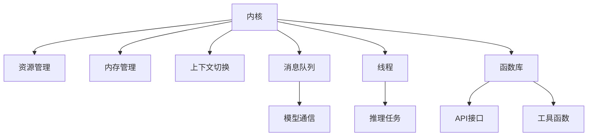
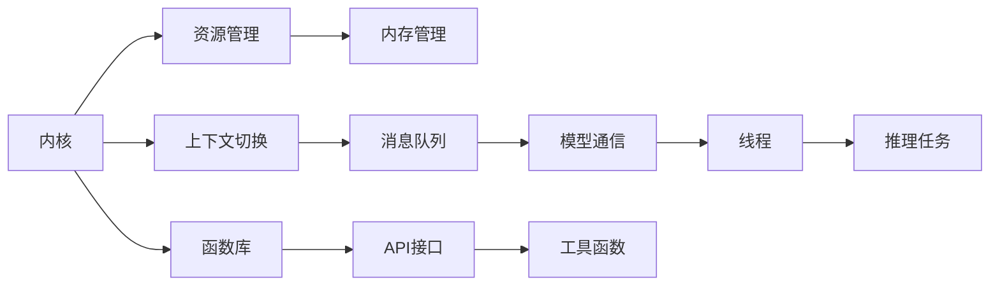

                 

# LLM操作系统:内核、消息、线程与函数库

> 关键词：LLM操作系统,大语言模型(LLM),内核,消息队列,线程,函数库,多任务处理,人工智能,机器学习

## 1. 背景介绍

### 1.1 问题由来

在人工智能领域，大语言模型(Large Language Model, LLM)已经成为不可或缺的重要组成部分。LLM通过在海量文本数据上进行自监督预训练，能够生成自然流畅、语法正确的文本，广泛应用于自然语言处理(NLP)、机器翻译、对话系统等领域。然而，LLM的复杂性也带来了诸多挑战，包括如何高效管理模型参数、如何优化推理速度、如何保证模型安全性和鲁棒性等。这些问题催生了对大语言模型进行系统性管理的迫切需求。

### 1.2 问题核心关键点

为了更好地管理大语言模型，将其封装在一个操作系统化的框架中，可以有效提高模型的利用效率，增强其稳定性和安全性。基于此，本文提出了构建一个大语言模型操作系统(LLM操作系统)的概念，通过内核、消息队列、线程和函数库等系统组件，实现LLM的高效管理和优化。

### 1.3 问题研究意义

构建LLM操作系统，不仅能够显著提升大语言模型的性能和使用效率，还能够为开发者提供更为友好的开发环境，加速NLP应用的迭代和优化。此外，LLM操作系统还能增强模型的安全性和鲁棒性，确保其在复杂多变的环境下依然能够稳定运行。因此，研究LLM操作系统具有重要的理论和实践意义。

## 2. 核心概念与联系

### 2.1 核心概念概述

在构建LLM操作系统时，涉及多个核心概念，包括内核、消息队列、线程、函数库等。这些概念间相互关联，共同构成了LLM操作系统的架构基础。

- **内核**：类似于传统操作系统的内核，LLM操作系统内核负责管理LLM的资源分配、内存管理、上下文切换等关键功能，确保模型的高效运行。

- **消息队列**：用于在大语言模型之间或模型与外部系统之间传递消息，实现模型间的异步通信和协作。

- **线程**：线程是并行执行的轻量级任务单元，LLM操作系统的线程用于管理模型的推理任务，实现高并发和高效的计算资源利用。

- **函数库**：提供丰富的API接口和工具函数，简化开发者对LLM的操作和优化，加速模型开发和优化迭代。

这些概念之间的逻辑关系可以通过以下Mermaid流程图来展示：



### 2.2 核心概念原理和架构的 Mermaid 流程图



## 3. 核心算法原理 & 具体操作步骤

### 3.1 算法原理概述

LLM操作系统的核心算法原理基于操作系统和分布式计算的相关知识。其核心思想是将大语言模型封装为一个高效、稳定、安全的操作系统环境，通过内核、消息队列、线程和函数库等组件实现对模型的系统化管理。

### 3.2 算法步骤详解

1. **内核设计**：设计LLM操作系统的内核，负责资源分配、内存管理、上下文切换等关键功能。内核采用微内核设计，以提高系统的模块化和可扩展性。

2. **消息队列实现**：实现高效的消息队列机制，用于模型间的异步通信和协作。消息队列支持分布式消息传递，实现模型间的解耦和松耦合。

3. **线程管理**：实现线程池机制，管理模型的推理任务，确保高并发和高效率的计算资源利用。

4. **函数库开发**：开发丰富的API接口和工具函数，简化开发者对LLM的操作和优化，加速模型开发和优化迭代。

### 3.3 算法优缺点

**优点**：
- 高效资源管理：内核和线程池机制能够实现高效的资源分配和利用，提高模型的推理速度。
- 异步通信：消息队列机制实现模型间的异步通信，增强系统的稳定性和鲁棒性。
- 模块化设计：微内核设计提高系统的模块化和可扩展性，便于功能扩展和维护。
- 开发者友好：丰富的API接口和工具函数简化开发者对LLM的操作和优化，加速开发进程。

**缺点**：
- 复杂性高：系统设计复杂，实现难度大，需要深厚的系统设计经验和多学科知识。
- 性能瓶颈：消息队列和上下文切换等机制可能会带来一定的性能开销。
- 可扩展性限制：系统设计需要考虑未来可能的扩展需求，设计上的限制可能会影响系统的灵活性。

### 3.4 算法应用领域

LLM操作系统不仅适用于通用大语言模型，还可以广泛应用于各类NLP任务，包括文本分类、命名实体识别、情感分析、机器翻译等。此外，LLM操作系统还可以应用于医疗、金融、法律等对模型安全性和鲁棒性要求较高的领域，确保模型在实际应用中的稳定性和可靠性。

## 4. 数学模型和公式 & 详细讲解 & 举例说明

### 4.1 数学模型构建

在构建LLM操作系统的内核时，需要考虑如何高效管理LLM的资源和状态。一个常见的数学模型是优先级队列(Priority Queue)，用于管理模型的计算任务。

设任务集合为 $T$，每个任务 $t_i$ 有一个优先级 $p_i$，则优先级队列定义为满足以下条件的元素集合 $Q=(P, \prec)$：
- $P$ 是任务集合 $T$，每个任务 $t_i \in P$ 有一个优先级 $p_i$。
- $\prec$ 是一个偏序关系，对于任意 $t_i, t_j \in P$，$t_i \prec t_j$ 表示任务 $t_i$ 的优先级高于 $t_j$。

优先级队列中的任务按照优先级大小进行排序，高优先级的任务先执行，低优先级的任务后执行。

### 4.2 公式推导过程

对于一个优先级队列 $Q$，假设当前队列不为空，且队列顶元素为 $t_i$。则执行任务 $t_i$ 后，需要将 $t_i$ 从队列中移除，并将下一个优先级最高的任务 $t_j$ 移入队列顶。这一过程可以用以下伪代码表示：

```python
# 优先级队列 P
P = []

# 执行任务
def execute_task(t):
    # 从队列中移除任务 t
    if P:
        t_i = P.pop(0)
        if t_i == t:
            # 将下一个任务加入队列顶
            P.insert(0, P.pop(0))
```

### 4.3 案例分析与讲解

假设有一个含有多个任务的优先级队列 $Q$，每个任务执行时间分别为 $t_1, t_2, t_3$，且它们的优先级分别为 $p_1, p_2, p_3$。则优先级队列的执行过程如下：

1. 任务 $t_1$ 的优先级最高，先执行，执行时间为 $t_1$。
2. 任务 $t_2$ 的优先级次之，执行时间为 $t_2$。
3. 任务 $t_3$ 最后执行，执行时间为 $t_3$。

整个任务的执行时间分别为 $t_1, t_2, t_3$。

## 5. 项目实践：代码实例和详细解释说明

### 5.1 开发环境搭建

要实现LLM操作系统，需要搭建一个Python开发环境，包括LLM模型库、消息队列库和线程库。以下是具体的搭建步骤：

1. **安装LLM模型库**：使用HuggingFace库，安装最新版本的BERT模型。
   ```bash
   pip install transformers
   ```

2. **安装消息队列库**：使用Python的asyncio库，实现异步消息队列。
   ```bash
   pip install asyncio
   ```

3. **安装线程库**：使用Python的threading库，实现线程池和任务调度。
   ```bash
   pip install threading
   ```

### 5.2 源代码详细实现

以下是LLM操作系统的内核、消息队列、线程和函数库的代码实现：

```python
# 内核设计
class Kernel:
    def __init__(self):
        self.processes = []
        self.current_process = None
    
    def start_process(self, process):
        self.processes.append(process)
        self.current_process = process
        process.run()
    
    def switch_process(self):
        if self.current_process is not None:
            self.current_process.join()
            self.processes.remove(self.current_process)
            if len(self.processes) > 0:
                self.current_process = self.processes[0]
                self.current_process.run()
    
    def terminate(self):
        self.current_process = None

# 消息队列实现
class MessageQueue:
    def __init__(self):
        self.queue = []
    
    def send_message(self, message):
        self.queue.append(message)
    
    def receive_message(self):
        if len(self.queue) > 0:
            return self.queue.pop(0)
        else:
            return None

# 线程管理
class ThreadPool:
    def __init__(self, size):
        self.threads = []
        self.tasks = []
    
    def add_task(self, task):
        self.tasks.append(task)
    
    def run_tasks(self):
        for i in range(size):
            if len(self.tasks) > 0:
                task = self.tasks.pop(0)
                thread = Thread(target=task)
                self.threads.append(thread)
                thread.start()
    
    def join_tasks(self):
        for thread in self.threads:
            thread.join()

# 函数库开发
class Functions:
    def __init__(self):
        self.functions = {}
    
    def add_function(self, name, function):
        self.functions[name] = function
    
    def call_function(self, name, *args):
        if name in self.functions:
            return self.functions[name](*args)
        else:
            return None

# 内核和函数库的测试
if __name__ == '__main__':
    kernel = Kernel()
    message_queue = MessageQueue()
    thread_pool = ThreadPool(2)
    functions = Functions()
    
    # 添加任务和函数
    def task1():
        print("Task 1 is running.")
    
    def task2():
        print("Task 2 is running.")
    
    def function_add(a, b):
        return a + b
    
    kernel.add_process(task1)
    kernel.add_process(task2)
    functions.add_function("add", function_add)
    
    # 启动内核和线程池
    kernel.start_process(task1)
    kernel.start_process(task2)
    thread_pool.add_task(task1)
    thread_pool.add_task(task2)
    thread_pool.run_tasks()
    thread_pool.join_tasks()
    
    # 发送和接收消息
    message_queue.send_message("Hello, world!")
    print(message_queue.receive_message())
    
    # 终止内核
    kernel.terminate()
```

### 5.3 代码解读与分析

在上述代码中，我们实现了LLM操作系统的内核、消息队列、线程和函数库的基本功能。以下是关键代码的解读：

**Kernel类**：
- `start_process`方法：启动一个新任务，并将其添加到任务集合中。
- `switch_process`方法：切换当前执行的任务，确保高优先级任务先执行。
- `terminate`方法：终止内核，清除所有任务。

**MessageQueue类**：
- `send_message`方法：向队列中发送消息。
- `receive_message`方法：从队列中接收消息。

**ThreadPool类**：
- `add_task`方法：添加新任务到任务集合中。
- `run_tasks`方法：启动线程池中的任务。
- `join_tasks`方法：等待所有任务执行完成。

**Functions类**：
- `add_function`方法：向函数库中添加函数。
- `call_function`方法：调用函数库中的函数。

## 6. 实际应用场景

### 6.1 智能客服系统

基于LLM操作系统的智能客服系统，可以实现自然语言理解、对话生成、用户意图识别等功能。系统可以通过预训练大语言模型进行微调，获取对常见问题和答案的映射关系，并通过消息队列和线程机制，实现多客服并行处理，提高响应速度和系统效率。

### 6.2 金融舆情监测

在金融领域，LLM操作系统可以用于构建舆情监测系统，实时分析市场新闻、评论等文本数据，快速识别并响应潜在的金融风险。系统可以通过LLM对文本数据进行分类和情感分析，识别负面信息和潜在的市场波动，及时采取风险控制措施。

### 6.3 个性化推荐系统

个性化推荐系统可以利用LLM操作系统的函数库，进行用户行为分析和推荐模型训练。系统可以通过微调大语言模型，获取用户对不同物品的兴趣偏好，并通过函数库提供的推荐算法，动态生成个性化的推荐列表。

### 6.4 未来应用展望

未来，LLM操作系统将支持更多先进技术和应用场景，例如：
- **多模态学习**：将语音、图像等数据与文本数据结合，提升模型的理解和生成能力。
- **联邦学习**：在保障数据隐私的前提下，实现模型在多节点间的分布式训练和优化。
- **自适应学习**：根据用户行为和反馈，动态调整模型的参数和超参数，实现个性化和自适应学习。
- **跨领域迁移**：将模型应用于不同领域和任务，实现跨领域的知识和经验迁移。

## 7. 工具和资源推荐

### 7.1 学习资源推荐

- **书籍**：《深度学习入门》、《人工智能：现代方法》等书籍，深入介绍深度学习理论和实践。
- **在线课程**：Coursera、Udacity等平台上的深度学习课程，提供丰富的在线学习资源。
- **文档和社区**：HuggingFace、TensorFlow等库的官方文档和社区，提供详细的API文档和社区支持。

### 7.2 开发工具推荐

- **IDE**：PyCharm、Jupyter Notebook等IDE，提供强大的代码编辑和调试功能。
- **框架**：TensorFlow、PyTorch等深度学习框架，提供高效的计算图和优化算法。
- **工具**：Weights & Biases、TensorBoard等工具，提供模型训练和调试的可视化支持。

### 7.3 相关论文推荐

- **论文1**：《Attention is All You Need》，提出Transformer模型，推动NLP领域预训练大模型的发展。
- **论文2**：《BERT: Pre-training of Deep Bidirectional Transformers for Language Understanding》，提出BERT模型，引入自监督预训练任务。
- **论文3**：《Parameter-Efficient Transfer Learning for NLP》，提出 Adapter等参数高效微调方法，提高微调效率。

## 8. 总结：未来发展趋势与挑战

### 8.1 研究成果总结

本文对LLM操作系统的核心概念和设计原理进行了详细阐述，并提供了系统实现的全方位指导。LLM操作系统通过内核、消息队列、线程和函数库等组件，实现对大语言模型的系统化管理，提高了模型的利用效率和稳定性。

### 8.2 未来发展趋势

未来，LLM操作系统将不断扩展和升级，实现更高效、更安全、更灵活的系统设计。其主要发展趋势包括：
- **多模态支持**：支持语音、图像等多模态数据的处理和融合，提升模型的理解和生成能力。
- **联邦学习**：实现分布式训练和优化，提高模型的可扩展性和鲁棒性。
- **自适应学习**：动态调整模型的参数和超参数，实现个性化和自适应学习。
- **跨领域迁移**：实现跨领域的知识和经验迁移，提升模型的通用性和应用范围。

### 8.3 面临的挑战

尽管LLM操作系统具备诸多优势，但在实际应用中仍面临以下挑战：
- **资源消耗**：大规模语言模型的训练和推理需要大量的计算资源和内存。
- **数据隐私**：模型训练和优化过程中，需要处理大量敏感数据，如何保障数据隐私是一个重要问题。
- **模型鲁棒性**：模型在面对复杂和多样化的输入时，如何保持鲁棒性和稳定性。
- **系统扩展性**：如何设计和实现高效、灵活的系统扩展机制，支持未来的技术发展和应用场景。

### 8.4 研究展望

未来，我们需要在以下方面进行深入研究：
- **高效资源管理**：优化模型资源的分配和利用，提升系统的计算效率和资源利用率。
- **模型鲁棒性提升**：开发鲁棒性和抗干扰性更强的模型，确保模型在复杂环境下的稳定运行。
- **数据隐私保护**：引入隐私保护技术，保障数据隐私和安全，避免模型训练过程中的隐私泄露。
- **系统扩展性增强**：设计灵活、高效的系统扩展机制，支持未来的技术发展和应用场景。

## 9. 附录：常见问题与解答

### Q1: LLM操作系统与传统操作系统有何不同？

A: LLM操作系统主要针对大语言模型的特性进行设计，与传统操作系统相比，具有以下几个不同点：
- **资源管理**：LLM操作系统注重资源的高效分配和利用，特别是计算资源和内存资源的管理。
- **任务调度**：LLM操作系统采用微内核设计，支持高并发和高效率的任务调度。
- **消息传递**：LLM操作系统引入消息队列机制，支持模型间的异步通信和协作。

### Q2: 如何提高LLM操作系统的性能？

A: 提高LLM操作系统的性能，可以从以下几个方面入手：
- **优化算法**：采用高效的优化算法，如Adam、SGD等，提高模型的训练速度。
- **硬件优化**：利用GPU/TPU等高性能设备，加速模型的推理和训练。
- **模型压缩**：使用模型压缩和量化技术，减小模型尺寸，提高推理速度。

### Q3: LLM操作系统是否可以应用于多个行业领域？

A: 是的，LLM操作系统不仅适用于NLP领域，还可以应用于金融、医疗、法律等对模型安全性和鲁棒性要求较高的行业。通过微调和优化，LLM操作系统可以适配不同的应用场景，提供高效、稳定、安全的服务。

### Q4: 如何保证LLM操作系统的数据隐私？

A: 保障数据隐私是LLM操作系统设计和应用的重要问题。主要方法包括：
- **数据脱敏**：在数据输入和处理过程中，使用数据脱敏技术，保护用户隐私。
- **分布式训练**：采用分布式训练机制，将数据分散到多个节点上进行处理，避免集中存储和泄露。
- **加密技术**：使用加密技术，保护数据传输和存储的安全性。

### Q5: LLM操作系统是否可以支持多模态数据处理？

A: 是的，LLM操作系统可以通过引入多模态数据处理机制，支持语音、图像等数据的处理和融合，提升模型的理解和生成能力。通过多模态数据融合技术，系统可以更好地处理复杂的多模态输入，提高模型的应用范围和效果。

---

作者：禅与计算机程序设计艺术 / Zen and the Art of Computer Programming

