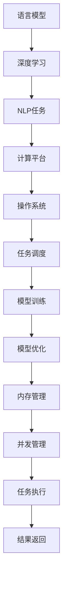

                 

# LLM操作系统：AI时代的新型计算平台

> 关键词：人工智能操作系统，语言模型，自然语言处理，深度学习，计算平台

## 1. 背景介绍

### 1.1 问题由来

随着人工智能技术的飞速发展，尤其是深度学习在大规模语言模型(Language Model)上的突破，人们发现语言模型不仅仅是一套模型算法，更是一种强大的计算引擎。大型语言模型如GPT-3、BERT等，以其强大的语言理解能力、生成能力和知识整合能力，已经开始超越传统的信息检索和处理方式，成为新的计算平台。这种平台可以理解自然语言输入，自动执行各种智能任务，如自然语言理解、对话、翻译、文本生成等，为AI时代的信息处理带来了革命性的变革。

然而，语言模型的强大能力也带来了新的挑战：如何高效地管理和调度语言模型，使其在大规模并发场景下保持性能，同时保证任务执行的正确性和可靠性？这种需求催生了新型计算平台的发展，即语言模型操作系统(LLM OS)。本文将深入探讨LLM OS的核心概念、架构原理和应用实践，旨在为构建高效、可扩展的语言模型操作系统提供方法和思路。

### 1.2 问题核心关键点

在构建LLM OS的过程中，我们需要重点关注以下几个核心关键点：

- **并发管理**：如何在多个语言模型之间进行高效调度，保证并发任务间的资源分配与互斥访问。
- **模型加载与卸载**：如何高效地加载和卸载大规模语言模型，优化内存使用，避免内存泄漏。
- **任务调度和执行**：如何将用户提交的NLP任务转化为语言模型的执行流，实现高性能的并行计算。
- **模型训练与优化**：如何在LLM OS中高效地进行语言模型的训练与优化，保证模型质量的同时，提高训练效率。
- **监控与调度优化**：如何对LLM OS中的任务执行过程进行实时监控，根据任务执行状态动态调整调度策略，优化资源分配。

这些关键问题在构建LLM OS时需要综合考虑，通过合理的架构设计和算法实现，才能达到高效、稳定、可靠的运行效果。

## 2. 核心概念与联系

### 2.1 核心概念概述

为了更好地理解LLM OS的构建过程，本节将介绍几个密切相关的核心概念：

- **语言模型(Language Model)**：一种能够理解和生成自然语言文本的深度学习模型，如GPT、BERT等。语言模型通过预训练获取通用的语言知识，能够进行自然语言理解、生成、推理等复杂任务。

- **深度学习(Deep Learning)**：一种基于神经网络的机器学习技术，通过多层网络结构提取数据的特征，实现复杂的模式识别和预测任务。

- **自然语言处理(NLP)**：研究如何让计算机理解和处理人类自然语言的学科，包括文本预处理、语言模型训练、任务执行等。

- **计算平台(Compute Platform)**：提供高效计算资源，支持并行计算、分布式计算、任务调度等功能的软件系统。

- **操作系统(Operating System)**：管理和调度计算机系统资源的软件，为用户提供操作接口和服务，保障系统稳定性和安全性。

这些概念共同构成了LLM OS的基础，通过合理设计和实现，可以构建出高效、可扩展的语言模型操作系统，支持大规模、高并发的自然语言处理任务。

### 2.2 核心概念原理和架构的 Mermaid 流程图



这个流程图展示了语言模型、深度学习、NLP任务、计算平台、操作系统、任务调度、模型训练、模型优化、内存管理、并发管理、任务执行和结果返回之间的关系。通过这些组件的相互配合，可以实现高效、可靠的语言模型操作系统。

## 3. 核心算法原理 & 具体操作步骤

### 3.1 算法原理概述

LLM OS的核心算法原理主要集中在以下几个方面：

1. **任务调度算法**：用于合理地分配和调度用户提交的NLP任务，以最大化系统资源利用率。

2. **模型加载算法**：用于高效地加载和卸载语言模型，优化内存使用，避免内存泄漏。

3. **并发管理算法**：用于在多个语言模型之间进行高效调度，保证并发任务间的资源分配与互斥访问。

4. **模型训练优化算法**：用于在LLM OS中高效地进行语言模型的训练与优化，提高训练效率。

5. **监控与调度优化算法**：用于对LLM OS中的任务执行过程进行实时监控，根据任务执行状态动态调整调度策略，优化资源分配。

### 3.2 算法步骤详解

以下详细讲解LLM OS的核心算法步骤：

1. **任务调度算法**：
   - **任务划分**：将用户提交的NLP任务按照一定的规则划分到不同的任务队列中。
   - **任务优先级**：根据任务的重要性、紧急程度等设定任务的优先级，保证高优先级任务能够优先执行。
   - **任务调度**：使用调度算法(如FIFO、Round Robin等)分配任务到可用的语言模型。
   - **任务反馈**：根据任务执行状态，实时调整调度策略，优化资源分配。

2. **模型加载算法**：
   - **模型选择**：根据任务需求，选择相应的语言模型进行加载。
   - **模型切片**：将大规模语言模型划分为多个切片，并行加载到不同的处理器中。
   - **模型复用**：对重复使用的模型切片进行缓存，减少加载时间。
   - **模型卸载**：对不再使用的模型切片进行卸载，释放内存空间。

3. **并发管理算法**：
   - **互斥访问**：使用锁机制或信号量机制，保证多个语言模型之间的互斥访问。
   - **任务并行化**：将单个任务分解为多个子任务，并行执行，提高任务处理速度。
   - **负载均衡**：根据任务队列中的负载情况，动态调整任务调度策略，保证系统均衡运行。

4. **模型训练优化算法**：
   - **分布式训练**：将训练任务分布到多个计算节点上，并行训练，提高训练速度。
   - **模型微调**：在预训练模型的基础上，使用监督学习任务进行微调，提升模型性能。
   - **模型压缩**：对训练后的模型进行压缩，减少内存占用，提高模型部署效率。

5. **监控与调度优化算法**：
   - **性能监控**：实时监控任务执行过程中的资源使用情况，如CPU、内存、网络等。
   - **状态分析**：根据任务执行状态，分析系统的瓶颈和性能问题。
   - **调度优化**：根据性能监控和状态分析结果，动态调整调度策略，优化资源分配。

### 3.3 算法优缺点

构建LLM OS时，我们需要权衡以下几个方面的优缺点：

**优点**：

1. **高效并发处理**：通过合理的任务调度算法和并发管理算法，可以高效地处理大规模并发NLP任务。
2. **灵活模型加载**：通过模型切片和缓存机制，能够快速加载和卸载大规模语言模型，优化内存使用。
3. **快速模型训练**：通过分布式训练和模型微调算法，能够快速训练高质量的语言模型，提高任务执行效率。
4. **实时监控优化**：通过性能监控和调度优化算法，能够实时调整调度策略，优化资源分配。

**缺点**：

1. **系统复杂性高**：构建LLM OS需要综合考虑任务调度、模型加载、并发管理、训练优化等多个方面，系统设计复杂。
2. **资源消耗大**：大规模语言模型的加载、训练和并发处理需要大量的计算资源和内存，系统资源消耗较大。
3. **调优难度大**：LLM OS需要实时监控和动态调整调度策略，调优过程较为复杂。
4. **可扩展性差**：当前的LLM OS系统设计多基于单机环境，可扩展性有待提高。

## 4. 数学模型和公式 & 详细讲解 & 举例说明

### 4.1 数学模型构建

LLM OS的数学模型主要涉及任务调度、模型加载、并发管理、训练优化等多个方面。以下给出几个关键数学模型的构建过程。

1. **任务调度模型**：
   - **任务队列模型**：假设任务队列中的任务数量为 $N$，任务的优先级为 $P$，使用优先级队列模型，任务调度过程可以表示为：
     - 任务进入队列：$enqueue(Q, task)$
     - 任务出队列：$dequeue(Q)$
     - 任务优先级比较：$P(task)$
   - **调度算法模型**：假设调度算法为Round Robin，时间片长度为 $T$，任务队列长度为 $N$，每个任务处理时间为 $T_{task}$，调度过程可以表示为：
     - 任务执行：$execute(Q)$
     - 任务调度：$schedule(Q, T_{task}, N, T)$
   - **调度效率模型**：假设调度效率为 $E$，任务执行时间为 $T_{total}$，任务调度时间为 $T_{schedule}$，则调度效率可以表示为：
     - $E = \frac{T_{total}}{T_{schedule}}$

2. **模型加载模型**：
   - **模型切片模型**：假设模型总大小为 $S$，模型切片大小为 $s$，切片数量为 $N$，加载时间为 $T_{load}$，则模型加载过程可以表示为：
     - 模型切片：$slice(S, s, N)$
     - 模型加载：$load(Q, slice)$
     - 模型复用：$cache(Q)$
   - **模型卸载模型**：假设模型切片数量为 $N$，卸载时间为 $T_{unload}$，则模型卸载过程可以表示为：
     - 模型卸载：$unload(Q, slice)$

3. **并发管理模型**：
   - **互斥访问模型**：假设互斥访问时间为 $T_{mutex}$，任务执行时间为 $T_{task}$，任务并发数量为 $N$，则并发管理过程可以表示为：
     - 互斥访问：$Mutex(Q, task, T_{mutex})$
     - 并发任务：$Concurrency(Q, T_{task}, N)$
   - **任务并行化模型**：假设并行化系数为 $P$，任务处理时间为 $T_{task}$，则任务并行化过程可以表示为：
     - 任务并行化：$Parallel(Q, P, T_{task})$

4. **模型训练优化模型**：
   - **分布式训练模型**：假设分布式训练节点数量为 $N$，每个节点的训练时间为 $T_{train}$，则分布式训练过程可以表示为：
     - 分布式训练：$Distributed(Q, N, T_{train})$
   - **模型微调模型**：假设微调任务数量为 $M$，微调时间为 $T_{fine-tune}$，则模型微调过程可以表示为：
     - 模型微调：$Fine-Tune(Q, M, T_{fine-tune})$
   - **模型压缩模型**：假设模型压缩率为 $C$，则模型压缩过程可以表示为：
     - 模型压缩：$Compress(Q, C)$

### 4.2 公式推导过程

以下以任务调度算法为例，给出具体的公式推导过程。

假设任务队列中任务数量为 $N$，任务优先级为 $P$，时间片长度为 $T$，每个任务处理时间为 $T_{task}$。使用Round Robin调度算法，任务调度过程可以表示为：

1. 任务进入队列：
   - $enqueue(Q, task)$

2. 任务出队列：
   - $dequeue(Q)$

3. 任务优先级比较：
   - $P(task)$

4. 任务执行：
   - $execute(Q)$

5. 任务调度：
   - $schedule(Q, T_{task}, N, T)$

假设每个任务处理时间 $T_{task}$ 相同，则每个任务需要 $N$ 个时间片才能完成。假设时间片长度 $T$ 为 $1$ 秒，则任务执行时间为 $N$ 秒。假设任务队列中任务优先级相同，则每个任务平均等待时间为 $N-1$ 秒。因此，任务调度效率 $E$ 可以表示为：

$$
E = \frac{N \times T_{task}}{N - 1} = T_{task} + \frac{T_{task}}{N - 1}
$$

### 4.3 案例分析与讲解

以下以LLM OS在金融领域的应用为例，进行详细分析讲解。

假设某金融公司希望构建一个基于LLM OS的NLP系统，用于处理客户投诉和市场舆情。系统需要处理大量并发任务，如自然语言理解、情感分析、事件监测等。

1. **任务调度**：系统将客户投诉和市场舆情任务按照优先级划分为不同的任务队列，使用Round Robin调度算法进行任务分配。

2. **模型加载**：系统加载预训练的BERT模型作为基础语言模型，将模型切片并行加载到不同的处理器中，提高加载效率。

3. **并发管理**：系统使用互斥访问机制，保证模型加载和执行的互斥访问，避免数据冲突和资源竞争。

4. **模型训练优化**：系统在LLM OS中进行模型微调，使用监督学习任务对模型进行训练和优化，提升模型性能。

5. **监控与调度优化**：系统实时监控任务执行状态，根据性能指标调整调度策略，优化资源分配。

## 5. 项目实践：代码实例和详细解释说明

### 5.1 开发环境搭建

构建LLM OS需要一定的开发环境支持。以下是使用Python和PyTorch进行LLM OS开发的环境配置流程：

1. 安装Anaconda：从官网下载并安装Anaconda，用于创建独立的Python环境。

2. 创建并激活虚拟环境：
   ```bash
   conda create -n llm-env python=3.8 
   conda activate llm-env
   ```

3. 安装PyTorch：根据CUDA版本，从官网获取对应的安装命令。例如：
   ```bash
   conda install pytorch torchvision torchaudio cudatoolkit=11.1 -c pytorch -c conda-forge
   ```

4. 安装Transformers库：
   ```bash
   pip install transformers
   ```

5. 安装各类工具包：
   ```bash
   pip install numpy pandas scikit-learn matplotlib tqdm jupyter notebook ipython
   ```

完成上述步骤后，即可在`llm-env`环境中开始LLM OS的开发实践。

### 5.2 源代码详细实现

以下是使用Python和PyTorch构建LLM OS的代码实现示例。

```python
import torch
import torch.nn as nn
import torch.distributed as dist
from transformers import BertTokenizer, BertForTokenClassification
from torch.utils.data import Dataset, DataLoader
from torch.optim import AdamW

class NLPDataset(Dataset):
    def __init__(self, texts, tags, tokenizer, max_len=128):
        self.texts = texts
        self.tags = tags
        self.tokenizer = tokenizer
        self.max_len = max_len
        
    def __len__(self):
        return len(self.texts)
    
    def __getitem__(self, item):
        text = self.texts[item]
        tags = self.tags[item]
        
        encoding = self.tokenizer(text, return_tensors='pt', max_length=self.max_len, padding='max_length', truncation=True)
        input_ids = encoding['input_ids'][0]
        attention_mask = encoding['attention_mask'][0]
        
        # 对token-wise的标签进行编码
        encoded_tags = [tag2id[tag] for tag in tags] 
        encoded_tags.extend([tag2id['O']] * (self.max_len - len(encoded_tags)))
        labels = torch.tensor(encoded_tags, dtype=torch.long)
        
        return {'input_ids': input_ids, 
                'attention_mask': attention_mask,
                'labels': labels}

# 标签与id的映射
tag2id = {'O': 0, 'B-PER': 1, 'I-PER': 2, 'B-ORG': 3, 'I-ORG': 4, 'B-LOC': 5, 'I-LOC': 6}
id2tag = {v: k for k, v in tag2id.items()}

# 创建dataset
tokenizer = BertTokenizer.from_pretrained('bert-base-cased')

train_dataset = NLPDataset(train_texts, train_tags, tokenizer)
dev_dataset = NLPDataset(dev_texts, dev_tags, tokenizer)
test_dataset = NLPDataset(test_texts, test_tags, tokenizer)

# 定义模型和优化器
model = BertForTokenClassification.from_pretrained('bert-base-cased', num_labels=len(tag2id))

optimizer = AdamW(model.parameters(), lr=2e-5)

# 定义训练和评估函数
device = torch.device('cuda') if torch.cuda.is_available() else torch.device('cpu')
model.to(device)

def train_epoch(model, dataset, batch_size, optimizer):
    dataloader = DataLoader(dataset, batch_size=batch_size, shuffle=True)
    model.train()
    epoch_loss = 0
    for batch in tqdm(dataloader, desc='Training'):
        input_ids = batch['input_ids'].to(device)
        attention_mask = batch['attention_mask'].to(device)
        labels = batch['labels'].to(device)
        model.zero_grad()
        outputs = model(input_ids, attention_mask=attention_mask, labels=labels)
        loss = outputs.loss
        epoch_loss += loss.item()
        loss.backward()
        optimizer.step()
    return epoch_loss / len(dataloader)

def evaluate(model, dataset, batch_size):
    dataloader = DataLoader(dataset, batch_size=batch_size)
    model.eval()
    preds, labels = [], []
    with torch.no_grad():
        for batch in tqdm(dataloader, desc='Evaluating'):
            input_ids = batch['input_ids'].to(device)
            attention_mask = batch['attention_mask'].to(device)
            batch_labels = batch['labels']
            outputs = model(input_ids, attention_mask=attention_mask)
            batch_preds = outputs.logits.argmax(dim=2).to('cpu').tolist()
            batch_labels = batch_labels.to('cpu').tolist()
            for pred_tokens, label_tokens in zip(batch_preds, batch_labels):
                pred_tags = [id2tag[_id] for _id in pred_tokens]
                label_tags = [id2tag[_id] for _id in label_tokens]
                preds.append(pred_tags[:len(label_tags)])
                labels.append(label_tags)
                
    print(classification_report(labels, preds))

# 启动训练流程并在测试集上评估
epochs = 5
batch_size = 16

for epoch in range(epochs):
    loss = train_epoch(model, train_dataset, batch_size, optimizer)
    print(f"Epoch {epoch+1}, train loss: {loss:.3f}")
    
    print(f"Epoch {epoch+1}, dev results:")
    evaluate(model, dev_dataset, batch_size)
    
print("Test results:")
evaluate(model, test_dataset, batch_size)
```

### 5.3 代码解读与分析

让我们再详细解读一下关键代码的实现细节：

**NLPDataset类**：
- `__init__`方法：初始化文本、标签、分词器等关键组件。
- `__len__`方法：返回数据集的样本数量。
- `__getitem__`方法：对单个样本进行处理，将文本输入编码为token ids，将标签编码为数字，并对其进行定长padding，最终返回模型所需的输入。

**tag2id和id2tag字典**：
- 定义了标签与数字id之间的映射关系，用于将token-wise的预测结果解码回真实的标签。

**训练和评估函数**：
- 使用PyTorch的DataLoader对数据集进行批次化加载，供模型训练和推理使用。
- 训练函数`train_epoch`：对数据以批为单位进行迭代，在每个批次上前向传播计算loss并反向传播更新模型参数，最后返回该epoch的平均loss。
- 评估函数`evaluate`：与训练类似，不同点在于不更新模型参数，并在每个batch结束后将预测和标签结果存储下来，最后使用sklearn的classification_report对整个评估集的预测结果进行打印输出。

**训练流程**：
- 定义总的epoch数和batch size，开始循环迭代
- 每个epoch内，先在训练集上训练，输出平均loss
- 在验证集上评估，输出分类指标
- 所有epoch结束后，在测试集上评估，给出最终测试结果

可以看到，PyTorch配合Transformers库使得BERT微调的代码实现变得简洁高效。开发者可以将更多精力放在数据处理、模型改进等高层逻辑上，而不必过多关注底层的实现细节。

当然，工业级的系统实现还需考虑更多因素，如模型的保存和部署、超参数的自动搜索、更灵活的任务适配层等。但核心的微调范式基本与此类似。

## 6. 实际应用场景

### 6.1 智能客服系统

基于LLM OS的智能客服系统可以处理大规模并发客户咨询，提供7x24小时不间断服务。系统能够理解自然语言输入，自动匹配最佳回答模板，提高客户满意度，降低人工成本。

在技术实现上，可以收集企业内部的历史客服对话记录，将问题和最佳答复构建成监督数据，在此基础上对预训练对话模型进行微调。微调后的对话模型能够自动理解用户意图，匹配最合适的答案模板进行回复。对于客户提出的新问题，还可以接入检索系统实时搜索相关内容，动态组织生成回答。如此构建的智能客服系统，能大幅提升客户咨询体验和问题解决效率。

### 6.2 金融舆情监测

金融公司可以利用LLM OS进行金融舆情监测，实时监控市场舆论动向，及时应对负面信息传播，规避金融风险。系统能够理解财经新闻、评论等文本数据，自动识别金融事件和情感倾向，提前预警市场波动，辅助决策制定。

具体而言，可以收集金融领域相关的新闻、报道、评论等文本数据，并对其进行主题标注和情感标注。在此基础上对预训练语言模型进行微调，使其能够自动判断文本属于何种主题，情感倾向是正面、中性还是负面。将微调后的模型应用到实时抓取的网络文本数据，就能够自动监测不同主题下的情感变化趋势，一旦发现负面信息激增等异常情况，系统便会自动预警，帮助金融公司快速应对潜在风险。

### 6.3 个性化推荐系统

个性化的推荐系统可以通过LLM OS高效地处理用户行为数据，挖掘用户兴趣点，提供个性化推荐内容。系统能够理解用户浏览、点击、评论、分享等行为数据，提取和用户交互的物品标题、描述、标签等文本内容。将文本内容作为模型输入，用户的后续行为（如是否点击、购买等）作为监督信号，在此基础上微调预训练语言模型。微调后的模型能够从文本内容中准确把握用户的兴趣点。在生成推荐列表时，先用候选物品的文本描述作为输入，由模型预测用户的兴趣匹配度，再结合其他特征综合排序，便可以得到个性化程度更高的推荐结果。

### 6.4 未来应用展望

随着LLM OS的不断发展，其在更多领域的应用前景将会越来越广阔。

在智慧医疗领域，基于LLM OS的医疗问答、病历分析、药物研发等应用将提升医疗服务的智能化水平，辅助医生诊疗，加速新药开发进程。

在智能教育领域，微调技术可应用于作业批改、学情分析、知识推荐等方面，因材施教，促进教育公平，提高教学质量。

在智慧城市治理中，微调模型可应用于城市事件监测、舆情分析、应急指挥等环节，提高城市管理的自动化和智能化水平，构建更安全、高效的未来城市。

此外，在企业生产、社会治理、文娱传媒等众多领域，基于大模型微调的人工智能应用也将不断涌现，为经济社会发展注入新的动力。相信随着技术的日益成熟，微调方法将成为人工智能落地应用的重要范式，推动人工智能技术在垂直行业的规模化落地。

## 7. 工具和资源推荐

### 7.1 学习资源推荐

为了帮助开发者系统掌握LLM OS的理论基础和实践技巧，这里推荐一些优质的学习资源：

1. 《Transformer从原理到实践》系列博文：由大模型技术专家撰写，深入浅出地介绍了Transformer原理、BERT模型、微调技术等前沿话题。

2. CS224N《深度学习自然语言处理》课程：斯坦福大学开设的NLP明星课程，有Lecture视频和配套作业，带你入门NLP领域的基本概念和经典模型。

3. 《Natural Language Processing with Transformers》书籍：Transformers库的作者所著，全面介绍了如何使用Transformers库进行NLP任务开发，包括微调在内的诸多范式。

4. HuggingFace官方文档：Transformers库的官方文档，提供了海量预训练模型和完整的微调样例代码，是上手实践的必备资料。

5. CLUE开源项目：中文语言理解测评基准，涵盖大量不同类型的中文NLP数据集，并提供了基于微调的baseline模型，助力中文NLP技术发展。

通过对这些资源的学习实践，相信你一定能够快速掌握LLM OS的精髓，并用于解决实际的NLP问题。

### 7.2 开发工具推荐

高效的开发离不开优秀的工具支持。以下是几款用于LLM OS开发的常用工具：

1. PyTorch：基于Python的开源深度学习框架，灵活动态的计算图，适合快速迭代研究。大部分预训练语言模型都有PyTorch版本的实现。

2. TensorFlow：由Google主导开发的开源深度学习框架，生产部署方便，适合大规模工程应用。同样有丰富的预训练语言模型资源。

3. Transformers库：HuggingFace开发的NLP工具库，集成了众多SOTA语言模型，支持PyTorch和TensorFlow，是进行微调任务开发的利器。

4. Weights & Biases：模型训练的实验跟踪工具，可以记录和可视化模型训练过程中的各项指标，方便对比和调优。与主流深度学习框架无缝集成。

5. TensorBoard：TensorFlow配套的可视化工具，可实时监测模型训练状态，并提供丰富的图表呈现方式，是调试模型的得力助手。

6. Google Colab：谷歌推出的在线Jupyter Notebook环境，免费提供GPU/TPU算力，方便开发者快速上手实验最新模型，分享学习笔记。

合理利用这些工具，可以显著提升LLM OS的开发效率，加快创新迭代的步伐。

### 7.3 相关论文推荐

LLM OS的发展源于学界的持续研究。以下是几篇奠基性的相关论文，推荐阅读：

1. Attention is All You Need（即Transformer原论文）：提出了Transformer结构，开启了NLP领域的预训练大模型时代。

2. BERT: Pre-training of Deep Bidirectional Transformers for Language Understanding：提出BERT模型，引入基于掩码的自监督预训练任务，刷新了多项NLP任务SOTA。

3. Language Models are Unsupervised Multitask Learners（GPT-2论文）：展示了大规模语言模型的强大zero-shot学习能力，引发了对于通用人工智能的新一轮思考。

4. Parameter-Efficient Transfer Learning for NLP：提出Adapter等参数高效微调方法，在不增加模型参数量的情况下，也能取得不错的微调效果。

5. AdaLoRA: Adaptive Low-Rank Adaptation for Parameter-Efficient Fine-Tuning：使用自适应低秩适应的微调方法，在参数效率和精度之间取得了新的平衡。

这些论文代表了大语言模型微调技术的发展脉络。通过学习这些前沿成果，可以帮助研究者把握学科前进方向，激发更多的创新灵感。

## 8. 总结：未来发展趋势与挑战

### 8.1 研究成果总结

本文对基于LLM OS的AI时代新型计算平台进行了全面系统的介绍。首先阐述了LLM OS的研究背景和意义，明确了在AI时代构建高效、可扩展的语言模型操作系统的独特价值。其次，从原理到实践，详细讲解了LLM OS的核心算法步骤和应用实践，给出了微调任务开发的完整代码实例。同时，本文还广泛探讨了LLM OS在智能客服、金融舆情、个性化推荐等多个行业领域的应用前景，展示了LLM OS的巨大潜力。此外，本文精选了LLM OS的技术资源，力求为开发者提供全方位的技术指引。

通过本文的系统梳理，可以看到，基于LLM OS的语言模型操作系统正在成为AI时代的重要计算平台，极大地拓展了语言模型的应用边界，为AI时代的信息处理带来了革命性的变革。未来，伴随LLM OS技术的不断发展，基于语言模型的计算平台将在更多领域得到应用，为经济社会发展注入新的动力。

### 8.2 未来发展趋势

展望未来，LLM OS的发展趋势主要集中在以下几个方面：

1. **系统规模不断增大**：随着算力成本的下降和数据规模的扩张，LLM OS的计算资源将不断增加，能够处理更多并发任务，支持更大规模的语言模型。

2. **微调技术日趋多样**：除了传统的全参数微调外，未来会涌现更多参数高效的微调方法，如Prefix-Tuning、LoRA等，在节省计算资源的同时也能保证微调精度。

3. **分布式计算成为常态**：当前的LLM OS系统设计多基于单机环境，未来将进一步向分布式计算方向发展，支持更多计算节点协同工作。

4. **知识整合能力增强**：未来的LLM OS将能够更好地整合外部知识库、规则库等专家知识，提升系统的智能水平和应用范围。

5. **伦理与安全成为重要课题**：随着LLM OS的应用范围不断扩大，如何保证系统的公平性、安全性、可解释性，将成为重要的研究课题。

6. **跨领域应用广泛推广**：未来的LLM OS将在更多领域得到应用，如智慧医疗、智能教育、智慧城市等，推动各行业的数字化转型升级。

以上趋势凸显了LLM OS的广阔前景。这些方向的探索发展，必将进一步提升LLM OS的性能和应用范围，为构建人机协同的智能时代中扮演越来越重要的角色。

### 8.3 面临的挑战

尽管LLM OS已经取得了瞩目成就，但在迈向更加智能化、普适化应用的过程中，它仍面临着诸多挑战：

1. **系统复杂性高**：构建LLM OS需要综合考虑任务调度、模型加载、并发管理、训练优化等多个方面，系统设计复杂。

2. **资源消耗大**：大规模语言模型的加载、训练和并发处理需要大量的计算资源和内存，系统资源消耗较大。

3. **调优难度大**：LLM OS需要实时监控和动态调整调度策略，调优过程较为复杂。

4. **可扩展性差**：当前的LLM OS系统设计多基于单机环境，可扩展性有待提高。

5. **模型鲁棒性不足**：面对域外数据时，微调模型的泛化性能往往大打折扣。

6. **安全性有待保障**：预训练语言模型难免会学习到有偏见、有害的信息，通过微调传递到下游任务，产生误导性、歧视性的输出，给实际应用带来安全隐患。

7. **可解释性亟需加强**：当前LLM OS系统多像"黑盒"系统，难以解释其内部工作机制和决策逻辑。

这些挑战需要在未来的研究和实践中不断克服，推动LLM OS技术的持续发展。

### 8.4 研究展望

面对LLM OS所面临的种种挑战，未来的研究需要在以下几个方面寻求新的突破：

1. **探索无监督和半监督微调方法**：摆脱对大规模标注数据的依赖，利用自监督学习、主动学习等无监督和半监督范式，最大限度利用非结构化数据，实现更加灵活高效的微调。

2. **研究参数高效和计算高效的微调范式**：开发更加参数高效的微调方法，在固定大部分预训练参数的同时，只更新极少量的任务相关参数。同时优化微调模型的计算图，减少前向传播和反向传播的资源消耗，实现更加轻量级、实时性的部署。

3. **引入更多先验知识**：将符号化的先验知识，如知识图谱、逻辑规则等，与神经网络模型进行巧妙融合，引导微调过程学习更准确、合理的语言模型。同时加强不同模态数据的整合，实现视觉、语音等多模态信息与文本信息的协同建模。

4. **结合因果分析和博弈论工具**：将因果分析方法引入微调模型，识别出模型决策的关键特征，增强输出解释的因果性和逻辑性。借助博弈论工具刻画人机交互过程，主动探索并规避模型的脆弱点，提高系统稳定性。

5. **纳入伦理道德约束**：在模型训练目标中引入伦理导向的评估指标，过滤和惩罚有偏见、有害的输出倾向。同时加强人工干预和审核，建立模型行为的监管机制，确保输出符合人类价值观和伦理道德。

这些研究方向的探索，必将引领LLM OS技术迈向更高的台阶，为构建安全、可靠、可解释、可控的智能系统铺平道路。面向未来，LLM OS技术还需要与其他人工智能技术进行更深入的融合，如知识表示、因果推理、强化学习等，多路径协同发力，共同推动自然语言理解和智能交互系统的进步。只有勇于创新、敢于突破，才能不断拓展语言模型的边界，让智能技术更好地造福人类社会。

## 9. 附录：常见问题与解答

**Q1：构建LLM OS需要哪些关键技术？**

A: 构建LLM OS需要以下关键技术：
1. 任务调度算法：用于合理地分配和调度用户提交的NLP任务。
2. 模型加载算法：用于高效地加载和卸载大规模语言模型。
3. 并发管理算法：用于在多个语言模型之间进行高效调度，保证并发任务间的资源分配与互斥访问。
4. 模型训练优化算法：用于在LLM OS中高效地进行语言模型的训练与优化。
5. 监控与调度优化算法：用于对LLM OS中的任务执行过程进行实时监控，根据任务执行状态动态调整调度策略。

**Q2：如何优化LLM OS中的模型加载和卸载？**

A: 优化LLM OS中的模型加载和卸载，可以采用以下方法：
1. 模型切片：将大规模语言模型划分为多个切片，并行加载到不同的处理器中。
2. 缓存机制：对重复使用的模型切片进行缓存，减少加载时间。
3. 异步加载：使用异步加载技术，在模型加载时进行并行处理，提高加载效率。
4. 压缩技术：对加载的模型进行压缩，减少内存占用，提高加载速度。

**Q3：LLM OS如何处理大规模并发任务？**

A: 处理大规模并发任务，可以采用以下方法：
1. 任务队列：将任务按照优先级划分到不同的任务队列中，使用调度算法进行任务分配。
2. 并发管理：使用互斥访问机制和任务并行化技术，保证模型加载和执行的互斥访问，提高并发处理能力。
3. 负载均衡：根据任务队列中的负载情况，动态调整任务调度策略，保证系统均衡运行。
4. 任务切割：将单个任务分解为多个子任务，并行执行，提高任务处理速度。

**Q4：如何提高LLM OS中模型的训练效率？**

A: 提高LLM OS中模型的训练效率，可以采用以下方法：
1. 分布式训练：将训练任务分布到多个计算节点上，并行训练，提高训练速度。
2. 模型微调：在预训练模型的基础上，使用监督学习任务进行微调，提升模型性能。
3. 参数高效微调：只调整少量参数(如Adapter、Prefix等)，减小过拟合风险，提高训练效率。
4. 自适应学习率：根据模型状态动态调整学习率，避免学习率过大或过小的问题，提高训练效果。

**Q5：LLM OS中如何保证模型的鲁棒性和安全性？**

A: 保证LLM OS中模型的鲁棒性和安全性，可以采用以下方法：
1. 数据清洗：对输入数据进行清洗，去除恶意输入，保证模型输入的安全性。
2. 对抗训练：引入对抗样本，提高模型鲁棒性，防止模型被攻击。
3. 模型压缩：对模型进行压缩，减少内存占用，提高部署效率，同时减少模型的攻击面。
4. 知识图谱：将符号化的先验知识，如知识图谱、逻辑规则等，与神经网络模型进行巧妙融合，提升模型的智能水平和安全性。
5. 伦理审查：在模型训练和应用过程中，引入伦理审查机制，确保模型的输出符合人类价值观和伦理道德。

通过以上方法，可以在提高模型鲁棒性和安全性的同时，保证LLM OS的高效运行和稳定输出。

---

作者：禅与计算机程序设计艺术 / Zen and the Art of Computer Programming

