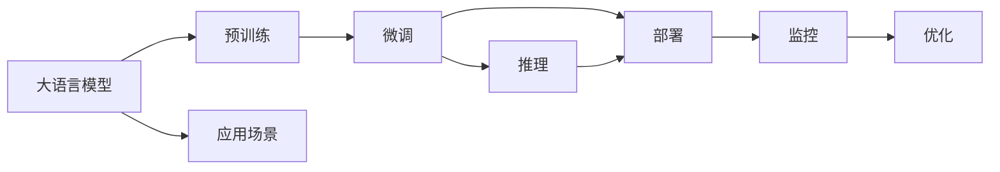

                 

# LLM生态系统:从0到1的神奇旅程

> 关键词：LLM生态系统, 大模型, 预训练, 微调, 模型推理, 模型部署, 模型监控, 模型优化, 实际应用, 持续学习

## 1. 背景介绍

### 1.1 问题由来
随着深度学习技术的飞速发展，大语言模型（Large Language Model, LLM）已经成为人工智能领域的一个热门话题。LLM是一类通过在海量无标签文本数据上进行自监督预训练，能够理解和生成自然语言的大型神经网络模型。自2018年BERT问世以来，LLM在各种NLP任务中取得了前所未有的优异表现，被广泛应用在信息检索、问答系统、机器翻译、情感分析等场景中。

### 1.2 问题核心关键点
大语言模型LLM的强大能力源于其复杂的结构和庞大的参数，但预训练和微调是其实现高性能的关键。预训练是指在大型无标签数据集上训练模型，通过自监督学习任务学习通用的语言知识。微调则是指在有标签数据集上，进一步优化模型以适应特定的下游任务。

预训练和微调是LLM的两个重要阶段，两者相互配合，共同构成了LLM的生态系统。预训练获取了通用的语言知识和表示，而微调则将模型适应特定的任务，两者相辅相成，大大提升了LLM的性能和应用效果。

## 2. 核心概念与联系

### 2.1 核心概念概述

为了更好地理解LLM的预训练和微调，我们需要先明确几个核心概念：

- **大语言模型**：通过自监督学习在无标签数据上进行预训练，从而能够理解和生成自然语言的语言模型。如BERT、GPT-3、XLNet等。
- **预训练**：在大型无标签数据集上进行自监督学习，学习通用的语言知识，提升模型泛化能力。
- **微调**：在有标签数据集上，通过监督学习进一步优化模型，使其适应特定下游任务，提高模型在任务上的准确性。
- **推理**：将模型应用于实际任务中，进行语言生成或分类等。
- **部署**：将模型集成到实际应用系统中，进行高性能计算和存储。
- **监控**：对模型进行性能评估和错误监测，保证模型的稳定性和可靠性。
- **优化**：通过改进模型结构、优化超参数、提高训练效率等手段，提升模型性能。
- **应用场景**：LLM在信息检索、问答系统、机器翻译、情感分析等众多领域有着广泛的应用。

这些概念之间的联系紧密，共同构成了LLM生态系统的完整框架。以下是一个简化的Mermaid流程图，展示了这些核心概念之间的关系：



这个流程图展示了LLM生态系统的核心组成和流程，预训练和微调是LLM生态系统的两个重要组成部分，推理和部署则是将模型应用于实际场景的过程，监控和优化则是保证模型稳定性和性能的关键。

## 3. 核心算法原理 & 具体操作步骤
### 3.1 算法原理概述

预训练和微调的原理基于神经网络模型和优化算法，其核心思想是通过大量的数据和计算资源，逐步提高模型对自然语言的理解和生成能力。

- **预训练**：在大型无标签数据集上，通过自监督学习任务（如掩码语言模型、下一句预测等）训练模型，获取通用的语言知识。
- **微调**：在有标签数据集上，通过监督学习任务（如分类、生成等）进一步优化模型，使其适应特定的下游任务。

### 3.2 算法步骤详解

#### 预训练步骤：

1. **数据准备**：收集和清洗大型无标签文本数据集，如维基百科、新闻语料库等。
2. **模型初始化**：选择或设计一个合适的网络结构，如Transformer、BERT等，进行随机初始化。
3. **训练循环**：通过优化算法（如Adam、SGD等），在数据集上反复迭代训练，更新模型参数。
4. **模型保存**：保存训练好的模型，以备后续微调使用。

#### 微调步骤：

1. **数据准备**：收集和清洗下游任务的标注数据集，如问答数据、分类数据等。
2. **模型加载**：加载预训练模型，作为微调模型的初始参数。
3. **任务适配**：添加或修改模型的输出层和损失函数，适应特定的下游任务。
4. **训练循环**：通过优化算法和正则化技术（如权重衰减、Dropout等），在有标签数据集上反复迭代训练，更新模型参数。
5. **模型评估**：在验证集和测试集上评估模型性能，选择最优参数。
6. **模型保存**：保存微调后的模型，以备实际应用。

### 3.3 算法优缺点

#### 优点：

- **高效性**：预训练和微调过程可以并行执行，大大加速了模型训练的效率。
- **泛化能力**：预训练和微调使得模型具备强大的泛化能力，可以在各种NLP任务中取得优异性能。
- **可解释性**：通过预训练和微调，模型能够更好地理解自然语言，提高输出的可解释性。

#### 缺点：

- **资源消耗**：预训练和微调需要大量的计算资源和时间，对硬件要求较高。
- **过拟合风险**：微调时容易过拟合，需要引入正则化技术来避免。
- **模型复杂性**：模型的复杂性增加了模型部署和推理的难度。

### 3.4 算法应用领域

LLM的预训练和微调在NLP领域得到了广泛应用，包括：

- 文本分类：如情感分析、主题分类、意图识别等。
- 命名实体识别：识别文本中的人名、地名、机构名等特定实体。
- 关系抽取：从文本中抽取实体之间的语义关系。
- 问答系统：对自然语言问题给出答案。
- 机器翻译：将源语言文本翻译成目标语言。
- 文本摘要：将长文本压缩成简短摘要。
- 对话系统：使机器能够与人自然对话。
- 代码生成：生成符合规范的代码片段。
- 数据增强：通过改写和翻译，丰富训练数据集。

## 4. 数学模型和公式 & 详细讲解 & 举例说明

### 4.1 数学模型构建

预训练和微调的数学模型构建通常基于深度神经网络，其中BERT模型的构建具有代表性。BERT模型通过两个任务进行预训练：掩码语言模型（Masked Language Model, MLM）和下一句预测（Next Sentence Prediction, NSP）。

掩码语言模型任务为：给定一段文本，随机掩盖一些词语，要求模型预测被掩盖的词语。其损失函数为：
$$
L_{MLM} = -\frac{1}{n}\sum_{i=1}^n \log p(x_i|x_1,\cdots,x_n)
$$

下一句预测任务为：给定一对句子，判断它们是否连续。其损失函数为：
$$
L_{NSP} = -\frac{1}{2n}\sum_{i=1}^n \log p(x_{i+1}|x_i)
$$

其中 $p(x_i|x_1,\cdots,x_n)$ 为模型在输入文本 $x_1,\cdots,x_n$ 上的条件概率，通过前向传播计算得到。

### 4.2 公式推导过程

以掩码语言模型为例，其前向传播过程如下：

1. **输入编码**：将输入文本 $x_1,\cdots,x_n$ 编码成向量 $X$。
2. **掩盖操作**：随机掩盖一些词语，生成掩码序列 $M$。
3. **预测掩盖词语**：在掩盖词语位置 $i$ 处，通过编码器生成向量 $H_i$，使用softmax层计算掩盖词语的条件概率。
4. **计算损失**：计算掩码位置 $i$ 处的损失 $L_i = -\log p(x_i|x_1,\cdots,x_n)$，最终损失函数 $L_{MLM}$ 为：
$$
L_{MLM} = -\frac{1}{n}\sum_{i=1}^n L_i
$$

### 4.3 案例分析与讲解

以BERT模型在问答系统中的应用为例：

1. **任务适配**：在微调时，选择或设计一个适当的输出层，如全连接层，并将其与预训练模型连接。
2. **损失函数**：设计适当的损失函数，如交叉熵损失，用于评估模型在特定任务上的性能。
3. **训练**：在标注数据集上进行训练，调整模型参数以最小化损失函数。
4. **评估**：在验证集和测试集上评估模型性能，选择最优模型参数。
5. **应用**：将微调后的模型集成到问答系统中，用于处理用户输入的问题，生成答案。

## 5. 项目实践：代码实例和详细解释说明

### 5.1 开发环境搭建

为了进行预训练和微调，需要搭建一个高性能的开发环境。以下是使用Python和PyTorch进行预训练和微调的开发环境配置流程：

1. **安装Anaconda**：从官网下载并安装Anaconda，用于创建独立的Python环境。
2. **创建虚拟环境**：使用Anaconda创建Python虚拟环境，如：
```bash
conda create -n pytorch-env python=3.8
conda activate pytorch-env
```
3. **安装PyTorch**：安装PyTorch及其依赖库，如：
```bash
conda install pytorch torchvision torchaudio cudatoolkit=11.1 -c pytorch -c conda-forge
```
4. **安装其他工具**：安装TensorBoard、Weights & Biases等可视化工具，以及必要的库，如：
```bash
pip install numpy pandas scikit-learn matplotlib tqdm jupyter notebook ipython
```

完成上述步骤后，即可在`pytorch-env`环境中开始预训练和微调实践。

### 5.2 源代码详细实现

以下是一个简单的预训练和微调的代码实现示例，以BERT模型为例：

```python
import torch
import torch.nn as nn
import torch.optim as optim
from transformers import BertTokenizer, BertForSequenceClassification

# 初始化预训练模型
tokenizer = BertTokenizer.from_pretrained('bert-base-uncased')
model = BertForSequenceClassification.from_pretrained('bert-base-uncased', num_labels=2)

# 加载训练数据
train_data = ...
dev_data = ...
test_data = ...

# 定义损失函数和优化器
criterion = nn.CrossEntropyLoss()
optimizer = optim.Adam(model.parameters(), lr=2e-5)

# 预训练和微调过程
def train_step(model, data, optimizer, criterion):
    model.train()
    inputs = tokenizer(data, return_tensors='pt')
    outputs = model(**inputs)
    loss = criterion(outputs.logits, data.labels)
    optimizer.zero_grad()
    loss.backward()
    optimizer.step()
    return loss.item()

def evaluate(model, data, criterion):
    model.eval()
    inputs = tokenizer(data, return_tensors='pt')
    outputs = model(**inputs)
    predictions = outputs.logits.argmax(dim=1)
    labels = data.labels
    return criterion(predictions, labels).item()

# 预训练过程
for epoch in range(10):
    for batch in train_data:
        loss = train_step(model, batch, optimizer, criterion)
        print(f'Epoch {epoch+1}, loss: {loss:.4f}')

# 微调过程
for epoch in range(10):
    for batch in train_data:
        loss = train_step(model, batch, optimizer, criterion)
        dev_loss = evaluate(model, dev_data, criterion)
        test_loss = evaluate(model, test_data, criterion)
        print(f'Epoch {epoch+1}, dev loss: {dev_loss:.4f}, test loss: {test_loss:.4f}')
```

### 5.3 代码解读与分析

**预训练过程**：
1. **初始化预训练模型**：通过Transformers库加载预训练的BERT模型，并指定输出层和标签数量。
2. **加载训练数据**：加载训练数据集，并将其转换为Tensor形式。
3. **定义损失函数和优化器**：选择适当的损失函数和优化器。
4. **训练循环**：在训练数据集上进行多轮迭代训练，调整模型参数。

**微调过程**：
1. **任务适配**：定义适当的输出层和损失函数，适配微调任务。
2. **训练循环**：在训练数据集上进行多轮迭代训练，调整模型参数。
3. **评估过程**：在验证集和测试集上进行评估，选择最优模型参数。

## 6. 实际应用场景

### 6.1 智能客服系统

智能客服系统通过预训练和微调技术，可以实现高效、智能的客户服务。预训练模型可以理解自然语言，而微调模型可以适应特定的客服场景。智能客服系统可以7x24小时不间断服务，快速响应客户咨询，提供自然流畅的对话。

### 6.2 金融舆情监测

金融领域需要实时监测市场舆论动向，避免负面信息传播。预训练和微调技术可以用于文本分类和情感分析，识别负面信息，提供风险预警。

### 6.3 个性化推荐系统

推荐系统通过预训练和微调技术，可以理解用户的兴趣和偏好。预训练模型可以获取通用的语言表示，微调模型可以适应特定的推荐任务。推荐系统可以根据用户的浏览、点击、评论等行为数据，生成个性化的推荐内容。

### 6.4 未来应用展望

随着预训练和微调技术的不断发展，未来将在更多领域得到应用，为传统行业带来变革性影响。

- **智慧医疗**：预训练和微调技术可以用于医疗问答、病历分析、药物研发等，提升医疗服务的智能化水平。
- **智能教育**：微调技术可以用于作业批改、学情分析、知识推荐等，因材施教，促进教育公平。
- **智慧城市**：微调技术可以用于城市事件监测、舆情分析、应急指挥等，提高城市管理的自动化和智能化水平。

## 7. 工具和资源推荐

### 7.1 学习资源推荐

为了帮助开发者系统掌握预训练和微调技术，以下是一些优质的学习资源：

1. **《Transformer from Scratch》**：详细介绍了Transformer模型和预训练技术的原理和实现。
2. **《Practical Deep Learning for NLP》**：介绍了如何使用PyTorch和TensorFlow进行NLP任务开发。
3. **《Hugging Face官方文档》**：提供了丰富的预训练模型和微调样例，是预训练和微调开发的必备资源。
4. **《OpenAI Codex》**：提供了大量的预训练和微调案例，助力开发者进行实践学习。

### 7.2 开发工具推荐

预训练和微调过程需要高性能的开发环境，以下是一些常用的工具：

1. **PyTorch**：基于Python的开源深度学习框架，适合预训练和微调任务。
2. **TensorFlow**：Google主导的深度学习框架，适合大规模工程应用。
3. **Transformers库**：Hugging Face开发的NLP工具库，提供了丰富的预训练模型和微调API。
4. **TensorBoard**：TensorFlow配套的可视化工具，可以实时监测模型训练状态。
5. **Weights & Biases**：模型训练的实验跟踪工具，记录和可视化模型训练过程中的各项指标。

### 7.3 相关论文推荐

以下是一些奠基性的相关论文，推荐阅读：

1. **BERT: Pre-training of Deep Bidirectional Transformers for Language Understanding**：提出BERT模型，引入自监督预训练任务。
2. **GPT-3: Language Models are Unsupervised Multitask Learners**：展示了大规模语言模型的零样本学习能力。
3. **RoBERTa: A Robustly Optimized BERT Pretraining Approach**：提出RoBERTa模型，改进预训练任务。
4. **Parameter-Efficient Transfer Learning for NLP**：提出Adapter等参数高效微调方法，减小微调对参数量的依赖。
5. **Unsupervised Learning of Visual Representations by Contrastive Predictive Coding**：提出对比预测编码方法，提升模型的预训练效果。

## 8. 总结：未来发展趋势与挑战

### 8.1 研究成果总结

本文介绍了预训练和微调技术的核心概念和实现方法，并展示了其在NLP领域的广泛应用。预训练和微调技术通过强大的深度学习模型和大规模数据集训练，提高了自然语言理解和生成能力，加速了NLP技术的产业化进程。

### 8.2 未来发展趋势

预训练和微调技术将在未来呈现出以下几个发展趋势：

- **模型规模不断增大**：随着算力成本的下降和数据规模的扩张，预训练模型的参数量将不断增大，提升模型的泛化能力和性能。
- **多模态预训练和微调**：预训练和微调技术将逐步拓展到图像、视频、语音等多模态数据，提升模型的综合能力。
- **自监督和半监督学习**：未来将更多地利用自监督和半监督学习范式，降低对标注数据的依赖，提升模型的泛化能力和鲁棒性。
- **少样本和零样本学习**：通过提示学习等方法，预训练和微调模型将具备更强的少样本和零样本学习能力，提升模型的灵活性和适应性。

### 8.3 面临的挑战

尽管预训练和微调技术取得了显著进展，但仍面临以下挑战：

- **标注成本高**：预训练和微调模型对标注数据的需求较高，特别是在长尾应用场景下，获取高质量标注数据成本较高。
- **模型鲁棒性不足**：预训练和微调模型面对域外数据时，泛化性能可能较差，容易出现过拟合和灾难性遗忘。
- **推理效率低**：大规模预训练模型推理速度较慢，资源消耗较大，需要进一步优化推理效率。
- **可解释性差**：预训练和微调模型的决策过程缺乏可解释性，难以理解和调试。
- **安全性问题**：预训练和微调模型可能学习到有害信息，输出结果可能存在安全隐患。

### 8.4 研究展望

未来预训练和微调技术需要在以下几个方面寻求新的突破：

- **少样本和零样本学习**：开发更多少样本和零样本学习方法，提升模型的灵活性和泛化能力。
- **多模态融合**：将图像、视频、语音等多模态信息与文本信息进行融合，提升模型的综合能力。
- **因果推理**：引入因果推理方法，提升模型的因果关系建立能力和可解释性。
- **伦理和安全性**：在模型训练和推理过程中，引入伦理和安全性的约束，确保模型输出的安全性。

## 9. 附录：常见问题与解答

**Q1：预训练和微调是否适用于所有NLP任务？**

A：预训练和微调技术在大多数NLP任务上都能取得不错的效果，特别是对于数据量较小的任务。但对于一些特定领域的任务，如医学、法律等，可能需要进一步预训练和微调以适应。

**Q2：如何选择预训练和微调模型？**

A：选择预训练和微调模型需要考虑任务的复杂度和数据量。对于简单任务，选择较小的模型即可。对于复杂任务，选择较大的模型可以更好地适应。同时，可以考虑使用预训练模型进行迁移学习，以减少微调数据需求。

**Q3：预训练和微调过程中如何避免过拟合？**

A：避免过拟合可以采用以下方法：
1. **数据增强**：通过回译、近义替换等方式扩充训练集。
2. **正则化**：使用L2正则、Dropout等正则化技术。
3. **对抗训练**：引入对抗样本，提高模型的鲁棒性。
4. **参数高效微调**：只调整少量任务相关参数，减小过拟合风险。

**Q4：如何部署预训练和微调模型？**

A：部署预训练和微调模型需要考虑以下因素：
1. **模型裁剪**：去除不必要的层和参数，减小模型尺寸，提高推理速度。
2. **量化加速**：将浮点模型转为定点模型，压缩存储空间，提高计算效率。
3. **服务化封装**：将模型封装为标准化服务接口，便于集成调用。
4. **弹性伸缩**：根据请求流量动态调整资源配置，平衡服务质量和成本。
5. **监控告警**：实时采集系统指标，设置异常告警阈值，确保服务稳定性。

**Q5：预训练和微调模型在落地部署时需要注意哪些问题？**

A：预训练和微调模型在落地部署时需要注意以下问题：
1. **模型优化**：通过剪枝、量化等方法，优化模型的推理效率和资源占用。
2. **模型监控**：实时监控模型的性能和稳定性，及时发现并解决问题。
3. **模型更新**：定期更新模型参数，保证模型的时效性和稳定性。

---

作者：禅与计算机程序设计艺术 / Zen and the Art of Computer Programming

