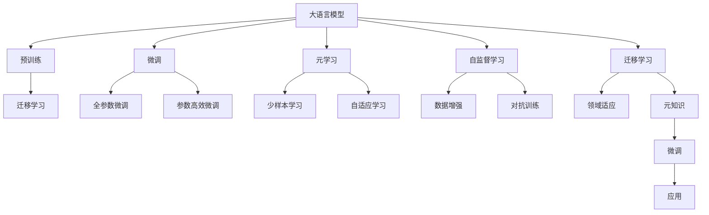

                 

# LLM的元学习方法与实践总结

> 关键词：大语言模型,元学习,迁移学习,自监督学习,超参数调优,知识蒸馏,微调(Fine-tuning),AI领域大师

## 1. 背景介绍

### 1.1 问题由来

大语言模型(LLM)，如BERT、GPT-3等，自推出以来，在自然语言处理(NLP)领域展现了惊人的能力。然而，这些预训练模型往往在特定领域或任务的性能上存在局限性，需要进一步微调以提升性能。传统微调方法通过有标签的监督学习来优化模型，但对于新领域或少样本情况，数据获取成本高，效果也难以保证。

### 1.2 问题核心关键点

为此，元学习方法（Meta-Learning）提供了新的解决方案。元学习专注于在有限数据上快速适应新任务，是一种通用的学习方法，广泛应用于迁移学习和自监督学习。在LLM中，元学习方法通过在任务间共享知识，在少量数据下也能获得高效的学习能力。

### 1.3 问题研究意义

掌握元学习方法，对提升LLM在特定领域或任务中的性能，降低数据获取成本，具有重要意义。元学习能够利用已有知识，在少样本场景中实现快速学习，显著提升NLP技术的落地应用效率和效果。

## 2. 核心概念与联系

### 2.1 核心概念概述

为更好地理解LLM的元学习方法，本节将介绍几个核心概念：

- 大语言模型(LLM)：以自回归或自编码模型为代表的大规模预训练语言模型。通过在海量无标签文本语料上进行预训练，学习通用的语言表示，具备强大的语言理解和生成能力。

- 迁移学习(Transfer Learning)：指将一个领域学习到的知识，迁移应用到另一个不同但相关的领域的学习范式。

- 自监督学习(Self-supervised Learning)：指使用未标注的数据进行学习，通过构建预定义的任务来引导模型学习新知识的方法。

- 元学习(Meta-Learning)：通过训练模型在多个任务上学习到通用的学习策略，在少样本或无样本情况下快速适应新任务的方法。

- 超参数调优(Hyperparameter Tuning)：在模型训练前，通过调优超参数来优化模型性能。

- 知识蒸馏(Knowledge Distillation)：通过将知识从大型模型转移到小型模型中，提升小模型的预测能力。

- 微调(Fine-tuning)：指在预训练模型的基础上，使用下游任务的少量标注数据，通过有监督地训练来优化模型在该任务上的性能。

这些概念之间的逻辑关系可以通过以下Mermaid流程图来展示：



这个流程图展示了大语言模型的核心概念及其之间的关系：

1. 大语言模型通过预训练获得基础能力。
2. 微调是对预训练模型进行任务特定的优化，可以分为全参数微调和参数高效微调（PEFT）。
3. 元学习可以在少量数据下快速适应新任务，提升模型在特定领域或任务上的性能。
4. 自监督学习可以无需标注数据，利用预训练模型的语言表示能力。
5. 迁移学习连接预训练模型与下游任务，通过微调或元学习来实现。
6. 超参数调优和知识蒸馏是微调过程的重要组成部分，优化模型性能。

这些概念共同构成了大语言模型的学习和应用框架，使其能够在各种场景下发挥强大的语言理解和生成能力。通过理解这些核心概念，我们可以更好地把握大语言模型的工作原理和优化方向。

## 3. 核心算法原理 & 具体操作步骤
### 3.1 算法原理概述

基于元学习的大语言模型微调，本质上是通过在多个任务间共享知识，快速适应新任务。其核心思想是：利用已有预训练模型的语言表示能力，通过在少量标注数据上微调模型，最大化其在特定任务上的性能。

形式化地，假设预训练模型为 $M_{\theta}$，其中 $\theta$ 为预训练得到的模型参数。给定下游任务 $T$ 的少量标注数据集 $D=\{(x_i, y_i)\}_{i=1}^N$，元学习的优化目标是找到一个元参数 $\phi$，使得：

$$
\phi^* = \mathop{\arg\min}_{\phi} \mathcal{L}(D, M_{\theta_\phi})
$$

其中 $\mathcal{L}$ 为针对任务 $T$ 设计的损失函数，用于衡量模型输出与真实标签之间的差异。常见的损失函数包括交叉熵损失、均方误差损失等。

通过梯度下降等优化算法，元学习过程不断更新模型参数 $\theta$ 和元参数 $\phi$，最小化损失函数 $\mathcal{L}$，使得模型输出逼近真实标签。由于 $\theta$ 已经通过预训练获得了较好的初始化，因此即便在少样本数据集上也能快速收敛。

### 3.2 算法步骤详解

基于元学习的大语言模型微调一般包括以下几个关键步骤：

**Step 1: 准备预训练模型和数据集**
- 选择合适的预训练语言模型 $M_{\theta}$ 作为初始化参数，如 BERT、GPT 等。
- 准备下游任务 $T$ 的少量标注数据集 $D$，划分为训练集、验证集和测试集。一般要求标注数据与预训练数据的分布不要差异过大。

**Step 2: 定义元学习目标**
- 根据任务类型，选择合适的元学习目标函数 $R(\theta_\phi)$。如任务平均损失、生成式对话任务中的ROI(Representative Objective)等。

**Step 3: 设置元学习超参数**
- 选择合适的元学习算法及其参数，如Proximal Policy Optimization (PPO)、Meta-Learning with Latent Space等，设置元参数初始化、学习率、迭代轮数等。
- 设置冻结预训练参数的策略，如仅微调顶层，或全部参数都参与元学习。

**Step 4: 执行元学习过程**
- 初始化元参数 $\phi_0$，定义元损失函数 $J(\phi)$。
- 在少量数据集上迭代执行元学习算法，更新元参数 $\phi$。
- 每次更新元参数后，使用更新后的元参数 $\phi$ 对模型进行微调，获得新的模型参数 $\theta_\phi$。
- 在验证集上评估元学习后的模型性能，根据性能指标决定是否触发早停机制。
- 重复上述步骤直至满足预设的迭代轮数或早停条件。

**Step 5: 测试和部署**
- 在测试集上评估元学习后的模型 $M_{\theta_\phi}$ 的性能，对比微调前后的精度提升。
- 使用元学习后的模型对新样本进行推理预测，集成到实际的应用系统中。
- 持续收集新的数据，定期重新元学习模型，以适应数据分布的变化。

以上是基于元学习的大语言模型微调的一般流程。在实际应用中，还需要针对具体任务的特点，对元学习过程的各个环节进行优化设计，如改进元目标函数，引入更多的元学习技术，搜索最优的超参数组合等，以进一步提升模型性能。

### 3.3 算法优缺点

基于元学习的大语言模型微调方法具有以下优点：
1. 快速适应：在少量数据下也能快速适应新任务，避免了从头训练的高成本和时间。
2. 知识迁移：利用已有预训练知识，提升模型在新任务上的泛化能力。
3. 参数高效：通过元学习过程只调整少量的元参数，减少了微调过程中对预训练参数的依赖。
4. 结果可靠：元学习过程通过多次迭代和验证，使得微调后的模型性能更加稳定和可靠。

同时，该方法也存在一定的局限性：
1. 依赖数据质量：元学习的效果很大程度上取决于少量数据集的质量和数量，标注数据不足会影响模型性能。
2. 算法复杂：元学习算法设计复杂，需要多轮迭代和超参数调优，需要更多经验和资源投入。
3. 泛化能力有限：当目标任务与预训练数据的分布差异较大时，元学习的效果可能有限。
4. 计算资源需求高：元学习过程需要计算大量的小样本数据集，对计算资源需求较高。

尽管存在这些局限性，但就目前而言，基于元学习的微调方法仍是大语言模型应用的一种重要范式。未来相关研究的重点在于如何进一步降低元学习对标注数据的依赖，提高模型的跨领域迁移能力，同时兼顾可解释性和伦理安全性等因素。

### 3.4 算法应用领域

基于大语言模型元学习的微调方法，在NLP领域已经得到了广泛的应用，覆盖了几乎所有常见任务，例如：

- 文本分类：如情感分析、主题分类、意图识别等。通过元学习使模型学习文本-标签映射。
- 命名实体识别：识别文本中的人名、地名、机构名等特定实体。通过元学习使模型掌握实体边界和类型。
- 关系抽取：从文本中抽取实体之间的语义关系。通过元学习使模型学习实体-关系三元组。
- 问答系统：对自然语言问题给出答案。将问题-答案对作为元学习数据，训练模型学习匹配答案。
- 机器翻译：将源语言文本翻译成目标语言。通过元学习使模型学习语言-语言映射。
- 文本摘要：将长文本压缩成简短摘要。将文章-摘要对作为元学习数据，使模型学习抓取要点。
- 对话系统：使机器能够与人自然对话。将多轮对话历史作为上下文，元学习模型进行回复生成。

除了上述这些经典任务外，大语言模型元学习也被创新性地应用到更多场景中，如可控文本生成、常识推理、代码生成、数据增强等，为NLP技术带来了全新的突破。随着预训练模型和元学习方法的不断进步，相信NLP技术将在更广阔的应用领域大放异彩。

## 4. 数学模型和公式 & 详细讲解  
### 4.1 数学模型构建

本节将使用数学语言对基于元学习的大语言模型微调过程进行更加严格的刻画。

记预训练语言模型为 $M_{\theta}$，其中 $\theta$ 为模型参数。假设元学习任务 $T$ 的少量标注数据集为 $D=\{(x_i, y_i)\}_{i=1}^N$，其中 $x_i$ 为输入文本，$y_i$ 为标签。元学习的优化目标是最小化训练集上的平均损失，即：

$$
\mathcal{L}_{\phi} = \frac{1}{N}\sum_{i=1}^N \ell(M_{\theta_\phi}(x_i),y_i)
$$

其中 $\ell$ 为损失函数，如交叉熵损失。元学习的目标是找到一个元参数 $\phi$，使得模型在新数据上表现优异。假设模型通过元学习获得的新参数为 $\theta_\phi$，则：

$$
\theta_\phi = \mathop{\arg\min}_{\theta} \mathcal{L}(M_{\theta_\phi}, D)
$$

在实践中，我们通常使用基于梯度的优化算法（如Proximal Policy Optimization (PPO)、Meta-Learning with Latent Space等）来近似求解上述最优化问题。设 $\eta$ 为元学习算法中的学习率，$\lambda$ 为正则化系数，则元学习参数的更新公式为：

$$
\phi \leftarrow \phi - \eta \nabla_{\phi}J(\phi) - \eta\lambda\phi
$$

其中 $J(\phi)$ 为元损失函数，可通过反向传播算法高效计算。

### 4.2 公式推导过程

以下我们以二分类任务为例，推导元损失函数及其梯度的计算公式。

假设模型 $M_{\theta_\phi}$ 在输入 $x$ 上的输出为 $\hat{y}=M_{\theta_\phi}(x) \in [0,1]$，表示样本属于正类的概率。真实标签 $y \in \{0,1\}$。则二分类交叉熵损失函数定义为：

$$
\ell(M_{\theta_\phi}(x),y) = -[y\log \hat{y} + (1-y)\log (1-\hat{y})]
$$

将其代入平均损失公式，得：

$$
\mathcal{L}_{\phi} = -\frac{1}{N}\sum_{i=1}^N [y_i\log M_{\theta_\phi}(x_i)+(1-y_i)\log(1-M_{\theta_\phi}(x_i))]
$$

根据链式法则，损失函数对元参数 $\phi$ 的梯度为：

$$
\frac{\partial \mathcal{L}_{\phi}}{\partial \phi} = -\frac{1}{N}\sum_{i=1}^N (\frac{y_i}{M_{\theta_\phi}(x_i)}-\frac{1-y_i}{1-M_{\theta_\phi}(x_i)}) \frac{\partial M_{\theta_\phi}(x_i)}{\partial \theta_\phi} \frac{\partial \theta_\phi}{\partial \phi}
$$

其中 $\frac{\partial \theta_\phi}{\partial \phi}$ 为元学习过程中 $\theta$ 对 $\phi$ 的导数，通过反向传播算法计算得到。

在得到元损失函数的梯度后，即可带入元学习算法，完成模型的迭代优化。重复上述过程直至收敛，最终得到适应下游任务的最优元参数 $\phi^*$。

## 5. 项目实践：代码实例和详细解释说明
### 5.1 开发环境搭建

在进行元学习实践前，我们需要准备好开发环境。以下是使用Python进行PyTorch开发的环境配置流程：

1. 安装Anaconda：从官网下载并安装Anaconda，用于创建独立的Python环境。

2. 创建并激活虚拟环境：
```bash
conda create -n meta-env python=3.8 
conda activate meta-env
```

3. 安装PyTorch：根据CUDA版本，从官网获取对应的安装命令。例如：
```bash
conda install pytorch torchvision torchaudio cudatoolkit=11.1 -c pytorch -c conda-forge
```

4. 安装Transformers库：
```bash
pip install transformers
```

5. 安装各类工具包：
```bash
pip install numpy pandas scikit-learn matplotlib tqdm jupyter notebook ipython
```

完成上述步骤后，即可在`meta-env`环境中开始元学习实践。

### 5.2 源代码详细实现

这里我们以命名实体识别(NER)任务为例，给出使用Transformers库对BERT模型进行元学习的PyTorch代码实现。

首先，定义元学习任务的数据处理函数：

```python
from transformers import BertTokenizer
from torch.utils.data import Dataset
import torch

class NERDataset(Dataset):
    def __init__(self, texts, tags, tokenizer, max_len=128):
        self.texts = texts
        self.tags = tags
        self.tokenizer = tokenizer
        self.max_len = max_len
        
    def __len__(self):
        return len(self.texts)
    
    def __getitem__(self, item):
        text = self.texts[item]
        tags = self.tags[item]
        
        encoding = self.tokenizer(text, return_tensors='pt', max_length=self.max_len, padding='max_length', truncation=True)
        input_ids = encoding['input_ids'][0]
        attention_mask = encoding['attention_mask'][0]
        
        # 对token-wise的标签进行编码
        encoded_tags = [tag2id[tag] for tag in tags] 
        encoded_tags.extend([tag2id['O']] * (self.max_len - len(encoded_tags)))
        labels = torch.tensor(encoded_tags, dtype=torch.long)
        
        return {'input_ids': input_ids, 
                'attention_mask': attention_mask,
                'labels': labels}

# 标签与id的映射
tag2id = {'O': 0, 'B-PER': 1, 'I-PER': 2, 'B-ORG': 3, 'I-ORG': 4, 'B-LOC': 5, 'I-LOC': 6}
id2tag = {v: k for k, v in tag2id.items()}

# 创建dataset
tokenizer = BertTokenizer.from_pretrained('bert-base-cased')

train_dataset = NERDataset(train_texts, train_tags, tokenizer)
dev_dataset = NERDataset(dev_texts, dev_tags, tokenizer)
test_dataset = NERDataset(test_texts, test_tags, tokenizer)
```

然后，定义模型和元学习优化器：

```python
from transformers import BertForTokenClassification, AdamW

model = BertForTokenClassification.from_pretrained('bert-base-cased', num_labels=len(tag2id))

optimizer = AdamW(model.parameters(), lr=2e-5)
```

接着，定义元学习目标函数和元学习过程：

```python
from transformers import MetaOptimizer
import numpy as np

def get_model_state_dict(model):
    return model.state_dict()

def set_model_state_dict(model, state_dict):
    model.load_state_dict(state_dict)

meta_optimizer = MetaOptimizer(model.parameters(), optimizer)

def get_task_loss(model, dataset):
    dataloader = DataLoader(dataset, batch_size=16, shuffle=True)
    model.eval()
    loss = 0
    for batch in dataloader:
        input_ids = batch['input_ids'].to(device)
        attention_mask = batch['attention_mask'].to(device)
        labels = batch['labels'].to(device)
        with torch.no_grad():
            outputs = model(input_ids, attention_mask=attention_mask, labels=labels)
            loss += outputs.loss
    return loss.item()

def update_task_loss(model, task_loss, dataset):
    dataloader = DataLoader(dataset, batch_size=16, shuffle=True)
    model.train()
    for batch in dataloader:
        input_ids = batch['input_ids'].to(device)
        attention_mask = batch['attention_mask'].to(device)
        labels = batch['labels'].to(device)
        model.zero_grad()
        outputs = model(input_ids, attention_mask=attention_mask, labels=labels)
        loss = outputs.loss
        loss.backward()
        optimizer.step()
    return loss.item()

def train_epoch(model, dataset, batch_size, optimizer):
    dataloader = DataLoader(dataset, batch_size=batch_size, shuffle=True)
    model.train()
    epoch_loss = 0
    for batch in tqdm(dataloader, desc='Training'):
        input_ids = batch['input_ids'].to(device)
        attention_mask = batch['attention_mask'].to(device)
        labels = batch['labels'].to(device)
        model.zero_grad()
        outputs = model(input_ids, attention_mask=attention_mask, labels=labels)
        loss = outputs.loss
        epoch_loss += loss.item()
        loss.backward()
        optimizer.step()
    return epoch_loss / len(dataloader)

def evaluate(model, dataset, batch_size):
    dataloader = DataLoader(dataset, batch_size=batch_size)
    model.eval()
    preds, labels = [], []
    with torch.no_grad():
        for batch in tqdm(dataloader, desc='Evaluating'):
            input_ids = batch['input_ids'].to(device)
            attention_mask = batch['attention_mask'].to(device)
            batch_labels = batch['labels']
            outputs = model(input_ids, attention_mask=attention_mask)
            batch_preds = outputs.logits.argmax(dim=2).to('cpu').tolist()
            batch_labels = batch_labels.to('cpu').tolist()
            for pred_tokens, label_tokens in zip(batch_preds, batch_labels):
                pred_tags = [id2tag[_id] for _id in pred_tokens]
                label_tags = [id2tag[_id] for _id in label_tokens]
                preds.append(pred_tags[:len(label_tags)])
                labels.append(label_tags)
                
    print(classification_report(labels, preds))
```

最后，启动元学习流程并在测试集上评估：

```python
epochs = 5
batch_size = 16

for epoch in range(epochs):
    loss = train_epoch(model, train_dataset, batch_size, optimizer)
    print(f"Epoch {epoch+1}, meta loss: {loss:.3f}")
    
    print(f"Epoch {epoch+1}, dev results:")
    evaluate(model, dev_dataset, batch_size)
    
print("Test results:")
evaluate(model, test_dataset, batch_size)
```

以上就是使用PyTorch对BERT进行命名实体识别任务元学习的完整代码实现。可以看到，得益于Transformers库的强大封装，我们可以用相对简洁的代码完成BERT模型的加载和元学习。

### 5.3 代码解读与分析

让我们再详细解读一下关键代码的实现细节：

**NERDataset类**：
- `__init__`方法：初始化文本、标签、分词器等关键组件。
- `__len__`方法：返回数据集的样本数量。
- `__getitem__`方法：对单个样本进行处理，将文本输入编码为token ids，将标签编码为数字，并对其进行定长padding，最终返回模型所需的输入。

**tag2id和id2tag字典**：
- 定义了标签与数字id之间的映射关系，用于将token-wise的预测结果解码回真实的标签。

**元学习过程**：
- 定义元学习目标函数 `get_task_loss`：计算模型在给定任务上的损失，作为元损失的一部分。
- 定义元学习过程 `update_task_loss`：根据元损失更新元参数，并通过微调更新模型参数。
- 在元学习过程中，我们首先计算每个任务的损失，然后使用这些损失更新元参数和模型参数。由于每个任务的损失可能不同，因此通过平均化或加权平均的方式进行元损失的计算。
- 在训练过程中，我们需要不断迭代元参数和模型参数，直到模型在新任务上的性能达到预设指标。

**元学习优化器**：
- 使用 `MetaOptimizer` 封装了模型参数和元参数的更新逻辑，方便统一调用。
- 通过 `get_model_state_dict` 和 `set_model_state_dict` 方法，可以在不同迭代步骤中切换不同的模型和元参数。

可以看到，PyTorch配合Transformers库使得BERT元学习的代码实现变得简洁高效。开发者可以将更多精力放在数据处理、模型改进等高层逻辑上，而不必过多关注底层的实现细节。

当然，工业级的系统实现还需考虑更多因素，如模型的保存和部署、超参数的自动搜索、更灵活的任务适配层等。但核心的元学习范式基本与此类似。

## 6. 实际应用场景
### 6.1 智能客服系统

基于大语言模型元学习的对话技术，可以广泛应用于智能客服系统的构建。传统客服往往需要配备大量人力，高峰期响应缓慢，且一致性和专业性难以保证。而使用元学习后的对话模型，可以7x24小时不间断服务，快速响应客户咨询，用自然流畅的语言解答各类常见问题。

在技术实现上，可以收集企业内部的历史客服对话记录，将问题和最佳答复构建成监督数据，在此基础上对预训练对话模型进行元学习。元学习后的对话模型能够自动理解用户意图，匹配最合适的答案模板进行回复。对于客户提出的新问题，还可以接入检索系统实时搜索相关内容，动态组织生成回答。如此构建的智能客服系统，能大幅提升客户咨询体验和问题解决效率。

### 6.2 金融舆情监测

金融机构需要实时监测市场舆论动向，以便及时应对负面信息传播，规避金融风险。传统的人工监测方式成本高、效率低，难以应对网络时代海量信息爆发的挑战。基于大语言模型元学习的文本分类和情感分析技术，为金融舆情监测提供了新的解决方案。

具体而言，可以收集金融领域相关的新闻、报道、评论等文本数据，并对其进行主题标注和情感标注。在此基础上对预训练语言模型进行元学习，使其能够自动判断文本属于何种主题，情感倾向是正面、中性还是负面。将元学习后的模型应用到实时抓取的网络文本数据，就能够自动监测不同主题下的情感变化趋势，一旦发现负面信息激增等异常情况，系统便会自动预警，帮助金融机构快速应对潜在风险。

### 6.3 个性化推荐系统

当前的推荐系统往往只依赖用户的历史行为数据进行物品推荐，无法深入理解用户的真实兴趣偏好。基于大语言模型元学习的个性化推荐系统可以更好地挖掘用户行为背后的语义信息，从而提供更精准、多样的推荐内容。

在实践中，可以收集用户浏览、点击、评论、分享等行为数据，提取和用户交互的物品标题、描述、标签等文本内容。将文本内容作为模型输入，用户的后续行为（如是否点击、购买等）作为监督信号，在此基础上元学习预训练语言模型。元学习后的模型能够从文本内容中准确把握用户的兴趣点。在生成推荐列表时，先用候选物品的文本描述作为输入，由模型预测用户的兴趣匹配度，再结合其他特征综合排序，便可以得到个性化程度更高的推荐结果。

### 6.4 未来应用展望

随着大语言模型元学习技术的发展，其在更多领域的应用前景广阔。

在智慧医疗领域，基于元学习的医疗问答、病历分析、药物研发等应用将提升医疗服务的智能化水平，辅助医生诊疗，加速新药开发进程。

在智能教育领域，元学习可应用于作业批改、学情分析、知识推荐等方面，因材施教，促进教育公平，提高教学质量。

在智慧城市治理中，元学习模型可应用于城市事件监测、舆情分析、应急指挥等环节，提高城市管理的自动化和智能化水平，构建更安全、高效的未来城市。

此外，在企业生产、社会治理、文娱传媒等众多领域，基于元学习的人工智能应用也将不断涌现，为经济社会发展注入新的动力。相信随着技术的日益成熟，元学习范式将成为人工智能落地应用的重要手段，推动人工智能向更广阔的领域加速渗透。

## 7. 工具和资源推荐
### 7.1 学习资源推荐

为了帮助开发者系统掌握大语言模型元学习理论基础和实践技巧，这里推荐一些优质的学习资源：

1. 《Transformers从原理到实践》系列博文：由大模型技术专家撰写，深入浅出地介绍了Transformer原理、BERT模型、元学习技术等前沿话题。

2. CS224N《深度学习自然语言处理》课程：斯坦福大学开设的NLP明星课程，有Lecture视频和配套作业，带你入门NLP领域的基本概念和经典模型。

3. 《Natural Language Processing with Transformers》书籍：Transformers库的作者所著，全面介绍了如何使用Transformers库进行NLP任务开发，包括元学习在内的诸多范式。

4. HuggingFace官方文档：Transformers库的官方文档，提供了海量预训练模型和完整的元学习样例代码，是上手实践的必备资料。

5. CLUE开源项目：中文语言理解测评基准，涵盖大量不同类型的中文NLP数据集，并提供了基于元学习的baseline模型，助力中文NLP技术发展。

通过对这些资源的学习实践，相信你一定能够快速掌握大语言模型元学习的精髓，并用于解决实际的NLP问题。
###  7.2 开发工具推荐

高效的开发离不开优秀的工具支持。以下是几款用于大语言模型元学习开发的常用工具：

1. PyTorch：基于Python的开源深度学习框架，灵活动态的计算图，适合快速迭代研究。大部分预训练语言模型都有PyTorch版本的实现。

2. TensorFlow：由Google主导开发的开源深度学习框架，生产部署方便，适合大规模工程应用。同样有丰富的预训练语言模型资源。

3. Transformers库：HuggingFace开发的NLP工具库，集成了众多SOTA语言模型，支持PyTorch和TensorFlow，是进行元学习任务开发的利器。

4. Weights & Biases：模型训练的实验跟踪工具，可以记录和可视化模型训练过程中的各项指标，方便对比和调优。与主流深度学习框架无缝集成。

5. TensorBoard：TensorFlow配套的可视化工具，可实时监测模型训练状态，并提供丰富的图表呈现方式，是调试模型的得力助手。

6. Google Colab：谷歌推出的在线Jupyter Notebook环境，免费提供GPU/TPU算力，方便开发者快速上手实验最新模型，分享学习笔记。

合理利用这些工具，可以显著提升大语言模型元学习任务的开发效率，加快创新迭代的步伐。

### 7.3 相关论文推荐

大语言模型元学习技术的发展得益于学界的持续研究。以下是几篇奠基性的相关论文，推荐阅读：

1. Meta-Learning with Latent Space：提出元学习算法，在少样本场景下通过更新元空间中的向量，实现高效的元学习。

2. Proximal Policy Optimization (PPO)：提出一种高效的元学习算法，通过将优化问题转化为政策优化，提升了元学习的稳定性和效率。

3. Self-Training with Misclassification Feedback (ST-MF)：提出元学习算法，利用已有模型的预测结果作为正则化信号，提升元学习模型的泛化能力。

4. Adversarial Meta-Learning（AM-Net）：提出一种元学习算法，通过对抗样本训练模型，提升模型的鲁棒性和泛化能力。

5. Knowledge Distillation for Meta-Learning：提出一种元学习算法，通过知识蒸馏方法将大模型中的知识传递给元学习模型，提升模型的性能。

这些论文代表了大语言模型元学习技术的发展脉络。通过学习这些前沿成果，可以帮助研究者把握学科前进方向，激发更多的创新灵感。

## 8. 总结：未来发展趋势与挑战

### 8.1 总结

本文对基于元学习的大语言模型微调方法进行了全面系统的介绍。首先阐述了大语言模型和元学习的研究背景和意义，明确了元学习在特定领域或任务中的优势。其次，从原理到实践，详细讲解了元学习的数学原理和关键步骤，给出了元学习任务开发的完整代码实例。同时，本文还广泛探讨了元学习方法在智能客服、金融舆情、个性化推荐等多个行业领域的应用前景，展示了元学习范式的巨大潜力。此外，本文精选了元学习技术的各类学习资源，力求为读者提供全方位的技术指引。

通过本文的系统梳理，可以看到，基于大语言模型的元学习方法正在成为NLP领域的重要范式，极大地拓展了预训练语言模型的应用边界，催生了更多的落地场景。得益于大规模语料的预训练和元学习的快速适应能力，元学习模型能够在有限数据下迅速提升性能，显著降低数据获取成本，极大提升NLP技术的产业化进程。未来，伴随元学习方法和预训练语言模型的不断进步，相信NLP技术将在更广阔的应用领域大放异彩，深刻影响人类的生产生活方式。

### 8.2 未来发展趋势

展望未来，大语言模型元学习技术将呈现以下几个发展趋势：

1. 模型规模持续增大。随着算力成本的下降和数据规模的扩张，预训练语言模型的参数量还将持续增长。超大规模语言模型蕴含的丰富语言知识，有望支撑更加复杂多变的下游任务元学习。

2. 元学习方法日趋多样。除了传统的全参数元学习外，未来会涌现更多参数高效的元学习方法，如Memory-Augmented Networks、Graph Networks等，在节省计算资源的同时也能保证元学习精度。

3. 持续学习成为常态。随着数据分布的不断变化，元学习模型也需要持续学习新知识以保持性能。如何在不遗忘原有知识的同时，高效吸收新样本信息，将成为重要的研究课题。

4. 标注样本需求降低。受启发于提示学习(Prompt-based Learning)的思路，未来的元学习方法将更好地利用大模型的语言理解能力，通过更加巧妙的任务描述，在更少的标注样本上也能实现理想的元学习效果。

5. 多模态元学习崛起。当前的元学习方法主要聚焦于纯文本数据，未来会进一步拓展到图像、视频、语音等多模态数据元学习。多模态信息的融合，将显著提升元学习模型对现实世界的理解和建模能力。

6. 模型通用性增强。经过海量数据的预训练和多领域任务的元学习，未来的语言模型将具备更强大的常识推理和跨领域迁移能力，逐步迈向通用人工智能(AGI)的目标。

以上趋势凸显了大语言模型元学习技术的广阔前景。这些方向的探索发展，必将进一步提升NLP系统的性能和应用范围，为人类认知智能的进化带来深远影响。

### 8.3 面临的挑战

尽管大语言模型元学习技术已经取得了瞩目成就，但在迈向更加智能化、普适化应用的过程中，它仍面临着诸多挑战：

1. 标注成本瓶颈。虽然元学习能够在少样本下快速适应新任务，但对于特定领域，仍然需要一定的标注数据。对于长尾应用场景，难以获得充足的高质量标注数据，成为制约元学习性能的瓶颈。如何进一步降低元学习对标注样本的依赖，将是一大难题。

2. 模型鲁棒性不足。当前元学习模型面对域外数据时，泛化性能往往大打折扣。对于测试样本的微小扰动，元学习模型的预测也容易发生波动。如何提高元学习模型的鲁棒性，避免灾难性遗忘，还需要更多理论和实践的积累。

3. 推理效率有待提高。大规模语言模型虽然精度高，但在实际部署时往往面临推理速度慢、内存占用大等效率问题。如何在保证性能的同时，简化模型结构，提升推理速度，优化资源占用，将是重要的优化方向。

4. 可解释性亟需加强。当前元学习模型更像是"黑盒"系统，难以解释其内部工作机制和决策逻辑。对于医疗、金融等高风险应用，算法的可解释性和可审计性尤为重要。如何赋予元学习模型更强的可解释性，将是亟待攻克的难题。

5. 安全性有待保障。预训练语言模型难免会学习到有偏见、有害的信息，通过元学习传递到下游任务，产生误导性、歧视性的输出，给实际应用带来安全隐患。如何从数据和算法层面消除模型偏见，避免恶意用途，确保输出的安全性，也将是重要的研究课题。

6. 知识整合能力不足。现有的元学习模型往往局限于任务内数据，难以灵活吸收和运用更广泛的先验知识。如何让元学习过程更好地与外部知识库、规则库等专家知识结合，形成更加全面、准确的信息整合能力，还有很大的想象空间。

正视元学习面临的这些挑战，积极应对并寻求突破，将是大语言模型元学习走向成熟的必由之路。相信随着学界和产业界的共同努力，这些挑战终将一一被克服，元学习技术将成为人工智能落地应用的重要手段，推动人工智能向更广阔的领域加速渗透。总之，元学习需要开发者根据具体任务，不断迭代和优化模型、数据和算法，方能得到理想的效果。

### 8.4 研究展望

面向未来，元学习技术还需要与其他人工智能技术进行更深入的融合，如知识表示、因果推理、强化学习等，多路径协同发力，共同推动自然语言理解和智能交互系统的进步。只有勇于创新、敢于突破，才能不断拓展语言模型的边界，让智能技术更好地造福人类社会。

## 9. 附录：常见问题与解答

**Q1：元学习和微调的区别是什么？**

A: 元学习和微调（Fine-tuning）都是在大模型基础上进行的任务优化，但两者的目标和方式有所不同。微调侧重于在特定任务上通过少量标注数据调整模型参数，优化模型性能。而元学习则关注在多个任务间共享知识，提升模型在新任务上的泛化能力，减少对标注数据的依赖。

**Q2：如何选择适当的元学习算法？**

A: 选择适当的元学习算法应考虑任务的特点、数据量、计算资源等因素。常见的元学习算法包括Proximal Policy Optimization (PPO)、Meta-Learning with Latent Space、Adversarial Meta-Learning (AM-Net)等。对于少样本任务，可以优先尝试PPO和AM-Net，对于多任务学习，可以考虑Meta-Learning with Latent Space。在实际应用中，还需进行多次实验和对比，选择最优的算法。

**Q3：如何处理元学习中的过拟合问题？**

A: 过拟合是元学习面临的主要挑战之一。常见的缓解策略包括：数据增强、正则化、对抗训练、参数高效元学习等。通过引入对抗样本、增加数据多样性、限制模型复杂度等方式，可以有效避免过拟合。同时，采用参数高效元学习方法，如Adversarial Meta-Learning (AM-Net)，可以进一步提升模型泛化能力。

**Q4：元学习如何适应长尾任务？**

A: 对于长尾任务，标注数据往往非常稀疏，难以通过传统微调方法获得理想效果。元学习通过在少量数据上学习通用的元参数，可以较好地适应长尾任务。可以通过多任务学习、数据增强、对抗训练等方法，提升元学习模型对长尾数据的适应能力。

**Q5：元学习在多模态任务中的应用前景？**

A: 元学习不仅适用于文本任务，还可以拓展到图像、视频、语音等多模态任务。通过在多模态数据上训练元学习模型，可以提升模型对现实世界的理解能力，实现跨模态的知识迁移和融合。多模态元学习在医疗影像分析、智能监控、智能家居等应用中具有广阔前景。

---

作者：禅与计算机程序设计艺术 / Zen and the Art of Computer Programming

