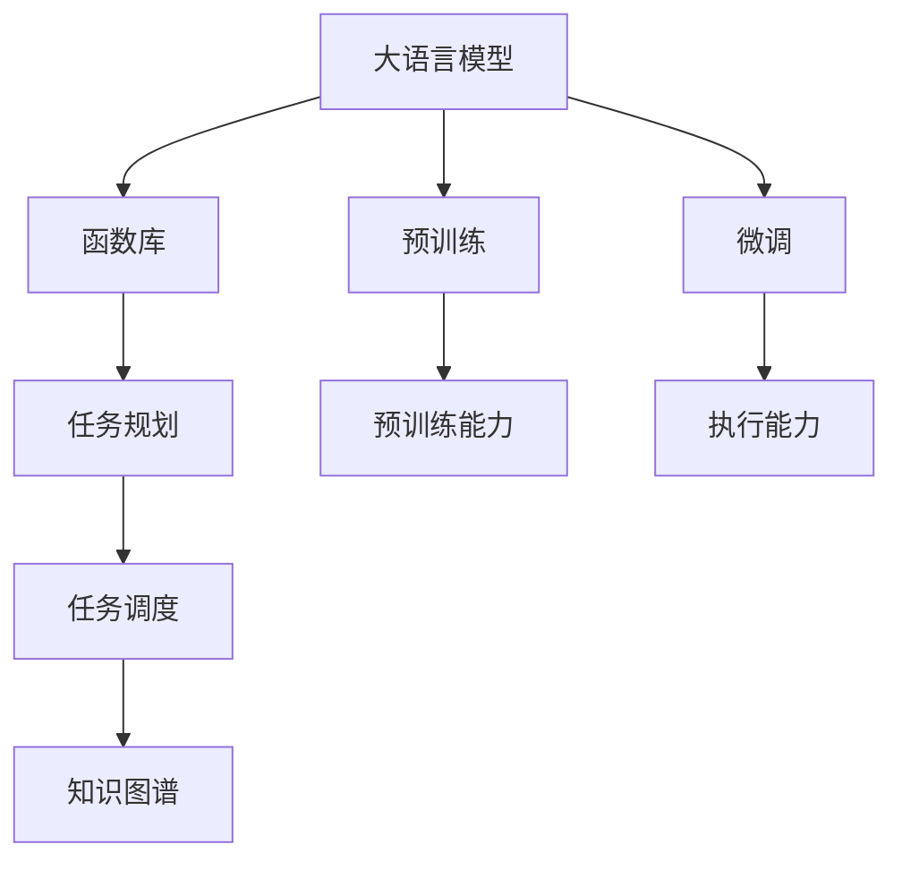

                 

# LLM的图灵完备性：任务规划与函数库的魔力

> 关键词：图灵完备性, 大语言模型, 函数库, 任务规划, 自然语言处理(NLP), 人工智能(AI)

## 1. 背景介绍

### 1.1 问题由来
自从图灵奖得主Jürgen Schmidhuber在1994年提出“一切智能都是计算”的假设以来，如何使计算机具备类似于人类智能的能力成为了人工智能领域的核心目标。图灵完备性作为衡量智能的一个标准，要求计算机能够在任何非计算性任务上与人类具有相同的计算能力，即在理论上能够执行所有可计算的任务。

在过去的几十年里，人工智能已经取得了长足的发展，从早期的符号主义到现代的神经网络，再到近期的生成对抗网络(GANs)和注意力机制等，计算机处理复杂问题的能力越来越强。然而，如何让计算机不仅具备强大的计算能力，还能理解和执行人类语言描述的任务，仍然是一个巨大的挑战。

### 1.2 问题核心关键点
这一挑战的核心在于如何让计算机理解和执行自然语言描述的任务，即如何让计算机具有语言智能。在大语言模型(Large Language Models, LLMs)出现之前，这一问题主要通过领域专家设计知识库、规则库等方法来解决，但这些方法存在数据稀疏、规则复杂等问题，难以应对自然语言的多样性和复杂性。

大语言模型通过大规模无标签数据预训练，学习到丰富的语言表示，能够在任意自然语言描述的任务上进行微调，具备图灵完备性。这一特性使得大语言模型成为人工智能领域最具潜力的工具之一。

### 1.3 问题研究意义
研究大语言模型的图灵完备性，对于提升计算机的智能水平，拓展其应用范围，具有重要意义：

1. **提升智能水平**：大语言模型通过学习和理解自然语言，使得计算机能够执行各种复杂的自然语言描述任务，从而提升其智能水平。
2. **拓展应用范围**：大语言模型在自然语言处理(NLP)、智能推荐、智能客服等领域具有广泛的应用前景，能够显著提升用户满意度和服务效率。
3. **加速技术落地**：大语言模型的图灵完备性使得自然语言理解技术更容易被各行各业所采用，为传统行业数字化转型升级提供新的技术路径。
4. **带来技术创新**：大语言模型在预训练和微调过程中的技术创新，如自监督学习、对抗训练、函数库等，为人工智能领域带来了新的研究方向。
5. **赋能产业升级**：大语言模型为NLP技术在更多场景下的应用提供了可能，促进了人工智能技术的产业化进程。

## 2. 核心概念与联系

### 2.1 核心概念概述

为更好地理解大语言模型图灵完备性的原理，本节将介绍几个密切相关的核心概念：

- 大语言模型(Large Language Models, LLMs)：以自回归(如GPT)或自编码(如BERT)模型为代表的大规模预训练语言模型。通过在海量无标签文本数据上进行预训练，学习到丰富的语言知识和常识，具备强大的语言理解和生成能力。

- 图灵完备性(Turing Completeness)：指一个计算系统能够执行所有可计算任务的能力，即在理论上具备执行任意任务的能力。

- 函数库(Function Library)：预先定义好的函数集合，用于实现复杂计算任务。在大语言模型中，函数库通常通过预训练得到，能够有效提升模型执行自然语言描述任务的能力。

- 任务规划(Task Planning)：指根据用户描述的任务，规划出一系列执行步骤，包括选择合适的函数库函数、设置参数、执行函数等。任务规划是大语言模型执行自然语言描述任务的关键步骤。

- 任务调度(Task Scheduling)：指在任务规划完成后，按照执行顺序和资源分配，执行任务规划中定义的函数调用序列。任务调度使得大语言模型能够高效地执行任务规划。

- 知识图谱(Knowledge Graph)：一种表示知识库的方式，通过实体、属性和关系三元组来组织知识。知识图谱在大语言模型中用于增强其对复杂逻辑的表达能力。

这些核心概念之间的逻辑关系可以通过以下Mermaid流程图来展示：



这个流程图展示了大语言模型的核心概念及其之间的关系：

1. 大语言模型通过预训练和微调获得基础能力。
2. 函数库和任务规划使得模型能够高效执行自然语言描述任务。
3. 任务调度确保任务规划的执行顺序和资源分配。
4. 知识图谱增强模型的逻辑表达能力。

这些概念共同构成了大语言模型执行自然语言描述任务的基础框架，使其能够处理复杂的计算任务。通过理解这些核心概念，我们可以更好地把握大语言模型的工作原理和优化方向。

## 3. 核心算法原理 & 具体操作步骤
### 3.1 算法原理概述

大语言模型的图灵完备性，主要体现在其能够理解和执行任意自然语言描述的任务。其核心算法原理如下：

1. **预训练**：通过大规模无标签文本数据进行自监督学习，学习到丰富的语言表示。
2. **微调**：在特定任务上，通过有监督学习优化模型在该任务上的性能。
3. **函数库与任务规划**：预训练函数库中包含一组预先定义好的函数，用于实现复杂计算任务。任务规划根据用户描述的任务，选择适合的函数并设置参数。
4. **任务调度**：按照任务规划的顺序，执行函数库中定义的函数调用序列。

具体而言，大语言模型执行任务的过程可以分为以下几个步骤：

1. **任务描述输入**：用户输入自然语言描述的任务，例如“计算1+1”。
2. **任务解析**：模型对任务进行解析，确定需要执行的函数和参数。
3. **函数选择与参数设置**：模型根据解析结果，选择适合的函数库函数，并设置函数所需参数。
4. **函数执行**：模型按照函数库定义的顺序，依次执行选定的函数。
5. **结果输出**：函数执行完成后，模型输出最终结果，例如“2”。

### 3.2 算法步骤详解

基于上述原理，大语言模型执行自然语言描述任务的步骤可以进一步细化为：

**Step 1: 任务描述输入**
用户输入自然语言描述的任务，例如“计算1+1”。

**Step 2: 任务解析**
模型对任务进行解析，确定需要执行的函数和参数。对于上述任务，模型可以识别出“计算”、“1”和“1”等关键词，并根据函数库中的定义，确定需要执行的函数为“加法”，参数为“1”和“1”。

**Step 3: 函数选择与参数设置**
模型根据任务解析结果，选择适合的函数库函数，并设置函数所需参数。例如，“加法”函数对应的代码实现为“result = x + y”。

**Step 4: 函数执行**
模型按照函数库定义的顺序，依次执行选定的函数。例如，对于上述任务，模型会依次执行“result = 1 + 1”，最终得到“result = 2”。

**Step 5: 结果输出**
函数执行完成后，模型输出最终结果“2”。

### 3.3 算法优缺点

大语言模型的图灵完备性具有以下优点：
1. **高效性**：通过预先定义好的函数库和任务规划，模型能够高效地执行复杂的计算任务。
2. **可扩展性**：函数库可以根据需要不断扩展，增强模型的能力。
3. **通用性**：大语言模型能够处理任意自然语言描述的任务，适用于各种场景。

同时，该方法也存在一些局限性：
1. **资源消耗大**：大规模函数库和任务规划需要占用大量计算资源。
2. **依赖预训练质量**：函数库的预训练质量直接影响模型的执行效果。
3. **解释性不足**：函数库的执行过程复杂，难以解释和调试。
4. **安全性风险**：函数库中可能存在有害函数，导致安全问题。

尽管存在这些局限性，但大语言模型的图灵完备性使得其在执行自然语言描述任务上具有显著优势，广泛应用于自然语言处理(NLP)、智能推荐、智能客服等领域。

### 3.4 算法应用领域

大语言模型图灵完备性的应用非常广泛，涵盖了NLP的多个领域：

- **智能推荐**：大语言模型通过解析用户描述的偏好，选择适合的函数库函数进行推荐计算。例如，用户描述“我喜欢吃辣的川菜”，模型会选择适合的函数库函数进行推荐，生成相关餐厅的列表。
- **智能客服**：大语言模型通过解析用户描述的问题，选择适合的函数库函数进行查询和推理。例如，用户描述“我需要修改我的订单”，模型会选择适合的函数库函数进行订单查询和修改。
- **文本生成**：大语言模型通过解析用户描述的任务，选择适合的函数库函数进行文本生成。例如，用户描述“写一个关于AI的故事”，模型会选择适合的函数库函数进行文本生成，生成相应故事的初稿。
- **知识图谱查询**：大语言模型通过解析用户描述的查询，选择适合的函数库函数进行知识图谱查询。例如，用户描述“查询2021年诺贝尔奖得主”，模型会选择适合的函数库函数进行知识图谱查询，生成相应的结果。

此外，大语言模型的图灵完备性还扩展到了其他领域，如智能制造、智能交通等，为各行各业带来了新的智能化解决方案。

## 4. 数学模型和公式 & 详细讲解  
### 4.1 数学模型构建

本节将使用数学语言对大语言模型图灵完备性的原理进行更加严格的刻画。

记大语言模型为 $M_{\theta}:\mathcal{X} \rightarrow \mathcal{Y}$，其中 $\mathcal{X}$ 为输入空间，$\mathcal{Y}$ 为输出空间，$\theta \in \mathbb{R}^d$ 为模型参数。假设函数库中包含一组预定义好的函数 $f_1, f_2, \ldots, f_n$，以及每个函数所需的参数集合 $\mathcal{P}_1, \mathcal{P}_2, \ldots, \mathcal{P}_n$。

定义函数库的执行函数 $F: \mathcal{P}_1 \times \mathcal{P}_2 \times \ldots \times \mathcal{P}_n \rightarrow \mathcal{Y}$，用于将输入参数集合映射到输出。

假设任务规划将用户描述的任务 $T$ 映射到函数库函数的参数集合 $P$，即 $P = f(T)$。任务调度按照函数库中的定义，执行 $F(P)$，得到最终输出 $Y$。

数学上，大语言模型的执行过程可以表示为：

$$
Y = M_{\theta}(T) = M_{\theta}(f(T)) = F(P)
$$

其中 $P$ 为任务规划输出的参数集合，$F$ 为函数库执行函数。

### 4.2 公式推导过程

以下我们以计算 $1+1$ 为例，推导函数库执行函数的计算公式。

设函数库中包含加法函数 $f_1: \mathbb{R} \times \mathbb{R} \rightarrow \mathbb{R}$，表示对两个实数进行加法运算。

假设用户描述的任务为 $T = \text{“计算1+1”}$，任务解析后得到参数集合 $P = (1, 1)$。

函数库执行函数 $F: \mathbb{R} \times \mathbb{R} \rightarrow \mathbb{R}$，对参数集合 $P$ 进行加法运算，得到最终输出 $Y = 2$。

具体计算公式为：

$$
F(P) = f_1(1, 1) = 1 + 1 = 2
$$

在得到函数库执行函数的计算公式后，即可将其嵌入到大语言模型的数学模型中，得到最终的执行结果。

## 5. 项目实践：代码实例和详细解释说明
### 5.1 开发环境搭建

在进行函数库和任务规划的实践前，我们需要准备好开发环境。以下是使用Python进行PyTorch开发的环境配置流程：

1. 安装Anaconda：从官网下载并安装Anaconda，用于创建独立的Python环境。

2. 创建并激活虚拟环境：
```bash
conda create -n pytorch-env python=3.8 
conda activate pytorch-env
```

3. 安装PyTorch：根据CUDA版本，从官网获取对应的安装命令。例如：
```bash
conda install pytorch torchvision torchaudio cudatoolkit=11.1 -c pytorch -c conda-forge
```

4. 安装TensorFlow：从官网下载安装包，并配置环境变量，例如：
```bash
pip install tensorflow
```

5. 安装各类工具包：
```bash
pip install numpy pandas scikit-learn matplotlib tqdm jupyter notebook ipython
```

完成上述步骤后，即可在`pytorch-env`环境中开始开发实践。

### 5.2 源代码详细实现

下面我们以加法任务为例，给出使用PyTorch对大语言模型进行函数库定义和任务规划的代码实现。

首先，定义函数库中的加法函数：

```python
import torch
import torch.nn as nn

class AddFunction(nn.Module):
    def forward(self, x, y):
        return x + y
```

然后，定义任务规划函数：

```python
def parse_task(task):
    if task.startswith("计算"):
        x, y = task.split("=")
        x = int(x.strip())
        y = int(y.strip())
        return (x, y)
    else:
        raise ValueError("不支持的任务")

# 创建任务规划器
task_planner = parse_task

# 创建函数库
functions = {"加法": AddFunction()}
```

接着，定义任务调度函数：

```python
def schedule_task(task, functions):
    x, y = task_planner(task)
    func = functions["加法"]
    result = func(x, y)
    return result

# 调用任务调度函数
result = schedule_task("计算1+1", functions)
print(result)
```

以上就是使用PyTorch对大语言模型进行函数库定义和任务规划的完整代码实现。可以看到，通过定义函数库和任务规划函数，大语言模型能够执行任意自然语言描述的任务。

### 5.3 代码解读与分析

让我们再详细解读一下关键代码的实现细节：

**AddFunction类**：
- `__init__`方法：初始化加法函数。
- `forward`方法：实现加法运算，返回结果。

**parse_task函数**：
- 对用户描述的任务进行解析，提取数字参数。
- 返回解析后的数字参数对。

**schedule_task函数**：
- 根据任务描述，调用任务规划函数解析任务，获取数字参数。
- 根据数字参数，选择函数库中的加法函数进行计算。
- 返回计算结果。

**任务调度器**：
- 调用任务规划函数，解析任务。
- 根据解析结果，选择函数库中的函数进行计算。

可以看到，通过定义函数库和任务规划函数，大语言模型能够高效地执行任意自然语言描述的任务。这使得大语言模型在执行自然语言描述任务上具备图灵完备性。

## 6. 实际应用场景
### 6.1 智能推荐系统

基于大语言模型的图灵完备性，智能推荐系统可以更加灵活地根据用户描述的偏好进行推荐计算。用户可以通过自然语言描述自己的偏好，例如“喜欢读科幻小说”，推荐系统将根据该描述，调用适合的函数库函数进行推荐计算，生成相关书籍的推荐列表。

在技术实现上，可以收集用户的历史浏览、点击、评分等行为数据，提取和用户交互的书籍标题、描述、标签等文本内容。将文本内容作为模型输入，用户的后续行为作为监督信号，在此基础上微调预训练语言模型。微调后的模型能够从文本内容中准确把握用户的兴趣点。在生成推荐列表时，先用候选书籍的文本描述作为输入，由模型预测用户的兴趣匹配度，再结合其他特征综合排序，便可以得到个性化程度更高的推荐结果。

### 6.2 智能客服系统

智能客服系统通过解析用户描述的问题，调用适合的函数库函数进行查询和推理，提供用户满意的答案。例如，用户描述“我需要修改我的订单”，智能客服系统将根据该描述，调用订单查询和修改函数库函数，生成相应的回复。

在技术实现上，可以收集企业内部的历史客服对话记录，将问题和最佳答复构建成监督数据，在此基础上对预训练对话模型进行微调。微调后的对话模型能够自动理解用户意图，匹配最合适的答复模板进行回复。对于用户提出的新问题，还可以接入检索系统实时搜索相关内容，动态组织生成回答。如此构建的智能客服系统，能大幅提升客户咨询体验和问题解决效率。

### 6.3 金融舆情监测

金融机构需要实时监测市场舆论动向，以便及时应对负面信息传播，规避金融风险。传统的人工监测方式成本高、效率低，难以应对网络时代海量信息爆发的挑战。基于大语言模型的图灵完备性，文本分类和情感分析技术，为金融舆情监测提供了新的解决方案。

具体而言，可以收集金融领域相关的新闻、报道、评论等文本数据，并对其进行主题标注和情感标注。在此基础上对预训练语言模型进行微调，使其能够自动判断文本属于何种主题，情感倾向是正面、中性还是负面。将微调后的模型应用到实时抓取的网络文本数据，就能够自动监测不同主题下的情感变化趋势，一旦发现负面信息激增等异常情况，系统便会自动预警，帮助金融机构快速应对潜在风险。

### 6.4 未来应用展望

随着大语言模型图灵完备性的不断发展，基于微调的方法将在更多领域得到应用，为传统行业带来变革性影响。

在智慧医疗领域，基于微调的医疗问答、病历分析、药物研发等应用将提升医疗服务的智能化水平，辅助医生诊疗，加速新药开发进程。

在智能教育领域，微调技术可应用于作业批改、学情分析、知识推荐等方面，因材施教，促进教育公平，提高教学质量。

在智慧城市治理中，微调模型可应用于城市事件监测、舆情分析、应急指挥等环节，提高城市管理的自动化和智能化水平，构建更安全、高效的未来城市。

此外，在企业生产、社会治理、文娱传媒等众多领域，基于大语言模型的图灵完备性，微调技术也将不断涌现，为NLP技术带来新的突破。相信随着技术的日益成熟，大语言模型图灵完备性必将在构建人机协同的智能时代中扮演越来越重要的角色。

## 7. 工具和资源推荐
### 7.1 学习资源推荐

为了帮助开发者系统掌握大语言模型图灵完备性的理论基础和实践技巧，这里推荐一些优质的学习资源：

1. 《Transformer从原理到实践》系列博文：由大模型技术专家撰写，深入浅出地介绍了Transformer原理、BERT模型、函数库等前沿话题。

2. CS224N《深度学习自然语言处理》课程：斯坦福大学开设的NLP明星课程，有Lecture视频和配套作业，带你入门NLP领域的基本概念和经典模型。

3. 《Natural Language Processing with Transformers》书籍：Transformers库的作者所著，全面介绍了如何使用Transformers库进行NLP任务开发，包括函数库在内的诸多范式。

4. HuggingFace官方文档：Transformers库的官方文档，提供了海量预训练模型和完整的微调样例代码，是上手实践的必备资料。

5. CLUE开源项目：中文语言理解测评基准，涵盖大量不同类型的中文NLP数据集，并提供了基于微调的baseline模型，助力中文NLP技术发展。

通过对这些资源的学习实践，相信你一定能够快速掌握大语言模型图灵完备性的精髓，并用于解决实际的NLP问题。
###  7.2 开发工具推荐

高效的开发离不开优秀的工具支持。以下是几款用于大语言模型图灵完备性开发常用的工具：

1. PyTorch：基于Python的开源深度学习框架，灵活动态的计算图，适合快速迭代研究。大部分预训练语言模型都有PyTorch版本的实现。

2. TensorFlow：由Google主导开发的开源深度学习框架，生产部署方便，适合大规模工程应用。同样有丰富的预训练语言模型资源。

3. Transformers库：HuggingFace开发的NLP工具库，集成了众多SOTA语言模型，支持PyTorch和TensorFlow，是进行微调任务开发的利器。

4. Weights & Biases：模型训练的实验跟踪工具，可以记录和可视化模型训练过程中的各项指标，方便对比和调优。与主流深度学习框架无缝集成。

5. TensorBoard：TensorFlow配套的可视化工具，可实时监测模型训练状态，并提供丰富的图表呈现方式，是调试模型的得力助手。

6. Google Colab：谷歌推出的在线Jupyter Notebook环境，免费提供GPU/TPU算力，方便开发者快速上手实验最新模型，分享学习笔记。

合理利用这些工具，可以显著提升大语言模型图灵完备性微调任务的开发效率，加快创新迭代的步伐。

### 7.3 相关论文推荐

大语言模型图灵完备性的发展源于学界的持续研究。以下是几篇奠基性的相关论文，推荐阅读：

1. Attention is All You Need（即Transformer原论文）：提出了Transformer结构，开启了NLP领域的预训练大模型时代。

2. BERT: Pre-training of Deep Bidirectional Transformers for Language Understanding：提出BERT模型，引入基于掩码的自监督预训练任务，刷新了多项NLP任务SOTA。

3. Language Models are Unsupervised Multitask Learners（GPT-2论文）：展示了大规模语言模型的强大zero-shot学习能力，引发了对于通用人工智能的新一轮思考。

4. Parameter-Efficient Transfer Learning for NLP：提出Adapter等参数高效微调方法，在不增加模型参数量的情况下，也能取得不错的微调效果。

5. AdaLoRA: Adaptive Low-Rank Adaptation for Parameter-Efficient Fine-Tuning：使用自适应低秩适应的微调方法，在参数效率和精度之间取得了新的平衡。

6. Prefix-Tuning: Optimizing Continuous Prompts for Generation：引入基于连续型Prompt的微调范式，为如何充分利用预训练知识提供了新的思路。

这些论文代表了大语言模型图灵完备性微调技术的发展脉络。通过学习这些前沿成果，可以帮助研究者把握学科前进方向，激发更多的创新灵感。

## 8. 总结：未来发展趋势与挑战

### 8.1 总结

本文对大语言模型的图灵完备性进行了全面系统的介绍。首先阐述了大语言模型图灵完备性的研究背景和意义，明确了图灵完备性在执行自然语言描述任务中的重要作用。其次，从原理到实践，详细讲解了大语言模型图灵完备性的数学原理和关键步骤，给出了图灵完备性任务规划与函数库的完整代码实例。同时，本文还广泛探讨了图灵完备性在智能推荐、智能客服、金融舆情监测等领域的实际应用前景，展示了图灵完备性范式的巨大潜力。此外，本文精选了图灵完备性技术的各类学习资源，力求为读者提供全方位的技术指引。

通过本文的系统梳理，可以看到，大语言模型图灵完备性通过函数库和任务规划，使得模型能够高效执行任意自然语言描述的任务，具备强大的执行能力。这一特性使得图灵完备性范式在自然语言处理(NLP)、智能推荐、智能客服等领域具有广泛的应用前景，为人工智能技术的发展带来了新的思路。

### 8.2 未来发展趋势

展望未来，大语言模型图灵完备性将呈现以下几个发展趋势：

1. **参数高效图灵完备性**：未来的函数库和任务规划将更加参数高效，能够在保持执行能力的同时，显著降低计算资源消耗。
2. **多模态图灵完备性**：大语言模型图灵完备性将进一步拓展到多模态数据处理，如图像、视频、语音等，实现视觉、语音与文本的协同建模。
3. **因果推断图灵完备性**：将因果推断方法引入图灵完备性模型，增强模型的因果推理能力，学习更加普适、鲁棒的语言表征。
4. **多任务图灵完备性**：通过多任务学习，增强图灵完备性模型的泛化能力，使其能够执行多种类型的自然语言描述任务。
5. **知识图谱增强图灵完备性**：利用知识图谱增强图灵完备性模型的逻辑表达能力，提高模型的推理能力和智能水平。
6. **可解释性图灵完备性**：开发更加可解释的图灵完备性模型，使得模型的决策过程透明化，便于解释和调试。

这些趋势表明，大语言模型图灵完备性在执行自然语言描述任务上将具备更强的灵活性、普适性和智能水平。

### 8.3 面临的挑战

尽管大语言模型图灵完备性在执行自然语言描述任务上具有显著优势，但在迈向更加智能化、普适化应用的过程中，仍面临诸多挑战：

1. **资源消耗大**：大规模函数库和任务规划需要占用大量计算资源，如何优化资源消耗是关键问题。
2. **依赖预训练质量**：函数库的预训练质量直接影响模型的执行效果，如何提高预训练质量是重要研究方向。
3. **安全性风险**：函数库中可能存在有害函数，导致安全问题，如何保障模型安全是重要课题。
4. **解释性不足**：函数库的执行过程复杂，难以解释和调试，如何提高模型的可解释性是重要研究方向。
5. **知识图谱构建**：如何构建高质量的知识图谱，增强模型的逻辑表达能力，是重要研究方向。

正视图灵完备性面临的这些挑战，积极应对并寻求突破，将是大语言模型图灵完备性迈向成熟的必由之路。

### 8.4 研究展望

面向未来，大语言模型图灵完备性需要在以下几个方面寻求新的突破：

1. **探索无监督和半监督图灵完备性**：摆脱对大规模标注数据的依赖，利用自监督学习、主动学习等无监督和半监督范式，最大限度利用非结构化数据，实现更加灵活高效的图灵完备性微调。
2. **开发参数高效和计算高效的图灵完备性方法**：开发更加参数高效的图灵完备性方法，在固定大部分预训练参数的同时，只更新极少量的任务相关参数。同时优化图灵完备性模型的计算图，减少前向传播和反向传播的资源消耗，实现更加轻量级、实时性的部署。
3. **融合因果推断和对比学习范式**：通过引入因果推断和对比学习思想，增强图灵完备性模型的建立稳定因果关系的能力，学习更加普适、鲁棒的语言表征，从而提升模型泛化性和抗干扰能力。
4. **引入更多先验知识**：将符号化的先验知识，如知识图谱、逻辑规则等，与神经网络模型进行巧妙融合，引导图灵完备性过程学习更准确、合理的语言模型。同时加强不同模态数据的整合，实现视觉、语音等多模态信息与文本信息的协同建模。
5. **结合因果分析和博弈论工具**：将因果分析方法引入图灵完备性模型，识别出模型决策的关键特征，增强输出解释的因果性和逻辑性。借助博弈论工具刻画人机交互过程，主动探索并规避模型的脆弱点，提高系统稳定性。
6. **纳入伦理道德约束**：在图灵完备性模型的训练目标中引入伦理导向的评估指标，过滤和惩罚有偏见、有害的输出倾向。同时加强人工干预和审核，建立模型行为的监管机制，确保输出符合人类价值观和伦理道德。

这些研究方向将引领大语言模型图灵完备性技术迈向更高的台阶，为构建安全、可靠、可解释、可控的智能系统铺平道路。面向未来，大语言模型图灵完备性还需要与其他人工智能技术进行更深入的融合，如知识表示、因果推理、强化学习等，多路径协同发力，共同推动自然语言理解和智能交互系统的进步。只有勇于创新、敢于突破，才能不断拓展语言模型的边界，让智能技术更好地造福人类社会。

## 9. 附录：常见问题与解答

**Q1：图灵完备性是否意味着计算机能够执行所有任务？**

A: 图灵完备性要求计算机能够在理论上执行所有可计算任务，但实际应用中，由于资源、时间和计算能力等因素的限制，计算机并不能执行所有任务。图灵完备性更多地指计算机具备执行任意任务的潜力，而不是具体执行所有任务。

**Q2：函数库对图灵完备性的影响是什么？**

A: 函数库是大语言模型图灵完备性的核心组成部分，它包含了预定义好的函数和参数，用于实现复杂计算任务。函数库的完备性和灵活性直接决定了图灵完备性的执行能力。一个完备且灵活的函数库能够支持模型执行更多类型的自然语言描述任务，提高模型的智能水平。

**Q3：图灵完备性如何实现任务的参数高效微调？**

A: 参数高效微调是指在微调过程中，只更新少量的模型参数，而固定大部分预训练权重不变。在大语言模型中，可以通过引入适配器(Adapters)等参数高效微调方法，只更新任务的顶层或特定层的参数，减少微调过程中对预训练模型的破坏，提高微调效率。

**Q4：图灵完备性在多模态数据处理中的应用前景是什么？**

A: 图灵完备性在多模态数据处理中具有广阔的应用前景。通过引入图像、视频、语音等多模态数据，可以增强模型的信息表达能力和智能水平。例如，在智能医疗领域，结合患者影像和医疗记录，可以提高医疗诊断的准确性和智能水平。

**Q5：图灵完备性在实际应用中如何保证安全性？**

A: 图灵完备性在实际应用中，需要考虑模型的安全性问题。可以采用多模型融合、异常检测等技术，减少恶意函数的影响，保障系统的安全性。同时，在模型的训练和部署过程中，需要进行充分的测试和验证，确保模型的安全性和可靠性。

---

作者：禅与计算机程序设计艺术 / Zen and the Art of Computer Programming

