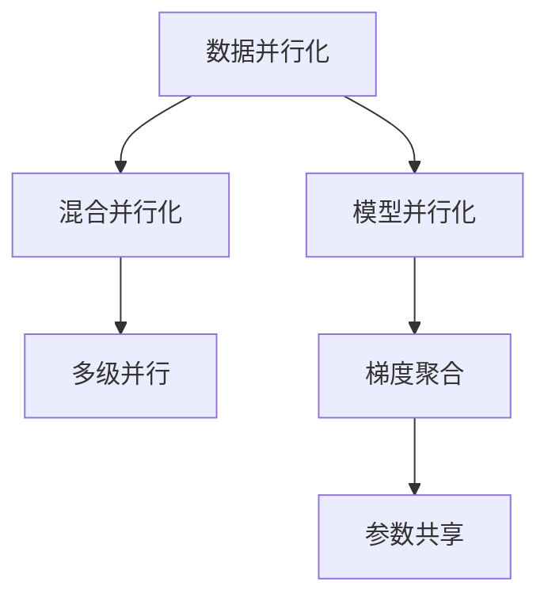

                 

## 1. 背景介绍

在自然语言处理（NLP）领域，大规模语言模型（LLM）已经逐渐成为主流。这类模型通常采用深度神经网络架构，能够处理复杂的语言任务，但同时需要庞大的计算资源进行训练和推理。在实际应用中，为了解决数据并行化的问题，研究人员和工程师们开发了多种数据并行化策略，如数据并行、模型并行、混合并行等。本文将重点介绍LLM的数据并行化策略，详细剖析其实现原理，并结合实际应用场景，展示相关技术的应用效果。

## 2. 核心概念与联系

### 2.1 核心概念概述

**大规模语言模型（LLM）**：通常指具有数十亿或更多参数的深度学习模型，能够处理复杂的语言任务，如自然语言理解（NLU）、自然语言生成（NLG）等。

**数据并行化（Data Parallelism）**：将大规模数据集分割成多个子集，每个子集在一个计算节点上独立训练，各节点之间通过通信机制交换信息，共同提升训练速度和模型性能。

**模型并行化（Model Parallelism）**：将大规模模型分割成多个子模型，每个子模型在独立的计算节点上独立训练，通过参数共享和梯度聚合机制，协同提升模型性能。

**混合并行化（Mixed Parallelism）**：结合数据并行和模型并行，通过多层级并行策略，进一步提升训练效率和模型性能。

### 2.2 核心概念原理和架构的 Mermaid 流程图



这个流程图展示了数据并行、模型并行和混合并行的基本架构和关系。其中，数据并行将数据分割成多个子集，每个子集在一个计算节点上独立训练；模型并行将模型分割成多个子模型，每个子模型在独立的计算节点上独立训练；混合并行则是结合数据并行和模型并行的多级并行策略，通过多层级并行进一步提升训练效率和模型性能。

## 3. 核心算法原理 & 具体操作步骤

### 3.1 算法原理概述

LLM的数据并行化主要通过分布式计算框架实现。这类框架通常采用数据并行化或混合并行化策略，将大规模数据集或模型分割成多个子集，每个子集在一个计算节点上独立训练，各节点之间通过通信机制交换信息，共同提升训练速度和模型性能。

数据并行化的核心思想是：将大规模数据集分割成多个子集，每个子集在一个计算节点上独立训练，各节点之间通过通信机制交换信息，共同提升训练速度和模型性能。具体实现时，一般采用同步更新和异步更新两种方式。

**同步更新**：所有计算节点在每个训练轮次开始时，同步等待所有节点的梯度更新，再进行参数更新。这种方式的优点是计算准确性高，缺点是通信开销大，可能导致训练速度较慢。

**异步更新**：每个计算节点独立训练，无需等待其他节点完成，更新梯度后立即发送给其他节点。这种方式的优点是通信开销小，训练速度快，缺点是可能存在参数不同步的问题。

### 3.2 算法步骤详解

#### 3.2.1 数据并行化

**Step 1: 数据划分**
将大规模数据集分割成多个子集，每个子集在一个计算节点上独立训练。通常采用数据划分策略，如数据集划分（Data Splitting）、数据块划分（Data Block Splitting）等。

**Step 2: 数据分发**
将数据子集分发到各个计算节点上，每个节点独立进行模型训练。在数据分发过程中，需要考虑数据的均衡性和数据量的合理分配，以避免某些节点计算量过重，导致性能下降。

**Step 3: 参数更新**
在每个训练轮次结束时，各节点之间通过通信机制交换梯度信息，并进行参数更新。同步更新和异步更新两种方式均可采用，具体选择需根据任务特点和计算资源进行权衡。

#### 3.2.2 模型并行化

**Step 1: 模型划分**
将大规模模型分割成多个子模型，每个子模型在独立的计算节点上独立训练。通常采用模型划分策略，如模型分割（Model Partitioning）、模块分割（Module Partitioning）等。

**Step 2: 模型分发**
将子模型分发到各个计算节点上，每个节点独立进行模型训练。在模型分发过程中，需要考虑模型的逻辑关系和计算复杂度，以避免某些节点计算量过重，导致性能下降。

**Step 3: 梯度聚合**
在每个训练轮次结束时，各节点之间通过通信机制交换梯度信息，并进行梯度聚合。通常采用全梯度聚合（Full Gradient Aggregation）或局部梯度聚合（Partial Gradient Aggregation）两种方式，具体选择需根据任务特点和计算资源进行权衡。

#### 3.2.3 混合并行化

**Step 1: 数据划分**
将大规模数据集分割成多个子集，每个子集在一个计算节点上独立训练。

**Step 2: 模型划分**
将大规模模型分割成多个子模型，每个子模型在独立的计算节点上独立训练。

**Step 3: 数据分发**
将数据子集分发到各个计算节点上，每个节点独立进行模型训练。

**Step 4: 参数更新**
在每个训练轮次结束时，各节点之间通过通信机制交换梯度信息，并进行参数更新。

**Step 5: 梯度聚合**
在每个训练轮次结束时，各节点之间通过通信机制交换梯度信息，并进行梯度聚合。

### 3.3 算法优缺点

**数据并行化的优点**：
- 计算准确性高，模型参数更新同步。
- 通信开销较小，适合小规模数据集。

**数据并行化的缺点**：
- 同步更新可能导致训练速度较慢。
- 节点间通信开销较大，影响计算效率。

**模型并行化的优点**：
- 计算效率高，训练速度较快。
- 适合大规模模型，能够充分利用计算资源。

**模型并行化的缺点**：
- 梯度聚合可能导致参数不同步，影响计算准确性。
- 实现复杂，需要考虑参数共享和通信机制。

**混合并行化的优点**：
- 综合了数据并行和模型并行的优势，计算效率和模型性能均较高。
- 能够更好地应对大规模数据和模型。

**混合并行化的缺点**：
- 实现复杂，需要考虑数据和模型并行的组合方式。
- 节点间通信开销较大，影响计算效率。

### 3.4 算法应用领域

数据并行化和混合并行化在大规模LLM训练和推理中得到了广泛应用，特别是在深度学习框架如TensorFlow、PyTorch、MXNet等中。这些框架提供了丰富的API和工具，支持数据并行化、模型并行化和混合并行化的实现。

在实际应用中，数据并行化和混合并行化主要应用于大规模模型的训练和推理，如文本分类、机器翻译、语音识别等任务。而模型并行化则主要应用于超大规模模型的训练，如BERT、GPT等模型。

## 4. 数学模型和公式 & 详细讲解 & 举例说明

### 4.1 数学模型构建

**数据并行化模型**：
将大规模数据集分割成多个子集，每个子集在一个计算节点上独立训练。假设数据集大小为 $N$，计算节点数为 $P$，每个节点的数据集大小为 $\frac{N}{P}$。

**模型并行化模型**：
将大规模模型分割成多个子模型，每个子模型在独立的计算节点上独立训练。假设模型参数大小为 $M$，计算节点数为 $P$，每个节点的模型参数大小为 $\frac{M}{P}$。

### 4.2 公式推导过程

**数据并行化公式推导**：
设节点 $i$ 的数据集大小为 $\frac{N}{P}$，计算节点数为 $P$。则节点 $i$ 的总损失函数为：

$$
L_i = \frac{1}{\frac{N}{P}}\sum_{j=1}^{\frac{N}{P}}\ell(\theta_i(x_j),y_j)
$$

其中，$\theta_i$ 表示节点 $i$ 的模型参数，$x_j$ 和 $y_j$ 分别表示数据集中的输入和标签。

**模型并行化公式推导**：
设节点 $i$ 的模型参数大小为 $\frac{M}{P}$，计算节点数为 $P$。则节点 $i$ 的总损失函数为：

$$
L_i = \frac{1}{M}\sum_{j=1}^{M}\ell(\theta_i(z_j),y_j)
$$

其中，$z_j$ 表示节点 $i$ 的输入数据，$y_j$ 表示数据集中的标签。

### 4.3 案例分析与讲解

**案例分析**：
假设有一个大规模语言模型，参数大小为 $M=2G$，数据集大小为 $N=100M$。使用 $P=16$ 个计算节点进行训练，每个节点的模型参数大小为 $\frac{M}{P}=125M$。

**案例讲解**：
1. **数据并行化**：将数据集分割成 $P=16$ 个子集，每个子集大小为 $\frac{N}{P}=6.25M$。在每个节点上分别训练这些子集，每个节点独立计算损失函数。
2. **模型并行化**：将模型分割成 $P=16$ 个子模型，每个子模型大小为 $\frac{M}{P}=125M$。在每个节点上分别训练这些子模型，每个节点独立计算损失函数。
3. **混合并行化**：将数据集和模型同时并行化。首先将数据集分割成 $P=16$ 个子集，每个子集大小为 $\frac{N}{P}=6.25M$。然后将模型分割成 $P=16$ 个子模型，每个子模型大小为 $\frac{M}{P}=125M$。在每个节点上分别训练这些子集和子模型，每个节点独立计算损失函数。

## 5. 项目实践：代码实例和详细解释说明

### 5.1 开发环境搭建

在项目实践之前，首先需要搭建相应的开发环境。这里推荐使用 PyTorch 作为深度学习框架，因为它提供了丰富的分布式计算 API 和工具，支持数据并行化、模型并行化和混合并行化的实现。

**Step 1: 安装 PyTorch**：
```bash
pip install torch torchvision torchaudio
```

**Step 2: 安装分布式训练工具**：
```bash
pip install torch.distributed
```

**Step 3: 安装通信库**：
```bash
pip install mpi4py
```

**Step 4: 安装其他依赖库**：
```bash
pip install numpy pandas scikit-learn
```

### 5.2 源代码详细实现

以下是一个使用 PyTorch 进行数据并行化训练的示例代码：

```python
import torch
import torch.distributed as dist
import torch.nn as nn
import torch.optim as optim
import torch.multiprocessing as mp

class Model(nn.Module):
    def __init__(self):
        super(Model, self).__init__()
        self.linear = nn.Linear(10, 10)

    def forward(self, x):
        return self.linear(x)

def train_fn(rank, world_size, model, train_loader, optimizer):
    model.to(rank)
    criterion = nn.CrossEntropyLoss()
    for epoch in range(10):
        for batch_idx, (inputs, targets) in enumerate(train_loader):
            inputs, targets = inputs.to(rank), targets.to(rank)
            optimizer.zero_grad()
            outputs = model(inputs)
            loss = criterion(outputs, targets)
            loss.backward()
            optimizer.step()

if __name__ == '__main__':
    world_size = 4
    torch.cuda.set_device(rank)
    train_loader = torch.utils.data.DataLoader(train_dataset, batch_size=32, shuffle=True, num_workers=2)
    dist.init_process_group("nccl", rank=rank, world_size=world_size)
    model = Model()
    optimizer = optim.SGD(model.parameters(), lr=0.01)
    mp.spawn(train_fn, args=(world_size, model, train_loader, optimizer), nprocs=world_size, join=True)
```

### 5.3 代码解读与分析

**代码解读**：
- 首先定义了一个简单的线性模型，用于训练。
- `train_fn` 函数是训练函数，它通过 `mp.spawn` 函数在多个计算节点上进行并行训练。
- `dist.init_process_group` 函数用于初始化分布式训练环境，使用 `nccl` 作为通信协议。
- 在训练过程中，每个节点独立计算梯度，并通过 `nccl` 协议交换梯度信息。

**代码分析**：
- 数据并行化是通过 `mp.spawn` 函数实现的，它可以在多个计算节点上并行执行 `train_fn` 函数。
- 每个节点在训练过程中，独立计算梯度，并通过 `nccl` 协议交换梯度信息，从而实现数据并行化。

## 6. 实际应用场景

### 6.1 大规模模型的训练和推理

在大规模模型的训练和推理过程中，数据并行化和混合并行化具有广泛的应用。例如，在训练 BERT、GPT 等大规模语言模型时，通常需要使用多台计算节点进行并行训练，以充分利用计算资源。在推理过程中，数据并行化和混合并行化也可以显著提高推理速度和效率。

### 6.2 分布式深度学习训练

在分布式深度学习训练中，数据并行化和混合并行化是常用的策略。例如，在 TensorFlow 的分布式训练中，可以使用 `tf.distribute.Strategy` 进行数据并行化，使用 `tf.distribute.MirroredStrategy` 进行混合并行化。

### 6.3 分布式存储系统

在分布式存储系统中，数据并行化和混合并行化也有广泛的应用。例如，在 Hadoop 和 Spark 中，可以通过数据并行化和混合并行化来加速数据处理和存储。

## 7. 工具和资源推荐

### 7.1 学习资源推荐

**TensorFlow**：提供丰富的分布式训练 API 和工具，支持数据并行化、模型并行化和混合并行化的实现。

**PyTorch**：提供了丰富的分布式计算 API 和工具，支持数据并行化、模型并行化和混合并行化的实现。

**MXNet**：提供了丰富的分布式训练 API 和工具，支持数据并行化、模型并行化和混合并行化的实现。

### 7.2 开发工具推荐

**PyTorch**：提供了丰富的分布式计算 API 和工具，支持数据并行化、模型并行化和混合并行化的实现。

**TensorFlow**：提供了丰富的分布式训练 API 和工具，支持数据并行化、模型并行化和混合并行化的实现。

**MXNet**：提供了丰富的分布式训练 API 和工具，支持数据并行化、模型并行化和混合并行化的实现。

### 7.3 相关论文推荐

**《Deep Scalability of Neural Network-based Natural Language Processing》**：本文讨论了深度学习在 NLP 领域的应用，介绍了数据并行化和混合并行化的实现方法。

**《Parallelizing the Training of Large Neural Networks with Data Parallelism》**：本文详细介绍了数据并行化的实现方法，并分析了数据并行化在深度学习中的应用。

## 8. 总结：未来发展趋势与挑战

### 8.1 研究成果总结

本文详细介绍了大语言模型的数据并行化策略，包括数据并行化、模型并行化和混合并行化的实现方法和应用场景。数据并行化和混合并行化在大规模模型的训练和推理中得到了广泛应用，极大地提高了计算效率和模型性能。

### 8.2 未来发展趋势

**数据并行化的发展趋势**：未来数据并行化将继续在大规模模型的训练和推理中发挥重要作用，进一步提高计算效率和模型性能。

**模型并行化的发展趋势**：未来模型并行化将进一步优化，引入更多的参数共享和梯度聚合方法，以提高计算效率和模型性能。

**混合并行化的发展趋势**：未来混合并行化将继续成为主流，结合数据并行化和模型并行化的优势，进一步提高计算效率和模型性能。

### 8.3 面临的挑战

**数据并行化的挑战**：数据并行化面临的主要挑战是节点间通信开销较大，影响计算效率。

**模型并行化的挑战**：模型并行化面临的主要挑战是参数不同步，影响计算准确性。

**混合并行化的挑战**：混合并行化面临的主要挑战是实现复杂，需要考虑数据和模型并行的组合方式。

### 8.4 研究展望

未来需要进一步研究和优化数据并行化、模型并行化和混合并行化的实现方法，提高计算效率和模型性能。同时需要考虑节点的异构性和通信机制的优化，进一步提升并行计算的效果。

## 9. 附录：常见问题与解答

**Q1: 数据并行化和模型并行化有什么区别？**

A: 数据并行化是将大规模数据集分割成多个子集，每个子集在一个计算节点上独立训练。而模型并行化是将大规模模型分割成多个子模型，每个子模型在独立的计算节点上独立训练。数据并行化适用于大规模数据集，而模型并行化适用于大规模模型。

**Q2: 数据并行化和模型并行化的优缺点是什么？**

A: 数据并行化的优点是计算准确性高，模型参数更新同步。缺点是节点间通信开销较大，影响计算效率。模型并行化的优点是计算效率高，训练速度较快。缺点是梯度聚合可能导致参数不同步，影响计算准确性。

**Q3: 混合并行化如何实现？**

A: 混合并行化是将数据并行化和模型并行化的结合。首先对数据集进行分割，每个子集在一个计算节点上独立训练。然后将模型分割成多个子模型，每个子模型在独立的计算节点上独立训练。在每个节点上分别训练这些子集和子模型，每个节点独立计算损失函数，并通过通信机制交换梯度信息。

**Q4: 如何优化数据并行化和模型并行化的实现？**

A: 数据并行化和模型并行化的实现需要考虑节点的异构性和通信机制的优化。例如，在数据并行化中，可以使用同步更新和异步更新两种方式，具体选择需根据任务特点和计算资源进行权衡。在模型并行化中，可以使用全梯度聚合和局部梯度聚合两种方式，具体选择需根据任务特点和计算资源进行权衡。

**Q5: 数据并行化和混合并行化在大规模模型中的应用有哪些？**

A: 数据并行化和混合并行化在大规模模型的训练和推理中得到了广泛应用。例如，在训练 BERT、GPT 等大规模语言模型时，通常需要使用多台计算节点进行并行训练。在推理过程中，数据并行化和混合并行化也可以显著提高推理速度和效率。

