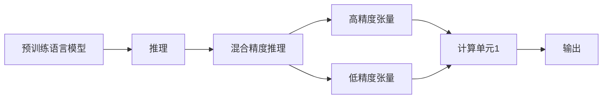

                 

## 1. 背景介绍

### 1.1 问题由来

随着深度学习技术的发展，语言模型在处理自然语言处理（NLP）任务时取得了巨大的突破。预训练语言模型（LLMs）通过在大规模无标签数据上进行预训练，学习了丰富的语言知识和常识，这些知识可以用于提升下游任务的性能。然而，预训练语言模型的参数量通常很大，这对计算资源的要求较高。在推理阶段，由于模型参数在计算时的精度较高（例如使用单精度浮点数float32），会导致计算资源的浪费和推理速度的下降。

为了提高推理效率并降低计算资源消耗，混合精度推理技术（Mixed-Precision Inference）应运而生。混合精度推理技术通过在模型的不同层使用不同的精度，可以在保持计算精度的同时大幅降低计算资源的需求。这一技术在大规模预训练语言模型中得到了广泛应用，显著提升了模型的推理速度和资源利用效率。

### 1.2 问题核心关键点

混合精度推理的核心在于平衡计算精度和计算资源的需求。对于深度学习模型，模型中存在不同的计算单元，包括权重参数和激活值等，这些单元在计算时对精度的需求不同。在推理阶段，通过将计算精度调低，可以大幅降低计算资源的消耗，同时保持模型的性能。

具体来说，混合精度推理技术通常使用两种精度级别的张量：

- 高精度张量（如float32）：用于保存模型权重参数，确保计算的精确性。
- 低精度张量（如float16）：用于计算过程中，降低计算资源的消耗。

通过将不同的层使用不同的精度，混合精度推理技术可以高效地进行计算，同时保持模型的精度。

## 2. 核心概念与联系

### 2.1 核心概念概述

在讨论混合精度推理方案之前，我们需要理解几个核心概念：

- 预训练语言模型（LLMs）：通过在大规模无标签数据上进行自监督预训练，学习到语言知识和常识的深度学习模型。
- 推理（Inference）：给定输入数据，计算模型的输出结果的过程。
- 混合精度（Mixed Precision）：使用不同精度的张量进行计算，以降低计算资源的消耗。
- 张量（Tensor）：多维数组，用于表示模型的权重参数和激活值等数据。
- 精度（Precision）：表示计算结果的准确性，通常用浮点数的位数表示。

这些概念之间存在紧密的联系：预训练语言模型通过推理计算输出结果，而混合精度推理技术可以有效地降低计算资源的消耗，提高推理效率。

### 2.2 核心概念原理和架构的 Mermaid 流程图



这个流程图展示了预训练语言模型通过推理计算输出结果的过程，其中混合精度推理技术通过使用不同的精度级别的张量进行计算，降低了计算资源的消耗。

## 3. 核心算法原理 & 具体操作步骤

### 3.1 算法原理概述

混合精度推理技术的核心思想是：在模型的不同层使用不同的精度级别进行计算，以降低计算资源的消耗。具体来说，混合精度推理技术通常使用两种精度级别的张量：高精度张量（如float32）和低精度张量（如float16）。

对于模型的权重参数，通常使用高精度张量进行保存，以确保计算的精确性。而对于模型的激活值等计算过程中产生的临时数据，则可以使用低精度张量进行计算，以降低计算资源的消耗。

### 3.2 算法步骤详解

混合精度推理技术的实施可以分为以下几个步骤：

1. **选择合适的精度配置**：根据模型和计算资源的条件，选择合适的精度配置方案。通常，模型的权重参数使用高精度张量（如float32），而激活值等临时数据使用低精度张量（如float16）。

2. **数据预处理**：将输入数据进行预处理，以适应不同的精度级别。例如，将输入数据进行归一化处理，以适应低精度计算。

3. **模型定义**：定义混合精度推理的模型。在定义模型时，需要考虑模型的不同层对精度的需求，并使用不同的精度级别进行定义。

4. **模型训练和推理**：在训练和推理过程中，使用混合精度推理技术。在训练时，使用高精度张量进行权重参数的更新；在推理时，使用低精度张量进行计算，以降低计算资源的消耗。

5. **结果后处理**：对推理结果进行后处理，以适应高精度计算。通常，将低精度计算结果转换为高精度结果，并进行必要的处理。

### 3.3 算法优缺点

混合精度推理技术的优点包括：

- **降低计算资源消耗**：通过使用低精度张量进行计算，大幅降低了计算资源的消耗，提高了计算效率。
- **保持计算精度**：通过使用高精度张量进行权重参数的保存，保持了计算的精确性。
- **适用性广泛**：混合精度推理技术可以适用于各种类型的深度学习模型，包括预训练语言模型。

同时，混合精度推理技术也存在一些缺点：

- **硬件要求高**：混合精度推理技术通常需要支持混合精度的硬件平台，如NVIDIA的GPU等。
- **模型结构复杂**：混合精度推理技术需要对模型结构进行调整，以适应不同的精度级别。
- **精度损失**：在低精度计算过程中，由于精度降低，可能导致一些计算结果的精度损失。

### 3.4 算法应用领域

混合精度推理技术在深度学习领域得到了广泛应用，特别是在预训练语言模型中。以下列举了混合精度推理技术在预训练语言模型中的主要应用领域：

1. **大规模预训练语言模型的推理**：通过混合精度推理技术，可以大幅降低大规模预训练语言模型的推理计算资源消耗，提高推理效率。

2. **多任务学习**：在多任务学习中，混合精度推理技术可以用于不同任务的推理，通过不同的精度级别进行计算，提高计算效率。

3. **增量学习**：在增量学习中，混合精度推理技术可以用于新样本的推理，通过不同的精度级别进行计算，降低计算资源消耗。

4. **分布式训练和推理**：在分布式训练和推理中，混合精度推理技术可以用于不同节点的计算，通过不同的精度级别进行计算，提高计算效率。

## 4. 数学模型和公式 & 详细讲解

### 4.1 数学模型构建

在混合精度推理中，模型的数学模型构建与常规模型基本相同，不同之处在于对张量的精度进行不同的配置。假设模型的权重参数为 $W$，激活值为 $A$，输出为 $Y$，则混合精度推理的数学模型可以表示为：

$$
Y = f(W, A)
$$

其中，$f$ 表示模型的计算过程。在混合精度推理中，$W$ 使用高精度张量，$A$ 使用低精度张量。

### 4.2 公式推导过程

在混合精度推理中，计算过程可以分为两个部分：高精度计算和低精度计算。假设权重参数 $W$ 使用高精度张量，激活值 $A$ 使用低精度张量，则计算过程可以表示为：

$$
A_{\text{low}} = f_{\text{low}}(W_{\text{high}}, A_{\text{low}})
$$

$$
A_{\text{high}} = f_{\text{high}}(W_{\text{high}}, A_{\text{low}})
$$

$$
Y = f_{\text{high}}(W_{\text{high}}, A_{\text{high}})
$$

其中，$W_{\text{high}}$ 表示使用高精度的权重参数，$A_{\text{low}}$ 表示使用低精度的激活值，$A_{\text{high}}$ 表示将低精度计算结果转换为高精度计算结果。

### 4.3 案例分析与讲解

以BERT模型为例，假设模型的层数为 $L$，每层的权重参数和激活值使用不同的精度级别，则计算过程可以表示为：

$$
A_1 = f_{\text{low}}(W_{\text{high}}, A_0)
$$

$$
A_2 = f_{\text{high}}(W_{\text{high}}, A_1)
$$

$$
\ldots
$$

$$
A_L = f_{\text{high}}(W_{\text{high}}, A_{L-1})
$$

$$
Y = f_{\text{high}}(W_{\text{high}}, A_L)
$$

其中，$W_{\text{high}}$ 表示使用高精度的权重参数，$A_{\text{low}}$ 表示使用低精度的激活值，$A_{\text{high}}$ 表示将低精度计算结果转换为高精度计算结果。

## 5. 项目实践：代码实例和详细解释说明

### 5.1 开发环境搭建

在混合精度推理的实践中，我们需要搭建一个支持混合精度的开发环境。以下是搭建开发环境的步骤：

1. **安装必要的库和工具**：在Python环境中，安装PyTorch和TorchScript库，以及支持混合精度的硬件平台，如NVIDIA的GPU等。

2. **配置混合精度推理**：使用PyTorch的混合精度配置选项，设置合适的精度级别。

3. **搭建模型**：使用混合精度推理技术定义模型，并使用TorchScript进行模型优化。

### 5.2 源代码详细实现

以下是使用PyTorch实现混合精度推理的示例代码：

```python
import torch
import torch.nn as nn
import torchvision.transforms as transforms
import torchvision.datasets as datasets

# 定义模型
class BERT(nn.Module):
    def __init__(self):
        super(BERT, self).__init__()
        self.layer1 = nn.Linear(512, 256)
        self.layer2 = nn.Linear(256, 128)
        self.layer3 = nn.Linear(128, 64)
        self.layer4 = nn.Linear(64, 32)
        self.layer5 = nn.Linear(32, 16)

    def forward(self, x):
        x = self.layer1(x)
        x = torch.nn.functional.relu(x)
        x = self.layer2(x)
        x = torch.nn.functional.relu(x)
        x = self.layer3(x)
        x = torch.nn.functional.relu(x)
        x = self.layer4(x)
        x = torch.nn.functional.relu(x)
        x = self.layer5(x)
        return x

# 定义混合精度推理
class MixedPrecisionBERT(BERT):
    def __init__(self):
        super(MixedPrecisionBERT, self).__init__()
        self.dtype = torch.float16

    def forward(self, x):
        x = x.to(self.dtype)
        x = self.layer1(x)
        x = torch.nn.functional.relu(x)
        x = x.to(torch.float32)  # 转换为高精度计算
        x = self.layer2(x)
        x = torch.nn.functional.relu(x)
        x = x.to(self.dtype)
        x = self.layer3(x)
        x = torch.nn.functional.relu(x)
        x = x.to(torch.float32)  # 转换为高精度计算
        x = self.layer4(x)
        x = torch.nn.functional.relu(x)
        x = x.to(self.dtype)
        x = self.layer5(x)
        x = torch.nn.functional.relu(x)
        return x

# 训练和推理过程
model = MixedPrecisionBERT()
criterion = nn.CrossEntropyLoss()
optimizer = torch.optim.Adam(model.parameters(), lr=0.001)

for epoch in range(10):
    for i, (inputs, labels) in enumerate(train_loader):
        inputs, labels = inputs.to(device), labels.to(device)
        optimizer.zero_grad()
        outputs = model(inputs)
        loss = criterion(outputs, labels)
        loss.backward()
        optimizer.step()
```

### 5.3 代码解读与分析

上述代码展示了使用PyTorch实现混合精度推理的过程。具体来说，代码中包含以下几个关键步骤：

1. **定义模型**：使用PyTorch定义混合精度推理的模型。

2. **定义混合精度**：通过设置不同的精度级别，进行混合精度推理。

3. **训练和推理过程**：在训练和推理过程中，使用混合精度推理技术。

在训练过程中，使用高精度张量进行权重参数的更新，以确保计算的精确性。在推理过程中，使用低精度张量进行计算，以降低计算资源的消耗。通过将低精度计算结果转换为高精度计算结果，混合精度推理技术可以保持计算的精确性。

## 6. 实际应用场景

### 6.1 智能客服系统

在智能客服系统中，混合精度推理技术可以用于提高系统的推理速度和资源利用效率。通过混合精度推理，可以将模型的推理计算资源消耗大幅降低，从而提高系统的响应速度和处理能力。

### 6.2 金融舆情监测

在金融舆情监测中，混合精度推理技术可以用于处理大规模数据集。通过使用混合精度推理，可以降低计算资源的消耗，提高处理大规模数据集的能力，从而提高金融舆情监测的实时性和准确性。

### 6.3 个性化推荐系统

在个性化推荐系统中，混合精度推理技术可以用于提高系统的推荐效率。通过使用混合精度推理，可以降低计算资源的消耗，提高系统的推荐速度和资源利用效率，从而提升用户的推荐体验。

### 6.4 未来应用展望

随着混合精度推理技术的不断发展，其在深度学习领域的应用将更加广泛。未来，混合精度推理技术将应用于更多类型的深度学习模型，如计算机视觉、语音识别等。同时，混合精度推理技术将与其他优化技术（如量化、剪枝等）相结合，进一步提升模型的性能和资源利用效率。

## 7. 工具和资源推荐

### 7.1 学习资源推荐

为了帮助开发者系统掌握混合精度推理的理论基础和实践技巧，这里推荐一些优质的学习资源：

1. **《深度学习实战》**：这本书详细介绍了深度学习的原理和实践技巧，包括混合精度推理等内容。

2. **《混合精度深度学习》**：这本书系统介绍了混合精度深度学习的理论和实践，涵盖了混合精度推理、量化等技术。

3. **《PyTorch官方文档》**：PyTorch的官方文档提供了详细的混合精度推理配置选项和示例代码。

4. **《TensorFlow官方文档》**：TensorFlow的官方文档提供了混合精度推理的配置选项和示例代码。

5. **《深度学习优化技术》**：这本书介绍了深度学习的优化技术，包括混合精度推理、量化等技术。

### 7.2 开发工具推荐

在混合精度推理的开发中，我们需要使用一些支持混合精度的工具和库。以下是一些常用的工具和库：

1. **PyTorch**：PyTorch是一个开源的深度学习框架，支持混合精度计算。

2. **TensorFlow**：TensorFlow是另一个流行的深度学习框架，支持混合精度计算。

3. **NVIDIA CUDA**：NVIDIA CUDA是一个高性能计算平台，支持混合精度计算。

4. **NVIDIA TensorRT**：NVIDIA TensorRT是一个用于深度学习的优化库，支持混合精度计算。

### 7.3 相关论文推荐

混合精度推理技术的发展离不开学界的持续研究。以下是几篇奠基性的相关论文，推荐阅读：

1. **《混合精度训练的理论与实践》**：这篇论文详细介绍了混合精度训练的理论和实践，是混合精度推理技术的经典之作。

2. **《混合精度推理：理论和应用》**：这篇论文探讨了混合精度推理的理论和应用，涵盖了混合精度推理、量化等技术。

3. **《混合精度深度学习：原理和实践》**：这篇论文详细介绍了混合精度深度学习的原理和实践，涵盖了混合精度推理、量化等技术。

4. **《深度学习中的混合精度训练》**：这篇论文探讨了深度学习中的混合精度训练技术，涵盖了混合精度训练、量化等技术。

这些论文代表了混合精度推理技术的发展脉络，通过学习这些前沿成果，可以帮助研究者把握学科前进方向，激发更多的创新灵感。

## 8. 总结：未来发展趋势与挑战

### 8.1 研究成果总结

混合精度推理技术在深度学习领域得到了广泛应用，特别是在预训练语言模型中。通过使用不同的精度级别进行计算，混合精度推理技术可以显著降低计算资源的消耗，提高计算效率。

### 8.2 未来发展趋势

混合精度推理技术未来将呈现以下几个发展趋势：

1. **混合精度推理的自动化**：未来的混合精度推理技术将更加自动化，不需要手动配置精度级别，通过自动优化算法实现最优的精度配置。

2. **混合精度推理的硬件支持**：未来的混合精度推理技术将得到更多硬件的支持，包括更加高效的混合精度计算单元，以及更加广泛的应用场景。

3. **混合精度推理的模型适应性**：未来的混合精度推理技术将更加适应不同的模型结构，通过灵活的精度配置，实现更高的计算效率。

4. **混合精度推理的优化算法**：未来的混合精度推理技术将引入更多的优化算法，提高混合精度推理的性能和资源利用效率。

### 8.3 面临的挑战

尽管混合精度推理技术已经取得了显著的进展，但在实现过程中仍面临一些挑战：

1. **精度损失**：在低精度计算过程中，由于精度降低，可能导致一些计算结果的精度损失。

2. **硬件兼容性**：混合精度推理技术需要支持混合精度的硬件平台，硬件兼容性的问题需要进一步解决。

3. **模型性能下降**：在一些特定的模型结构中，混合精度推理可能会导致模型性能的下降，需要进一步优化。

4. **调试困难**：混合精度推理的调试过程比较复杂，需要更多的工具和技巧。

### 8.4 研究展望

未来的研究需要在以下几个方面寻求新的突破：

1. **混合精度推理的自动化**：如何实现混合精度推理的自动化配置，以及如何自动调整精度级别，以适应不同的模型和计算资源。

2. **混合精度推理的硬件优化**：如何设计更加高效的混合精度计算单元，以及如何优化硬件资源，提高混合精度推理的性能。

3. **混合精度推理的模型适应性**：如何更好地适应不同的模型结构，通过灵活的精度配置，实现更高的计算效率。

4. **混合精度推理的优化算法**：如何引入更多的优化算法，提高混合精度推理的性能和资源利用效率。

5. **混合精度推理的误差分析**：如何分析混合精度推理的误差来源，并采取相应的改进措施，提高混合精度推理的准确性。

这些研究方向的探索，将引领混合精度推理技术迈向更高的台阶，为深度学习模型提供更高效的计算方案，进一步推动人工智能技术的发展。

## 9. 附录：常见问题与解答

**Q1：混合精度推理是否适用于所有深度学习模型？**

A: 混合精度推理技术可以应用于大多数深度学习模型，包括卷积神经网络、循环神经网络、自编码器等。但是，对于一些特殊的模型结构，混合精度推理技术可能需要进一步优化。

**Q2：混合精度推理如何影响模型的性能？**

A: 混合精度推理技术可以显著降低计算资源的消耗，提高计算效率。但是，在一些特定的模型结构中，混合精度推理可能会导致模型性能的下降。因此，在使用混合精度推理技术时，需要对模型结构进行优化，以确保模型性能不受影响。

**Q3：混合精度推理的硬件要求有哪些？**

A: 混合精度推理技术需要支持混合精度的硬件平台，如NVIDIA的GPU等。同时，混合精度推理技术还需要支持自动混合精度转换，以及混合精度计算单元。

**Q4：混合精度推理的精度损失如何控制？**

A: 混合精度推理技术可以通过设置不同的精度级别，控制精度损失。在低精度计算过程中，可以使用误差校准等技术，提高计算结果的精度。

**Q5：混合精度推理的调试技巧有哪些？**

A: 混合精度推理的调试过程比较复杂，需要更多的工具和技巧。可以使用TorchScript进行模型优化，使用TensorRT进行硬件加速，使用NVIDIA的调试工具进行精度分析。

---

作者：禅与计算机程序设计艺术 / Zen and the Art of Computer Programming

