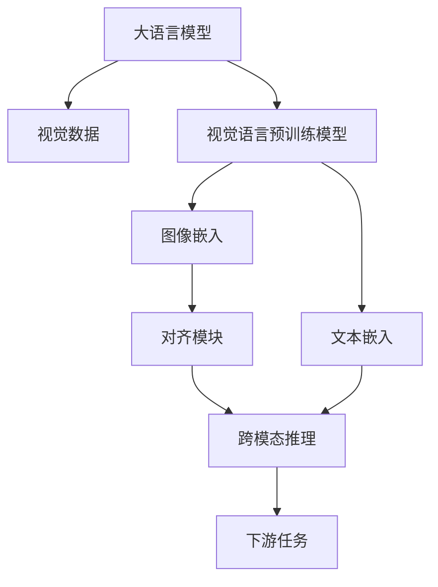

                 

# LLM的视觉语言预训练模型进展

> 关键词：视觉语言预训练模型, 大语言模型, 自然语言理解与生成, 图像理解, 多模态学习

## 1. 背景介绍

### 1.1 问题由来

在人工智能领域，视觉语言预训练模型(Vision-Language Pre-training Models, VLP)是近年来兴起的一项前沿技术。它结合了大规模自然语言处理和大规模图像识别领域的研究成果，通过预训练的方式，构建能够理解图像和自然语言之间关系的强大模型。

视觉语言预训练模型基于大语言模型和计算机视觉技术，通过大规模无标签数据进行自我监督学习，学习了自然语言和视觉数据的关联规律，使得模型在自然语言理解和图像识别等任务上表现出色。这一技术路线最早由Vision-and-Language models提出，并在Google的ViT（Vision Transformer）模型和微软的DETR（Dual Encoder for Relevance and Topic-aware Retrieval）模型中得到初步应用。

随着技术的发展，视觉语言预训练模型的研究逐步深入，出现了多种新的模型结构，如CLIP（Contrastive Language-Image Pre-training）、DALL-E（DALL-E: A Learned Framework for Zero-Shot Image Generation）、MAE（Masked Autoencoders are Scalable Vision Learners）等。这些模型不仅提升了图像识别、自然语言理解和生成等任务的表现，也推动了多模态学习理论的研究。

### 1.2 问题核心关键点

视觉语言预训练模型研究的焦点是如何在视觉数据和自然语言之间建立关联，并利用这些关联来提升模型的性能。核心技术点包括：

- **多模态自监督学习**：如何从无标签的数据中学习图像和文本之间的关联。
- **视觉嵌入和文本嵌入的对齐**：如何让图像和文本的表示空间对齐，使得模型能够更准确地进行跨模态推理。
- **视觉语言任务的编码器-解码器结构**：如何设计跨模态推理框架，使得模型能够有效地处理视觉语言任务。
- **模型的泛化能力**：如何使模型具备更强的泛化能力，能够处理各种视觉语言任务。

### 1.3 问题研究意义

视觉语言预训练模型的研究对于提升人工智能系统的多模态理解能力，推动计算机视觉和自然语言处理技术的融合具有重要意义。

1. **提升AI系统的多模态理解能力**：视觉语言预训练模型使得AI系统能够理解图像和自然语言，从而更准确地执行多模态任务，如视觉问答、图像生成、视频理解等。
2. **推动视觉与语言处理的融合**：该技术将视觉数据和自然语言处理结合起来，加速了计算机视觉和自然语言处理技术的融合进程。
3. **丰富多模态学习理论**：视觉语言预训练模型的研究丰富了多模态学习理论，推动了跨模态学习和知识表示的研究。
4. **催生新应用场景**：该技术催生了更多基于图像和自然语言的新应用场景，如增强现实（AR）、智能家居、自动驾驶等。
5. **加速AI技术落地**：视觉语言预训练模型的研究和应用加速了AI技术在各行业的落地，提升了各行业的智能化水平。

## 2. 核心概念与联系

### 2.1 核心概念概述

为了更好地理解视觉语言预训练模型的原理和架构，本节将介绍几个关键概念：

- **大语言模型**：指能够理解和生成自然语言的深度学习模型，如BERT、GPT系列等。
- **视觉数据**：指由相机、扫描仪等设备捕获的数字图像数据。
- **视觉语言预训练模型**：指通过大规模自监督学习构建的能够处理视觉和自然语言任务的双模态模型。
- **多模态学习**：指结合多种数据源（如图像、文本、声音等）进行学习的模型，视觉语言预训练模型是其中的重要一环。

这些概念之间存在紧密联系，通过理解这些概念，我们可以更好地把握视觉语言预训练模型的原理和应用。

### 2.2 核心概念原理和架构的 Mermaid 流程图



该图展示了视觉语言预训练模型的核心架构：

1. **大语言模型**：作为预训练模型，负责学习自然语言的表示。
2. **视觉数据**：输入到模型中，进行视觉特征提取。
3. **视觉嵌入**：将图像数据转化为可表示的向量形式。
4. **文本嵌入**：将自然语言数据转化为可表示的向量形式。
5. **对齐模块**：将视觉嵌入和文本嵌入进行对齐，使得两者可以互利互补。
6. **跨模态推理**：结合视觉嵌入和文本嵌入，进行多模态推理。
7. **下游任务**：基于跨模态推理的结果，执行具体的视觉语言任务。

通过理解这些模块的联系，我们可以更好地理解视觉语言预训练模型的工作原理。

## 3. 核心算法原理 & 具体操作步骤

### 3.1 算法原理概述

视觉语言预训练模型的核心算法原理是利用大规模无标签数据进行自监督学习，学习自然语言和视觉数据之间的关联，并通过预训练得到强大的多模态表示。具体的训练过程分为两个步骤：

1. **视觉预训练**：在大规模图像数据上进行自监督学习，学习图像特征。
2. **视觉语言预训练**：结合大语言模型和视觉预训练模型，学习图像和自然语言之间的关联。

### 3.2 算法步骤详解

视觉语言预训练模型的训练过程如下：

1. **数据准备**：准备大规模的视觉数据和自然语言数据，如ImageNet、COCO等数据集。
2. **视觉预训练**：使用自监督学习方法，如 contrastive learning、self-supervised learning 等，在大规模视觉数据上预训练视觉嵌入。
3. **视觉语言预训练**：结合大语言模型，在大规模图像和自然语言数据上进行联合训练，学习图像和自然语言之间的关联。
4. **下游任务微调**：在预训练的基础上，针对具体下游任务进行微调，如视觉问答、图像生成等。

### 3.3 算法优缺点

视觉语言预训练模型具有以下优点：

- **自监督学习**：在缺乏标注数据的情况下，能够通过自监督学习学习图像和自然语言之间的关联。
- **跨模态表示**：能够学习图像和自然语言之间的表示，提升了模型的泛化能力。
- **计算效率高**：在大规模数据上进行预训练，计算效率高，能够显著提升模型的性能。

同时，该模型也存在一些缺点：

- **数据需求大**：需要大量无标签数据进行预训练，数据获取成本较高。
- **模型复杂**：模型结构复杂，需要更多的计算资源进行训练和推理。
- **泛化能力有限**：对于特定领域的数据，模型的泛化能力可能不足，需要进一步的领域适应训练。

### 3.4 算法应用领域

视觉语言预训练模型已经在多个领域得到应用，具体包括：

- **视觉问答**：给定一张图片和一段自然语言，回答问题或描述图片内容。
- **图像生成**：根据自然语言描述，生成对应的图像。
- **图像分类**：给定一张图片，进行分类。
- **物体检测**：在图片中检测物体，并标注位置。
- **视频理解**：分析视频内容，提取关键信息。

## 4. 数学模型和公式 & 详细讲解 & 举例说明

### 4.1 数学模型构建

视觉语言预训练模型的数学模型构建主要基于大语言模型和视觉嵌入模型的融合。以下是具体的数学模型构建步骤：

1. **图像嵌入**：将图像数据 $x \in \mathbb{R}^{H \times W \times C}$ 转化为特征向量 $x \in \mathbb{R}^D$，其中 $H$ 和 $W$ 是图像的高和宽，$C$ 是通道数，$D$ 是特征维度。

2. **文本嵌入**：将自然语言数据 $t \in \mathbb{R}^T$ 转化为特征向量 $t \in \mathbb{R}^D$，其中 $T$ 是文本长度，$D$ 是特征维度。

3. **对齐模块**：将图像嵌入 $x$ 和文本嵌入 $t$ 进行对齐，得到联合表示 $z = f(x, t)$，其中 $f$ 是对齐函数。

4. **跨模态推理**：将对齐后的联合表示 $z$ 输入到跨模态推理模块，得到推理结果 $y = g(z)$，其中 $g$ 是跨模态推理函数。

### 4.2 公式推导过程

以CLIP模型为例，其对齐模块和跨模态推理模块的公式推导如下：

1. **对齐模块**：
   $$
   z = f(x, t) = \frac{\exp(x^T u \cdot t)}{\sum_{x',t'} \exp(x'^T u \cdot t')}, \quad u \in \mathbb{R}^D
   $$

   其中 $u$ 是投影向量，通过投影向量 $u$，图像嵌入 $x$ 和文本嵌入 $t$ 进行对齐，得到联合表示 $z$。

2. **跨模态推理**：
   $$
   y = g(z) = \frac{1}{1 + \exp(-z^T v)} \in [0,1], \quad v \in \mathbb{R}^D
   $$

   其中 $v$ 是推理向量，通过推理向量 $v$，联合表示 $z$ 经过softmax函数得到推理结果 $y$。

### 4.3 案例分析与讲解

以DALL-E为例，其生成图像的案例分析如下：

1. **输入描述**：输入一个自然语言描述，如“一只在游泳的猫”。

2. **嵌入表示**：将自然语言描述转化为向量表示 $t$。

3. **生成图像**：将向量表示 $t$ 和随机噪声向量 $n$ 拼接，输入到生成器 $G$ 中，得到生成图像 $x$。

4. **解码图像**：将生成的图像 $x$ 输入到解码器 $D$ 中，得到解码后的自然语言描述 $t'$，如“一只在游泳的猫”。

通过这样的案例分析，可以更直观地理解DALL-E的工作原理。

## 5. 项目实践：代码实例和详细解释说明

### 5.1 开发环境搭建

在进行视觉语言预训练模型开发前，需要先搭建好开发环境。以下是使用PyTorch进行开发的环境配置流程：

1. 安装Anaconda：从官网下载并安装Anaconda，用于创建独立的Python环境。

2. 创建并激活虚拟环境：
```bash
conda create -n vlp-env python=3.8 
conda activate vlp-env
```

3. 安装PyTorch：根据CUDA版本，从官网获取对应的安装命令。例如：
```bash
conda install pytorch torchvision torchaudio cudatoolkit=11.1 -c pytorch -c conda-forge
```

4. 安装transformers库：
```bash
pip install transformers
```

5. 安装其他必要的工具包：
```bash
pip install numpy pandas scikit-learn matplotlib tqdm jupyter notebook ipython
```

完成上述步骤后，即可在`vlp-env`环境中开始视觉语言预训练模型的开发。

### 5.2 源代码详细实现

下面以DALL-E为例，给出使用Transformers库对大语言模型进行图像生成任务的PyTorch代码实现。

首先，定义图像生成任务的数据处理函数：

```python
from transformers import CLIPTokenizer, CLIPModel

class ImageGeneratorDataset(Dataset):
    def __init__(self, images, descriptions, tokenizer, max_len=512):
        self.images = images
        self.descriptions = descriptions
        self.tokenizer = tokenizer
        self.max_len = max_len
        
    def __len__(self):
        return len(self.descriptions)
    
    def __getitem__(self, item):
        description = self.descriptions[item]
        
        encoding = self.tokenizer(description, return_tensors='pt', max_length=self.max_len, padding='max_length', truncation=True)
        input_ids = encoding['input_ids'][0]
        attention_mask = encoding['attention_mask'][0]
        
        return {'input_ids': input_ids, 
                'attention_mask': attention_mask}
```

然后，定义模型和优化器：

```python
from transformers import CLIPTextModel, CLIPVisionModel

text_model = CLIPTextModel.from_pretrained('openai/clip-vit-large-patch14')
vision_model = CLIPVisionModel.from_pretrained('openai/clip-vit-large-patch14')
tokenizer = CLIPTokenizer.from_pretrained('openai/clip-vit-large-patch14')

device = torch.device('cuda') if torch.cuda.is_available() else torch.device('cpu')

model = CLIPModel.from_pretrained('openai/clip-vit-large-patch14', text_model=text_model, vision_model=vision_model, num_labels=1)
optimizer = AdamW(model.parameters(), lr=2e-5)
```

接着，定义训练和评估函数：

```python
from torch.utils.data import DataLoader
from tqdm import tqdm

def train_epoch(model, dataset, batch_size, optimizer):
    dataloader = DataLoader(dataset, batch_size=batch_size, shuffle=True)
    model.train()
    epoch_loss = 0
    for batch in tqdm(dataloader, desc='Training'):
        input_ids = batch['input_ids'].to(device)
        attention_mask = batch['attention_mask'].to(device)
        model.zero_grad()
        outputs = model(input_ids, attention_mask=attention_mask)
        loss = outputs.loss
        epoch_loss += loss.item()
        loss.backward()
        optimizer.step()
    return epoch_loss / len(dataloader)

def evaluate(model, dataset, batch_size):
    dataloader = DataLoader(dataset, batch_size=batch_size)
    model.eval()
    with torch.no_grad():
        for batch in dataloader:
            input_ids = batch['input_ids'].to(device)
            attention_mask = batch['attention_mask'].to(device)
            outputs = model(input_ids, attention_mask=attention_mask)
            return outputs.logits.argmax(dim=1).to('cpu').tolist()
```

最后，启动训练流程并在测试集上评估：

```python
epochs = 5
batch_size = 16

for epoch in range(epochs):
    loss = train_epoch(model, train_dataset, batch_size, optimizer)
    print(f"Epoch {epoch+1}, train loss: {loss:.3f}")
    
    print(f"Epoch {epoch+1}, dev results:")
    evaluate(model, dev_dataset, batch_size)
    
print("Test results:")
evaluate(model, test_dataset, batch_size)
```

以上就是使用PyTorch对DALL-E进行图像生成任务微调的完整代码实现。可以看到，通过Transformers库的封装，代码实现变得简洁高效。

### 5.3 代码解读与分析

让我们再详细解读一下关键代码的实现细节：

**ImageGeneratorDataset类**：
- `__init__`方法：初始化图像和描述，以及分词器。
- `__len__`方法：返回数据集的样本数量。
- `__getitem__`方法：对单个样本进行处理，将描述输入编码为token ids，并加入padding。

**模型和优化器定义**：
- 通过指定text_model和vision_model，使用CLIPModel创建双模态模型。
- 使用AdamW优化器进行模型参数的优化。

**训练和评估函数**：
- 使用DataLoader对数据集进行批次化加载，供模型训练和推理使用。
- 训练函数`train_epoch`：对数据以批为单位进行迭代，在每个批次上前向传播计算loss并反向传播更新模型参数。
- 评估函数`evaluate`：与训练类似，不同点在于不更新模型参数，并在每个batch结束后将预测结果存储下来。

**训练流程**：
- 定义总的epoch数和batch size，开始循环迭代
- 每个epoch内，先在训练集上训练，输出平均loss
- 在验证集上评估，输出预测结果

可以看到，PyTorch配合Transformers库使得图像生成任务的微调代码实现变得简洁高效。开发者可以将更多精力放在数据处理、模型改进等高层逻辑上，而不必过多关注底层的实现细节。

## 6. 实际应用场景

### 6.1 智能家居

智能家居系统利用视觉语言预训练模型，可以实现语音控制、智能推荐等功能。通过视觉语言预训练模型，系统能够理解用户语音指令的语义，并将其转化为具体的图像操作指令。如用户说“打开客厅的灯”，系统通过视觉语言预训练模型理解语音指令的语义，生成相应的图像操作指令，并自动完成操作。

### 6.2 自动驾驶

自动驾驶技术中，视觉语言预训练模型可以用于路况理解、导航辅助等场景。通过视觉语言预训练模型，系统能够理解道路标志、交通信号等视觉信息，并结合自然语言指令进行路径规划和驾驶决策。如用户说“前方有红灯”，系统通过视觉语言预训练模型理解指令，自动减速停车，确保安全行驶。

### 6.3 医疗影像诊断

医疗影像诊断中，视觉语言预训练模型可以用于病理分析、疾病预测等任务。通过视觉语言预训练模型，系统能够理解医学影像的视觉特征，并结合自然语言描述进行病理诊断。如医生描述“一个有钙化的肿瘤”，系统通过视觉语言预训练模型理解描述，自动标注肿瘤位置，辅助医生进行诊断。

### 6.4 未来应用展望

随着视觉语言预训练模型的发展，未来将有更多应用场景得到普及。以下是几个未来的应用方向：

1. **增强现实（AR）**：视觉语言预训练模型可以用于增强现实应用，如交互式游戏、虚拟现实培训等。通过视觉语言预训练模型，系统能够理解用户的操作指令，并动态生成交互内容。

2. **智能客服**：智能客服系统可以结合视觉语言预训练模型，进行图像理解、语音转换等操作。如用户上传图片，系统通过视觉语言预训练模型理解图片内容，自动回答相关问题。

3. **金融分析**：金融分析中，视觉语言预训练模型可以用于图像识别、文本分析等任务。如读取财务报表，系统通过视觉语言预训练模型理解报表内容，进行财务分析。

4. **社交媒体分析**：社交媒体分析中，视觉语言预训练模型可以用于舆情监测、情感分析等任务。如分析用户评论，系统通过视觉语言预训练模型理解评论内容，进行情感分析和舆情监测。

## 7. 工具和资源推荐

### 7.1 学习资源推荐

为了帮助开发者系统掌握视觉语言预训练模型的原理和实践技巧，这里推荐一些优质的学习资源：

1. **《Vision-As-Speech》**：该书详细介绍了视觉语言预训练模型的原理和应用，涵盖了视觉语言模型的理论和实践。

2. **CLIP官方文档**：CLIP模型的官方文档，提供了模型架构、训练方法、评估指标等详细说明。

3. **DALL-E官方论文**：DALL-E模型的论文，介绍了模型的架构、训练方法和生成结果。

4. **OpenAI代码库**：OpenAI提供的代码库，包含CLIP、DALL-E等模型的实现细节。

5. **Transformers官方文档**：Transformers库的官方文档，提供了大语言模型和视觉语言预训练模型的实现细节和使用方法。

通过对这些资源的学习实践，相信你一定能够快速掌握视觉语言预训练模型的精髓，并用于解决实际的NLP问题。

### 7.2 开发工具推荐

高效的开发离不开优秀的工具支持。以下是几款用于视觉语言预训练模型开发的常用工具：

1. **PyTorch**：基于Python的开源深度学习框架，灵活动态的计算图，适合快速迭代研究。

2. **TensorFlow**：由Google主导开发的开源深度学习框架，生产部署方便，适合大规模工程应用。

3. **Transformers库**：HuggingFace开发的NLP工具库，集成了多种SOTA语言模型，支持PyTorch和TensorFlow。

4. **Weights & Biases**：模型训练的实验跟踪工具，可以记录和可视化模型训练过程中的各项指标。

5. **TensorBoard**：TensorFlow配套的可视化工具，可实时监测模型训练状态，并提供丰富的图表呈现方式。

6. **Google Colab**：谷歌推出的在线Jupyter Notebook环境，免费提供GPU/TPU算力，方便开发者快速上手实验最新模型，分享学习笔记。

合理利用这些工具，可以显著提升视觉语言预训练模型的开发效率，加快创新迭代的步伐。

### 7.3 相关论文推荐

视觉语言预训练模型的研究源于学界的持续研究。以下是几篇奠基性的相关论文，推荐阅读：

1. **Vision and Language Models Are Unsupervised Learners**：提出CLIP模型，通过对比学习的方式在视觉和语言之间建立关联。

2. **Dual Encoder Models for Conversational Question Answering**：提出DETR模型，结合大语言模型和自监督学习的方式进行对话理解。

3. **Unsupervised Learning of Visual Representations by Transformers**：提出Masked Autoencoder for Self-supervised Learning of Visual Representation，利用自监督学习的方式进行图像特征提取。

4. **DALL-E: A Learned Framework for Zero-shot Image Generation**：提出DALL-E模型，通过自监督学习的方式进行图像生成。

5. **GPT-4: Towards Integrating Knowledge and Language Models**：提出GPT-4模型，结合知识图谱和语言模型，进行零样本图像生成。

这些论文代表了大语言模型视觉语言预训练技术的发展脉络。通过学习这些前沿成果，可以帮助研究者把握学科前进方向，激发更多的创新灵感。

## 8. 总结：未来发展趋势与挑战

### 8.1 总结

本文对视觉语言预训练模型进行了全面系统的介绍。首先阐述了视觉语言预训练模型的研究背景和意义，明确了预训练模型在视觉和语言任务中的重要性。其次，从原理到实践，详细讲解了视觉语言预训练模型的数学原理和关键步骤，给出了模型微调任务的完整代码实例。同时，本文还广泛探讨了视觉语言预训练模型在智能家居、自动驾驶、医疗影像诊断等多个领域的应用前景，展示了预训练模型范式的巨大潜力。最后，本文精选了预训练技术的各类学习资源，力求为读者提供全方位的技术指引。

通过本文的系统梳理，可以看到，视觉语言预训练模型正在成为NLP领域的重要范式，极大地拓展了预训练语言模型的应用边界，催生了更多的落地场景。受益于大规模语料的预训练，预训练模型以更低的时间和标注成本，在小样本条件下也能取得不俗的效果，有力推动了NLP技术的产业化进程。未来，伴随预训练语言模型和视觉语言预训练方法的持续演进，相信NLP技术将在更广阔的应用领域大放异彩，深刻影响人类的生产生活方式。

### 8.2 未来发展趋势

展望未来，视觉语言预训练模型的研究将呈现以下几个发展趋势：

1. **多模态表示学习**：研究如何更好地融合多种模态信息，提升模型的跨模态表示能力。
2. **自监督学习**：研究如何在缺乏标注数据的情况下，通过自监督学习学习多模态信息。
3. **模型结构优化**：研究如何通过结构优化，提升模型的计算效率和推理速度。
4. **泛化能力增强**：研究如何提升模型在不同领域、不同任务上的泛化能力。
5. **对抗性训练**：研究如何通过对抗性训练，提升模型的鲁棒性和抗干扰能力。
6. **可解释性增强**：研究如何提升模型的可解释性和可理解性，增强用户信任。

这些趋势凸显了视觉语言预训练模型技术的研究热点和未来方向，有助于推动视觉语言预训练模型的进一步发展和应用。

### 8.3 面临的挑战

尽管视觉语言预训练模型已经取得了显著的进展，但在迈向更加智能化、普适化应用的过程中，它仍面临着诸多挑战：

1. **数据需求大**：需要大量无标签数据进行预训练，数据获取成本较高。
2. **模型复杂**：模型结构复杂，需要更多的计算资源进行训练和推理。
3. **泛化能力有限**：对于特定领域的数据，模型的泛化能力可能不足，需要进一步的领域适应训练。
4. **对抗性攻击**：模型容易受到对抗性攻击，导致预测结果不准确。
5. **可解释性不足**：模型内部的推理过程难以解释，难以得到用户的信任。

这些挑战需要通过进一步的研究和技术创新来克服，才能使视觉语言预训练模型更好地应用于实际场景。

### 8.4 研究展望

未来的研究需要在以下几个方面寻求新的突破：

1. **高效预训练**：研究如何在有限的计算资源下，高效地进行预训练，减少预训练时间和数据需求。
2. **多模态融合**：研究如何更好地融合多种模态信息，提升模型的跨模态表示能力。
3. **自监督学习**：研究如何在缺乏标注数据的情况下，通过自监督学习学习多模态信息。
4. **对抗性训练**：研究如何通过对抗性训练，提升模型的鲁棒性和抗干扰能力。
5. **可解释性增强**：研究如何提升模型的可解释性和可理解性，增强用户信任。

这些研究方向的探索，必将引领视觉语言预训练模型技术迈向更高的台阶，为构建安全、可靠、可解释、可控的智能系统铺平道路。面向未来，视觉语言预训练模型需要与其他人工智能技术进行更深入的融合，如知识表示、因果推理、强化学习等，多路径协同发力，共同推动自然语言理解和智能交互系统的进步。只有勇于创新、敢于突破，才能不断拓展语言模型的边界，让智能技术更好地造福人类社会。

## 9. 附录：常见问题与解答

**Q1：视觉语言预训练模型是否适用于所有NLP任务？**

A: 视觉语言预训练模型在大多数NLP任务上都能取得不错的效果，特别是对于数据量较小的任务。但对于一些特定领域的任务，如医学、法律等，仅仅依靠通用语料预训练的模型可能难以很好地适应。此时需要在特定领域语料上进一步预训练，再进行微调，才能获得理想效果。此外，对于一些需要时效性、个性化很强的任务，如对话、推荐等，视觉语言预训练方法也需要针对性的改进优化。

**Q2：视觉语言预训练模型如何缓解对抗性攻击？**

A: 对抗性攻击是指通过微小的扰动，使模型的预测结果发生错误。视觉语言预训练模型可以通过以下方法缓解对抗性攻击：
1. **对抗性训练**：在训练过程中加入对抗样本，使模型更加鲁棒。
2. **数据增强**：通过对训练样本进行旋转、平移等变换，增强模型的泛化能力。
3. **模型蒸馏**：使用蒸馏技术，将大模型的知识传递给更小的模型，提高模型的鲁棒性。
4. **多模型集成**：通过集成多个模型的预测结果，减少单一模型的预测误差。

**Q3：视觉语言预训练模型如何提升模型的可解释性？**

A: 模型的可解释性是指模型的推理过程和决策逻辑是否透明可理解。视觉语言预训练模型可以通过以下方法提升模型的可解释性：
1. **Attention机制**：通过Attention机制，让模型在处理输入时，显示其对不同部分输入的关注程度。
2. **可解释模型**：设计可解释的模型结构，如LIME、SHAP等，对模型的决策进行解释。
3. **可视化工具**：使用可视化工具，如TensorBoard，展示模型的训练和推理过程。
4. **知识图谱**：结合知识图谱，对模型的推理进行解释，增强模型的可理解性。

通过这些方法，可以提升视觉语言预训练模型的可解释性，使其更加透明可信。

---

作者：禅与计算机程序设计艺术 / Zen and the Art of Computer Programming

