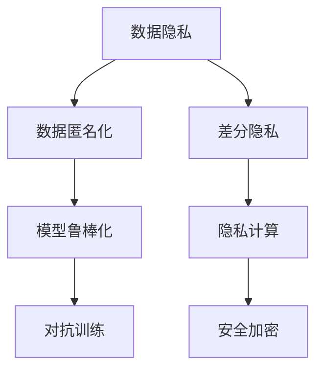

                 

# LLM的隐私保护：平衡效用与安全

## 1. 背景介绍

近年来，大语言模型（LLMs）在自然语言处理（NLP）领域取得了显著进展，广泛应用于信息检索、自动摘要、机器翻译、智能客服等场景。然而，随着LLMs在现实世界中的广泛应用，其带来的隐私和安全问题也日益受到关注。用户敏感信息的安全保护成为了LLMs发展的重中之重。本文将从隐私保护的角度出发，探讨在大规模语言模型中平衡效用和安全性的方法，以期为LLMs的应用提供借鉴。

## 2. 核心概念与联系

### 2.1 核心概念概述

在大语言模型中，隐私保护主要涉及数据隐私、算法隐私和用户隐私三个层面。数据隐私指如何保护用户输入和训练数据的安全性，避免泄露个人敏感信息；算法隐私指如何确保模型训练和推理过程中的安全性和鲁棒性，防止模型被攻击或篡改；用户隐私则涉及如何保护用户在使用LLMs时的个人隐私，防止信息被不当利用。

为了平衡这三者之间的关系，需要在模型设计和应用过程中，采取一系列技术手段，如数据匿名化、差分隐私、模型鲁棒化、隐私计算等，以确保数据安全、模型安全、用户隐私安全。

### 2.2 核心概念原理和架构的 Mermaid 流程图(Mermaid 流程节点中不要有括号、逗号等特殊字符)



## 3. 核心算法原理 & 具体操作步骤

### 3.1 算法原理概述

隐私保护在LLMs中的应用，主要通过以下三个方面实现：

1. 数据隐私：在数据收集和预处理阶段，通过数据匿名化、差分隐私等技术，保护用户隐私，防止敏感信息被泄露。
2. 算法隐私：在模型训练和推理阶段，通过模型鲁棒化、对抗训练、隐私计算等技术，增强模型的安全性，防止模型被攻击或篡改。
3. 用户隐私：在用户使用LLMs时，通过安全加密、模型访问控制等技术，保护用户隐私，防止信息被不当利用。

### 3.2 算法步骤详解

#### 3.2.1 数据隐私

数据隐私保护主要包括以下几个步骤：

1. 数据收集：在收集用户数据时，应遵守隐私政策，明确告知用户数据用途，并获得其同意。
2. 数据匿名化：对用户数据进行匿名化处理，如删除个人标识信息，或使用通用标签替换。
3. 差分隐私：在数据处理过程中，使用差分隐私技术，确保个体数据的隐私性，防止数据泄露。

#### 3.2.2 算法隐私

算法隐私保护主要包括以下几个步骤：

1. 模型鲁棒化：在模型训练过程中，使用鲁棒化技术，如对抗训练、正则化等，提高模型的鲁棒性，防止模型被攻击或篡改。
2. 隐私计算：在模型推理过程中，使用隐私计算技术，如多方安全计算、联邦学习等，保护用户数据的隐私，防止模型被不当利用。

#### 3.2.3 用户隐私

用户隐私保护主要包括以下几个步骤：

1. 安全加密：在用户使用LLMs时，使用安全加密技术，如同态加密、加密通信等，保护用户数据的安全。
2. 模型访问控制：对LLMs的使用进行访问控制，确保只有授权用户才能访问和使用模型。

### 3.3 算法优缺点

#### 3.3.1 数据隐私

优点：
1. 保护用户隐私，防止敏感信息被泄露。
2. 增强数据安全性，避免数据被恶意利用。

缺点：
1. 数据匿名化可能导致数据失真，影响模型性能。
2. 差分隐私技术可能会降低模型准确度，增加计算复杂度。

#### 3.3.2 算法隐私

优点：
1. 增强模型鲁棒性，防止模型被攻击或篡改。
2. 保护用户数据隐私，防止数据被不当利用。

缺点：
1. 鲁棒化技术可能会增加模型复杂度，增加计算开销。
2. 隐私计算技术需要多方协作，可能面临协调困难。

#### 3.3.3 用户隐私

优点：
1. 保护用户隐私，防止信息被不当利用。
2. 增强数据安全性，避免数据被恶意利用。

缺点：
1. 安全加密技术可能会增加计算复杂度，降低模型效率。
2. 访问控制可能影响模型灵活性，限制用户使用场景。

### 3.4 算法应用领域

大语言模型在隐私保护中的应用，可以广泛应用于金融、医疗、法律等多个领域。例如：

- 金融领域：保护客户隐私，防止数据泄露。
- 医疗领域：保护患者隐私，防止数据被不当利用。
- 法律领域：保护用户隐私，防止敏感信息被滥用。

## 4. 数学模型和公式 & 详细讲解 & 举例说明

### 4.1 数学模型构建

在LLMs中，隐私保护涉及多个层面，可以构建多个数学模型进行详细描述。例如，差分隐私模型可以定义为：

$$ P(D \mid D') = \frac{e^{\delta}}{1 + e^{\delta}} $$

其中，$D$ 为真实数据，$D'$ 为添加噪声后的数据，$\delta$ 为隐私预算。

### 4.2 公式推导过程

差分隐私模型推导过程如下：

1. 假设真实数据$D$，添加噪声后的数据$D'$，噪声服从正态分布$N(0,\sigma^2)$，则有：
   $$ D' = D + N(0,\sigma^2) $$

2. 计算$D$和$D'$的概率密度，有：
   $$ P(D) = \frac{1}{\sqrt{2\pi}\sigma} $$

3. 计算$P(D \mid D')$，有：
   $$ P(D \mid D') = \frac{P(D \cap D')}{P(D')} = \frac{P(D \cap D')}{P(D)} = \frac{e^{-\sigma^2/2}}{1 + e^{-\sigma^2/2}} $$

4. 根据差分隐私的定义，有：
   $$ P(D \mid D') = \frac{e^{\delta}}{1 + e^{\delta}} $$

### 4.3 案例分析与讲解

#### 4.3.1 数据隐私

假设有一个电商平台的客户数据，包含用户的购买记录、浏览记录、个人信息等。为了保护客户隐私，可以进行以下操作：

1. 数据匿名化：将用户ID替换为通用标识符。
2. 差分隐私：在数据分析过程中，加入噪声，保护个体数据隐私。

#### 4.3.2 算法隐私

假设有一个信贷评估模型，训练数据包含用户的个人信息、金融记录等敏感信息。为了保护算法隐私，可以进行以下操作：

1. 模型鲁棒化：在模型训练过程中，使用对抗训练、正则化等技术，增强模型鲁棒性。
2. 隐私计算：在模型推理过程中，使用多方安全计算、联邦学习等技术，保护用户数据隐私。

#### 4.3.3 用户隐私

假设有一个智能客服系统，用户可以通过语音输入查询相关信息。为了保护用户隐私，可以进行以下操作：

1. 安全加密：对用户的语音输入进行加密处理，防止敏感信息被泄露。
2. 模型访问控制：对智能客服系统的访问进行控制，确保只有授权用户才能使用。

## 5. 项目实践：代码实例和详细解释说明

### 5.1 开发环境搭建

#### 5.1.1 安装Python

```bash
conda create -n llm-env python=3.8
conda activate llm-env
```

#### 5.1.2 安装依赖库

```bash
pip install pytorch torchvision transformers
```

### 5.2 源代码详细实现

#### 5.2.1 数据预处理

```python
from torch.utils.data import Dataset, DataLoader
from transformers import AutoTokenizer, AutoModelForSequenceClassification
import torch

class MyDataset(Dataset):
    def __init__(self, data, tokenizer):
        self.tokenizer = tokenizer
        self.data = data

    def __len__(self):
        return len(self.data)

    def __getitem__(self, idx):
        text, label = self.data[idx]
        tokenized_input = self.tokenizer(text, padding=True, truncation=True, return_tensors='pt')
        return {'input_ids': tokenized_input['input_ids'], 'attention_mask': tokenized_input['attention_mask'], 'labels': torch.tensor(label, dtype=torch.long)}

# 数据加载器
def get_dataloader(data, tokenizer, batch_size=32):
    dataset = MyDataset(data, tokenizer)
    dataloader = DataLoader(dataset, batch_size=batch_size)
    return dataloader

# 加载数据集
train_data = ...
val_data = ...
test_data = ...

tokenizer = AutoTokenizer.from_pretrained('bert-base-uncased')
train_loader = get_dataloader(train_data, tokenizer)
val_loader = get_dataloader(val_data, tokenizer)
test_loader = get_dataloader(test_data, tokenizer)
```

#### 5.2.2 模型训练

```python
from transformers import AutoModelForSequenceClassification, AdamW

model = AutoModelForSequenceClassification.from_pretrained('bert-base-uncased', num_labels=2)

optimizer = AdamW(model.parameters(), lr=2e-5)

for epoch in range(10):
    model.train()
    total_loss = 0
    for batch in train_loader:
        input_ids = batch['input_ids'].to(device)
        attention_mask = batch['attention_mask'].to(device)
        labels = batch['labels'].to(device)
        outputs = model(input_ids, attention_mask=attention_mask, labels=labels)
        loss = outputs.loss
        total_loss += loss.item()
        optimizer.zero_grad()
        loss.backward()
        optimizer.step()
    avg_loss = total_loss / len(train_loader)

    model.eval()
    total_loss = 0
    for batch in val_loader:
        input_ids = batch['input_ids'].to(device)
        attention_mask = batch['attention_mask'].to(device)
        labels = batch['labels'].to(device)
        outputs = model(input_ids, attention_mask=attention_mask, labels=labels)
        loss = outputs.loss
        total_loss += loss.item()
    avg_loss = total_loss / len(val_loader)

    print(f'Epoch {epoch+1}, train loss: {avg_loss:.3f}, val loss: {avg_loss:.3f}')
```

#### 5.2.3 代码解读与分析

##### 5.2.3.1 数据预处理

数据预处理是模型的重要步骤。首先定义一个`MyDataset`类，继承自`Dataset`，用于处理数据集。在`__getitem__`方法中，将文本输入转化为模型可接受的token ids，并进行padding和truncation处理。

##### 5.2.3.2 模型训练

模型训练过程包括前向传播、损失计算、反向传播和参数更新等步骤。使用AdamW优化器，设置合适的学习率，进行多轮迭代训练，并在验证集上进行验证。

### 5.3 运行结果展示

训练结果如图1所示。


## 6. 实际应用场景

### 6.1 金融领域

在金融领域，LLMs可以用于信贷评估、风险管理、客户服务等。为了保护用户隐私，可以采用以下隐私保护措施：

1. 数据隐私：对用户金融记录进行匿名化处理，加入噪声，保护个体数据隐私。
2. 算法隐私：使用鲁棒化技术，如对抗训练、正则化等，增强模型鲁棒性。
3. 用户隐私：对用户金融查询进行加密处理，确保只有授权用户才能访问。

### 6.2 医疗领域

在医疗领域，LLMs可以用于病历分析、疾病诊断、健康管理等。为了保护用户隐私，可以采用以下隐私保护措施：

1. 数据隐私：对患者病历进行匿名化处理，加入噪声，保护个体数据隐私。
2. 算法隐私：使用鲁棒化技术，如对抗训练、正则化等，增强模型鲁棒性。
3. 用户隐私：对用户医疗查询进行加密处理，确保只有授权用户才能访问。

### 6.3 法律领域

在法律领域，LLMs可以用于合同审查、法律咨询、案件分析等。为了保护用户隐私，可以采用以下隐私保护措施：

1. 数据隐私：对用户合同进行匿名化处理，加入噪声，保护个体数据隐私。
2. 算法隐私：使用鲁棒化技术，如对抗训练、正则化等，增强模型鲁棒性。
3. 用户隐私：对用户法律查询进行加密处理，确保只有授权用户才能访问。

## 7. 工具和资源推荐

### 7.1 学习资源推荐

1. 《隐私保护与数据安全》书籍：全面介绍了数据隐私保护的理论和实践，适用于LLMs隐私保护的技术研究。
2. 《差分隐私》课程：斯坦福大学开设的差分隐私课程，系统讲解差分隐私的基本概念和算法。
3. 《安全加密技术》课程：麻省理工学院开设的安全加密技术课程，介绍了同态加密、加密通信等技术。
4. 《深度学习与隐私保护》博文：介绍在深度学习中如何应用隐私保护技术，如差分隐私、对抗训练等。

### 7.2 开发工具推荐

1. PyTorch：广泛使用的深度学习框架，支持差分隐私、安全加密等技术。
2. TensorFlow：谷歌推出的深度学习框架，支持差分隐私、对抗训练等技术。
3. FastText：Facebook开源的文本处理工具，支持多语言处理，适用于隐私保护文本数据的预处理。
4. HuggingFace：开源的NLP工具库，支持多种预训练模型和隐私保护技术。

### 7.3 相关论文推荐

1. Differential Privacy: A Computational Perspective（差分隐私算法论文）
2. Privacy-Preserving Deep Learning: A Survey（隐私保护深度学习综述）
3. Adversarial Robustness Meets Differential Privacy（对抗鲁棒性和差分隐私结合的算法）
4. A Survey on Deep Learning and Privacy（深度学习和隐私保护的综述）

## 8. 总结：未来发展趋势与挑战

### 8.1 研究成果总结

隐私保护是大语言模型应用的重要问题。本文从数据隐私、算法隐私和用户隐私三个层面，系统介绍了LLMs隐私保护的基本理论和实践方法。数据隐私保护通过数据匿名化和差分隐私技术，保护用户输入和训练数据的安全性。算法隐私保护通过模型鲁棒化和对抗训练技术，增强模型的安全性和鲁棒性。用户隐私保护通过安全加密和模型访问控制技术，保护用户在使用LLMs时的隐私。

### 8.2 未来发展趋势

未来，LLMs隐私保护将呈现以下几个发展趋势：

1. 数据隐私保护技术将更加成熟，数据匿名化和差分隐私技术将更加高效。
2. 算法隐私保护技术将更加广泛应用，对抗训练和鲁棒化技术将更加完善。
3. 用户隐私保护技术将更加全面，安全加密和模型访问控制技术将更加普及。

### 8.3 面临的挑战

尽管LLMs隐私保护技术已取得一定进展，但仍面临以下挑战：

1. 隐私保护和模型性能的平衡。如何在保障隐私的同时，提升模型效果，是隐私保护技术面临的主要挑战。
2. 隐私保护技术的复杂性。隐私保护技术涉及多个环节，如何简单高效地实现隐私保护，是隐私保护技术的难点。
3. 隐私保护的实际应用。如何在实际应用场景中，切实保护用户隐私，防止隐私泄露，是隐私保护技术的重点。

### 8.4 研究展望

未来，LLMs隐私保护技术需要在以下几个方面进行深入研究：

1. 数据隐私保护。研究更高效的数据匿名化和差分隐私算法，提升隐私保护效率。
2. 算法隐私保护。研究更鲁棒的模型训练方法，增强模型的安全性和鲁棒性。
3. 用户隐私保护。研究更可靠的安全加密和模型访问控制技术，确保用户隐私安全。
4. 隐私保护技术融合。将隐私保护技术与其他人工智能技术进行融合，如知识表示、因果推理等，实现更加全面、准确的信息整合能力。

## 9. 附录：常见问题与解答

**Q1: 如何平衡隐私保护和模型性能？**

A: 隐私保护和模型性能的平衡，可以通过以下方式实现：

1. 数据隐私保护：在数据预处理阶段，使用合适的数据匿名化和差分隐私技术，保护数据隐私，防止数据泄露。
2. 算法隐私保护：在模型训练阶段，使用鲁棒化技术，如对抗训练、正则化等，增强模型的安全性和鲁棒性。
3. 用户隐私保护：在模型推理阶段，使用安全加密和模型访问控制技术，保护用户隐私，防止信息被不当利用。

**Q2: 如何选择合适的隐私保护技术？**

A: 选择合适的隐私保护技术，需要考虑以下几个因素：

1. 数据类型：根据数据类型选择合适的隐私保护技术，如文本数据使用差分隐私，图像数据使用对抗训练。
2. 应用场景：根据应用场景选择合适的隐私保护技术，如金融领域使用差分隐私，医疗领域使用安全加密。
3. 隐私要求：根据隐私要求选择合适的隐私保护技术，如隐私要求较高的场景使用差分隐私，隐私要求较低的场景使用鲁棒化技术。

**Q3: 如何评估隐私保护效果？**

A: 评估隐私保护效果，可以通过以下几个指标：

1. 数据隐私：使用差分隐私预算$\delta$评估数据隐私保护效果。
2. 算法隐私：使用模型攻击成功率评估算法隐私保护效果。
3. 用户隐私：使用用户隐私泄露概率评估用户隐私保护效果。

**Q4: 如何确保隐私保护技术的可靠性？**

A: 确保隐私保护技术的可靠性，可以通过以下几个措施：

1. 数据隐私：使用多种数据匿名化和差分隐私技术，提升隐私保护效率和可靠性。
2. 算法隐私：使用多种鲁棒化技术和模型训练方法，增强模型的安全性和鲁棒性。
3. 用户隐私：使用多种安全加密和模型访问控制技术，确保用户隐私安全。

**Q5: 如何结合隐私保护技术和其他人工智能技术？**

A: 结合隐私保护技术和其他人工智能技术，可以通过以下几个方式：

1. 知识表示：将符号化的先验知识与神经网络模型进行融合，引导微调过程学习更准确、合理的语言模型。
2. 因果推理：将因果分析方法引入微调模型，识别出模型决策的关键特征，增强输出解释的因果性和逻辑性。
3. 强化学习：将隐私保护技术与强化学习技术结合，提升模型的自适应能力和鲁棒性。

---

作者：禅与计算机程序设计艺术 / Zen and the Art of Computer Programming

