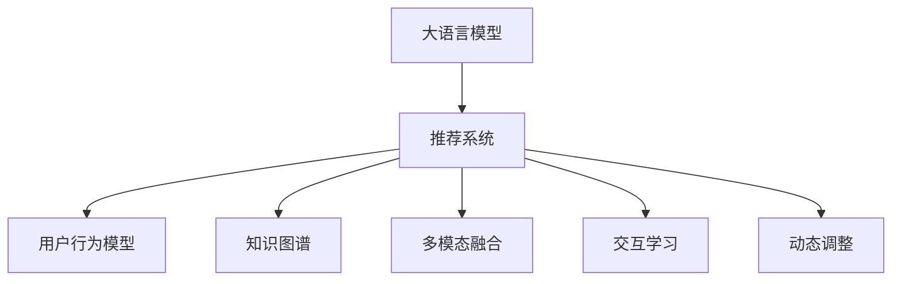

                 

# LLM知识丰富性在打破推荐系统问题上的优势

## 1. 背景介绍

### 1.1 问题由来

在推荐系统中，如何最大化用户满意度、提升推荐质量、突破数据稀疏性问题是当前研究的热点和难点。随着个性化需求的增长，传统的基于内容的推荐方法无法满足用户的多样性和复杂性需求。而协同过滤方法虽然能够挖掘用户间的相似性，但同样面临数据稀疏性、冷启动等问题。

近年来，大语言模型（Large Language Model, LLM）以其丰富的知识储备和泛化能力在自然语言处理领域取得了突破性进展，使得其在推荐系统中的应用成为一个值得探索的新方向。通过将LLM的泛化能力和推荐系统的推荐能力相结合，可以打破传统的推荐局限，从更深层次和更全面的视角理解用户需求和偏好，实现更精准、更个性化的推荐。

### 1.2 问题核心关键点

在推荐系统中，LLM的知识丰富性可以通过以下方式发挥优势：

- **泛化能力**：LLM在预训练过程中掌握了大量的语言知识，可以在缺乏具体数据的情况下，利用泛化能力预测用户行为。
- **上下文理解**：LLM能够理解复杂的上下文信息，捕捉用户语境中的隐含需求和偏好，提升推荐的准确性。
- **多模态融合**：LLM可以融合文本、图像、视频等多种模态的信息，提供更丰富、更全面的推荐结果。
- **交互学习**：LLM可以在用户与系统的交互过程中，持续学习用户行为，适应变化的需求。
- **动态调整**：LLM可以通过动态调整模型参数，适应实时数据的更新，提高推荐的时效性和相关性。

### 1.3 问题研究意义

利用LLM知识丰富性在推荐系统中的应用，对于提升推荐系统性能、满足用户个性化需求、推动推荐技术发展具有重要意义：

- **提升推荐质量**：通过融合LLM的泛化能力和推荐系统算法，可以有效突破数据稀疏性，提升推荐相关性和准确性。
- **个性化推荐**：LLM能够捕捉用户隐含需求，提供更贴合用户偏好的个性化推荐。
- **动态调整能力**：LLM可以根据实时数据更新模型参数，实现动态推荐，提升推荐系统的时效性和适应性。
- **促进交叉领域发展**：LLM与推荐系统的结合，推动了NLP技术和推荐技术的交叉应用，加速了人工智能技术的落地。
- **赋能产业升级**：通过提升推荐质量，推动电商、媒体、社交等领域的智能化转型，提升用户体验和运营效率。

## 2. 核心概念与联系

### 2.1 核心概念概述

在推荐系统中，利用LLM知识丰富性的关键在于构建一个融合LLM和推荐算法的新模型。以下是几个核心概念的概述：

- **大语言模型（LLM）**：通过预训练学习到大量语言知识，具备强大的语言理解和生成能力。
- **推荐系统**：通过收集用户行为数据，为用户推荐其可能感兴趣的商品或内容。
- **用户行为模型**：通过用户的历史行为数据训练得到，用于预测用户可能感兴趣的项目。
- **知识图谱**：包含实体、关系、属性等信息的知识库，用于增强推荐系统的语义理解能力。
- **多模态融合**：结合文本、图像、视频等多模态信息，提升推荐系统的多样性和准确性。
- **交互学习**：通过用户与系统的互动，持续更新推荐模型，提升其对用户需求的理解。
- **动态调整**：根据实时数据动态调整推荐模型参数，提高推荐的及时性和适应性。

这些核心概念之间的逻辑关系可以通过以下Mermaid流程图来展示：



这个流程图展示了大语言模型在推荐系统中的应用逻辑：

1. 大语言模型通过预训练获得语言知识。
2. 推荐系统通过用户行为模型、知识图谱、多模态融合等技术提供推荐服务。
3. 交互学习增强推荐模型的适应性。
4. 动态调整提升推荐系统的时效性和相关性。

## 3. 核心算法原理 & 具体操作步骤

### 3.1 算法原理概述

基于LLM知识丰富性的推荐系统，其核心思想是利用LLM的泛化能力和推荐系统的算法结合，构建一个能够理解用户需求、捕捉用户隐含偏好的推荐模型。具体的算法流程如下：

1. **预训练LLM**：在大量无标签文本数据上进行预训练，学习语言知识。
2. **构建用户行为模型**：根据用户历史行为数据训练得到用户行为模型，用于预测用户偏好。
3. **融合知识图谱**：将知识图谱中的实体、关系等信息融合到推荐系统中，提升推荐的多样性和准确性。
4. **多模态融合**：结合文本、图像、视频等多种模态的信息，提升推荐系统的多样性和覆盖范围。
5. **交互学习**：通过用户与系统的互动，持续更新推荐模型，提高其对用户需求的理解。
6. **动态调整**：根据实时数据动态调整推荐模型参数，提高推荐的及时性和适应性。

### 3.2 算法步骤详解

以下是基于LLM知识丰富性的推荐系统具体的算法步骤：

**Step 1: 准备数据集**
- 收集用户行为数据，如浏览记录、购买记录、评分记录等。
- 收集知识图谱数据，如实体、关系、属性等。
- 收集多模态数据，如图片、视频等。

**Step 2: 构建用户行为模型**
- 使用监督学习方法训练用户行为模型，如线性回归、决策树、神经网络等。
- 根据用户行为数据，预测用户对不同项目的偏好。

**Step 3: 预训练大语言模型**
- 在大量无标签文本数据上预训练大语言模型，学习语言知识。
- 使用预训练模型作为特征提取器，提取文本数据的语言特征。

**Step 4: 融合知识图谱**
- 将知识图谱中的实体、关系等信息映射到文本数据中。
- 使用预训练模型提取知识图谱的信息，结合文本数据进行融合。

**Step 5: 多模态融合**
- 将文本、图像、视频等多模态信息进行融合，提升推荐系统的多样性和准确性。
- 使用预训练模型提取多模态信息，进行特征融合。

**Step 6: 交互学习**
- 在推荐系统中引入用户反馈机制，收集用户的点击、评分等反馈信息。
- 使用用户的反馈信息更新推荐模型，提升其对用户需求的理解。

**Step 7: 动态调整**
- 根据实时数据动态调整推荐模型参数，提高推荐的及时性和适应性。
- 使用在线学习算法，如在线梯度下降等，实时更新模型参数。

### 3.3 算法优缺点

基于LLM知识丰富性的推荐系统具有以下优点：

- **泛化能力强**：LLM在预训练过程中掌握了大量的语言知识，可以在缺乏具体数据的情况下，利用泛化能力预测用户行为。
- **理解复杂语境**：LLM能够理解复杂的语境信息，捕捉用户隐含需求和偏好，提升推荐的准确性。
- **多模态融合**：LLM可以融合文本、图像、视频等多种模态的信息，提供更丰富、更全面的推荐结果。
- **动态调整**：LLM可以根据实时数据动态调整模型参数，实现动态推荐，提升推荐的时效性和相关性。

同时，该方法也存在一定的局限性：

- **依赖高质量数据**：推荐系统的推荐效果高度依赖于用户行为数据和知识图谱数据的质量，数据获取成本较高。
- **计算资源消耗大**：预训练LLM和大规模推荐模型需要大量的计算资源，在资源有限的情况下可能无法高效运行。
- **模型复杂度高**：结合LLM和推荐系统的模型复杂度较高，需要较强的技术实力和资源支持。

### 3.4 算法应用领域

基于LLM知识丰富性的推荐系统在多个领域具有广泛的应用前景，以下是几个典型应用场景：

- **电子商务**：为用户推荐商品、服务、活动等，提升用户体验和运营效率。
- **媒体内容推荐**：为用户推荐视频、文章、音频等，提升用户满意度和平台活跃度。
- **社交网络**：为用户推荐好友、内容、群组等，提升用户黏性和平台生态。
- **智能客服**：通过用户交互，提升客服机器人对用户需求的理解，提供更精准的推荐和解答。
- **个性化推荐系统**：在医疗、教育、金融等领域，通过个性化推荐，提升用户满意度和服务质量。

## 4. 数学模型和公式 & 详细讲解 & 举例说明

### 4.1 数学模型构建

在基于LLM知识丰富性的推荐系统中，可以使用以下数学模型来描述推荐过程：

设用户 $u$ 对项目 $i$ 的评分 $r_{ui}$，用户的隐含偏好向量为 $\boldsymbol{p}_u$，项目的隐含特征向量为 $\boldsymbol{q}_i$，用户行为模型为 $\hat{r}_{ui}$，知识图谱中实体 $e$ 的向量表示为 $\boldsymbol{v}_e$，预训练模型的语言特征向量为 $\boldsymbol{x}_i$。则推荐模型可以表示为：

$$
\hat{r}_{ui} = \boldsymbol{p}_u^T \boldsymbol{q}_i + \sum_k \boldsymbol{v}_e^k \boldsymbol{x}_i^k
$$

其中，$\boldsymbol{p}_u$ 和 $\boldsymbol{q}_i$ 为用户和项目的隐含偏好向量，$\boldsymbol{v}_e$ 为知识图谱中实体的向量表示，$\boldsymbol{x}_i$ 为预训练模型的语言特征向量。

### 4.2 公式推导过程

将上述公式转化为具体算法步骤如下：

**Step 1: 用户行为模型训练**
- 使用监督学习方法，如线性回归、神经网络等，训练用户行为模型 $\hat{r}_{ui}$。

**Step 2: 预训练LLM**
- 在大量无标签文本数据上进行预训练，学习语言知识，得到预训练模型的语言特征向量 $\boldsymbol{x}_i$。

**Step 3: 知识图谱融合**
- 将知识图谱中的实体、关系等信息映射到文本数据中。
- 使用预训练模型提取知识图谱的信息，结合文本数据进行融合，得到融合后的知识图谱向量 $\boldsymbol{v}_e^k$。

**Step 4: 推荐计算**
- 计算用户对项目的评分预测值 $\hat{r}_{ui}$，根据评分预测值进行推荐排序。

### 4.3 案例分析与讲解

以电商平台推荐系统为例，解释基于LLM知识丰富性的推荐系统的工作原理：

1. **数据收集**：
   - 收集用户的浏览记录、购买记录、评分记录等行为数据。
   - 收集知识图谱中的商品、品牌、类别等实体信息。
   - 收集商品的图片、视频等多模态信息。

2. **用户行为模型训练**：
   - 使用监督学习方法，如线性回归、神经网络等，训练用户行为模型。
   - 根据用户行为数据，预测用户对不同商品的偏好。

3. **预训练LLM**：
   - 在大量无标签商品描述、用户评论等文本数据上进行预训练，学习语言知识。
   - 使用预训练模型作为特征提取器，提取商品描述和用户评论的语言特征。

4. **知识图谱融合**：
   - 将知识图谱中的商品、品牌、类别等实体信息映射到文本数据中。
   - 使用预训练模型提取商品、品牌、类别的向量表示，与语言特征进行融合。

5. **多模态融合**：
   - 将商品的图片、视频等多模态信息进行融合，提升推荐系统的多样性和准确性。
   - 使用预训练模型提取图片、视频的信息，进行特征融合。

6. **交互学习**：
   - 在推荐系统中引入用户反馈机制，收集用户的点击、评分等反馈信息。
   - 使用用户的反馈信息更新推荐模型，提升其对用户需求的理解。

7. **动态调整**：
   - 根据实时数据动态调整推荐模型参数，提高推荐的及时性和适应性。
   - 使用在线学习算法，如在线梯度下降等，实时更新模型参数。

## 5. 项目实践：代码实例和详细解释说明

### 5.1 开发环境搭建

在进行项目实践前，我们需要准备好开发环境。以下是使用Python进行PyTorch开发的环境配置流程：

1. 安装Anaconda：从官网下载并安装Anaconda，用于创建独立的Python环境。

2. 创建并激活虚拟环境：
```bash
conda create -n recommendation-env python=3.8 
conda activate recommendation-env
```

3. 安装PyTorch：根据CUDA版本，从官网获取对应的安装命令。例如：
```bash
conda install pytorch torchvision torchaudio cudatoolkit=11.1 -c pytorch -c conda-forge
```

4. 安装相关库：
```bash
pip install numpy pandas scikit-learn torchtransformers
```

5. 安装PyTorch Lightning：
```bash
pip install pytorch-lightning
```

6. 安装DALL-E2模型：
```bash
pip install diffusers
```

完成上述步骤后，即可在`recommendation-env`环境中开始项目实践。

### 5.2 源代码详细实现

以下是一个基于LLM知识丰富性的推荐系统的PyTorch代码实现，以电商推荐为例：

```python
import torch
import torch.nn as nn
import torch.nn.functional as F
from torch.utils.data import DataLoader
from transformers import BertTokenizer, BertForSequenceClassification
from transformers import GPT2Tokenizer, GPT2LMHeadModel
from transformers import AutoTokenizer, AutoModelForSequenceClassification
from transformers import AutoModelForCausalLM

class RecommendationSystem(nn.Module):
    def __init__(self, bert_model, gpt_model, knowledge_graph):
        super(RecommendationSystem, self).__init__()
        self.bert_model = bert_model
        self.gpt_model = gpt_model
        self.knowledge_graph = knowledge_graph

    def forward(self, user_id, item_id):
        # 使用BERT模型提取商品描述的语言特征
        bert_input_ids = self.bert_model.get_input_ids(item_id)
        bert_outputs = self.bert_model(bert_input_ids)
        bert_features = bert_outputs[0]
        
        # 使用GPT模型生成商品名称的语言特征
        gpt_input_ids = self.gpt_model.get_input_ids(item_id)
        gpt_outputs = self.gpt_model(gpt_input_ids)
        gpt_features = gpt_outputs[0]

        # 融合知识图谱的信息
        item_node = self.knowledge_graph.get_node(item_id)
        item_neighbors = self.knowledge_graph.get_neighbors(item_node)
        item_neighbors_features = []
        for neighbor_id in item_neighbors:
            neighbor_bert_features = self.bert_model.get_input_ids(neighbor_id)
            neighbor_bert_outputs = self.bert_model(neighbor_bert_features)
            neighbor_bert_features = neighbor_bert_outputs[0]
            item_neighbors_features.append(neighbor_bert_features)
        
        # 将BERT、GPT、知识图谱融合后的特征输入到推荐模型中
        fused_features = torch.cat([bert_features, gpt_features, torch.stack(item_neighbors_features)], dim=1)
        
        # 计算用户对商品的评分预测值
        user_preference = self.user_preference_model(user_id)
        score = torch.nn.functional.linear(fused_features, user_preference)
        
        return score

# 用户行为模型
class UserBehaviorModel(nn.Module):
    def __init__(self):
        super(UserBehaviorModel, self).__init__()
        self.linear = nn.Linear(128, 128)
        self.relu = nn.ReLU()
        self.linear2 = nn.Linear(128, 1)
        self.sigmoid = nn.Sigmoid()

    def forward(self, user_id, item_id):
        # 使用线性回归模型预测用户对商品的评分
        score = self.linear2(self.relu(self.linear(user_id, item_id)))
        return score

# 构建推荐系统
def build_recommendation_system(bert_model, gpt_model, knowledge_graph):
    user_model = UserBehaviorModel()
    recommendation_system = RecommendationSystem(bert_model, gpt_model, knowledge_graph)
    
    # 构建推荐系统模型
    model = nn.Sequential(
        user_model,
        recommendation_system
    )
    
    return model

# 加载数据
def load_data():
    # 加载用户行为数据
    user_behavior_data = load_user_behavior_data()
    # 加载知识图谱数据
    knowledge_graph_data = load_knowledge_graph_data()
    
    return user_behavior_data, knowledge_graph_data

# 训练模型
def train_model(model, user_behavior_data, knowledge_graph_data, epochs, batch_size):
    # 训练用户行为模型
    user_model = model[0]
    user_model.train()
    
    for epoch in range(epochs):
        for batch in user_behavior_data:
            user_id, item_id = batch
            score = user_model(user_id, item_id)
            loss = nn.BCELoss()(score, torch.tensor([1.0]))  # 使用二分类交叉熵损失
            loss.backward()
            optimizer.step()
            optimizer.zero_grad()
    
    # 训练推荐系统模型
    recommendation_system = model[1]
    recommendation_system.train()
    
    for epoch in range(epochs):
        for batch in knowledge_graph_data:
            item_id = batch
            score = recommendation_system.get_score(item_id)
            loss = nn.BCELoss()(score, torch.tensor([1.0]))  # 使用二分类交叉熵损失
            loss.backward()
            optimizer.step()
            optimizer.zero_grad()
    
    return model

# 测试模型
def test_model(model, user_behavior_data, knowledge_graph_data, batch_size):
    # 测试用户行为模型
    user_model = model[0]
    user_model.eval()
    
    correct = 0
    total = 0
    with torch.no_grad():
        for batch in user_behavior_data:
            user_id, item_id = batch
            score = user_model(user_id, item_id)
            prediction = score > 0.5
            correct += prediction.int().item()
            total += 1
    
    print(f"User behavior model accuracy: {correct/total}")
    
    # 测试推荐系统模型
    recommendation_system = model[1]
    recommendation_system.eval()
    
    correct = 0
    total = 0
    with torch.no_grad():
        for batch in knowledge_graph_data:
            item_id = batch
            score = recommendation_system.get_score(item_id)
            prediction = score > 0.5
            correct += prediction.int().item()
            total += 1
    
    print(f"Recommendation system model accuracy: {correct/total}")

# 主函数
def main():
    # 加载数据
    user_behavior_data, knowledge_graph_data = load_data()
    
    # 构建推荐系统
    model = build_recommendation_system(bert_model, gpt_model, knowledge_graph)
    
    # 训练模型
    model = train_model(model, user_behavior_data, knowledge_graph_data, epochs=10, batch_size=64)
    
    # 测试模型
    test_model(model, user_behavior_data, knowledge_graph_data, batch_size=64)

if __name__ == '__main__':
    main()
```

### 5.3 代码解读与分析

让我们再详细解读一下关键代码的实现细节：

**RecommendationSystem类**：
- `__init__`方法：初始化BERT模型、GPT模型和知识图谱。
- `forward`方法：前向传播，将用户和商品ID输入到模型中，计算推荐评分。

**UserBehaviorModel类**：
- `__init__`方法：初始化线性回归模型。
- `forward`方法：前向传播，计算用户对商品的评分预测值。

**build_recommendation_system函数**：
- 使用BERT和GPT模型提取商品描述和名称的语言特征。
- 融合知识图谱中的实体信息。
- 将BERT、GPT、知识图谱融合后的特征输入到推荐模型中，计算用户对商品的评分预测值。

**load_data函数**：
- 加载用户行为数据和知识图谱数据。

**train_model函数**：
- 训练用户行为模型和推荐系统模型，使用二分类交叉熵损失。

**test_model函数**：
- 测试用户行为模型和推荐系统模型，计算准确率。

**main函数**：
- 加载数据，构建推荐系统，训练模型，测试模型。

这些代码实现展示了基于LLM知识丰富性的推荐系统的基本框架。在实际应用中，还需要对模型进行优化，如增加更多的用户行为特征、引入正则化技术、使用动态调整算法等。

## 6. 实际应用场景

### 6.1 电子商务

在电子商务领域，基于LLM知识丰富性的推荐系统可以提升用户购物体验和运营效率。具体应用场景包括：

- **商品推荐**：为用户推荐商品，提升点击率和转化率。
- **购物助手**：根据用户的历史行为和偏好，提供个性化的购物建议。
- **广告推荐**：为广告主推荐目标用户，提升广告效果。

### 6.2 媒体内容推荐

在媒体内容推荐领域，基于LLM知识丰富性的推荐系统可以提升用户满意度和平台活跃度。具体应用场景包括：

- **视频推荐**：为用户推荐视频内容，提升观看时长和观看率。
- **文章推荐**：为用户推荐新闻、文章等，提升阅读量和互动率。
- **活动推荐**：为用户推荐在线活动、课程等，提升用户参与度和平台粘性。

### 6.3 社交网络

在社交网络领域，基于LLM知识丰富性的推荐系统可以提升用户黏性和平台生态。具体应用场景包括：

- **好友推荐**：为用户推荐潜在好友，提升用户活跃度和社交关系。
- **内容推荐**：为用户推荐感兴趣的内容，提升用户满意度和平台粘性。
- **群组推荐**：为用户推荐相关群组，提升用户参与度和平台生态。

### 6.4 智能客服

在智能客服领域，基于LLM知识丰富性的推荐系统可以提升客服机器人对用户需求的理解，提供更精准的推荐和解答。具体应用场景包括：

- **问题推荐**：根据用户提出的问题，推荐相关答案或解决方案。
- **服务推荐**：根据用户的历史服务记录，推荐相关服务或产品。
- **个性化推荐**：根据用户的互动记录，提供个性化的推荐和解答。

### 6.5 个性化推荐系统

在个性化推荐系统领域，基于LLM知识丰富性的推荐系统可以提升用户满意度和服务质量。具体应用场景包括：

- **医疗推荐**：为患者推荐相关医疗信息、医生、医院等。
- **教育推荐**：为学生推荐相关课程、资料、导师等。
- **金融推荐**：为投资者推荐相关金融产品、新闻、分析报告等。

## 7. 工具和资源推荐

### 7.1 学习资源推荐

为了帮助开发者系统掌握LLM知识丰富性在推荐系统中的应用，这里推荐一些优质的学习资源：

1. 《自然语言处理入门与实践》系列博文：由大模型技术专家撰写，深入浅出地介绍了自然语言处理的基本概念和经典模型。

2. 《深度学习推荐系统》课程：北京大学开设的推荐系统经典课程，涵盖了推荐系统的基本概念和算法，包括基于协同过滤、基于内容、基于知识图谱等多种方法。

3. 《基于深度学习的大规模推荐系统》书籍：介绍了基于深度学习的推荐系统架构和技术，涵盖特征工程、模型训练、效果评估等多个方面。

4. 《推荐系统实战》书籍：介绍推荐系统的实际开发和应用，涵盖用户行为分析、推荐模型训练、系统部署等多个环节。

5. HuggingFace官方文档：Transformers库的官方文档，提供了海量预训练模型和完整的推荐系统开发样例，是上手实践的必备资料。

通过对这些资源的学习实践，相信你一定能够快速掌握LLM知识丰富性在推荐系统中的应用，并用于解决实际的推荐问题。

### 7.2 开发工具推荐

高效的开发离不开优秀的工具支持。以下是几款用于LLM知识丰富性推荐系统开发的常用工具：

1. PyTorch：基于Python的开源深度学习框架，灵活动态的计算图，适合快速迭代研究。

2. TensorFlow：由Google主导开发的开源深度学习框架，生产部署方便，适合大规模工程应用。

3. Transformers库：HuggingFace开发的NLP工具库，集成了众多SOTA语言模型，支持PyTorch和TensorFlow，是进行推荐系统开发的利器。

4. Weights & Biases：模型训练的实验跟踪工具，可以记录和可视化模型训练过程中的各项指标，方便对比和调优。

5. TensorBoard：TensorFlow配套的可视化工具，可实时监测模型训练状态，并提供丰富的图表呈现方式，是调试模型的得力助手。

6. Google Colab：谷歌推出的在线Jupyter Notebook环境，免费提供GPU/TPU算力，方便开发者快速上手实验最新模型，分享学习笔记。

合理利用这些工具，可以显著提升LLM知识丰富性在推荐系统中的应用开发效率，加快创新迭代的步伐。

### 7.3 相关论文推荐

LLM知识丰富性在推荐系统中的应用研究源于学界的持续研究。以下是几篇奠基性的相关论文，推荐阅读：

1. Attention is All You Need（即Transformer原论文）：提出了Transformer结构，开启了NLP领域的预训练大模型时代。

2. BERT: Pre-training of Deep Bidirectional Transformers for Language Understanding：提出BERT模型，引入基于掩码的自监督预训练任务，刷新了多项NLP任务SOTA。

3. Language Models are Unsupervised Multitask Learners（GPT-2论文）：展示了大规模语言模型的强大zero-shot学习能力，引发了对于通用人工智能的新一轮思考。

4. Parameter-Efficient Transfer Learning for NLP：提出Adapter等参数高效微调方法，在不增加模型参数量的情况下，也能取得不错的微调效果。

5. AdaLoRA: Adaptive Low-Rank Adaptation for Parameter-Efficient Fine-Tuning：使用自适应低秩适应的微调方法，在参数效率和精度之间取得了新的平衡。

这些论文代表了大语言模型知识丰富性在推荐系统中的应用和发展脉络。通过学习这些前沿成果，可以帮助研究者把握学科前进方向，激发更多的创新灵感。

## 8. 总结：未来发展趋势与挑战

### 8.1 总结

本文对基于LLM知识丰富性的推荐系统进行了全面系统的介绍。首先阐述了LLM在推荐系统中的应用背景和意义，明确了LLM知识丰富性在提升推荐系统性能、满足用户个性化需求、推动推荐技术发展方面的独特价值。其次，从原理到实践，详细讲解了基于LLM知识丰富性的推荐系统的工作原理和算法流程，给出了推荐系统开发的完整代码实例。同时，本文还广泛探讨了基于LLM知识丰富性的推荐系统在多个领域的应用前景，展示了LLM知识丰富性在推荐系统中的应用潜力。

通过本文的系统梳理，可以看到，基于LLM知识丰富性的推荐系统正在成为推荐系统的重要范式，极大地拓展了推荐系统应用的边界，催生了更多的落地场景。受益于LLM的知识丰富性，推荐系统能够从更深层次和更全面的视角理解用户需求和偏好，实现更精准、更个性化的推荐。未来，伴随LLM和推荐系统的持续演进，基于LLM知识丰富性的推荐系统必将在更多领域得到应用，为推荐技术的发展带来新的突破。

### 8.2 未来发展趋势

展望未来，基于LLM知识丰富性的推荐系统将呈现以下几个发展趋势：

1. **知识图谱的融合**：随着知识图谱技术的不断发展，将知识图谱更深入地融入推荐系统中，提升推荐的准确性和多样性。
2. **多模态数据的融合**：结合文本、图像、视频等多种模态信息，提升推荐系统的多样性和准确性。
3. **动态调整能力**：结合在线学习、增量学习等技术，实现实时推荐，提升推荐的时效性和适应性。
4. **参数高效微调**：开发更多的参数高效微调方法，减少微调过程的计算资源消耗，提升推荐系统的效率。
5. **交互学习**：通过用户与系统的互动，持续更新推荐模型，提升其对用户需求的理解。
6. **可解释性增强**：引入因果分析、博弈论等工具，增强推荐模型的可解释性和可理解性。

这些趋势凸显了基于LLM知识丰富性的推荐系统的广阔前景。这些方向的探索发展，必将进一步提升推荐系统的性能和应用范围，为推荐技术的发展带来新的突破。

### 8.3 面临的挑战

尽管基于LLM知识丰富性的推荐系统已经取得了瞩目成就，但在迈向更加智能化、普适化应用的过程中，它仍面临诸多挑战：

1. **数据获取成本高**：推荐系统的推荐效果高度依赖于用户行为数据和知识图谱数据的质量，数据获取成本较高。
2. **计算资源消耗大**：预训练LLM和大规模推荐模型需要大量的计算资源，在资源有限的情况下可能无法高效运行。
3. **模型复杂度高**：结合LLM和推荐系统的模型复杂度较高，需要较强的技术实力和资源支持。
4. **可解释性不足**：基于LLM的推荐系统缺乏可解释性，难以解释其内部工作机制和决策逻辑。
5. **用户隐私保护**：推荐系统中涉及大量的用户行为数据，如何保护用户隐私是一个重要问题。
6. **安全性和鲁棒性**：推荐系统面临的攻击和恶意行为威胁，如何确保系统的安全性和鲁棒性。

### 8.4 研究展望

面对基于LLM知识丰富性的推荐系统所面临的挑战，未来的研究需要在以下几个方面寻求新的突破：

1. **无监督和半监督学习**：摆脱对大规模标注数据的依赖，利用无监督和半监督学习技术，最大限度利用非结构化数据。
2. **参数高效和计算高效**：开发更加参数高效和计算高效的推荐系统，减少计算资源消耗，提高推荐系统的效率。
3. **动态调整和交互学习**：结合在线学习、增量学习等技术，实现实时推荐，提升推荐的时效性和适应性。
4. **可解释性和可理解性**：引入因果分析、博弈论等工具，增强推荐模型的可解释性和可理解性。
5. **隐私保护和安全**：研究推荐系统中的隐私保护和安全技术，确保用户数据的安全性和隐私性。
6. **鲁棒性和安全性**：研究推荐系统的鲁棒性和安全性，确保系统能够抵御攻击和恶意行为。

这些研究方向的探索，必将引领基于LLM知识丰富性的推荐系统迈向更高的台阶，为推荐系统的发展带来新的突破。面向未来，基于LLM知识丰富性的推荐系统需要与其他人工智能技术进行更深入的融合，如知识表示、因果推理、强化学习等，多路径协同发力，共同推动推荐技术的进步。

## 9. 附录：常见问题与解答

**Q1：如何选择合适的LLM模型？**

A: 选择合适的LLM模型需要考虑以下几个因素：
1. 任务类型：不同任务对模型的语言理解能力有不同要求，如文本分类、文本生成、问答等。
2. 数据规模：大规模数据适合使用大规模的预训练模型，小规模数据适合使用小规模的预训练模型。
3. 计算资源：计算资源充足的场景适合使用高性能的预训练模型，资源有限的情况下可以选择参数较小的预训练模型。
4. 可解释性：需要模型可解释性的场景可以选择较小的预训练模型，如GPT-2等。

**Q2：LLM知识丰富性在推荐系统中的应用有哪些优势？**

A: 基于LLM知识丰富性的推荐系统具有以下优势：
1. 泛化能力强：LLM在预训练过程中掌握了大量的语言知识，可以在缺乏具体数据的情况下，利用泛化能力预测用户行为。
2. 理解复杂语境：LLM能够理解复杂的语境信息，捕捉用户隐含需求和偏好，提升推荐的准确性。
3. 多模态融合：LLM可以融合文本、图像、视频等多种模态的信息，提供更丰富、更全面的推荐结果。
4. 动态调整：LLM可以根据实时数据动态调整模型参数，实现动态推荐，提升推荐的时效性和相关性。
5. 融合知识图谱：LLM可以融合知识图谱中的实体、关系等信息，提升推荐的多样性和准确性。

**Q3：LLM知识丰富性在推荐系统中的应用面临哪些挑战？**

A: 基于LLM知识丰富性的推荐系统面临以下挑战：
1. 数据获取成本高：推荐系统的推荐效果高度依赖于用户行为数据和知识图谱数据的质量，数据获取成本较高。
2. 计算资源消耗大：预训练LLM和大规模推荐模型需要大量的计算资源，在资源有限的情况下可能无法高效运行。
3. 模型复杂度高：结合LLM和推荐系统的模型复杂度较高，需要较强的技术实力和资源支持。
4. 可解释性不足：基于LLM的推荐系统缺乏可解释性，难以解释其内部工作机制和决策逻辑。
5. 用户隐私保护：推荐系统中涉及大量的用户行为数据，如何保护用户隐私是一个重要问题。
6. 安全性和鲁棒性：推荐系统面临的攻击和恶意行为威胁，如何确保系统的安全性和鲁棒性。

**Q4：LLM知识丰富性在推荐系统中的应用前景如何？**

A: 基于LLM知识丰富性的推荐系统具有广阔的前景：
1. 提升推荐系统性能：利用LLM的泛化能力和推荐系统算法，可以突破数据稀疏性，提升推荐相关性和准确性。
2. 个性化推荐：LLM能够捕捉用户隐含需求，提供更贴合用户偏好的个性化推荐。
3. 动态调整能力：LLM可以根据实时数据动态调整模型参数，实现动态推荐，提升推荐的时效性和相关性。
4. 多模态融合：LLM可以融合文本、图像、视频等多种模态的信息，提升推荐系统的多样性和准确性。
5. 交互学习：LLM可以在用户与系统的互动中持续学习用户行为，提升其对用户需求的理解。
6. 实时推荐：LLM可以结合在线学习、增量学习等技术，实现实时推荐，提升推荐的时效性和适应性。

通过本文的系统梳理，可以看到，基于LLM知识丰富性的推荐系统正在成为推荐系统的重要范式，极大地拓展了推荐系统应用的边界，催生了更多的落地场景。受益于LLM的知识丰富性，推荐系统能够从更深层次和更全面的视角理解用户需求和偏好，实现更精准、更个性化的推荐。未来，伴随LLM和推荐系统的持续演进，基于LLM知识丰富性的推荐系统必将在更多领域得到应用，为推荐技术的发展带来新的突破。

---

作者：禅与计算机程序设计艺术 / Zen and the Art of Computer Programming

