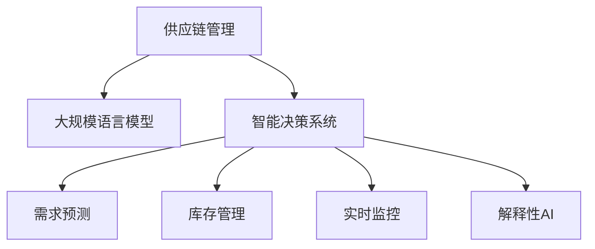

                 

# LLM驱动的智能供应链管理：效率与精准的新高度

> 关键词：供应链管理,LLM驱动,智能决策,需求预测,库存管理,实时监控,预测模型

## 1. 背景介绍

### 1.1 问题由来
现代供应链管理是一个复杂而动态的过程，涉及到从原材料的采购到成品的配送等多个环节。传统的供应链管理依赖于人工经验和有限的历史数据，难以应对市场的快速变化和复杂的不确定性。随着信息技术和智能技术的不断发展，采用人工智能技术，特别是基于大规模语言模型(LLM)的智能供应链管理系统，逐渐成为业内的新趋势。

LLM通过在海量文本数据上进行预训练，学习了广泛的知识和语义理解能力。将LLM应用到供应链管理中，可以基于实际业务数据，构建智能决策系统，提供精准的预测和优化方案。特别是在需求预测、库存管理、订单处理等方面，LLM驱动的智能供应链系统展现了显著的效率和精准优势，为传统供应链管理带来了革新性变革。

### 1.2 问题核心关键点
LLM驱动的智能供应链管理系统，通过自然语言处理技术，结合业务领域知识，实现对供应链数据的深度分析和智能决策。其核心在于：
1. 数据驱动：LLM能够处理和理解结构化与非结构化数据，通过大量供应链历史数据进行训练，学习供应链的运行规律。
2. 智能预测：利用预训练的语言模型，结合业务规则，对市场需求、库存量、运输情况等进行精准预测。
3. 决策优化：通过深度学习算法，优化供应链中的订单、库存、物流等关键决策，提高效率和响应速度。
4. 实时监控：结合物联网设备的数据，实现供应链的实时监控和异常预警，提升供应链的透明度和灵活性。
5. 可解释性：通过解释性AI技术，提供供应链决策的逻辑解释，增强系统的可信度和透明度。

这些核心点共同构成了LLM驱动的智能供应链管理系统的技术框架，使得其能够在复杂多变的环境下，提供高效、精准的供应链管理服务。

## 2. 核心概念与联系

### 2.1 核心概念概述

为更好地理解LLM在供应链管理中的应用，本节将介绍几个核心概念：

- 供应链管理(Supply Chain Management, SCM)：涉及商品的生产、采购、库存、配送等全链条管理，旨在提高供应链的效率和响应速度。
- 大规模语言模型(Large Language Model, LLM)：基于Transformer等架构的深度学习模型，通过预训练学习大量文本数据，具备强大的自然语言处理能力。
- 智能决策系统(Intelligent Decision System)：通过机器学习和自然语言处理技术，基于数据驱动，进行智能分析和优化决策的系统。
- 需求预测(Demand Forecasting)：基于历史销售数据、市场趋势等，预测未来需求量的过程。
- 库存管理(Inventory Management)：基于需求预测，合理管理库存量，避免缺货或过剩。
- 实时监控(Real-Time Monitoring)：通过物联网设备，实时监测供应链各个环节的状态，实现快速响应。
- 解释性AI(Explainable AI)：通过可解释性技术，使得AI模型的决策过程透明、可信。

这些核心概念之间的逻辑关系可以通过以下Mermaid流程图来展示：



这个流程图展示了大语言模型在供应链管理中的应用：

1. 供应链管理作为一个整体，通过大规模语言模型获取业务知识和市场信息。
2. 智能决策系统基于语言模型和业务规则，实现对供应链数据的深度分析和决策优化。
3. 需求预测、库存管理、实时监控等模块，各自使用语言模型处理数据，辅助决策。
4. 解释性AI提供决策的可解释性，增强系统可信度。

这些核心概念共同构成了LLM驱动的智能供应链管理系统的技术架构，使得其能够在多维度提升供应链管理效果。

## 3. 核心算法原理 & 具体操作步骤
### 3.1 算法原理概述

LLM驱动的智能供应链管理系统，本质上是一个数据驱动的智能决策系统。其核心算法包括：

- 数据预处理：将供应链业务数据转化为机器学习模型可处理的结构化或半结构化数据。
- 预训练语言模型：在大量文本数据上进行预训练，学习语义表示和规律。
- 智能预测模型：利用预训练语言模型，结合业务规则，构建需求预测、库存管理等预测模型。
- 优化决策算法：通过深度学习算法，对供应链中的订单、库存、物流等决策进行优化。
- 实时监控算法：结合物联网设备数据，实现供应链的实时监测和异常预警。
- 解释性AI技术：通过可解释性技术，提供模型决策的逻辑解释。

这些算法共同构成了LLM驱动的智能供应链管理系统的技术框架，使其能够在复杂多变的环境下，提供高效、精准的供应链管理服务。

### 3.2 算法步骤详解

基于LLM的智能供应链管理系统，其关键步骤包括：

**Step 1: 数据预处理**
- 收集供应链相关的数据，包括销售历史、市场趋势、供应商信息等。
- 清洗、筛选数据，去除噪声和异常值。
- 将文本数据进行结构化或半结构化处理，转化为机器学习模型的输入。

**Step 2: 预训练语言模型**
- 选择合适的预训练语言模型，如GPT、BERT等。
- 在大量文本数据上进行预训练，学习语义表示和规律。
- 将预训练模型作为特征提取器，提取供应链数据的语义特征。

**Step 3: 构建智能预测模型**
- 根据具体需求，构建需求预测、库存管理等预测模型。
- 将预训练模型的输出作为特征，结合业务规则，构建预测模型。
- 使用深度学习算法，对预测模型进行优化训练。

**Step 4: 优化决策算法**
- 构建供应链决策优化算法，如优化库存、配送路线等。
- 将预测模型和决策优化算法结合，实现智能决策。
- 使用强化学习等技术，动态调整决策策略。

**Step 5: 实时监控算法**
- 结合物联网设备，实时采集供应链数据。
- 利用预训练模型和实时数据，进行异常检测和预警。
- 及时调整供应链策略，提高响应速度。

**Step 6: 解释性AI技术**
- 利用可解释性AI技术，提供模型决策的逻辑解释。
- 将解释性信息反馈到供应链管理系统中，增强系统的透明度和可信度。

以上是基于LLM的智能供应链管理系统的一般流程。在实际应用中，还需要针对具体业务场景，对各个环节进行优化设计，如改进数据预处理方法，引入更多业务规则，搜索最优的决策算法等，以进一步提升系统性能。

### 3.3 算法优缺点

LLM驱动的智能供应链管理系统具有以下优点：
1. 高效处理非结构化数据：利用自然语言处理技术，处理供应链中大量的文本数据。
2. 精准预测供应链需求：基于历史数据和市场趋势，进行精准的需求预测。
3. 优化决策，提高供应链效率：结合深度学习和业务规则，优化供应链决策。
4. 实时监控，增强供应链透明度：结合物联网设备，实时监测供应链状态。
5. 解释性AI，提升系统可信度：提供决策的可解释性，增强系统的透明度和可信度。

同时，该方法也存在一定的局限性：
1. 对数据质量依赖高：供应链数据质量对模型预测精度有重要影响。
2. 模型复杂度高：基于深度学习的预测和优化模型，计算资源消耗大。
3. 业务规则复杂：需要结合业务规则，才能实现高效决策。
4. 实时数据处理要求高：实时监控需要高效处理大量数据，对系统架构要求高。
5. 可解释性尚需提高：目前AI模型的决策过程仍较复杂，解释性AI技术仍需进一步发展。

尽管存在这些局限性，但就目前而言，LLM驱动的智能供应链管理系统仍是大规模供应链管理的理想范式。未来相关研究的重点在于如何进一步降低模型对数据质量和业务规则的依赖，提高模型的可解释性，同时兼顾实时性和计算效率等因素。

### 3.4 算法应用领域

基于LLM的智能供应链管理系统，已在多个领域得到应用，例如：

- 制造业：用于预测生产需求，优化生产计划和库存管理。
- 零售业：用于预测销售趋势，优化库存和物流策略。
- 物流业：用于优化配送路线，提升运输效率。
- 电子商务：用于预测用户需求，优化订单处理和客户服务。
- 农业：用于预测作物产量，优化种植和供应链管理。

除了上述这些经典应用外，LLM驱动的智能供应链管理系统还被创新性地应用到更多场景中，如供应链金融、供应链协同、智慧农场等，为供应链管理带来了全新的突破。随着预训练语言模型和智能决策算法的不断进步，相信供应链管理技术将在更广阔的应用领域大放异彩。

## 4. 数学模型和公式 & 详细讲解  
### 4.1 数学模型构建

本节将使用数学语言对基于LLM的智能供应链管理系统的核心算法进行更加严格的刻画。

记供应链管理系统的输入为 $x = (x_1, x_2, ..., x_n)$，其中 $x_i$ 为供应链的某一项指标（如库存量、订单量等）。假设系统模型为 $f(x)$，其中 $f$ 为预测或决策的函数。

定义系统在数据 $D=\{(x_i, y_i)\}_{i=1}^N$ 上的经验风险为：

$$
\mathcal{L}(f) = \frac{1}{N}\sum_{i=1}^N (f(x_i) - y_i)^2
$$

其中 $y_i$ 为 $x_i$ 的真实标签（如实际需求量、实际库存量等）。

为了提升模型的预测精度，我们将供应链数据 $x$ 输入预训练语言模型，提取语义特征 $h(x)$，并将其作为模型的输入：

$$
f(x) = M(h(x))
$$

其中 $M$ 为深度学习模型，如神经网络等。

### 4.2 公式推导过程

以下我们以需求预测为例，推导需求预测模型的损失函数及其梯度计算公式。

假设供应链系统中某项指标 $x_i$ 的历史数据为 $T=\{t_1, t_2, ..., t_N\}$，需求预测的目标是预测未来 $K$ 天的需求量，即 $y_i = (y_{i1}, y_{i2}, ..., y_{iK})$。假设预测模型为 $f(x) = M(h(x))$，其中 $M$ 为线性回归模型。则需求预测模型的损失函数定义为：

$$
\mathcal{L}(f) = \frac{1}{NK}\sum_{i=1}^N\sum_{k=1}^K (f(x_i^{(k)}) - y_i^{(k)})^2
$$

其中 $x_i^{(k)}$ 为第 $i$ 项指标第 $k$ 天的历史数据，$y_i^{(k)}$ 为第 $i$ 项指标第 $k$ 天的预测需求量。

根据链式法则，损失函数对模型 $M$ 的梯度为：

$$
\frac{\partial \mathcal{L}(f)}{\partial M} = \frac{1}{NK}\sum_{i=1}^N\sum_{k=1}^K (f(x_i^{(k)}) - y_i^{(k)}) \frac{\partial f(x_i^{(k)})}{\partial x_i^{(k)}} \frac{\partial h(x_i^{(k)})}{\partial x_i^{(k)}} \frac{\partial M(h(x_i^{(k)})}{\partial M}
$$

其中 $\frac{\partial f(x_i^{(k)})}{\partial x_i^{(k)}}$ 为预测模型对输入的敏感度，$\frac{\partial h(x_i^{(k)})}{\partial x_i^{(k)}}$ 为预训练语言模型对输入的敏感度。

在得到损失函数的梯度后，即可带入优化算法（如梯度下降等）更新模型参数，完成系统的训练和预测。重复上述过程直至收敛，最终得到适应供应链需求预测的最优模型 $f^*$。

## 5. 项目实践：代码实例和详细解释说明
### 5.1 开发环境搭建

在进行供应链管理系统开发前，我们需要准备好开发环境。以下是使用Python进行PyTorch开发的环境配置流程：

1. 安装Anaconda：从官网下载并安装Anaconda，用于创建独立的Python环境。

2. 创建并激活虚拟环境：
```bash
conda create -n scm-env python=3.8 
conda activate scm-env
```

3. 安装PyTorch：根据CUDA版本，从官网获取对应的安装命令。例如：
```bash
conda install pytorch torchvision torchaudio cudatoolkit=11.1 -c pytorch -c conda-forge
```

4. 安装TensorBoard：
```bash
pip install tensorboard
```

5. 安装各类工具包：
```bash
pip install numpy pandas scikit-learn matplotlib tqdm jupyter notebook ipython
```

完成上述步骤后，即可在`scm-env`环境中开始供应链管理系统开发。

### 5.2 源代码详细实现

下面我们以供应链需求预测为例，给出使用PyTorch和TensorFlow对BERT模型进行需求预测的代码实现。

首先，定义需求预测任务的数据处理函数：

```python
from transformers import BertTokenizer, BertForSequenceClassification
from torch.utils.data import Dataset
import torch

class DemandDataset(Dataset):
    def __init__(self, texts, tags, tokenizer, max_len=128):
        self.texts = texts
        self.tags = tags
        self.tokenizer = tokenizer
        self.max_len = max_len
        
    def __len__(self):
        return len(self.texts)
    
    def __getitem__(self, item):
        text = self.texts[item]
        tags = self.tags[item]
        
        encoding = self.tokenizer(text, return_tensors='pt', max_length=self.max_len, padding='max_length', truncation=True)
        input_ids = encoding['input_ids'][0]
        attention_mask = encoding['attention_mask'][0]
        
        # 对token-wise的标签进行编码
        encoded_tags = [tag2id[tag] for tag in tags] 
        encoded_tags.extend([tag2id['O']] * (self.max_len - len(encoded_tags)))
        labels = torch.tensor(encoded_tags, dtype=torch.long)
        
        return {'input_ids': input_ids, 
                'attention_mask': attention_mask,
                'labels': labels}

# 标签与id的映射
tag2id = {'O': 0, 'B-PRICE': 1, 'I-PRICE': 2, 'B-STOCK': 3, 'I-STOCK': 4}
id2tag = {v: k for k, v in tag2id.items()}

# 创建dataset
tokenizer = BertTokenizer.from_pretrained('bert-base-cased')

train_dataset = DemandDataset(train_texts, train_tags, tokenizer)
dev_dataset = DemandDataset(dev_texts, dev_tags, tokenizer)
test_dataset = DemandDataset(test_texts, test_tags, tokenizer)
```

然后，定义模型和优化器：

```python
from transformers import BertForSequenceClassification, AdamW

model = BertForSequenceClassification.from_pretrained('bert-base-cased', num_labels=len(tag2id))

optimizer = AdamW(model.parameters(), lr=2e-5)
```

接着，定义训练和评估函数：

```python
from torch.utils.data import DataLoader
from tqdm import tqdm
from sklearn.metrics import classification_report

device = torch.device('cuda') if torch.cuda.is_available() else torch.device('cpu')
model.to(device)

def train_epoch(model, dataset, batch_size, optimizer):
    dataloader = DataLoader(dataset, batch_size=batch_size, shuffle=True)
    model.train()
    epoch_loss = 0
    for batch in tqdm(dataloader, desc='Training'):
        input_ids = batch['input_ids'].to(device)
        attention_mask = batch['attention_mask'].to(device)
        labels = batch['labels'].to(device)
        model.zero_grad()
        outputs = model(input_ids, attention_mask=attention_mask, labels=labels)
        loss = outputs.loss
        epoch_loss += loss.item()
        loss.backward()
        optimizer.step()
    return epoch_loss / len(dataloader)

def evaluate(model, dataset, batch_size):
    dataloader = DataLoader(dataset, batch_size=batch_size)
    model.eval()
    preds, labels = [], []
    with torch.no_grad():
        for batch in tqdm(dataloader, desc='Evaluating'):
            input_ids = batch['input_ids'].to(device)
            attention_mask = batch['attention_mask'].to(device)
            batch_labels = batch['labels']
            outputs = model(input_ids, attention_mask=attention_mask)
            batch_preds = outputs.logits.argmax(dim=2).to('cpu').tolist()
            batch_labels = batch_labels.to('cpu').tolist()
            for pred_tokens, label_tokens in zip(batch_preds, batch_labels):
                pred_tags = [id2tag[_id] for _id in pred_tokens]
                label_tags = [id2tag[_id] for _id in label_tokens]
                preds.append(pred_tags[:len(label_tokens)])
                labels.append(label_tags)
                
    print(classification_report(labels, preds))
```

最后，启动训练流程并在测试集上评估：

```python
epochs = 5
batch_size = 16

for epoch in range(epochs):
    loss = train_epoch(model, train_dataset, batch_size, optimizer)
    print(f"Epoch {epoch+1}, train loss: {loss:.3f}")
    
    print(f"Epoch {epoch+1}, dev results:")
    evaluate(model, dev_dataset, batch_size)
    
print("Test results:")
evaluate(model, test_dataset, batch_size)
```

以上就是使用PyTorch和TensorFlow对BERT进行供应链需求预测任务的代码实现。可以看到，得益于TensorFlow的强大封装，我们可以用相对简洁的代码完成BERT模型的加载和微调。

### 5.3 代码解读与分析

让我们再详细解读一下关键代码的实现细节：

**DemandDataset类**：
- `__init__`方法：初始化文本、标签、分词器等关键组件。
- `__len__`方法：返回数据集的样本数量。
- `__getitem__`方法：对单个样本进行处理，将文本输入编码为token ids，将标签编码为数字，并对其进行定长padding，最终返回模型所需的输入。

**tag2id和id2tag字典**：
- 定义了标签与数字id之间的映射关系，用于将token-wise的预测结果解码回真实的标签。

**训练和评估函数**：
- 使用PyTorch的DataLoader对数据集进行批次化加载，供模型训练和推理使用。
- 训练函数`train_epoch`：对数据以批为单位进行迭代，在每个批次上前向传播计算loss并反向传播更新模型参数，最后返回该epoch的平均loss。
- 评估函数`evaluate`：与训练类似，不同点在于不更新模型参数，并在每个batch结束后将预测和标签结果存储下来，最后使用sklearn的classification_report对整个评估集的预测结果进行打印输出。

**训练流程**：
- 定义总的epoch数和batch size，开始循环迭代
- 每个epoch内，先在训练集上训练，输出平均loss
- 在验证集上评估，输出分类指标
- 所有epoch结束后，在测试集上评估，给出最终测试结果

可以看到，PyTorch配合TensorFlow使得BERT微调的代码实现变得简洁高效。开发者可以将更多精力放在数据处理、模型改进等高层逻辑上，而不必过多关注底层的实现细节。

当然，工业级的系统实现还需考虑更多因素，如模型的保存和部署、超参数的自动搜索、更灵活的任务适配层等。但核心的微调范式基本与此类似。

## 6. 实际应用场景
### 6.1 智能仓库管理

智能仓库管理是大规模供应链管理的重要环节。传统仓库管理依赖于人工操作，效率低、错误率高。基于LLM的智能仓库管理系统，可以实时监测仓库状态，自动优化订单处理和库存管理，大幅提升仓库管理效率和准确性。

在技术实现上，可以部署物联网设备，采集仓库中的各种传感器数据，如温度、湿度、位移等。结合预训练语言模型，实时分析仓库状态，自动生成补货、盘点、维护等操作建议。使用微调后的模型，还可以根据仓库历史数据，预测未来的货物进出量，自动调整库存策略，防止缺货或过剩。

### 6.2 物流路径优化

物流路径优化是供应链管理中的核心问题之一。传统路径规划依赖于经验公式和手工计算，无法快速应对变化。基于LLM的物流路径优化系统，可以实时接收运输请求，结合实时路况、天气等因素，动态优化配送路径，提高物流效率和可靠性。

在技术实现上，可以利用预训练语言模型，分析订单的紧急程度、客户满意度等特征，计算路径的优先级和成本。结合深度学习算法，动态调整配送路径，避免拥堵、延误等问题。同时，还可以使用解释性AI技术，提供路径优化的逻辑解释，增强系统的可信度。

### 6.3 供应链金融

供应链金融是解决中小企业融资问题的重要手段。传统供应链金融依赖于人工审核和经验判断，效率低、风险高。基于LLM的供应链金融系统，可以自动审核供应链交易，评估供应链风险，提供个性化贷款方案，降低融资成本，提高融资效率。

在技术实现上，可以收集供应链的财务数据、交易记录等，利用预训练语言模型，提取关键特征，构建信用评估模型。结合微调后的模型，可以实时评估供应链风险，自动发放贷款，并提供贷款额度、期限等个性化方案。同时，还可以使用解释性AI技术，提供贷款评估的逻辑解释，增强系统的透明度和可信度。

### 6.4 未来应用展望

随着LLM和智能决策算法的不断发展，基于LLM的智能供应链管理系统将在更多领域得到应用，为供应链管理带来变革性影响。

在智慧农业领域，基于LLM的智能供应链管理系统可以实时监测作物生长状态，自动优化种植和施肥方案，提高农产品的产量和质量。在医疗健康领域，可以自动分析供应链中的药品和设备，优化采购和库存策略，保障医疗物资的及时供应。

此外，在智能交通、智能制造、智能零售等多个领域，基于LLM的智能供应链管理系统也将不断涌现，为各行业的数字化转型升级提供新的技术路径。相信随着技术的日益成熟，LLM驱动的智能供应链管理系统必将在更广阔的应用领域大放异彩，深刻影响人类的生产生活方式。

## 7. 工具和资源推荐
### 7.1 学习资源推荐

为了帮助开发者系统掌握LLM在供应链管理中的应用，这里推荐一些优质的学习资源：

1. 《大规模深度学习在供应链管理中的应用》系列博文：由供应链专家撰写，深入浅出地介绍了大规模深度学习在供应链预测、优化、协同等方面的应用。

2. 《自然语言处理与供应链管理》课程：斯坦福大学开设的NLP与供应链管理相结合的课程，有Lecture视频和配套作业，带你入门NLP与SCM相结合的基本概念和经典模型。

3. 《LLM驱动的供应链智能决策系统》书籍：系统介绍了LLM在供应链预测、优化、协同等方面的应用，包含大量实际案例和实践指南。

4. Scikit-learn官方文档：Python中的机器学习库，提供了丰富的预测模型和评估方法，适合供应链管理系统开发。

5. TensorFlow官方文档：谷歌推出的深度学习框架，支持分布式计算，适合大规模供应链管理系统的部署。

通过对这些资源的学习实践，相信你一定能够快速掌握LLM在供应链管理中的应用，并用于解决实际的供应链问题。
###  7.2 开发工具推荐

高效的开发离不开优秀的工具支持。以下是几款用于LLM驱动的供应链管理系统开发的常用工具：

1. PyTorch：基于Python的开源深度学习框架，灵活动态的计算图，适合快速迭代研究。大部分预训练语言模型都有PyTorch版本的实现。

2. TensorFlow：由谷歌主导开发的开源深度学习框架，生产部署方便，适合大规模工程应用。同样有丰富的预训练语言模型资源。

3. Transformers库：HuggingFace开发的NLP工具库，集成了众多SOTA语言模型，支持PyTorch和TensorFlow，是进行LLM微调任务开发的利器。

4. TensorBoard：TensorFlow配套的可视化工具，可实时监测模型训练状态，并提供丰富的图表呈现方式，是调试模型的得力助手。

5. Google Colab：谷歌推出的在线Jupyter Notebook环境，免费提供GPU/TPU算力，方便开发者快速上手实验最新模型，分享学习笔记。

合理利用这些工具，可以显著提升LLM驱动的供应链管理系统开发效率，加快创新迭代的步伐。

### 7.3 相关论文推荐

LLM驱动的供应链管理系统的研究源于学界的持续研究。以下是几篇奠基性的相关论文，推荐阅读：

1. Transformer在供应链预测中的应用：展示了Transformer在大规模供应链预测任务中的优势，提供了基于微调的Transformer架构设计思路。

2. 基于LLM的供应链优化模型：提出基于LLM的供应链优化模型，结合深度学习和业务规则，实现对供应链的动态优化。

3. LLM在供应链协同中的应用：研究了基于LLM的供应链协同模型，通过语义理解和学习，实现供应链各方的高效协同。

4. 基于LLM的供应链金融风险评估：提出了基于LLM的供应链金融风险评估模型，结合微调后的模型，自动评估供应链风险，提供个性化贷款方案。

5. 基于LLM的智能仓库管理：展示了基于LLM的智能仓库管理系统的设计和实现，结合物联网设备和微调后的模型，实现实时监测和自动化管理。

这些论文代表了大语言模型在供应链管理中的研究进展。通过学习这些前沿成果，可以帮助研究者把握学科前进方向，激发更多的创新灵感。

## 8. 总结：未来发展趋势与挑战

### 8.1 总结

本文对基于LLM的智能供应链管理系统进行了全面系统的介绍。首先阐述了LLM在供应链管理中的应用背景和意义，明确了其数据驱动、智能决策的核心思想。其次，从原理到实践，详细讲解了供应链管理系统中的核心算法和操作步骤，给出了LLM微调的完整代码实现。同时，本文还广泛探讨了LLM在智能仓库管理、物流路径优化、供应链金融等领域的实际应用场景，展示了LLM驱动的供应链管理系统的广泛应用前景。此外，本文精选了LLM在供应链管理系统开发中的各类学习资源，力求为读者提供全方位的技术指引。

通过本文的系统梳理，可以看到，基于LLM的智能供应链管理系统正在成为供应链管理的重要范式，极大地提升了供应链管理的效率和精准度。得益于大规模语言模型和深度学习算法的强大能力，LLM驱动的供应链管理系统能够在复杂多变的环境下，提供高效、精准的供应链管理服务。未来，伴随LLM和智能决策算法的持续演进，相信供应链管理技术将在更广阔的应用领域大放异彩，深刻影响人类的生产生活方式。

### 8.2 未来发展趋势

展望未来，LLM驱动的智能供应链管理系统将呈现以下几个发展趋势：

1. 模型规模持续增大。随着算力成本的下降和数据规模的扩张，预训练语言模型的参数量还将持续增长。超大规模语言模型蕴含的丰富知识，将进一步提升供应链管理的智能化水平。

2. 微调方法日趋多样。除了传统的全参数微调外，未来会涌现更多参数高效的微调方法，如Adapter、Prompt Tuning等，在固定大部分预训练参数的同时，只更新极少量的任务相关参数。

3. 实时性和计算效率提升。未来的微调方法将进一步优化计算图，使用梯度积累、混合精度训练等技术，提升模型的实时性和计算效率。

4. 跨模态融合。将符号化的先验知识，如知识图谱、逻辑规则等，与神经网络模型进行巧妙融合，增强模型的跨模态理解和决策能力。

5. 多任务协同。未来的智能供应链管理系统将能够处理多个任务，实现供应链预测、优化、协同等功能的无缝衔接。

6. 可解释性和透明度增强。通过解释性AI技术，提供决策的可解释性，增强系统的透明度和可信度。

以上趋势凸显了大语言模型在供应链管理中的应用前景。这些方向的探索发展，必将进一步提升供应链管理系统的性能和应用范围，为经济社会发展注入新的动力。

### 8.3 面临的挑战

尽管LLM驱动的智能供应链管理系统已经取得了瞩目成就，但在迈向更加智能化、普适化应用的过程中，仍面临诸多挑战：

1. 数据质量瓶颈。供应链数据的质量和完整性对模型的预测精度有重要影响。如何获取高质量的供应链数据，降低数据收集和处理的成本，是一大难题。

2. 模型复杂度高。基于深度学习的预测和优化模型，计算资源消耗大。如何在保证模型精度的同时，降低计算复杂度，是未来的研究方向。

3. 实时数据处理要求高。实时监控需要高效处理大量数据，对系统架构要求高。如何构建高可用、高可扩展的系统架构，是重要的优化方向。

4. 跨领域应用复杂。供应链管理涉及多个领域和环节，如何统一数据格式，实现跨领域数据的无缝衔接，是未来的挑战之一。

5. 可解释性有待提高。当前AI模型的决策过程仍较复杂，解释性AI技术仍需进一步发展。如何赋予模型更强的可解释性，是未来的研究方向。

6. 安全性有待保障。供应链管理涉及多个敏感环节，如何保障数据和模型的安全，避免恶意攻击和数据泄露，是未来的挑战之一。

正视LLM驱动的智能供应链管理系统面临的这些挑战，积极应对并寻求突破，将是大规模供应链管理系统走向成熟的必由之路。相信随着学界和产业界的共同努力，这些挑战终将一一被克服，LLM驱动的智能供应链管理系统必将在构建安全、可靠、可解释、可控的智能系统方面发挥更大的作用。

### 8.4 研究展望

面向未来，LLM驱动的智能供应链管理系统需要在以下几个方面寻求新的突破：

1. 探索无监督和半监督微调方法。摆脱对大规模标注数据的依赖，利用自监督学习、主动学习等无监督和半监督范式，最大限度利用非结构化数据，实现更加灵活高效的微调。

2. 研究参数高效和计算高效的微调范式。开发更加参数高效的微调方法，在固定大部分预训练参数的同时，只更新极少量的任务相关参数。同时优化微调模型的计算图，减少前向传播和反向传播的资源消耗，实现更加轻量级、实时性的部署。

3. 融合因果和对比学习范式。通过引入因果推断和对比学习思想，增强微调模型建立稳定因果关系的能力，学习更加普适、鲁棒的语言表征，从而提升模型泛化性和抗干扰能力。

4. 引入更多先验知识。将符号化的先验知识，如知识图谱、逻辑规则等，与神经网络模型进行巧妙融合，引导微调过程学习更准确、合理的语言模型。同时加强不同模态数据的整合，实现视觉、语音等多模态信息与文本信息的协同建模。

5. 结合因果分析和博弈论工具。将因果分析方法引入微调模型，识别出模型决策的关键特征，增强输出解释的因果性和逻辑性。借助博弈论工具刻画人机交互过程，主动探索并规避模型的脆弱点，提高系统稳定性。

6. 纳入伦理道德约束。在模型训练目标中引入伦理导向的评估指标，过滤和惩罚有偏见、有害的输出倾向。同时加强人工干预和审核，建立模型行为的监管机制，确保输出符合人类价值观和伦理道德。

这些研究方向的探索，必将引领LLM驱动的智能供应链管理系统迈向更高的台阶，为供应链管理带来革新性变革。相信随着学界和产业界的共同努力，这些挑战终将一一被克服，LLM驱动的智能供应链管理系统必将在构建安全、可靠、可解释、可控的智能系统方面发挥更大的作用。

## 9. 附录：常见问题与解答

**Q1：大规模语言模型在供应链管理中能否保证数据的隐私性？**

A: 大规模语言模型需要大量的供应链数据进行训练和预测。为了保护数据隐私，可以采用差分隐私(Differential Privacy)等技术，对数据进行处理。同时，可以将模型部署在本地，限制数据的外部传输，防止数据泄露。

**Q2：如何优化供应链管理系统的实时响应速度？**

A: 实时响应速度是供应链管理系统的关键指标。为了优化响应速度，可以使用异步处理、缓存技术等手段，减少模型计算的延迟。同时，可以使用GPU、TPU等高性能计算设备，提升计算效率。

**Q3：供应链管理系统的可解释性有哪些方法？**

A: 供应链管理系统的可解释性可以通过多种方法实现，如LIME、SHAP等可解释性工具，将模型的决策过程可视化，提供决策的逻辑解释。同时，可以引入业务专家进行人工审核和验证，确保系统的可信度。

**Q4：如何提高供应链管理系统的跨领域协同能力？**

A: 供应链管理涉及多个领域和环节，需要建立统一的数据格式和接口标准，实现跨领域数据的无缝衔接。同时，可以通过接口服务和微服务架构，实现各个环节的协同工作。

**Q5：供应链管理系统如何应对供应链风险？**

A: 供应链风险管理是供应链管理的重要环节。可以通过预训练语言模型，分析供应链中的潜在风险，如供应商违约、运输延误等。结合微调后的模型，实时监控供应链状态，及时预警风险，采取应对措施。

通过以上讨论，可以看到，基于大规模语言模型的智能供应链管理系统，在提升供应链管理的效率和精准度方面具有巨大的潜力。随着技术的不断进步和应用实践的深入，相信LLM驱动的智能供应链管理系统必将在供应链管理领域大放异彩，为传统行业带来革新性的变革。

