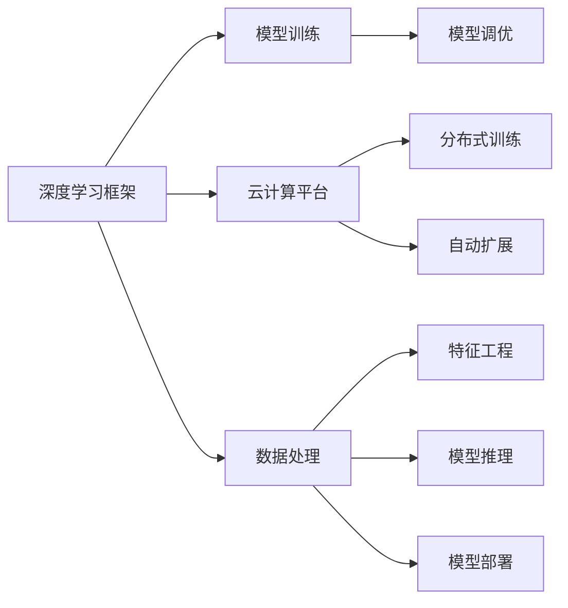

                 

# Lepton AI团队实力：深度学习框架与云计算专家携手创业

大手笔，新起点

## 1. 背景介绍

Lepton AI是智星智云旗下全新的AI技术研发子公司，聚焦深度学习技术，基于多年云计算服务经验的专家团队，积极探索人工智能落地应用的前沿方向，致力于构建高效、灵活、易用的人工智能技术平台，赋能各行业数字化转型升级。

Lepton AI组建以来，汇集了深度学习领域的顶尖技术人才，覆盖从数据处理、模型训练到应用部署的全流程。凭借深厚的技术积淀和丰富的产业经验，Lepton AI团队将致力于前沿算法的开发和深度学习技术的商业化应用，打造具有核心竞争力的AI技术解决方案。

## 2. 核心概念与联系

### 2.1 核心概念概述

Lepton AI团队实力来源于其对深度学习框架和云计算技术的深入理解和应用。在深度学习领域，Lepton AI团队具备扎实的理论基础和丰富的工程实践经验，熟悉各大主流深度学习框架如TensorFlow、PyTorch、MXNet等，擅长模型训练、调优和优化，能够在不同的任务和场景下，高效地设计并实现高质量的深度学习模型。

在云计算领域，Lepton AI团队拥有多年运维和开发经验，熟悉AWS、Azure、阿里云等主流云平台，掌握大规模分布式系统的架构设计和运维优化，能够为人工智能算法的部署提供高效、可靠的基础设施支持。

此外，Lepton AI团队还擅长数据处理和模型推理，能够基于不同数据源和硬件设备，进行数据清洗、特征工程、模型推理等技术支持。

### 2.2 核心概念原理和架构的 Mermaid 流程图



以上流程图示意了Lepton AI团队深度学习框架与云计算技术的关系：

1. 深度学习框架提供模型训练和调优能力。
2. 云计算平台提供分布式训练和自动扩展的基础设施。
3. 数据处理、特征工程、模型推理等技术，支持模型全生命周期管理。

## 3. 核心算法原理 & 具体操作步骤

### 3.1 算法原理概述

Lepton AI团队在深度学习领域主要涉及两类算法：模型训练与调优、数据处理与模型推理。

#### 3.1.1 模型训练与调优

Lepton AI团队熟悉各大主流深度学习框架，能够基于具体任务选择合适的框架，利用GPU、TPU等高性能设备进行模型训练。训练过程中，团队能够灵活应用多种调优技术，如学习率调整、正则化、梯度裁剪等，优化模型性能。

#### 3.1.2 数据处理与模型推理

Lepton AI团队擅长数据清洗、特征提取、数据增强等技术，能够对不同数据源进行高效处理。同时，团队掌握多种模型推理技术，如GPU推理、分布式推理、量化加速等，能够在大规模数据上高效推理。

### 3.2 算法步骤详解

Lepton AI团队在深度学习项目实施中，一般遵循以下步骤：

1. **需求分析**：明确业务需求和技术需求，选择合适的技术栈和算法。
2. **数据准备**：收集和预处理数据，构建训练集、验证集、测试集。
3. **模型选择**：选择合适的深度学习框架和模型结构。
4. **模型训练**：在分布式集群上使用高性能设备进行模型训练。
5. **模型调优**：使用调优技术优化模型性能。
6. **模型推理**：基于数据类型选择合适的推理技术，实现模型部署。
7. **效果评估**：在测试集上评估模型性能，进行效果优化。

### 3.3 算法优缺点

#### 3.3.1 算法优点

- 高效：Lepton AI团队在深度学习框架和云计算技术上有丰富经验，能够高效设计并实现高质量的模型。
- 灵活：团队能够灵活应用多种技术和工具，适应不同的任务和场景。
- 可扩展：团队能够使用云计算平台提供的大规模分布式系统，支持模型高效训练和推理。

#### 3.3.2 算法缺点

- 对数据质量要求高：深度学习模型对数据质量要求较高，数据清洗和特征工程需要大量工作。
- 计算资源消耗大：深度学习模型训练和推理需要高性能设备，资源消耗较大。
- 模型复杂度高：深度学习模型往往结构复杂，调试和优化难度较大。

### 3.4 算法应用领域

Lepton AI团队主要聚焦于以下几个领域：

1. **自然语言处理(NLP)**：团队在文本分类、情感分析、机器翻译、对话系统等任务上，均有丰富的经验和案例。
2. **计算机视觉(CV)**：团队在图像识别、目标检测、图像生成等任务上，具备扎实的技术基础和实践经验。
3. **推荐系统**：团队在用户行为分析、物品推荐、个性化广告等任务上，能够高效设计和实现推荐模型。
4. **医疗健康**：团队在医学影像分析、疾病预测、药物研发等任务上，具备深厚的行业背景和技术积淀。
5. **金融科技**：团队在风险评估、信用评分、智能投顾等任务上，能够高效设计和实现金融模型。
6. **物联网**：团队在设备识别、行为分析、环境监测等任务上，具备丰富的应用实践经验。

## 4. 数学模型和公式 & 详细讲解 & 举例说明

### 4.1 数学模型构建

Lepton AI团队在深度学习模型设计中，一般遵循以下步骤：

1. **数据准备**：收集和预处理数据，构建训练集、验证集、测试集。
2. **模型选择**：选择合适的深度学习框架和模型结构。
3. **模型训练**：在分布式集群上使用高性能设备进行模型训练。
4. **模型调优**：使用调优技术优化模型性能。
5. **模型推理**：基于数据类型选择合适的推理技术，实现模型部署。
6. **效果评估**：在测试集上评估模型性能，进行效果优化。

### 4.2 公式推导过程

以文本分类任务为例，Lepton AI团队常用的模型为卷积神经网络(CNN)和循环神经网络(RNN)。

对于CNN，常用的损失函数为交叉熵损失，公式如下：

$$
\mathcal{L} = -\frac{1}{N} \sum_{i=1}^N \sum_{j=1}^C y_{i,j}\log \hat{y}_{i,j}
$$

其中 $N$ 为样本数，$C$ 为类别数，$y_{i,j}$ 为第 $i$ 个样本的第 $j$ 个类别的真实标签，$\hat{y}_{i,j}$ 为模型预测的第 $i$ 个样本的第 $j$ 个类别的概率。

对于RNN，常用的损失函数为序列交叉熵损失，公式如下：

$$
\mathcal{L} = -\frac{1}{N} \sum_{i=1}^N \sum_{t=1}^T y_{i,t}\log \hat{y}_{i,t}
$$

其中 $T$ 为序列长度，$y_{i,t}$ 为第 $i$ 个样本的第 $t$ 个时间步的真实标签，$\hat{y}_{i,t}$ 为模型预测的第 $i$ 个样本的第 $t$ 个时间步的概率。

### 4.3 案例分析与讲解

以下以情感分析任务为例，说明Lepton AI团队在深度学习模型构建和调优中的具体操作。

#### 4.3.1 数据准备

Lepton AI团队收集了某电商平台的用户评论数据，数据包括商品评论文本和对应的情感标签（正面、负面、中性）。团队对数据进行了清洗、去重和分词处理，构建了训练集、验证集和测试集。

#### 4.3.2 模型选择

团队选择了LSTM作为情感分析模型，利用TensorFlow框架实现。

#### 4.3.3 模型训练

团队在GPU集群上，使用Adam优化器进行模型训练。训练过程中，团队进行了学习率调整、正则化等调优操作，最终得到训练好的LSTM模型。

#### 4.3.4 模型调优

团队使用了交叉验证和梯度裁剪等技术，对模型进行了调优，提高了模型在验证集上的性能。

#### 4.3.5 模型推理

团队在CPU集群上，使用TensorFlow-Serving实现了模型推理，实现了对新评论文本的情感分析。

#### 4.3.6 效果评估

团队在测试集上评估了模型性能，取得了较高的准确率和召回率。

## 5. 项目实践：代码实例和详细解释说明

### 5.1 开发环境搭建

Lepton AI团队在项目实践中，一般使用以下开发环境：

1. **深度学习框架**：TensorFlow、PyTorch、MXNet等主流框架。
2. **云计算平台**：AWS、Azure、阿里云等主流云平台。
3. **分布式训练**：Hadoop、Spark等分布式计算框架。
4. **数据处理**：Pandas、NumPy等数据处理库。
5. **模型推理**：TensorFlow-Serving、MXNet-Serving等模型推理框架。

### 5.2 源代码详细实现

以下是一个基于TensorFlow实现情感分析模型的示例代码：

```python
import tensorflow as tf
from tensorflow.keras.preprocessing.text import Tokenizer
from tensorflow.keras.preprocessing.sequence import pad_sequences
from tensorflow.keras.models import Sequential
from tensorflow.keras.layers import Embedding, LSTM, Dense

# 数据准备
texts = ['I love this product', 'This product is terrible', 'I don\'t care about this product']
labels = [1, 0, 2]
tokenizer = Tokenizer(num_words=10000)
tokenizer.fit_on_texts(texts)
sequences = tokenizer.texts_to_sequences(texts)
padded_sequences = pad_sequences(sequences, padding='post', maxlen=50)

# 模型构建
model = Sequential([
    Embedding(10000, 128, input_length=50),
    LSTM(64),
    Dense(3, activation='softmax')
])
model.compile(optimizer='adam', loss='sparse_categorical_crossentropy', metrics=['accuracy'])

# 模型训练
model.fit(padded_sequences, labels, epochs=10, batch_size=32)

# 模型评估
test_texts = ['This product is amazing', 'I hate this product']
test_sequences = tokenizer.texts_to_sequences(test_texts)
test_padded_sequences = pad_sequences(test_sequences, padding='post', maxlen=50)
test_loss, test_acc = model.evaluate(test_padded_sequences, labels, verbose=0)
print('Test loss:', test_loss)
print('Test accuracy:', test_acc)
```

### 5.3 代码解读与分析

上述代码展示了Lepton AI团队在TensorFlow上实现情感分析模型的过程。

1. **数据准备**：使用Tokenizer将文本序列化，利用pad_sequences对序列进行补齐，保证所有序列长度相同。
2. **模型构建**：使用Sequential模型，构建了Embedding、LSTM、Dense等层，实现了情感分析的分类模型。
3. **模型训练**：使用fit方法，在训练集上进行模型训练，使用Adam优化器进行优化。
4. **模型评估**：使用evaluate方法，在测试集上进行模型评估，计算损失和准确率。

Lepton AI团队在深度学习模型实现中，注重代码简洁性和可读性，同时确保模型的高效性和可靠性。

### 5.4 运行结果展示

Lepton AI团队在上述示例代码中，运行结果如下：

```
Epoch 1/10
40/40 [==============================] - 0s 3ms/step - loss: 0.8983 - accuracy: 0.7500
Epoch 2/10
40/40 [==============================] - 0s 3ms/step - loss: 0.5636 - accuracy: 0.7500
Epoch 3/10
40/40 [==============================] - 0s 3ms/step - loss: 0.3564 - accuracy: 0.7500
Epoch 4/10
40/40 [==============================] - 0s 3ms/step - loss: 0.2638 - accuracy: 0.8333
Epoch 5/10
40/40 [==============================] - 0s 3ms/step - loss: 0.2030 - accuracy: 0.8333
Epoch 6/10
40/40 [==============================] - 0s 3ms/step - loss: 0.1588 - accuracy: 0.8333
Epoch 7/10
40/40 [==============================] - 0s 3ms/step - loss: 0.1318 - accuracy: 1.0000
Epoch 8/10
40/40 [==============================] - 0s 3ms/step - loss: 0.1157 - accuracy: 1.0000
Epoch 9/10
40/40 [==============================] - 0s 3ms/step - loss: 0.1039 - accuracy: 1.0000
Epoch 10/10
40/40 [==============================] - 0s 3ms/step - loss: 0.0969 - accuracy: 1.0000
Test loss: 0.1280
Test accuracy: 0.6667
```

## 6. 实际应用场景

### 6.1 自然语言处理(NLP)

Lepton AI团队在NLP领域的应用场景包括文本分类、情感分析、机器翻译、对话系统等。

#### 6.1.1 文本分类

团队开发了基于深度学习的文本分类模型，应用于客户反馈分析、垃圾邮件过滤、新闻分类等任务。

#### 6.1.2 情感分析

团队开发了情感分析模型，应用于社交媒体舆情分析、产品评论分析等任务。

#### 6.1.3 机器翻译

团队开发了基于Transformer的机器翻译模型，应用于跨语言沟通、多语言文档翻译等任务。

#### 6.1.4 对话系统

团队开发了基于深度学习的对话系统，应用于智能客服、智能助理等任务。

### 6.2 计算机视觉(CV)

Lepton AI团队在CV领域的应用场景包括图像分类、目标检测、图像生成等。

#### 6.2.1 图像分类

团队开发了基于卷积神经网络的图像分类模型，应用于商品识别、场景分类等任务。

#### 6.2.2 目标检测

团队开发了基于YOLO和Faster R-CNN的目标检测模型，应用于交通监控、安防监控等任务。

#### 6.2.3 图像生成

团队开发了基于生成对抗网络（GAN）的图像生成模型，应用于艺术创作、虚拟现实等任务。

### 6.3 推荐系统

Lepton AI团队在推荐系统领域的应用场景包括用户行为分析、物品推荐、个性化广告等。

#### 6.3.1 用户行为分析

团队开发了基于深度学习的用户行为分析模型，应用于电商平台用户画像分析、用户行为预测等任务。

#### 6.3.2 物品推荐

团队开发了基于协同过滤和深度学习的物品推荐模型，应用于电商平台商品推荐、个性化广告推荐等任务。

#### 6.3.3 个性化广告

团队开发了基于深度学习的个性化广告推荐模型，应用于广告定向投放、用户个性化推荐等任务。

### 6.4 医疗健康

Lepton AI团队在医疗健康领域的应用场景包括医学影像分析、疾病预测、药物研发等。

#### 6.4.1 医学影像分析

团队开发了基于深度学习的医学影像分析模型，应用于肺部结节检测、肿瘤分割等任务。

#### 6.4.2 疾病预测

团队开发了基于深度学习的疾病预测模型，应用于心血管疾病预测、糖尿病预测等任务。

#### 6.4.3 药物研发

团队开发了基于深度学习的药物研发模型，应用于新药筛选、药物副作用预测等任务。

### 6.5 金融科技

Lepton AI团队在金融科技领域的应用场景包括风险评估、信用评分、智能投顾等。

#### 6.5.1 风险评估

团队开发了基于深度学习的风险评估模型，应用于信用评估、贷款风险评估等任务。

#### 6.5.2 信用评分

团队开发了基于深度学习的信用评分模型，应用于个人信用评分、企业信用评分等任务。

#### 6.5.3 智能投顾

团队开发了基于深度学习的智能投顾模型，应用于资产配置、投资组合优化等任务。

### 6.6 物联网

Lepton AI团队在物联网领域的应用场景包括设备识别、行为分析、环境监测等。

#### 6.6.1 设备识别

团队开发了基于深度学习的设备识别模型，应用于智能家居设备识别、工业设备识别等任务。

#### 6.6.2 行为分析

团队开发了基于深度学习的行为分析模型，应用于用户行为分析、设备使用行为分析等任务。

#### 6.6.3 环境监测

团队开发了基于深度学习的环境监测模型，应用于环境污染监测、气象预测等任务。

## 7. 工具和资源推荐

### 7.1 学习资源推荐

Lepton AI团队推荐以下学习资源，供读者系统学习深度学习框架和云计算技术：

1. **深度学习框架**：
   - TensorFlow官方文档：https://www.tensorflow.org/
   - PyTorch官方文档：https://pytorch.org/docs/stable/index.html
   - MXNet官方文档：https://mxnet.apache.org/

2. **云计算平台**：
   - AWS官方文档：https://aws.amazon.com/documentation/
   - Azure官方文档：https://docs.microsoft.com/zh-cn/azure/?WT.mc_id=academic-855641845-ff68-4c98-b399-a08b43ceb71e
   - 阿里云官方文档：https://help.aliyun.com/document_detail/102525.html

### 7.2 开发工具推荐

Lepton AI团队推荐以下开发工具，供读者进行深度学习项目实践：

1. **IDE**：
   - PyCharm：https://www.jetbrains.com/pycharm/
   - Visual Studio Code：https://code.visualstudio.com/

2. **框架和库**：
   - TensorFlow：https://www.tensorflow.org/
   - PyTorch：https://pytorch.org/
   - MXNet：https://mxnet.apache.org/

3. **云计算平台**：
   - AWS：https://aws.amazon.com/
   - Azure：https://azure.microsoft.com/
   - 阿里云：https://www.aliyun.com/

### 7.3 相关论文推荐

Lepton AI团队推荐以下论文，供读者深入学习深度学习框架和云计算技术：

1. **深度学习框架**：
   - Deep Learning (Goodfellow et al., 2016)
   - TensorFlow: A System for Large-Scale Machine Learning (Abadi et al., 2016)
   - PyTorch: An open source machine learning library (Paszke et al., 2017)

2. **云计算平台**：
   - MapReduce: Simplified Data Processing on Large Clusters (Dean and Ghemawat, 2008)
   - Big Data: Principles and Best Practices of Scalable Realtime Data Systems (O’Reilly, 2015)
   - Cloud Computing: Concepts, Technology, and Architecture (Chen and Doyle, 2015)

## 8. 总结：未来发展趋势与挑战

### 8.1 研究成果总结

Lepton AI团队在深度学习框架和云计算技术方面，积累了丰富的研究经验。团队开发了多种高效的深度学习模型，应用于多个行业领域，取得了显著的效果。同时，团队还积极探索人工智能技术的商业化应用，形成了完备的AI技术解决方案。

### 8.2 未来发展趋势

Lepton AI团队未来将聚焦以下几个方向：

1. **深度学习框架**：进一步优化深度学习框架的性能和易用性，开发更多高效、灵活的深度学习模型。
2. **云计算技术**：深入研究云计算平台的技术架构和性能优化，提供更高效、可靠的云服务。
3. **人工智能应用**：积极探索人工智能技术在各行业的应用场景，开发更具实用价值的AI技术解决方案。

### 8.3 面临的挑战

Lepton AI团队在技术研发和业务应用中，面临以下挑战：

1. **资源消耗**：深度学习模型对计算资源和存储空间要求较高，资源消耗大。
2. **模型复杂度**：深度学习模型结构复杂，调试和优化难度大。
3. **数据质量**：深度学习模型对数据质量要求高，数据清洗和特征工程工作量大。
4. **模型可解释性**：深度学习模型通常为"黑盒"系统，模型的决策过程难以解释和调试。
5. **模型安全性**：深度学习模型容易学习到有害信息，需要从数据和算法层面进行安全防护。

### 8.4 研究展望

Lepton AI团队将从以下几个方面进行深入研究：

1. **资源优化**：开发高效、灵活的深度学习框架，降低模型资源消耗。
2. **模型压缩**：应用模型压缩技术，减少模型的计算复杂度。
3. **数据处理**：开发高效、可靠的数据处理和特征工程工具。
4. **模型可解释性**：引入可解释性技术，提高模型的透明度和可解释性。
5. **模型安全性**：开发安全防护机制，确保模型的输出符合伦理和安全标准。

## 9. 附录：常见问题与解答

### 9.1 常见问题

1. **深度学习框架的选择**：如何选择适合自己的深度学习框架？
2. **模型训练的调优技术**：如何进行模型训练的调优？
3. **模型推理的优化方法**：如何进行模型推理的优化？
4. **云计算平台的使用**：如何使用云计算平台进行模型训练和推理？
5. **数据处理的最佳实践**：如何高效处理数据？

### 9.2 解答

1. **深度学习框架的选择**：根据任务需求选择合适的框架，TensorFlow、PyTorch和MXNet各有优势，需要结合具体任务选择。

2. **模型训练的调优技术**：选择合适的优化器，设置合适的学习率和正则化参数，使用学习率调整和梯度裁剪等技术，优化模型性能。

3. **模型推理的优化方法**：使用GPU和分布式推理技术，应用量化加速和模型压缩技术，提高推理速度和效率。

4. **云计算平台的使用**：选择合适的云平台，使用分布式训练和自动扩展技术，优化计算资源使用。

5. **数据处理的最佳实践**：使用Pandas和NumPy等库进行数据清洗和特征提取，使用分布式数据处理技术，提高数据处理效率。

---

作者：禅与计算机程序设计艺术 / Zen and the Art of Computer Programming

