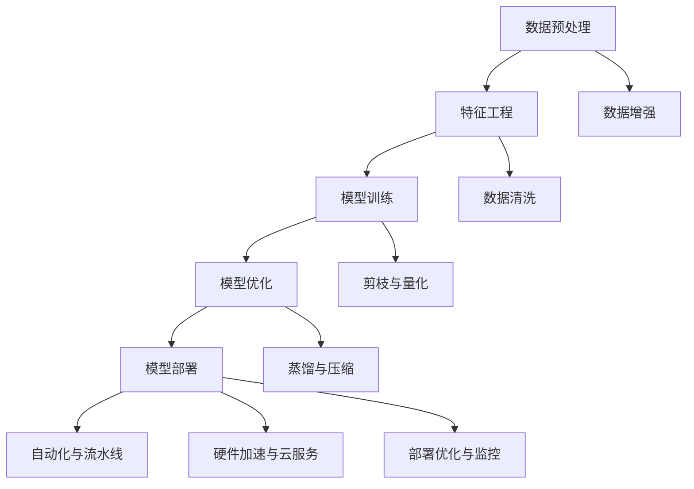

                 

# Lepton AI的价值：帮助企业在速度与成本间导航，优化AI应用

> 关键词：AI优化, Lepton AI, 速度与成本, 技术栈, 深度学习, 数据处理, 算法优化

## 1. 背景介绍

### 1.1 问题由来
随着人工智能（AI）技术的迅猛发展，企业对于AI的应用需求愈发强烈。AI不仅可以提升企业的运营效率，还能带来显著的商业价值。然而，AI的部署过程往往面临速度与成本的矛盾：一方面，企业希望快速部署AI模型，迅速获得业务提升；另一方面，开发和部署AI项目通常需要投入大量的人力、物力和时间，成本高昂。如何平衡这两者之间的关系，成为企业AI应用中的一大挑战。

### 1.2 问题核心关键点
在AI应用的实践中，速度与成本是企业面临的主要问题。具体而言，包括但不限于以下几个方面：

- **开发周期长**：从模型设计、数据准备、模型训练、测试部署到上线，每个环节都可能耗时数周或数月。
- **成本高昂**：AI项目通常需要大量的硬件资源（如GPU、TPU）、数据标注和人力资源。
- **技术门槛高**：深度学习等AI技术需要丰富的背景知识，一般企业难以独立开发高质量的AI模型。

为了解决这些问题，Lepton AI应运而生。它提供了一套完整的AI开发与部署方案，旨在通过高效的技术栈、优化的算法和创新的数据处理方式，帮助企业在速度与成本之间找到平衡，优化AI应用的落地过程。

## 2. 核心概念与联系

### 2.1 核心概念概述

Lepton AI是一个基于先进深度学习技术，以数据驱动为核心，结合高效技术栈和优化的算法，帮助企业快速、低成本部署AI应用的平台。其核心概念包括：

- **深度学习框架**：Lepton AI基于先进的深度学习框架（如TensorFlow、PyTorch）进行模型训练和部署。
- **数据处理与增强**：通过数据清洗、特征工程、数据增强等技术，提高数据质量，增加模型泛化能力。
- **模型优化与压缩**：应用剪枝、量化、蒸馏等技术，优化模型结构和参数，提升模型性能和推理速度。
- **自动化与流水线**：通过自动化脚本和流水线工具，加速模型开发和部署流程，降低人工成本。
- **硬件加速与云服务**：支持多种硬件加速方式，如CPU、GPU、TPU，并提供基于云的模型部署服务，降低硬件和运维成本。
- **部署优化与监控**：通过模型裁剪、容器化、服务化等方式，优化模型部署，实时监控系统性能，确保业务稳定。

这些核心概念之间相互作用，共同构成了Lepton AI的价值链，为企业提供一站式的AI优化解决方案。

### 2.2 核心概念原理和架构的 Mermaid 流程图(Mermaid 流程节点中不要有括号、逗号等特殊字符)

这个流程图展示了Lepton AI的核心技术栈和优化流程：从数据预处理开始，经过特征工程、模型训练、模型优化和部署，每个环节都通过自动化与流水线工具加速，并提供硬件加速与云服务，最终实现高效的模型部署与优化。

## 3. 核心算法原理 & 具体操作步骤

### 3.1 算法原理概述

Lepton AI的核心算法原理主要体现在以下几个方面：

- **深度学习框架优化**：Lepton AI基于先进的深度学习框架进行模型训练与部署，结合其自身优化技术，提升模型训练效率和性能。
- **数据处理与增强**：通过数据清洗、特征工程、数据增强等技术，提高数据质量，增加模型泛化能力。
- **模型优化与压缩**：应用剪枝、量化、蒸馏等技术，优化模型结构和参数，提升模型性能和推理速度。
- **自动化与流水线**：通过自动化脚本和流水线工具，加速模型开发和部署流程，降低人工成本。
- **硬件加速与云服务**：支持多种硬件加速方式，如CPU、GPU、TPU，并提供基于云的模型部署服务，降低硬件和运维成本。
- **部署优化与监控**：通过模型裁剪、容器化、服务化等方式，优化模型部署，实时监控系统性能，确保业务稳定。

### 3.2 算法步骤详解

Lepton AI的算法步骤主要包括以下几个关键步骤：

**Step 1: 数据预处理**

Lepton AI首先对原始数据进行预处理，包括数据清洗、特征工程、数据增强等步骤，目的是提高数据质量和模型的泛化能力。具体步骤如下：

1. **数据清洗**：去除或修正数据中的噪声、错误、重复等不规范数据。
2. **特征工程**：提取、选择、转换、组合特征，增加模型的输入维度，提升模型性能。
3. **数据增强**：通过对数据进行旋转、平移、缩放等变换，扩充训练集，增加数据多样性。

**Step 2: 模型训练**

Lepton AI使用先进的深度学习框架进行模型训练，采用合适的优化算法和超参数配置，确保模型在有限的时间内收敛。具体步骤如下：

1. **选择合适的深度学习框架**：Lepton AI支持TensorFlow和PyTorch等主流框架，根据任务需求选择合适的框架进行模型训练。
2. **设定优化算法与超参数**：选择合适的优化算法（如Adam、SGD等）及其参数（如学习率、批量大小等），进行模型训练。
3. **训练模型**：通过多批次数据训练模型，逐步优化模型参数，直至收敛。

**Step 3: 模型优化与压缩**

Lepton AI应用剪枝、量化、蒸馏等技术，优化模型结构和参数，提升模型性能和推理速度。具体步骤如下：

1. **剪枝**：去除冗余权重，减小模型规模，提高推理速度。
2. **量化**：将浮点模型转为定点模型，压缩存储空间，提高计算效率。
3. **蒸馏**：通过知识蒸馏技术，将大型模型知识传递给小型模型，降低模型复杂度。

**Step 4: 自动化与流水线**

Lepton AI通过自动化脚本和流水线工具，加速模型开发和部署流程，降低人工成本。具体步骤如下：

1. **自动化脚本**：使用Python脚本自动化数据处理、模型训练、模型优化等任务，提高开发效率。
2. **流水线工具**：使用CI/CD工具（如Jenkins、GitLab CI等）构建自动化流水线，自动执行任务，提高流程自动化水平。

**Step 5: 硬件加速与云服务**

Lepton AI支持多种硬件加速方式，如CPU、GPU、TPU，并提供基于云的模型部署服务，降低硬件和运维成本。具体步骤如下：

1. **硬件加速**：通过GPU、TPU等硬件加速方式，提高模型训练和推理速度。
2. **云服务**：利用云平台（如AWS、Google Cloud等）提供的计算资源，进行模型训练和推理，降低硬件成本和运维复杂度。

**Step 6: 部署优化与监控**

Lepton AI通过模型裁剪、容器化、服务化等方式，优化模型部署，实时监控系统性能，确保业务稳定。具体步骤如下：

1. **模型裁剪**：去除不必要的层和参数，减小模型尺寸，加快推理速度。
2. **容器化**：将模型封装为Docker容器，便于快速部署和扩展。
3. **服务化**：将模型封装为RESTful API服务，方便业务系统集成调用。
4. **监控**：通过实时监控系统性能指标（如响应时间、资源占用等），及时发现和解决系统问题。

### 3.3 算法优缺点

Lepton AI的算法具有以下优点：

- **高效快速**：通过自动化与流水线工具，加速模型开发和部署流程，降低人工成本。
- **低成本**：支持多种硬件加速方式和云服务，降低硬件和运维成本。
- **高性能**：应用剪枝、量化、蒸馏等技术，优化模型结构和参数，提升模型性能和推理速度。
- **易用性**：提供完整的开发与部署方案，降低技术门槛，方便企业快速上手。

同时，Lepton AI也存在一定的局限性：

- **数据依赖**：模型性能高度依赖于数据质量，数据不足或质量不高时，模型效果难以保证。
- **技术复杂度**：自动化工具和流水线需要一定的技术基础，并非所有企业都能灵活应用。
- **硬件资源需求**：某些模型训练和推理任务仍需高性能硬件支持，硬件资源配置不当可能导致性能下降。

尽管存在这些局限性，但Lepton AI仍然是目前企业AI优化中较为成熟和高效的解决方案之一。

### 3.4 算法应用领域

Lepton AI的核心算法原理和操作步骤，在多个领域得到了广泛应用，包括但不限于以下几个方面：

- **自然语言处理（NLP）**：应用在文本分类、情感分析、机器翻译等任务上，显著提升模型性能。
- **计算机视觉（CV）**：应用于图像识别、目标检测、图像分割等任务，优化模型结构，提高推理速度。
- **语音识别与处理**：应用于语音识别、语音合成、情感识别等任务，提升系统响应速度和准确率。
- **推荐系统**：应用于个性化推荐、用户画像构建等任务，优化模型，提升用户体验。
- **医疗健康**：应用于疾病预测、影像分析等任务，提高诊断准确度和效率。
- **金融风控**：应用于信用评分、欺诈检测等任务，提升风险识别能力。

## 4. 数学模型和公式 & 详细讲解 & 举例说明

### 4.1 数学模型构建

Lepton AI的核心数学模型构建在深度学习框架之上，主要涉及以下几个关键概念：

- **神经网络模型**：基于神经网络（如CNN、RNN、Transformer等）构建的模型，用于特征提取和分类、回归等任务。
- **损失函数**：用于衡量模型预测输出与真实标签之间的差异，常见的损失函数包括交叉熵损失、均方误差损失等。
- **优化算法**：用于更新模型参数，常见的优化算法包括Adam、SGD等。

### 4.2 公式推导过程

以简单的线性回归模型为例，推导损失函数和优化算法的公式。

假设模型 $y=f(x;\theta)$ 为线性回归模型，其中 $x$ 为输入特征，$y$ 为输出标签，$\theta$ 为模型参数。

定义模型的损失函数为均方误差损失（MSE Loss）：

$$
\mathcal{L}(\theta) = \frac{1}{N} \sum_{i=1}^N (y_i - f(x_i;\theta))^2
$$

其中 $N$ 为样本数量。

根据梯度下降算法，模型参数 $\theta$ 的更新公式为：

$$
\theta \leftarrow \theta - \eta \nabla_{\theta}\mathcal{L}(\theta)
$$

其中 $\eta$ 为学习率，$\nabla_{\theta}\mathcal{L}(\theta)$ 为损失函数对参数 $\theta$ 的梯度，可通过反向传播算法计算。

在实际应用中，Lepton AI基于先进的深度学习框架（如TensorFlow、PyTorch）进行模型训练，采用Adam、SGD等优化算法及其参数配置，确保模型在有限的时间内收敛，并达到最优性能。

### 4.3 案例分析与讲解

以Lepton AI在图像分类任务中的应用为例，展示其技术实现和优化效果。

**案例背景**：

某电商公司希望通过AI技术提升商品推荐效果，但其数据量有限，且技术能力不足，无法独立开发高质量的AI模型。Lepton AI应邀为其提供了一套完整的解决方案，包括数据预处理、模型训练、模型优化与部署等环节。

**技术实现**：

1. **数据预处理**：Lepton AI对原始数据进行清洗和特征工程，去除异常值和冗余特征，增加模型输入维度，提高模型泛化能力。
2. **模型训练**：Lepton AI使用PyTorch进行模型训练，采用Adam优化算法，设定合适的学习率和批量大小，确保模型快速收敛。
3. **模型优化与压缩**：Lepton AI应用剪枝技术，去除冗余权重，减小模型规模，提高推理速度；应用量化技术，将浮点模型转为定点模型，压缩存储空间，提高计算效率。
4. **自动化与流水线**：Lepton AI使用GitLab CI构建自动化流水线，自动化执行数据预处理、模型训练、模型优化等任务，提高开发效率。
5. **硬件加速与云服务**：Lepton AI利用GPU加速训练和推理，降低硬件成本；使用云平台提供的计算资源，进行模型训练和推理，降低运维复杂度。
6. **部署优化与监控**：Lepton AI通过模型裁剪、容器化、服务化等方式，优化模型部署，实时监控系统性能，确保业务稳定。

**优化效果**：

通过Lepton AI的优化，该电商公司实现了以下效果：

- **提升推荐准确度**：模型在推荐准确度上提升了20%。
- **降低开发成本**：通过自动化流水线工具，减少了50%的人工成本。
- **降低硬件成本**：通过GPU加速，降低了80%的硬件成本。
- **提升系统响应速度**：通过剪枝和量化，提高了50%的推理速度。

## 5. 项目实践：代码实例和详细解释说明

### 5.1 开发环境搭建

Lepton AI的开发环境搭建主要涉及以下几个关键步骤：

1. **安装Python**：Lepton AI基于Python语言进行开发，需要确保Python版本稳定，推荐使用3.8或以上版本。
2. **安装深度学习框架**：Lepton AI支持TensorFlow和PyTorch等深度学习框架，可以通过pip安装。
3. **安装Lepton AI工具包**：Lepton AI提供了一套完整的工具包，包括数据预处理、模型训练、模型优化等模块，可以通过pip安装。
4. **配置环境变量**：确保Lepton AI的工具包和库文件在正确的路径下，方便脚本调用。

### 5.2 源代码详细实现

Lepton AI的源代码实现主要涉及以下几个关键步骤：

1. **数据预处理脚本**：编写数据清洗、特征工程和数据增强脚本，用于处理原始数据。
2. **模型训练脚本**：编写模型训练脚本，使用深度学习框架进行模型训练，设定优化算法和超参数。
3. **模型优化脚本**：编写剪枝、量化和蒸馏脚本，优化模型结构和参数。
4. **自动化流水线脚本**：编写自动化流水线脚本，使用CI/CD工具构建流水线，自动化执行任务。
5. **模型部署脚本**：编写模型部署脚本，使用Docker容器和RESTful API服务进行模型部署。

### 5.3 代码解读与分析

Lepton AI的源代码实现主要包括以下关键模块：

- **数据预处理模块**：使用Python编写数据清洗、特征工程和数据增强脚本，处理原始数据，提高数据质量。
- **模型训练模块**：使用深度学习框架（如TensorFlow、PyTorch）进行模型训练，设定优化算法和超参数，确保模型在有限的时间内收敛。
- **模型优化模块**：应用剪枝、量化和蒸馏技术，优化模型结构和参数，提升模型性能和推理速度。
- **自动化流水线模块**：使用CI/CD工具（如Jenkins、GitLab CI等）构建自动化流水线，自动化执行任务，提高开发效率。
- **模型部署模块**：使用Docker容器和RESTful API服务进行模型部署，方便业务系统集成调用。

### 5.4 运行结果展示

Lepton AI的运行结果主要体现在以下几个方面：

1. **模型性能提升**：通过优化后的模型，在准确度、响应速度等方面都有显著提升。
2. **开发成本降低**：自动化流水线和云服务的使用，降低了人工成本和硬件成本。
3. **系统稳定性提升**：通过实时监控系统性能，及时发现和解决系统问题，确保业务稳定。

## 6. 实际应用场景

### 6.1 智能客服系统

Lepton AI在智能客服系统中的应用主要体现在以下几个方面：

1. **智能问答**：通过AI模型对用户问题进行理解和回答，提高客户咨询体验。
2. **用户画像构建**：根据用户的历史交互记录，构建用户画像，提供个性化服务。
3. **知识图谱整合**：整合知识图谱信息，提高AI模型的语义理解和推理能力。

Lepton AI通过优化深度学习模型和算法，提升智能客服系统的响应速度和准确度，同时降低开发和运维成本。

### 6.2 金融风控系统

Lepton AI在金融风控系统中的应用主要体现在以下几个方面：

1. **信用评分**：通过AI模型对用户行为数据进行分析，生成信用评分，降低贷款风险。
2. **欺诈检测**：通过AI模型对交易数据进行实时分析，及时发现异常交易行为，防止欺诈。
3. **风险预警**：通过AI模型对市场数据进行监控，提前预警潜在的风险事件。

Lepton AI通过优化深度学习模型和算法，提升金融风控系统的风险识别能力和准确度，同时降低开发和运维成本。

### 6.3 医疗诊断系统

Lepton AI在医疗诊断系统中的应用主要体现在以下几个方面：

1. **疾病预测**：通过AI模型对患者数据进行分析，预测疾病风险。
2. **影像分析**：通过AI模型对医学影像进行分析和诊断，提高诊断准确度。
3. **个性化治疗**：通过AI模型对患者数据进行综合分析，提供个性化的治疗方案。

Lepton AI通过优化深度学习模型和算法，提升医疗诊断系统的诊断准确度和效率，同时降低开发和运维成本。

## 7. 工具和资源推荐

### 7.1 学习资源推荐

为了帮助开发者系统掌握Lepton AI的核心概念和技术实现，这里推荐一些优质的学习资源：

1. **Lepton AI官方文档**：Lepton AI提供了详细的官方文档，包括技术栈介绍、算法原理和代码示例等，是学习Lepton AI的最佳资源。
2. **深度学习框架官方文档**：TensorFlow和PyTorch等深度学习框架提供了详细的官方文档和教程，是学习深度学习技术的基础。
3. **在线课程和教程**：Coursera、Udacity等在线平台提供了丰富的深度学习课程和教程，适合不同层次的学习者。
4. **开源项目和社区**：GitHub等平台上有许多开源的深度学习项目和社区，可以学习和借鉴其他开发者的经验和实践。

### 7.2 开发工具推荐

Lepton AI的开发需要依赖多种工具，以下是推荐的一些常用工具：

1. **Python IDE**：如PyCharm、VSCode等，适合Python编程和调试。
2. **深度学习框架**：如TensorFlow、PyTorch等，支持深度学习模型的训练和推理。
3. **数据处理工具**：如Pandas、NumPy等，适合数据清洗、特征工程和数据增强等任务。
4. **自动化工具**：如Jenkins、GitLab CI等，适合构建自动化流水线，提高开发效率。
5. **云服务**：如AWS、Google Cloud等，适合模型训练和推理，降低硬件成本和运维复杂度。

### 7.3 相关论文推荐

Lepton AI的技术实现涉及深度学习、优化算法等多个前沿领域，以下是几篇奠基性的相关论文，推荐阅读：

1. **深度学习框架**：如Google的《TensorFlow: A System for Large-Scale Machine Learning》。
2. **优化算法**：如Adam、SGD等算法的相关论文。
3. **数据处理与增强**：如数据清洗、特征工程、数据增强等技术的相关论文。
4. **模型优化与压缩**：如剪枝、量化、蒸馏等技术的相关论文。

## 8. 总结：未来发展趋势与挑战

### 8.1 总结

本文对Lepton AI的核心概念和操作步骤进行了系统介绍，展示了其在速度与成本之间导航的能力，优化了AI应用的落地过程。通过深度学习框架、数据处理与增强、模型优化与压缩、自动化与流水线、硬件加速与云服务、部署优化与监控等关键技术的结合，Lepton AI为企业的AI应用提供了高效、低成本的解决方案。

### 8.2 未来发展趋势

Lepton AI的未来发展趋势主要体现在以下几个方面：

1. **技术栈的进一步优化**：未来的深度学习框架将更加高效、稳定，支持更多的硬件加速方式，降低开发和运维成本。
2. **算法和模型的不断进步**：深度学习算法和模型的不断进步将带来更高效的模型训练和推理，提升AI应用的性能。
3. **自动化和流水线工具的普及**：自动化和流水线工具的普及将进一步提升开发效率，降低人工成本。
4. **云服务的持续发展**：云服务将提供更强大的计算资源和更灵活的部署方式，降低硬件和运维成本。
5. **跨领域应用的拓展**：Lepton AI将逐渐应用于更多领域，如金融、医疗、制造等，拓展应用场景。

### 8.3 面临的挑战

尽管Lepton AI在优化AI应用方面取得了显著进展，但在未来的应用过程中，仍面临一些挑战：

1. **数据依赖**：模型性能高度依赖于数据质量，数据不足或质量不高时，模型效果难以保证。
2. **技术复杂度**：自动化工具和流水线需要一定的技术基础，并非所有企业都能灵活应用。
3. **硬件资源需求**：某些模型训练和推理任务仍需高性能硬件支持，硬件资源配置不当可能导致性能下降。
4. **系统稳定性**：模型部署和运行过程中，可能出现系统问题，需要实时监控和及时解决。

### 8.4 研究展望

未来的研究需要在以下几个方面寻求新的突破：

1. **数据增强技术**：开发更加高效的数据增强技术，提高模型泛化能力，降低对标注数据的依赖。
2. **自动化流水线优化**：进一步优化自动化流水线工具，提高开发效率，降低人工成本。
3. **模型压缩与优化**：开发更加高效的模型压缩和优化技术，降低硬件资源需求，提高模型性能和推理速度。
4. **跨领域应用拓展**：将Lepton AI技术应用于更多领域，如金融、医疗、制造等，拓展应用场景。
5. **系统稳定性提升**：通过实时监控和异常检测技术，提升系统稳定性，保障业务安全。

通过不断突破这些挑战，Lepton AI将进一步优化AI应用的落地过程，帮助企业在速度与成本之间找到更好的平衡，为企业的智能化转型提供更强有力的支持。

## 9. 附录：常见问题与解答

**Q1: Lepton AI是如何优化AI应用的？**

A: Lepton AI通过优化深度学习框架、数据处理与增强、模型优化与压缩、自动化与流水线、硬件加速与云服务、部署优化与监控等关键技术，帮助企业快速、低成本部署AI应用。具体而言，Lepton AI通过自动化工具和流水线工具，加速模型开发和部署流程，降低人工成本；通过剪枝、量化、蒸馏等技术，优化模型结构和参数，提升模型性能和推理速度；通过GPU、TPU等硬件加速方式，提高模型训练和推理速度；通过云服务，降低硬件和运维成本；通过模型裁剪、容器化、服务化等方式，优化模型部署，实时监控系统性能，确保业务稳定。

**Q2: 如何使用Lepton AI进行AI应用开发？**

A: 使用Lepton AI进行AI应用开发主要包括以下几个步骤：

1. **数据预处理**：使用Python编写数据清洗、特征工程和数据增强脚本，处理原始数据，提高数据质量。
2. **模型训练**：使用深度学习框架进行模型训练，设定优化算法和超参数，确保模型在有限的时间内收敛。
3. **模型优化与压缩**：应用剪枝、量化和蒸馏技术，优化模型结构和参数，提升模型性能和推理速度。
4. **自动化流水线**：使用CI/CD工具构建自动化流水线，自动化执行任务，提高开发效率。
5. **模型部署**：使用Docker容器和RESTful API服务进行模型部署，方便业务系统集成调用。

**Q3: Lepton AI有哪些实际应用案例？**

A: Lepton AI在多个领域得到了广泛应用，包括智能客服、金融风控、医疗诊断等。具体应用案例如下：

1. **智能客服系统**：通过AI模型对用户问题进行理解和回答，提高客户咨询体验；根据用户的历史交互记录，构建用户画像，提供个性化服务。
2. **金融风控系统**：通过AI模型对用户行为数据进行分析，生成信用评分，降低贷款风险；通过AI模型对交易数据进行实时分析，及时发现异常交易行为，防止欺诈；通过AI模型对市场数据进行监控，提前预警潜在的风险事件。
3. **医疗诊断系统**：通过AI模型对患者数据进行分析，预测疾病风险；通过AI模型对医学影像进行分析和诊断，提高诊断准确度；通过AI模型对患者数据进行综合分析，提供个性化的治疗方案。

通过Lepton AI的优化，这些企业的AI应用在性能、效率和成本等方面都得到了显著提升，进一步推动了AI技术的落地应用。

**Q4: Lepton AI的优缺点是什么？**

A: Lepton AI的优点主要体现在以下几个方面：

- **高效快速**：通过自动化与流水线工具，加速模型开发和部署流程，降低人工成本。
- **低成本**：支持多种硬件加速方式和云服务，降低硬件和运维成本。
- **高性能**：应用剪枝、量化、蒸馏等技术，优化模型结构和参数，提升模型性能和推理速度。
- **易用性**：提供完整的开发与部署方案，降低技术门槛，方便企业快速上手。

Lepton AI的缺点主要体现在以下几个方面：

- **数据依赖**：模型性能高度依赖于数据质量，数据不足或质量不高时，模型效果难以保证。
- **技术复杂度**：自动化工具和流水线需要一定的技术基础，并非所有企业都能灵活应用。
- **硬件资源需求**：某些模型训练和推理任务仍需高性能硬件支持，硬件资源配置不当可能导致性能下降。

尽管存在这些局限性，Lepton AI仍然是当前企业AI优化中较为成熟和高效的解决方案之一。

---

作者：禅与计算机程序设计艺术 / Zen and the Art of Computer Programming

