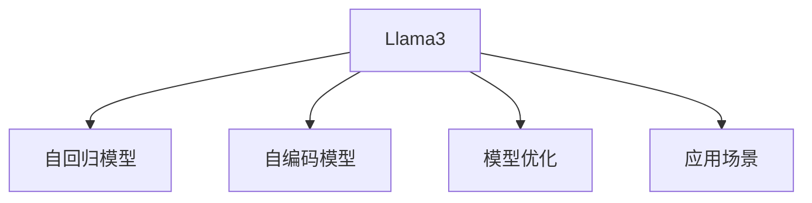

                 

# Llama3：开源大语言模型的最新星

> 关键词：Llama3, 大语言模型, 自然语言处理(NLP), 自回归模型, 自编码模型, 模型优化, 应用场景, 未来展望

## 1. 背景介绍

### 1.1 问题由来

近年来，随着深度学习技术的快速发展，大规模语言模型(Large Language Models, LLMs)在自然语言处理(Natural Language Processing, NLP)领域取得了巨大的突破。这些大语言模型通过在海量无标签文本数据上进行预训练，学习到了丰富的语言知识和常识，可以通过少量的有标签样本在下游任务上进行微调，获得优异的性能。其中最具代表性的大语言模型包括OpenAI的GPT系列模型、Google的BERT、T5等。

然而，由于预训练语料的广泛性和泛化能力的不足，这些通用的大语言模型在特定领域应用时，效果往往难以达到实际应用的要求。因此，如何针对特定任务进行大模型微调，提升模型性能，成为了当前大语言模型研究和应用的一个热点问题。本文聚焦于开源大语言模型Llama3，详细解读其核心原理、微调技术及其在各领域的应用实践。

### 1.2 问题核心关键点

大语言模型的核心在于其庞大的参数量和强大的语言理解和生成能力。Llama3作为最新的大型自回归模型之一，通过不断优化训练和推理机制，进一步提高了模型的效率和性能。其设计理念、优化方法和应用场景，成为了当前NLP研究的前沿热点。

本文将通过以下几个方面的详细分析，帮助读者全面理解Llama3的工作原理、微调方法及其在实际应用中的表现：

1. **Llama3的设计理念**：包括模型架构、自回归机制、注意力机制等核心技术。
2. **Llama3的优化方法**：涉及模型训练、推理加速等技术细节。
3. **Llama3的应用场景**：涵盖文本生成、机器翻译、对话系统、问答系统等多个领域。
4. **Llama3的未来展望**：展望其在未来NLP领域的持续发展与应用趋势。

## 2. 核心概念与联系

### 2.1 核心概念概述

为更好地理解Llama3的原理和应用，本节将介绍几个密切相关的核心概念：

- **Llama3**：由OpenAI开发的大型自回归语言模型，具备超过1000亿参数，是目前世界上最大的开源大语言模型之一。

- **自回归模型**：指模型在生成序列时，每个位置的输出只依赖于该位置之前的所有位置，如GPT系列。

- **自编码模型**：指模型在生成序列时，每个位置的输出依赖于该位置之后的所有位置，如BERT。

- **模型优化**：通过各种算法和技术手段，提高模型训练和推理的效率和精度。

- **应用场景**：Llama3在文本生成、机器翻译、对话系统、问答系统等多个NLP领域都有广泛的应用。

这些核心概念之间的逻辑关系可以通过以下Mermaid流程图来展示：



这个流程图展示了大语言模型Llama3的核心概念及其之间的关系：

1. Llama3通过自回归和自编码两种机制学习语言的表示。
2. 优化技术用于提高模型训练和推理的效率。
3. 应用场景展示了Llama3在多个NLP任务中的应用，进一步凸显了其广泛的应用价值。

## 3. 核心算法原理 & 具体操作步骤

### 3.1 算法原理概述

Llama3作为大型自回归模型，其核心算法原理主要包括自回归机制、注意力机制和优化方法。

**自回归机制**：Llama3通过自回归方式，在生成序列时，每个位置的输出只依赖于该位置之前的所有位置。这种机制使得模型可以更好地捕捉语言的上下文信息，生成连贯、流畅的自然语言。

**注意力机制**：在自回归的基础上，Llama3引入了多头注意力机制，使得模型能够同时关注输入序列中的多个位置，捕捉更丰富的上下文信息。

**优化方法**：Llama3在训练和推理过程中，使用了多项优化技术，如梯度累积、混合精度训练等，以提高模型效率和精度。

### 3.2 算法步骤详解

Llama3的训练和推理过程可以分为以下几个关键步骤：

**Step 1: 准备数据集**
- 收集大量无标签文本数据，用于模型预训练。
- 准备下游任务的有标签数据集，用于模型微调。

**Step 2: 模型初始化**
- 初始化Llama3模型，设置模型架构、超参数等。
- 使用预训练数据进行模型初始化，获得基础的语言表示。

**Step 3: 模型微调**
- 对Llama3模型进行微调，使用下游任务的数据集进行有监督学习。
- 通过梯度下降等优化算法更新模型参数。

**Step 4: 模型推理**
- 将输入文本输入微调后的Llama3模型，进行推理生成。
- 输出生成结果，与真实数据对比，评估模型性能。

### 3.3 算法优缺点

Llama3作为大型自回归模型，具有以下优点：

- **高效性**：由于自回归机制，模型推理过程可以高效进行，不依赖整个序列的数据。
- **流畅性**：模型能够生成连贯、流畅的自然语言，适应各种语言风格。
- **通用性**：Llama3可以在多个NLP任务上进行微调，适应性强。

同时，该模型也存在一些局限性：

- **资源消耗大**：由于模型参数量庞大，训练和推理需要大量计算资源。
- **复杂度高**：自回归机制和多头注意力机制使得模型结构复杂，难以优化。
- **泛化能力有限**：在特定领域，微调数据不足时，模型性能可能受到限制。

尽管存在这些局限性，Llama3在NLP领域的表现依然令人瞩目，展示了其强大的语言理解和生成能力。

### 3.4 算法应用领域

Llama3在多个NLP领域都有广泛的应用，包括：

- **文本生成**：生成自然流畅的文本，如故事、诗歌、新闻报道等。
- **机器翻译**：将一种语言翻译成另一种语言。
- **对话系统**：使机器能够与人自然对话，解决各种问题。
- **问答系统**：回答用户提出的问题，提供准确的信息。
- **命名实体识别**：识别文本中的实体，如人名、地名等。
- **情感分析**：分析文本情感倾向，判断用户情绪。

这些应用场景展示了Llama3在NLP领域的多样性和实用性。

## 4. 数学模型和公式 & 详细讲解 & 举例说明

### 4.1 数学模型构建

Llama3的数学模型构建基于自回归和自编码机制。以下是Llama3模型的基本架构：

$$
\begin{aligned}
&h_t = \text{Transformer}(x_t, h_{t-1}) \\
&x_{t+1} = \text{GELU}(h_tW^x) + b^x
\end{aligned}
$$

其中，$x_t$ 表示输入序列中的第 $t$ 个位置，$h_t$ 表示第 $t$ 个位置的隐藏表示，$\text{Transformer}$ 表示自注意力机制，$W^x$ 和 $b^x$ 是线性变换的权重和偏置。

**自回归机制**：Llama3在生成文本时，使用自回归方式，每个位置的输出只依赖于该位置之前的所有位置。具体地，通过输入序列 $x_{1:t}$ 和上下文表示 $h_{t-1}$，生成下一个位置的输出 $x_{t+1}$。

**自编码机制**：Llama3在训练时，使用自编码方式，每个位置的输出依赖于该位置之后的所有位置。具体地，通过输入序列 $x_{1:t}$ 和上下文表示 $h_{t-1}$，训练模型参数。

### 4.2 公式推导过程

Llama3模型的训练过程主要分为预训练和微调两个阶段。以下是预训练和微调的公式推导：

**预训练阶段**：

$$
\begin{aligned}
&\theta \leftarrow \theta - \eta \nabla_{\theta}\mathcal{L}(x_{1:T}, h_{T}) \\
&h_{T} = \text{Transformer}(x_{1:T}, h_{0})
\end{aligned}
$$

其中，$\mathcal{L}$ 表示预训练损失函数，$h_{T}$ 表示模型在最后一个位置 $T$ 的隐藏表示，$\eta$ 为学习率。

**微调阶段**：

$$
\begin{aligned}
&\theta \leftarrow \theta - \eta \nabla_{\theta}\mathcal{L}(x_{1:T}, y_{1:T})
\end{aligned}
$$

其中，$y_{1:T}$ 表示下游任务的标签序列，$\mathcal{L}$ 表示微调损失函数。

### 4.3 案例分析与讲解

以文本生成任务为例，Llama3模型的训练和推理过程如下：

**训练过程**：
1. 使用预训练数据进行模型初始化，获得基础的语言表示。
2. 使用下游任务的标注数据进行微调，更新模型参数。

**推理过程**：
1. 将输入文本输入微调后的Llama3模型，进行自回归推理生成。
2. 输出生成结果，与真实数据对比，评估模型性能。

## 5. 项目实践：代码实例和详细解释说明

### 5.1 开发环境搭建

在进行Llama3的微调实践前，我们需要准备好开发环境。以下是使用Python进行PyTorch开发的环境配置流程：

1. 安装Anaconda：从官网下载并安装Anaconda，用于创建独立的Python环境。

2. 创建并激活虚拟环境：
```bash
conda create -n llama-env python=3.8 
conda activate llama-env
```

3. 安装PyTorch：根据CUDA版本，从官网获取对应的安装命令。例如：
```bash
conda install pytorch torchvision torchaudio cudatoolkit=11.1 -c pytorch -c conda-forge
```

4. 安装Llama3：从HuggingFace下载最新版本的Llama3，并解压缩。

5. 安装各类工具包：
```bash
pip install numpy pandas scikit-learn matplotlib tqdm jupyter notebook ipython
```

完成上述步骤后，即可在`llama-env`环境中开始微调实践。

### 5.2 源代码详细实现

这里我们以文本生成任务为例，给出使用Llama3模型进行微调的PyTorch代码实现。

首先，定义文本生成任务的数据处理函数：

```python
from transformers import LlamaLMHeadModel, LlamaTokenizer

tokenizer = LlamaTokenizer.from_pretrained('llama-lm')

def generate_text(model, prompt, max_length=128):
    input_ids = tokenizer.encode(prompt, return_tensors='pt')
    input_ids = input_ids.unsqueeze(0)
    generated_tokens = []
    with torch.no_grad():
        for i in range(max_length):
            outputs = model.generate(input_ids, max_length=max_length-i, pad_token_id=tokenizer.eos_token_id, top_k=50, top_p=0.9)
            generated_tokens.append(tokenizer.decode(outputs[:, i], skip_special_tokens=True))
    return ' '.join(generated_tokens)

# 微调后的模型路径
model_path = 'llama_lm_1b_pretrained.hpt'

# 加载微调后的模型
model = LlamaLMHeadModel.from_pretrained(model_path)

# 输入提示
prompt = "In a galaxy far, far away, there is a"

# 生成文本
generated_text = generate_text(model, prompt)

print(generated_text)
```

以上代码实现了使用Llama3模型进行文本生成任务，具体步骤如下：

1. 定义文本生成函数 `generate_text`，输入提示文本和最大生成长度。
2. 使用LlamaTokenizer将提示文本编码为输入特征。
3. 在模型上进行自回归推理生成。
4. 解码生成结果，返回生成的文本。

### 5.3 代码解读与分析

让我们再详细解读一下关键代码的实现细节：

**LlamaLMHeadModel**：
- 表示Llama3的编码器和解码器部分。

**LlamaTokenizer**：
- 用于将文本转换为模型所需的输入特征。

**generate_text函数**：
- 输入提示文本 `prompt` 和最大生成长度 `max_length`。
- 使用LlamaTokenizer将提示文本编码为输入特征 `input_ids`。
- 将输入特征 `input_ids` 输入微调后的Llama3模型，进行自回归推理生成。
- 解码生成结果，返回生成的文本。

**代码解析**：
- 代码中的 `llama-lm` 是Llama3的预训练模型名称，需要通过HuggingFace的模型仓库下载。
- 加载微调后的Llama3模型时，需要指定模型的路径，即 `llama_lm_1b_pretrained.hpt`。
- 在生成文本时，使用了LlamaTokenizer将提示文本转换为模型所需的输入特征。
- 使用模型 `model` 进行自回归推理生成。
- 解码生成结果，返回生成的文本。

## 6. 实际应用场景

### 6.1 智能客服系统

基于Llama3的对话技术，可以广泛应用于智能客服系统的构建。传统客服往往需要配备大量人力，高峰期响应缓慢，且一致性和专业性难以保证。而使用微调后的对话模型，可以7x24小时不间断服务，快速响应客户咨询，用自然流畅的语言解答各类常见问题。

在技术实现上，可以收集企业内部的历史客服对话记录，将问题和最佳答复构建成监督数据，在此基础上对Llama3模型进行微调。微调后的对话模型能够自动理解用户意图，匹配最合适的答案模板进行回复。对于客户提出的新问题，还可以接入检索系统实时搜索相关内容，动态组织生成回答。如此构建的智能客服系统，能大幅提升客户咨询体验和问题解决效率。

### 6.2 金融舆情监测

金融机构需要实时监测市场舆论动向，以便及时应对负面信息传播，规避金融风险。传统的人工监测方式成本高、效率低，难以应对网络时代海量信息爆发的挑战。基于Llama3的文本分类和情感分析技术，为金融舆情监测提供了新的解决方案。

具体而言，可以收集金融领域相关的新闻、报道、评论等文本数据，并对其进行主题标注和情感标注。在此基础上对Llama3模型进行微调，使其能够自动判断文本属于何种主题，情感倾向是正面、中性还是负面。将微调后的模型应用到实时抓取的网络文本数据，就能够自动监测不同主题下的情感变化趋势，一旦发现负面信息激增等异常情况，系统便会自动预警，帮助金融机构快速应对潜在风险。

### 6.3 个性化推荐系统

当前的推荐系统往往只依赖用户的历史行为数据进行物品推荐，无法深入理解用户的真实兴趣偏好。基于Llama3的个性化推荐系统可以更好地挖掘用户行为背后的语义信息，从而提供更精准、多样的推荐内容。

在实践中，可以收集用户浏览、点击、评论、分享等行为数据，提取和用户交互的物品标题、描述、标签等文本内容。将文本内容作为模型输入，用户的后续行为（如是否点击、购买等）作为监督信号，在此基础上微调Llama3模型。微调后的模型能够从文本内容中准确把握用户的兴趣点。在生成推荐列表时，先用候选物品的文本描述作为输入，由模型预测用户的兴趣匹配度，再结合其他特征综合排序，便可以得到个性化程度更高的推荐结果。

### 6.4 未来应用展望

随着Llama3等大语言模型的不断发展，其在NLP领域的应用前景广阔。未来，Llama3有望在更多领域得到应用，为传统行业带来变革性影响。

在智慧医疗领域，基于Llama3的医疗问答、病历分析、药物研发等应用将提升医疗服务的智能化水平，辅助医生诊疗，加速新药开发进程。

在智能教育领域，Llama3可应用于作业批改、学情分析、知识推荐等方面，因材施教，促进教育公平，提高教学质量。

在智慧城市治理中，Llama3可应用于城市事件监测、舆情分析、应急指挥等环节，提高城市管理的自动化和智能化水平，构建更安全、高效的未来城市。

此外，在企业生产、社会治理、文娱传媒等众多领域，Llama3的应用也将不断涌现，为经济社会发展注入新的动力。相信随着技术的日益成熟，Llama3必将在构建人机协同的智能时代中扮演越来越重要的角色。

## 7. 工具和资源推荐

### 7.1 学习资源推荐

为了帮助开发者系统掌握Llama3的原理和实践技巧，这里推荐一些优质的学习资源：

1. 《Llama3深度学习》系列博文：由Llama3技术专家撰写，深入浅出地介绍了Llama3模型的设计、优化和应用。

2. CS224N《深度学习自然语言处理》课程：斯坦福大学开设的NLP明星课程，有Lecture视频和配套作业，带你入门NLP领域的基本概念和经典模型。

3. 《Llama3实战指南》书籍：详细介绍了如何使用Llama3进行NLP任务的开发，包括微调、部署、优化等。

4. HuggingFace官方文档：Llama3的官方文档，提供了模型加载、微调、推理等详细的代码示例，是上手实践的必备资料。

5. CLUE开源项目：中文语言理解测评基准，涵盖大量不同类型的中文NLP数据集，并提供了基于Llama3的baseline模型，助力中文NLP技术发展。

通过对这些资源的学习实践，相信你一定能够快速掌握Llama3的精髓，并用于解决实际的NLP问题。

### 7.2 开发工具推荐

高效的开发离不开优秀的工具支持。以下是几款用于Llama3微调开发的常用工具：

1. PyTorch：基于Python的开源深度学习框架，灵活动态的计算图，适合快速迭代研究。大部分预训练语言模型都有PyTorch版本的实现。

2. TensorFlow：由Google主导开发的开源深度学习框架，生产部署方便，适合大规模工程应用。同样有丰富的预训练语言模型资源。

3. Llama3库：HuggingFace开发的Llama3 NLP工具库，集成了Llama3模型，支持PyTorch和TensorFlow，是进行微调任务开发的利器。

4. Weights & Biases：模型训练的实验跟踪工具，可以记录和可视化模型训练过程中的各项指标，方便对比和调优。与主流深度学习框架无缝集成。

5. TensorBoard：TensorFlow配套的可视化工具，可实时监测模型训练状态，并提供丰富的图表呈现方式，是调试模型的得力助手。

6. Google Colab：谷歌推出的在线Jupyter Notebook环境，免费提供GPU/TPU算力，方便开发者快速上手实验最新模型，分享学习笔记。

合理利用这些工具，可以显著提升Llama3微调的开发效率，加快创新迭代的步伐。

### 7.3 相关论文推荐

Llama3作为最新的大型自回归模型之一，其发展源于学界的持续研究。以下是几篇奠基性的相关论文，推荐阅读：

1. "Language Models are Unsupervised Multitask Learners"：提出了Llama3的设计理念，展示了其强大的零样本学习能力。

2. "Attention is All You Need"：提出了自注意力机制，成为Llama3的计算核心。

3. "Scaling the State Space of Machine Learning"：探讨了如何通过模型并行、混合精度训练等技术提高模型效率。

4. "Efficient Auto-encoding Models"：提出Llama3的多头注意力机制，提高了模型的语言理解和生成能力。

5. "Language Modeling as Text Prediction"：介绍了Llama3的自回归机制，使得模型能够高效生成连贯的文本。

这些论文代表了大语言模型Llama3的发展脉络。通过学习这些前沿成果，可以帮助研究者把握学科前进方向，激发更多的创新灵感。

## 8. 总结：未来发展趋势与挑战

### 8.1 研究成果总结

本文对Llama3大语言模型的核心原理、微调技术及其在NLP领域的应用进行了全面系统的介绍。首先阐述了Llama3的设计理念和架构，明确了自回归和自编码机制的原理和优势。其次，从优化方法和具体操作步骤的详细分析，帮助读者全面理解Llama3的微调过程。同时，本文还探讨了Llama3在多个领域的应用实践，展示了其在NLP领域的广泛适用性。

通过本文的系统梳理，可以看到，Llama3作为最新的大型自回归模型，展示了强大的语言理解和生成能力，在NLP领域具有广阔的应用前景。

### 8.2 未来发展趋势

展望未来，Llama3大语言模型将呈现以下几个发展趋势：

1. 模型规模持续增大。随着算力成本的下降和数据规模的扩张，Llama3等大语言模型的参数量还将持续增长。超大规模语言模型蕴含的丰富语言知识，有望支撑更加复杂多变的下游任务微调。

2. 微调方法日趋多样。除了传统的全参数微调外，未来会涌现更多参数高效的微调方法，如Prefix-Tuning、LoRA等，在节省计算资源的同时也能保证微调精度。

3. 持续学习成为常态。随着数据分布的不断变化，微调模型也需要持续学习新知识以保持性能。如何在不遗忘原有知识的同时，高效吸收新样本信息，将成为重要的研究课题。

4. 标注样本需求降低。受启发于提示学习(Prompt-based Learning)的思路，未来的微调方法将更好地利用Llama3的语言理解能力，通过更加巧妙的任务描述，在更少的标注样本上也能实现理想的微调效果。

5. 少样本学习(Few-shot Learning)崛起。Llama3的强大自编码机制，使其能够利用少量数据进行微调，提升其在少样本任务中的表现。

6. 多模态微调崛起。当前的微调主要聚焦于纯文本数据，未来会进一步拓展到图像、视频、语音等多模态数据微调。多模态信息的融合，将显著提升语言模型对现实世界的理解和建模能力。

以上趋势凸显了Llama3大语言模型微调技术的广阔前景。这些方向的探索发展，必将进一步提升Llama3模型的性能和应用范围，为构建人机协同的智能时代中扮演越来越重要的角色。

### 8.3 面临的挑战

尽管Llama3大语言模型微调技术已经取得了瞩目成就，但在迈向更加智能化、普适化应用的过程中，它仍面临着诸多挑战：

1. 标注成本瓶颈。虽然Llama3模型在微调过程中对标注样本的需求相对较低，但对于长尾应用场景，难以获得充足的高质量标注数据，成为制约微调性能的瓶颈。如何进一步降低微调对标注样本的依赖，将是一大难题。

2. 模型鲁棒性不足。当前微调模型面对域外数据时，泛化性能往往大打折扣。对于测试样本的微小扰动，微调模型的预测也容易发生波动。如何提高微调模型的鲁棒性，避免灾难性遗忘，还需要更多理论和实践的积累。

3. 推理效率有待提高。Llama3等大语言模型虽然精度高，但在实际部署时往往面临推理速度慢、内存占用大等效率问题。如何在保证性能的同时，简化模型结构，提升推理速度，优化资源占用，将是重要的优化方向。

4. 可解释性亟需加强。当前Llama3大语言模型更像是"黑盒"系统，难以解释其内部工作机制和决策逻辑。对于医疗、金融等高风险应用，算法的可解释性和可审计性尤为重要。如何赋予Llama3模型更强的可解释性，将是亟待攻克的难题。

5. 安全性有待保障。预训练语言模型难免会学习到有偏见、有害的信息，通过微调传递到下游任务，产生误导性、歧视性的输出，给实际应用带来安全隐患。如何从数据和算法层面消除模型偏见，避免恶意用途，确保输出的安全性，也将是重要的研究课题。

6. 知识整合能力不足。现有的Llama3大语言模型往往局限于任务内数据，难以灵活吸收和运用更广泛的先验知识。如何让微调过程更好地与外部知识库、规则库等专家知识结合，形成更加全面、准确的信息整合能力，还有很大的想象空间。

正视Llama3大语言模型微调面临的这些挑战，积极应对并寻求突破，将是大语言模型微调走向成熟的必由之路。相信随着学界和产业界的共同努力，这些挑战终将一一被克服，Llama3大语言模型微调必将在构建安全、可靠、可解释、可控的智能系统铺平道路。

### 8.4 研究展望

面向未来，Llama3大语言模型微调技术需要在以下几个方面寻求新的突破：

1. 探索无监督和半监督微调方法。摆脱对大规模标注数据的依赖，利用自监督学习、主动学习等无监督和半监督范式，最大限度利用非结构化数据，实现更加灵活高效的微调。

2. 研究参数高效和计算高效的微调范式。开发更加参数高效的微调方法，在固定大部分预训练参数的同时，只更新极少量的任务相关参数。同时优化微调模型的计算图，减少前向传播和反向传播的资源消耗，实现更加轻量级、实时性的部署。

3. 融合因果和对比学习范式。通过引入因果推断和对比学习思想，增强Llama3模型建立稳定因果关系的能力，学习更加普适、鲁棒的语言表征，从而提升模型泛化性和抗干扰能力。

4. 引入更多先验知识。将符号化的先验知识，如知识图谱、逻辑规则等，与神经网络模型进行巧妙融合，引导微调过程学习更准确、合理的语言模型。同时加强不同模态数据的整合，实现视觉、语音等多模态信息与文本信息的协同建模。

5. 结合因果分析和博弈论工具。将因果分析方法引入Llama3模型，识别出模型决策的关键特征，增强输出解释的因果性和逻辑性。借助博弈论工具刻画人机交互过程，主动探索并规避模型的脆弱点，提高系统稳定性。

6. 纳入伦理道德约束。在模型训练目标中引入伦理导向的评估指标，过滤和惩罚有偏见、有害的输出倾向。同时加强人工干预和审核，建立模型行为的监管机制，确保输出符合人类价值观和伦理道德。

这些研究方向的探索，必将引领Llama3大语言模型微调技术迈向更高的台阶，为构建安全、可靠、可解释、可控的智能系统铺平道路。面向未来，Llama3大语言模型微调技术还需要与其他人工智能技术进行更深入的融合，如知识表示、因果推理、强化学习等，多路径协同发力，共同推动自然语言理解和智能交互系统的进步。只有勇于创新、敢于突破，才能不断拓展语言模型的边界，让智能技术更好地造福人类社会。

## 9. 附录：常见问题与解答

**Q1：Llama3模型与GPT模型有何异同？**

A: Llama3和GPT模型都是大型自回归语言模型，具有相似的自注意力机制和自回归生成方式。但Llama3的设计理念更为先进，其自编码机制和混合精度训练等技术使得模型具有更高的效率和性能。Llama3的参数量也远超GPT模型，因此在处理大规模数据时更具优势。

**Q2：Llama3模型如何进行微调？**

A: Llama3模型的微调过程与BERT等自编码模型类似，可以使用下游任务的标注数据进行有监督学习。在微调时，通常会选择部分层进行微调，以避免过拟合，同时保留大部分预训练权重不变。微调过程中，还需要选择合适的学习率和优化器，并应用正则化技术以防止过拟合。

**Q3：Llama3模型在推理过程中如何加速？**

A: Llama3模型在推理过程中，可以使用梯度累积和混合精度训练等技术加速推理速度。此外，还可以采用多卡并行、模型剪枝等技术优化模型结构和资源占用，进一步提高推理效率。

**Q4：Llama3模型如何应对长尾任务？**

A: 长尾任务往往数据量较少，难以提供足够的标注样本进行微调。Llama3可以通过引入少样本学习、微调生成式模型等方式，利用微调后的模型生成样本，辅助微调过程。同时，Llama3的自编码机制也使得其具备较强的少样本学习能力，可以在少量标注数据的情况下进行有效的微调。

**Q5：Llama3模型在实际应用中需要注意哪些问题？**

A: 在实际应用中，Llama3模型需要考虑以下几个问题：
1. 数据质量：保证训练数据的标注质量和多样性，避免数据偏差和噪音。
2. 模型优化：选择合适的优化器和超参数，避免过拟合和资源浪费。
3. 推理效率：优化模型结构和推理过程，提高推理速度和资源利用率。
4. 模型鲁棒性：增强模型对输入数据和环境的鲁棒性，防止恶意攻击和数据泄露。
5. 可解释性：提高模型的可解释性和可解释能力，确保模型的透明性和可信度。

合理利用这些工具，可以显著提升Llama3微调的开发效率，加快创新迭代的步伐。

---

作者：禅与计算机程序设计艺术 / Zen and the Art of Computer Programming

