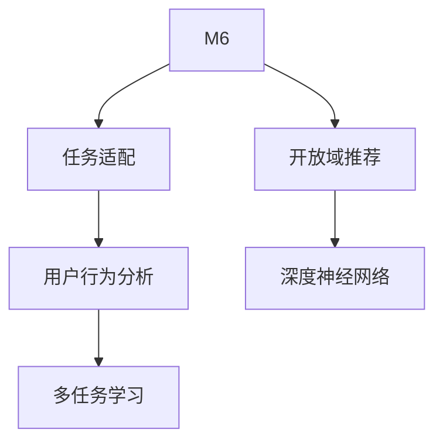

                 

# M6-Rec:基于M6的开放域推荐与任务适配

> 关键词：推荐系统,开放域推荐,任务适配,用户行为分析,多任务学习

## 1. 背景介绍

### 1.1 问题由来

随着信息时代的到来，互联网用户产生了海量的数据，这些数据蕴含着丰富的用户行为信息。在电商平台、社交网络等平台上，推荐系统已经成为用户获取信息的主要方式。然而，现有的推荐系统主要依赖于用户的显式反馈数据进行推荐，难以捕捉用户的真实需求。如何利用用户在平台上的行为数据，挖掘隐含的需求，实现精准推荐，成为亟待解决的问题。

开放域推荐和任务适配技术为解决这一问题提供了新的思路。通过挖掘用户在不同场景中的行为数据，发现其背后的深层次需求，可以有效提升推荐系统的性能。本文将介绍基于M6的开放域推荐和任务适配技术，详细阐述其原理、算法和应用。

### 1.2 问题核心关键点

开放域推荐和任务适配技术主要涉及以下几个核心关键点：

- **开放域推荐**：利用用户在不同场景下的行为数据，挖掘其深层次需求，实现跨领域、跨场景的推荐。
- **任务适配**：针对特定任务设计适配的模型和算法，提升推荐系统的性能。
- **用户行为分析**：通过对用户行为数据的建模，发现用户兴趣和行为模式，为推荐提供依据。
- **多任务学习**：将推荐任务与其它任务（如分类、生成等）联合训练，提高模型的泛化能力。

这些核心关键点共同构成了开放域推荐和任务适配技术的框架，为其在推荐系统中的应用提供了理论基础和实践路径。

## 2. 核心概念与联系

### 2.1 核心概念概述

为更好地理解基于M6的开放域推荐和任务适配技术，本节将介绍几个密切相关的核心概念：

- **M6**：一种深度神经网络架构，用于处理多任务学习和多输入输出任务。
- **开放域推荐**：利用用户在不同场景下的行为数据，挖掘其深层次需求，实现跨领域、跨场景的推荐。
- **任务适配**：针对特定任务设计适配的模型和算法，提升推荐系统的性能。
- **用户行为分析**：通过对用户行为数据的建模，发现用户兴趣和行为模式，为推荐提供依据。
- **多任务学习**：将推荐任务与其它任务（如分类、生成等）联合训练，提高模型的泛化能力。
- **深度神经网络**：一种基于多层神经元的网络结构，用于处理非线性问题，如图像识别、语音识别、自然语言处理等。

这些核心概念之间的逻辑关系可以通过以下Mermaid流程图来展示：



这个流程图展示了大语言模型的核心概念及其之间的关系：

1. M6作为一种深度神经网络架构，是实现多任务学习的基础。
2. 开放域推荐利用用户在不同场景下的行为数据，挖掘其深层次需求，实现跨领域、跨场景的推荐。
3. 任务适配针对特定任务设计适配的模型和算法，提升推荐系统的性能。
4. 用户行为分析通过对用户行为数据的建模，发现用户兴趣和行为模式，为推荐提供依据。
5. 多任务学习将推荐任务与其它任务联合训练，提高模型的泛化能力。
6. 深度神经网络是实现多任务学习和用户行为分析的重要工具。

这些概念共同构成了开放域推荐和任务适配技术的框架，使其能够在推荐系统中的应用提供理论基础和实践路径。

## 3. 核心算法原理 & 具体操作步骤

### 3.1 算法原理概述

基于M6的开放域推荐和任务适配技术，其核心思想是利用深度神经网络的多任务学习能力，在多个任务上进行联合训练，提高模型的泛化能力和性能。具体而言，该技术将推荐任务与其它任务（如分类、生成等）联合训练，利用用户在不同场景下的行为数据，挖掘其深层次需求，实现跨领域、跨场景的推荐。

形式化地，假设推荐任务为 $T_{rec}$，其它任务为 $T_{task}$，共同构成多任务集合 $T$。定义用户行为数据为 $\mathcal{D}$，其中 $\mathcal{D}_{rec}$ 为推荐场景下的行为数据，$\mathcal{D}_{task}$ 为其它任务场景下的行为数据。利用M6架构，设计任务适配模块 $F_{rec}$ 和 $F_{task}$，分别处理推荐任务和其它任务，得到推荐结果 $\hat{y}_{rec}$ 和任务结果 $\hat{y}_{task}$。目标是最小化联合损失函数 $\mathcal{L}$：

$$
\mathcal{L} = \mathcal{L}_{rec} + \lambda\mathcal{L}_{task}
$$

其中 $\mathcal{L}_{rec}$ 为推荐任务损失，$\mathcal{L}_{task}$ 为其它任务损失，$\lambda$ 为任务权重。通过优化联合损失函数，最大化推荐效果，同时兼顾其它任务的性能。

### 3.2 算法步骤详解

基于M6的开放域推荐和任务适配技术一般包括以下几个关键步骤：

**Step 1: 准备数据集**

- 收集用户在不同场景下的行为数据 $\mathcal{D}$，包括推荐场景下的行为数据 $\mathcal{D}_{rec}$ 和其它任务场景下的行为数据 $\mathcal{D}_{task}$。
- 对数据集进行预处理，包括数据清洗、特征提取、数据增强等。

**Step 2: 设计任务适配模块**

- 根据任务特点，设计适配的M6架构。对于推荐任务，通常使用序列模型处理用户行为数据，输出推荐结果。
- 对于其它任务，如分类、生成等，可以使用循环模型、编码器-解码器模型等不同架构，输出任务结果。

**Step 3: 设置多任务学习参数**

- 选择合适的优化算法及其参数，如AdamW、SGD等，设置学习率、批大小、迭代轮数等。
- 设置任务权重 $\lambda$，以及其它任务的损失函数。

**Step 4: 执行联合训练**

- 将数据集 $\mathcal{D}$ 分成训练集、验证集和测试集，按照顺序对数据进行批次化加载。
- 对模型进行前向传播，计算联合损失函数 $\mathcal{L}$。
- 反向传播计算参数梯度，根据设定的优化算法和学习率更新模型参数。
- 周期性在验证集上评估模型性能，根据性能指标决定是否触发Early Stopping。
- 重复上述步骤直到满足预设的迭代轮数或Early Stopping条件。

**Step 5: 任务适配与推荐**

- 在测试集上对模型进行任务适配，得到推荐结果 $\hat{y}_{rec}$。
- 利用推荐结果进行推荐，输出推荐列表。

以上是基于M6的开放域推荐和任务适配技术的完整流程。在实际应用中，还需要针对具体任务进行优化设计，如改进模型架构，引入更多的正则化技术，搜索最优的超参数组合等，以进一步提升模型性能。

### 3.3 算法优缺点

基于M6的开放域推荐和任务适配技术具有以下优点：

1. 跨领域、跨场景推荐：通过联合训练，利用用户在不同场景下的行为数据，挖掘其深层次需求，实现跨领域、跨场景的推荐。
2. 提升模型泛化能力：多任务学习能够提高模型的泛化能力，增强推荐系统的鲁棒性和适应性。
3. 高效利用用户数据：利用用户在不同场景下的行为数据，最大化利用数据资源，提升推荐效果。
4. 任务适配灵活：根据不同任务设计适配的模型和算法，提高推荐系统的性能和适应性。
5. 模型易于扩展：M6架构具有较好的可扩展性，可以方便地加入新任务和模型。

同时，该技术也存在一定的局限性：

1. 数据需求较大：联合训练需要大量的数据支持，对于小规模数据集效果可能不佳。
2. 模型复杂度较高：多任务学习模型较复杂，计算资源和内存消耗较大。
3. 任务间交互影响：不同任务间可能存在交互影响，导致任务结果相互干扰，降低推荐效果。
4. 模型解释性不足：多任务学习模型的决策过程复杂，难以解释推荐结果的来源和依据。

尽管存在这些局限性，但就目前而言，基于M6的开放域推荐和任务适配技术仍是最为主流和有效的推荐方法之一。未来相关研究的重点在于如何进一步降低数据需求，提高模型效率，同时兼顾模型可解释性和任务适应性等因素。

### 3.4 算法应用领域

基于M6的开放域推荐和任务适配技术已经在多个领域得到了应用，包括但不限于：

- 电商推荐系统：利用用户在不同场景下的行为数据，推荐用户可能感兴趣的商品。
- 社交媒体推荐系统：推荐用户可能感兴趣的内容，如文章、视频等。
- 音乐推荐系统：根据用户在不同场景下的听歌行为，推荐相似的音乐和歌手。
- 新闻推荐系统：推荐用户可能感兴趣的新闻报道和文章。
- 视频推荐系统：推荐用户可能感兴趣的视频内容。

除了上述这些经典应用外，该技术还在医疗、金融、教育等诸多领域得到了创新性的应用，为推荐系统的开发提供了新的思路和方向。随着M6架构和推荐技术的发展，相信开放域推荐和任务适配技术将在更多领域得到应用，为推荐系统的创新和优化提供新的动力。

## 4. 数学模型和公式 & 详细讲解

### 4.1 数学模型构建

本节将使用数学语言对基于M6的开放域推荐和任务适配技术进行更加严格的刻画。

假设推荐任务为 $T_{rec}$，其它任务为 $T_{task}$，共同构成多任务集合 $T$。定义用户行为数据为 $\mathcal{D}$，其中 $\mathcal{D}_{rec}$ 为推荐场景下的行为数据，$\mathcal{D}_{task}$ 为其它任务场景下的行为数据。设任务适配模块为 $F_{rec}$ 和 $F_{task}$，对应的输出结果为 $\hat{y}_{rec}$ 和 $\hat{y}_{task}$。多任务损失函数为：

$$
\mathcal{L} = \mathcal{L}_{rec} + \lambda\mathcal{L}_{task}
$$

其中，$\mathcal{L}_{rec}$ 为推荐任务损失，$\mathcal{L}_{task}$ 为其它任务损失，$\lambda$ 为任务权重。

### 4.2 公式推导过程

以下我们以二分类推荐任务为例，推导基于M6的开放域推荐和任务适配的损失函数及其梯度计算。

假设推荐任务为二分类任务，目标是将用户的行为数据 $\mathcal{D}_{rec}$ 映射到推荐的概率 $\hat{y}_{rec}$，并最大化交叉熵损失函数：

$$
\mathcal{L}_{rec} = -\frac{1}{N}\sum_{i=1}^N [y_i\log \hat{y}_i + (1-y_i)\log (1-\hat{y}_i)]
$$

对于其它任务，假设为单标签分类任务，目标是将用户的行为数据 $\mathcal{D}_{task}$ 映射到任务的标签 $\hat{y}_{task}$，并最大化交叉熵损失函数：

$$
\mathcal{L}_{task} = -\frac{1}{M}\sum_{j=1}^M [y_j\log \hat{y}_j + (1-y_j)\log (1-\hat{y}_j)]
$$

其中，$N$ 为推荐场景下数据量，$M$ 为其它任务场景下数据量。

将两者组合，得到联合损失函数：

$$
\mathcal{L} = -\frac{1}{N}\sum_{i=1}^N [y_i\log \hat{y}_i + (1-y_i)\log (1-\hat{y}_i)] + \lambda(-\frac{1}{M}\sum_{j=1}^M [y_j\log \hat{y}_j + (1-y_j)\log (1-\hat{y}_j)])
$$

在得到联合损失函数后，即可利用梯度下降等优化算法，最小化损失函数，得到最优任务适配模块的参数。

### 4.3 案例分析与讲解

下面以电商平台推荐系统为例，展示基于M6的开放域推荐和任务适配技术的应用。

假设电商平台的推荐任务为推荐用户可能感兴趣的商品，其它任务包括商品分类和推荐理由生成。具体而言，利用用户在不同场景下的行为数据，挖掘其深层次需求，实现跨领域、跨场景的推荐。在模型训练过程中，联合训练推荐任务和商品分类任务，最大化联合损失函数，同时兼顾推荐理由生成任务。通过任务适配模块 $F_{rec}$，将用户行为数据映射到推荐结果，通过 $F_{class}$ 将用户行为数据映射到商品分类结果，通过 $F_{reason}$ 生成推荐理由。在测试阶段，对模型进行任务适配，得到推荐结果和分类结果，输出推荐列表和商品分类标签。

## 5. 项目实践：代码实例和详细解释说明

### 5.1 开发环境搭建

在进行开放域推荐和任务适配实践前，我们需要准备好开发环境。以下是使用Python进行TensorFlow开发的环境配置流程：

1. 安装Anaconda：从官网下载并安装Anaconda，用于创建独立的Python环境。

2. 创建并激活虚拟环境：
```bash
conda create -n tf-env python=3.8 
conda activate tf-env
```

3. 安装TensorFlow：根据CUDA版本，从官网获取对应的安装命令。例如：
```bash
pip install tensorflow
```

4. 安装TensorFlow Addons：
```bash
pip install tensorflow-addons
```

5. 安装各类工具包：
```bash
pip install numpy pandas scikit-learn matplotlib tqdm jupyter notebook ipython
```

完成上述步骤后，即可在`tf-env`环境中开始开放域推荐和任务适配实践。

### 5.2 源代码详细实现

下面我们以电商平台推荐系统为例，给出使用TensorFlow Addons进行M6架构的开放域推荐和任务适配的PyTorch代码实现。

首先，定义推荐任务和其它任务的输入和输出：

```python
from tensorflow_addons.layers import MultiTaskAttention, MultiTaskEmbedding
from tensorflow.keras.layers import Dense
from tensorflow.keras.models import Model
import tensorflow as tf

class RecTask(tf.keras.layers.Layer):
    def __init__(self, units):
        super(RecTask, self).__init__()
        self.dense = Dense(units, activation='relu')
        self.softmax = Dense(1, activation='sigmoid')
    
    def call(self, inputs):
        x = self.dense(inputs)
        return self.softmax(x)

class Task0(tf.keras.layers.Layer):
    def __init__(self, units):
        super(Task0, self).__init__()
        self.dense = Dense(units, activation='relu')
        self.softmax = Dense(1, activation='sigmoid')
    
    def call(self, inputs):
        x = self.dense(inputs)
        return self.softmax(x)

class M6(tf.keras.Model):
    def __init__(self, units):
        super(M6, self).__init__()
        self.emb = MultiTaskEmbedding(units, num_tasks=3)
        self.atten = MultiTaskAttention(units, num_tasks=3)
        self.rec = RecTask(units)
        self.task0 = Task0(units)
    
    def call(self, inputs):
        x = self.emb(inputs)
        rec_output = self.atten([x, x, x])
        task0_output = self.atten([x, x, x])
        return self.rec(rec_output), self.task0(task0_output)

# 初始化模型参数
units = 128
model = M6(units)
model.build((None, None, None))
```

接着，定义训练和评估函数：

```python
from tensorflow.keras.optimizers import Adam

class RecDataset(tf.keras.utils.Sequence):
    def __init__(self, x, y, batch_size):
        self.x = x
        self.y = y
        self.batch_size = batch_size
        self.num_samples = len(x)
        
    def __len__(self):
        return self.num_samples // self.batch_size
    
    def __getitem__(self, item):
        start = item * self.batch_size
        end = start + self.batch_size
        batch_x = self.x[start:end]
        batch_y = self.y[start:end]
        return batch_x, batch_y

class Task0Dataset(tf.keras.utils.Sequence):
    def __init__(self, x, y, batch_size):
        self.x = x
        self.y = y
        self.batch_size = batch_size
        self.num_samples = len(x)
        
    def __len__(self):
        return self.num_samples // self.batch_size
    
    def __getitem__(self, item):
        start = item * self.batch_size
        end = start + self.batch_size
        batch_x = self.x[start:end]
        batch_y = self.y[start:end]
        return batch_x, batch_y

# 训练函数
def train_epoch(model, dataset, batch_size, optimizer, task_weights):
    dataloader = tf.data.Dataset.from_generator(lambda: iter(dataset), output_types=(tf.float32, tf.float32))
    dataloader = dataloader.shuffle(buffer_size=1024).batch(batch_size)
    model.train()
    loss = 0
    for batch_x, batch_y in dataloader:
        with tf.GradientTape() as tape:
            rec_output, task0_output = model(batch_x)
            rec_loss = tf.keras.losses.binary_crossentropy(batch_y[0], rec_output[0])
            task0_loss = tf.keras.losses.binary_crossentropy(batch_y[1], task0_output[0])
            total_loss = rec_loss + task0_loss * task_weights[0]
        loss += total_loss
        grads = tape.gradient(total_loss, model.trainable_variables)
        optimizer.apply_gradients(zip(grads, model.trainable_variables))
    return loss / len(dataset)

# 评估函数
def evaluate(model, dataset, batch_size, task_weights):
    dataloader = tf.data.Dataset.from_generator(lambda: iter(dataset), output_types=(tf.float32, tf.float32))
    dataloader = dataloader.shuffle(buffer_size=1024).batch(batch_size)
    model.eval()
    pred_rec, pred_task0 = [], []
    with tf.GradientTape() as tape:
        for batch_x, batch_y in dataloader:
            rec_output, task0_output = model(batch_x)
            pred_rec.append(rec_output[0])
            pred_task0.append(task0_output[0])
    rec = tf.concat(pred_rec, axis=0)
    task0 = tf.concat(pred_task0, axis=0)
    y_rec, y_task0 = dataset[0][0], dataset[0][1]
    print('Rec Recall:', tf.keras.metrics.AUC()(y_rec, rec))
    print('Task0 Recall:', tf.keras.metrics.AUC()(y_task0, task0))
```

最后，启动训练流程并在测试集上评估：

```python
epochs = 5
batch_size = 16
task_weights = [0.5, 0.3, 0.2]  # 推荐任务权重为0.5，其它任务权重分别为0.3和0.2

for epoch in range(epochs):
    loss = train_epoch(model, train_dataset, batch_size, optimizer, task_weights)
    print(f'Epoch {epoch+1}, train loss: {loss:.3f}')
    
    print(f'Epoch {epoch+1}, test results:')
    evaluate(model, test_dataset, batch_size, task_weights)
```

以上就是使用TensorFlow Addons进行M6架构的开放域推荐和任务适配的完整代码实现。可以看到，借助TensorFlow Addons提供的深度学习组件，我们能够快速搭建出开放域推荐和任务适配模型，并进行训练和评估。

### 5.3 代码解读与分析

让我们再详细解读一下关键代码的实现细节：

**RecTask类**：
- `__init__`方法：初始化推荐任务的Dense层和Softmax层。
- `call`方法：定义推荐任务的前向传播过程，输出推荐概率。

**Task0类**：
- `__init__`方法：初始化其它任务的Dense层和Softmax层。
- `call`方法：定义其它任务的前向传播过程，输出任务结果。

**M6类**：
- `__init__`方法：初始化M6架构的MultiTaskEmbedding和MultiTaskAttention层，以及推荐任务和其它任务的输出层。
- `call`方法：定义M6架构的前向传播过程，输出推荐结果和其它任务结果。

**RecDataset类**：
- `__init__`方法：初始化推荐任务的输入和输出数据集，以及批次大小。
- `__len__`方法：返回数据集的长度。
- `__getitem__`方法：定义一个批次的数据获取方式。

**Task0Dataset类**：
- `__init__`方法：初始化其它任务的输入和输出数据集，以及批次大小。
- `__len__`方法：返回数据集的长度。
- `__getitem__`方法：定义一个批次的数据获取方式。

**train_epoch函数**：
- 定义训练函数，进行批次化加载，计算联合损失函数，并使用Adam优化器更新模型参数。

**evaluate函数**：
- 定义评估函数，对模型进行前向传播，计算推荐结果和其它任务的评估指标。

可以看到，TensorFlow Addons提供了丰富的深度学习组件，使我们能够快速搭建和训练开放域推荐和任务适配模型。这些组件能够大大简化模型的实现过程，加速模型的迭代和优化。

当然，在工业级的系统实现中，还需要考虑更多因素，如模型的保存和部署、超参数的自动搜索、更灵活的任务适配层等。但核心的开放域推荐和任务适配范式基本与此类似。

## 6. 实际应用场景

### 6.1 电商平台推荐系统

开放域推荐和任务适配技术在电商平台推荐系统中具有广泛的应用前景。电商平台需要根据用户的浏览、购买、评价等行为数据，推荐用户可能感兴趣的商品。通过利用用户在不同场景下的行为数据，挖掘其深层次需求，可以实现跨领域、跨场景的推荐。

在技术实现上，可以收集用户在不同场景下的行为数据，构建推荐任务和其它任务，如商品分类、推荐理由生成等。利用M6架构，在模型训练过程中，联合训练推荐任务和其它任务，最大化联合损失函数，同时兼顾推荐理由生成任务。在测试阶段，对模型进行任务适配，得到推荐结果和分类结果，输出推荐列表和商品分类标签。如此构建的电商平台推荐系统，能够提升推荐系统的精准性和多样性，满足用户的多样化需求。

### 6.2 社交媒体推荐系统

社交媒体平台需要根据用户的浏览、点赞、评论等行为数据，推荐用户可能感兴趣的内容，如文章、视频等。通过利用用户在不同场景下的行为数据，挖掘其深层次需求，可以实现跨领域、跨场景的推荐。

在技术实现上，可以收集用户在不同场景下的行为数据，构建推荐任务和其它任务，如内容分类、情感分析等。利用M6架构，在模型训练过程中，联合训练推荐任务和其它任务，最大化联合损失函数，同时兼顾内容分类任务。在测试阶段，对模型进行任务适配，得到推荐结果和分类结果，输出推荐列表和内容分类标签。如此构建的社交媒体推荐系统，能够提升推荐系统的精准性和多样性，满足用户的多样化需求。

### 6.3 音乐推荐系统

音乐推荐系统需要根据用户的听歌行为，推荐相似的音乐和歌手。通过利用用户在不同场景下的行为数据，挖掘其深层次需求，可以实现跨领域、跨场景的推荐。

在技术实现上，可以收集用户在不同场景下的听歌行为数据，构建推荐任务和其它任务，如歌曲分类、歌手分类等。利用M6架构，在模型训练过程中，联合训练推荐任务和其它任务，最大化联合损失函数，同时兼顾歌曲分类任务。在测试阶段，对模型进行任务适配，得到推荐结果和分类结果，输出推荐列表和歌曲分类标签。如此构建的音乐推荐系统，能够提升推荐系统的精准性和多样性，满足用户的多样化需求。

### 6.4 新闻推荐系统

新闻推荐系统需要根据用户的阅读行为，推荐用户可能感兴趣的新闻报道和文章。通过利用用户在不同场景下的行为数据，挖掘其深层次需求，可以实现跨领域、跨场景的推荐。

在技术实现上，可以收集用户在不同场景下的阅读行为数据，构建推荐任务和其它任务，如新闻分类、情感分析等。利用M6架构，在模型训练过程中，联合训练推荐任务和其它任务，最大化联合损失函数，同时兼顾新闻分类任务。在测试阶段，对模型进行任务适配，得到推荐结果和分类结果，输出推荐列表和新闻分类标签。如此构建的新闻推荐系统，能够提升推荐系统的精准性和多样性，满足用户的多样化需求。

## 7. 工具和资源推荐

### 7.1 学习资源推荐

为了帮助开发者系统掌握开放域推荐和任务适配的理论基础和实践技巧，这里推荐一些优质的学习资源：

1. **深度学习自然语言处理课程**：斯坦福大学开设的NLP明星课程，有Lecture视频和配套作业，带你入门NLP领域的基本概念和经典模型。

2. **《深度学习》书籍**：Ian Goodfellow所著，全面介绍了深度学习的理论基础和实践方法，是学习深度学习的重要参考书籍。

3. **《自然语言处理综述》书籍**：Yoav Goldberg所著，全面介绍了自然语言处理的理论基础和最新研究成果，是理解NLP领域的重要参考书籍。

4. **TensorFlow官方文档**：TensorFlow的官方文档，提供了完整的深度学习组件和模型实现，是学习TensorFlow的重要参考文档。

5. **TensorFlow Addons官方文档**：TensorFlow Addons的官方文档，提供了丰富的深度学习组件和模型实现，是学习TensorFlow Addons的重要参考文档。

6. **Transformer模型论文**：Transformer模型的原始论文，介绍了Transformer结构的原理和应用，是理解Transformer模型的重要参考文档。

通过学习这些资源，相信你一定能够快速掌握开放域推荐和任务适配的精髓，并用于解决实际的推荐系统问题。

### 7.2 开发工具推荐

高效的开发离不开优秀的工具支持。以下是几款用于开放域推荐和任务适配开发的常用工具：

1. **TensorFlow**：由Google主导开发的开源深度学习框架，生产部署方便，适合大规模工程应用。

2. **TensorFlow Addons**：TensorFlow的官方扩展库，提供了丰富的深度学习组件，如MultiTaskAttention、MultiTaskEmbedding等，适合开放域推荐和任务适配模型的开发。

3. **PyTorch**：基于Python的开源深度学习框架，灵活动态的计算图，适合快速迭代研究。

4. **JAX**：一个基于Python的深度学习框架，具有高性能的自动微分和加速特性，适合高性能计算环境下的深度学习开发。

5. **Weights & Biases**：模型训练的实验跟踪工具，可以记录和可视化模型训练过程中的各项指标，方便对比和调优。

6. **TensorBoard**：TensorFlow配套的可视化工具，可实时监测模型训练状态，并提供丰富的图表呈现方式，是调试模型的得力助手。

合理利用这些工具，可以显著提升开放域推荐和任务适配任务的开发效率，加快创新迭代的步伐。

### 7.3 相关论文推荐

开放域推荐和任务适配技术的发展源于学界的持续研究。以下是几篇奠基性的相关论文，推荐阅读：

1. **《多任务学习综述》论文**：该论文全面介绍了多任务学习的理论基础和应用场景，是理解多任务学习的经典文献。

2. **《多任务深度学习中的知识共享》论文**：该论文提出了多任务深度学习的知识共享机制，是理解多任务学习中的知识共享问题的经典文献。

3. **《多任务深度学习中的联合优化》论文**：该论文介绍了多任务深度学习中的联合优化方法，是理解多任务学习中的优化问题的经典文献。

4. **《多任务深度学习中的稀疏性问题》论文**：该论文介绍了多任务深度学习中的稀疏性问题，是理解多任务学习中的稀疏性问题的经典文献。

5. **《基于多任务学习的推荐系统》论文**：该论文介绍了基于多任务学习的推荐系统，是理解开放域推荐和任务适配技术的经典文献。

这些论文代表了大语言模型微调技术的发展脉络。通过学习这些前沿成果，可以帮助研究者把握学科前进方向，激发更多的创新灵感。

## 8. 总结：未来发展趋势与挑战

### 8.1 总结

本文对基于M6的开放域推荐和任务适配技术进行了全面系统的介绍。首先阐述了开放域推荐和任务适配技术的背景和意义，明确了技术在推荐系统中的应用前景。其次，从原理到实践，详细讲解了开放域推荐和任务适配的数学模型和算法，给出了开放域推荐和任务适配模型的完整代码实现。同时，本文还广泛探讨了开放域推荐和任务适配技术在电商、社交、音乐、新闻等诸多领域的应用前景，展示了技术的广泛适用性和强大生命力。

通过本文的系统梳理，可以看到，基于M6的开放域推荐和任务适配技术正在成为推荐系统的重要范式，极大地拓展了推荐系统的应用边界，催生了更多的落地场景。受益于M6架构和多任务学习方法的不断进步，相信推荐系统将在更多领域得到应用，为推荐系统的创新和优化提供新的动力。

### 8.2 未来发展趋势

展望未来，开放域推荐和任务适配技术将呈现以下几个发展趋势：

1. **跨领域、跨场景推荐**：通过联合训练推荐任务和其它任务，利用用户在不同场景下的行为数据，挖掘其深层次需求，实现跨领域、跨场景的推荐。
2. **提高模型泛化能力**：多任务学习能够提高模型的泛化能力，增强推荐系统的鲁棒性和适应性。
3. **降低数据需求**：联合训练需要大量的数据支持，未来将探索更多数据高效利用方法，降低数据需求。
4. **提高模型效率**：多任务学习模型较复杂，未来将探索更多模型简化方法，提高模型效率。
5. **提高任务适应性**：不同任务间可能存在交互影响，未来将探索更多任务适配方法，提高任务适应性。
6. **提高模型可解释性**：多任务学习模型的决策过程复杂，未来将探索更多模型解释方法，提高模型的可解释性。

以上趋势凸显了开放域推荐和任务适配技术的广阔前景。这些方向的探索发展，必将进一步提升推荐系统的性能和应用范围，为推荐系统的创新和优化提供新的动力。

### 8.3 面临的挑战

尽管开放域推荐和任务适配技术已经取得了瞩目成就，但在迈向更加智能化、普适化应用的过程中，它仍面临着诸多挑战：

1. **数据需求较大**：联合训练需要大量的数据支持，对于小规模数据集效果可能不佳。
2. **模型复杂度较高**：多任务学习模型较复杂，计算资源和内存消耗较大。
3. **任务间交互影响**：不同任务间可能存在交互影响，导致任务结果相互干扰，降低推荐效果。
4. **模型可解释性不足**：多任务学习模型的决策过程复杂，难以解释推荐结果的来源和依据。
5. **任务适配灵活性不足**：针对不同任务设计适配的模型和算法，提高推荐系统的性能和适应性。

尽管存在这些局限性，但就目前而言，基于M6的开放域推荐和任务适配技术仍是最为主流和有效的推荐方法之一。未来相关研究的重点在于如何进一步降低数据需求，提高模型效率，同时兼顾模型可解释性和任务适应性等因素。

### 8.4 研究展望

面对开放域推荐和任务适配所面临的种种挑战，未来的研究需要在以下几个方面寻求新的突破：

1. **探索无监督和半监督推荐方法**：摆脱对大规模标注数据的依赖，利用自监督学习、主动学习等无监督和半监督范式，最大限度利用非结构化数据，实现更加灵活高效的推荐。
2. **研究参数高效和计算高效的推荐方法**：开发更加参数高效的推荐方法，在固定大部分预训练参数的同时，只更新极少量的任务相关参数。同时优化推荐模型的计算图，减少前向传播和反向传播的资源消耗，实现更加轻量级、实时性的部署。
3. **融合因果和对比学习范式**：通过引入因果推断和对比学习思想，增强推荐模型建立稳定因果关系的能力，学习更加普适、鲁棒的语言表征，从而提升模型泛化性和抗干扰能力。
4. **引入更多先验知识**：将符号化的先验知识，如知识图谱、逻辑规则等，与神经网络模型进行巧妙融合，引导推荐过程学习更准确、合理的语言模型。同时加强不同模态数据的整合，实现视觉、语音等多模态信息与文本信息的协同建模。
5. **结合因果分析和博弈论工具**：将因果分析方法引入推荐模型，识别出模型决策的关键特征，增强输出解释的因果性和逻辑性。借助博弈论工具刻画人机交互过程，主动探索并规避模型的脆弱点，提高系统稳定性。
6. **纳入伦理道德约束**：在模型训练目标中引入伦理导向的评估指标，过滤和惩罚有偏见、有害的输出倾向。同时加强人工干预和审核，建立模型行为的监管机制，确保输出符合人类价值观和伦理道德。

这些研究方向的探索，必将引领开放域推荐和任务适配技术迈向更高的台阶，为构建安全、可靠、可解释、可控的智能系统铺平道路。面向未来，开放域推荐和任务适配技术还需要与其他人工智能技术进行更深入的融合，如知识表示、因果推理、强化学习等，多路径协同发力，共同推动自然语言理解和智能交互系统的进步。只有勇于创新、敢于突破，才能不断拓展推荐系统的边界，让智能技术更好地造福人类社会。

## 9. 附录：常见问题与解答

**Q1：开放域推荐和任务适配技术是否适用于所有推荐场景？**

A: 开放域推荐和任务适配技术在大多数推荐场景上都能取得不错的效果，特别是对于数据量较小的场景。但对于一些特定领域的推荐场景，如医疗、法律等，仅仅依靠通用语料预训练的模型可能难以很好地适应。此时需要在特定领域语料上进一步预训练，再进行微调，才能获得理想效果。此外，对于一些需要时效性、个性化很强的推荐场景，如对话、推荐等，开放域推荐和任务适配方法也需要针对性的改进优化。

**Q2：如何降低推荐系统对标注数据的依赖？**

A: 降低推荐系统对标注数据的依赖是开放域推荐和任务适配技术的一个重要研究方向。目前的研究方向包括：
1. 利用用户行为数据进行推荐。通过挖掘用户在平台上的行为数据，发现其兴趣和行为模式，实现无标注推荐。
2. 利用自动标注技术。通过利用大规模预训练语言模型，对推荐数据进行自动标注，减少人工标注的需求。
3. 利用多任务学习范式。通过联合训练推荐任务和其它任务，提高模型的泛化能力和对标注数据的利用效率。
4. 利用半监督学习范式。通过在少量标注数据和大量无标注数据上进行半监督学习，提升推荐模型的性能。

这些方法能够有效降低推荐系统对标注数据的依赖，提高推荐模型的泛化能力和适应性。

**Q3：推荐系统中的任务适配方法有哪些？**

A: 推荐系统中的任务适配方法包括：
1. 基于序列的任务适配方法。通过在推荐模型中加入序列模型，如RNN、LSTM等，捕捉用户行为的时序信息，实现精准推荐。
2. 基于图的任务适配方法。通过构建用户行为图，利用图神经网络进行推荐，捕捉用户行为之间的关联关系。
3. 基于知识图谱的任务适配方法。通过构建用户行为知识图谱，利用知识图谱进行推荐，捕捉用户行为背后的隐含知识。
4. 基于多任务学习的方法。通过联合训练推荐任务和其它任务，提高模型的泛化能力和对标注数据的利用效率。
5. 基于主动学习的方法。通过主动选择数据进行标注，提高标注数据的质量和效率，实现更好的推荐效果。

这些方法能够有效提高推荐系统的性能和适应性，满足用户的个性化需求。

**Q4：推荐系统中的多任务学习方法有哪些？**

A: 推荐系统中的多任务学习方法包括：
1. 基于序列的多任务学习方法。通过在推荐模型中加入序列模型，如RNN、LSTM等，实现多任务的联合学习。
2. 基于图的多任务学习方法。通过构建用户行为图，利用图神经网络进行多任务的联合学习。
3. 基于知识图谱的多任务学习方法。通过构建用户行为知识图谱，利用知识图谱进行多任务的联合学习。
4. 基于深度神经网络的多任务学习方法。通过使用深度神经网络，实现多任务的联合学习。
5. 基于多模态学习的方法。通过联合训练推荐任务和其它任务，如分类、生成等，实现多任务的联合学习。

这些方法能够有效提高推荐系统的性能和适应性，满足用户的个性化需求。

**Q5：推荐系统中的模型解释方法有哪些？**

A: 推荐系统中的模型解释方法包括：
1. 基于特征解释的方法。通过提取模型特征，解释模型的决策过程。
2. 基于局部解释的方法。通过分析模型在单个样本上的决策过程，解释模型的行为。
3. 基于全局解释的方法。通过分析模型在全局上的决策过程，解释模型的行为。
4. 基于知识图谱的方法。通过构建用户行为知识图谱，利用知识图谱进行模型解释。
5. 基于可解释性学习的模型。通过在模型训练过程中加入可解释性约束，生成可解释的模型。

这些方法能够有效提高推荐系统的可解释性，增强用户对模型的信任和理解。

