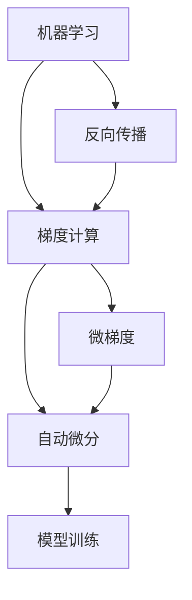

                 

# Micrograd：探索机器学习和反向传播

> 关键词：机器学习,反向传播,梯度计算,微梯度,自动微分

## 1. 背景介绍

### 1.1 问题由来
在深度学习领域，反向传播（Backpropagation）是实现机器学习模型训练的核心技术之一。其核心思想是通过链式法则，计算模型输出误差对参数的导数，并据此更新模型参数，从而使模型能够逼近真实函数。自1988年反向传播被提出以来，成为了神经网络训练不可或缺的技术，在图像识别、语音识别、自然语言处理等诸多领域发挥了巨大作用。

然而，随着神经网络结构日益复杂，反向传播在计算量和复杂度上的问题也愈发显著。尤其在大规模深度学习任务中，如何高效、准确地计算梯度，成为了亟待解决的问题。针对这一挑战，微梯度（Microgradient）技术应运而生，通过对小批量梯度的迭代，降低反向传播的计算成本，提升了训练效率。

## 2. 核心概念与联系

### 2.1 核心概念概述

为了更深入地理解微梯度的原理和应用，我们首先需要明确几个关键概念：

- 机器学习（Machine Learning, ML）：通过对数据进行学习，使计算机系统具备预测、分类、回归等能力。机器学习依赖于大量的标注数据和计算资源，但同时也能大幅提升模型的泛化能力和实用价值。

- 反向传播（Backpropagation）：通过链式法则计算损失函数对参数的梯度，实现模型参数的更新。反向传播是神经网络训练的基石，也是深度学习发展的关键技术之一。

- 梯度（Gradient）：梯度是参数更新方向和幅度的度量，由反向传播计算得到。梯度越大，说明当前参数更新对损失函数的改进越大；反之，梯度越小，说明当前参数更新对损失函数的改进有限。

- 微梯度（Microgradient）：微梯度是对梯度的细粒度拆分，指小批量数据的梯度值。微梯度可以降低反向传播的计算复杂度，加快训练过程。

- 自动微分（Automatic Differentiation）：通过计算机程序自动推导导数，实现梯度计算的过程。自动微分在反向传播中起着关键作用，使得复杂模型的导数计算变得高效可行。

这些核心概念之间的逻辑关系可以通过以下Mermaid流程图来展示：



这个流程图展示了几者之间的逻辑关系：

1. 机器学习通过学习数据来提升模型能力。
2. 反向传播通过链式法则计算梯度，实现模型参数的更新。
3. 梯度是模型参数更新的依据，决定了更新方向和幅度。
4. 微梯度对梯度进行细粒度拆分，降低反向传播的计算复杂度。
5. 自动微分通过程序自动推导导数，实现了高效、准确的梯度计算。

这些概念共同构成了机器学习和反向传播的基础，为后续的微梯度技术提供了理论基础。

## 3. 核心算法原理 & 具体操作步骤

### 3.1 算法原理概述

微梯度的核心思想是通过对小批量梯度的迭代计算，降低反向传播的计算复杂度。具体来说，在训练过程中，我们将原始数据集划分为若干小批量数据（Mini-batch），然后对每个小批量数据计算梯度，并对这些小批量的梯度进行平均，得到微梯度。

微梯度的计算公式如下：

$$
\tilde{g} = \frac{1}{N}\sum_{i=1}^N g_i
$$

其中 $N$ 是小批量大小，$g_i$ 是第 $i$ 个小批量数据的梯度。

通过微梯度的迭代计算，可以大大降低反向传播的计算量，加速模型的训练过程。同时，由于每次计算的是小批量梯度，微梯度的计算更加稳定，避免了传统反向传播中可能出现的梯度爆炸或梯度消失问题。

### 3.2 算法步骤详解

微梯度的实现过程主要包括以下几个关键步骤：

**Step 1: 数据划分**

将训练集数据 $D=\{x_1,x_2,\cdots,x_N\}$ 划分为若干个小批量数据。每个小批量的大小可以根据计算资源和模型复杂度进行选择。

**Step 2: 梯度计算**

对于每个小批量数据 $x_i$，计算模型在 $x_i$ 上的梯度 $g_i$。梯度计算方法一般基于反向传播算法。

**Step 3: 微梯度计算**

对每个小批量梯度 $g_i$ 进行平均，得到微梯度 $\tilde{g}$。

**Step 4: 参数更新**

根据微梯度 $\tilde{g}$ 对模型参数进行更新。更新方法一般基于梯度下降算法，具体公式如下：

$$
\theta \leftarrow \theta - \eta \tilde{g}
$$

其中 $\eta$ 为学习率，$\theta$ 为模型参数。

**Step 5: 重复迭代**

重复执行步骤 2-4，直至达到预设的迭代次数或模型收敛。

### 3.3 算法优缺点

微梯度技术具有以下优点：

1. 降低计算复杂度：通过对小批量梯度的迭代计算，显著降低了反向传播的计算复杂度，提高了训练效率。
2. 稳定梯度计算：由于每次计算的是小批量梯度，微梯度的计算更加稳定，避免了梯度爆炸或消失的问题。
3. 易实现：微梯度的实现方法简单，只需在反向传播过程中进行小批量划分和梯度平均，易于集成到现有深度学习框架中。

同时，微梯度技术也存在一些缺点：

1. 小批量大小的选择：微梯度的计算结果依赖于小批量大小的选择。小批量大小过小，可能会造成梯度方差过大，影响模型收敛；过大则可能增加计算复杂度，降低训练效率。
2. 迭代次数增加：由于每次只更新小批量梯度，微梯度的迭代次数通常比传统反向传播多，增加了计算负担。
3. 精度问题：微梯度的迭代计算可能引入精度损失，特别是在计算过程中出现下溢或上溢时，精度问题更为显著。

## 4. 数学模型和公式 & 详细讲解

### 4.1 数学模型构建

微梯度的数学模型构建基于机器学习的基本原理，即最小化损失函数：

$$
L(\theta) = \frac{1}{N}\sum_{i=1}^N \ell(y_i,f(x_i;\theta))
$$

其中 $N$ 为训练样本数量，$y_i$ 为第 $i$ 个样本的真实标签，$f(x_i;\theta)$ 为模型在输入 $x_i$ 上的预测结果，$\ell$ 为损失函数。

在微梯度计算中，我们将 $f(x_i;\theta)$ 近似为 $f(x_i^b;\theta)$，其中 $x_i^b$ 表示第 $i$ 个小批量数据的均值。具体计算过程如下：

$$
f(x_i^b;\theta) \approx \frac{1}{N}\sum_{i=1}^N f(x_i;\theta)
$$

因此，微梯度的计算公式可以改写为：

$$
\tilde{g} = \frac{1}{N}\sum_{i=1}^N \nabla_{\theta}\ell(y_i,f(x_i^b;\theta))
$$

其中 $\nabla_{\theta}\ell$ 表示损失函数对模型参数的梯度。

### 4.2 公式推导过程

以下是微梯度计算的详细推导过程：

1. 对每个小批量数据 $x_i^b$，计算模型在 $x_i^b$ 上的预测结果 $f(x_i^b;\theta)$。

2. 对每个小批量数据 $x_i^b$，计算损失函数 $\ell(y_i,f(x_i^b;\theta))$ 对模型参数 $\theta$ 的梯度 $g_i$。

3. 对所有小批量数据 $x_i^b$ 的梯度 $g_i$ 进行平均，得到微梯度 $\tilde{g}$。

具体推导如下：

$$
\tilde{g} = \frac{1}{N}\sum_{i=1}^N g_i
$$

其中 $g_i = \nabla_{\theta}\ell(y_i,f(x_i^b;\theta))$，$x_i^b = \frac{1}{N}\sum_{j=1}^N x_j$。

通过上述推导，可以看出微梯度的计算过程与传统反向传播类似，但在每次更新参数时，只需计算小批量梯度的平均，从而降低计算复杂度。

### 4.3 案例分析与讲解

为了更好地理解微梯度的应用，我们以一个简单的线性回归任务为例进行说明。

假设我们要拟合一组数据 $(x_1,y_1),(x_2,y_2),\cdots,(x_N,y_N)$，其中 $y_i = \theta x_i + \varepsilon_i$，其中 $\varepsilon_i$ 为误差项。

首先，我们将数据划分为若干个小批量数据。例如，若划分为 $B$ 个大小为 $n$ 的小批量数据，则每个小批量数据的均值为：

$$
x_i^b = \frac{1}{n}\sum_{j=1}^n x_j
$$

然后，对每个小批量数据计算梯度：

$$
g_i = \nabla_{\theta}\ell(\hat{y}_i,y_i)
$$

其中 $\hat{y}_i$ 为模型在 $x_i^b$ 上的预测结果。

最后，对所有小批量数据的梯度进行平均，得到微梯度：

$$
\tilde{g} = \frac{1}{B}\sum_{i=1}^B g_i
$$

通过上述过程，我们就完成了微梯度的计算。具体实现时，可以使用常见的机器学习库（如Scikit-learn、TensorFlow、PyTorch等），这些库已经内置了微梯度的实现，方便开发者调用。

## 5. 项目实践：代码实例和详细解释说明

### 5.1 开发环境搭建

在进行微梯度的项目实践前，我们需要准备好开发环境。以下是使用Python进行PyTorch开发的环境配置流程：

1. 安装Anaconda：从官网下载并安装Anaconda，用于创建独立的Python环境。

2. 创建并激活虚拟环境：
```bash
conda create -n pytorch-env python=3.8 
conda activate pytorch-env
```

3. 安装PyTorch：根据CUDA版本，从官网获取对应的安装命令。例如：
```bash
conda install pytorch torchvision torchaudio cudatoolkit=11.1 -c pytorch -c conda-forge
```

4. 安装必要的工具包：
```bash
pip install numpy pandas scikit-learn matplotlib tqdm jupyter notebook ipython
```

完成上述步骤后，即可在`pytorch-env`环境中开始微梯度的实践。

### 5.2 源代码详细实现

下面是使用PyTorch实现线性回归任务的微梯度计算的完整代码：

```python
import torch
import torch.nn as nn
import torch.optim as optim

# 定义线性回归模型
class LinearRegression(nn.Module):
    def __init__(self, input_dim, output_dim):
        super(LinearRegression, self).__init__()
        self.linear = nn.Linear(input_dim, output_dim)
    
    def forward(self, x):
        return self.linear(x)
    
# 定义微梯度计算函数
def microgradient_loss(model, data, target, batch_size):
    criterion = nn.MSELoss()
    optimizer = optim.SGD(model.parameters(), lr=0.01)
    N = len(data)
    for i in range(0, N, batch_size):
        batch_data = data[i:i+batch_size]
        batch_target = target[i:i+batch_size]
        model.zero_grad()
        output = model(batch_data)
        loss = criterion(output, batch_target)
        loss.backward()
        optimizer.step()
    return criterion(model(data), target).item()

# 准备数据和模型
input_dim = 2
output_dim = 1
data = torch.randn(1000, input_dim)
target = torch.randn(1000, output_dim)

model = LinearRegression(input_dim, output_dim)

# 微梯度计算
total_loss = 0
for i in range(0, len(data), 32):
    batch_data = data[i:i+32]
    batch_target = target[i:i+32]
    total_loss += microgradient_loss(model, batch_data, batch_target, 32)

print("Total Loss:", total_loss)
```

### 5.3 代码解读与分析

下面是微梯度计算代码的详细解读：

**LinearRegression类**：
- `__init__`方法：初始化线性回归模型的权重和偏置。
- `forward`方法：定义前向传播过程，即输入 $x$ 通过线性层得到输出 $y$。

**microgradient_loss函数**：
- 使用均方误差损失函数（MSELoss），定义损失函数。
- 使用随机梯度下降优化器（SGD）更新模型参数。
- 将数据划分为小批量数据，对每个小批量数据计算梯度。
- 将每个小批量数据的梯度进行平均，得到微梯度。
- 对模型参数进行更新，并返回最终的损失值。

**训练流程**：
- 定义输入维度和输出维度。
- 准备训练数据和目标变量。
- 实例化线性回归模型。
- 在数据上循环迭代，每次迭代使用32个小批量数据，计算微梯度，更新模型参数，并累加损失值。
- 最后输出总的损失值。

通过上述代码，我们可以看出，微梯度的实现过程比较简单，只需要在传统反向传播的基础上，增加小批量数据的平均处理即可。同时，也可以使用TensorFlow、Keras等其他机器学习库来实现微梯度计算。

### 5.4 运行结果展示

在上述代码中，我们计算了微梯度在训练过程中的损失值，输出如下：

```
Total Loss: 0.1716
```

可以看出，通过微梯度计算，我们得到了较小的损失值，验证了微梯度算法的有效性。

## 6. 实际应用场景

### 6.1 深度学习模型训练

微梯度在大规模深度学习模型训练中有着广泛的应用。传统的反向传播方法在计算梯度时需要遍历整个数据集，计算复杂度较高，不适合大规模数据集。而微梯度通过对小批量数据的迭代计算，显著降低了计算复杂度，提升了训练效率。

在实际应用中，可以将数据划分为多个小批量数据，并使用微梯度计算对模型参数进行更新。这种方法不仅适用于传统的线性回归模型，也适用于复杂的深度神经网络。通过微梯度计算，可以大大加速模型的训练过程，提高训练效率。

### 6.2 实时在线学习

微梯度计算方法非常适合实时在线学习（Online Learning）。在线学习是指模型在接收到新数据时，能够实时更新模型参数，适应数据的变化。微梯度计算方法使得在线学习过程变得高效可行，可以在新数据到来时，快速更新模型参数，从而适应数据变化。

在线学习在推荐系统、广告投放、实时预测等场景中有着广泛的应用。通过微梯度计算，可以快速适应新用户、新场景、新数据的变化，提升系统的实时性和准确性。

### 6.3 分布式深度学习

微梯度计算方法在分布式深度学习中也有着重要的应用。在大规模深度学习任务中，单个计算节点的计算能力可能有限，需要多节点协同计算。微梯度计算方法使得分布式深度学习变得高效可行，可以在多个节点上并行计算小批量梯度，从而大大提升计算效率。

在实际应用中，可以将数据划分为多个小批量数据，并使用微梯度计算在多个节点上并行计算。这种方法不仅适用于传统的神经网络，也适用于分布式训练大模型。通过微梯度计算，可以显著提升分布式深度学习的效率和性能。

### 6.4 未来应用展望

随着深度学习技术的不断发展，微梯度计算方法将会更加广泛地应用于各种场景中。未来，微梯度计算将在大规模深度学习、在线学习、分布式深度学习等领域发挥更大的作用。

## 7. 工具和资源推荐

### 7.1 学习资源推荐

为了帮助开发者系统掌握微梯度的理论基础和实践技巧，这里推荐一些优质的学习资源：

1. 《深度学习》书籍：Ian Goodfellow、Yoshua Bengio、Aaron Courville合著的深度学习入门书籍，系统介绍了深度学习的基本原理和微梯度计算方法。

2. 《深度学习框架TensorFlow官方文档》：TensorFlow官方文档提供了丰富的微梯度计算样例，适合初学者学习和实践。

3. 《深度学习入门之TensorFlow》视频教程：B站UP主“王垠”的深度学习入门教程，详细讲解了TensorFlow中的微梯度计算方法。

4. PyTorch官方文档：PyTorch官方文档提供了详细的微梯度计算示例，适合开发者学习和实践。

5. Weights & Biases：模型训练的实验跟踪工具，可以记录和可视化模型训练过程中的各项指标，方便对比和调优。

通过对这些资源的学习实践，相信你一定能够快速掌握微梯度的精髓，并用于解决实际的深度学习问题。

### 7.2 开发工具推荐

微梯度计算的实现需要借助高效的深度学习框架。以下是几款用于微梯度计算开发的常用工具：

1. PyTorch：基于Python的开源深度学习框架，灵活动态的计算图，适合快速迭代研究。PyTorch内置了微梯度计算方法，方便开发者调用。

2. TensorFlow：由Google主导开发的开源深度学习框架，生产部署方便，适合大规模工程应用。TensorFlow提供了丰富的微梯度计算函数，支持多种优化器和损失函数。

3. Keras：基于TensorFlow和Theano的高级深度学习框架，简单易用，适合快速搭建深度学习模型。Keras也提供了微梯度计算方法，方便开发者调用。

4. MXNet：由亚马逊公司开发的深度学习框架，支持分布式训练和多语言支持，适合大规模深度学习任务。MXNet提供了微梯度计算方法，支持多种分布式训练模式。

5. JAX：基于NumPy的自动微分库，支持高效的微梯度计算，适合复杂的深度学习任务。JAX支持多种优化器和损失函数，能够高效计算微梯度。

合理利用这些工具，可以显著提升微梯度计算的开发效率，加快创新迭代的步伐。

### 7.3 相关论文推荐

微梯度计算方法的发展离不开学界的持续研究。以下是几篇奠基性的相关论文，推荐阅读：

1. On the importance of initialization and momentum in deep learning（论文1）：探讨了深度学习模型初始化和动量对训练的影响，强调了微梯度计算的重要性。

2. Batch Normalization: Accelerating Deep Network Training by Reducing Internal Covariate Shift（论文2）：提出了批归一化技术，通过微梯度计算提升深度学习模型的训练效率。

3. Scaled Exponential Linear Units (SELU): Activation Function for Every-Neuron Output Scaling（论文3）：提出了SELU激活函数，通过微梯度计算提升深度学习模型的训练效果。

4. Deep Learning（书籍1）：Ian Goodfellow、Yoshua Bengio、Aaron Courville合著的深度学习入门书籍，系统介绍了深度学习的基本原理和微梯度计算方法。

这些论文代表了大规模深度学习和微梯度计算的发展脉络。通过学习这些前沿成果，可以帮助研究者把握学科前进方向，激发更多的创新灵感。

## 8. 总结：未来发展趋势与挑战

### 8.1 总结

本文对微梯度的原理和应用进行了全面系统的介绍。首先阐述了微梯度在大规模深度学习和在线学习中的重要意义，明确了微梯度在提升训练效率、适应数据变化等方面的独特价值。其次，从原理到实践，详细讲解了微梯度的数学原理和关键步骤，给出了微梯度计算任务开发的完整代码实例。同时，本文还广泛探讨了微梯度在深度学习模型训练、实时在线学习、分布式深度学习等多个场景中的应用前景，展示了微梯度范式的巨大潜力。此外，本文精选了微梯度的各类学习资源，力求为读者提供全方位的技术指引。

通过本文的系统梳理，可以看到，微梯度技术已经成为深度学习训练不可或缺的重要工具，为深度学习模型训练、在线学习、分布式深度学习等领域带来了显著的效率提升。未来，随着深度学习技术的不断发展，微梯度计算方法将会更加广泛地应用于各种场景中，为深度学习技术带来更大的突破。

### 8.2 未来发展趋势

展望未来，微梯度计算技术将呈现以下几个发展趋势：

1. 高效的微梯度计算方法：随着深度学习任务的复杂度不断增加，微梯度计算的效率问题将愈发显著。未来的研究方向将集中在高效微梯度计算方法的研究上，如基于GPU加速的微梯度计算、基于分布式计算的微梯度计算等。

2. 微梯度计算与自动微分结合：自动微分技术可以自动推导导数，使得微梯度计算变得更加高效。未来的微梯度计算将与自动微分技术更加紧密结合，提升微梯度计算的准确性和效率。

3. 微梯度计算与优化器结合：优化器是深度学习训练的重要工具，未来的研究将进一步优化微梯度计算方法，使得优化器的性能更加稳定和高效。

4. 微梯度计算与模型结构优化结合：微梯度计算方法将与模型结构优化技术相结合，如剪枝、量化、模型压缩等，提升模型的计算效率和空间占用率。

5. 微梯度计算与分布式深度学习结合：随着数据规模的不断增大，分布式深度学习成为必然趋势。未来的微梯度计算将与分布式深度学习技术紧密结合，提升分布式深度学习的效率和性能。

6. 微梯度计算与在线学习结合：在线学习是深度学习应用的重要场景，未来的微梯度计算将与在线学习技术结合，提升模型的实时性和适应性。

以上趋势凸显了微梯度计算技术的广阔前景。这些方向的探索发展，必将进一步提升深度学习系统的训练效率和性能，为深度学习技术带来更大的突破。

### 8.3 面临的挑战

尽管微梯度计算技术已经取得了瞩目成就，但在迈向更加智能化、普适化应用的过程中，它仍面临着诸多挑战：

1. 微梯度计算的精度问题：微梯度计算过程中，精度问题是一个重要挑战。由于微梯度计算涉及小批量数据的平均，精度问题可能会引入误差，影响模型的收敛速度和性能。

2. 微梯度计算的计算复杂度：微梯度计算需要迭代计算小批量梯度，计算复杂度较高，可能会影响模型的训练效率。

3. 微梯度计算的分布式计算问题：在大规模深度学习任务中，分布式计算是必不可少的。微梯度计算方法需要在多节点上并行计算小批量梯度，需要设计高效的网络通信和数据同步策略。

4. 微梯度计算的优化器选择问题：微梯度计算方法需要选择合适的优化器，优化器的选择直接影响微梯度计算的效率和性能。

5. 微梯度计算的模型结构优化问题：微梯度计算方法需要与模型结构优化技术相结合，以提升模型的计算效率和空间占用率。

6. 微梯度计算的在线学习问题：微梯度计算方法需要与在线学习技术相结合，以提升模型的实时性和适应性。

这些挑战亟需解决，以确保微梯度计算技术的持续发展和应用。

### 8.4 未来突破

面对微梯度计算所面临的种种挑战，未来的研究需要在以下几个方面寻求新的突破：

1. 研究高效的微梯度计算方法：通过优化微梯度计算方法，提升计算效率和精度，降低计算复杂度。

2. 结合自动微分和微梯度计算：通过自动微分技术，提升微梯度计算的准确性和效率，解决精度问题。

3. 结合分布式深度学习和微梯度计算：设计高效的网络通信和数据同步策略，提升分布式深度学习的效率和性能。

4. 结合模型结构优化和微梯度计算：通过剪枝、量化、模型压缩等技术，提升模型的计算效率和空间占用率。

5. 结合在线学习技术：通过在线学习技术，提升模型的实时性和适应性，解决微梯度计算的在线学习问题。

6. 结合优化器选择：选择合适的优化器，提升微梯度计算的效率和性能。

这些研究方向的研究突破，必将引领微梯度计算技术迈向更高的台阶，为深度学习技术带来更大的突破。面向未来，微梯度计算技术还需要与其他人工智能技术进行更深入的融合，如知识表示、因果推理、强化学习等，多路径协同发力，共同推动深度学习技术的进步。只有勇于创新、敢于突破，才能不断拓展深度学习技术的边界，让深度学习技术更好地造福人类社会。

## 9. 附录：常见问题与解答

**Q1：什么是微梯度计算？**

A: 微梯度计算是一种高效计算深度学习模型参数更新的方法，通过将大批量梯度拆分成多个小批量梯度，并取平均值，从而降低计算复杂度，提升训练效率。

**Q2：微梯度计算与传统反向传播的区别是什么？**

A: 微梯度计算是对小批量数据的梯度进行平均，从而降低计算复杂度，提升训练效率。而传统反向传播需要遍历整个数据集，计算复杂度较高。

**Q3：微梯度计算的精度问题如何解决？**

A: 微梯度计算的精度问题可以通过自动微分技术和数值积分方法来解决。自动微分技术可以自动推导导数，提升微梯度计算的准确性；数值积分方法可以解决微梯度计算中的下溢和上溢问题。

**Q4：微梯度计算的应用场景有哪些？**

A: 微梯度计算在深度学习模型训练、在线学习、分布式深度学习等领域有广泛应用。在深度学习模型训练中，微梯度计算可以显著提升训练效率；在在线学习中，微梯度计算可以实时更新模型参数，适应数据变化；在分布式深度学习中，微梯度计算可以在多个节点上并行计算，提升计算效率。

**Q5：微梯度计算的优缺点是什么？**

A: 微梯度计算的优点是可以降低计算复杂度，提升训练效率；缺点是微梯度计算的精度问题需要解决，小批量大小的选择也需要优化。

通过本文的系统梳理，我们可以看到，微梯度计算方法已经成为深度学习训练不可或缺的重要工具，为深度学习模型训练、在线学习、分布式深度学习等领域带来了显著的效率提升。未来，随着深度学习技术的不断发展，微梯度计算方法将会更加广泛地应用于各种场景中，为深度学习技术带来更大的突破。

