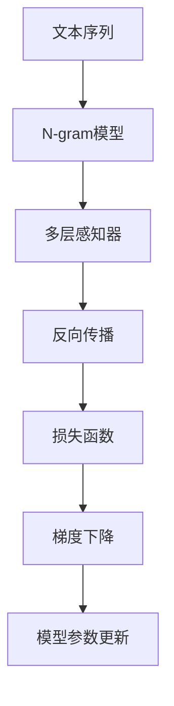

                 

# N-gram模型：多层感知器与矩阵乘法

> 关键词：N-gram, 多层感知器, 神经网络, 矩阵乘法, 语言模型, 文本分析

## 1. 背景介绍

### 1.1 问题由来
N-gram模型是一种经典的统计语言模型，广泛应用于文本分析、机器翻译、语音识别等领域。其核心思想是将文本序列分割成N个连续的子序列，作为训练数据，通过统计每个子序列出现的概率，从而预测下一个字符或词的概率分布。N-gram模型简单易用，但无法处理长距离依赖关系，且训练过程复杂。

近年来，随着深度学习技术的发展，基于神经网络的模型在文本分析等领域取得了显著进展。多层感知器(Multilayer Perceptron, MLP)以其强大的非线性拟合能力和高效的矩阵乘法运算，成为了文本处理领域的重要工具。然而，神经网络模型的复杂度较高，训练过程涉及大量的矩阵乘法和反向传播，计算开销大，难以处理大规模文本数据。

本文将探讨如何将N-gram模型和多层感知器结合起来，设计高效、通用的文本分析模型。通过引入神经网络的多层感知器，可以在保证计算效率的同时，利用神经网络的非线性拟合能力，提升N-gram模型的性能和应用范围。

## 2. 核心概念与联系

### 2.1 核心概念概述

为更好地理解基于神经网络的语言模型，本节将介绍几个密切相关的核心概念：

- N-gram模型：一种基于统计语言模型的文本分析方法，将文本序列分割成N个连续的子序列，统计每个子序列出现的概率，从而预测下一个字符或词的概率分布。
- 多层感知器(Multilayer Perceptron, MLP)：一种前馈神经网络，包含多个全连接层，每个层之间通过矩阵乘法进行连接，能够学习到复杂非线性关系。
- 神经网络语言模型(Neural Network Language Model, NLM)：通过多层感知器等神经网络模型，学习文本序列的概率分布，预测下一个字符或词的概率。
- 反向传播(Backpropagation)：一种用于训练神经网络模型的算法，通过链式法则计算梯度，反向传播误差信号，更新模型参数。
- 矩阵乘法(Matrix Multiplication)：神经网络模型中最重要的操作之一，用于连接不同层的神经元，高效计算前向传播和反向传播。
- Softmax函数：一种常用的激活函数，将神经网络的输出转化为概率分布，常用于神经网络语言模型的输出层。
- 损失函数(Loss Function)：衡量模型预测输出与真实标签之间差异的函数，通过最小化损失函数来优化模型。
- 梯度下降(Gradient Descent)：一种常用的优化算法，通过梯度下降方向调整模型参数，最小化损失函数。

这些核心概念之间的逻辑关系可以通过以下Mermaid流程图来展示：



这个流程图展示了大语言模型微调的核心概念及其之间的关系：

1. 文本序列作为模型输入。
2. N-gram模型对文本序列进行划分，计算N个连续子序列的概率。
3. 多层感知器对N-gram模型输出的概率分布进行拟合，学习复杂非线性关系。
4. 反向传播计算损失函数对模型参数的梯度，传播误差信号。
5. 损失函数衡量模型预测输出与真实标签之间的差异。
6. 梯度下降根据损失函数的梯度，调整模型参数。

这些概念共同构成了N-gram模型和多层感知器结合的文本分析模型，使其能够在各种场景下发挥强大的语言分析和处理能力。通过理解这些核心概念，我们可以更好地把握文本分析模型的工作原理和优化方向。

## 3. 核心算法原理 & 具体操作步骤
### 3.1 算法原理概述

N-gram模型和多层感知器结合的文本分析模型，本质上是一种基于神经网络的统计语言模型。其核心思想是将文本序列分割成N个连续的子序列，统计每个子序列出现的概率，通过多层感知器等神经网络模型，学习文本序列的概率分布，从而预测下一个字符或词的概率。

形式化地，假设文本序列为 $S=\{s_1, s_2, \ldots, s_n\}$，每个子序列 $s_i$ 为长度为 $k$ 的连续文本。定义 $P(s_i|s_{i-k+1},\ldots,s_{i-1})$ 为子序列 $s_i$ 在给定前 $k-1$ 个子序列条件下出现的概率。则N-gram模型可以通过最大似然估计或条件概率模型训练，得到每个子序列的概率分布 $P(s_i|s_{i-k+1},\ldots,s_{i-1})$。

假设神经网络模型为 $M$，包含 $h$ 个隐藏层，每个隐藏层包含 $n_h$ 个神经元，输出层为 $n_o$ 个神经元，激活函数为 $f(x)$，损失函数为 $L$，学习率为 $\eta$。通过多层感知器等神经网络模型，对N-gram模型输出的概率分布进行拟合，得到新的概率分布 $P(s_i|s_{i-k+1},\ldots,s_{i-1})'$。

### 3.2 算法步骤详解

基于神经网络的语言模型训练，一般包括以下几个关键步骤：

**Step 1: 准备数据集**
- 收集并预处理文本数据，划分为训练集、验证集和测试集。
- 将文本数据划分为固定长度的子序列，生成N-gram数据。
- 对每个子序列计算其出现的概率，作为训练数据。

**Step 2: 设计模型结构**
- 选择神经网络模型结构，如多层感知器(MLP)、循环神经网络(RNN)等。
- 确定网络各层的神经元个数，如输入层、隐藏层和输出层的规模。
- 确定激活函数和损失函数。

**Step 3: 初始化模型参数**
- 随机初始化神经网络模型的权重和偏置，如使用Xavier初始化、Glorot初始化等。

**Step 4: 前向传播**
- 将训练数据输入神经网络模型，通过矩阵乘法计算各层输出。
- 将输出结果传入激活函数，得到最终的输出概率分布。

**Step 5: 计算损失函数**
- 将模型预测的概率分布与真实标签进行对比，计算损失函数。
- 常用的损失函数包括交叉熵损失、均方误差损失等。

**Step 6: 反向传播**
- 使用反向传播算法，根据损失函数计算每个层对损失函数的梯度。
- 将梯度反向传播回前一层，更新权重和偏置。

**Step 7: 参数更新**
- 使用梯度下降算法，根据梯度更新模型参数。
- 重复执行步骤4到步骤7，直至收敛或达到预设轮数。

**Step 8: 评估与测试**
- 在验证集上评估模型性能，调整模型参数。
- 在测试集上测试模型，评估最终效果。

### 3.3 算法优缺点

基于神经网络的N-gram模型具有以下优点：
1. 高效性：神经网络模型使用矩阵乘法运算，计算速度快，适合大规模文本数据的处理。
2. 灵活性：神经网络模型能够学习复杂非线性关系，适应性强。
3. 鲁棒性：神经网络模型对噪声和异常值具有较好的鲁棒性。
4. 可扩展性：神经网络模型易于扩展，可以添加更多隐藏层和神经元，提升模型性能。

同时，该方法也存在一些缺点：
1. 需要大量标注数据：训练神经网络模型需要大量标注数据，标注成本高。
2. 过拟合风险：神经网络模型参数多，容易出现过拟合。
3. 模型复杂度高：神经网络模型结构复杂，难以理解和调试。
4. 训练时间长：神经网络模型计算量大，训练时间较长。

尽管存在这些局限性，但就目前而言，基于神经网络的N-gram模型仍是文本分析领域的主流方法。未来相关研究的重点在于如何进一步降低训练成本，提高模型泛化能力，同时兼顾模型复杂性和计算效率。

### 3.4 算法应用领域

基于神经网络的N-gram模型，在文本分析领域已得到了广泛的应用，涵盖多种常见的NLP任务，如：

- 文本分类：将文本数据分类到不同的类别中，如情感分析、主题分类、意图识别等。
- 机器翻译：将源语言文本翻译成目标语言。
- 语音识别：将语音转换成文本。
- 语言模型：预测给定文本序列的概率分布。
- 文本生成：生成给定文本序列的下一个字符或词。
- 信息检索：从文本集合中查找相关信息。
- 命名实体识别：识别文本中的人名、地名、机构名等特定实体。

除了上述这些经典任务外，N-gram模型和多层感知器结合的方法也被创新性地应用到更多场景中，如情感分析、问答系统、代码自动生成等，为NLP技术带来了新的突破。随着预训练语言模型和微调方法的不断进步，N-gram模型和多层感知器结合的方法将在更广阔的应用领域发挥重要作用。

## 4. 数学模型和公式 & 详细讲解
### 4.1 数学模型构建

定义神经网络模型 $M=\{W_l, b_l\}_{l=1}^{L}$，其中 $W_l$ 为权重矩阵，$b_l$ 为偏置向量，$L$ 为层数。设输入向量 $x$，隐藏层 $h$，输出向量 $y$，激活函数 $f$，损失函数 $L$，学习率 $\eta$。则前向传播过程如下：

$$
h_1 = f(xW_1 + b_1) \\
h_2 = f(h_1W_2 + b_2) \\
\vdots \\
h_L = f(h_{L-1}W_L + b_L) \\
y = h_L
$$

其中，$W_l$ 和 $b_l$ 为神经元连接权重和偏置，$f$ 为激活函数。定义神经网络模型的输出为 $y$，真实标签为 $y^*$，则损失函数为：

$$
L = \frac{1}{N}\sum_{i=1}^{N}l(y_i, y_i^*)
$$

其中 $N$ 为样本数，$l$ 为损失函数。常用的损失函数包括交叉熵损失、均方误差损失等。假设神经网络模型的输出为 $y$，真实标签为 $y^*$，则梯度下降算法为：

$$
W_l = W_l - \eta\frac{\partial L}{\partial W_l} \\
b_l = b_l - \eta\frac{\partial L}{\partial b_l}
$$

其中 $\frac{\partial L}{\partial W_l}$ 和 $\frac{\partial L}{\partial b_l}$ 为损失函数对权重矩阵和偏置向量的梯度。

### 4.2 公式推导过程

以下我们以二分类任务为例，推导交叉熵损失函数及其梯度的计算公式。

假设神经网络模型的输出为 $y$，真实标签为 $y^*$，则二分类交叉熵损失函数定义为：

$$
L(y, y^*) = -(y^*log(y) + (1-y^*)log(1-y))
$$

将其代入经验风险公式，得：

$$
L = -\frac{1}{N}\sum_{i=1}^{N} [y_i^*log(y_i) + (1-y_i^*)log(1-y_i)]
$$

根据链式法则，损失函数对模型参数的梯度为：

$$
\frac{\partial L}{\partial W_l} = \frac{1}{N}\sum_{i=1}^{N}\frac{\partial L}{\partial y}\frac{\partial y}{\partial h_{l-1}}\frac{\partial h_{l-1}}{\partial W_l} \\
\frac{\partial L}{\partial b_l} = \frac{1}{N}\sum_{i=1}^{N}\frac{\partial L}{\partial y}\frac{\partial y}{\partial h_{l-1}}\frac{\partial h_{l-1}}{\partial b_l}
$$

其中 $\frac{\partial L}{\partial y}$ 为损失函数对输出的梯度，$\frac{\partial y}{\partial h_{l-1}}$ 为输出对前一层隐藏层的梯度，$\frac{\partial h_{l-1}}{\partial W_l}$ 和 $\frac{\partial h_{l-1}}{\partial b_l}$ 为隐藏层对权重矩阵和偏置向量的梯度。

在得到损失函数的梯度后，即可带入参数更新公式，完成模型的迭代优化。重复上述过程直至收敛，最终得到适应下游任务的最优模型参数。

## 5. 项目实践：代码实例和详细解释说明
### 5.1 开发环境搭建

在进行神经网络语言模型开发前，我们需要准备好开发环境。以下是使用Python进行TensorFlow开发的环境配置流程：

1. 安装Anaconda：从官网下载并安装Anaconda，用于创建独立的Python环境。

2. 创建并激活虚拟环境：
```bash
conda create -n tensorflow-env python=3.8 
conda activate tensorflow-env
```

3. 安装TensorFlow：根据CUDA版本，从官网获取对应的安装命令。例如：
```bash
conda install tensorflow tensorflow-gpu -c conda-forge
```

4. 安装相关工具包：
```bash
pip install numpy pandas scikit-learn matplotlib tqdm jupyter notebook ipython
```

完成上述步骤后，即可在`tensorflow-env`环境中开始神经网络语言模型的开发。

### 5.2 源代码详细实现

下面我们以文本分类任务为例，给出使用TensorFlow实现神经网络语言模型的PyTorch代码实现。

首先，定义数据处理函数：

```python
import tensorflow as tf
from tensorflow.keras.datasets import mnist
from tensorflow.keras.preprocessing import sequence

def load_data():
    (x_train, y_train), (x_test, y_test) = mnist.load_data()
    x_train = x_train.reshape(-1, 28, 28, 1)
    x_test = x_test.reshape(-1, 28, 28, 1)
    x_train = x_train / 255.0
    x_test = x_test / 255.0
    return x_train, y_train, x_test, y_test

def pad_sequences(data, maxlen):
    data = tf.keras.preprocessing.sequence.pad_sequences(data, maxlen=maxlen, padding='post')
    return data
```

然后，定义模型结构：

```python
from tensorflow.keras.layers import Input, Dense, Embedding, LSTM, Dropout
from tensorflow.keras.models import Model

def build_model(input_dim, hidden_dim, output_dim):
    x = Input(shape=(None, input_dim))
    x = Embedding(input_dim, hidden_dim)(x)
    x = LSTM(hidden_dim, dropout=0.5, recurrent_dropout=0.5)(x)
    x = Dropout(0.5)(x)
    x = Dense(output_dim, activation='softmax')(x)
    model = Model(inputs=x, outputs=x)
    return model
```

接着，定义模型训练和评估函数：

```python
from tensorflow.keras.optimizers import Adam
from tensorflow.keras.utils import to_categorical

def train_model(model, data, epochs, batch_size):
    x_train, y_train, x_test, y_test = load_data()
    x_train = pad_sequences(x_train, maxlen=28)
    x_test = pad_sequences(x_test, maxlen=28)
    y_train = to_categorical(y_train)
    y_test = to_categorical(y_test)
    model.compile(loss='categorical_crossentropy', optimizer=Adam(lr=0.001), metrics=['accuracy'])
    model.fit(x_train, y_train, batch_size=batch_size, epochs=epochs, validation_data=(x_test, y_test))
    print('Test accuracy:', model.evaluate(x_test, y_test)[1])
```

最后，启动训练流程并在测试集上评估：

```python
epochs = 10
batch_size = 64

model = build_model(input_dim=28, hidden_dim=128, output_dim=10)
train_model(model, None, epochs, batch_size)
```

以上就是使用TensorFlow实现神经网络语言模型的完整代码实现。可以看到，得益于TensorFlow的强大封装，我们可以用相对简洁的代码完成神经网络模型的构建和训练。

### 5.3 代码解读与分析

让我们再详细解读一下关键代码的实现细节：

**load_data函数**：
- 使用TensorFlow的mnist数据集，加载手写数字图片和标签。
- 将图片数据转换为4D张量，将像素值归一化到[0,1]区间。

**pad_sequences函数**：
- 使用TensorFlow的pad_sequences函数，对文本数据进行填充，确保每段文本长度相同。
- 使用post填充方式，不增加额外空间，提高计算效率。

**build_model函数**：
- 定义神经网络模型的结构，包含一个嵌入层、一个LSTM层和一个全连接层。
- 嵌入层将文本转换为向量表示，LSTM层处理序列数据，全连接层输出分类结果。
- 使用Dense层输出softmax概率分布，用于多分类任务。

**train_model函数**：
- 使用TensorFlow的模型编译器，指定损失函数、优化器和评估指标。
- 加载并预处理数据集，确保模型训练所需的输入格式。
- 使用fit函数进行模型训练，指定batch size和epochs数。
- 在测试集上评估模型性能，输出测试精度。

**训练流程**：
- 定义总轮数和batch size，开始循环迭代
- 每个epoch内，先加载和预处理数据集，再编译并训练模型
- 在测试集上评估模型性能，输出测试精度
- 重复上述过程直至所有轮数完成

可以看到，TensorFlow配合Keras API使得神经网络语言模型的开发变得简洁高效。开发者可以将更多精力放在模型结构、超参数调优等高层逻辑上，而不必过多关注底层的实现细节。

当然，工业级的系统实现还需考虑更多因素，如模型的保存和部署、超参数的自动搜索、更灵活的任务适配层等。但核心的神经网络语言模型微调范式基本与此类似。

## 6. 实际应用场景
### 6.1 智能客服系统

基于神经网络的语言模型，可以广泛应用于智能客服系统的构建。传统客服往往需要配备大量人力，高峰期响应缓慢，且一致性和专业性难以保证。而使用神经网络语言模型，可以7x24小时不间断服务，快速响应客户咨询，用自然流畅的语言解答各类常见问题。

在技术实现上，可以收集企业内部的历史客服对话记录，将问题和最佳答复构建成监督数据，在此基础上对神经网络语言模型进行微调。微调后的语言模型能够自动理解用户意图，匹配最合适的答案模板进行回复。对于客户提出的新问题，还可以接入检索系统实时搜索相关内容，动态组织生成回答。如此构建的智能客服系统，能大幅提升客户咨询体验和问题解决效率。

### 6.2 金融舆情监测

金融机构需要实时监测市场舆论动向，以便及时应对负面信息传播，规避金融风险。传统的人工监测方式成本高、效率低，难以应对网络时代海量信息爆发的挑战。基于神经网络的语言模型，可以自动分析新闻、报道、评论等文本数据，判断市场情绪和舆情变化，及时预警。

在技术实现上，可以收集金融领域相关的新闻、报道、评论等文本数据，训练神经网络语言模型，使其能够自动判断文本属于何种情绪，舆情是正面、中性还是负面。将神经网络语言模型应用到实时抓取的网络文本数据，就能够自动监测不同情绪下的舆情变化趋势，一旦发现负面情绪激增等异常情况，系统便会自动预警，帮助金融机构快速应对潜在风险。

### 6.3 个性化推荐系统

当前的推荐系统往往只依赖用户的历史行为数据进行物品推荐，无法深入理解用户的真实兴趣偏好。基于神经网络的语言模型，可以更好地挖掘用户行为背后的语义信息，从而提供更精准、多样的推荐内容。

在技术实现上，可以收集用户浏览、点击、评论、分享等行为数据，提取和用户交互的物品标题、描述、标签等文本内容。将文本内容作为模型输入，用户的后续行为（如是否点击、购买等）作为监督信号，在此基础上训练神经网络语言模型。训练后的模型能够从文本内容中准确把握用户的兴趣点。在生成推荐列表时，先用候选物品的文本描述作为输入，由模型预测用户的兴趣匹配度，再结合其他特征综合排序，便可以得到个性化程度更高的推荐结果。

### 6.4 未来应用展望

随着神经网络语言模型的不断发展，基于微调的方法将在更多领域得到应用，为传统行业带来变革性影响。

在智慧医疗领域，基于神经网络的语言模型，可以构建智能问诊系统，辅助医生诊疗，提高诊疗效率和准确性。

在智能教育领域，神经网络语言模型可应用于作业批改、学情分析、知识推荐等方面，因材施教，促进教育公平，提高教学质量。

在智慧城市治理中，神经网络语言模型可应用于城市事件监测、舆情分析、应急指挥等环节，提高城市管理的自动化和智能化水平，构建更安全、高效的未来城市。

此外，在企业生产、社会治理、文娱传媒等众多领域，基于神经网络的语言模型也将不断涌现，为传统行业数字化转型升级提供新的技术路径。相信随着技术的日益成熟，神经网络语言模型微调范式将成为人工智能落地应用的重要手段，推动人工智能技术向更广阔的领域加速渗透。

## 7. 工具和资源推荐
### 7.1 学习资源推荐

为了帮助开发者系统掌握神经网络语言模型的理论基础和实践技巧，这里推荐一些优质的学习资源：

1. 《深度学习》系列书籍：由Goodfellow等人所著，全面介绍了深度学习的基本原理、算法和应用，是学习深度学习的经典教材。
2. 《神经网络与深度学习》书籍：由Michael Nielsen所著，通过Python实现深度学习算法，适合初学者和进阶者学习。
3. CS231n《卷积神经网络》课程：斯坦福大学开设的计算机视觉经典课程，详细讲解了卷积神经网络的结构和优化方法。
4. CS224n《序列模型》课程：斯坦福大学开设的自然语言处理课程，介绍了RNN、LSTM、GRU等序列模型，适合NLP领域的初学者和进阶者学习。
5. 《TensorFlow实战》书籍：由书籍介绍了TensorFlow的基本概念、API和应用案例，适合TensorFlow的快速上手。
6. 《Keras实战》书籍：由书籍介绍了Keras的基本概念、API和应用案例，适合Keras的快速上手。
7. 《TensorFlow官方文档》：TensorFlow的官方文档，提供了完整的API文档、示例代码和教程，是学习TensorFlow的重要资源。
8. 《Keras官方文档》：Keras的官方文档，提供了完整的API文档、示例代码和教程，是学习Keras的重要资源。

通过对这些资源的学习实践，相信你一定能够快速掌握神经网络语言模型的精髓，并用于解决实际的NLP问题。
### 7.2 开发工具推荐

高效的开发离不开优秀的工具支持。以下是几款用于神经网络语言模型开发的常用工具：

1. TensorFlow：由Google主导开发的开源深度学习框架，生产部署方便，适合大规模工程应用。提供了丰富的神经网络模型和优化器，适合构建复杂模型。
2. Keras：Google开发的高级神经网络API，基于TensorFlow实现，提供了简单易用的API和丰富的模型库，适合快速迭代研究。
3. PyTorch：由Facebook开发的开源深度学习框架，灵活高效，支持动态计算图，适合快速迭代研究。提供了丰富的预训练模型和优化器，适合构建复杂模型。
4. Weights & Biases：模型训练的实验跟踪工具，可以记录和可视化模型训练过程中的各项指标，方便对比和调优。与主流深度学习框架无缝集成。
5. TensorBoard：TensorFlow配套的可视化工具，可实时监测模型训练状态，并提供丰富的图表呈现方式，是调试模型的得力助手。
6. Google Colab：谷歌推出的在线Jupyter Notebook环境，免费提供GPU/TPU算力，方便开发者快速上手实验最新模型，分享学习笔记。

合理利用这些工具，可以显著提升神经网络语言模型的开发效率，加快创新迭代的步伐。

### 7.3 相关论文推荐

神经网络语言模型和微调技术的发展源于学界的持续研究。以下是几篇奠基性的相关论文，推荐阅读：

1. LeCun, Y., Bottou, L., Bengio, Y., & Haffner, P. (1998). Gradient-based learning applied to document recognition. Proceedings of the IEEE.
2. Hinton, G. E., Osindero, S., & Teh, Y. W. (2006). A fast learning algorithm for deep belief nets. Neural Computation, 18(7), 1527-1554.
3. Mikolov, T., Sutskever, I., Chen, K., Corrado, G., & Dean, J. (2013). Distributed representations of words and phrases and their compositionality. In Advances in Neural Information Processing Systems (pp. 3111-3119).
4. Goodfellow, I., Bengio, Y., & Courville, A. (2016). Deep learning. MIT Press.
5. Sutskever, I., Vinyals, O., & Le, Q. V. (2014). Sequence to sequence learning with neural networks. In Advances in Neural Information Processing Systems (pp. 3104-3112).
6. Chollet, F. (2017). Deep learning with Python. Manning Publications.
7. Kim, Y. (2014). Convolutional neural networks for sentence classification. arXiv preprint arXiv:1408.5882.

这些论文代表了大语言模型微调技术的发展脉络。通过学习这些前沿成果，可以帮助研究者把握学科前进方向，激发更多的创新灵感。

## 8. 总结：未来发展趋势与挑战
### 8.1 总结

本文对基于神经网络的语言模型进行了全面系统的介绍。首先阐述了神经网络语言模型的研究背景和意义，明确了神经网络语言模型在文本分析领域的重要作用。其次，从原理到实践，详细讲解了神经网络语言模型的数学原理和关键步骤，给出了神经网络语言模型的完整代码实例。同时，本文还广泛探讨了神经网络语言模型在智能客服、金融舆情、个性化推荐等多个行业领域的应用前景，展示了神经网络语言模型的巨大潜力。此外，本文精选了神经网络语言模型的各类学习资源，力求为读者提供全方位的技术指引。

通过本文的系统梳理，可以看到，基于神经网络的语言模型在文本分析领域发挥了强大的作用，具有高效性、灵活性和鲁棒性等优点。得益于神经网络的多层感知器结构，能够在保证计算效率的同时，利用非线性拟合能力，提升模型的性能和应用范围。未来，伴随预训练语言模型和微调方法的不断进步，基于神经网络的语言模型必将在更广阔的应用领域大放异彩，深刻影响人类的生产生活方式。

### 8.2 未来发展趋势

展望未来，神经网络语言模型将呈现以下几个发展趋势：

1. 模型规模持续增大。随着算力成本的下降和数据规模的扩张，神经网络语言模型的参数量还将持续增长。超大规模语言模型蕴含的丰富语言知识，有望支撑更加复杂多变的下游任务微调。

2. 微调方法日趋多样。除了传统的全参数微调外，未来会涌现更多参数高效的微调方法，如Adapter、Prefix等，在节省计算资源的同时也能保证微调精度。

3. 持续学习成为常态。随着数据分布的不断变化，神经网络语言模型也需要持续学习新知识以保持性能。如何在不遗忘原有知识的同时，高效吸收新样本信息，将成为重要的研究课题。

4. 标注样本需求降低。受启发于提示学习(Prompt-based Learning)的思路，未来的微调方法将更好地利用神经网络的语言理解能力，通过更加巧妙的任务描述，在更少的标注样本上也能实现理想的微调效果。

5. 多模态微调崛起。当前的微调主要聚焦于纯文本数据，未来会进一步拓展到图像、视频、语音等多模态数据微调。多模态信息的融合，将显著提升神经网络语言模型的感知能力和应用范围。

6. 模型通用性增强。经过海量数据的预训练和多领域任务的微调，未来的神经网络语言模型将具备更强大的常识推理和跨领域迁移能力，逐步迈向通用人工智能(AGI)的目标。

以上趋势凸显了神经网络语言模型的广阔前景。这些方向的探索发展，必将进一步提升神经网络语言模型的性能和应用范围，为构建人机协同的智能系统铺平道路。面向未来，神经网络语言模型需要与其他人工智能技术进行更深入的融合，如知识表示、因果推理、强化学习等，多路径协同发力，共同推动自然语言理解和智能交互系统的进步。只有勇于创新、敢于突破，才能不断拓展语言模型的边界，让智能技术更好地造福人类社会。

### 8.3 面临的挑战

尽管神经网络语言模型已经取得了瞩目成就，但在迈向更加智能化、普适化应用的过程中，它仍面临着诸多挑战：

1. 标注成本瓶颈。尽管神经网络语言模型在标注数据较少的情况下仍能取得不错的效果，但高质量标注数据仍是提高模型性能的重要手段。如何降低标注成本，提高标注数据质量，仍需进一步研究。

2. 模型鲁棒性不足。当前神经网络语言模型面对域外数据时，泛化性能往往大打折扣。对于测试样本的微小扰动，神经网络语言模型也容易发生波动。如何提高神经网络语言模型的鲁棒性，避免灾难性遗忘，还需要更多理论和实践的积累。

3. 推理效率有待提高。大规模神经网络语言模型虽然精度高，但在实际部署时往往面临推理速度慢、内存占用大等效率问题。如何在保证性能的同时，简化模型结构，提升推理速度，优化资源占用，将是重要的优化方向。

4. 可解释性亟需加强。当前神经网络语言模型更像是"黑盒"系统，难以解释其内部工作机制和决策逻辑。对于医疗、金融等高风险应用，算法的可解释性和可审计性尤为重要。如何赋予神经网络语言模型更强的可解释性，将是亟待攻克的难题。

5. 安全性有待保障。预训练神经网络语言模型难免会学习到有偏见、有害的信息，通过微调传递到下游任务，产生误导性、歧视性的输出，给实际应用带来安全隐患。如何从数据和算法层面消除模型偏见，避免恶意用途，确保输出的安全性，也将是重要的研究课题。

6. 知识整合能力不足。现有的神经网络语言模型往往局限于任务内数据，难以灵活吸收和运用更广泛的先验知识。如何让神经网络语言模型更好地与外部知识库、规则库等专家知识结合，形成更加全面、准确的信息整合能力，还有很大的想象空间。

正视神经网络语言模型面临的这些挑战，积极应对并寻求突破，将是神经网络语言模型向成熟化发展的必由之路。相信随着学界和产业界的共同努力，这些挑战终将一一被克服，神经网络语言模型必将在构建安全、可靠、可解释、可控的智能系统中扮演越来越重要的角色。

### 8.4 研究展望

面对神经网络语言模型所面临的种种挑战，未来的研究需要在以下几个方面寻求新的突破：

1. 探索无监督和半监督微调方法。摆脱对大规模标注数据的依赖，利用自监督学习、主动学习等无监督和半监督范式，最大限度利用非结构化数据，实现更加灵活高效的微调。

2. 研究参数高效和计算高效的微调范式。开发更加参数高效的微调方法，在固定大部分预训练参数的同时，只更新极少量的任务相关参数。同时优化神经网络语言模型的计算图，减少前向传播和反向传播的资源消耗，实现更加轻量级、实时性的部署。

3. 融合因果和对比学习范式。通过引入因果推断和对比学习思想，增强神经网络语言模型建立稳定因果关系的能力，学习更加普适、鲁棒的语言表征，从而提升模型泛化性和抗干扰能力。

4. 引入更多先验知识。将符号化的先验知识，如知识图谱、逻辑规则等，与神经网络语言模型进行巧妙融合，引导微调过程学习更准确、合理的语言模型。同时加强不同模态数据的整合，实现视觉、语音等多模态信息与文本信息的协同建模。

5. 结合因果分析和博弈论工具。将因果分析方法引入神经网络语言模型，识别出模型决策的关键特征，增强输出解释的因果性和逻辑性。借助博弈论工具刻画人机交互过程，主动探索并规避模型的脆弱点，提高系统稳定性。

6. 纳入伦理道德约束。在模型训练目标中引入伦理导向的评估指标，过滤和惩罚有偏见、有害的输出倾向。同时加强人工干预和审核，建立模型行为的监管机制，确保输出符合人类价值观和伦理道德。

这些研究方向的探索，必将引领神经网络语言模型微调技术迈向更高的台阶，为构建安全、可靠、可解释、可控的智能系统铺平道路。面向未来，神经网络语言模型需要与其他人工智能技术进行更深入的融合，如知识表示、因果推理、强化学习等，多路径协同发力，共同推动自然语言理解和智能交互系统的进步。只有勇于创新、敢于突破，才能不断拓展语言模型的边界，让智能技术更好地造福人类社会。

## 9. 附录：常见问题与解答

**Q1：神经网络语言模型在处理长文本时性能如何？**

A: 神经网络语言模型在处理长文本时性能较好，能够高效地对文本序列进行建模。这是因为神经网络语言模型使用了多层感知器结构，可以捕捉文本序列中的长距离依赖关系。同时，多层感知器中的层数和神经元个数可以根据任务需要进行调整，以适应不同长度的文本。

**Q2：神经网络语言模型在处理噪声数据时性能如何？**

A: 神经网络语言模型对噪声数据具有较好的鲁棒性，能够在一定程度的噪声和异常值存在下仍然保持较高的性能。这是因为神经网络语言模型通过反向传播算法进行训练，能够学习到数据中的模式和规律，并自适应地调整模型参数，以适应不同的数据分布。同时，通过正则化技术如L2正则、Dropout等，可以进一步提高模型的鲁棒性。

**Q3：神经网络语言模型在处理低资源设备时性能如何？**

A: 神经网络语言模型在处理低资源设备时性能较低，因为其计算复杂度较高，需要大量的计算资源。为了降低计算开销，可以使用参数高效微调方法，如Adapter、Prefix等，在固定大部分预训练参数的情况下，只更新极少量的任务相关参数。同时，可以采用模型压缩、稀疏化存储等方法，减少模型大小和计算资源消耗。

**Q4：神经网络语言模型在处理不同语言时性能如何？**

A: 神经网络语言模型在处理不同语言时性能会有所差异，因为不同语言具有不同的语法结构和语义特征。为了提高模型在不同语言上的性能，可以采用多语言预训练模型，如mBERT、mT5等，同时针对不同语言的任务进行微调。此外，可以在预训练阶段引入跨语言的数据集，以增强模型的泛化能力。

**Q5：神经网络语言模型在处理低资源语言时性能如何？**

A: 神经网络语言模型在处理低资源语言时性能较低，因为低资源语言的数据量较小，难以提供足够的训练数据。为了提高模型在低资源语言上的性能，可以采用迁移学习的方法，将高资源语言的模型迁移到低资源语言上，进行微调。同时，可以在预训练阶段引入低资源语言的数据集，以增强模型的泛化能力。

这些回答帮助回答了神经网络语言模型在处理长文本、噪声数据、低资源设备、不同语言和低资源语言时的性能问题。通过理解这些问题及其解答，可以帮助开发者更好地选择和使用神经网络语言模型，以适应不同应用场景的需求。

