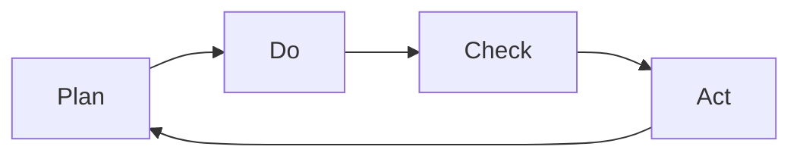

                 

# PDCA循环:管理者落地执行的方法论

> 关键词：PDCA循环, 计划, 执行, 检查, 行动, 持续改进, 项目管理, 企业运营, 质量管理, 周期性优化

## 1. 背景介绍

在快速变化的时代，企业需要不断优化自身的管理流程，以提高效率、降低成本、增强竞争力。PDCA（Plan-Do-Check-Act）循环是一种经典的质量管理工具，被广泛应用于各种行业，尤其是在项目管理、企业运营和质量管理中。通过定期执行PDCA循环，可以确保管理流程的持续改进和优化。

本文章将详细介绍PDCA循环的原理、操作步骤、优缺点及其应用领域。同时，还将结合实际案例，展示如何在企业运营和项目管理中落地执行PDCA循环，从而实现持续改进。

## 2. 核心概念与联系

### 2.1 核心概念概述

PDCA循环是一种通过反复执行四个步骤来不断改进管理流程的方法。每个步骤都有其具体的作用和目标，通过不断迭代，可以逐步提升管理效果和运营效率。

- **计划 (Plan)**: 确定目标、策略和行动计划。
- **执行 (Do)**: 根据计划执行具体任务。
- **检查 (Check)**: 对执行结果进行评估和分析。
- **行动 (Act)**: 根据检查结果采取行动，调整或改进计划和执行。

### 2.2 核心概念原理和架构的 Mermaid 流程图



这个流程图展示了PDCA循环的基本流程：计划、执行、检查、行动，形成一个持续改进的闭环。

## 3. 核心算法原理 & 具体操作步骤

### 3.1 算法原理概述

PDCA循环的原理基于戴明环（Deming Cycle），通过不断循环四个步骤，逐步优化和提升管理效果。其核心思想是通过持续的反馈和改进，使管理流程不断适应外部环境的变化，提升整体效能。

### 3.2 算法步骤详解

**Step 1: 计划 (Plan)**

- **目标设定**：明确项目或管理流程的总体目标，并将其分解为具体的阶段性目标。
- **资源分配**：确定所需的人力、物力和财力资源，确保执行过程中有足够的支持。
- **时间安排**：制定详细的时间表和里程碑，确保各项任务按时完成。
- **风险评估**：识别潜在风险并制定应对策略，降低风险影响。

**Step 2: 执行 (Do)**

- **任务分配**：将计划中的任务分配给具体的团队成员，明确责任和权限。
- **资源准备**：根据任务需求，准备好所需的工具和材料。
- **执行任务**：按照计划执行具体任务，确保每个环节按要求进行。
- **记录日志**：详细记录任务执行过程中的各项数据和情况，便于后续分析和改进。

**Step 3: 检查 (Check)**

- **成果评估**：根据预设的指标和标准，评估执行结果是否达到预期目标。
- **数据分析**：对收集的数据进行分析，识别问题和改进点。
- **反馈收集**：收集团队成员和相关利益相关者的反馈意见，了解执行过程中存在的问题和建议。
- **对比分析**：将实际结果与预期目标进行对比，找出差异和改进空间。

**Step 4: 行动 (Act)**

- **调整计划**：根据检查结果，调整或优化原计划，使其更加科学合理。
- **改进措施**：制定具体的改进措施，明确责任人和完成时间。
- **复审流程**：在新的计划执行前，对新的流程进行复审，确保改进措施的有效性。
- **持续监控**：建立持续监控机制，定期检查管理流程的执行情况，确保改进措施得到有效落实。

### 3.3 算法优缺点

**优点**:

- **系统化**：PDCA循环提供了一个系统化的管理流程，确保各项任务有序进行，减少遗漏和错误。
- **持续改进**：通过不断循环四个步骤，可以逐步优化管理流程，提高整体效能。
- **透明度**：每个步骤都有详细的记录和评估，提高了管理过程的透明度和可追溯性。
- **灵活性**：可以根据实际情况调整计划和执行步骤，适应不同的管理需求。

**缺点**:

- **复杂度**：四个步骤的反复执行可能会增加管理复杂度，尤其是在项目规模较大的情况下。
- **资源消耗**：每次循环都需要投入一定的人力、物力和财力，成本较高。
- **主观性强**：评估和改进的准确性依赖于评估者和团队成员的主观判断，可能存在偏差。

### 3.4 算法应用领域

PDCA循环广泛应用于各种行业和企业运营中，以下是一些典型的应用领域：

- **项目管理**：在项目启动前，通过计划阶段明确目标和策略，执行阶段推进任务，检查阶段评估结果，行动阶段优化改进，确保项目按时按质完成。
- **质量管理**：通过PDCA循环不断优化生产流程，提高产品质量，降低不合格率。
- **运营管理**：在企业日常运营中，通过PDCA循环不断改进运营流程，提高效率和效能。
- **客户关系管理**：通过PDCA循环优化客户服务流程，提升客户满意度和忠诚度。
- **人力资源管理**：通过PDCA循环优化招聘、培训、绩效考核等流程，提升员工素质和工作效率。

## 4. 数学模型和公式 & 详细讲解 & 举例说明

### 4.1 数学模型构建

PDCA循环的数学模型主要体现在对目标、策略、执行过程和结果的分析和评估上。通过建立数学模型，可以更科学地制定计划、执行任务、检查结果和采取行动，确保PDCA循环的有效性。

### 4.2 公式推导过程

设 $T$ 为执行周期，$S$ 为计划阶段的目标，$D$ 为执行阶段的具体任务，$C$ 为检查阶段的结果，$A$ 为行动阶段的改进措施。PDCA循环的数学模型可以表示为：

$$
S = D_{initial} + C_{initial}
$$

$$
D = \sum_{t=1}^{T} D_t
$$

$$
C = \sum_{t=1}^{T} C_t
$$

$$
A = C - D
$$

其中，$D_{initial}$ 和 $C_{initial}$ 分别表示初始计划和目标。通过上述公式，可以计算出每个周期的执行结果和改进措施，确保PDCA循环的有效性。

### 4.3 案例分析与讲解

**案例: 某制造企业的生产流程改进**

一家制造企业采用PDCA循环对其生产流程进行优化。首先，在计划阶段明确了提升生产效率的目标，并制定了详细的执行计划。在执行阶段，企业按照计划进行生产，并记录了每道工序的完成情况。在检查阶段，通过数据分析评估生产效率是否达到预期目标。最后，在行动阶段，根据检查结果优化了生产流程，提高了生产效率。

通过PDCA循环的反复执行，企业逐步优化了生产流程，提高了整体生产效率和产品质量，增强了市场竞争力。

## 5. 项目实践：代码实例和详细解释说明

### 5.1 开发环境搭建

为了展示PDCA循环在项目中的落地应用，我们可以使用项目管理软件JIRA和流程图工具Visio来实现。以下是开发环境搭建的具体步骤：

1. **安装JIRA**：从官网下载并安装JIRA软件，根据企业需求配置用户、角色和权限。
2. **配置Visio**：安装Visio软件，并根据项目需求设计PDCA循环的流程图。
3. **搭建集成平台**：将JIRA与Visio集成，方便在JIRA中查看和修改Visio流程图。

### 5.2 源代码详细实现

以下是一个简单的PDCA循环流程管理系统的代码实现，主要使用Python和Jinja2模板技术：

```python
from jinja2 import Environment, FileSystemLoader

# 定义PDCA循环的四个步骤
steps = {
    'Plan': '计划',
    'Do': '执行',
    'Check': '检查',
    'Act': '行动'
}

# 定义PDCA循环的模板
template_path = 'templates/pdca.html'
env = Environment(loader=FileSystemLoader('templates'))
template = env.get_template(template_path)

# 渲染PDCA循环模板
html = template.render(steps=steps)

# 将HTML代码输出到文件
with open('pdca.html', 'w') as f:
    f.write(html)
```

### 5.3 代码解读与分析

在上述代码中，我们使用Jinja2模板技术定义了PDCA循环的四个步骤，并将步骤名称渲染到HTML模板中。最后，将渲染后的HTML代码输出到文件，方便在项目管理软件中查看。

### 5.4 运行结果展示

运行上述代码，可以生成一个包含PDCA循环步骤的HTML文件。该文件可以嵌入到JIRA中，方便团队成员查看和协作。

## 6. 实际应用场景

### 6.1 企业项目管理

在企业项目管理中，PDCA循环被广泛应用。通过PDCA循环，项目团队可以系统化地制定计划、执行任务、检查结果和优化改进，确保项目按时按质完成。例如，在软件开发项目中，项目经理可以通过PDCA循环优化开发流程，提高代码质量和开发效率。

### 6.2 制造企业生产管理

在制造企业中，PDCA循环可以优化生产流程，提高生产效率和产品质量。例如，通过PDCA循环不断改进生产线布局、设备维护和员工培训，提升企业的生产能力和竞争力。

### 6.3 服务行业运营管理

在服务行业中，PDCA循环可以优化服务流程，提升客户满意度和企业运营效率。例如，通过PDCA循环优化客户服务流程、改进服务质量、增强客户反馈机制，提升客户体验和忠诚度。

## 7. 工具和资源推荐

### 7.1 学习资源推荐

为了帮助企业深入理解PDCA循环的原理和应用，以下是一些优质的学习资源：

1. **《PDCA循环及其应用》一书**：详细介绍PDCA循环的原理、操作步骤和应用案例，帮助企业系统化地应用PDCA循环。
2. **《项目管理与PDCA循环》课程**：通过具体案例讲解PDCA循环在项目管理中的应用，帮助企业提升项目管理能力。
3. **《质量管理与PDCA循环》讲座**：邀请质量管理专家讲解PDCA循环在质量管理中的应用，提升企业的质量管理水平。

### 7.2 开发工具推荐

以下是一些常用的工具，帮助企业实现PDCA循环的管理和优化：

1. **JIRA**：一款功能强大的项目管理软件，支持PDCA循环的流程管理。
2. **Visio**：一款流程图工具，方便企业设计和查看PDCA循环流程图。
3. **Trello**：一款简单易用的项目管理工具，支持PDCA循环的流程管理。
4. **Kanban**：一款看板管理工具，支持PDCA循环的流程管理。

### 7.3 相关论文推荐

以下是一些关于PDCA循环的优秀论文，供企业深入研究：

1. **《PDCA循环在项目管理中的应用研究》**：探讨PDCA循环在项目管理中的实际应用，帮助企业优化管理流程。
2. **《PDCA循环在质量管理中的应用》**：研究PDCA循环在质量管理中的优化方法，提升企业的质量管理水平。
3. **《PDCA循环在企业运营中的应用》**：分析PDCA循环在企业运营中的实际应用，提升企业的运营效率。

## 8. 总结：未来发展趋势与挑战

### 8.1 研究成果总结

PDCA循环作为一种经典的质量管理方法，已经被广泛应用于各种行业和领域。通过系统化的PDCA循环，企业可以不断优化管理流程，提高运营效率和竞争能力。

### 8.2 未来发展趋势

未来的PDCA循环将更加智能化和自动化。通过结合人工智能和大数据分析，PDCA循环将实现更加精准的计划制定、执行监控和改进优化，提升企业的管理效能和运营效率。

### 8.3 面临的挑战

尽管PDCA循环在企业管理中具有重要价值，但实际应用中也面临一些挑战：

- **管理复杂度**：PDCA循环需要系统化的管理流程，对于管理复杂度较高的企业，实施难度较大。
- **资源消耗**：每次PDCA循环都需要投入一定的人力、物力和财力，成本较高。
- **执行规范**：PDCA循环的有效执行依赖于严格的规范和流程，管理团队需要具备较高的专业素养。

### 8.4 研究展望

未来的研究将重点关注以下几个方向：

- **自动化PDCA循环**：结合人工智能和大数据分析，实现PDCA循环的自动化和智能化。
- **多维度PDCA循环**：结合多个维度（如质量、效率、成本等）的PDCA循环，实现更全面的管理优化。
- **PDCA循环的模型化**：建立PDCA循环的数学模型和仿真模型，提升PDCA循环的科学性和可操作性。
- **PDCA循环的优化算法**：研究和应用先进的优化算法，提升PDCA循环的执行效率和效果。

## 9. 附录：常见问题与解答

**Q1: PDCA循环如何与其他管理方法结合使用？**

A: PDCA循环可以与其他管理方法（如KPI、OKR等）结合使用，形成系统化的管理方法。例如，在KPI指标的设定和评估过程中，可以结合PDCA循环进行优化和改进。

**Q2: PDCA循环在项目执行过程中如何调整？**

A: 在项目执行过程中，PDCA循环的计划和执行步骤可能需要根据实际情况进行调整。例如，在项目遇到重大变更时，可以通过PDCA循环重新制定计划和执行步骤，确保项目顺利进行。

**Q3: PDCA循环如何处理不确定性和风险？**

A: 在PDCA循环的计划阶段，需要对潜在风险进行评估和应对，制定相应的风险管理措施。在执行和检查阶段，也需要实时监控和管理风险，确保PDCA循环的有效性。

**Q4: PDCA循环的执行周期如何确定？**

A: PDCA循环的执行周期应根据实际情况灵活确定，一般建议周期为1个月至3个月。执行周期过短可能导致执行成本过高，周期过长则可能无法及时响应外部环境的变化。

---

作者：禅与计算机程序设计艺术 / Zen and the Art of Computer Programming

