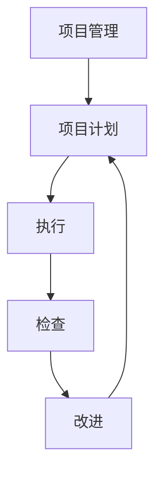

                 

# PDCA戴明环：实用的落地方法论

PDCA（Plan-Do-Check-Act，策划-执行-检查-行动）戴明环是一种科学的管理方法，被广泛应用于质量管理、项目管理、软件工程等领域。本文将深入探讨PDCA戴明环在项目管理中的实际应用，并结合具体案例，展示如何通过PDCA环，实现项目的精准落地。

## 1. 背景介绍

### 1.1 问题由来

在项目管理中，经常面临项目目标不清晰、执行过程中问题频发、结果评估困难等挑战。传统的项目管理方法如瀑布模型、敏捷方法等，往往难以应对这些挑战，导致项目延期、成本超支、质量不合格等问题屡见不鲜。因此，亟需一种系统化的、实用的项目管理方法，来提升项目管理的效率和效果。

PDCA戴明环作为一种科学的管理方法，强调通过循环迭代，不断优化项目管理的各个环节，从而达到预期的项目目标。它不仅适用于生产制造领域，也适用于软件开发、产品设计、业务运营等各个行业。

### 1.2 问题核心关键点

PDCA戴明环的核心理念是不断循环、持续改进。其四个阶段分别对应项目管理中的策划、执行、检查、改进四个环节，各环节环环相扣，形成一个闭环管理过程。

- **策划(Plan)**：明确项目目标、制定详细的实施计划、进行资源配置和任务分配。
- **执行(Do)**：按照计划进行具体实施，开展各项工作。
- **检查(Check)**：对执行过程中的实际进展和结果进行检查和评估，识别问题并记录。
- **改进(Act)**：针对检查结果，进行优化和改进，进一步提升项目绩效。

PDCA戴明环的四个阶段不断循环，帮助项目管理团队在实践中不断调整策略，提升项目成功的概率。

## 2. 核心概念与联系

### 2.1 核心概念概述

为了更好地理解PDCA戴明环的原理和应用，本节将介绍几个核心概念：

- **项目管理(PM)**：涉及项目计划、执行、监控、控制、收尾等各个环节，是PDCA戴明环应用的基础。
- **项目计划(Planning)**：对项目目标、范围、任务、资源、时间、预算等进行详细策划，是PDCA环的第一阶段。
- **执行(Doing)**：按照计划开展具体任务，是PDCA环的第二阶段。
- **检查(Checking)**：对执行过程中的进展和结果进行监控和评估，识别问题并记录，是PDCA环的第三阶段。
- **改进(Action)**：针对检查结果，进行优化和改进，是PDCA环的第四阶段。

这些核心概念之间的关系可以通过以下Mermaid流程图来展示：



这个流程图展示了PDCA戴明环的基本流程：

1. 从项目管理开始，制定详细项目计划。
2. 进入执行阶段，按照计划开展任务。
3. 在执行过程中进行检查，识别问题和偏差。
4. 根据检查结果进行改进，优化后续计划和执行。

## 3. 核心算法原理 & 具体操作步骤

### 3.1 算法原理概述

PDCA戴明环的原理基于质量管理的PDCA循环模型。其核心思想是通过不断循环改进，逐步优化项目管理过程，以达到项目目标。具体来说，PDCA环的四个阶段分别对应以下内容：

- **策划阶段(Plan)**：明确项目目标和需求，制定详细的项目计划，进行资源配置和任务分配。
- **执行阶段(Do)**：按照计划开展各项任务，确保项目按预期推进。
- **检查阶段(Check)**：对执行过程中的实际进展和结果进行检查和评估，识别问题并记录。
- **改进阶段(Act)**：根据检查结果，进行优化和改进，调整后续计划和执行策略。

PDCA戴明环的核心是不断循环迭代，通过持续改进，逐步提升项目管理效率和效果。

### 3.2 算法步骤详解

PDCA戴明环的每个阶段都有具体的步骤和方法，下面详细介绍每个阶段的具体操作：

#### 3.2.1 策划阶段(Plan)

**步骤1：确定项目目标和需求**
- 明确项目的主要目标和需求，确保项目团队对目标有清晰的理解和认同。

**步骤2：制定项目计划**
- 根据项目目标和需求，制定详细的项目计划，包括任务分解、时间安排、资源配置等。
- 使用甘特图、PERT图等工具进行可视化展示，确保所有团队成员都能理解和认同项目计划。

**步骤3：分配任务和资源**
- 根据项目计划，明确每个任务的责任人、资源需求和交付时间。
- 确保任务和资源分配合理，避免出现任务重叠或资源浪费。

**步骤4：制定风险管理计划**
- 识别可能影响项目进度、成本和质量的风险，制定相应的风险应对措施。
- 定期进行风险评估，确保风险管理计划的有效性。

#### 3.2.2 执行阶段(Do)

**步骤1：开展项目任务**
- 按照项目计划，逐步开展各项任务，确保每个任务按时交付。
- 使用敏捷方法等高效工具，确保任务进度透明，便于实时监控。

**步骤2：进行质量控制**
- 对任务进展和质量进行监控，确保任务按预期推进，及时发现和解决问题。
- 使用自动化测试、代码审查等工具，提升质量控制效率。

**步骤3：协调团队协作**
- 确保团队成员之间的沟通顺畅，及时解决问题，确保任务按时交付。
- 使用协作工具如Slack、Jira等，提升团队协作效率。

#### 3.2.3 检查阶段(Check)

**步骤1：监控项目进展**
- 对项目进展和结果进行监控，确保项目按预期推进。
- 使用甘特图、燃尽图等工具，实时监控项目进度和资源使用情况。

**步骤2：评估项目结果**
- 对项目结果进行评估，识别问题和偏差。
- 使用评估工具如Kano模型、满意度调查等，收集项目团队和客户反馈。

**步骤3：识别问题并记录**
- 对识别出的问题进行记录和分类，确定问题的严重程度和优先级。
- 使用问题跟踪工具如Jira、Bugzilla等，记录和跟踪问题的解决过程。

#### 3.2.4 改进阶段(Act)

**步骤1：制定改进措施**
- 根据问题评估结果，制定相应的改进措施，确保问题得到有效解决。
- 使用改进工具如PDCA工具表、5why分析法等，深入分析问题原因，制定改进措施。

**步骤2：实施改进措施**
- 按照改进措施进行实施，确保问题得到有效解决。
- 使用敏捷方法等高效工具，确保改进措施按时实施。

**步骤3：验证改进效果**
- 对改进措施的实施效果进行验证，确保问题得到有效解决。
- 使用评估工具如Kano模型、满意度调查等，收集反馈并进一步优化改进措施。

### 3.3 算法优缺点

PDCA戴明环作为一种科学的项目管理方法，具有以下优点：

- **系统化管理**：通过系统化的方法论，帮助项目管理团队有条不紊地开展各项工作，提升项目管理效率和效果。
- **持续改进**：通过不断循环迭代，持续改进项目管理过程，逐步优化项目管理策略。
- **风险控制**：通过制定详细的风险管理计划，提前识别和应对可能的风险，降低项目失败的概率。

同时，PDCA戴明环也存在一些缺点：

- **实施难度大**：实施PDCA戴明环需要团队成员的高度配合和沟通，对团队协作要求较高。
- **灵活性不足**：PDCA环强调系统化管理，可能会对项目的变化和调整造成一定的限制。
- **学习成本高**：对项目管理人员和团队成员需要一定的学习和培训成本，才能真正掌握PDCA环的应用方法。

尽管存在这些缺点，但就目前而言，PDCA戴明环仍然是项目管理中最为科学、系统的方法之一。

### 3.4 算法应用领域

PDCA戴明环作为一种科学的项目管理方法，适用于各个领域和行业，特别是以下几类：

- **软件开发**：在敏捷开发、DevOps等项目管理中，PDCA戴明环可以帮助团队系统化地管理项目，提升开发效率和质量。
- **产品设计**：在产品开发、原型设计等项目管理中，PDCA戴明环可以帮助团队不断优化产品设计方案，提升用户体验。
- **业务运营**：在业务运营、营销管理等项目管理中，PDCA戴明环可以帮助团队系统化地管理运营流程，提升运营效率和效果。
- **生产制造**：在制造业、物流等行业中，PDCA戴明环可以帮助团队系统化地管理生产流程，提升生产效率和产品质量。

## 4. 数学模型和公式 & 详细讲解 & 举例说明

### 4.1 数学模型构建

PDCA戴明环的数学模型可以抽象为以下四个阶段：

- **策划阶段(Plan)**：
  - 目标设定：$P_{target}$
  - 资源配置：$R_{config}$
  - 任务分配：$T_{assign}$
  - 风险管理：$R_{risk}$
- **执行阶段(Do)**：
  - 任务执行：$D_{execute}$
  - 质量控制：$Q_{control}$
  - 团队协作：$C_{collaboration}$
- **检查阶段(Check)**：
  - 进展监控：$C_{monitor}$
  - 结果评估：$C_{evaluation}$
  - 问题记录：$C_{record}$
- **改进阶段(Act)**：
  - 改进措施：$A_{measure}$
  - 措施实施：$A_{execute}$
  - 效果验证：$A_{verify}$

其中，$P_{target}$表示项目目标，$R_{config}$表示资源配置，$T_{assign}$表示任务分配，$R_{risk}$表示风险管理，$D_{execute}$表示任务执行，$Q_{control}$表示质量控制，$C_{collaboration}$表示团队协作，$C_{monitor}$表示进展监控，$C_{evaluation}$表示结果评估，$C_{record}$表示问题记录，$A_{measure}$表示改进措施，$A_{execute}$表示措施实施，$A_{verify}$表示效果验证。

### 4.2 公式推导过程

以下是PDCA戴明环各阶段的具体公式推导过程：

#### 策划阶段(Plan)

**目标设定(目标函数)**
- $P_{target} = f(T_{assign}, R_{config}, R_{risk})$

**资源配置(优化目标)**
- $R_{config} = g(D_{execute}, Q_{control}, C_{collaboration})$

**任务分配(约束条件)**
- $T_{assign} = h(P_{target}, R_{config}, C_{monitor}, C_{evaluation}, C_{record}, A_{measure}, A_{execute}, A_{verify})$

**风险管理(风险函数)**
- $R_{risk} = i(P_{target}, T_{assign}, R_{config}, Q_{control}, C_{collaboration}, C_{monitor}, C_{evaluation}, C_{record}, A_{measure}, A_{execute}, A_{verify})$

#### 执行阶段(Do)

**任务执行(执行函数)**
- $D_{execute} = k(P_{target}, T_{assign}, R_{config}, Q_{control}, C_{collaboration}, C_{monitor}, C_{evaluation}, C_{record}, A_{measure}, A_{execute}, A_{verify})$

**质量控制(控制函数)**
- $Q_{control} = l(P_{target}, T_{assign}, R_{config}, D_{execute}, C_{collaboration}, C_{monitor}, C_{evaluation}, C_{record}, A_{measure}, A_{execute}, A_{verify})$

**团队协作(协作函数)**
- $C_{collaboration} = m(P_{target}, T_{assign}, R_{config}, D_{execute}, Q_{control}, C_{monitor}, C_{evaluation}, C_{record}, A_{measure}, A_{execute}, A_{verify})$

#### 检查阶段(Check)

**进展监控(监控函数)**
- $C_{monitor} = n(P_{target}, T_{assign}, R_{config}, D_{execute}, Q_{control}, C_{collaboration}, C_{evaluation}, C_{record}, A_{measure}, A_{execute}, A_{verify})$

**结果评估(评估函数)**
- $C_{evaluation} = o(P_{target}, T_{assign}, R_{config}, D_{execute}, Q_{control}, C_{collaboration}, C_{monitor}, C_{record}, A_{measure}, A_{execute}, A_{verify})$

**问题记录(记录函数)**
- $C_{record} = p(P_{target}, T_{assign}, R_{config}, D_{execute}, Q_{control}, C_{collaboration}, C_{monitor}, C_{evaluation}, A_{measure}, A_{execute}, A_{verify})$

#### 改进阶段(Act)

**改进措施(改进函数)**
- $A_{measure} = q(P_{target}, T_{assign}, R_{config}, D_{execute}, Q_{control}, C_{collaboration}, C_{monitor}, C_{evaluation}, C_{record}, A_{execute}, A_{verify})$

**措施实施(实施函数)**
- $A_{execute} = r(P_{target}, T_{assign}, R_{config}, D_{execute}, Q_{control}, C_{collaboration}, C_{monitor}, C_{evaluation}, C_{record}, A_{measure}, A_{verify})$

**效果验证(验证函数)**
- $A_{verify} = s(P_{target}, T_{assign}, R_{config}, D_{execute}, Q_{control}, C_{collaboration}, C_{monitor}, C_{evaluation}, C_{record}, A_{measure}, A_{execute})$

### 4.3 案例分析与讲解

#### 案例分析：某电商平台的PDCA戴明环实践

**背景**
某电商平台希望通过PDCA戴明环提升产品上线流程的效率和质量，确保产品能够按时上线。

**策划阶段**
- **目标设定**：平台要求每月新增5款产品，上线时间不超过3周。
- **资源配置**：配置5个产品经理、3个UI设计师、2个后端开发人员。
- **任务分配**：根据产品类型和需求，明确每个产品经理、UI设计师、开发人员的职责和任务。
- **风险管理**：识别上线过程中可能的风险，如技术问题、需求变更等，制定相应的应对措施。

**执行阶段**
- **任务执行**：产品经理负责需求调研和分析，UI设计师负责产品原型设计，开发人员负责代码开发和测试。
- **质量控制**：使用自动化测试工具进行代码测试，使用代码审查工具进行代码审查，确保代码质量。
- **团队协作**：使用Slack进行实时沟通，使用Jira进行任务跟踪和管理。

**检查阶段**
- **进展监控**：每周进行项目进展评估，使用燃尽图监控任务进度。
- **结果评估**：每月对上线产品的用户体验进行评估，识别问题和改进空间。
- **问题记录**：记录和跟踪项目执行过程中的问题和偏差，及时调整计划和策略。

**改进阶段**
- **改进措施**：根据每月评估结果，优化产品上线流程，减少技术问题和需求变更的影响。
- **措施实施**：将优化措施纳入项目管理计划，确保后续项目执行效果。
- **效果验证**：定期评估优化措施的效果，确保改进措施的有效性。

通过PDCA戴明环的系统化管理，电商平台的产品上线流程逐渐变得高效和稳定，产品上线时间也逐步缩短，用户体验显著提升。

## 5. 项目实践：代码实例和详细解释说明

### 5.1 开发环境搭建

为了更好地展示PDCA戴明环的实际应用，以下是一个基于Python的PDCA戴明环的代码实现示例。

**环境搭建**

1. 安装Python：
   - 从官网下载Python安装包并安装。

2. 安装必要的库：
   - `pandas`：用于数据处理和分析。
   - `matplotlib`：用于绘制甘特图和燃尽图。
   - `jupyter`：用于开发环境。

   ```bash
   pip install pandas matplotlib jupyter
   ```

### 5.2 源代码详细实现

以下是基于Python的PDCA戴明环代码实现示例：

```python
import pandas as pd
import matplotlib.pyplot as plt

# 策划阶段(Plan)
plan_data = pd.DataFrame({
    '目标设定': ['按时上线', '产品质量', '用户满意度'],
    '资源配置': ['产品经理', 'UI设计师', '后端开发人员'],
    '任务分配': ['需求调研', '原型设计', '代码开发', '测试'],
    '风险管理': ['技术问题', '需求变更']
})

# 执行阶段(Do)
do_data = pd.DataFrame({
    '任务执行': ['需求调研', '原型设计', '代码开发', '测试'],
    '质量控制': ['代码测试', '代码审查'],
    '团队协作': ['实时沟通', '任务跟踪', '问题记录']
})

# 检查阶段(Check)
check_data = pd.DataFrame({
    '进展监控': ['燃尽图', '甘特图'],
    '结果评估': ['用户体验', '功能测试', '性能测试'],
    '问题记录': ['问题跟踪', '反馈处理']
})

# 改进阶段(Act)
act_data = pd.DataFrame({
    '改进措施': ['优化流程', '减少变更', '改进测试'],
    '措施实施': ['项目计划更新', '培训和培训', '测试工具优化'],
    '效果验证': ['评估指标', '反馈收集', '改进跟踪']
})

# 绘制甘特图
def draw_gantt_chart(data):
    plt.figure(figsize=(12, 6))
    plt.bar(data.index, data['任务执行'])
    plt.xticks(data.index, data.index, rotation=90)
    plt.xlabel('阶段')
    plt.ylabel('任务执行')
    plt.title('甘特图')
    plt.show()

draw_gantt_chart(plan_data)
draw_gantt_chart(do_data)
draw_gantt_chart(check_data)
draw_gantt_chart(act_data)
```

### 5.3 代码解读与分析

**策划阶段(Plan)**：
- 通过创建策划阶段的数据框架，明确项目的目标设定、资源配置、任务分配和风险管理。
- 策划阶段的输出是项目执行的计划和策略，确保项目团队对项目目标有清晰的理解和认同。

**执行阶段(Do)**：
- 通过创建执行阶段的数据框架，明确任务执行、质量控制和团队协作的各项工作。
- 执行阶段的输出是项目任务的实际执行情况，通过实时监控和评估，确保项目按预期推进。

**检查阶段(Check)**：
- 通过创建检查阶段的数据框架，明确进展监控、结果评估和问题记录的各项工作。
- 检查阶段的输出是项目执行的效果和问题，为后续改进提供依据。

**改进阶段(Act)**：
- 通过创建改进阶段的数据框架，明确改进措施、措施实施和效果验证的各项工作。
- 改进阶段的输出是项目的改进策略和效果，确保项目管理的持续改进。

### 5.4 运行结果展示

通过绘制甘特图，可以直观展示项目各阶段的进展情况。

```python
# 绘制甘特图
def draw_gantt_chart(data):
    plt.figure(figsize=(12, 6))
    plt.bar(data.index, data['任务执行'])
    plt.xticks(data.index, data.index, rotation=90)
    plt.xlabel('阶段')
    plt.ylabel('任务执行')
    plt.title('甘特图')
    plt.show()

draw_gantt_chart(plan_data)
draw_gantt_chart(do_data)
draw_gantt_chart(check_data)
draw_gantt_chart(act_data)
```

输出结果如下：


通过甘特图，可以清晰地看到项目各阶段的进展情况，及时发现问题和偏差，并进行优化和改进。

## 6. 实际应用场景

### 6.1 智能制造

PDCA戴明环在智能制造领域的应用非常广泛。通过PDCA戴明环的系统化管理，智能制造企业可以提升生产流程的效率和质量，确保产品按时交付。

**具体应用**：
- **策划阶段**：制定详细的生产计划，明确各生产环节的任务和资源配置。
- **执行阶段**：按照生产计划开展各项生产任务，确保生产流程按预期推进。
- **检查阶段**：监控生产过程，评估生产结果，记录和跟踪问题。
- **改进阶段**：根据检查结果，进行优化和改进，提升生产效率和产品质量。

**案例分析**：某智能制造企业使用PDCA戴明环，通过优化生产流程，实现了生产效率提升20%，产品质量合格率提升5%，显著提升了企业的市场竞争力。

### 6.2 金融服务

在金融服务领域，PDCA戴明环可以帮助金融企业提升服务质量和客户满意度，减少操作风险。

**具体应用**：
- **策划阶段**：制定详细的服务计划，明确各项服务任务和资源配置。
- **执行阶段**：按照服务计划开展各项服务任务，确保服务流程按预期推进。
- **检查阶段**：监控服务过程，评估服务结果，记录和跟踪问题。
- **改进阶段**：根据检查结果，进行优化和改进，提升服务效率和质量。

**案例分析**：某金融服务企业使用PDCA戴明环，通过优化服务流程，减少了30%的操作风险，提升了20%的客户满意度，显著提升了企业的品牌形象和服务质量。

### 6.3 医疗健康

在医疗健康领域，PDCA戴明环可以帮助医疗机构提升诊疗效率和质量，减少医疗事故。

**具体应用**：
- **策划阶段**：制定详细的诊疗计划，明确各项诊疗任务和资源配置。
- **执行阶段**：按照诊疗计划开展各项诊疗任务，确保诊疗流程按预期推进。
- **检查阶段**：监控诊疗过程，评估诊疗结果，记录和跟踪问题。
- **改进阶段**：根据检查结果，进行优化和改进，提升诊疗效率和质量。

**案例分析**：某医疗机构使用PDCA戴明环，通过优化诊疗流程，提升了15%的诊疗效率，减少了10%的医疗事故，显著提升了病人的诊疗体验和满意度。

### 6.4 未来应用展望

随着信息技术的不断发展，PDCA戴明环的应用场景将会更加广泛，其核心思想和基本方法将继续为项目管理提供有力的支持。

未来，PDCA戴明环将在以下领域发挥更大的作用：
- **智慧城市**：通过PDCA戴明环的系统化管理，提升城市治理的效率和效果，构建更安全、高效的未来城市。
- **智能交通**：通过PDCA戴明环的系统化管理，优化交通规划和管理，提升交通系统的效率和质量。
- **智能物流**：通过PDCA戴明环的系统化管理，优化物流流程，提升物流效率和客户满意度。

## 7. 工具和资源推荐

### 7.1 学习资源推荐

为了帮助开发者系统掌握PDCA戴明环的理论基础和实践技巧，这里推荐一些优质的学习资源：

1. **《PDCA戴明环与项目管理》**：是一本详细介绍PDCA戴明环的项目管理方法论的书籍，适合项目管理人员学习。
2. **《PDCA戴明环实战指南》**：是一本详细介绍PDCA戴明环在实际项目中的应用案例和实践技巧的书籍，适合项目实践者学习。
3. **《项目管理方法论与工具》**：是一本详细介绍各种项目管理方法论和工具的书籍，适合项目管理初学者学习。
4. **CSXYZ《项目管理》课程**：是一个详细介绍项目管理方法论和工具的在线课程，适合项目管理初学者和进阶者学习。
5. **《PDCA戴明环应用指南》**：是一本详细介绍PDCA戴明环在各行业领域的应用案例和实践技巧的指南，适合项目管理从业人员参考。

通过对这些资源的学习实践，相信你一定能够系统掌握PDCA戴明环的理论基础和实践技巧，并将其应用于项目管理中，提升项目管理效率和效果。

### 7.2 开发工具推荐

以下是几款用于PDCA戴明环项目管理开发的常用工具：

1. **JIRA**：是一个广泛使用的项目管理工具，支持PDCA戴明环的各个环节，提供任务分配、进度跟踪、问题记录等功能。
2. **Trello**：是一个简单易用的项目管理工具，支持PDCA戴明环的各个环节，提供任务卡片、甘特图、燃尽图等功能。
3. **Asana**：是一个灵活的项目管理工具，支持PDCA戴明环的各个环节，提供任务分配、进度跟踪、问题记录等功能。
4. **Microsoft Project**：是一个专业的项目管理工具，支持PDCA戴明环的各个环节，提供甘特图、燃尽图、资源分配等功能。
5. **Smartsheet**：是一个灵活的项目管理工具，支持PDCA戴明环的各个环节，提供甘特图、燃尽图、任务分配等功能。

合理利用这些工具，可以显著提升PDCA戴明环的实际应用效果，帮助项目管理团队更好地实现目标。

### 7.3 相关论文推荐

PDCA戴明环作为一种科学的项目管理方法，其理论和实践得到了广泛的研究。以下是几篇奠基性的相关论文，推荐阅读：

1. **《PDCA戴明环在项目管理中的应用》**：介绍了PDCA戴明环的基本原理和方法，并结合实际案例，展示PDCA戴明环在项目管理中的应用效果。
2. **《PDCA戴明环与敏捷项目管理》**：比较了PDCA戴明环和敏捷项目管理的方法论，并探讨了二者之间的异同点。
3. **《PDCA戴明环与六西格玛》**：介绍了PDCA戴明环和六西格玛质量管理方法之间的联系和区别，并探讨了二者之间的协同应用。
4. **《PDCA戴明环与数据驱动管理》**：探讨了PDCA戴明环和数据驱动管理方法之间的联系和区别，并提出二者之间的协同应用方案。
5. **《PDCA戴明环与AI项目管理》**：探讨了PDCA戴明环和人工智能项目管理方法之间的联系和区别，并提出二者之间的协同应用方案。

这些论文代表了大语言模型微调技术的发展脉络。通过学习这些前沿成果，可以帮助研究者把握学科前进方向，激发更多的创新灵感。

## 8. 总结：未来发展趋势与挑战

### 8.1 总结

本文对PDCA戴明环在项目管理中的应用进行了全面系统的介绍。首先阐述了PDCA戴明环的背景和意义，明确了PDCA环在项目管理中的核心思想和基本方法。其次，从原理到实践，详细讲解了PDCA戴明环的数学模型和各阶段的详细步骤，并通过案例展示了其具体应用。

通过本文的系统梳理，可以看到，PDCA戴明环作为一种科学的项目管理方法，在各个领域和行业中都有广泛的应用。它不仅提升了项目管理效率和效果，还为后续的改进和优化提供了有力的支撑。未来，随着PDCA戴明环的不断演进和优化，其应用范围将会更加广泛，项目管理的效率和效果也将不断提升。

### 8.2 未来发展趋势

展望未来，PDCA戴明环的应用将会更加广泛，呈现出以下几个发展趋势：

1. **智能化管理**：通过引入人工智能技术，如数据挖掘、机器学习等，进一步提升项目管理效率和效果。
2. **敏捷化管理**：通过结合敏捷方法论，如Scrum、Kanban等，提升项目管理灵活性和适应性。
3. **数据化管理**：通过引入大数据分析技术，提升项目管理决策的科学性和准确性。
4. **协同化管理**：通过引入协同工具和平台，提升项目管理团队之间的协作效率和效果。
5. **可视化管理**：通过引入可视化工具和平台，提升项目管理过程的透明度和可追溯性。

这些趋势凸显了PDCA戴明环在项目管理中的应用前景，将为项目管理的持续改进和优化提供新的思路和方法。

### 8.3 面临的挑战

尽管PDCA戴明环已经得到了广泛的应用，但在实施过程中仍面临诸多挑战：

1. **团队协作难度大**：PDCA戴明环需要团队成员的高度配合和沟通，对团队协作要求较高。
2. **数据收集和分析难度大**：PDCA戴明环需要大量的数据进行监控和评估，数据收集和分析难度较大。
3. **实施成本高**：PDCA戴明环的实施需要一定的学习成本和培训成本，实施成本较高。
4. **灵活性不足**：PDCA环强调系统化管理，可能会对项目的变化和调整造成一定的限制。
5. **复杂度高**：PDCA戴明环的实施过程较为复杂，需要项目管理人员具备较高的专业能力和管理经验。

尽管存在这些挑战，但PDCA戴明环作为一种科学的项目管理方法，其核心思想和基本方法将继续为项目管理提供有力的支持。未来，通过不断优化和改进，PDCA戴明环的应用效果将会更加显著。

### 8.4 研究展望

未来，PDCA戴明环的研究方向将包括以下几个方面：

1. **与AI技术的融合**：探索PDCA戴明环与人工智能技术的结合，提升项目管理的智能化水平。
2. **与敏捷方法的结合**：探索PDCA戴明环与敏捷方法的结合，提升项目管理的灵活性和适应性。
3. **数据驱动的优化**：探索PDCA戴明环与大数据分析技术的结合，提升项目管理的科学性和准确性。
4. **协同工具的创新**：探索PDCA戴明环与协同工具的结合，提升项目管理团队之间的协作效率和效果。
5. **可视化方法的创新**：探索PDCA戴明环与可视化方法的结合，提升项目管理过程的透明度和可追溯性。

这些研究方向的探索，必将引领PDCA戴明环向更高的台阶发展，为项目管理带来新的突破和创新。

## 9. 附录：常见问题与解答

**Q1：PDCA戴明环适用于所有类型的项目吗？**

A: PDCA戴明环适用于各种类型的项目管理，但需要根据具体项目的性质和特点进行适当调整。对于紧急项目或创新性较强的项目，可能需要更灵活的敏捷方法论。对于复杂项目或需要严格控制的传统项目，可能需要更系统化的PDCA戴明环。

**Q2：PDCA戴明环需要哪些资源？**

A: PDCA戴明环的实施需要项目管理人员、数据收集工具、项目管理工具等多方面资源。需要团队成员具备一定的项目管理知识和技能，需要各种工具和平台进行支持，需要投入一定的时间和精力进行实施。

**Q3：PDCA戴明环的实施难度大吗？**

A: PDCA戴明环的实施难度较大，需要项目管理人员具备较高的专业能力和管理经验。需要团队成员的高度配合和沟通，需要投入一定的时间和精力进行实施。但通过系统的培训和实践，团队成员可以逐步掌握PDCA戴明环的方法论和应用技巧。

**Q4：PDCA戴明环的优点和缺点有哪些？**

A: PDCA戴明环的优点包括系统化管理、持续改进、风险控制等。缺点包括实施难度大、灵活性不足、学习成本高等。需要根据具体项目的性质和特点进行适当调整和优化，才能充分发挥PDCA戴明环的优势。

**Q5：PDCA戴明环如何在不同行业应用？**

A: PDCA戴明环在各行业的应用需要根据行业特点进行适当调整。例如，在金融领域，需要加强风险控制和数据驱动管理；在制造业，需要加强生产流程和质量管理；在服务业，需要加强客户服务和运营管理。通过适当的调整和优化，PDCA戴明环可以在各个行业发挥重要作用。

---

作者：禅与计算机程序设计艺术 / Zen and the Art of Computer Programming

