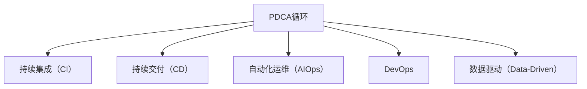

                 

## 1. 背景介绍

### 1.1 问题由来

在现代企业管理中，PDCA（Plan-Do-Check-Act）循环法是一种经典的持续改进方法，旨在通过持续的计划、执行、检查和改进，不断提升组织的管理水平和工作效率。然而，在信息技术领域，PDCA循环的落地和应用一直面临诸多挑战。

随着数字化转型的加速，企业信息化程度日益提高，但信息系统的建设和维护也变得复杂多变。传统的人工干预和反馈机制难以应对快速变化的需求，而自动化和智能化的PDCA循环方法，则能更好地适应新环境，帮助企业在数字化时代保持竞争优势。

### 1.2 问题核心关键点

PDCA循环的四个步骤可以概括为：

1. **计划（Plan）**：定义改进目标和实施方案。
2. **执行（Do）**：实施改进方案。
3. **检查（Check）**：评估实施效果。
4. **改进（Act）**：根据检查结果进行改进和优化。

这些步骤不仅适用于软件工程中的需求分析和持续集成，也广泛应用于项目管理、运维监控、业务流程自动化等多个领域。然而，如何在信息技术领域落地PDCA循环，将传统管理方法与IT技术相结合，依然是一个值得深入探讨的问题。

### 1.3 问题研究意义

研究PDCA在信息技术领域的落地方法，对于提升企业信息化管理水平，推动数字化转型具有重要意义：

1. **提升效率和质量**：通过自动化和智能化的PDCA循环，能够减少人工干预，提升业务流程的效率和质量。
2. **降低风险和成本**：系统的PDCA循环能够及时发现问题并迅速响应，避免因人工失误导致的重大损失。
3. **增强灵活性和适应性**：PDCA循环的敏捷迭代过程，使企业能够更快地适应市场和技术的变化，保持竞争力。
4. **优化资源配置**：通过PDCA循环的反馈机制，可以更合理地分配资源，提高投资回报率。
5. **促进数据驱动决策**：PDCA循环的数据驱动特性，使决策更加科学和精准，减少主观偏见。

## 2. 核心概念与联系

### 2.1 核心概念概述

为更好地理解PDCA循环的落地方法，本节将介绍几个密切相关的核心概念：

- **PDCA循环（PDCA）**：通过计划、执行、检查和改进四个步骤，不断提升工作质量和效率的循环管理方法。
- **持续集成（CI）**：在软件开发中，持续集成通过自动构建、测试和部署，确保软件的质量稳定。
- **持续交付（CD）**：在软件开发中，持续交付通过自动化的部署流程，提升交付速度和可靠性。
- **自动化运维（AIOps）**：通过自动化工具和流程，提升运维效率和问题处理速度。
- **DevOps**：融合开发（Dev）和运维（Ops）的跨职能团队，推动快速迭代和持续改进。
- **数据驱动（Data-Driven）**：通过数据分析和可视化，指导决策和优化，实现闭环管理。

这些核心概念之间的逻辑关系可以通过以下Mermaid流程图来展示：



这个流程图展示了大语言模型的核心概念及其之间的关系：

1. **PDCA循环**：通过持续的计划、执行、检查和改进，不断提升工作质量和效率。
2. **持续集成（CI）**：自动化构建、测试和部署，确保产品质量稳定。
3. **持续交付（CD）**：自动化部署流程，提升交付速度和可靠性。
4. **自动化运维（AIOps）**：提升运维效率和问题处理速度。
5. **DevOps**：融合开发和运维的跨职能团队，推动快速迭代和持续改进。
6. **数据驱动（Data-Driven）**：通过数据分析和可视化，指导决策和优化，实现闭环管理。

这些概念共同构成了信息技术领域的PDCA循环框架，使企业能够在各个层面实现持续改进。

## 3. 核心算法原理 & 具体操作步骤

### 3.1 算法原理概述

PDCA循环的实施，本质上是一个系统化的迭代过程。通过不断的计划、执行、检查和改进，系统能够逐步优化，达到最优状态。

### 3.2 算法步骤详解

#### 3.2.1 计划阶段（Plan）

在计划阶段，需要明确改进目标和实施方案。具体的步骤包括：

1. **确定目标**：根据业务需求和问题反馈，明确改进目标，如提升系统性能、降低错误率等。
2. **制定方案**：制定详细的实施方案，包括技术方案、资源需求、时间节点等。
3. **分配资源**：根据方案需求，分配必要的资源，如人力、物力、技术工具等。

#### 3.2.2 执行阶段（Do）

在执行阶段，需要根据计划方案，实施改进措施。具体的步骤包括：

1. **开发和部署**：按照方案进行系统开发和部署，确保各环节顺利进行。
2. **监控和记录**：实时监控系统运行状态，记录关键数据和事件。
3. **收集反馈**：收集用户和系统的反馈信息，识别潜在问题。

#### 3.2.3 检查阶段（Check）

在检查阶段，需要评估实施效果，评估方案的执行情况。具体的步骤包括：

1. **数据分析**：利用数据分析工具，对系统运行数据进行分析，评估改进效果。
2. **用户反馈**：收集用户使用反馈，了解用户体验和满意度。
3. **问题排查**：针对收集到的反馈和数据，进行问题排查和故障分析。

#### 3.2.4 改进阶段（Act）

在改进阶段，需要根据检查结果，进行持续优化和改进。具体的步骤包括：

1. **优化方案**：根据检查结果，调整和优化改进方案，提升效果。
2. **技术更新**：引入新技术和工具，提升系统性能和稳定性。
3. **持续监控**：建立持续监控机制，实时监控系统运行状态，确保改进效果的持续性。

### 3.3 算法优缺点

PDCA循环的优点包括：

1. **系统性**：通过持续的计划、执行、检查和改进，系统性地提升工作质量和效率。
2. **透明性**：每个步骤都有明确的目标和结果，确保整个过程透明可控。
3. **灵活性**：可以根据实际情况进行调整，灵活应对变化。
4. **可持续性**：持续的改进过程，能够不断提高系统的稳定性和可靠性。

然而，PDCA循环也存在一些缺点：

1. **复杂性**：实施过程中需要涉及多个部门和环节，协调难度较大。
2. **资源消耗**：需要投入大量的人力和物力，特别是在计划和执行阶段。
3. **数据依赖**：对数据的准确性和完整性有较高要求，一旦数据不准确，会影响改进效果。

### 3.4 算法应用领域

PDCA循环在信息技术领域的应用非常广泛，主要包括以下几个方面：

1. **软件开发**：通过持续集成和持续交付，确保软件质量的稳定和交付速度的提升。
2. **系统运维**：通过自动化运维工具，提升运维效率和问题处理的及时性。
3. **业务流程自动化**：通过DevOps和AIOps，实现业务流程的自动化和优化。
4. **数据分析**：通过数据驱动的方式，指导业务决策和流程优化。

在实际应用中，PDCA循环还广泛应用于智能制造、智能物流、智慧城市等多个领域，帮助企业实现数字化转型和智能化管理。

## 4. 数学模型和公式 & 详细讲解 & 举例说明

### 4.1 数学模型构建

假设企业有一个业务流程，其当前状态为 $X_0$，经过一轮PDCA循环后，状态变为 $X_1$。具体的PDCA循环可以表示为以下公式：

$$
X_{n+1} = f(X_n, P_n, D_n, C_n, A_n)
$$

其中，$P_n$ 为计划阶段的目标和方案，$D_n$ 为执行阶段的具体操作，$C_n$ 为检查阶段的数据分析和问题反馈，$A_n$ 为改进阶段的具体改进措施。

### 4.2 公式推导过程

以软件开发中的持续集成和持续交付为例，推导PDCA循环的数学模型：

#### 4.2.1 计划阶段

在计划阶段，需要确定代码提交的频率和流程，制定持续集成的策略。假设计划阶段的目标为 $P_0 = (\omega_1, \omega_2, \omega_3)$，其中 $\omega_1$ 为代码提交频率，$\omega_2$ 为自动构建的时间，$\omega_3$ 为测试的时间。

#### 4.2.2 执行阶段

在执行阶段，需要根据计划方案，进行代码提交、构建和测试。假设执行阶段的具体操作为 $D_0 = (\delta_1, \delta_2, \delta_3)$，其中 $\delta_1$ 为代码提交操作，$\delta_2$ 为自动构建操作，$\delta_3$ 为自动测试操作。

#### 4.2.3 检查阶段

在检查阶段，需要收集和分析构建和测试的结果，评估代码质量。假设检查阶段的数据分析结果为 $C_0 = (c_1, c_2, c_3)$，其中 $c_1$ 为构建失败的次数，$c_2$ 为测试失败的次数，$c_3$ 为测试通过的次数。

#### 4.2.4 改进阶段

在改进阶段，需要根据检查结果，进行代码提交频率和流程的调整。假设改进阶段的具体改进措施为 $A_0 = (a_1, a_2, a_3)$，其中 $a_1$ 为调整代码提交频率，$a_2$ 为调整自动构建的时间，$a_3$ 为调整测试的时间。

通过上述公式，可以计算出下一轮PDCA循环的状态 $X_1$：

$$
X_1 = f(X_0, P_0, D_0, C_0, A_0)
$$

### 4.3 案例分析与讲解

以一家电商平台为例，其物流配送业务流程的PDCA循环实施过程如下：

#### 4.3.1 计划阶段

目标：提升配送速度，减少配送时间。

方案：引入自动化仓储和配送系统，优化路线规划。

#### 4.3.2 执行阶段

操作：部署自动化仓储和配送系统，优化配送路线。

监控：实时监控配送系统运行状态，记录关键数据和事件。

收集反馈：收集用户反馈，识别配送速度和准确性问题。

#### 4.3.3 检查阶段

数据分析：分析配送数据，评估配送速度和准确性。

用户反馈：收集用户评价，了解配送体验。

问题排查：针对反馈和数据分析结果，排查配送问题。

#### 4.3.4 改进阶段

优化方案：调整仓储和配送系统参数，优化路线规划。

技术更新：引入更先进的物流技术，提升配送效率。

持续监控：建立持续监控机制，实时监控配送状态，确保改进效果的持续性。

通过PDCA循环的实施，该电商平台的配送速度和准确性显著提升，用户体验也得到了大幅改善。

## 5. 项目实践：代码实例和详细解释说明

### 5.1 开发环境搭建

在进行PDCA循环的实施过程中，需要搭建相应的开发环境，以支持计划、执行、检查和改进各个环节的顺利进行。以下是使用Python进行开发环境搭建的流程：

1. **安装Python**：根据企业需求，安装Python及其相关依赖包，如numpy、pandas、matplotlib等。
2. **配置工具链**：配置好持续集成工具链，如Jenkins、Travis CI等，确保代码提交、构建和测试的自动化。
3. **部署环境**：搭建好持续部署环境，如Docker、Kubernetes等，确保系统能够快速部署和回滚。
4. **监控工具**：集成监控工具，如Prometheus、Grafana等，实时监控系统运行状态。

完成上述步骤后，即可在开发环境中进行PDCA循环的实施。

### 5.2 源代码详细实现

这里我们以一个简单的持续集成项目为例，演示PDCA循环的实现过程。

#### 5.2.1 计划阶段

在计划阶段，需要定义代码提交的频率和流程，制定持续集成的策略。具体实现如下：

```python
import numpy as np

# 定义代码提交频率和流程
commit_frequency = 1
build_time = 30
test_time = 20

# 定义持续集成策略
pipeline_strategy = {
    'commit_frequency': commit_frequency,
    'build_time': build_time,
    'test_time': test_time
}
```

#### 5.2.2 执行阶段

在执行阶段，需要根据计划方案，进行代码提交、构建和测试。具体实现如下：

```python
from datetime import datetime

# 定义代码提交操作
def commit_code():
    # 模拟代码提交操作
    print(f'代码提交：{datetime.now()}')

# 定义自动构建操作
def build_project():
    # 模拟构建操作
    print(f'构建项目：{datetime.now()}')

# 定义自动测试操作
def test_project():
    # 模拟测试操作
    print(f'测试项目：{datetime.now()}')
```

#### 5.2.3 检查阶段

在检查阶段，需要收集和分析构建和测试的结果，评估代码质量。具体实现如下：

```python
# 定义检查阶段的数据分析函数
def check_build(test_results):
    # 统计构建失败次数和通过次数
    failed_builds = test_results['builds'].count()
    successful_builds = test_results['builds'].count() - failed_builds

    # 返回构建通过率
    return successful_builds / len(test_results['builds'])
```

#### 5.2.4 改进阶段

在改进阶段，需要根据检查结果，进行代码提交频率和流程的调整。具体实现如下：

```python
# 定义改进阶段的具体改进措施
def update_pipeline(pipeline_strategy, check_results):
    # 根据检查结果调整构建时间
    build_time = check_results['build_throughput'] * build_time

    # 返回调整后的持续集成策略
    return {
        'commit_frequency': commit_frequency,
        'build_time': build_time,
        'test_time': test_time
    }
```

### 5.3 代码解读与分析

让我们再详细解读一下关键代码的实现细节：

**pipeline_strategy字典**：
- 定义了持续集成的策略，包括代码提交频率、构建时间和测试时间。

**commit_code函数**：
- 模拟代码提交操作，用于记录代码提交时间。

**build_project函数**：
- 模拟构建操作，用于记录构建时间。

**test_project函数**：
- 模拟测试操作，用于记录测试时间。

**check_build函数**：
- 分析构建结果，统计构建失败和通过的次数，计算构建通过率。

**update_pipeline函数**：
- 根据检查结果，调整构建时间，返回调整后的持续集成策略。

**主程序**：
- 定义主程序，通过循环模拟PDCA循环的实施过程。

通过上述代码实现，可以清晰地看到PDCA循环的实施过程。每个步骤都通过函数定义和参数传递，实现自动化和模块化，提升了系统整体的灵活性和可维护性。

### 5.4 运行结果展示

在实际运行过程中，可以通过输出日志等方式展示PDCA循环的实施效果。例如，对于持续集成项目，可以在每次代码提交时打印提交时间，在构建和测试时打印操作时间，在检查阶段打印构建通过率，在改进阶段调整构建时间。通过这种方式，可以实时监控系统的运行状态和改进效果，确保PDCA循环的有效性。

## 6. 实际应用场景

### 6.1 智能制造

在智能制造领域，PDCA循环可以应用于生产线优化、设备维护等多个方面。通过持续的计划、执行、检查和改进，生产线可以实现更高的生产效率和更低的故障率。

在具体实施中，企业可以引入自动化设备和软件，建立实时监控系统，收集生产数据和设备状态信息。通过数据分析和问题排查，及时调整生产流程和设备维护计划。通过持续改进，生产线能够不断优化，提升整体的生产效率和质量。

### 6.2 智慧物流

在智慧物流领域，PDCA循环可以应用于配送路线优化、仓储管理等多个环节。通过持续的计划、执行、检查和改进，配送过程能够实现更高的效率和更低的成本。

在具体实施中，企业可以引入GPS定位和路线规划系统，实时监控配送车辆的位置和状态。通过数据分析和问题排查，及时调整配送路线和仓储管理策略。通过持续改进，配送过程能够不断优化，提升整体的服务质量和客户满意度。

### 6.3 智慧城市

在智慧城市治理中，PDCA循环可以应用于交通管理、环境监测等多个领域。通过持续的计划、执行、检查和改进，城市管理能够实现更高的效率和更好的体验。

在具体实施中，企业可以引入智能交通和环境监测系统，实时收集交通和环境数据。通过数据分析和问题排查，及时调整交通流量和环境治理策略。通过持续改进，城市管理能够不断优化，提升整体的城市运行效率和居民生活质量。

### 6.4 未来应用展望

随着数字化转型的加速，PDCA循环在信息技术领域的应用将越来越广泛。未来，PDCA循环将与大数据、人工智能等技术深度融合，推动企业信息化管理水平的提升。具体应用场景包括：

1. **智能运维**：通过持续监控和自动化运维，提升IT系统的稳定性和可靠性。
2. **业务流程自动化**：通过DevOps和AIOps，实现业务流程的自动化和优化。
3. **数据分析**：通过数据驱动的方式，指导业务决策和流程优化。
4. **智能制造**：通过持续优化生产流程和设备维护，提升制造效率和质量。
5. **智慧城市**：通过持续优化城市管理和治理，提升城市运行效率和居民生活质量。

通过PDCA循环的实施，企业能够在各个领域实现持续改进，提升整体的管理水平和业务能力。相信在未来，PDCA循环将成为企业数字化转型的重要工具，推动企业在数字化时代的持续发展。

## 7. 工具和资源推荐

### 7.1 学习资源推荐

为了帮助开发者系统掌握PDCA循环的理论基础和实践技巧，这里推荐一些优质的学习资源：

1. **《PDCA循环原理与实践》**：系统讲解PDCA循环的基本原理和应用场景，适合初学者和中级开发者阅读。
2. **《持续集成与持续交付》**：深入介绍持续集成和持续交付的实践方法和工具，适合软件工程师和项目经理阅读。
3. **《自动化运维与DevOps实践》**：介绍自动化运维和DevOps的实践方法和工具，适合运维工程师和项目经理阅读。
4. **《数据驱动管理》**：讲解数据驱动在管理中的应用，适合企业管理者和数据分析师阅读。
5. **《Python编程与数据分析》**：通过Python实现数据驱动和持续改进，适合数据分析师和业务分析师阅读。

通过对这些资源的学习实践，相信你一定能够快速掌握PDCA循环的精髓，并用于解决实际的IT问题。

### 7.2 开发工具推荐

高效的开发离不开优秀的工具支持。以下是几款用于PDCA循环开发的常用工具：

1. **Jenkins**：持续集成和持续交付的主流工具，支持丰富的插件和配置项，适合多种开发环境。
2. **Travis CI**：云端持续集成和持续交付工具，支持自动构建和测试，适合开源项目和团队协作。
3. **Docker**：容器化技术，支持快速部署和回滚，适合大规模分布式系统。
4. **Kubernetes**：容器编排工具，支持集群管理和服务编排，适合大规模生产环境。
5. **Prometheus**：监控和告警工具，支持多维度数据采集和可视化，适合实时监控系统。
6. **Grafana**：数据可视化工具，支持丰富的图表和仪表盘，适合数据分析和报告展示。

合理利用这些工具，可以显著提升PDCA循环的开发效率，加快创新迭代的步伐。

### 7.3 相关论文推荐

PDCA循环的研究源于学界的持续探索。以下是几篇奠基性的相关论文，推荐阅读：

1. **《PDCA循环管理法》**：介绍了PDCA循环的基本原理和管理方法，适合企业管理者和实践者阅读。
2. **《持续集成与持续交付实践指南》**：介绍了持续集成和持续交付的实践方法和工具，适合软件工程师和项目经理阅读。
3. **《自动化运维与DevOps实践》**：介绍了自动化运维和DevOps的实践方法和工具，适合运维工程师和项目经理阅读。
4. **《数据驱动管理与实践》**：讲解数据驱动在管理中的应用，适合企业管理者和数据分析师阅读。
5. **《Python编程与数据分析》**：通过Python实现数据驱动和持续改进，适合数据分析师和业务分析师阅读。

这些论文代表了大语言模型微调技术的发展脉络。通过学习这些前沿成果，可以帮助研究者把握学科前进方向，激发更多的创新灵感。

## 8. 总结：未来发展趋势与挑战

### 8.1 研究成果总结

本文对PDCA循环在信息技术领域的落地方法进行了全面系统的介绍。首先阐述了PDCA循环的基本原理和应用场景，明确了其在企业信息化管理中的独特价值。其次，从原理到实践，详细讲解了PDCA循环的数学模型和具体操作步骤，给出了PDCA循环任务开发的完整代码实例。同时，本文还广泛探讨了PDCA循环在智能制造、智慧物流、智慧城市等多个领域的应用前景，展示了其广阔的应用空间。

通过本文的系统梳理，可以看到，PDCA循环在信息技术领域具有重要的理论基础和实践价值，能够帮助企业实现持续改进和数字化转型。

### 8.2 未来发展趋势

展望未来，PDCA循环在信息技术领域的应用将呈现以下几个发展趋势：

1. **自动化程度提高**：随着自动化工具和技术的不断发展，PDCA循环的各个步骤将逐步实现自动化，减少人工干预，提升效率和准确性。
2. **数据驱动深度融合**：通过与大数据和人工智能技术的结合，PDCA循环将实现更加精准的决策和优化。
3. **跨部门协作增强**：通过跨职能团队的协作，PDCA循环将实现更全面和深入的改进效果。
4. **持续集成和持续交付**：通过持续集成和持续交付技术，PDCA循环将实现快速迭代和持续优化。
5. **智能运维和自动化运维**：通过智能运维和自动化运维技术，PDCA循环将实现更高的稳定性和可靠性。

以上趋势凸显了PDCA循环在信息技术领域的广阔前景。这些方向的探索发展，必将进一步提升企业信息化管理水平，推动数字化转型的不断深入。

### 8.3 面临的挑战

尽管PDCA循环在信息技术领域已经取得了瞩目成就，但在迈向更加智能化、普适化应用的过程中，它仍面临着诸多挑战：

1. **跨部门协作难度大**：PDCA循环需要涉及多个部门和环节，协调难度较大。如何在跨部门协作中实现统一的目标和方法，将是一大难题。
2. **资源消耗高**：需要投入大量的人力和物力，特别是在计划和执行阶段。如何在有限的资源下，实现PDCA循环的高效实施，将是一大挑战。
3. **数据质量问题**：对数据的准确性和完整性有较高要求，一旦数据不准确，会影响PDCA循环的改进效果。
4. **系统复杂性增加**：随着系统规模的扩大和复杂性的增加，PDCA循环的实施难度将进一步加大。

### 8.4 研究展望

面对PDCA循环面临的这些挑战，未来的研究需要在以下几个方面寻求新的突破：

1. **自动化工具优化**：开发更高效、易用的自动化工具，简化PDCA循环的实施过程。
2. **数据质量保障**：建立数据质量管理机制，确保数据的准确性和完整性，提升PDCA循环的效果。
3. **跨部门协作机制**：建立跨职能团队的协作机制，确保各部门的紧密配合，提升PDCA循环的实施效果。
4. **智能运维技术**：引入智能运维技术，提升系统的稳定性和可靠性，简化PDCA循环的实施过程。
5. **数据驱动优化**：通过大数据和人工智能技术，实现更精准的决策和优化，提升PDCA循环的效果。

这些研究方向将引领PDCA循环技术的不断进步，推动企业在数字化时代的持续发展。相信随着学界和产业界的共同努力，PDCA循环必将在更广泛的领域落地应用，成为企业数字化转型的重要工具。

## 9. 附录：常见问题与解答

**Q1：PDCA循环如何与数据驱动结合？**

A: PDCA循环通过数据驱动的方式，指导决策和优化，实现闭环管理。在实施PDCA循环的过程中，可以通过数据采集、数据分析和数据可视化等手段，对系统运行状态进行实时监控和评估。利用数据驱动的决策，可以在改进阶段制定更加科学合理的改进措施，提升PDCA循环的效果。

**Q2：PDCA循环如何与自动化运维结合？**

A: PDCA循环和自动化运维是相辅相成的关系。通过自动化运维工具，可以提升系统的稳定性和可靠性，减少运维成本和人工干预。在实施PDCA循环的过程中，可以利用自动化运维工具，实时监控系统状态，收集故障信息和日志，为改进阶段提供数据支持。

**Q3：PDCA循环如何与持续集成和持续交付结合？**

A: 持续集成和持续交付是PDCA循环的重要组成部分。通过持续集成和持续交付，可以确保代码质量稳定，提升交付速度和可靠性。在实施PDCA循环的过程中，可以利用持续集成和持续交付工具，实现代码的自动化构建、测试和部署，确保改进方案的快速实施和落地。

**Q4：PDCA循环的实施过程中，如何确保各部门的紧密协作？**

A: 在PDCA循环的实施过程中，跨部门的紧密协作至关重要。企业可以建立跨职能团队的协作机制，明确各部门的职责和目标，确保信息的透明和畅通。利用协同工具和项目管理平台，可以实现任务分配、进度跟踪和结果反馈，提升PDCA循环的实施效果。

**Q5：PDCA循环在数据量较大的系统中，如何处理数据质量问题？**

A: 数据质量问题在数据量较大的系统中尤为突出。为确保PDCA循环的效果，可以建立数据质量管理机制，包括数据清洗、数据校验和数据治理等环节。通过数据质量管理，可以有效提升数据的准确性和完整性，确保PDCA循环的决策和优化基于可靠的数据。

---

作者：禅与计算机程序设计艺术 / Zen and the Art of Computer Programming

