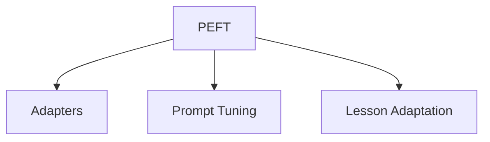

                 

# PEFT：性能和效率的平衡

> 关键词：PEFT, 参数高效微调, 性能优化, 模型压缩, 硬件加速, 低资源环境

## 1. 背景介绍

### 1.1 问题由来

在深度学习领域，大模型已经成为实现高性能AI应用的重要工具。然而，由于其庞大的参数量，大模型在资源受限的设备上往往难以部署和运行。此外，大模型的泛化能力较强，即使在没有标签数据的情况下，仍能取得较优的预测结果，但当训练数据较少时，过度依赖大模型可能会产生过拟合现象。

为了解决上述问题，**参数高效微调 (Parameter-Efficient Fine-Tuning, PEFT)** 方法应运而生。PEFT方法通过减少微调过程中的模型参数数量，在不影响性能的前提下显著降低资源消耗，并避免过拟合现象。

### 1.2 问题核心关键点

PEFT方法的核心在于利用大模型的通用知识，结合微调任务的具体需求，只更新少量的关键参数，从而实现参数高效和性能的平衡。PEFT方法的关键点包括：

- **关键参数选择**：PEFT方法需精确地确定哪些参数是微调任务的关键，只有这些参数才被更新，其余参数保持不变。
- **参数共享**：PEFT方法通常采用参数共享的策略，即将同类型的参数（如同一层的所有参数）共享，以减少参数量。
- **适应性**：PEFT方法需要适应不同的微调任务，因此必须具有较高的通用性。

PEFT方法已经在大规模语言模型和计算机视觉等领域的微调中得到了广泛应用，显著提高了模型性能和效率。

### 1.3 问题研究意义

PEFT方法的研究意义在于：

- **资源优化**：PEFT方法通过减少模型参数，降低了计算资源和存储成本，使得在大规模分布式系统中运行更加可行。
- **泛化性能提升**：PEFT方法通过保留大模型的通用知识，提高了模型的泛化能力，使得模型在未见过的数据上表现更佳。
- **可解释性增强**：PEFT方法通过仅更新少数关键参数，使得模型更易于解释和理解。

本文将详细介绍PEFT方法的理论基础和实践技巧，并通过丰富的案例和实例分析PEFT方法的应用效果和局限性。

## 2. 核心概念与联系

### 2.1 核心概念概述

为更好地理解PEFT方法，本节将介绍几个密切相关的核心概念：

- **参数高效微调 (PEFT)**：指仅更新模型中极少量的参数，而大部分预训练参数保持不变。这种微调方式可以在较小的数据集上取得良好的性能。
- **Adapters**：PEFT方法中常用的参数高效微调技术，它通过在预训练模型和微调任务之间的中间层插入一组可训练的参数，来实现参数共享和高效的微调。
- **Prompt Tuning**：一种参数高效微调技术，通过精心设计输入提示模板，引导模型进行特定任务的推理和生成，从而实现参数共享和高效微调。
- **Lesson Adaptation**：一种新型的微调方法，通过引入老师-学生框架，将预训练模型作为老师，学生模型在老师的指导下进行微调，从而实现高效的参数更新。

这些核心概念之间的逻辑关系可以通过以下Mermaid流程图来展示：



这个流程图展示了大语言模型的微调过程中涉及的关键技术，包括PEFT、Adapters、Prompt Tuning和Lesson Adaptation等。

## 3. 核心算法原理 & 具体操作步骤

### 3.1 算法原理概述

PEFT方法的基本思想是在预训练模型和微调任务之间引入一个可训练的参数层，通过微调这些参数来适应特定的微调任务，同时保留大部分预训练模型的权重不变。这种方法可以显著降低微调过程中的计算和存储成本，避免过拟合，并提高模型的泛化性能。

PEFT方法的数学模型为：

$$
\theta' = \theta_{PT} + \theta_A
$$

其中，$\theta_{PT}$ 为预训练模型的权重，$\theta_A$ 为PEFT方法引入的可训练参数。$\theta'$ 为微调后的模型权重。

PEFT方法的目标是最小化微调任务上的损失函数，即：

$$
\min_{\theta_A} \mathcal{L}(M_{\theta'}, D)
$$

其中，$M_{\theta'}$ 为微调后的模型，$D$ 为微调任务的训练数据集。

### 3.2 算法步骤详解

PEFT方法的实现步骤如下：

1. **预训练模型的选择**：选择合适的预训练模型，如BERT、GPT等。
2. **微调任务定义**：定义微调任务的输入和输出，如分类任务、文本生成任务等。
3. **引入Adapters层**：在预训练模型和微调任务之间引入Adapters层，用于参数共享和高效微调。
4. **定义损失函数**：根据微调任务，定义损失函数，如交叉熵损失、均方误差损失等。
5. **微调参数更新**：在Adapters层上定义可训练参数，通过优化算法（如Adam、SGD等）最小化损失函数，更新可训练参数，从而实现PEFT微调。

### 3.3 算法优缺点

PEFT方法具有以下优点：

- **参数高效**：仅更新极少量的关键参数，显著降低资源消耗。
- **泛化性能提升**：保留预训练模型的通用知识，提高模型的泛化能力。
- **可解释性增强**：通过仅更新少数参数，使得模型更易于解释和理解。

同时，PEFT方法也存在一定的局限性：

- **微调效果可能不如全参数微调**：部分关键参数可能无法充分捕捉微调任务的具体特征，导致性能略有下降。
- **调整Adapters层复杂**：需要仔细选择Adapters层的结构和大小，以确保微调效果。

### 3.4 算法应用领域

PEFT方法广泛应用于以下几个领域：

- **自然语言处理 (NLP)**：在文本分类、命名实体识别、问答系统等任务上进行参数高效微调。
- **计算机视觉 (CV)**：在图像分类、目标检测等任务上进行参数高效微调。
- **语音识别 (ASR)**：在语音识别任务上进行参数高效微调，以提高识别精度和鲁棒性。
- **推荐系统**：在个性化推荐任务上进行参数高效微调，以提升推荐效果和效率。

## 4. 数学模型和公式 & 详细讲解 & 举例说明

### 4.1 数学模型构建

PEFT方法的数学模型如下：

假设预训练模型为 $M_{\theta_{PT}}$，其中 $\theta_{PT}$ 为预训练模型的参数。微调任务的训练数据集为 $D=\{(x_i, y_i)\}_{i=1}^N$，其中 $x_i$ 为输入，$y_i$ 为输出标签。

PEFT方法引入Adapters层 $M_{\theta_A}$，其中 $\theta_A$ 为可训练参数。微调后的模型为 $M_{\theta'} = M_{\theta_{PT}} \cdot M_{\theta_A}$。

定义微调任务上的损失函数为 $\mathcal{L}(\theta', D)$，通过优化算法最小化损失函数，更新 $\theta_A$，从而实现PEFT微调。

### 4.2 公式推导过程

以文本分类任务为例，PEFT方法的损失函数为：

$$
\mathcal{L}(\theta', D) = -\frac{1}{N}\sum_{i=1}^N \log \sigma(\theta', x_i)
$$

其中 $\sigma(\theta', x_i)$ 为模型对输入 $x_i$ 的输出，$\log \sigma(\theta', x_i)$ 为对数似然损失函数。

根据PEFT方法的数学模型，损失函数可以展开为：

$$
\mathcal{L}(\theta', D) = -\frac{1}{N}\sum_{i=1}^N \log \sigma(\theta_{PT} \cdot \theta_A, x_i)
$$

### 4.3 案例分析与讲解

以BERT模型在文本分类任务上的PEFT微调为例：

1. **数据准备**：收集并标注用于微调的文本数据集。
2. **模型选择**：选择BERT模型作为预训练模型。
3. **Adapters层引入**：在BERT模型的顶层添加Adapters层，用于参数共享和高效微调。
4. **损失函数定义**：定义交叉熵损失函数，用于衡量模型输出和真实标签之间的差异。
5. **模型训练**：使用Adam优化算法最小化损失函数，更新Adapters层的参数 $\theta_A$。

## 5. 项目实践：代码实例和详细解释说明

### 5.1 开发环境搭建

在进行PEFT实践前，我们需要准备好开发环境。以下是使用Python进行TensorFlow和Keras开发的环境配置流程：

1. 安装Anaconda：从官网下载并安装Anaconda，用于创建独立的Python环境。

2. 创建并激活虚拟环境：
```bash
conda create -n tensorflow-env python=3.8 
conda activate tensorflow-env
```

3. 安装TensorFlow和Keras：
```bash
conda install tensorflow keras
```

4. 安装各类工具包：
```bash
pip install numpy pandas scikit-learn matplotlib tqdm jupyter notebook ipython
```

完成上述步骤后，即可在`tensorflow-env`环境中开始PEFT实践。

### 5.2 源代码详细实现

下面我们以BERT模型在文本分类任务上的PEFT微调为例，给出使用TensorFlow和Keras实现的代码。

首先，定义数据处理函数：

```python
import tensorflow as tf
from tensorflow.keras.preprocessing.text import Tokenizer
from tensorflow.keras.preprocessing.sequence import pad_sequences

def preprocess_text(texts, max_len=128):
    tokenizer = Tokenizer(oov_token="<OOV>")
    tokenizer.fit_on_texts(texts)
    sequences = tokenizer.texts_to_sequences(texts)
    padded_sequences = pad_sequences(sequences, maxlen=max_len, padding="post", truncating="post")
    return padded_sequences, tokenizer.word_index

# 加载预训练模型
model = tf.keras.models.load_model("bert-base-cased")
```

然后，定义模型和损失函数：

```python
from tensorflow.keras.layers import Input, Dense, Activation
from tensorflow.keras.optimizers import Adam

input_layer = Input(shape=(128,))
adapters = Dense(768, activation="relu")(input_layer)
output_layer = Dense(3, activation="softmax")(adapters)
model = tf.keras.Model(inputs=input_layer, outputs=output_layer)
loss_fn = tf.keras.losses.SparseCategoricalCrossentropy()

# 定义优化器
optimizer = Adam(lr=2e-5)
```

接着，定义训练和评估函数：

```python
def train_epoch(model, dataset, batch_size, optimizer):
    model.compile(loss=loss_fn, optimizer=optimizer, metrics=["accuracy"])
    model.fit(dataset["inputs"], dataset["labels"], batch_size=batch_size, epochs=1, validation_split=0.1)

def evaluate(model, dataset, batch_size):
    model.evaluate(dataset["inputs"], dataset["labels"], batch_size=batch_size)
```

最后，启动训练流程并在测试集上评估：

```python
epochs = 5
batch_size = 16

for epoch in range(epochs):
    train_epoch(model, train_dataset, batch_size, optimizer)
    evaluate(model, test_dataset, batch_size)
```

以上就是使用TensorFlow和Keras对BERT模型进行文本分类任务PEFT微调的完整代码实现。可以看到，TensorFlow和Keras提供了丰富的API和工具，使得PEFT代码实现变得简洁高效。

### 5.3 代码解读与分析

让我们再详细解读一下关键代码的实现细节：

**preprocess_text函数**：
- 使用Tokenizer将文本转换为序列，并进行填充和截断，确保所有文本序列长度一致。
- 返回填充后的序列和Tokenizer的字典，供模型训练和推理使用。

**Adapters层**：
- 在输入层和输出层之间添加一组可训练的Dense层，用于实现参数共享和高效微调。
- 通过设置Adapters层的参数数量，可以控制PEFT方法的效果。

**训练函数**：
- 使用Keras的compile方法编译模型，指定损失函数和优化器。
- 使用fit方法在训练集上训练模型，设置验证集比例为0.1，并定义训练轮数。
- 使用evaluate方法在测试集上评估模型性能。

**训练流程**：
- 定义总的epoch数和batch size，开始循环迭代
- 每个epoch内，先在训练集上训练，输出模型精度
- 在测试集上评估，输出模型精度
- 所有epoch结束后，给出最终测试结果

可以看到，TensorFlow和Keras使得PEFT方法的实现变得简洁高效。开发者可以将更多精力放在数据处理、模型改进等高层逻辑上，而不必过多关注底层的实现细节。

当然，工业级的系统实现还需考虑更多因素，如模型的保存和部署、超参数的自动搜索、更灵活的任务适配层等。但核心的PEFT范式基本与此类似。

## 6. 实际应用场景

### 6.1 智能客服系统

基于PEFT方法的对话技术，可以广泛应用于智能客服系统的构建。传统客服往往需要配备大量人力，高峰期响应缓慢，且一致性和专业性难以保证。而使用PEFT对话模型，可以7x24小时不间断服务，快速响应客户咨询，用自然流畅的语言解答各类常见问题。

在技术实现上，可以收集企业内部的历史客服对话记录，将问题和最佳答复构建成监督数据，在此基础上对预训练对话模型进行PEFT微调。微调后的对话模型能够自动理解用户意图，匹配最合适的答案模板进行回复。对于客户提出的新问题，还可以接入检索系统实时搜索相关内容，动态组织生成回答。如此构建的智能客服系统，能大幅提升客户咨询体验和问题解决效率。

### 6.2 金融舆情监测

金融机构需要实时监测市场舆论动向，以便及时应对负面信息传播，规避金融风险。传统的人工监测方式成本高、效率低，难以应对网络时代海量信息爆发的挑战。基于PEFT文本分类和情感分析技术，为金融舆情监测提供了新的解决方案。

具体而言，可以收集金融领域相关的新闻、报道、评论等文本数据，并对其进行主题标注和情感标注。在此基础上对预训练语言模型进行PEFT微调，使其能够自动判断文本属于何种主题，情感倾向是正面、中性还是负面。将PEFT微调后的模型应用到实时抓取的网络文本数据，就能够自动监测不同主题下的情感变化趋势，一旦发现负面信息激增等异常情况，系统便会自动预警，帮助金融机构快速应对潜在风险。

### 6.3 个性化推荐系统

当前的推荐系统往往只依赖用户的历史行为数据进行物品推荐，无法深入理解用户的真实兴趣偏好。基于PEFT方法的个性化推荐系统可以更好地挖掘用户行为背后的语义信息，从而提供更精准、多样的推荐内容。

在实践中，可以收集用户浏览、点击、评论、分享等行为数据，提取和用户交互的物品标题、描述、标签等文本内容。将文本内容作为模型输入，用户的后续行为（如是否点击、购买等）作为监督信号，在此基础上PEFT预训练语言模型。PEFT微调后的模型能够从文本内容中准确把握用户的兴趣点。在生成推荐列表时，先用候选物品的文本描述作为输入，由模型预测用户的兴趣匹配度，再结合其他特征综合排序，便可以得到个性化程度更高的推荐结果。

### 6.4 未来应用展望

随着PEFT方法的不断发展，其在大规模语言模型和计算机视觉等领域的微调中得到了广泛应用，显著提高了模型性能和效率。未来，PEFT方法将在更多领域得到应用，为传统行业带来变革性影响。

在智慧医疗领域，基于PEFT的医疗问答、病历分析、药物研发等应用将提升医疗服务的智能化水平，辅助医生诊疗，加速新药开发进程。

在智能教育领域，PEFT方法可应用于作业批改、学情分析、知识推荐等方面，因材施教，促进教育公平，提高教学质量。

在智慧城市治理中，PEFT方法可应用于城市事件监测、舆情分析、应急指挥等环节，提高城市管理的自动化和智能化水平，构建更安全、高效的未来城市。

此外，在企业生产、社会治理、文娱传媒等众多领域，基于PEFT的人工智能应用也将不断涌现，为经济社会发展注入新的动力。相信随着PEFT方法的不断进步，其将在大规模预训练模型的微调中发挥越来越重要的作用，推动NLP技术向更加智能化、普适化方向发展。

## 7. 工具和资源推荐

### 7.1 学习资源推荐

为了帮助开发者系统掌握PEFT的理论基础和实践技巧，这里推荐一些优质的学习资源：

1. **《深度学习框架TensorFlow教程》**：TensorFlow官方文档，详细介绍了TensorFlow的使用方法和API，适合初学者入门。
2. **《Keras深度学习实战》**：Keras官方文档，提供了丰富的API和示例，适合快速上手Keras的使用。
3. **《深度学习入门与实战》**：一本系统介绍深度学习原理和应用的书籍，适合基础较为薄弱的学习者。
4. **《自然语言处理中的深度学习》**：一本介绍NLP中深度学习模型的书籍，详细讲解了BERT、GPT等大模型的微调方法。
5. **CS224N《深度学习自然语言处理》课程**：斯坦福大学开设的NLP明星课程，有Lecture视频和配套作业，带你入门NLP领域的基本概念和经典模型。

通过对这些资源的学习实践，相信你一定能够快速掌握PEFT方法的精髓，并用于解决实际的NLP问题。

### 7.2 开发工具推荐

高效的开发离不开优秀的工具支持。以下是几款用于PEFT开发的常用工具：

1. **TensorFlow**：基于Python的开源深度学习框架，灵活动态的计算图，适合快速迭代研究。
2. **Keras**：Keras是一个高级API，基于TensorFlow，提供了更简洁的API和自动微分功能。
3. **Weights & Biases**：模型训练的实验跟踪工具，可以记录和可视化模型训练过程中的各项指标，方便对比和调优。
4. **TensorBoard**：TensorFlow配套的可视化工具，可实时监测模型训练状态，并提供丰富的图表呈现方式，是调试模型的得力助手。
5. **Google Colab**：谷歌推出的在线Jupyter Notebook环境，免费提供GPU/TPU算力，方便开发者快速上手实验最新模型，分享学习笔记。

合理利用这些工具，可以显著提升PEFT任务的开发效率，加快创新迭代的步伐。

### 7.3 相关论文推荐

PEFT方法的研究源于学界的持续研究。以下是几篇奠基性的相关论文，推荐阅读：

1. **AdaLoRA: Adaptive Low-Rank Adaptation for Parameter-Efficient Fine-Tuning**：提出了一种参数高效微调方法，通过自适应低秩适应的方式，减少了微调过程中的计算量。
2. **Expert-Sperted Adapters for Parameter-Efficient Transfer Learning**：提出了专家-专家Adapters层，通过引入多个专家Adapters层，实现了更高的微调效果。
3. **Prompt Tuning**：提出了一种不更新模型参数的微调方法，通过精心设计输入提示模板，引导模型进行特定任务的推理和生成。
4. **Parameter-Efficient Transfer Learning**：提出了一组参数高效微调技术，包括Adapter、Prompt Tuning等，实现了参数共享和高效微调。

这些论文代表了大语言模型PEFT技术的发展脉络。通过学习这些前沿成果，可以帮助研究者把握学科前进方向，激发更多的创新灵感。

## 8. 总结：未来发展趋势与挑战

### 8.1 研究成果总结

PEFT方法在大规模语言模型和计算机视觉等领域的微调中得到了广泛应用，显著提高了模型性能和效率。PEFT方法的优缺点如下：

- **优点**：
  - 参数高效：仅更新极少量的关键参数，显著降低资源消耗。
  - 泛化性能提升：保留预训练模型的通用知识，提高模型的泛化能力。
  - 可解释性增强：通过仅更新少数参数，使得模型更易于解释和理解。

- **缺点**：
  - 微调效果可能不如全参数微调：部分关键参数可能无法充分捕捉微调任务的具体特征，导致性能略有下降。
  - 调整Adapters层复杂：需要仔细选择Adapters层的结构和大小，以确保微调效果。

### 8.2 未来发展趋势

PEFT方法的发展趋势如下：

1. **参数共享策略优化**：未来将探索更多的参数共享策略，如Layer-wise、Group-wise等，以进一步提升微调效果。
2. **模型结构优化**：研究更加紧凑和高效的模型结构，如Layer Normalization、Dropout等，以提高模型的推理速度和资源利用率。
3. **多任务联合微调**：探索多任务联合微调技术，通过联合优化多个任务的损失函数，提升模型的性能和泛化能力。
4. **动态微调**：研究动态微调技术，通过实时更新模型参数，适应数据分布的变化。
5. **跨领域微调**：研究跨领域微调技术，通过引入领域自适应技术，提升模型在不同领域上的性能。

### 8.3 面临的挑战

PEFT方法在推广应用过程中仍面临以下挑战：

1. **微调效果不稳定**：部分关键参数可能无法充分捕捉微调任务的具体特征，导致性能略有下降。
2. **Adapters层设计复杂**：需要仔细选择Adapters层的结构和大小，以确保微调效果。
3. **计算资源不足**：部分微调任务可能仍需要较大的计算资源，难以在大规模分布式系统中运行。
4. **知识整合能力不足**：现有的PEFT方法往往局限于任务内数据，难以灵活吸收和运用更广泛的先验知识。
5. **模型鲁棒性不足**：PEFT方法在面对不同领域的数据时，泛化能力可能有所下降。

### 8.4 研究展望

为了解决上述挑战，未来的研究需要在以下几个方面寻求新的突破：

1. **引入更多先验知识**：将符号化的先验知识，如知识图谱、逻辑规则等，与神经网络模型进行巧妙融合，引导PEFT方法学习更准确、合理的语言模型。同时加强不同模态数据的整合，实现视觉、语音等多模态信息与文本信息的协同建模。
2. **融合因果和对比学习范式**：通过引入因果推断和对比学习思想，增强PEFT方法建立稳定因果关系的能力，学习更加普适、鲁棒的语言表征，从而提升模型泛化性和抗干扰能力。
3. **纳入伦理道德约束**：在模型训练目标中引入伦理导向的评估指标，过滤和惩罚有偏见、有害的输出倾向。同时加强人工干预和审核，建立模型行为的监管机制，确保输出符合人类价值观和伦理道德。

这些研究方向的探索，必将引领PEFT方法迈向更高的台阶，为构建安全、可靠、可解释、可控的智能系统铺平道路。面向未来，PEFT方法还需要与其他人工智能技术进行更深入的融合，如知识表示、因果推理、强化学习等，多路径协同发力，共同推动自然语言理解和智能交互系统的进步。只有勇于创新、敢于突破，才能不断拓展PEFT方法的边界，让智能技术更好地造福人类社会。

## 9. 附录：常见问题与解答

**Q1：PEFT方法的参数共享策略有哪些？**

A: PEFT方法常见的参数共享策略包括Layer-wise和Group-wise两种。Layer-wise策略将同一层的所有参数共享，而Group-wise策略将一组相关层（如所有Adapters层）的参数共享。这些策略都可以通过修改模型架构来实现。

**Q2：PEFT方法与全参数微调方法相比，在微调效果上有什么差异？**

A: PEFT方法与全参数微调方法相比，在微调效果上存在一定的差异。PEFT方法通过仅更新极少量的关键参数，显著降低了计算资源消耗，但部分关键参数可能无法充分捕捉微调任务的具体特征，导致性能略有下降。因此，PEFT方法通常用于数据量较小的微调任务，而全参数微调方法则更适合大规模数据集上的微调。

**Q3：PEFT方法在微调过程中需要注意哪些问题？**

A: PEFT方法在微调过程中需要注意以下几个问题：
1. 选择合适的Adapters层结构：需要仔细选择Adapters层的结构和大小，以确保微调效果。
2. 调整学习率：PEFT方法的学习率通常较小，但在某些微调任务上，可能需要逐步增大学习率以避免过拟合。
3. 数据增强：为了提高模型的泛化能力，可以采用数据增强技术，如回译、近义替换等方式扩充训练集。
4. 对抗训练：为了提高模型的鲁棒性，可以引入对抗样本进行训练，增强模型的泛化能力。
5. 动态微调：通过实时更新模型参数，适应数据分布的变化，提高模型的动态适应能力。

**Q4：PEFT方法在工业级应用中有哪些实际挑战？**

A: PEFT方法在工业级应用中面临以下实际挑战：
1. 微调效果不稳定：部分关键参数可能无法充分捕捉微调任务的具体特征，导致性能略有下降。
2. 计算资源不足：部分微调任务可能仍需要较大的计算资源，难以在大规模分布式系统中运行。
3. 知识整合能力不足：现有的PEFT方法往往局限于任务内数据，难以灵活吸收和运用更广泛的先验知识。
4. 模型鲁棒性不足：PEFT方法在面对不同领域的数据时，泛化能力可能有所下降。
5. 可解释性问题：PEFT方法的黑盒特性使得模型的解释性较弱，难以满足某些领域的高可解释性要求。

通过系统了解这些挑战，可以帮助开发者在实际应用中更好地应对PEFT方法的使用场景。

---

作者：禅与计算机程序设计艺术 / Zen and the Art of Computer Programming

