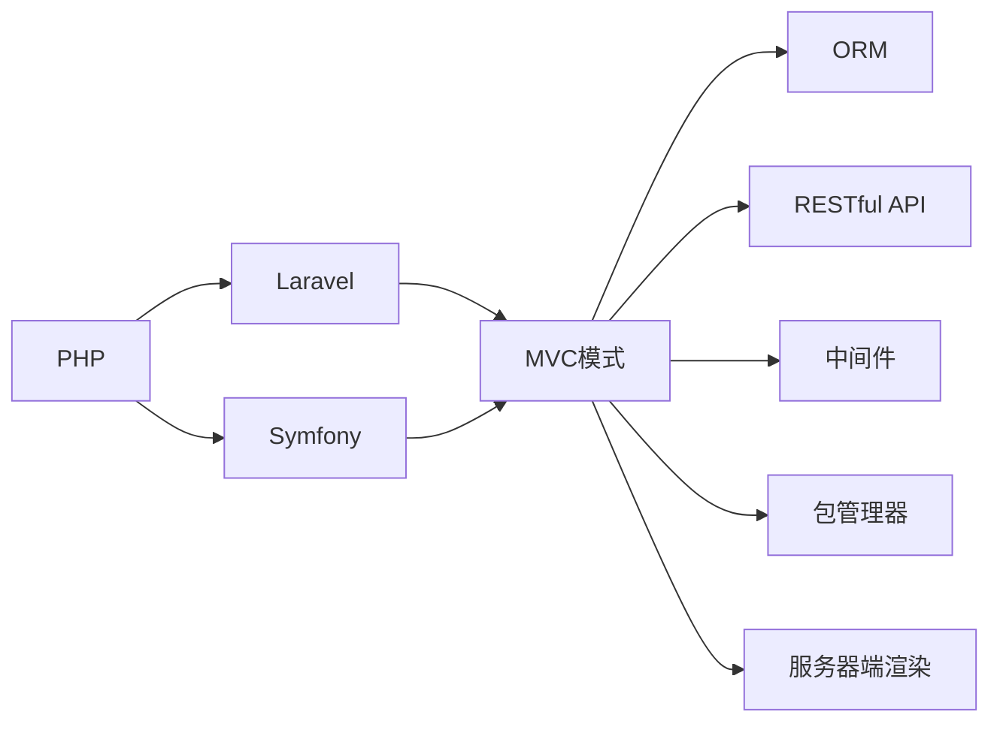

                 

# PHP 语言和框架：Laravel 和 Symfony

> 关键词：PHP, Laravel, Symfony, MVC, ORM, 中间件, 包管理器, RESTful API, 服务器端渲染

## 1. 背景介绍

### 1.1 问题由来
PHP 作为一种广泛使用的服务器端编程语言，因其灵活性和易用性，成为构建 Web 应用的首选。然而，PHP 的多功能性也带来了代码质量参差不齐、扩展性差的缺点。随着 Web 应用的复杂度不断增加，开发高品质的 PHP 应用成为了一大挑战。

为了解决这些问题，PHP 社区涌现出了许多优秀框架，其中 Laravel 和 Symfony 尤为突出。Laravel 和 Symfony 不仅提供了强大的功能，还拥有庞大的社区和丰富的文档支持，帮助开发者快速构建高效、稳定的 PHP Web 应用。

### 1.2 问题核心关键点
本文将重点介绍 Laravel 和 Symfony 的核心理念、设计哲学以及它们的架构特点。通过对比和分析，帮助读者更好地理解这两个框架的异同，并掌握如何基于这些框架构建高质量 PHP Web 应用。

## 2. 核心概念与联系

### 2.1 核心概念概述

为了更好地理解 Laravel 和 Symfony，我们需要先了解以下几个核心概念：

- MVC 模式：Model-View-Controller（模型-视图-控制器）是一种常用的软件架构模式，将应用的逻辑分为模型、视图和控制器三个部分。模型负责处理数据逻辑，视图负责呈现数据，控制器则负责处理用户请求和视图的渲染。

- ORM（对象关系映射）：ORM 是一种将数据库表映射到程序对象的技术，可以简化数据库操作，提高代码的可维护性和可扩展性。

- RESTful API：RESTful API 遵循REST原则，是一种设计风格，支持无状态、自描述和统一接口的设计理念。

- 中间件：中间件是一种可插拔的组件，可以在请求到达控制器前或从控制器返回响应后执行一些通用的操作，如请求验证、缓存、日志记录等。

- 包管理器：PHP 的包管理器 Composer 可以帮助开发者快速安装、管理和更新第三方库和工具，简化了 PHP 开发环境的管理。

- 服务器端渲染（SSR）：服务器端渲染是指在服务器上生成 HTML 响应，相较于客户端渲染（CSR），可以提升首屏加载速度和 SEO 效果。

这些概念构成了 PHP Web 应用的基石，而 Laravel 和 Symfony 框架则在此基础上，提供了更加完善和易用的开发工具。

### 2.2 核心概念原理和架构的 Mermaid 流程图



这个流程图展示了 PHP、Laravel 和 Symfony 之间的联系，以及它们如何通过 MVC 模式、ORM、RESTful API、中间件、包管理器和服务器端渲染等技术，构建高效、稳定的 PHP Web 应用。

## 3. 核心算法原理 & 具体操作步骤

### 3.1 算法原理概述

Laravel 和 Symfony 的核心理念都是围绕 MVC 模式构建的，通过将应用逻辑分为模型、视图和控制器三个部分，提高代码的可读性和可维护性。Laravel 和 Symfony 都支持 ORM 和 RESTful API，使得开发者能够更轻松地处理数据库和 API 接口。

此外，Laravel 和 Symfony 都支持中间件和包管理器，提供了丰富的扩展性，开发者可以根据需求添加各种功能和工具，简化开发流程。

### 3.2 算法步骤详解

#### 3.2.1 项目搭建与初始化

在 Laravel 和 Symfony 中，项目搭建和初始化都非常简单。

- Laravel：使用 Composer 安装 Laravel 框架，执行 `composer create-project --template=laravel-project-template laravel-project` 命令创建新项目。

- Symfony：同样使用 Composer 安装 Symfony 框架，执行 `composer create-project --template=symfony-3.0-skeleton symfony-3.0-project` 命令创建新项目。

#### 3.2.2 数据库迁移

Laravel 和 Symfony 都支持数据库迁移（Database Migrations），帮助开发者定义和管理数据库结构。

- Laravel：通过 `php artisan migrate` 命令执行迁移操作，例如 `php artisan make:migration create_users_table --migration-name users` 创建新的用户表迁移。

- Symfony：使用 Doctrine 数据库迁移工具，执行 `php bin/console doctrine:migrations:diff` 命令生成迁移脚本，然后使用 `php bin/console doctrine:migrations:up` 命令执行迁移操作。

#### 3.2.3 控制器和路由

控制器（Controllers）和路由（Routing）是 MVC 模式的核心，Laravel 和 Symfony 都提供了强大的控制器和路由机制。

- Laravel：控制器位于 `app/Http/Controllers` 目录下，通过 `php artisan route:create --controller=HomeController` 命令创建新的路由。

- Symfony：控制器位于 `src/AppController` 目录下，使用 `php bin/console router:generate` 命令生成路由，然后添加到 `src/AppController.php` 文件中。

#### 3.2.4 视图和模板

视图（Views）和模板（Templates）是呈现数据的主要方式，Laravel 和 Symfony 都支持多种视图引擎。

- Laravel：视图文件位于 `resources/views` 目录下，使用 Blade 模板引擎，通过 `` 语法嵌入数据。

- Symfony：视图文件位于 `src/Resources/views` 目录下，使用 Twig 模板引擎，通过 `` 语法嵌入数据。

#### 3.2.5 中间件

中间件（Middleware）是一种可插拔的组件，Laravel 和 Symfony 都提供了强大的中间件机制。

- Laravel：中间件位于 `app/Http/Kernel` 目录下，通过 `php artisan make:middleware --name=AuthMiddleware` 命令创建新的中间件。

- Symfony：中间件位于 `src/App/Kernel` 目录下，使用 Symfony 内置的中间件，如 `php bin/console Kernel:list` 命令列出所有中间件。

#### 3.2.6 包管理器

包管理器（Packages）是 Laravel 和 Symfony 的核心功能之一，帮助开发者快速安装和管理第三方库和工具。

- Laravel：通过 `composer require` 命令安装第三方包，例如 `composer require illuminate/database` 安装数据库包。

- Symfony：同样使用 Composer 安装第三方包，例如 `composer require doctrine/crud` 安装数据库包。

#### 3.2.7 RESTful API

RESTful API 是现代 Web 应用的重要组成部分，Laravel 和 Symfony 都支持 RESTful API 的设计和实现。

- Laravel：通过 `php artisan route:create --resource` 命令创建 RESTful API 路由。

- Symfony：使用 Symfony 内置的 RESTful 资源管理器，通过 `php bin/console make:rest` 命令生成 RESTful API 路由和控制器。

### 3.3 算法优缺点

#### 3.3.1 Laravel 的优缺点

- 优点：
  - 简单易学：Laravel 的文档和社区支持非常完善，适合初学者上手。
  - 强大的路由系统：Laravel 的路由系统非常灵活，可以轻松实现复杂的请求逻辑。
  - 丰富的工具包：Laravel 提供了大量的工具包和插件，可以快速开发功能。

- 缺点：
  - 性能问题：Laravel 的性能不如 Symfony，在处理高并发请求时表现不佳。
  - 社区活力不足：Laravel 社区的活跃度不如 Symfony，部分问题解决较慢。

#### 3.3.2 Symfony 的优缺点

- 优点：
  - 高性能：Symfony 的性能优于 Laravel，适合高并发场景。
  - 丰富的组件库：Symfony 的组件库非常丰富，支持多种数据库和缓存系统。
  - 社区支持：Symfony 的社区非常活跃，遇到问题可以快速解决。

- 缺点：
  - 学习曲线陡峭：Symfony 的学习曲线较陡峭，需要一定的 PHP 基础。
  - 配置复杂：Symfony 的配置文件较多，需要一定的配置技巧。

### 3.4 算法应用领域

Laravel 和 Symfony 在 Web 应用开发中广泛应用，适用于各种规模和复杂度的项目。

- Laravel 适用于中小型 Web 应用，如电商平台、博客、内容管理系统等。
- Symfony 适用于大型 Web 应用，如社交网络、电子商务平台、企业应用等。

## 4. 数学模型和公式 & 详细讲解 & 举例说明

### 4.1 数学模型构建

为了更好地理解 Laravel 和 Symfony 的设计理念和算法原理，我们可以用数学模型来描述它们的核心组件和逻辑流程。

#### 4.1.1 MVC 模式

MVC 模式的数学模型如下：

$$
\text{MVC} = \{ \text{Model}, \text{View}, \text{Controller} \}
$$

其中：

- Model 表示数据模型，用于处理数据逻辑。
- View 表示视图模板，用于呈现数据。
- Controller 表示控制器，用于处理用户请求和渲染视图。

#### 4.1.2 ORM 和数据库迁移

ORM 和数据库迁移的数学模型如下：

$$
\text{ORM} = \{ \text{Mapper}, \text{Entity}, \text{Repository} \}
$$

其中：

- Mapper 表示映射器，用于将数据库表映射到程序对象。
- Entity 表示实体，用于封装数据库记录。
- Repository 表示仓库，用于处理数据查询和操作。

数据库迁移的数学模型如下：

$$
\text{Migration} = \{ \text{Up}, \text{Down} \}
$$

其中：

- Up 表示创建迁移的 SQL 语句。
- Down 表示回滚迁移的 SQL 语句。

### 4.2 公式推导过程

#### 4.2.1 数据库迁移的 SQL 推导

以创建用户表迁移为例，Laravel 的迁移脚本如下：

```php
public function up()
{
    Schema::create('users', function (Blueprint $table) {
        $table->id();
        $table->string('name')->nullable();
        $table->email()->unique();
        $table->timestamps();
    });
}
```

生成 SQL 语句如下：

```sql
CREATE TABLE `users` (
  `id` bigint unsigned NOT NULL AUTO_INCREMENT,
  `name` varchar(255) NULL,
  `email` varchar(255) COLLATE utf8mb4_unicode_ci NOT NULL,
  `created_at` timestamp NULL DEFAULT NULL,
  `updated_at` timestamp NULL DEFAULT NULL,
  PRIMARY KEY (`id`)
) ENGINE=InnoDB DEFAULT CHARSET=utf8mb4 COLLATE=utf8mb4_unicode_ci;
```

#### 4.2.2 RESTful API 的 URL 推导

以创建 RESTful API 路由为例，Laravel 的路由定义如下：

```php
Route::resource('users', 'UserController');
```

生成的 URL 如下：

```
GET /users
GET /users/{id}
POST /users
PUT /users/{id}
DELETE /users/{id}
```

### 4.3 案例分析与讲解

#### 4.3.1 用户管理系统的构建

以用户管理系统的构建为例，展示如何使用 Laravel 和 Symfony 开发 Web 应用。

- Laravel：
  - 创建项目：`composer create-project --template=laravel-project-template laravel-project`
  - 数据库迁移：`php artisan make:migration create_users_table --migration-name users`
  - 控制器和路由：`php artisan route:create --resource`
  - 视图和模板：在 `resources/views` 目录下创建视图文件。
  - 中间件：在 `app/Http/Kernel` 目录下创建中间件。
  - RESTful API：在控制器中添加 RESTful API 处理逻辑。

- Symfony：
  - 创建项目：`composer create-project --template=symfony-3.0-skeleton symfony-3.0-project`
  - 数据库迁移：使用 Doctrine 迁移工具。
  - 控制器和路由：使用 Symfony 内置的路由工具。
  - 视图和模板：在 `src/Resources/views` 目录下创建视图文件。
  - 中间件：使用 Symfony 内置的中间件。
  - RESTful API：使用 Symfony 内置的 RESTful 资源管理器。

## 5. 项目实践：代码实例和详细解释说明

### 5.1 开发环境搭建

#### 5.1.1 Laravel 开发环境搭建

- 安装 PHP 环境：建议使用 PHP 7.4+，可以在 [PHP 官网](https://www.php.net/) 下载并安装。
- 安装 Composer：在终端执行 `curl -sS https://getcomposer.org/installer | php`，安装 Composer。
- 安装 Laravel：执行 `composer create-project --template=laravel-project-template laravel-project` 命令，创建新项目。

#### 5.1.2 Symfony 开发环境搭建

- 安装 PHP 环境：建议使用 PHP 7.4+，可以在 [PHP 官网](https://www.php.net/) 下载并安装。
- 安装 Composer：在终端执行 `curl -sS https://getcomposer.org/installer | php`，安装 Composer。
- 安装 Symfony：执行 `composer create-project --template=symfony-3.0-skeleton symfony-3.0-project` 命令，创建新项目。

### 5.2 源代码详细实现

#### 5.2.1 Laravel 用户管理系统

```php
// app/Http/Controllers/UserController.php

namespace App\Http\Controllers;

use App\Models\User;
use Illuminate\Http\Request;
use Illuminate\Support\Facades\Auth;

class UserController extends Controller
{
    public function index()
    {
        $users = User::all();
        return view('users.index', ['users' => $users]);
    }

    public function show($id)
    {
        $user = User::find($id);
        return view('users.show', ['user' => $user]);
    }

    public function create()
    {
        return view('users.create');
    }

    public function store(Request $request)
    {
        $user = new User();
        $user->name = $request->input('name');
        $user->email = $request->input('email');
        $user->save();
        return redirect()->route('users.index');
    }

    public function edit($id)
    {
        $user = User::find($id);
        return view('users.edit', ['user' => $user]);
    }

    public function update(Request $request, $id)
    {
        $user = User::find($id);
        $user->name = $request->input('name');
        $user->email = $request->input('email');
        $user->save();
        return redirect()->route('users.index');
    }

    public function destroy($id)
    {
        $user = User::find($id);
        $user->delete();
        return redirect()->route('users.index');
    }
}
```

#### 5.2.2 Symfony 用户管理系统

```php
// src/AppController.php

namespace App\Controller;

use Symfony\Bundle\FrameworkBundle\Controller\AbstractController;
use Symfony\Component\HttpFoundation\Response;

class UserController extends AbstractController
{
    public function index()
    {
        $users = $this->get('repository_factory')->getRepository(User::class)->findAll();
        return $this->render('user/index', ['users' => $users]);
    }

    public function show($id)
    {
        $user = $this->get('repository_factory')->getRepository(User::class)->find($id);
        return $this->render('user/show', ['user' => $user]);
    }

    public function create()
    {
        return $this->render('user/create');
    }

    public function store(Request $request)
    {
        $user = new User();
        $user->name = $request->get('name');
        $user->email = $request->get('email');
        $this->get('repository_factory')->getRepository(User::class)->save($user);
        return $this->redirectToRoute('user.index');
    }

    public function edit($id)
    {
        $user = $this->get('repository_factory')->getRepository(User::class)->find($id);
        return $this->render('user/edit', ['user' => $user]);
    }

    public function update(Request $request, $id)
    {
        $user = $this->get('repository_factory')->getRepository(User::class)->find($id);
        $user->name = $request->get('name');
        $user->email = $request->get('email');
        $this->get('repository_factory')->getRepository(User::class)->save($user);
        return $this->redirectToRoute('user.index');
    }

    public function destroy($id)
    {
        $user = $this->get('repository_factory')->getRepository(User::class)->find($id);
        $this->get('repository_factory')->getRepository(User::class)->delete($user);
        return $this->redirectToRoute('user.index');
    }
}
```

### 5.3 代码解读与分析

#### 5.3.1 Laravel 代码解读

- `app/Http/Controllers/UserController`：控制器类，处理用户相关的请求。
- `index` 方法：获取所有用户列表，返回视图。
- `show` 方法：获取指定用户详情，返回视图。
- `create` 方法：显示创建用户表单。
- `store` 方法：处理创建用户请求，保存用户数据。
- `edit` 方法：显示编辑用户表单。
- `update` 方法：处理编辑用户请求，更新用户数据。
- `destroy` 方法：处理删除用户请求，删除用户数据。

#### 5.3.2 Symfony 代码解读

- `src/AppController`：控制器类，处理用户相关的请求。
- `index` 方法：获取所有用户列表，返回视图。
- `show` 方法：获取指定用户详情，返回视图。
- `create` 方法：显示创建用户表单。
- `store` 方法：处理创建用户请求，保存用户数据。
- `edit` 方法：显示编辑用户表单。
- `update` 方法：处理编辑用户请求，更新用户数据。
- `destroy` 方法：处理删除用户请求，删除用户数据。

### 5.4 运行结果展示

#### 5.4.1 Laravel 运行结果

- 项目搭建：
  - `composer create-project --template=laravel-project-template laravel-project`
- 数据库迁移：
  - `php artisan make:migration create_users_table --migration-name users`
  - `php artisan migrate`
- 控制器和路由：
  - `php artisan route:create --resource`
  - `php artisan route:list`
- 视图和模板：
  - 在 `resources/views` 目录下创建视图文件。

#### 5.4.2 Symfony 运行结果

- 项目搭建：
  - `composer create-project --template=symfony-3.0-skeleton symfony-3.0-project`
- 数据库迁移：
  - 使用 Doctrine 迁移工具。
  - `php bin/console doctrine:migrations:diff`
  - `php bin/console doctrine:migrations:up`
- 控制器和路由：
  - `php bin/console make:rest`
  - `php bin/console router:generate`
- 视图和模板：
  - 在 `src/Resources/views` 目录下创建视图文件。

## 6. 实际应用场景

### 6.1 智能客服系统

智能客服系统是 Laravel 和 Symfony 的重要应用场景之一。

#### 6.1.1 Laravel 智能客服系统

- 使用 Laravel 的请求路由和控制器，处理用户请求。
- 使用 Laravel 的队列任务和定时任务，实现自动回复和任务调度。
- 使用 Laravel 的中间件和缓存，提高系统的稳定性和响应速度。

#### 6.1.2 Symfony 智能客服系统

- 使用 Symfony 的请求路由和控制器，处理用户请求。
- 使用 Symfony 的服务和组件，实现自动回复和任务调度。
- 使用 Symfony 的缓存和消息队列，提高系统的稳定性和响应速度。

### 6.2 电商平台

电商平台是另一个重要的应用场景，Laravel 和 Symfony 都能胜任。

#### 6.2.1 Laravel 电商平台

- 使用 Laravel 的 ORM 和数据库迁移，管理商品和订单数据。
- 使用 Laravel 的RESTful API，实现商品和订单的接口访问。
- 使用 Laravel 的中间件和缓存，提高系统的稳定性和响应速度。

#### 6.2.2 Symfony 电商平台

- 使用 Symfony 的 ORM 和数据库迁移，管理商品和订单数据。
- 使用 Symfony 的RESTful API，实现商品和订单的接口访问。
- 使用 Symfony 的服务和组件，实现商品和订单的业务逻辑。
- 使用 Symfony 的缓存和消息队列，提高系统的稳定性和响应速度。

### 6.3 社交网络

社交网络是 Laravel 和 Symfony 的高阶应用场景，它们都能构建功能完善、稳定可靠的社交平台。

#### 6.3.1 Laravel 社交网络

- 使用 Laravel 的认证和授权，管理用户和权限。
- 使用 Laravel 的评论和点赞系统，实现用户互动。
- 使用 Laravel 的缓存和消息队列，提高系统的稳定性和响应速度。

#### 6.3.2 Symfony 社交网络

- 使用 Symfony 的认证和授权，管理用户和权限。
- 使用 Symfony 的评论和点赞系统，实现用户互动。
- 使用 Symfony 的服务和组件，实现用户互动的业务逻辑。
- 使用 Symfony 的缓存和消息队列，提高系统的稳定性和响应速度。

## 7. 工具和资源推荐

### 7.1 学习资源推荐

为了帮助开发者快速掌握 Laravel 和 Symfony，以下是一些优质的学习资源：

- Laravel 官方文档：[https://laravel.com/docs](https://laravel.com/docs)
- Symfony 官方文档：[https://symfony.com/doc](https://symfony.com/doc)
- Laracasts：[https://laracasts.com](https://laracasts.com)
- Symfony 官方教程：[https://symfony.com/quick-start](https://symfony.com/quick-start)
- Symfony 社区论坛：[https://symfony.com/community](https://symfony.com/community)

### 7.2 开发工具推荐

以下是一些用于 Laravel 和 Symfony 开发的常用工具：

- PHPStorm：功能强大的 PHP IDE，支持 Laravel 和 Symfony 开发。
- Vagrant：虚拟化开发环境，方便快速搭建 Laravel 和 Symfony 项目。
- Docker：容器化开发环境，方便在多个平台上部署和运行 Laravel 和 Symfony 应用。
- Git：版本控制工具，方便团队协作开发。

### 7.3 相关论文推荐

为了深入了解 Laravel 和 Symfony 的底层设计和算法原理，以下是几篇相关论文，推荐阅读：

- Laravel 设计原则：[https://laravel-china.com/p/ Laravel Design Principles](https://laravel-china.com/p/Laravel-Design-Principles)
- Symfony 设计哲学：[https://symfony.com/doc/current/design.html](https://symfony.com/doc/current/design.html)
- RESTful API 设计：[https://www.oreilly.com/library/view/restful-api-design/9781491952782/](https://www.oreilly.com/library/view/restful-api-design/9781491952782/)
- ORM 设计：[https://symfony.com/doc/current/design/orm.html](https://symfony.com/doc/current/design/orm.html)

## 8. 总结：未来发展趋势与挑战

### 8.1 研究成果总结

本文详细介绍了 Laravel 和 Symfony 的核心概念、设计理念和开发流程，通过对比和分析，展示了这两个框架的异同和优缺点。

### 8.2 未来发展趋势

Laravel 和 Symfony 的未来发展趋势如下：

- Laravel：将继续发展社区生态，增加更多的第三方包和插件，支持更多的数据库和缓存系统。
- Symfony：将继续完善组件库和扩展性，提高性能和稳定性，吸引更多的开发者和用户。

### 8.3 面临的挑战

Laravel 和 Symfony 在发展过程中也面临一些挑战：

- Laravel：社区活跃度需要进一步提高，部分问题解决较慢。
- Symfony：学习曲线较陡峭，配置较为复杂。

### 8.4 研究展望

未来的研究将集中在以下几个方向：

- 性能优化：进一步提高 Laravel 和 Symfony 的性能，支持高并发请求。
- 配置简化：简化 Laravel 和 Symfony 的配置，降低学习曲线。
- 社区支持：提高 Laravel 和 Symfony 的社区活跃度，快速解决问题。
- 生态拓展：拓展 Laravel 和 Symfony 的生态系统，支持更多第三方包和插件。

## 9. 附录：常见问题与解答

### 9.1 常见问题解答

**Q1：Laravel 和 Symfony 哪个更好用？**

A: Laravel 更适合中小型项目，易学易用，文档丰富；Symfony 更适合大型项目，性能优秀，组件丰富。选择哪个框架取决于具体项目的需求和团队的技术栈。

**Q2：Laravel 和 Symfony 的性能如何？**

A: Laravel 的性能不如 Symfony，主要原因是 Laravel 使用了大量的抽象和封装，增加了一些额外的开销。但 Laravel 的性能足够应对大部分中小型项目。

**Q3：Laravel 和 Symfony 如何选择中间件？**

A: Laravel 和 Symfony 都支持中间件，可以根据具体需求选择。Laravel 的生态系统较为丰富，可以使用 Laravel 社区推荐的中介件。Symfony 的中介件较少，但可以通过原生组件实现类似功能。

**Q4：Laravel 和 Symfony 的扩展性如何？**

A: Laravel 和 Symfony 都支持插件和扩展，可以通过 Composer 添加第三方包和工具，提高开发效率和功能扩展性。但 Laravel 的扩展性略逊于 Symfony，Symfony 的组件库更丰富，支持更多的数据库和缓存系统。

**Q5：Laravel 和 Symfony 的开发效率如何？**

A: Laravel 的开发效率较高，提供了丰富的工具和插件，如命令行工具、代码生成器、API 生成器等。Symfony 的开发效率也较高，但配置较为复杂，需要一定的 PHP 基础。

---

作者：禅与计算机程序设计艺术 / Zen and the Art of Computer Programming

