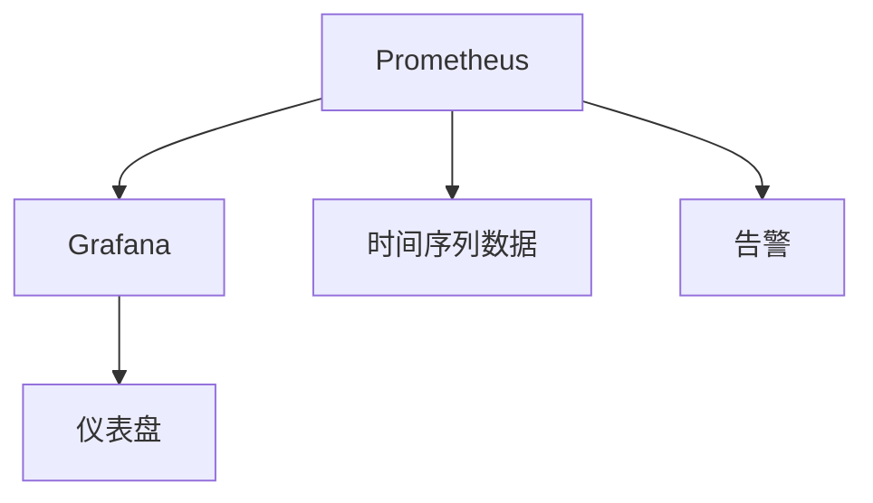

                 

# Prometheus+Grafana监控系统搭建

## 1. 背景介绍

在现代企业的信息化建设中，监控系统扮演着至关重要的角色。随着数字化转型的加速，监控系统需要实时监控海量数据，为业务决策提供及时、准确的参考。Prometheus和Grafana作为开源监控生态中的核心组件，以其灵活性、扩展性和易用性，成为了监控系统搭建的首选。本文将详细介绍如何使用Prometheus和Grafana搭建一套高效、稳定的监控系统，帮助读者理解和掌握其核心概念和操作步骤。

## 2. 核心概念与联系

### 2.1 核心概念概述

为更好地理解Prometheus和Grafana的工作原理及其联系，本节将介绍几个密切相关的核心概念：

- **Prometheus**：一个开源的监控系统，通过时间序列数据库（Time Series Database, TSD）收集和存储监控数据，并提供强大的查询和报警功能。
- **Grafana**：一个开源的数据可视化和仪表盘平台，可以与Prometheus、Elasticsearch等数据源集成，实时展示监控数据。
- **时间序列数据**：指按时间顺序排列的数据点，常用于记录和分析系统性能指标、日志等。
- **仪表盘**：即Dashboard，将时间序列数据以图形化的方式展示，便于观察和分析。
- **告警**：当监控指标超出预设阈值时，系统发出的警报，及时通知相关人员采取措施。

这些核心概念之间的逻辑关系可以通过以下Mermaid流程图来展示：



这个流程图展示出Prometheus和Grafana的核心作用及其相互关系：

1. Prometheus负责收集和存储时间序列数据。
2. Grafana将时间序列数据以仪表盘的形式展示。
3. 通过告警机制，当监控指标异常时，系统将发出警报。

## 3. 核心算法原理 & 具体操作步骤

### 3.1 算法原理概述

Prometheus和Grafana的监控系统搭建主要遵循以下步骤：

1. **数据收集**：通过Prometheus的客户端（如pushgateway、exporters等）收集数据，存储在本地或远程的Prometheus时间序列数据库中。
2. **数据展示**：将收集到的数据通过Grafana仪表盘展示，供管理员查看和分析。
3. **告警配置**：在Grafana仪表盘上配置告警规则，当监控指标异常时触发警报，提醒管理员及时处理。

### 3.2 算法步骤详解

#### 3.2.1 数据收集

**Step 1: 配置Prometheus Server**

- 安装Prometheus Server，配置必要的配置文件（prometheus.yml），包括数据存储路径、查询路由等。
- 配置Prometheus客户端（如pushgateway、exporters），确保数据能够被正确收集并发送到Prometheus Server。

**Step 2: 部署数据收集器**

- 安装数据收集器，如Node Exporter、Grafana Exporter等，确保能够收集系统中所有相关数据。
- 配置数据收集器，确保其能够正确连接被监控的服务器，并按期发送数据。

#### 3.2.2 数据展示

**Step 3: 安装Grafana**

- 安装Grafana Server，配置必要的配置文件（grafana.ini），包括数据源（Prometheus API）等。
- 创建新的仪表盘（Dashboard），选择相关的数据面板（Graph、Table等），并从Prometheus API中获取数据。

**Step 4: 定制仪表盘**

- 根据业务需求，自定义仪表盘的布局、样式和数据展示方式。
- 配置仪表盘的告警规则，当监控指标异常时触发告警，并通知相关人员。

#### 3.2.3 告警配置

**Step 5: 配置告警规则**

- 在Grafana仪表盘上配置告警规则，设置监控指标的阈值、告警方式（如邮件、短信、Webhook等）。
- 配置告警通知，确保在监控指标异常时能够及时通知到相关人员。

### 3.3 算法优缺点

**Prometheus和Grafana监控系统的优点：**

1. **灵活性**：支持多种数据源，包括时间序列数据、日志数据等。
2. **扩展性**：可以通过添加更多的数据收集器、告警规则等扩展监控能力。
3. **易用性**：界面直观，配置简单，易于上手。
4. **社区支持**：拥有强大的社区支持，源代码透明，更新迅速。

**其缺点包括：**

1. **学习曲线**：对于新手而言，需要花费一定时间学习其基本概念和操作。
2. **配置复杂**：需要仔细配置数据收集器、告警规则等，才能确保系统稳定运行。
3. **数据量庞大**：对于大规模数据，可能需要高性能的服务器和存储设备。
4. **依赖第三方组件**：依赖于pushgateway、exporters等第三方组件，增加了系统的复杂性。

### 3.4 算法应用领域

Prometheus和Grafana监控系统在多个领域得到了广泛应用，包括但不限于：

- **云基础设施监控**：监控云服务器、虚拟机、容器等资源的使用情况。
- **网络监控**：监控网络流量、负载均衡器等网络设备的性能。
- **应用程序监控**：监控Web应用、微服务、数据库等应用程序的性能。
- **日志分析**：分析系统日志，定位问题原因，优化系统性能。
- **设备监控**：监控传感器、IoT设备等设备的运行状态和性能。

这些应用领域展示了Prometheus和Grafana监控系统的高效性和灵活性，能够满足不同场景下的监控需求。

## 4. 数学模型和公式 & 详细讲解 & 举例说明

### 4.1 数学模型构建

Prometheus和Grafana监控系统主要依赖于时间序列数据的收集和展示，其核心模型可以抽象为以下两个部分：

- **数据收集模型**：描述数据如何被收集和存储。
- **数据展示模型**：描述数据如何通过Grafana仪表盘展示。

#### 4.1.1 数据收集模型

**数据收集模型**：

$$
M = F(\{D_i\}_{i=1}^N)
$$

其中：

- $M$ 表示Prometheus Server收集到的监控数据集合。
- $D_i$ 表示第 $i$ 个数据点，包含时间戳、指标值等。
- $F$ 表示数据收集和存储的函数，将数据点转换为时间序列数据。

#### 4.1.2 数据展示模型

**数据展示模型**：

$$
V = \bigcup_{i=1}^N G_i \times D_i
$$

其中：

- $V$ 表示Grafana仪表盘展示的监控数据集合。
- $G_i$ 表示第 $i$ 个数据面板，用于展示数据。
- $D_i$ 表示与第 $i$ 个数据面板关联的时间序列数据。

### 4.2 公式推导过程

#### 4.2.1 数据收集公式推导

设第 $i$ 个数据点的值为 $x_i$，时间戳为 $t_i$，则时间序列数据 $D_i$ 可以表示为：

$$
D_i = (t_i, x_i)
$$

设 $M = \{D_i\}_{i=1}^N$，则时间序列数据集合 $M$ 可以表示为：

$$
M = \{(t_i, x_i)\}_{i=1}^N
$$

假设 $F$ 函数将时间序列数据 $D_i$ 转换为时间序列数据 $M$，则：

$$
M = F(\{D_i\}_{i=1}^N)
$$

#### 4.2.2 数据展示公式推导

设第 $i$ 个数据面板 $G_i$ 展示的时间序列数据为 $D_i$，则Grafana仪表盘展示的监控数据集合 $V$ 可以表示为：

$$
V = \bigcup_{i=1}^N G_i \times D_i
$$

假设 $G_i$ 函数将时间序列数据 $D_i$ 转换为数据面板 $G_i$，则：

$$
G_i = F(D_i)
$$

因此，Grafana仪表盘展示的监控数据集合 $V$ 可以表示为：

$$
V = \bigcup_{i=1}^N F(D_i) \times D_i
$$

### 4.3 案例分析与讲解

假设我们有一组服务器CPU使用率的时间序列数据：

| 时间戳 | 指标值 |
| --- | --- |
| 2022-01-01 00:00:00 | 10 |
| 2022-01-01 00:05:00 | 20 |
| 2022-01-01 00:10:00 | 30 |
| 2022-01-01 00:15:00 | 40 |

设Prometheus Server收集到的监控数据集合 $M$ 为：

$$
M = \{(2022-01-01 00:00:00, 10), (2022-01-01 00:05:00, 20), (2022-01-01 00:10:00, 30), (2022-01-01 00:15:00, 40)\}
$$

假设Grafana仪表盘上的数据面板 $G_i$ 为：

- $G_1$ 展示CPU使用率变化趋势图；
- $G_2$ 展示CPU使用率历史数据表。

则Grafana仪表盘展示的监控数据集合 $V$ 为：

$$
V = G_1 \times M \cup G_2 \times M
$$

## 5. 项目实践：代码实例和详细解释说明

### 5.1 开发环境搭建

在进行Prometheus和Grafana监控系统搭建时，需要准备以下开发环境：

1. **安装Prometheus Server**：
   - 可以使用Docker容器快速搭建Prometheus Server，命令如下：

   ```bash
   docker run -d -p 9090:9090 prom/prometheus
   ```

2. **安装Grafana Server**：
   - 可以使用Docker容器快速搭建Grafana Server，命令如下：

   ```bash
   docker run -d -p 3000:3000 grafana/grafana
   ```

3. **安装数据收集器**：
   - 安装Node Exporter，命令如下：

   ```bash
   sudo apt-get update
   sudo apt-get install -y node_exporter
   ```

4. **配置数据源**：
   - 在Grafana中配置Prometheus数据源，并添加相应的仪表盘面板。

### 5.2 源代码详细实现

**5.2.1 Prometheus Server配置**

```bash
server_listen_addr: 0.0.0.0:9090
storage.tsdb.path: /prometheus/tsdb
```

**5.2.2 Grafana Server配置**

```bash
dataSource:
  url: http://localhost:9090/api/prometheus
```

**5.2.3 数据收集器配置**

在Node Exporter配置文件中添加以下内容：

```yaml
global:
  collectors:
    cpu:
      collect_interval: 10s
    disk:
      collect_interval: 10s
    file:
      collect_interval: 10s
    http:
      collect_interval: 10s
    load1m:
      collect_interval: 10s
    memory:
      collect_interval: 10s
    network:
      collect_interval: 10s
    socket:
      collect_interval: 10s
```

### 5.3 代码解读与分析

**5.3.1 Prometheus Server**

Prometheus Server的配置文件 `prometheus.yml` 定义了数据存储路径和查询路由。通过配置文件，可以定义多个Prometheus实例，每个实例负责处理不同的数据源。

**5.3.2 Grafana Server**

Grafana Server的配置文件 `grafana.ini` 定义了数据源URL和其他相关配置。通过配置文件，可以指定Grafana Server连接的Prometheus实例，以及面板布局、样式等。

**5.3.3 数据收集器**

Node Exporter是一个常用的数据收集器，可以收集系统中各个组件的性能指标。配置文件中定义了不同收集器的收集间隔，确保能够及时收集到最新的数据。

### 5.4 运行结果展示

**5.4.1 Prometheus Server**

Prometheus Server通过API接口提供数据查询和展示功能，可以通过浏览器访问 `http://localhost:9090` 查看监控数据。

**5.4.2 Grafana Server**

Grafana Server通过API接口提供仪表盘展示和告警功能，可以通过浏览器访问 `http://localhost:3000` 查看仪表盘。

## 6. 实际应用场景

### 6.1 云基础设施监控

**场景描述**：在云计算环境中，需要实时监控云服务器的性能，确保云服务的高可用性和稳定性。

**解决方案**：使用Prometheus和Grafana监控云服务器的CPU使用率、内存使用率、磁盘I/O等性能指标，通过仪表盘展示和告警，及时发现和解决潜在问题。

**效果评估**：通过实时监控云服务器性能指标，能够及时发现异常情况，快速响应并处理，确保云服务的高可用性和稳定性。

### 6.2 网络监控

**场景描述**：在网络环境中，需要实时监控网络设备（如路由器、交换机、负载均衡器等）的性能，确保网络的稳定性和安全性。

**解决方案**：使用Prometheus和Grafana监控网络设备的流量、丢包率、延迟等性能指标，通过仪表盘展示和告警，及时发现和解决潜在问题。

**效果评估**：通过实时监控网络设备性能指标，能够及时发现网络异常情况，快速响应并处理，确保网络的稳定性和安全性。

### 6.3 应用程序监控

**场景描述**：在应用程序开发中，需要实时监控Web应用、微服务、数据库等组件的性能，确保应用程序的高可用性和性能优化。

**解决方案**：使用Prometheus和Grafana监控Web应用的请求处理时间、响应时间、错误率等性能指标，通过仪表盘展示和告警，及时发现和解决潜在问题。

**效果评估**：通过实时监控应用程序性能指标，能够及时发现性能瓶颈，快速优化系统，确保应用程序的高可用性和性能。

### 6.4 日志分析

**场景描述**：在应用程序运行中，需要实时监控系统日志，分析日志内容，定位问题原因，优化系统性能。

**解决方案**：使用Prometheus和Grafana监控系统日志的日志量、错误率等指标，通过仪表盘展示和告警，及时发现和解决潜在问题。

**效果评估**：通过实时监控系统日志，能够及时发现系统问题，快速定位问题原因，优化系统性能，确保系统稳定运行。

## 7. 工具和资源推荐

### 7.1 学习资源推荐

为了帮助开发者系统掌握Prometheus和Grafana监控系统的理论基础和实践技巧，这里推荐一些优质的学习资源：

1. **官方文档**：Prometheus和Grafana的官方文档详细介绍了其安装、配置和使用方法，是学习基础的最佳资料。
2. **《Prometheus官方文档》**：Prometheus官方文档提供了丰富的案例和示例，帮助开发者快速上手。
3. **《Grafana官方文档》**：Grafana官方文档提供了详细的API文档和插件信息，帮助开发者深入理解Grafana的配置和功能。
4. **《Prometheus实战指南》**：一本关于Prometheus实战的书籍，通过实例讲解了Prometheus的配置和管理方法。
5. **《Grafana实战指南》**：一本关于Grafana实战的书籍，通过实例讲解了Grafana的配置和数据可视化方法。

通过对这些资源的学习实践，相信你一定能够快速掌握Prometheus和Grafana监控系统的精髓，并用于解决实际的监控问题。

### 7.2 开发工具推荐

1. **Kubernetes**：容器编排平台，可以方便地部署和管理Prometheus和Grafana的实例。
2. **Jenkins**：持续集成和持续部署工具，可以自动化地部署和更新监控系统。
3. **Prometheus Alertmanager**：告警管理工具，可以集中处理和分派告警，确保告警的有效性和可靠性。
4. **Prometheus Node Exporter**：数据收集器，可以收集系统中的各个组件的性能指标。
5. **Grafana Panels**：数据可视化组件，可以将数据以各种图形展示。

合理利用这些工具，可以显著提升Prometheus和Grafana监控系统的开发效率，加快创新迭代的步伐。

### 7.3 相关论文推荐

Prometheus和Grafana监控系统的应用和发展源于学界的持续研究。以下是几篇奠基性的相关论文，推荐阅读：

1. **《Prometheus: An Open-source Monitoring System for Internet-Scale Application Infrastructure》**：Prometheus官方论文，介绍了Prometheus的设计理念和关键技术。
2. **《Grafana: The Web’s Graphical Analysis Tool》**：Grafana官方论文，介绍了Grafana的数据可视化和仪表盘设计。
3. **《A Survey on Distributed Network Monitoring Technologies》**：综述了当前网络监控技术的现状和未来趋势。
4. **《Monitoring and Diagnostics for Network Services with Prometheus》**：研究了如何使用Prometheus和Grafana监控网络服务的性能指标。
5. **《Performance Monitoring of Microservices with Prometheus》**：研究了如何使用Prometheus和Grafana监控微服务的性能指标。

这些论文代表了大语言模型微调技术的发展脉络。通过学习这些前沿成果，可以帮助研究者把握学科前进方向，激发更多的创新灵感。

## 8. 总结：未来发展趋势与挑战

### 8.1 总结

本文对Prometheus和Grafana监控系统搭建进行了全面系统的介绍。首先阐述了Prometheus和Grafana的核心概念和作用，明确了其在监控系统搭建中的重要地位。其次，从原理到实践，详细讲解了Prometheus和Grafana的配置和操作步骤，给出了监控系统搭建的完整代码实例。同时，本文还广泛探讨了Prometheus和Grafana在多个领域的应用前景，展示了其高效性和灵活性。

通过本文的系统梳理，可以看到，Prometheus和Grafana监控系统在实际应用中具有广泛的应用场景和显著的性能优势。未来，伴随监控系统与AI、大数据、区块链等技术的深度融合，相信其应用将更加广泛，为企业的数字化转型提供更加强大的技术支持。

### 8.2 未来发展趋势

展望未来，Prometheus和Grafana监控系统将呈现以下几个发展趋势：

1. **容器化和云原生**：随着容器化和云原生技术的普及，监控系统将更加注重容器化部署和微服务架构下的监控需求。
2. **数据湖和多源数据融合**：随着数据量的爆炸性增长，监控系统将更加注重多源数据的融合和分析，提供更加全面的数据洞察。
3. **AI和机器学习**：随着AI和机器学习技术的成熟，监控系统将更加注重自动化的告警和异常检测，提升系统的智能化水平。
4. **IoT和边缘计算**：随着IoT设备和边缘计算的普及，监控系统将更加注重边缘计算下的数据收集和分析，提供实时性和可靠性。
5. **安全性**：随着网络安全威胁的增加，监控系统将更加注重数据安全性和隐私保护，确保系统的安全性和可靠性。

这些趋势凸显了Prometheus和Grafana监控系统的高效性和灵活性，能够满足不同场景下的监控需求。

### 8.3 面临的挑战

尽管Prometheus和Grafana监控系统已经取得了瞩目成就，但在迈向更加智能化、普适化应用的过程中，它仍面临着诸多挑战：

1. **学习曲线**：对于新手而言，需要花费一定时间学习其基本概念和操作。
2. **配置复杂**：需要仔细配置数据收集器、告警规则等，才能确保系统稳定运行。
3. **数据量庞大**：对于大规模数据，可能需要高性能的服务器和存储设备。
4. **依赖第三方组件**：依赖于pushgateway、exporters等第三方组件，增加了系统的复杂性。
5. **数据一致性**：在分布式环境下，数据一致性问题需要特别注意。

### 8.4 研究展望

面对Prometheus和Grafana监控系统面临的挑战，未来的研究需要在以下几个方面寻求新的突破：

1. **容器化和云原生**：探索容器化和云原生技术下的监控系统部署和运维方法，提升系统的可移植性和可扩展性。
2. **多源数据融合**：研究多源数据融合技术，实现不同数据源的统一管理和分析，提供更加全面的数据洞察。
3. **AI和机器学习**：探索AI和机器学习技术在告警和异常检测中的应用，提升系统的智能化水平。
4. **IoT和边缘计算**：研究IoT设备和边缘计算下的数据收集和分析方法，提供实时性和可靠性。
5. **安全性**：研究数据安全和隐私保护技术，确保系统的安全性和可靠性。

这些研究方向的探索，必将引领Prometheus和Grafana监控系统迈向更高的台阶，为构建安全、可靠、可解释、可控的监控系统提供新的技术支撑。面向未来，Prometheus和Grafana监控系统还需要与其他人工智能技术进行更深入的融合，如大数据、AI、区块链等，多路径协同发力，共同推动监控技术的进步。只有勇于创新、敢于突破，才能不断拓展监控系统的边界，让监控技术更好地服务于企业的数字化转型。

## 9. 附录：常见问题与解答

**Q1: 如何配置Prometheus和Grafana的告警规则？**

A: 在Grafana仪表盘上配置告警规则时，需要按照以下步骤：

1. 创建新的告警规则。
2. 选择监控指标和告警条件（如阈值、持续时间等）。
3. 配置告警通知方式（如邮件、短信、Webhook等）。
4. 保存告警规则，系统将实时监控指定指标，一旦触发告警条件，将发出告警通知。

**Q2: Prometheus和Grafana监控系统在云环境下如何部署？**

A: 在云环境下，可以使用Kubernetes容器编排平台进行Prometheus和Grafana的部署和管理。具体步骤包括：

1. 创建Docker镜像，将Prometheus和Grafana的配置文件和数据存储路径集成到镜像中。
2. 使用Kubernetes的Deployment和Service定义Prometheus和Grafana的实例，确保高可用性。
3. 使用Prometheus Alertmanager集中处理和分派告警，确保告警的有效性和可靠性。

**Q3: Prometheus和Grafana监控系统如何处理大数据量？**

A: 对于大数据量，Prometheus和Grafana监控系统可以通过以下方法进行优化：

1. 使用分片存储和分片查询技术，提升数据存储和查询的效率。
2. 使用数据压缩和去重技术，减少数据存储的占用。
3. 使用多节点集群，提升系统的扩展性和可靠性。

**Q4: Prometheus和Grafana监控系统在分布式环境下如何保证数据一致性？**

A: 在分布式环境下，Prometheus和Grafana监控系统可以通过以下方法保证数据一致性：

1. 使用分布式存储和查询技术，确保数据的一致性和可靠性。
2. 使用一致性哈希算法和节点同步技术，确保数据在各个节点之间的同步和一致。
3. 使用数据校验和锁定机制，确保数据的一致性和可靠性。

---

作者：禅与计算机程序设计艺术 / Zen and the Art of Computer Programming

